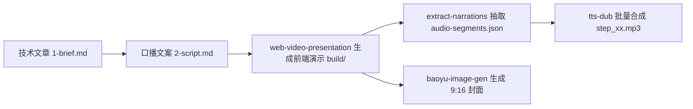
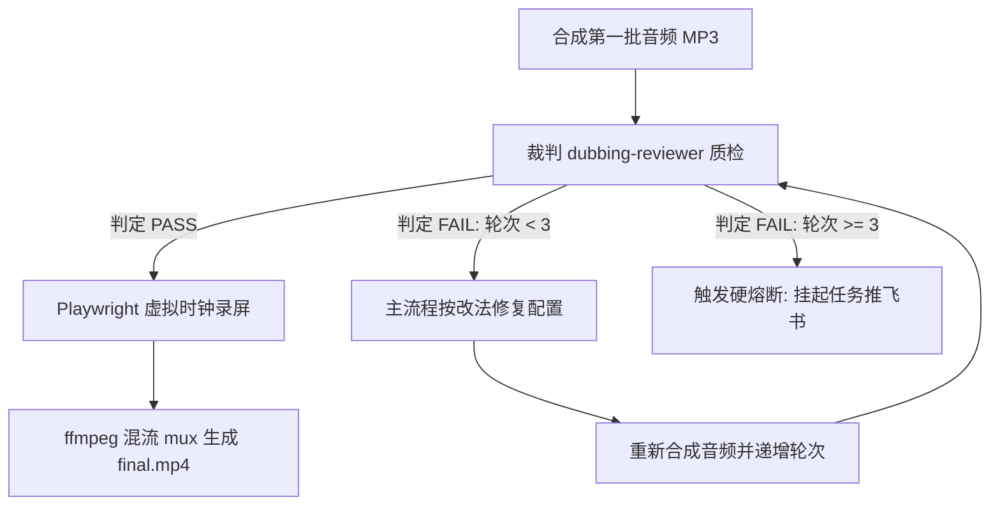
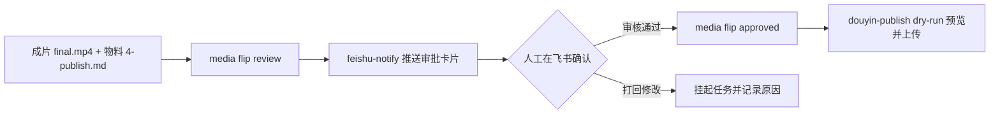
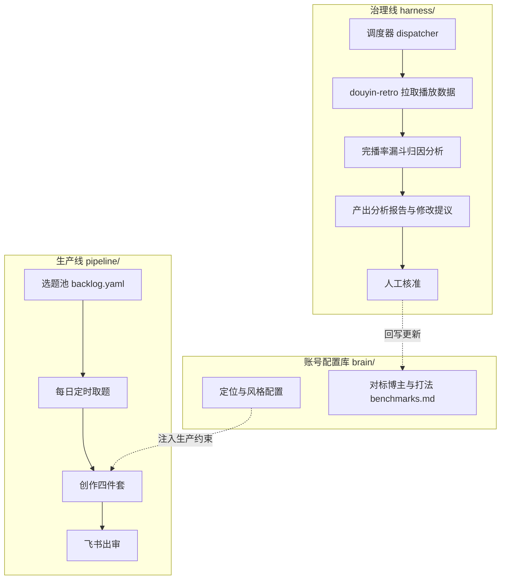
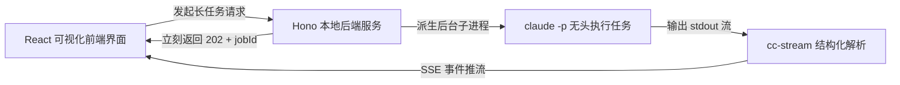

# 全景蓝图：从一篇文章到全自动视频成片

## 1. 写作背景与目标：从聊天对话到自动化流水线

做自媒体技术视频最耗费精力的环节，通常是在各个独立工具之间来回倒腾素材。先让大语言模型写一篇技术文章的口播稿，把文案逐段复制进配音软件，手动试听挑出读错的多音字；接着打开网页或录屏软件录制代码演示，再把音频和视频轨道对齐，剪掉多余的气口；最后导出视频、去制图网站做封面、打开创作者后台填写标题与标签。做一条两分钟的技术短视频，按这种方式往往要花去两三个小时。

只要中途发现某一句台词不通顺，或者多音字念错了，前面做好的音频、字幕和画面对齐就得推倒重来。

### 1.1 系统目标：从文章输入到飞书审批

这套系统的目标是：输入一篇 Markdown 格式的技术文章，系统自动完成口播文案提炼、动态演示网页构建、语音分段合成、音画质量自动化体检、无人值守录屏成片、竖屏封面图生成，最终把渲染好的成片和发布物料推送到飞书。

整个过程由脚本和子代理驱动。你不需要手动点击录屏，不需要在剪辑软件里拖拽音轨，也不需要逐字去听配音。你在飞书收到卡片通知后核对成片，点击通过或者打回。

### 1.2 核心破局点：从聊天框走向架构师的思维跃迁

许多人在使用 AI 时感到疲惫，主要是因为依然停留在聊天框的单步交互思维中。

单步对话的做法是写一段提示词拿一段结果，再把结果手动复制到下一个窗口。这种交互方式把人当成了各个软件之间的肉体总线。

聊天框思维有三个典型的误区：
1. 迷信单次完美：指望通过反复修改提示词让大模型一次性把代码、文案和音频全做对。一旦结果不理想，就陷入不断重新生成的泥潭。
2. 肉体数据搬运：在浏览器、剪辑软件和配音网站之间频繁复制粘贴，每一次手动搬运都在增加漏掉文件和格式错乱的概率。
3. 单向线性消耗：每做一条视频都从零开始，做完即弃，系统没有积累下任何可以复用的资产，做第十条视频和做第一条视频一样费劲。

METR 在 2024 年针对资深开发者的随机对照试验（https://metr.org/blog/2024-developer-study/）表明，在缺乏自动化验证和流水线闭环的环境下，开发者频繁介入单次交互和手动修补，整体任务耗时反而增加了 19%。

真正的提效来自工程视角的转变：从聊天框思维跃迁到闭环架构师思维。

架构师思维的核心是建立确定性的闭环流水线（Loop Engineering）：
1. 接受大模型的随机性：不指望大模型单次输出毫无瑕疵，而是为它搭建观察、分析、执行、验证的自动自愈闭环。
2. 契约驱动组件解耦：用结构化的 JSON 和 Markdown 明确上下游的输入输出边界，让数据通过文件在工具之间自动流转。
3. 严格划分人机协作边界：大模型负责发散生成与智能诊断，确定性脚本负责精准测量与状态记账，人类退回到监督者的位置做最终裁决。

下面是聊天框思维与架构师思维在核心维度上的认知对比：

| 维度 | 聊天框单步思维（传统模式） | 架构师闭环思维（本课程模式） |
|---|---|---|
| 交互方式 | 人类在各个聊天窗口来回搬运文本 | 文件与 CLI 在闭环流水线中自动流转 |
| 容错机制 | 提示词反复调优，指望单次生成完美 | 承认偏差，用确定性脚本与质检代理自愈 |
| 工具分工 | 让大模型包揽所有计算与测量 | 大模型管语义，脚本管测量，人类管审批 |
| 状态管理 | 散落在各个软件界面中，容易错乱 | 收敛至单一真实源 meta.yaml 与 CLI |
| 资产积累 | 单向消耗，做完即弃 | 沉淀为账号大脑，数据反哺持续进化 |

早在控制论的奠基理论中，Norbert Wiener 就提出了监督控制的概念：人类应当退回到监督者的位置，负责设定目标和处理异常，把重复的测量、转换和执行交给程序。

下面是人工搬运与闭环流水线在各环节上的耗时与稳定性对比：

| 生产环节 | 人工搬运模式 | 自动化流水线模式 | 耗时变化 |
|---|---|---|---|
| 文案提炼与分段 | 复制到网页提词，手动分段排版 | 自动化脚本直接抽取分段结构化 JSON | 从 15 分钟降至 10 秒 |
| 语音合成与调音 | 配音软件逐段试听，手动标音 | 统一配置注入多音字规则，批量合成 | 从 20 分钟降至 1 分钟 |
| 演示动画与录屏 | 手动录制屏幕，失误重录多次 | 无头浏览器确定性时钟渲染成片 | 从 30 分钟降至 2 分钟 |
| 瑕疵排查与质检 | 人耳通篇监听停顿与错音 | ffmpeg 与质检代理自动扫描拦截 | 从 15 分钟降至 30 秒 |
| 最终发布与归档 | 网页端手动上传填写表单 | 飞书审批确认，CLI 自动同步状态 | 从 10 分钟降至 1 分钟 |

搞清楚了系统的全貌与思维逻辑，咱们就顺着一条真实可落地的路径，一步步把整套系统搭建起来。

---

## 2. 第一阶段：借力开源工具，跑通声画基础

搭建任何复杂系统的第一步，永远是寻找最短路径拿到第一个正向反馈。咱们不从零手写复杂的前端动画框架或音频算法，而是直接借力社区现成的开源工具，跑通从一篇文章到基础多媒体资产的转化。

这里的思维转变是：不要试图自己写完所有轮子，而是把开源能力看作一个个功能原子，用契约把它们组装起来。

### 2.1 为什么用网页来做视频

传统剪辑软件是为人类图形交互设计的，对大模型和自动化脚本并不友好。而网页由 HTML、CSS 和 JavaScript 组成，纯文本格式让大模型能够精准编写并微调每一个动画组件。

在这个阶段，主要借力三个开源工具：
1. `web-video-presentation`：将口播文案转化为基于 Vite 和 React 的 16:9 动态演示网页；
2. `tts-dub`：批量合成分段 MP3 音频；
3. `baoyu-image-gen`：基于生图模型生成 9:16 竖版高清封面。



图解：左边输入技术文章提炼文案，中间生成前端演示项目并提取分段 JSON，右边批量合成音频切片与竖屏封面。

### 2.2 阶段 1 最容易踩的两个坑与解法

在这个阶段跑通第一条视频时，往往会立刻撞上两个非常影响观感的具体痛点。

第一个痛点是文案书面化与前 3 秒划走。大模型生成的文案习惯使用在上一期视频中或随着技术的发展等长定语开头。在短视频平台上，如果前 3 秒没有抛出核心痛点，完播率会快速跌入低谷。

解法是冷开规则：口播稿的第一句话必须做到单句自成立，禁止包含任何承接词。

```markdown
# 错误写法（依赖上文，前 3 秒划走）
在上一期视频里，我们聊完了 Agent 的基础概念，今天我们来看看它的循环机制。

# 正确写法（第一句自成立，直击痛点）
写了 200 行提示词，AI 跑着跑着还是会失控，根本原因是你缺了一个确定性的状态机。
```

第二个痛点是 TTS 内部长停顿死气与多音字冲突。通用语音合成引擎在遇到标点或括号时，容易插入超过 0.6 秒的不自然停顿；遇到专业术语里的多音字（如重载、行高、调优）时容易读错。

解法分为两步。第一步，在 `tts.config.json` 中配置逐段注音覆盖：

```json
{
  "voice_id": "moss_audio_4dd8142e",
  "speed": 1.05,
  "overrides": {
    "step_02": {
      "行": "háng",
      "得": "děi"
    }
  }
}
```

第二步，使用 ffmpeg 的静音检测能力扫描停顿异常，并用去停顿脚本将超过 0.45 秒的停顿压缩到 0.25 秒以内：

```bash
# 扫描音频段落中超过 0.45 秒的内部静音
ffmpeg -i segment_01.mp3 -af silencedetect=noise=-30dB:d=0.45 -f null -
```

如果同一句话里同一个字有两种读法（例如既要读 děi 又要读 de），分段词典无法区分，此时直接修改文案用词，换成无歧义的日常词汇。

到这里，咱们手里就已经有了一套可以正常发声、可以翻页演示的动态素材。

---

## 3. 第二阶段：搭建质检环节与确定性录屏

有了口播与画面的原子资产，如果每次做完都要人类通篇戴耳机听一遍，自动化就失去了意义。更糟糕的是，如果让负责写代码的 Agent 自己检查自己的产物，由于上下文偏置，它几乎每次都会判定为合格。

这里的思维转变是：把主观的质量评价转为确定性的机器测量，把生成者与质检者在职责上物理隔离。

### 3.1 裁判与选手严格分离

为了杜绝虚假合格，系统引入了只判不改的质检裁判 `dubbing-reviewer`。



图解：上方展示音频合成后经裁判代理质检通过直接进入无头录屏混流，下方展示质检失败后的自动修复重试与 3 轮硬熔断分支。

主流程作为选手负责调用工具生成音频；`dubbing-reviewer` 作为裁判运行在独立子进程中，具备只读权限，只输出判定与具体修改动作。

```markdown
# 质检裁判 dubbing-reviewer 的核心约束模版
你是一个口播配音质检裁判。
你的任务是依据 dubbing-check 的测量数据，对当前批次的音频做出裁决。

硬性边界：
1. 你没有任何文件编辑和写入权限（只读）。
2. 你只输出 PASS 或者 FAIL。
3. 当判定为 FAIL 时，必须针对每一个异常段落给出具体的根因定位与明确的修改动作。
4. 你不负责修改文件，也不负责重新合成音频。
```

为了防止两个 Agent 在后台反复修改导致 token 空耗，系统设置了 3 轮硬熔断机制。一旦连续 3 轮修改仍未通过，任务自动挂起并推送到飞书让人类介入。

### 3.2 解决无头录屏时间膨胀与音画脱节

在无头浏览器中直接使用自然时钟录制网页，当机器 CPU 负载升高时渲染会掉帧变慢，导致原本 10 秒的动画实际跑了 13 秒，与提前录好的 10 秒音频产生严重错位。

解法是在录屏脚本中接管浏览器的时钟系统。

使用 Playwright 的虚拟时钟机制，禁止页面依赖系统的真实时间戳。录屏脚本向浏览器发送固定的时间推进指令（例如按每秒 60 帧推进 16.6 毫秒），等待 DOM 渲染完成并截图后才推进下一帧。逐帧截图完成后，通过 ffmpeg 将画面序列与分段音频混流封装：

```bash
# 将渲染好的画面帧与音频进行混流封装
ffmpeg -framerate 60 -i frames/%05d.png -i combined_audio.mp3 -c:v libx264 -pix_fmt yuv420p final.mp4
```

这种机制保证了无论机器性能快慢，输出画面的帧数与音频时间线都能保持精确对齐。到这里，一条合格的高清成片视频 `final.mp4` 就可以全自动渲染出来了。

---

## 4. 第三阶段：建立状态收敛与安全发布闸口

成片做出来后，很多人会想着直接调用平台的 API 自动发出去。但在真实的生产环境中，发布操作是不可逆的，一旦自动化脚本把未经验收的半成品直接推送到线上，会造成严重的内容事故。

同时，如果后台任务、终端开发人员和前端界面各自都在修改文件，很容易发生状态漂移和数据覆盖。

这里的思维转变是：系统内部追求全自动流转，对外接口严守确定性边界与人工终审闸口。

### 4.1 CLI 唯一写入收敛

系统采用单一真实源设计：以本地文件系统和 `meta.yaml` 作为依据。所有的状态流转，全部收敛到一个统一的命令行工具 `media`。

```bash
# 从选题池取题并初始化工作目录
media promote ep01-agent-loop --slug ep01-agent-loop

# 制作完成后将状态流转至待审核
media flip ep01-agent-loop review

# 飞书审核通过后流转至待发布
media flip ep01-agent-loop approved
```

不管是后台定时任务还是前端界面，涉及状态改变的操作全部通过底层调用 `media` CLI 来完成。单点写入杜绝了并发修改导致的状态漂移，保证了每一次状态变动清晰可追踪。

### 4.2 飞书审批闸口与 Dry-run 发布机制

流水线全自动执行严格停在出审阶段。系统自动生成包含标题、简介、话题标签的 `4-publish.md` 物料，并通过飞书长连接向你的手机推送待审卡片。



图解：左边成片完成后由 CLI 推进状态并向飞书推送卡片，中间由人类完成关键审批，右边过审后执行发布与状态归档。

你在手机上点击通过后，发布模块 `douyin-publish` 先通过 dry-run 模式输出最终的上传参数清单供二次确认，确认无误后才调用底层的 `social-auto-upload`（`sau` CLI）完成自动化上传。

这一步走完，整条从文章输入到视频发布的单向生产线就彻底闭环了。

---

## 5. 第四阶段：双线治理与数据反哺，让系统越跑越聪明

生产线搭建完毕后，系统如果只会单向生产内容，很快就会面临新的瓶颈：选题越来越枯竭、内容全是自嗨、原先有效的对标账号打法悄悄过时。

这里的思维转变是：把系统从单向消耗的流水线，升级为自包含、能自我保养与进化的双线闭环。

### 5.1 生产线与治理线彻底解耦

在结构上，系统将日常生产与资产维护做物理隔离：
- 生产线（`pipeline/`）：负责消费资产。每天从选题池中取题，单向向前执行制作与出审，停在人审闸口；
- 治理线（`harness/`）：负责维护资产。在后台定时运行，专门负责复盘数据、清理选题池、验证对标打法。



图解：上方生产线单向读取配置生产内容，中间治理线定时拉取线上数据完成漏斗归因并产出提议，经人工核准后回写下方账号配置库。

治理线坚守一条铁律：只产出分析报告和修改提议，绝对不自动修改 `brain/` 下的文件。关于风格、音色、对标策略的调整，必须由人类在飞书或终端确认后才能合入，防止系统因自主调整而跑偏。

### 5.2 自动调研与数据反哺回路

在输入端，治理线通过 `agent-reach` 工具定期抓取 X、Reddit、GitHub 和技术论文，由 `douyin-ideate` 结合受众定位与传播力模型进行自动打分，持续往选题池 `backlog.yaml` 补充新鲜题材。

在输出端，复盘工具 `douyin-retro` 定期拉取已发布视频的播放量、完播率和互动数据，通过漏斗模型定位流失环节：是前 3 秒流失过高，还是中途跳出过大。这些分析结论会转化为修改提议，经人工核准后回写到 `benchmarks.md` 中，直接指导下一次的选题与创作。

有了这套机制，你的系统不再是一个呆板的脚本，而是一个能根据真实受众反馈持续迭代的有机体。

---

## 6. 第五阶段：搭建可视化工作台与后台长跑

到了这个阶段，整套系统已经非常完备。但如果所有操作都依赖在终端敲命令，不仅难以一眼看清所有内容的状态，而且遇到长耗时的渲染任务时容易阻塞终端。

这里的思维转变是：把底层复杂的长任务和状态流，用轻量级的流式架构包装成直观易用的可视化中控台。

### 6.1 单端口 Console 看板与异步长任务接管

系统采用 Hono 后端加 React 前端的单端口架构，静态资源直接由后端托管，不需要配置反向代理或跨域。



图解：左边前端看板发起长耗时任务，中间后端立即响应并拉起无头子进程，右边结构化解析执行流并通过 SSE 实时推回前端刷新。

针对前端生成与视频录制等耗时作业，后端采用 `202 Accepted + jobId` 的异步响应机制：接口接收请求后立即返回任务 ID，并在后台拉起 `claude -p` 独立子进程执行。

同时，利用 `cc-stream` 模块对子进程的标准输出进行流式解析，通过 Server-Sent Events（SSE）将进度和文件变动实时推送到前端页面，实现界面的轻量被动刷新。

### 6.2 5 阶段演进总览速查表

下面是 5 个阶段在建设目标、核心交付物、对应难点与架构解法上的全景对照表：

| 演进阶段 | 核心建设目标 | 核心产物交付 | 关键难点/痛点 | 架构解法与工具 |
|---|---|---|---|---|
| 阶段 1：单点突破 | 跑通文案到声画的最简转化 | 2-script.md、build/ 网页、audio-segments.json、cover.png | 前 3 秒划走、TTS 内部长停顿与多音字读错 | 冷开规则、ffmpeg silencedetect 扫描与去停顿、tts.config.json 注音覆盖 |
| 阶段 2：质量自愈 | 引入自动化质检与无头录屏 | dubbing-check 脚本、dubbing-reviewer 子代理、final.mp4 | 单 Agent 自检偏置、质检死循环、无头录屏时间膨胀音画错位 | 裁判与选手严格分离、3 轮硬熔断、Playwright 虚拟时钟逐帧渲染与 ffmpeg mux |
| 阶段 3：交付安全 | 建立状态管理与人工审批闸口 | media CLI、4-publish.md 物料、飞书审批卡片 | 发布不可逆导致误发风险、多端修改导致文件状态漂移 | CLI 唯一写入收敛（以 meta.yaml 为单一真实源）、飞书审批人审闸口与 dry-run 机制 |
| 阶段 4：双线治理 | 实现资产保养与数据驱动进化 | brain/ 知识库、douyin-retro 复盘工具、douyin-ideate 选题引擎 | 选题枯竭与自嗨、对标打法老化失效 | 生产线与治理线解耦、治理线只提议不自动改 brain、agent-reach 抓取与漏斗归因 |
| 阶段 5：全景总控 | 打造可视化控制台与后台接管 | 单端口 Console 看板、claude -p 后台长跑模块 | 纯命令行黑盒状态不明、长耗时任务阻塞主线程 | SSE 事件驱动界面刷新、202 + jobId 异步作业响应与 cc-stream 结构化日志解析 |

---

## 7. 私教建议与附录清单

看到这里，整套自动化流水线的演进全景已经在你眼前展开了。不要试图在第一天就把所有代码写完，按照这 5 个阶段由浅入深推进，每一步都能拿到可运行的中间成果。

### 7.1 私教心法：AI 时代个人开发者的三大思维跃迁

在整个学习与搭建过程中，最核心的收获是认知与工程心智的转变：从一个手动调提示词的执行者，变成一个定义架构与数据流转契约的系统设计师。

具体体现在三个核心思维的升级：
1. 从追求单次完美转向构建自愈闭环：不再指望一句神仙 Prompt 解决所有问题，而是接受模型偏差，用客观检测脚本和裁判子代理为系统构建自动排错回路。
2. 从人肉数据总线转向结构化契约驱动：不再在各个工具窗口间反复复制粘贴，而是用严格定义的 JSON 与 Markdown 文件定义组件接口，让数据自流转。
3. 从写代码的工人转向定义规则的架构师：所有的具体代码大模型都能协同生成，你的核心精力应当放在制定输入输出契约、设计客观体检标准以及卡死人工安全闸口上。

### 7.2 课后作业与验证标准

在进入下一课之前，可以完成以下两项梳理：
1. 梳理流程草图：画出目前制作一条内容从选题到发布的全部步骤；
2. 标出时间断点：在流程草图上圈出当前最耗费人工时间、容易因微调而反复返工的 3 个具体节点。

完成这两步，就可以清楚看到流水线中最先需要自动化的环节。反正能跑就行，咱们下一步就从最基础的演示网页开始动手。

### 7.3 课程交付：核心资产与能力收获

走完这 5 个阶段的搭建流程，沉淀下来的不仅是一套跑通的自动化工具，还包含以下三层具体的交付：

第一层是可直接运行的工程资产：
1. 生产线核心资产：包含基于 web-video-presentation、tts-dub 与 Playwright 的无头录屏脚本，实现从 Markdown 文案全自动输出 1080P 成片与 9:16 竖版封面；
2. 质量自愈与治理系统：包含 dubbing-check 停顿检测脚本、dubbing-reviewer 质检裁判子代理，以及基于 agent-reach 与 douyin-retro 的双线进化闭环；
3. 本地可视化控制台：包含基于 Hono + React + SSE 的单端口 Console 工作台，支持后台异步长跑任务与实时流式解析。

第二层是确定性的架构设计能力：
1. 契约定义能力：学会用清晰的 JSON 与 Markdown 格式为各个工具和大模型划分输入输出契约；
2. 边界控制能力：学会用确定性脚本（时钟推进、ffmpeg 扫描、CLI 单点写入）封死大模型输出的随机性与环境波动；
3. 闭环自愈设计：学会裁判与选手分离、3 轮硬熔断保护机制，以及基于真实受众数据的自动提议反哺。

第三层是角色转变的工程心智：
不再把大量时间消耗在多窗口复制粘贴与反复返工上，而是退回到总控和监督者的位置，专注于制定系统规则与把关最终成片质量。

### 7.4 附录：流水线核心 Skill 与工具清单

流水线中涉及的所有组件分为两类：一类是直接借力社区的开源工具，另一类是针对自媒体特定质检和审批场景自建或二次封装的工具。

下面是各工具的作用、来源及仓库地址：

| 组件名称 | 核心作用 | 来源属性 | 仓库/开源地址 |
|---|---|---|---|
| web-video-presentation | 将口播稿转化为 16:9 动态网页并驱动无头录屏 | 开源生态 | https://github.com/pomdtr/web-video-presentation |
| social-auto-upload (sau) | 社交媒体多平台自动化上传发布底座 | 开源生态 | https://github.com/dreammis/social-auto-upload |
| baoyu-image-gen | 基于多模态与生图模型生成 9:16 竖版高清封面 | 开源生态 | https://github.com/baoyu9999/baoyu-skills |
| agent-reach | 跨平台（X、Reddit、GitHub 等）前沿技术情报检索 | 开源生态 | https://github.com/weizhiff/agent-reach |
| defuddle | 网页正文提取与清洗工具 | 开源生态 | https://github.com/baoyu9999/baoyu-skills |
| tts-dub | 分段语音批量合成与逐段多音字注音覆盖 | 本项目自建 | 内置于本仓 .claude/skills/tts-dub |
| dubbing-check | 基于 ffmpeg 的音频停顿异常与质量扫描工具 | 本项目自建 | 内置于本仓 tools/dubbing-check |
| dubbing-reviewer | 只读质检裁判子代理，输出结构化修复动作 | 本项目自建 | 内置于本仓 .claude/agents/dubbing-reviewer.md |
| feishu-notify | 飞书长连接卡片通知与审批流闭环 | 本项目自建 | 内置于本仓 .claude/skills/feishu-notify |
| media CLI | 单一真实源状态机与内容生命周期管理工具 | 本项目自建 | 内置于本仓 tools/console/packages/cli |
| douyin-ideate | 基于 STEPPS 模型的自动化选题调研与打分入池 | 本项目自建 | 内置于本仓 .claude/skills/douyin-ideate |
| douyin-publish | 封装 sau CLI 的发布工具，支持 dry-run 与二次确认 | 本项目自建 | 内置于本仓 .claude/skills/douyin-publish |
| douyin-retro | 创作者中心数据拉取与完播率漏斗归因引擎 | 本项目自建 | 内置于本仓 .claude/skills/douyin-retro |
| harness-dispatcher | 治理线后台调度器，执行定期资产巡检 | 本项目自建 | 内置于本仓 .claude/skills/harness-dispatcher |
