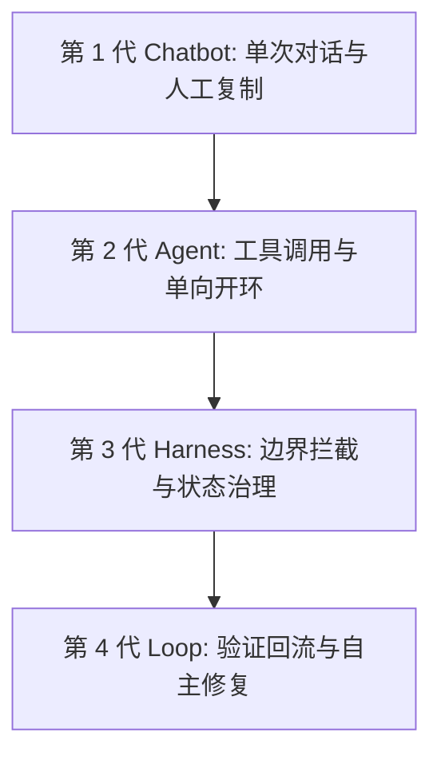
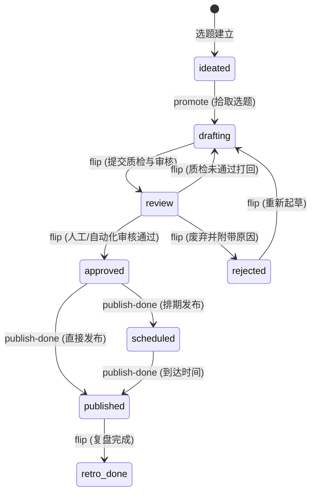
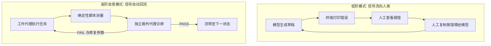
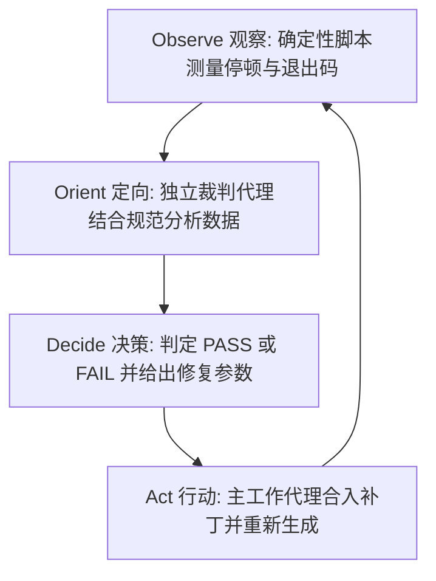
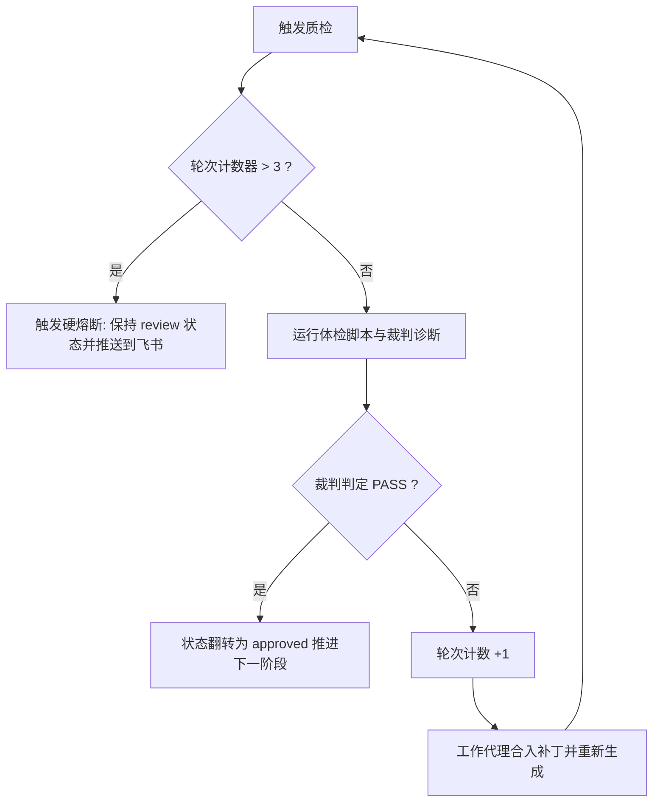

# 第 02 课：状态机思维与自愈回路：构建稳定的自媒体自动化流水线

一个包含了文案生成、演示网页制作、语音合成、视频录屏与自动发布的自动化脚本，在运行到第四步时停住了。排查终端日志发现，语音合成接口因为网络抖动返回了超时错误。由于流程中没有设计重试与断点保存机制，整个进程直接退出。此时如果想拿到成片，只能把整套脚本重新执行一遍。重新运行之后，第一步的大模型因为随机采样，生成了一版结构完全不同的文案，上一轮已经调整好的页面排版随之全部错位。

这种故障在长流程自动化任务中很常见。

长流程容易中断的根源，在于把所有任务串在了一条连续的执行链条上。任何单点的网络抖动、模型输出偏差或格式异常，都会导致整套流程中断。解决这类问题的工程手段，是用状态机思维重构流程，把连续模糊的生成动作切分成离散的确定性状态，并通过确定性工具将验证信号自动传回模型。



## 1. 工具演进的四个世代与反馈回路

理解流水线中断的原因，需要先梳理 AI 工具形态的演进路径。

### 1.1 第 1 代 Chatbot 与第 2 代 Agent 的局限

第 1 代工具以网页对话框为载体，交互模式是一问一答。所有的流程状态保存在人类大脑中，上下文依赖人类在不同窗口之间复制粘贴。模型没有外部工具调用能力，无法读写本地文件，也无法触发系统命令。

第 2 代工具引入了工具调用能力（Agent），典型实现是基于 ReAct 范式或 Function Calling 的智能体。模型根据自然语言指令，自主决定调用搜索接口、读写文件或执行终端命令。

第 2 代 Agent 在执行多步骤长任务时依然容易中断，根源在于它是单向开环结构。当调用的外部命令出错或返回非预期数据时，Agent 缺乏内置的恢复策略，通常直接在终端报错退出，或者在错误输出的基础上继续调用其他工具，直到耗尽上下文长度。人类依然需要全程守在终端前观察输出，在出错时手动干预。

### 1.2 第 3 代 Harness 到第 4 代 Loop 的演进

控制论学者 Sheridan 在 1974 年提出监督控制模型。自动化系统的目的在于分工：把人类的角色从低层级的连续操作员，转变为高层级设定目标、监控运行并在异常时仲裁的监督者。

第 3 代工具形态是 Harness（测试治理与约束框架）。Harness 为 Agent 设定了运行沙盒、权限拦截、环境重置机制以及持久化的状态管理。模型的操作被限制在明确的安全边界内，文件修改和状态流转都有记录。

第 4 代工具形态是具备自愈能力的自治循环（Loop）。Loop 让 Agent 具备了任务拾取、自我执行、客观体检、自主修复以及达到边界时自动上报的能力。

| 世代维度 | 第 1 代 Chatbot | 第 2 代 Agent | 第 3 代 Harness | 第 4 代 Loop |
|---|---|---|---|---|
| 交互载体 | 网页对话框 | CLI 或简单脚本 | 约束沙盒与框架 | 自治控制循环 |
| 状态管理 | 人脑记忆 | 内存单次会话 | 文件或数据库持久化 | 离散状态机与检查点 |
| 异常处理 | 人工重新提问 | 原地崩溃或偏离目标 | 权限拦截与日志记录 | 自动化体检与定向重试 |
| 人类角色 | 剪切板搬运工 | 实时盯盘操作员 | 规则与边界制定者 | 终态仲裁与异常审批者 |
| 信号流向 | 仅流向人类 | 单向开环输出 | 记录到审计日志 | 闭环流回模型自身 |

把提示词写长无法解决长流程的稳定性问题。提示词是静态的输入约束，无法预测运行时的外部动态扰动。缺少反馈回路的系统，无法在遭遇局部偏离时自我纠正。

如果你在运行多步骤自动化脚本时发现程序经常无响应，可以在每个子任务中增加超时控制与状态落盘。把任务中间状态保存到磁盘后，进程中断也能从最近的检查点继续运行。

从 Harness 到 Loop 的演进，把系统的抗风险机制从依赖人工手动排错，转变为依靠系统内部的状态机与自愈机制。

## 2. 状态机思维：把模糊创作拆成确定性状态

自媒体创作通常被视为连续的非结构化流程。把非结构化流程直接写进自动化脚本，会放大模型的不确定性。

### 2.1 连续模糊流导致模型崩溃的原因

自回归大模型在生成第 N 个 token 时，计算的是前 N-1 个 token 的概率分布。长任务链条中的每一次生成，都存在微小的概率波动。

流程步骤越多，模型需要维持的上下文越多，前置步骤的微小偏差在经过多轮传递后会被放大。一条包含 5 个子步骤的流水线，如果每个步骤的成功率为 90%，整套流水线一次性跑通的概率只有约 59%。当步骤增加到 10 个时，全流程跑通的概率将降至约 35%。

如果在一个长提示词里同时要求模型完成选题提炼、口播文案起草、网页排版代码编写、语音配置生成以及语法检查，模型的注意力会被多个维度的目标分散。在关注代码格式时可能忽略文案字数限制，在处理文案风格时可能破坏配置文件的字段结构。

解决这个问题的办法是拆解连续流程，引入状态机。

### 2.2 AI 工程中的有限状态机设计

有限状态机（Finite State Machine, FSM）包含三个要素：
1. 离散状态（State）：系统在某一时刻所处的固定阶段，状态数量有限且明确。
2. 触发事件（Event）：引起状态转移的操作或外部信号。
3. 守卫条件（Guard）：状态转移前必须满足的布尔断言，断言失败则拒绝流转。

在真实的视频生产工程 `tools/console/packages/core/src/state.ts` 中，内容条目的生命周期被拆解为明确的离散状态表：

```typescript
export const META_TRANSITIONS: Record<MetaStatus, Partial<Record<MetaStatus, TransitionSpec>>> = {
  ideated: {
    drafting: { requiresReason: false, line: 'production', viaCommand: 'flip' },
  },
  drafting: {
    review: { requiresReason: false, line: 'production', viaCommand: 'flip' },
  },
  review: {
    drafting: { requiresReason: false, line: 'production', viaCommand: 'flip' },
    approved: { requiresReason: false, line: 'production', viaCommand: 'flip' },
    rejected: { requiresReason: true, line: 'production', viaCommand: 'flip' },
  },
  approved: {
    drafting: { requiresReason: false, line: 'production', viaCommand: 'flip' },
    scheduled: { requiresReason: false, line: 'production', viaCommand: 'publish-done' },
    published: { requiresReason: false, line: 'production', viaCommand: 'publish-done' },
  },
  scheduled: {
    published: { requiresReason: false, line: 'production', viaCommand: 'publish-done' },
  },
  published: {
    retro_done: { requiresReason: false, line: 'harness', viaCommand: 'flip' },
  },
  rejected: {
    drafting: { requiresReason: false, line: 'production', viaCommand: 'flip' },
  },
  retro_done: {},
}

export function assertMetaTransition(from: MetaStatus, to: MetaStatus): TransitionSpec {
  const spec = META_TRANSITIONS[from]?.[to]
  if (!spec) {
    const legal = Object.keys(META_TRANSITIONS[from] ?? {})
    const legalStr = legal.length > 0 ? legal.join(', ') : '无合法出边（终态）'
    throw new MediaError(
      'E_ILLEGAL_TRANSITION',
      `${from} 到 ${to} 的流转非法：${from} 当前合法目标状态为 ${legalStr}`,
      { rule: 'state:meta' },
    )
  }
  return spec
}
```



这套状态机遵循三项工程原则：

第一项是单一职责。处于 `drafting` 状态时，程序只处理口播文本起草、网页制作与音频合成，输出产物落盘到工作目录；处于 `review` 状态时，程序只运行质检脚本与出具体检报告。每个状态只负责单一步骤。

第二项是状态元数据持久化。状态机必须有物理落盘载体，不能只存在于内存变量中。在实际工程中，每个内容条目目录下都有一个 `meta.yaml` 文件，记录当前条目所处的状态、当前轮次与创建时间。当脚本由于外部原因意外退出时，重新运行的启动入口先读取 `meta.yaml`。如果当前处于 `drafting` 且文案文件已存在，程序直接复用已有文案进入下一步，避免重复调用模型生成不一致的新文案。

第三项是双层守卫拦截。第一层守卫是代码中的 `assertMetaTransition`，用于拦截非法的状态转移图路径，例如直接从 `drafting` 跳到 `published` 会抛出 `E_ILLEGAL_TRANSITION` 异常。第二层守卫位于 CLI 编排层（`media flip` 命令）：在执行状态翻转前，CLI 会调用检查脚本校验前置物料，确认口播稿、配音文件和体检通过标记全部存在，才会执行状态变更。

如果修改状态迁移表时遇到 TypeScript 编译报错，检查联合类型定义中是否遗漏了新增状态的分支。把每种状态的合法出边画在纸上对照，能帮助理清转移路径。

## 3. 验证信号流向：自动化的高低阶分水岭

状态机切分了生产步骤，接下来的重点是节点之间的校验方式以及检验数据的传递路径。

### 3.1 验证信号与信号回流机制

自动化流程中，用于判断产物是否合规的客观数据（字数统计、敏感词命中数、音频静音时长、脚本退出码）被称为验证信号。

根据验证信号的流向，系统分为两种工作模式：

低阶模式：脚本运行结束后，在终端打印错误信息。人类工程师在屏幕前读取报错，分析原因，再把错误信息手动复制进大模型对话框，要求模型给出修复方案。在这个模式下，自动化仅停留在单点脚本调用，各环节的连接依赖人工中转。

高阶自愈模式：确定性的检测工具自动运行，将测量结果整理为结构化的数据格式（JSON 或 YAML）。这组数据直接作为上下文输入给修复代理。模型读取客观数据后定位问题，输出修复补丁并重新触发执行，直到测试通过或触发熔断。



### 3.2 确定性工具在观察阶段的职责

大模型适合处理语义理解和文本生成，但在物理量测量与精确计数上表现不稳定。模型无法准确计算一段音频在指定时间点是否存在 450 毫秒的静音，也无法保证对长文本敏感词的统计完全没有遗漏。

客观指标由确定性的 CLI 工具或脚本测量更可靠。

空军战术家 John Boyd 提出的 OODA 循环包含四个阶段：观察（Observe）、定向（Orient）、决策（Decide）、行动（Act）。在自动化系统中，这四个阶段的职责映射如下：



1. Observe（观察）：由确定性脚本执行。使用 `ffmpeg -af silencedetect` 探测音频内部的静音停顿区间，使用 TypeScript 编译器 `tsc --noEmit` 检查语法类型，使用字数统计脚本计算字符长度。此步骤不经过大模型，保证测量结果客观稳定。
2. Orient（定向）：由独立的裁判子代理（Reviewer Agent）执行。裁判代理读取第一步生成的客观数据，对照内容规范进行规则匹配与上下文分析。例如在口播质检中，裁判代理读取音频分段文件与波形测量数据，分析出具体哪一个词的多音字注音发生偏差，或者哪一段的语速明显偏离平均基线。
3. Decide（决策）：裁判代理做出裁决。全部指标达标时输出 PASS；未达标时输出 FAIL 并附带具体的修复参数。
4. Act（行动）：由主流程工作代理（Worker Agent）执行。工作代理根据修复参数修改配置文件或文本，然后重新触发当前阶段的执行命令。

四个阶段分工明确，形成了自动修复循环。确定性工具负责出具客观事实，智能体负责基于事实做结构化诊断，各司其职。

编写音视频检测脚本时，如果 `ffmpeg` 的 `silencedetect` 输出了大量日志，可以用正则表达式提取带有 `silence_duration` 的行，抓取对应的浮点数值。

## 4. 自愈闭环的三个关键设计

建立起 OODA 循环后，为防止系统在自动修复过程中陷入死循环或产生新的错误，需要落实三个工程设计。

### 4.1 结构化信封：杜绝自然语言模糊反馈

质检未通过时，如果裁判代理仅向工作代理发送自然语言反馈（如“第三段读音不太自然，请修改”），会带来几个问题：
1. 模型无法获取精确的定位坐标，难以判断问题是语速过快、停顿过长还是多音字读错。
2. 模型容易回复已经完成调整的确认文本，但底层并没有修改关键配置。
3. 模型可能改动原本没有问题的其他段落，引发连带错误。

诊断信息需要使用统一的 JSON 结构化信封传输：

```json
{
  "schema_version": "1.0",
  "review_timestamp": "2026-09-02T10:15:30Z",
  "decision": "FAIL",
  "summary": "发现多音字读音错误与局部静音停顿超标",
  "issues": [
    {
      "issue_id": "ERR_POLYPHONE_001",
      "target_file": "build/audio-segments.json",
      "segment_index": 3,
      "error_type": "polyphone_mispronunciation",
      "measured_value": {
        "word": "行业",
        "current_pinyin": "xíng yè",
        "audio_timestamp_range": [4.2, 5.1]
      },
      "expected_value": {
        "correct_pinyin": "háng yè"
      },
      "fix_action": {
        "action_type": "update_config",
        "config_file": "build/tts.config.json",
        "json_path": "overrides.3",
        "patch": {
          "行": "háng"
        }
      }
    },
    {
      "issue_id": "ERR_SILENCE_002",
      "target_file": "build/public/audio/01/step-04.mp3",
      "segment_index": 4,
      "error_type": "excessive_silence",
      "measured_value": {
        "silence_duration_seconds": 0.62,
        "silence_start_seconds": 2.1
      },
      "expected_value": {
        "max_silence_seconds": 0.45
      },
      "fix_action": {
        "action_type": "run_command",
        "command": "node rec/depause.mjs --input build/public/audio/01/step-04.mp3 --cap 0.25 --minact 0.45"
      }
    }
  ]
}
```

信封中 `rec/depause.mjs` 是专门处理音频死气的裁剪脚本：`--minact 0.45` 表示将超过 450 毫秒的内部静音视为空白死气，`--cap 0.25` 表示将该空白压减至 250 毫秒自然停顿。

结构化信封为工作代理提供了定位坐标、实测数值与字段级修复动作，避免了对模糊语义的猜测。

### 4.2 带着改法的判决：避免盲目重试

如果裁判代理只给出 FAIL 判定而不提供具体修改参数，工作代理只能在概率空间内重新生成。

例如在多音字发音错误的场景中，语音合成接口对上下文中的生僻词判断失误。如果只提示第三段发音有误，模型可能会重写整句话，导致新的句子超出页面显示区域。

有效的协作机制是分离裁判与执行职责：
1. 裁判代理只负责评估并给出修复参数，不直接修改工程文件（没有写权限，保持评估客观性）。
2. 裁判代理判定 FAIL 时，在信封内输出具体的补丁配置（如 `overrides: {"行": "háng"}`）。
3. 主工作代理获取信封后，将补丁写入 `tts.config.json` 的对应段落，保持其他文本和配置不变，仅重新合成第 3 段音频。

在配音流程中，每个内容工程都有独立的 `tts.config.json` 配置文件。配置中的 `overrides` 字段按段落编号映射多音字读音与单段语速。例如 `overrides.3` 专门覆盖第 3 段的读音。当裁判代理检测出发音异常时，直接生成对应段落的字典映射补丁。主工作代理拿到补丁后，只修改配置文件中的指定键值，并删除第 3 段已生成的单条音频文件（防止因文件名存在被合成脚本跳过），随后单独重新合成该段音频。这种局部修改方式，保证了其他段落已生成的音频和动画节奏不会受到干扰。

### 4.3 轮次熔断机制：防范对抗性死循环

自动修复过程中存在对抗性波动的可能。修复 A 问题可能引入 B 问题，而修复 B 问题的改动又可能让 A 问题重新出现。在无人干预的情况下，两个代理可能持续互相调用，耗费 API 额度。

流水线中需要设置轮次上限计数器（Loop Counter），建议将自动重试上限设为 3 轮。



当重试计数器达到 3 轮仍未通过测试时，系统执行熔断：
1. 停止自动重试循环，避免产生额外调用费用。
2. 保持当前元数据状态为 `review`，并将 3 轮质检的完整诊断记录写入 `3-review.md`。
3. 通过飞书机器人或 Webhook 发送异常卡片，通知人工介入处理。

轮次计数器需要持久化保存到文件元数据中。如果仅保存在单次执行的内存变量里，进程重启后计数器会被重置，导致熔断机制失效。

## 5. 实战演练：设计一个文案与代码自愈环

下面通过口播文案规范化与语音配置生成的场景，演示输入契约、客观验证断言以及三套驱动提示词模板的具体实现。

### 5.1 定义输入契约与完成标准

在启动生成之前，需要明确输入契约与完成标准（Definition of Done）。

输入契约：
- 输入文件：`content/2026-09-02/demo-topic/1-brief.md`（包含选题核心观点、目标受众与论点结构）。
- 规范文件：`brain/style-guide.md`（包含禁用词清单、字数限制与标点规范）。

完成标准：
- 产出文件：`content/2026-09-02/demo-topic/2-script.md` 与 `build/audio-segments.json`。
- 客观断言 1：总字数控制在 600 至 800 字之间。
- 客观断言 2：文本中不得出现违禁标点（破折号、直角引号）与绝对化词汇（如绝对、万能、全网第一、百分之百）。
- 客观断言 3：分段文件 `audio-segments.json` 包含 5 个段落，且单段字数不得超过 160 字。

### 5.2 编写测试断言与客观验证命令

编写验证脚本 `scripts/verify-script.mjs`，负责执行客观测量：

```javascript
import fs from 'node:fs'
import path from 'node:path'

const scriptPath = path.resolve(process.argv[2] || 'content/demo/2-script.md')
const jsonPath = path.resolve(process.argv[3] || 'build/audio-segments.json')

const issues = []

if (!fs.existsSync(scriptPath)) {
  console.error(JSON.stringify({ status: 'ERROR', message: `文件不存在: ${scriptPath}` }))
  process.exit(1)
}

const content = fs.readFileSync(scriptPath, 'utf-8')
const charCount = content.replace(/\s+/g, '').length

if (charCount < 600 || charCount > 800) {
  issues.push({
    code: 'ERR_CHAR_COUNT_OUT_OF_RANGE',
    message: `总字符数不合规: 当前为 ${charCount} 字，要求在 600 至 800 字之间`,
    current: charCount,
    expected: [600, 800],
  })
}

const bannedPunctuation = [
  { reg: /—|–|——/, name: '破折号' },
  { reg: /[「」『』〈〉]/, name: '直角引号' },
  { reg: /[\U0001F300-\U0001FAFF☀-➿]/, name: 'emoji符号' },
]

for (const bp of bannedPunctuation) {
  if (bp.reg.test(content)) {
    issues.push({
      code: 'ERR_BANNED_PUNCTUATION',
      message: `检测到违禁标点或符号: ${bp.name}`,
    })
  }
}

const bannedWords = ['绝对', '毫无疑问', '万能', '全网第一']
for (const word of bannedWords) {
  if (content.includes(word)) {
    issues.push({
      code: 'ERR_ABSOLUTE_WORD',
      message: `检测到绝对化词汇: ${word}`,
    })
  }
}

if (fs.existsSync(jsonPath)) {
  try {
    const segments = JSON.parse(fs.readFileSync(jsonPath, 'utf-8'))
    if (!Array.isArray(segments) || segments.length !== 5) {
      issues.push({
        code: 'ERR_SEGMENT_COUNT_INVALID',
        message: `分段数量不正确: 当前为 ${segments.length} 段，要求严格为 5 段`,
        current: segments.length,
        expected: 5,
      })
    } else {
      segments.forEach((seg, idx) => {
        const segLen = (seg.text || '').replace(/\s+/g, '').length
        if (segLen > 160) {
          issues.push({
            code: 'ERR_SEGMENT_TOO_LONG',
            message: `第 ${idx + 1} 段字数超标: 当前为 ${segLen} 字，单段上限为 160 字`,
            segment_index: idx + 1,
            current: segLen,
            max: 160,
          })
        }
      })
    }
  } catch (e) {
    issues.push({
      code: 'ERR_JSON_PARSE_FAILED',
      message: `JSON 文件解析失败: ${e.message}`,
    })
  }
} else {
  issues.push({
    code: 'ERR_FILE_MISSING',
    message: `缺少分段配置文件: ${jsonPath}`,
  })
}

const result = {
  status: issues.length === 0 ? 'PASS' : 'FAIL',
  issue_count: issues.length,
  issues: issues,
}

console.log(JSON.stringify(result, null, 2))
process.exit(issues.length === 0 ? 0 : 2)
```

脚本通过退出码表明检查结果：0 代表通过，2 代表断言未通过，1 代表基础文件缺失。

### 5.3 引导 AI 自主捕获报错并修复的提示词模板

配合状态机与断言脚本，可以使用以下三套提示词驱动生成与自愈流程。

#### 模板一：第一步驱动工作启动的提示词模板

用于驱动 Worker Agent 执行初次生成，重点在于校验前置文件与明确输出契约。

```markdown
# 角色与职责
你是一名自媒体技术内容工程师，负责将选题提纲转换为符合规范的口播文案与分段音频配置。

# 前置状态检查
在开始执行任务前，按顺序检查以下文件是否存在：
1. 确认输入文件 <INPUT_BRIEF_PATH> 存在，读取其中的核心观点与论点骨架。
2. 确认规范文件 <STYLE_GUIDE_PATH> 存在，读取其中的字数约束与标点禁令。
如果任一前置文件不存在，停止执行并输出：`PRECONDITION_FAILED: <缺失文件路径>`，严禁在缺少输入时自行编造内容。

# 任务目标与输出契约
根据输入提纲撰写口播稿，并输出以下两个文件：
1. 文件一路径：`<OUTPUT_SCRIPT_PATH>`
   - 字数要求：全文有效字符数控制在 600 至 800 字之间。
   - 结构要求：包含 5 个小节（钩子引言、核心痛点、原理解析、实操演示、总结归纳）。
   - 标点要求：只使用标准中文标点（，。！？；：），严禁使用破折号、直角引号、emoji 或装饰性符号。
   - 用词要求：严禁使用绝对化词汇（如绝对、万能、全网第一、百分之百）。
2. 文件二路径：`<OUTPUT_SEGMENTS_JSON_PATH>`
   - 格式要求：标准 JSON 数组，包含 5 个对象，每个对象包含 `segment_id` (1-5) 与 `text` (对应小节文案，单段不超过 160 字)。

# 执行动作
读取输入文件 -> 生成符合约束的文案 -> 将内容写入指定路径。完成后输出：`GENERATION_COMPLETED` 并附带各文件字数。
```

#### 模板二：第二步状态流转与质检驱动提示词模板

用于驱动 Reviewer Agent 介入。Reviewer 仅拥有只读与测量权限，不直接修改代码或文案。提示词中的 `<SLUG>` 为当前内容条目的唯一标识目录名（如 `demo-topic`）。

```markdown
# 角色与职责
你是一名代码与内容质检裁判（Reviewer Agent），负责对当前工作产物执行客观测量并输出仲裁信封。你只有只读权限，严禁修改任何业务文件。

# 测量与执行指令
在当前工作目录下执行客观验证脚本：
`node <VERIFY_SCRIPT_PATH> <OUTPUT_SCRIPT_PATH> <OUTPUT_SEGMENTS_JSON_PATH>`

# 仲裁决策逻辑
1. 如果脚本退出码为 0，且控制台输出 `status: "PASS"`：
   - 输出仲裁结果：`REVIEW_PASSED`。
   - 生成状态推进指令：`media flip <SLUG> review`。
2. 如果脚本退出码非 0，或输出中包含 `issues`：
   - 逐条分析每个 issue 的错误代码与测量数值。
   - 输出符合 Schema 的 JSON 质检信封，在 `fix_action` 字段中给出具体的修复补丁或修改指引（如字符裁剪范围、标点替换映射或配置字段路径）。
   - 严禁输出模糊的自然语言评价，严禁直接修改受检文件。
```

#### 模板三：第三步捕获报错并引导 AI 定位根因出补丁的提示词模板

质检未通过时，使用此模板引导 Worker Agent 基于结构化信封排查根因，并以局部补丁完成修复。

```markdown
# 角色与任务
你收到了一份来自独立质检裁判的失败诊断信封。你的任务是根据信封内的结构化数据排查根因，对目标文件执行局部修复，消除所有测试失败项。

# 质检诊断信封输入
<INSERT_REVIEW_JSON_ENVELOPE_HERE>

# 根因排查与修复规范
在修改前，按以下三步分析并输出说明：
1. 根因确认：针对信封中的每一个 `issue_id`，指出导致断言失败的具体原因（如：第 2 小节使用了破折号；全文总字数 842 字，超出上限 42 字）。
2. 影响面评估：说明本次修改涉及的具体段落与字段，严禁改动没有报错的合格段落。
3. 补丁实施：
   - 针对标点错误：直接执行字符替换。
   - 针对字数超标：在对应段落内精简冗余修饰词，保留核心观点。
   - 针对配置缺失：根据信封中的 `fix_action.patch` 精确合入字段。

# 执行与复检
完成文件修改后，在终端重新运行验证命令：
`node <VERIFY_SCRIPT_PATH> <OUTPUT_SCRIPT_PATH> <OUTPUT_SEGMENTS_JSON_PATH>`
如果验证通过（退出码 0），输出：`SELF_HEALING_COMPLETED` 并附带 Git Diff 摘要；如果依然报错，输出剩余 issue 列表。
```

将前置检查、客观断言与根因模板组合在一起，可以使流水线在出现局部偏差时自动完成纠正。

## 6. 总结与作业

工业级自媒体流水线的稳定性来自系统边界与信号回流机制。把连续的模糊创作切分为离散的状态机，用确定性工具测量代替主观判断，用携带修复参数的结构化信封打通自愈环，并以轮次熔断守住系统边界，能有效降低长流程任务的中断概率。

### 课后作业

1. 状态机建模：
   选择生产流程中的一个环节（如封面图生成、文案起草或视频剪辑），使用 Mermaid 语法绘制状态机转移图。图中需要标明离散状态、流转事件、守卫条件以及失败时的回流路径。

2. 编写结构化质检信封：
   假设在技术口播稿质检中发现了两处问题：正文包含了未经说明的英文缩写，第二段预估朗读时长超过了 25 秒。根据本课规范编写一份 JSON 质检报错信封，包含定位信息、客观测量值与具体的 `fix_action` 参数。

3. 运行最小自愈流程：
   在本地创建验证脚本，使用 5.3 节提供的三套提示词模板引导 AI 完成一次文案修复，记录 AI 从解析 JSON 报错到输出修改 diff 的过程。
