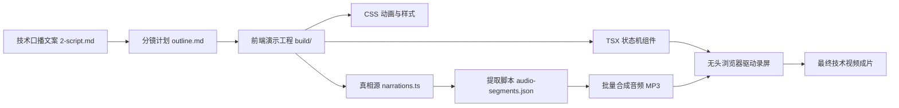

# 第 03 课：web-video-presentation实战：如何用网页做有电影感的技术解说视频？

## 1. 架构选型：为什么用前端代码替代传统剪辑软件？

制作一条两分钟的技术短视频，传统剪辑流程往往需要消耗两三个小时。先在配音软件里合成语音，再打开剪映或 Premiere 导入录屏素材，手动拖拽音轨对齐字幕，最后在视频轨道上逐帧打关键帧做局部放大和箭头标注。只要中途发现某句技术原理解释得不够准确，修改一句口播文案，整条时间线上的字幕、切片和动画关键帧就得全部重新对齐一遍。

### 1.1 传统图形剪辑工具与纯文本代码渲染的工程断层

图形视频剪辑软件是为人类手工作业设计的，核心交互依赖鼠标拖拽、视觉对齐和多轨混音。这类软件的项目工程文件大多采用专有二进制格式或复杂的闭源数据结构，大语言模型和自动化脚本无法直接读取、解析和生成。图形工具内部没有暴露确定性的纯文本接口。外部程序无法精确感知当前画面停留在哪一帧，也拿不到某个文本框的坐标。在大模型修改文案后，程序更无法自动重新编排画面的视觉状态。

前端代码是由 HTML、CSS、JavaScript 和 TypeScript 构成的纯文本。大语言模型在海量开源前端组件和动画库的训练下，对 DOM 树结构、CSS 布局、弹性盒模型、SVG 矢量绘制以及过渡动画具备极高的代码生成能力。在纯文本代码体系下，画面的每一个视觉元素、字号大小、颜色透明度和运动轨迹都是一组清晰的代码声明。修改一段口播台词或调整一处架构图连线，只需要对文本文件执行一次修改。借助 Vite 的模块热替换机制，画面改动可以在几百毫秒内直接在浏览器中渲染生效。

METR 在 2024 年针对开发者做过一项上下文切换实验（https://metr.org/blog/2024-developer-study/）。实验表明，在缺乏结构化文本接口的环境中，人类需要频繁介入单次图形调整和素材手动搬运，整体任务的沟通损耗与返工耗时会上升 19% 以上。利用纯文本代码替代图形剪辑软件，可以让整个视频生产流程完全接入 Git 版本控制。每一次布局调整和文案迭代都有迹可循，也为后续由脚本驱动的无人值守批量录屏打下了坚实的技术底座。

下面是传统图形剪辑工具与前端代码渲染在核心维度上的工程对比：

| 评估维度 | 传统图形剪辑工具（剪映 / PR / AE） | 前端代码渲染（Web-as-Video） |
|---|---|---|
| 数据接口形态 | 专有二进制或闭源工程配置，无标准文本接口 | 标准 HTML / CSS / TypeScript 纯文本 |
| AI 生成与修改 | 无法直接由大模型生成完整工程文件 | 大模型可直接输出并微调组件与动画代码 |
| 视觉状态控制 | 人工手动拖拽时间线和打关键帧 | 基于全局状态变量的离散步进控制 |
| 修改迭代成本 | 改一句台词需手动重调整条时间线 | 修改文案字典后热更新秒级自动渲染 |
| 批量自动化能力 | 依赖复杂的外部 UI 自动化或宏插件 | 脚本直接调用无头浏览器进行批量成片 |

如果使用无头浏览器录制前端演示页面时出现首屏白屏，多半是页面引用的外部字体或异步组件尚未加载完成就触发了录制动作。解决办法是在页面挂载完成且字体加载就绪后，在全局对象上标记 `window.__READY__ = true`，让录屏脚本等待该信号后再开始捕获画面。

把连续的视频时间轴降维成离散的前端状态，这一步逻辑确实需要一点时间适应。不过只要把状态控制和画面解耦开，后面的自动化代码写起来就非常轻松了。

### 1.2 Web-as-Video 核心机制：离散步进状态机与 16:9 舞台

Web-as-Video 的核心理念是：把一段连续播放的视频解构为一个由离散步（Step）驱动的状态机。传统视频依赖微秒级的时间轴推进，而技术解说类视频在本质上是由讲者的语速节拍驱动的。讲者每念完一个技术要点，画面向前推进一步。因此，整个前端工程只需要维护一个全局的整数状态 `step`，页面的当前视觉呈现就是该 `step` 值的纯函数。

为了保证录屏产物在各类播放设备上的显示比例完全一致，演示页面采用 1920×1080 的固定分辨率设计。外层容器通过 CSS 的 `transform: scale()` 动态计算缩放比例，自动居中适配任意大小的浏览器视口，四周自然留黑。这样设计省去了移动端与桌面端之间繁琐的响应式断点适配，开发者只需要在一个标准的 16:9 画布上完成精细的绝对或相对排版。

录屏页面去除了传统网站中的导航栏、页眉、页脚、版权声明和滚动条等无关干扰元素。屏幕底部的进度条平时处于完全透明状态。只有当鼠标指针移动到视口最底部边缘时，进度条才会显现出来，方便人工预览时快速跳转章节。在自动化录屏或正常播放时，画面呈现的是纯净的大屏。

下面是整个 Web-as-Video 架构的数据流向机制：



图解：左边输入口播文案并规划分镜，中间生成包含 TSX 状态机与真相源配置的前端项目，右边通过无头浏览器与音频切片合成最终视频。

在浏览器缩放视口中如果观察到文字边缘发虚模糊，多半是缩放计算产生了非整数的像素偏移量。可以在最外层舞台容器上显式声明 `transform-origin: center center`，并加上 `will-change: transform` 属性，强制浏览器开启硬件图层合成。

### 1.3 开源脚手架架构解耦：Vite、React 与主题设计系统

社区开源脚手架 `web-video-presentation` 采用 Vite、React、TypeScript 和 Tailwind CSS 构建，并集成了 Lucide 矢量图标库。为了保证项目结构清晰并与生产流水线其他环节保持隔离，演示工程默认落位于项目的 `build/` 目录下。

脚手架在源码组织上推行严格的物理隔离策略。每一个视频章节都存放在独立的子目录下，例如 `src/chapters/01-hook/`。每个章节文件夹内包含三个核心文件：`<Chapter>.tsx` 负责视觉组件与状态判断，`<Chapter>.css` 负责局部动效样式，`narrations.ts` 负责定义本章的口播台词与总步数。章节之间禁止跨目录直接引用组件或共享局部状态，防止修改其中一章导致其他章节产生不可预期的样式污染。

在视觉呈现层面，脚手架通过 CSS 变量建立了一套完整的主题设计系统（Theme Token）。颜色体系统一使用 `--shell`（外壳底色）、`--surface`（内容面板色）、`--text`（主要文字色）、`--text-mute`（弱化文字色）以及 `--accent`（重点强调色）；字体体系统一使用 `--font-display-cn` 和 `--font-mono`。严禁在章节代码中硬编码具体的十六进制颜色值或本地字体名称。这样一来，如果后续需要为视频切换科技深蓝、极简墨黑或暖灰纸质等不同美学风格，只需要替换全局主题配置文件，所有章节的色彩搭配与排版质感都会自动保持协调。

如果在本地运行 `npm run dev` 时遇到端口冲突报错，可以在 `vite.config.ts` 中将 `server.strictPort` 设置为 `false`，这样 Vite 在检测到 5173 端口被占用时会自动向后寻找下一个可用端口启动服务。

---

## 2. 输入契约：口播脚本 2-script.md 的设计法则

在 Web-as-Video 体系中，口播脚本是驱动整套前端状态机运转的第一推动力。口播文案不仅决定了旁白的内容，更直接锁定了画面的推进节奏、章节划分以及步骤总数。一个结构混乱的口播文案，会让后续的前端动画设计陷入频繁推翻重来的困境。

### 2.1 黄金前 3 秒冷开规则：单句自成立与去承接词

在短视频平台上，受众处于极速下滑的浏览状态中，注意力的衰减是以秒计算的。短视频推荐算法的分发逻辑依赖前 3 秒的完播率与跳出率数据。

大语言模型在默认模式下生成的文案往往带有浓重的新闻腔或课堂口头禅，例如在上一期视频里我们介绍了基础原理，今天我们来深入探讨架构设计。这种依赖上文或者充满寒暄的开头，在短视频场景下会导致新观众在 3 秒内直接划走。因为在信息流中，每一个刷到视频的用户都是完全没有前置记忆的独立个体。

冷开规则的核心契约是：口播脚本的第一句话必须做到单句自成立。整句话必须直接抛出痛点反差、核心争议或确凿的技术事实，严禁包含任何时间状语承接词和无意义问候。

```markdown
# 错误示范（依赖上文、铺垫过长，前 3 秒跳出率高）
在上一期视频中，我们聊完了 Agent 的基础概念。今天随着技术的发展，我们来看看它的状态机机制。

# 正确示范（单句自成立，直击技术痛点）
写了 200 行提示词，AI 跑着跑着还是会失控，根本原因是你缺了一个确定性的状态机。
```

如果在检查脚本时发现第一句台词仍然包含了修饰性的长从句，直接把句首的修饰部分删掉，保留后面的核心断言即可。

### 2.2 台词与分镜步进的解耦契约

前端页面的每一步动画必须与口播台词保持 1:1 的严格映射。口播念到哪里，视觉焦点就亮到哪里。

常见的一种误区是在长达 20 秒的口播台词里，让画面一次性把所有要点全堆出来。还有一种情况是画面连续切换了三张复杂的架构图，配音却只有一句笼统的概括。这两种做法都会破坏音画同步的节奏感。

规范的设计契约分为三层：
1. 章节（Chapter）：对应一个独立的技术主题板块，通常时长在 15 到 30 秒之间。
2. 步骤（Step）：对应单句完整的口播台词，时长通常在 3 到 6 秒之间。
3. 视觉焦点：当前 Step 独占屏幕上的核心视觉动作，严禁多句台词共用一屏静止画面。

当口播文案出现列表清单时，必须采用逐步揭示（Staggered Reveal）的设计模式。口播在讲第一点时，屏幕上只高亮展示第一点。讲到第二点时，第一点降低不透明度退为背景，第二点动画入场并高亮。讲到第三点时，前两点保持暗淡，第三点处于视觉中心。严禁在一个 Step 内把全部列表项同时渲染上屏。

下面是列表清单在逐步揭示中的状态流转对照：

| 推进步数 | 口播台词内容 | 列表项 1 状态 | 列表项 2 状态 | 列表项 3 状态 |
|---|---|---|---|---|
| Step 0 | 第一是建立明确的解耦契约 | 高亮激活（100% 不透明度 + 强调色边框） | 隐藏未渲染 | 隐藏未渲染 |
| Step 1 | 第二是维护单一的数据真相源 | 弱化显示（30% 不透明度 + 灰色文字） | 高亮激活（100% 不透明度 + 强调色边框） | 隐藏未渲染 |
| Step 2 | 第三是配置严格的自动化拦截 | 弱化显示（30% 不透明度 + 灰色文字） | 弱化显示（30% 不透明度 + 灰色文字） | 高亮激活（100% 不透明度 + 强调色边框） |

如果列表项在切换步数时出现了整个容器的异常闪烁，多半是列表项的父级容器在不同 Step 下被重新销毁并挂载了。应当保持列表外层 DOM 结构稳定，只在子项的 class 属性上根据 `step` 变量做条件切换。

### 2.3 单一真相源：从 script.md 到 narrations.ts

为了保证后续的语音合成、自动化字幕切片和无头录屏能够顺畅跑通，口播文案必须收敛到单一真相源中。

如果把台词文本直接硬编码在 TSX 视图组件里，后续语音合成脚本就无法直接提取文本。每次修改文案都必须深入修改组件代码，极易导致代码中的分支逻辑与外部文案记录产生偏差。

脚手架约定：每个章节目录下的 `narrations.ts` 文件是该章节台词与步数的唯一真相源。它导出一个纯字符串数组，数组中的第 N 个元素对应 `step === N` 时的口播内容。

```typescript
// src/chapters/01-hook/narrations.ts
export const narrations: string[] = [
  "写了 200 行提示词，AI 跑着跑着还是会失控。",
  "根本原因在于系统缺乏一个确定性的离散状态机。",
  "我们需要用纯文本的前端代码，把每一步执行状态严格锁定。"
];
```

这里有一个硬性契约：`narrations` 数组的长度必须严格等于该章节 TSX 代码中用到的最大 step 编号加一。如果 TSX 中处理了 `step === 0`、`step === 1` 和 `step === 2` 三个状态，那么 `narrations` 数组的长度必须正好为 3。

脚手架内置的抽取脚本 `scripts/extract-narrations.ts` 会自动遍历所有章节目录下的 `narrations.ts`，合并生成结构化的 `audio-segments.json` 文件。下游的 TTS 合成工具读取该 JSON 文件，即可自动化完成分段配音。

如果运行 `npx tsx scripts/extract-narrations.ts` 报错提示找不到模块，多半是项目根目录下缺少 `tsx` 执行依赖，在 `build/` 目录下运行 `npm install -D tsx` 即可恢复正常。

---

## 3. 提示词工程实战：指挥 AI 搭建演示项目

在具备了脚手架结构与输入契约后，核心任务是借助结构化提示词（Prompt），指挥大语言模型完成从原始口播脚本到高质量前端代码的转化。

### 3.1 第一步：用结构化提示词解析口播脚本并生成分镜骨架

第一步的目标是让大模型将输入的 Markdown 口播文案解析为标准的分镜开发计划 `outline.md`，并生成基础的项目骨架与 `narrations.ts`。

在大模型生成分镜时，如果不给它设定严格的结构约束，它很容易随意合并台词，或者生成过于宽泛的章节划分。因此，提示词中必须明确输入格式、章节切分标准、每个 Step 的字数限制以及输出文件的格式规范。

下面是用于解析口播文案并生成分镜大纲的完整提示词：

```markdown
你是一个专业的技术视频分镜架构师。请阅读我提供的技术口播文案 `2-script.md`，按照规范将其拆解为前端演示分镜开发计划 `outline.md`。

【输入文案】
<在此处粘贴 2-script.md 的全部内容>

【执行规则】
1. 章节划分：将全文拆分为 3 到 5 个独立章节，每个章节对应一个独立的技术主题（时长 15 到 30 秒）。第一章必须严格遵循黄金前 3 秒冷开规则，第一句必须单句自成立。
2. 步进切分：每个章节细分为若干个连续的 Step（从 0 开始递增）。每一个 Step 必须对应且仅对应一句口播台词，单步台词长度控制在 15 到 35 个汉字之间。
3. 信息池提取：从原始文章中为每个章节提取 2 到 3 个核心技术细节（具体数字、架构组件名、代码片段或对比维度），用于后续挂载到画面中，确保画面信息密度高于口播台词。
4. 真相源契约：每个章节必须明确列出对应的 narrations 数组内容，确保步数总数与台词数组长度完全一致。

【输出格式】
请输出标准 Markdown 格式的 outline.md，包含每个章节的 ID、标题、信息池以及逐 Step 的口播台词与画面核心动作描述。
```

大模型接收到该提示词后，会产出标准的分镜大纲。下面是生成的分镜大纲片段示例：

```markdown
# 演示分镜开发计划 outline.md

## Chapter 01: hook（问题引入与状态失控）
- 章节 ID: 01-hook
- 视觉信息池: 提示词膨胀曲线、Prompt 长度与失控概率对比、离散状态机模型
- 步骤规划:
  - Step 0: [台词] 写了 200 行提示词，AI 跑着跑着还是会失控。[画面] 屏幕中央展示一个不断膨胀且出现红色告警的 Prompt 文本框，配以波动的失控曲线。
  - Step 1: [台词] 根本原因在于系统缺乏一个确定性的离散状态机。[画面] 红色告警框向两侧碎裂，中央淡入一个由清晰节点与箭头连线构成的状态机骨架。
  - Step 2: [台词] 我们需要用纯文本的前端代码，把每一步执行状态严格锁定。[画面] 状态机节点逐一点亮为科技绿，右侧滑入纯文本代码声明面板。
```

如果大模型生成的分镜把两句意思相近的台词挤在了一个 Step 中，可以在提示词中追加一条硬性规则：严禁单步包含多句台词，遇到句号必须切分为新的 Step 编号。

### 3.2 第二步：用设计约束提示词驱动 AI 构建电影感动效与排版

有了分镜大纲后，第二步是指挥大模型生成具体章节的 React 组件代码（`<Chapter>.tsx`）与局部样式文件（`<Chapter>.css`）。

很多由 AI 生成的前端代码充斥着千篇一律的卡片堆叠、亮粉渐变和无意义的边框装饰，这种视觉效果不仅缺乏专业技术质感，而且在手机端播放时显得极其杂乱。为了消除 AI 模板味，必须在提示词中固化电影感排版法则与动效设计约束。

反 AI 模板味的硬性设计规范包括：
1. 严禁使用紫粉、蓝紫对角渐变作为背景，统一使用深色背景与微弱的径向发光。
2. 严禁使用圆角彩色药丸按钮和花哨的边框，使用极简的几何线条与单像素分割线。
3. 严禁使用 emoji 表情代替专业技术图标，统一使用 Lucide 矢量图标。
4. 严禁全屏元素使用同一种淡入淡出动画，每一屏必须有主导的视觉动效（例如横条生长、节点自绘、终端逐字打印或对比切开）。
5. 字体严格按照视觉层级排版：主视觉大字 120-160px，核心标题 66-88px，正文文字 40-46px。

下面是用于生成电影感章节组件代码的完整提示词：

```markdown
你是一个精通 React、Tailwind CSS 与现代动效设计的资深前端工程师。请根据分镜大纲中的 Chapter 01 规划，编写符合电影感技术视频标准的 `Chapter01.tsx` 与 `Chapter01.css`。

【章节分镜与台词】
- 章节 ID: 01-hook
- Step 0: 台词「写了 200 行提示词，AI 跑着跑着还是会失控。」画面：失控告警框与膨胀曲线。
- Step 1: 台词「根本原因在于系统缺乏一个确定性的离散状态机。」画面：告警消退，状态机骨架连线自绘。
- Step 2: 台词「我们需要用纯文本的前端代码，把每一步执行状态严格锁定。」画面：节点点亮，代码面板滑入。

【代码与设计规范】
1. 状态机驱动：组件接收 `step: number` 作为入参属性。所有视图变化必须是 `step` 的纯函数，严禁使用 useState、setTimeout 或 setInterval。
2. 主题 Token：颜色必须使用 CSS 变量（`var(--surface)`, `var(--text)`, `var(--accent)`, `var(--rule)` 等），字体使用 `var(--font-display-cn)` 与 `var(--font-mono)`。
3. 排版层级：核心大字使用 120px 以上超大字号，标题 72px，辅助说明 42px。屏幕四边保留至少 80px 的大留白安全区。
4. 视觉演示：必须包含至少一处 SVG 矢量节点与连线动画，利用 `stroke-dasharray` 和 `stroke-dashoffset` 实现连线自绘效果。
5. 去 AI 味：禁止紫粉渐变，禁止 emoji，禁止浮夸的彩色药丸边框。所有入场动效使用 CSS transform 与 opacity，时长控制在 0.4 到 0.8 秒之间。
6. 真相源文件：同步输出配套的 `narrations.ts`，确保数组长度正好等于 3。

请直接输出完整的 TypeScript 代码与 CSS 代码，并附带 narrations.ts。
```

大模型根据上述约束生成的组件代码结构非常严密。下面是生成的 React 组件实现片段：

```tsx
// src/chapters/01-hook/Chapter01.tsx
import React from 'react';
import { AlertTriangle, Cpu, Terminal, GitCommit } from 'lucide-react';
import './Chapter01.css';

interface ChapterProps {
  step: number;
}

export const Chapter01: React.FC<ChapterProps> = ({ step }) => {
  return (
    <div className="ch01-stage">
      {/* 步骤 0：展示提示词失控痛点 */}
      <div className={`ch01-panel ${step === 0 ? 'ch01-active' : 'ch01-inactive'}`}>
        <div className="ch01-hero-badge">
          <AlertTriangle className="w-12 h-12 text-rose-500 mr-4" />
          <span className="ch01-hero-text">PROMPT 200+ LINES</span>
        </div>
        <h1 className="ch01-hero-title">跑着跑着，系统彻底失控</h1>
      </div>

      {/* 步骤 1 与 步骤 2：展示状态机与代码锁定 */}
      <div className={`ch01-machine ${step >= 1 ? 'ch01-visible' : 'ch01-hidden'}`}>
        <div className="ch01-nodes-container">
          <div className={`ch01-node ${step >= 1 ? 'ch01-node-active' : ''}`}>
            <Cpu className="w-10 h-10 mb-2" />
            <span>STATE MACHINE</span>
          </div>
          <svg className="ch01-connector" width="160" height="4">
            <line x1="0" y1="2" x2="160" y2="2" className={`ch01-line ${step >= 2 ? 'ch01-line-drawn' : ''}`} />
          </svg>
          <div className={`ch01-node ${step >= 2 ? 'ch01-node-locked' : ''}`}>
            <Terminal className="w-10 h-10 mb-2" />
            <span>CODE LOCKED</span>
          </div>
        </div>
      </div>
    </div>
  );
};
```

配套的局部 CSS 样式保证了动效的平滑过渡：

```css
/* src/chapters/01-hook/Chapter01.css */
.ch01-stage {
  width: 100%;
  height: 100%;
  display: flex;
  flex-direction: column;
  align-items: center;
  justify-content: center;
  position: relative;
}

.ch01-hero-title {
  font-size: 88px;
  font-family: var(--font-display-cn);
  color: var(--text);
  margin-top: 24px;
  letter-spacing: -0.02em;
}

.ch01-line {
  stroke: var(--rule);
  stroke-width: 4;
  stroke-dasharray: 160;
  stroke-dashoffset: 160;
  transition: stroke-dashoffset 0.6s cubic-bezier(0.16, 1, 0.3, 1);
}

.ch01-line-drawn {
  stroke-dashoffset: 0;
  stroke: var(--accent);
}
```

如果在编译阶段遇到 TypeScript 报错提示找不到 Lucide 图标的导出名称，多半是大模型拼写错了图标名（例如把 `AlertTriangle` 写成了 `WarningIcon`）。此时只需在提示词中指出具体的图标名称替换要求即可。

### 3.3 预览与调试：启动本地环境验证步进交互

组件生成完毕后，将该章节注册进 `src/chapters.ts` 文件，即可启动本地开发服务器进行预览：

```bash
cd build/
npm run dev
```

在浏览器中打开 `http://localhost:5173`，可以通过以下方式验证交互逻辑：
1. 点击页面任意空白区域，触发 `step` 计数器自增，观察画面元素是否按预期逐步揭示。
2. 按键盘右方向键（→）前进，按左方向键（←）后退，检查回退时动画是否能够平滑倒退或正确重置状态。
3. 将鼠标指针移动到浏览器视口最底部，检查隐形进度条是否正常浮现，并测试点击章节节点是否能正确定位。

在页面中如果放置了可点击的自定义按钮或代码复制面板，必须为这些 HTML 元素添加 `data-no-advance` 属性。脚手架的全局点击监听器会扫描事件触发源，一旦检测到点击目标或其父级包含 `data-no-advance` 标记，就会阻止全局 `step` 自增，避免用户在操作局部组件时误触翻页。

如果点击局部按钮时页面依然发生了步进跳转，检查该按钮是否动态生成或使用了第三方封装组件。确保在该元素的原生 DOM 节点上显式绑定 `data-no-advance="true"` 并在点击事件回调中执行 `e.stopPropagation()`。

---

## 4. 结构化报错调优：消除卡顿、字小与音画错位

在实际开发与录屏过程中，初学者往往会遇到动画卡顿掉帧、手机端字号过小无法辨认以及音频与画面步数脱节这三个典型问题。遇到这些问题时，不要盲目推翻代码重写，而是应当使用结构化的报错提示词，引导大模型进行外科手术式的精准修改。

### 4.1 动画卡顿排障提示词：从 DOM 重排到 GPU 硬件加速

当演示页面包含大量节点流动或缩放动效时，在录屏软件高帧率捕获下可能会出现明显的卡顿或掉帧现象。

产生卡顿的根本原因在于：很多前端动画代码错误地使用了 `top`、`left`、`width`、`height` 或 `margin` 属性来实现位移与展开。修改这些属性会触发浏览器渲染引擎的重排（Reflow）与重绘（Repaint）流程，导致 CPU 在每一帧都需要重新计算整个页面的几何布局，消耗大量算力。

高效的动画实现必须完全基于 GPU 硬件加速图层。位移动画应当统一使用 `transform: translate3d()`，缩放使用 `transform: scale()`，显隐过渡使用 `opacity`。这些属性只会触发浏览器的复合图层绘制（Composite），可以直接交由显卡完成硬件加速计算。

下面是针对动画卡顿问题的结构化排障提示词：

```markdown
请检查并重构 `Chapter01.css` 中的动画实现。当前页面在录屏时出现了明显的掉帧与卡顿现象。

【排查发现】
1. 代码中使用了 `top` 和 `margin-left` 属性实现面板滑入动效，触发了浏览器的布局重排（Reflow）。
2. 部分展开容器使用了 `height: 0` 到 `height: 500px` 的过渡，导致每一帧都在重新计算 DOM 高度。

【重构要求】
1. 性能优化：将所有位移动画全面重构为 `transform: translate3d(x, y, 0)`，禁止使用任何定位属性驱动动画。
2. 容器展开：将高度过渡改为 `transform: scaleY()` 或配合 `opacity` 与网格布局实现，严禁直接对 `height` 打过渡动画。
3. 硬件加速：为当前激活的运动容器添加 `will-change: transform, opacity` 属性。
4. 保持契约：不改变现有的类名命名结构和 step 控制逻辑。

请输出修改后的完整 CSS 代码。
```

修改前后的核心代码差异对比如下：

```css
/* 错误做法：触发浏览器频繁重排，录屏严重掉帧 */
.ch01-bad-panel {
  position: absolute;
  top: 100px;
  left: -200px;
  width: 300px;
  transition: left 0.5s ease-out;
}
.ch01-bad-panel.active {
  left: 200px;
}

/* 正确做法：GPU 硬件加速，零重排流畅运行 */
.ch01-good-panel {
  transform: translate3d(-200px, 0, 0);
  opacity: 0;
  will-change: transform, opacity;
  transition: transform 0.5s cubic-bezier(0.16, 1, 0.3, 1), opacity 0.5s ease;
}
.ch01-good-panel.active {
  transform: translate3d(0, 0, 0);
  opacity: 1;
}
```

如果在添加了 `will-change` 属性后发现页面显存占用过高，不要在全局所有元素上静态声明该属性，只在带有 `.active` 或运动中的类名上动态挂载即可。

### 4.2 移动端字号修正提示词：建立大字号梯度防压缩模糊

很多开发者习惯在 27 寸大显示器上预览页面。桌面端看起来大小适中的 16px 或 24px 文字，一旦录制成 16:9 视频在手机竖屏流中播放，画面高度会被等比压缩到屏幕的三分之一左右。原本的小字在手机上会彻底缩成一团模糊的色块。

为了保证移动端清晰可读，页面排版必须强制执行大字号规范：
1. 钩子核心词与关键数字（Hero Text）：120px 到 160px。
2. 模块主标题（Section Title）：66px 到 88px。
3. 正文核心论据（Body Text）：40px 到 46px。
4. 绝对底线：全屏任何辅助标签和图标说明文字，严禁低于 32px。

单屏承载的信息量必须做减法。单屏只展示 1 到 2 个核心视觉焦点，长篇的解释性语句应当留在口播旁白中念出，画面上只提炼关键字。

下面是针对移动端字号过小的重构提示词：

```markdown
请重构 `Chapter01.tsx` 与 `Chapter01.css` 的排版布局。当前页面在手机端竖屏缩放预览时，字号偏小，内容无法看清。

【问题定位】
1. 主标题字号仅为 32px，在移动端窄条中被严重压缩。
2. 架构图下方的说明文字使用了 18px，已经完全模糊失真。
3. 单屏塞入了过多段落文字，导致有效排版空间不足。

【重构规范】
1. 字号重构：将主标题放大至 76px（使用 `var(--font-display-cn)`），核心关键词放大至 128px，节点标签放大至 42px。
2. 内容精简：删掉页面上大段的书面解释，只保留 3 到 5 个核心词汇与架构连线，将详细解释留给口播旁白。
3. 留白控制：增加容器四周的 padding，确保在超大字号下内容不贴边、不溢出 1920x1080 舞台画布。

请输出重构后的 TSX 与 CSS 代码。
```

在放大字号后如果遇到容器内容超出 1920×1080 舞台的情况，说明该 Step 承载的信息量已经超载。此时应当把该 Step 拆分为两个独立的子步骤逐步展示，而不是把字号缩回去。

### 4.3 音画脱节排障提示词：步数契约对其与动画时长约束

自动化录屏时最严重的故障是音画不同步。有时配音已经开始念下一句台词，画面动画才刚刚入场。有时配音念完了，页面动效还没演完就被无头录屏脚本直接强行切走。

音画脱节通常由两个根因造成：
1. 步数不一致：TSX 组件中处理了 `step === 0` 到 `step === 3` 共 4 个状态分支，但 `narrations.ts` 数组里只写了 3 条文案。这会导致自动录屏调度器在步数计算上发生偏移。
2. 动效时长超标：单步 CSS 动效的持续时间（duration + delay）超过了该步口播音频的时长。例如口播台词只有 5 个字（音频约 1.2 秒），但 CSS 动画设置了 2 秒的淡入和 0.5 秒的延迟，导致动画还没演完就被音频结束事件打断。

单步口播时长的估算公式非常简单：口播汉字数除以 4，约等于该步音频的秒数。例如 16 个汉字的台词，音频时长大约为 4 秒，该步的 CSS 动画总时长必须严格控制在 3 秒以内。

下面是用于修复音画脱节与步数错位的结构化排障提示词：

```markdown
请检查并修复 Chapter 01 的音画同步问题。当前自动化录屏过程中出现了配音提前结束、画面动画被生硬截断的现象。

【排障线索】
1. Step 2 的口播台词为「节点点亮。」共 4 个字，音频实际时长约为 1.1 秒。
2. `Chapter01.css` 中为该步骤配置了 1.5 秒的连线自绘动画和 0.8 秒的节点高亮延迟，总动效时长达 2.3 秒，严重超过音频时长。
3. 检查 TSX 中 step 的最大分支索引是否与 `narrations.ts` 数组长度严格相等。

【修复要求】
1. 压缩动效时长：将 Step 2 的连线自绘时长压缩至 0.5 秒，节点高亮延迟缩减至 0.2 秒，确保全套动画在 0.8 秒内彻底完成。
2. 契约校验：核对 `narrations.ts`，确保每一句台词与 TSX 中的 `step === N` 完全对应，禁止存在无文案的悬空步。
3. 倒角与平滑：使用 `cubic-bezier(0.16, 1, 0.3, 1)` 缓动曲线，让短时长动效依然保持干净利落的电影感。

请输出修复后的 CSS 配置与 narrations.ts。
```

如果在制作过程中确实需要一个纯画面的转场过渡步，严禁在 `narrations.ts` 中漏掉该索引，必须在该位置填入空字符串 `""`。自动化录屏脚本检测到空字符串时，会自动分配 1.5 秒的静音等待窗口，保证画面动效能够完整演完。

---

## 5. 验收标准与工程自检清单

在完成一个章节或整套演示页面的开发后，必须执行一套严密的自检流程，确保产物在代码类型、契约对齐和移动端观感上全部达标。

### 5.1 自动化类型检查与契约自检

不要仅仅依赖人眼在浏览器里看一遍，必须通过命令行工具执行确定性的静态检查。

首先在 `build/` 目录下运行 TypeScript 静态检查：

```bash
cd build/
npx tsc --noEmit
```

该命令会扫描所有章节的 TSX 与 TS 文件，检查是否存在未闭合的组件标签、未定义的变量、错误的接口属性以及不存在的 Lucide 图标引用。只要有一处报错，就必须修复直到退出码为 0。

接着运行口播抽取脚本，验证所有章节的 `narrations.ts` 是否能够顺利解析并生成 JSON：

```bash
npx tsx scripts/extract-narrations.ts
```

检查生成的 `audio-segments.json`，核对每个章节的 step 总数是否与预期一致。

下面是章节开发完成后的契约自检对照表：

| 检查维度 | 判定标准 | 未达标后果 |
|---|---|---|
| 静态类型检查 | `npx tsc --noEmit` 零报错通过 | 录屏构建或运行时白屏崩溃 |
| 真相源步数对齐 | `narrations.length` === TSX 最大 step + 1 | 自动化录屏步进错位或提前挂死 |
| 动效时长匹配 | 单步动画总时长 ≤ 口播字数 ÷ 4 秒 | 动画演到一半被切断跳步 |
| 样式作用域隔离 | 每个章节使用独立的 CSS 类名前缀（如 `.ch01-`） | 章节间样式互相污染产生变形 |
| 局部组件防穿透 | 所有可点击交互控件标记 `data-no-advance` | 用户操作局部组件时误触发翻页 |

如果运行 TypeScript 检查时报了一堆第三方依赖的类型缺失错误，先检查 `tsconfig.json` 中的 `skipLibCheck` 配置。将其设置为 `true` 可以跳过第三方库的类型声明干扰，只专注于检查业务代码。

### 5.2 移动端实际观感验证与交付标准

完成代码级检查后，打开 Chrome 开发者工具，开启设备仿真模式，将视口宽度设置为 375px 或 390px，在 16:9 画布容器下进行实测预览。

在手机视口缩放下逐项核对以下视觉标准：
1. 大字辨识度：第一眼的 Hero 关键词和主标题是否足够抓人，字号在缩放后是否依然清晰锐利，无任何发虚或粘连。
2. 视觉演示点：每一章是否都包含了至少一处动态生长的图表、自绘的架构连线或动态点亮的节点，严禁出现整章全为静态纯文字的情况。
3. 节奏与留白：点击推进时，不同 Step 的入场动效是否有主次节奏，画面四周是否留出了足够的大安全区，无任何贴边或文字溢出。
4. 去 AI 模板味：全屏是否彻底杜绝了紫粉渐变、彩色药丸胶囊、无意义 emoji 和伪造的虚假数据。

这一套标准核下来，演示页面的骨架就算是真正立住了。只要把输入契约、提示词约束和排障调优这三件事扣死，不管后续做什么主题的技术解说视频，大模型都能稳定输出高水准的电影感演示代码。
