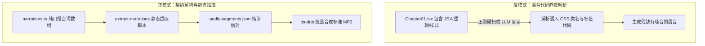
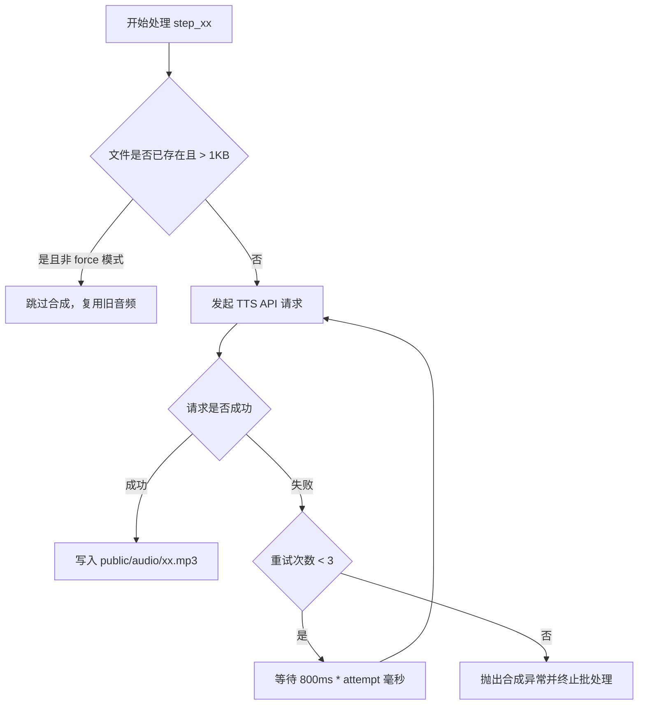
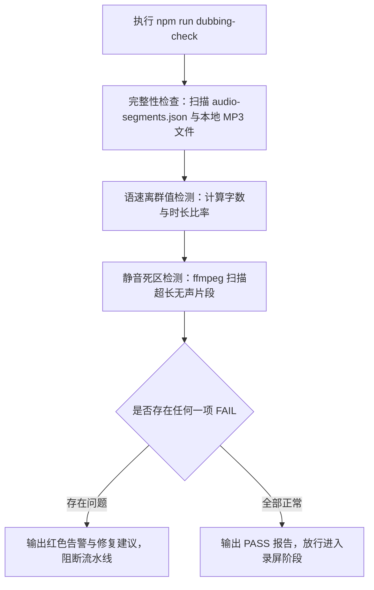

# 声画组装与资产生成：TTS 配音、封面图与多模态素材的自动化生产

完成前端动态演示页面的搭建之后，很多开发者会遇到第二道生产卡点。在接入语音配音和封面图生成时，整个流程容易重新退化为混乱的手工拼凑。文案稍微改动两句话，由于缺少自动化同步机制，录屏画面用的是新台词，声音播放的却是上一版旧录音。配音引擎遇到专业技术术语频繁读错多音字，全局调整发音规则又误伤其他正常词汇。使用 AI 生图工具制作封面时，每一集生成的吉祥物角色长相各异，画面排版在手机竖屏网格中被严重压缩。

这些问题的本质在于缺乏资产生产的契约化设计。声音与画面属于两种不同维度的多模态资产，它们各自拥有独立的渲染规律与约束条件。本课将深入剖析文案解耦、语音合成配置注入、工程化前置防御、竖版封面视觉锚定以及资产自动化体检的全流程。

---

## 1. 文案解耦：从前端组件中提取台词清单

许多初学者在搭建自动化视频系统时，习惯直接把前端 TSX 组件代码直接扔给大模型或者语音合成接口，期望程序自动识别其中的台词并完成配音。这种做法在实际工程中几乎必然导致解析崩溃。

### 1.1 为什么配音引擎不能直接读前端 TSX 代码

前端组件代码是面向视图渲染和交互逻辑设计的，其中混杂着大量对语音合成而言属于纯粹噪音的语法结构：

1. JSX 标签与嵌套层级：组件内部包含 `<div>`、`<span>`、`<motion.div>` 等大量排版标签，解析器很难稳定判断哪些文本是展示给观众看的界面文字，哪些是需要朗读的旁白口播。
2. 条件分支与动态渲染：代码中常常存在三元表达式、逻辑与判断以及数组遍历映射。语音合成引擎在面对条件分支代码时，无法还原运行时的真实分支流向，容易将互斥分支的文本一股脑读出。
3. 样式类名与属性噪音：Tailwind CSS 的长类名字符串与组件属性如果发生意外转义，会被语音引擎生硬地读作英文单词和符号代码。
4. 画面呈现与口播表达的天然差异：屏幕上展示给观众看的内容往往是精简的代码块、架构图或核心指标；而口播配音承担的是逻辑解释、背景铺垫与转折过渡。画面文字与口播台词在字数、句式和节奏上完全不同。



图解：上方反模式把混合组件直接喂给语音引擎，引发代码噪音与分支混乱；下方正模式将台词收敛到独立数据文件，经由提取脚本生成标准 JSON 信封供下游消费。

解决这一矛盾的核心原则在于视图与文案严格分离。React 组件只负责响应当前步骤序号（step）并执行动画与布局变换，口播台词则交由各章节独立的 `narrations.ts` 数组承载。各司其职，互不干扰。

### 1.2 分段文案 JSON 的数据结构规范与单一真实源法则

为了让下游的语音合成引擎与录屏调度器能够精确对齐，需要使用统一的中间数据信封。在项目根目录下，通过提取脚本 `extract-narrations.ts` 扫描所有章节的台词定义，汇总生成 `audio-segments.json`。

标准数据信封的数据结构定义如下：

```json
[
  {
    "chapter": "chapter-01",
    "step": 1,
    "text": "写了 200 行提示词，AI 跑着跑着还是会失控，根本原因是你缺了一个确定性的状态机。",
    "audio": "public/audio/chapter-01/step_01.mp3"
  },
  {
    "chapter": "chapter-01",
    "step": 2,
    "text": "我们看左边的这组状态定义，它把整个执行流程严格约束在四个闭环阶段内。",
    "audio": "public/audio/chapter-01/step_02.mp3"
  }
]
```

该结构确立了四个关键约束：
1. `chapter` 与 `step` 联合构成唯一主键，采用从 1 开始递增的自然数序号，与前端动画步进保持严格同步。
2. `text` 字段存放经过严格清洗的纯文本，禁止包含任何 HTML 标签或 Markdown 格式字符。
3. `audio` 明确指定该分段生成的音频在 `public/` 静态资源目录下的相对路径。
4. 单一真实源法则：修改文案必须在源头 `narrations.ts` 中进行，修改完毕后必须执行提取脚本并删除对应的旧 MP3 文件。禁止在流水线中间环节手动改动 `audio-segments.json`，防止下次重新构建时改动被覆盖。

在实际制作中，经常会遇到某些动画过渡步骤只需要画面移动、无需任何语音配音。针对这种纯展示步骤，系统支持静音步骤设计：将该步骤的 `text` 字段设为空字符串 `""`。提取脚本扫描到空文本时，会自动跳过生成该段的 TTS 任务，前端运行时则根据预设的动画时长自动等待后跳入下一步。

卡点拦截：
当你在命令行运行 `npm run extract-narrations` 时，如果遇到错误提示 `Cannot find module '../src/registry/chapters'`，通常是因为章节注册表中的目录名与实际文件路径大小写不一致，或者新增章节后未在注册表中导出。此时应当检查 `src/registry/chapters.ts`，确保导出的章节数组与 `src/chapters/` 下的文件夹命名完全匹配。

### 1.3 提示词驱动台词拆分与结构化提取

在将长篇技术文档转化为适合 16:9 网页演示的分段台词时，依靠人工逐句拆分非常耗时。可以通过编写结构化的提示词，引导大模型自动完成节奏分段、字数控制与契约输出。

下面是驱动大模型完成分段台词提炼的核心提示词：

```markdown
# 角色与任务
你是一名精通技术短视频制作的内容架构师。你需要将输入的技术文章或大纲，转化为适合 16:9 网页动态演示的分段口播台词，并输出为标准的 TypeScript 数据结构。

# 分段与节奏规范
1. 每一步（step）对应画面上的一个独立动作或视觉焦点切换，单步口播字数控制在 25 到 45 个汉字之间，朗读时长约 4 到 7 秒。
2. 语言必须口语化，严禁使用长定语大背景句式。第一步必须单句自成立，直接抛出核心痛点或悬念。
3. 严格区分画面展示内容与口播解说内容。代码展示留在界面上，口播台词只讲解关键逻辑、转折与参数含义。
4. 对于仅需视觉过渡无解说词的步骤，将台词置为空字符串 ""。

# 输出格式要求
直接输出符合项目规范的 TypeScript 代码，格式如下：

export const narrations: string[] = [
  "第一步台词内容，直击核心痛点",
  "第二步台词内容，配合画面展开代码分析",
  "", // 纯视觉展示步骤，台词留空
  "第四步台词内容，总结方案收益"
];

# 待处理技术内容
{{INPUT_TECHNICAL_TEXT}}
```

通过这一提示词生成的数组，可以直接写入对应章节的 `narrations.ts` 文件，随后由自动化脚本完成信封打包。

---

## 2. 高拟真语音合成：接入 tts-dub 与注音覆盖

有了纯净的台词信封后，下一步是调用语音合成引擎生成每一个分段的独立 MP3 音频文件。在技术短视频领域，声音的自然度与术语读音的准确性直接决定了观众的第一观感。

### 2.1 TTS 服务对接与音色 IP 绑定

目前市面上主流的商业 TTS 引擎包括 MiniMax T2A v2、OpenAI TTS 以及各类开源克隆模型。在中文技术场景下，MiniMax T2A v2 在音色克隆质感、语调起伏以及多音字精准控制方面表现突出。

在接入 MiniMax 时，很多开发者会优先尝试官方提供的命令行工具 `mmx`。但在复杂的生产环境中，直调底层 HTTP RESTful API 是更为可靠的方案。

做出这一技术选择的原因在于格式兼容性。官方命令行工具在解析多音字注音参数时存在限制，容易将规则拼装为单一对象字符串。而 MiniMax 的 HTTP 接口严格要求接收标准对象数组。通过直调底层 HTTP 接口，我们能够完全掌控请求体的每一个字段，避免参数转义带来的丢失问题。

为了建立鲜明且统一的账号声音风格，全系列视频必须固定使用同一个克隆音色。我们可以通过编写音色查询脚本，按创建时间戳锁定指定的音色 ID：

```javascript
// scripts/list-voices.mjs
import https from "node:https";

const API_KEY = process.env.MINIMAX_API_KEY;
const GROUP_ID = process.env.MINIMAX_GROUP_ID;

const options = {
  hostname: "api.minimax.chat",
  path: `/v1/t2a_v2/voice_cloning/list?group_id=${GROUP_ID}`,
  method: "GET",
  headers: {
    Authorization: `Bearer ${API_KEY}`,
  },
};

const req = https.request(options, (res) => {
  let data = "";
  res.on("data", (chunk) => (data += chunk));
  res.on("end", () => {
    const json = JSON.parse(data);
    const voices = json.voices || [];
    // 按时间戳倒序排列，取出最新克隆的主力音色
    console.log("可用音色列表：", voices.map((v) => ({ id: v.voice_id, name: v.name })));
  });
});
req.end();
```

整个语音合成模块的参数应当全部收敛到配置中心 `tts.config.json` 中，实现配置与代码的完全解耦：

```json
{
  "provider": "minimax",
  "voice_id": "moss_audio_4dd8142e",
  "speed": 1.05,
  "pitch": 0,
  "volume": 1.0,
  "normalize": [
    ["query\\.ts", "query 点 ts"],
    ["v1\\.2\\.0", "版本一点二点零"],
    ["8080", "八零八零"]
  ],
  "pronunciation": [],
  "overrides": {}
}
```

### 2.2 念法规整与字幕源解耦

技术类短视频中频繁出现代码文件名、版本号、端口号以及特殊英文缩写。如果直接让语音引擎朗读，可能会出现各种怪异发音（例如把 `query.ts` 读成 query 破折号 ts，把端口 `8080` 读成八千零八十）。

很多人的直觉做法是直接去修改台词文本，把文案写成中文谐音。但这样做会导致画面上的字幕显示和代码展示也变成不伦不类的谐音汉字，严重损害视频的专业感。

正确的架构设计是在合成层引入念法规整机制（`normalize`）：


图解：原始台词同时供前端渲染与音频合成消费。前端保持规范代码字符，音频在请求前夕经由 normalize 正则替换为发音文本，做到字幕与发音完全解耦。

在 `tts.config.json` 的 `normalize` 规则中，使用正则表达式和替换文本组成的二维数组。在向 TTS 发起网络请求前，脚本会先对原始文本做一层正则替换，而前端页面渲染字幕时依然使用未经替换的原始文本。

### 2.3 多音字精细化注音与逐段覆盖

汉字在技术语境下存在大量多音字冲突。例如：
1. 行：在“行高”中读作 `háng`，在“执行”中读作 `xíng`；
2. 重：在“重载”中读作 `chóng`，在“重要”中读作 `zhòng`；
3. 得：在“就得这么做”中读作 `děi`，在“跑得快”中读作 `de`。

如果把多音字规则配置在全局字典中，极容易按下葫芦浮起瓢。例如全局配置了“行”读 `háng`，那么“执行任务”就会被错误地读成“执航任务”。

因此，系统采用逐段覆盖（`overrides`）机制。在 `tts.config.json` 中针对特定的章节与步骤单独注入注音规则：

```json
{
  "overrides": {
    "chapter-01/step_02": {
      "pronunciation": ["行/(hang2)"]
    },
    "chapter-02/step_05": {
      "speed": 0.95,
      "pronunciation": ["重/(chong2)"]
    }
  }
}
```

MiniMax 官方 API 要求的拼音格式为 `汉字/(pinyin+声调数字)`。例如 `行/(hang2)` 表示将该段中的“行”字强制注音为第二声。局部配置仅对当前步骤生效，完全杜绝了全局污染。

在多音字处理中，还存在一种同段同字两读的特殊情况。例如在同一句话中同时出现“就得（děi）”和“好得多（de）”。由于注音字典是基于字符匹配的，目前任何商业 TTS 接口都无法在同一段内为相同的汉字赋予两种不同的拼音。

遇到这种边界情况时，最稳妥的工程解法是改动文案，换用无歧义词汇。将“就得”改写为“必须”，将“好得多”保留原样。通过调整表述彻底消除读音冲突，远比在算法上做复杂的上下文消歧更加可靠。

卡点拦截：
当配置注音参数时，如果把拼音格式错写成 `行/(hang-2)` 或 `行/(háng)`，MiniMax 接口会直接返回 HTTP 400 错误，提示 `invalid pronunciation format`。必须严格遵守 `汉字/(拼音字母+数字声调)` 的写法，其中声调数字范围为 1 到 5（5 代表轻声）。

### 2.4 提示词引导第一步：驱动 AI 处理多音字注音、断句与 TTS 参数配置

为了避免人工逐句试听和查找多音字，我们可以让 AI 担当配音调优助手，自动扫描台词中的多音字风险并生成对应的 `tts.config.json` 配置补丁。

驱动 AI 生成多音字注音与 TTS 覆盖配置的完整提示词如下：

```markdown
# 角色与任务
你是一名精通中文语音合成与发音调优的音频工程师。你需要分析给定的分段口播文案，识别其中的技术多音字、专有名词和代码标识符，输出对应的 tts.config.json 局部覆盖规则。

# 识别与标注规则
1. 技术术语多音字：识别行（háng/xíng）、重（chóng/zhòng）、差（chā/chà）、调（tiáo/diào）、量（liáng/liàng）等字在技术上下文中的真实读音。
2. 注音语法规范：严格采用 MiniMax 标准拼音格式，即 "汉字/(拼音声母韵母+数字声调)"。例如："行/(hang2)"、"重/(chong2)"、"调/(tiao2)"。
3. 英文缩写与代码文件：对类似 index.ts、CSS、RESTful 等词汇，编写对应的 normalize 正则替换规则。
4. 语速调节建议：如果单段台词字数超过 40 字且包含复杂概念，设置 speed 为 0.95；如果为简短总结，设置 speed 为 1.05。
5. 冲突规避：如果检测到同一段台词内相同汉字存在两种不同读音，指出该冲突并给出改写建议。

# 输出格式要求
以 JSON 格式输出补丁配置，结构如下：

{
  "normalize_patch": [
    ["main\\.ts", "main 点 ts"]
  ],
  "overrides_patch": {
    "chapter-01/step_01": {
      "speed": 1.05,
      "pronunciation": ["行/(hang2)"]
    }
  },
  "text_rewrite_suggestions": [
    {
      "step": "chapter-01/step_03",
      "original": "原台词内容",
      "suggested": "消除同字不同音后的推荐台词",
      "reason": "解释修改原因"
    }
  ]
}

# 待分析台词清单
{{INPUT_AUDIO_SEGMENTS_JSON}}
```

使用此提示词可以一次性完成全集台词的发音扫描与配置初始化，大幅降低人工试听成本。

---

## 3. 批量合成与工程防御：前置探测与容错

在实际流水线运行中，一段 2 到 3 分钟的技术视频通常包含 20 到 40 个独立的音频切片。如果直接使用简单的循环脚本发起全量并发请求，系统在面对外部网络波动与账户异常时会显得极其脆弱。

### 3.1 为什么批量合成前必须先单段探测余额

在商业生产环境下，最常见且破坏性较大的异常是服务商账户余额不足。以 MiniMax 为例，当账户欠费或 Token 配额耗尽时，接口会返回错误码 `1008`。

如果程序在没有做前置检查的情况下盲目启动 30 段音频的并发合成任务，会产生一系列恶性后果：
1. 产生大量半截音频：前几段可能成功生成，后几十段全部失败，导致目录内充斥着残缺资产。
2. 浪费后续流程算力：录屏脚本在扫描到不完整音频时仍会启动无头浏览器，最终在录制到一半时因缺失音频而崩溃挂起。
3. 错误排查困难：并发失败抛出的数十条异常日志会淹没真正的欠费原因。

工程防御的设计思路是前置探针与熔断机制。在执行任何全量合成任务之前，先向 TTS 接口发送一个包含极短文本（如“测试”）的探测请求：

```javascript
// scripts/probe-balance.mjs
async function probeTtsBalance(config) {
  const probePayload = {
    model: "speech-01-turbo",
    text: "探",
    voice_setting: { voice_id: config.voice_id, speed: 1.0, vol: 1.0, pitch: 0 }
  };

  try {
    const res = await callMiniMaxApi(probePayload);
    if (res.base_resp && res.base_resp.status_code === 1008) {
      console.error("[熔断拦截] MiniMax 账户余额耗尽（错误码 1008）");
      return { ok: false, reason: "INSUFFICIENT_BALANCE" };
    }
    return { ok: true };
  } catch (err) {
    return { ok: false, reason: err.message };
  }
}
```

如果探测请求捕获到 1008 状态码，流水线立刻中断后续所有合成与录屏任务，将当前任务元数据中的状态重置为 `drafting`，并通过通知系统向飞书推送充值告警。流程优雅挂起，不推审、不硬跑。

### 3.2 串行合成与指数退避重试

在解决余额探测之后，针对网络抖动和接口限流问题，批量合成脚本应当采用带有指数退避机制的串行请求模式。



图解：合成引擎先检查本地缓存实现增量跳过，网络请求失败时按指数退避递增等待时间重试，三次耗尽则安全熔断。

核心合成逻辑实现如下：

```javascript
// scripts/synthesize-batch.mjs
async function synthesizeWithRetry(segment, config, maxRetries = 3) {
  for (let attempt = 1; attempt <= maxRetries; attempt++) {
    try {
      const audioBuffer = await callTtsService(segment.text, config);
      await fs.writeFile(segment.audio, audioBuffer);
      return;
    } catch (err) {
      if (attempt === maxRetries) {
        throw new Error(`分段 ${segment.step} 合成彻底失败：${err.message}`);
      }
      const delay = 800 * attempt;
      console.warn(`分段 ${segment.step} 失败，第 ${attempt} 次重试，等待 ${delay}ms...`);
      await new Promise((resolve) => setTimeout(resolve, delay));
    }
  }
}
```

脚本同时提供增量跳过、`--force` 全量重刷与 `--only` 局部补录参数：
1. 默认模式：如果本地已存在对应路径且体积大于 1KB 的 MP3 文件，自动跳过该段，节省 Token 和时间。
2. `--force` 模式：无视本地已有文件，强制全量重新合成，适用于更换音色 ID 或全局语速时。
3. `--only chapter-01/step_03` 模式：仅重新合成指定的单一片段，适用于针对个别读错的多音字打补丁。

卡点拦截：
当网络发生异常中断时，有时会在本地生成一个体积为 0 字节的损坏 MP3 文件。如果增量检查只判断文件是否存在而没有判断体积（`stats.size > 1024`），会导致损坏文件被当作已完成跳过。因此检查逻辑必须严格校验文件大小。

---

## 4. 视觉门面：生成高辨识度的 9:16 竖版封面

短视频的封面不仅是一张静态插画，更承担着在平台推荐流与主页双列网格中吸引点击的核心使命。许多开发者在制作完横屏视频后，顺手截取一张视频内的画面作为封面，这种做法极容易导致播放量严重受限。

### 4.1 平台展示逻辑与横屏截图陷阱

在短视频平台上，用户的个人主页与搜索结果列表以 9:16 竖屏网格形态排布。如果直接使用 16:9 的横屏视频截图，在竖屏网格中会自动缩放。画面上下会留出大面积黑色空白，原本清晰的代码和文字被压缩到只有指甲盖大小，观众在快速滑动屏幕时根本看不清任何内容。


图解：左侧横屏截图在竖屏网格中出现严重黑边和小字压缩；右侧标准 9:16 竖版封面通过顶部徽章、中间主体与底部大字三段式结构占满视线。

一张具备高点击率的 9:16 竖版封面，应当遵循严格的三段式视觉结构：
1. 顶部胶囊徽章：标明系列专栏名称与当前集数编号（如 `AI工程实战 · 第 04 集`），给路过用户建立清晰的连载印象。
2. 中间视觉主体：整个画面的视觉锚点。使用统一的吉祥物角色，结合本集核心主题进行动作与道具设计（例如在讲解工具搜索时，吉祥物手持发光搜索放大镜；在讲解缓存中断时，吉祥物手握红色断路开关）。
3. 底部高对比大字：双行大字标题。上行为白色痛点提问（如“写了200行提示词”），下行为亮黄色方案主线（如“为什么AI还是失控”），字号必须放大到手机屏幕上一眼扫过的量级。

### 4.2 基于 baoyu-image-gen 锁定参考图

在使用扩散模型生成封面时，开发者面临的最大痛点是角色形象漂移。由于扩散模型的随机种子特性，每次生成的角色发型、衣服、长相甚至画风都会发生变化，导致整个专栏显得非常散乱。

通过工具 `baoyu-image-gen` 提供的参考图参数（`--ref`），我们能够将首集确定的基准封面图片作为图像参考输入，牢牢锁定角色的核心特征、暗黑科技背景色调与整体渲染质感。

本地封面生成指令封装如下：

```bash
# 生成第 04 集封面图
npx baoyu-image-gen generate \
  --prompt "$(cat assets/cover-prompt.md)" \
  --ref "assets/reference-cover.png" \
  --aspect-ratio "9:16" \
  --output "assets/cover.png"
```

卡点拦截：
在使用 `baoyu-image-gen` 结合 `--ref` 生成封面时，如果控制台报错 `Error: Reference image not found`，通常是因为传入的相对路径未相对于当前执行命令的工作目录。另外如果漏传 `--aspect-ratio "9:16"` 参数，模型会默认产出 1:1 正方形图片，导致画面无法直接用于短视频竖屏封面。执行前务必确认参考图路径存在，并显式声明 9:16 画幅。

### 4.3 提示词引导第二步：驱动 AI 设计 9:16 竖版高点击率封面图 Prompt 与视觉风格

设计一张优质的封面图需要将技术痛点转化为具象的视觉隐喻。我们可以利用大模型将当前视频的大纲提炼为专业的绘图提示词。

驱动 AI 设计 9:16 竖版封面图 Prompt 的完整提示词模版如下：

```markdown
# 角色与任务
你是一名精通技术自媒体视觉包装与 AI 绘图的视觉设计师。你需要根据输入的视频主题和大纲，设计一张 9:16 竖版封面的构图方案，并输出用于图像生成的英文 Prompt。

# 视觉风格与规范
1. 画幅比例：严格采用 9:16 竖屏比例（Aspect Ratio 9:16）。
2. 基础色调：暗黑科技风格（Dark tech background），底色为深灰偏蓝黑（#0f172a），搭配高亮蓝绿色（#38bdf8）与警示黄色（#facc15）发光霓虹线条。
3. 角色锚定：以极简科技风机器人吉祥物为主体，角色佩戴发光护目镜，身穿深灰色连帽工装，具有统一的圆润外形。
4. 视觉隐喻：将抽象的技术难点转化为具象的物理道具交互。例如：状态机转化为发光的轨道齿轮；多音字错误转化为错乱的音频波形立方体。
5. 排版留白：顶部预留 15% 区域放置系列徽章，底部预留 25% 区域放置双行大字标题，主体角色居中偏上，避免遮挡文字区域。

# 输出格式要求
以 Markdown 格式输出设计说明与纯英文 Prompt：

## 1. 构图设计说明
- 顶部徽章文字：[例如：AI 自媒体流水线 · EP04]
- 底部双行标题：
  - 上行（痛点白字）：[例如：配音老念错字？]
  - 下行（方案黄字）：[例如：多音字注入与配置解耦]
- 核心视觉隐喻：[简要描述角色的动作与道具]

## 2. 图像生成 Prompt（英文）
[包含主体角色描述、道具动作、背景细节、光影渲染、色彩搭配、画幅比例的完整英文提示词]

# 待处理视频主题与大纲
{{INPUT_COURSE_OUTLINE}}
```

通过这一流程生成的英文提示词，配合 `--ref` 参考图参数，可以确保每一集封面在保持高度视觉一致性的同时，精准传达当集的技术亮点。

---

## 5. 多模态质量验收与资产纠错打补丁

在所有音频与图像资产生成完毕后，不能直接进入合成渲染，必须建立自动化的质检机制，拦截潜在的音画缺陷。

### 5.1 自动化质量检查：dubbing-check 与多维体检

资产质量检查通过专用的体检脚本工具集 `dubbing-check` 完成，主要包含三个核心维度的检测：



图解：dubbing-check 顺序执行完整性、语速与静音体检，任何一项异常都会输出具体错误位置并阻断后续录屏。

1. 完整性校验（`check-completeness.mjs`）：
比对 `audio-segments.json` 中声明的所有非空分段，检查 `public/audio/` 目录下对应的 MP3 文件是否存在且体积大于 1KB。如果发现缺失，输出缺失分段的精确定位。

2. 语速与时长离群值检测（`check-pace.mjs`）：
读取每段音频的真实时长（秒），结合该段文案的汉字字符数，计算每秒字数（chars/sec）。
正常技术口播的合理语速范围应当在每秒 3.5 到 5.2 字之间。
如果语速低于 3.0 字/秒，说明配音引擎出现了不正常的拖音或内部异常停顿；如果语速高于 5.8 字/秒，说明语速过快会导致观众无法消化技术信息。检测脚本会将异常段落标记为离群警告。

3. 静音死区检测（`check-silence.mjs`）：
调用 `ffmpeg` 的 `silencedetect` 滤镜，扫描音频切片内部是否存在超过 0.5 秒的完全无声区域：

```bash
ffmpeg -i public/audio/chapter-01/step_01.mp3 -af silencedetect=noise=-30dB:d=0.5 -f null -
```

如果检测到过长停顿，体检工具会自动标记该音频文件需要进行去停顿（depause）处理或重新合成。

卡点拦截：
在运行 `dubbing-check` 时，如果控制台报错 `spawn ffmpeg ENOENT`，说明系统环境中未安装 `ffmpeg` 或未将其加入系统 PATH 环境变量。在 macOS 上可以通过 `brew install ffmpeg` 安装，在 Linux 上可以通过 `apt install ffmpeg` 解决。缺少 `ffmpeg` 会导致静音检测和音频时长精确探测直接失败。

### 5.2 提示词引导第三步：配音错误、文字溢出与风格漂移的精准纠错提示词

当体检脚本报错或人工复核发现资产瑕疵时，不要盲目推倒全量重来，而是使用针对性的纠错提示词引导 AI 快速打补丁。

这里提供三种高频故障场景的纠错提示词模版：

#### 场景 1：配音多音字读错或语速异常纠错

```markdown
# 任务
修正指定音频分段的发音错误或语速问题，生成最小化的 tts.config.json 覆盖补丁。

# 错误反馈信息
- 故障分段：{{STEP_KEY}}
- 原文文本：{{ORIGINAL_TEXT}}
- 实际发音缺陷：{{ERROR_DESCRIPTION}}（例如：“把行高读成了 xing2 gao1”，“后半句语速太快听不清”）

# 修复要求
1. 如果是多音字读错，给出正确的 MiniMax 注音语法字符串，如 "字/(pinyin+声调)"。
2. 如果是语速异常，给出局部的 speed 覆盖值（范围 0.85 到 1.15）。
3. 如果同一段内存在同字两读无法注音的冲突，给出最小改动幅度的文案改写建议。

# 输出格式
直接输出 JSON 补丁片段：
{
  "overrides": {
    "{{STEP_KEY}}": {
      "speed": 1.0,
      "pronunciation": ["行/(hang2)"]
    }
  }
}
```

#### 场景 2：封面文字溢出与排版错位纠错

```markdown
# 任务
优化封面图的双行标题文案与构图提示词，解决文字过长导致的视觉拥挤和溢出问题。

# 现状问题
- 原始上行文字（痛点）：{{ORIGINAL_TITLE_LINE1}}
- 原始下行文字（方案）：{{ORIGINAL_TITLE_LINE2}}
- 问题描述：文字在手机 9:16 网格预览中超出安全边界，或字数过多导致换行破坏美感。

# 优化规则
1. 上行痛点控制在 7 到 10 个汉字以内，直击矛盾。
2. 下行方案控制在 8 到 11 个汉字以内，点出核心技术名词。
3. 严格禁止出现冒号、括号等复杂标点符号。

# 输出格式
输出精简后的双行文案与调整后的绘图 Prompt 焦点区域描述。
```

#### 场景 3：封面角色变形与风格漂移纠偏

```markdown
# 任务
调整生图 Prompt 的特征权重与负向约束，消除角色长相漂移和画风突变。

# 漂移现象描述
- 异常表现：{{DRIFT_DESCRIPTION}}（例如：“生成的吉祥物变成了写实风人类”，“暗黑背景变成了白色高亮背景”）
- 基准参考图路径：assets/reference-cover.png

# 纠偏规则
1. 强化主体特征词权重（例如：(dark-tech pixel-art mascot:1.3)）。
2. 在 Negative Prompt 中加入破坏风格的排除词（例如：photorealistic, human face, bright white background, messy typography）。
3. 确保包含 --ref 参数与固定宽高比 --ar 9:16。

# 输出格式
输出更新后的完整 cover-prompt.md 内容。
```

### 5.3 资产交付清单与状态流转

当所有音频与图像资产通过体检后，工程目录下应当呈现清晰、完备的交付结构：

```text
project-root/
├── src/chapters/
│   ├── chapter-01/
│   │   ├── index.tsx          # 视图与动画组件
│   │   └── narrations.ts      # 纯口播台词源文件
├── public/audio/
│   ├── chapter-01/
│   │   ├── step_01.mp3        # 合成的分段音频
│   │   └── step_02.mp3
├── assets/
│   ├── reference-cover.png    # 视觉基准参考图
│   ├── cover-prompt.md        # 结构化封面提示词
│   └── cover.png              # 最终生成的 9:16 竖版封面
├── audio-segments.json        # 提取的台词信封清单
├── tts.config.json            # 语音合成与覆盖配置
└── meta.yaml                  # 状态流转记录
```

各阶段状态流转矩阵如下表所示：

| 阶段步骤 | 执行命令 | 输入依赖 | 产出物 | 成功判定标准 |
|---|---|---|---|---|
| 1. 台词提取 | `npm run extract-narrations` | `narrations.ts` | `audio-segments.json` | 提取数组长度与动画步数完全一致 |
| 2. 前置探针 | `node scripts/probe-balance.mjs` | `tts.config.json` | 控制台状态 | 状态码返回成功，账户余额充足 |
| 3. 批量配音 | `npm run synthesize-audio` | `audio-segments.json` | `public/audio/*.mp3` | 所有非空段落 MP3 文件存在且 > 1KB |
| 4. 封面生成 | `npm run generate-cover` | `cover-prompt.md` | `assets/cover.png` | 9:16 比例，角色一致且文字清晰 |
| 5. 质量体检 | `npm run dubbing-check` | 音频切片与分段 JSON | 质检报告 | 完整性、语速与静音检查全部通过 |

资产全部就绪并通过体检后，执行状态标记命令将当前工程状态翻转为 `assets_ready`，流水线正式放行进入后续的无头浏览器自动化录屏阶段。

---

## 6. 思考题与实操练习

1. 在你的项目工程中，新建一个包含 3 个动画步骤的章节，编写对应的 `narrations.ts`，并使用提示词生成一套包含多音字注音的 `tts.config.json`。运行提取与批量合成脚本，验证 MP3 文件是否按规范输出。
2. 尝试故意在配置中构造一个 1008 余额耗尽或者多音字拼音格式错误的异常场景，观察前置探针与合成脚本的拦截行为，检查日志输出与状态是否安全挂起。
3. 以第一集封面为参考图，使用提示词和 `--ref` 参数为新增章节生成一张 9:16 竖版封面，验证角色特征和暗黑科技基调是否与基准图保持一致。
