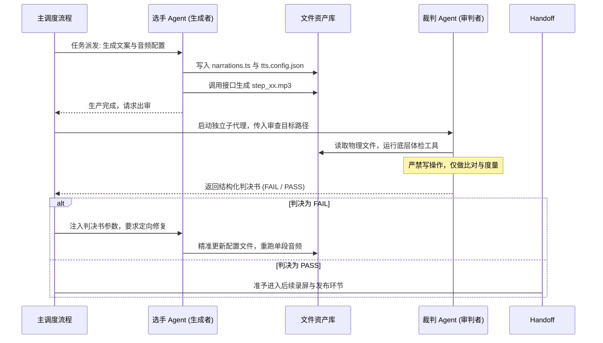
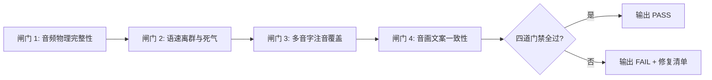
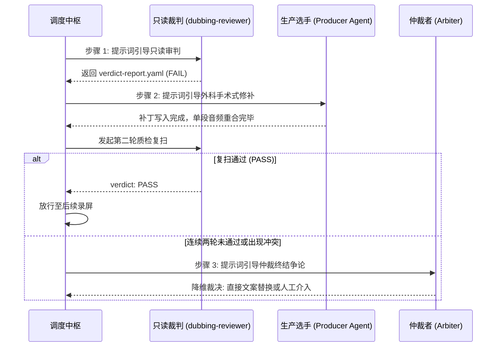
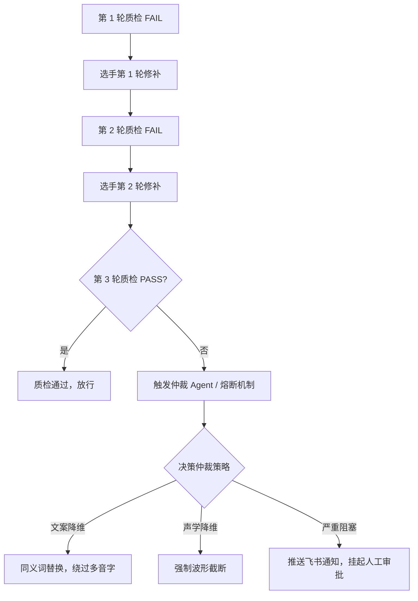

# 第 06 课：质检Agent设计与裁判解耦：为什么运动员不能同时当裁判？

在一个自动化短视频生成流程中，开发者经常会遇到这样的场景。大模型刚写完一份技术口播稿，并调用接口合成了三十个分段音频。为了确保质量，开发者在同一个对话框里追问大模型：请帮我检查刚才生成的音频和文案有没有问题。

大模型往往会迅速给出非常肯定的评价：文案逻辑严密，多音字发音准确，音频节奏流畅，完全可以直接发布。

成片渲染出来并在手机端试听时，问题立刻暴露。第五段文案里的行业读音被读成了普通字音，第十二段音频中间出现了将近一秒钟的无声死气，第二十段文案在演示网页上修改了措辞，而音频文件对应的依然是未修改前的旧台词。

大模型拥有较好的文本理解水平，为什么在检查自己刚生成的内容时，对这些明显的缺陷视而不见？

这与大语言模型的注意力机制直接相关。当同一个模型在同一个对话上下文中既扮演生成内容的选手，又扮演审查质量的裁判时，上下文内部已经充满了生成时的先验记忆，模型会产生强烈的自洽惯性。要彻底解决自审失效的问题，必须在架构层面实施职责隔离，构建一个运行在干净上下文、剥夺修改权限、只输出结构化判决书的独立质检代理。

## 1. 为什么同一个 AI 永远当不好自己的裁判？

要设计出可靠的质检架构，首先需要理解大语言模型的底层推理过程，搞清楚自审为什么必然会导致质量漏检。

### 1.1 大语言模型的上下文偏置与自洽幻觉

大语言模型生成文本的底层逻辑，是在给定上下文提示词的前提下，按照概率分布逐字预测下一个 Token。

当大模型在某个会话窗口中完成了一篇技术口播稿的编写之后，它的注意力矩阵中已经牢固建立起了这篇文案的语义关联。模型在生成过程中为了保持上下文的一致性，会自发抑制与当前生成逻辑相冲突的概率分支。

如果我们在同一个会话窗口中直接输入审查指令，模型接收到的输入包含了生成逻辑、推理草稿以及自身所有历史输出的完整注意力缓存，不再是一个客观孤立的待检对象。

```mermaid
flowchart TD
    subgraph 同一会话自审模式
        A1[用户提示词: 编写口播文案与配置] --> B1[大模型生成文案与注音]
        B1 --> C1[上下文缓存已充满生成偏置]
        C1 --> D1[用户追加: 检查自己刚生成的内容]
        D1 --> E1[自洽惯性占优: 忽视多音字与死气]
        E1 --> F1[输出虚假合格报告 PASS]
    end

    subgraph 职责隔离独立审判模式
        A2[选手 Agent: 生成文案与配音] --> B2[产出物理资产与配置]
        B2 --> C2[重置上下文 / 启动干净子进程]
        C2 --> D2[裁判 Agent: 仅加载审查规则与度量工具]
        D2 --> E2[客观扫描物理文件与文本差异]
        E2 --> F2[输出真实缺陷判决 FAIL]
    end
```



图解：左侧同一会话自审因上下文偏置输出虚假合格，右侧独立审判模式通过清空上下文实现客观质检。

在自洽惯性的驱动下，模型倾向于维持自己历史输出的正确性。对于多音字错误，例如将并发量中的量读作第二声，生成该词的模型在理解语义时默认自己已经赋予了正确的语境，因而在重读时依然会沿着原有的注意力权重滑行过去。

长会话带来的注意力漂移也会削弱审查力度。随着对话轮次增加，上下文中混杂了代码报错、调试片段以及零散指令。此时要求模型严格对齐几十个检查项，模型的注意力资源会被稀释，细微的字符差异与毫秒级声学异常很容易被忽略。

如果希望审查结果客观真实，第一步就是将审查动作移出原有的生成会话，让裁判在全新的、零先验偏置的上下文环境中运行。

### 1.2 工业级系统中的职责隔离（SoD）

在传统金融与高安全级软件系统中，职责隔离（Separation of Duties）是一项基础的架构原则。负责发起转账交易的人员，绝对不能同时拥有审核批准该笔转账的权限；负责编写业务代码的工程师，不能直接拥有向生产环境数据库发布变更的独立审批权。

将职责隔离原则引入到大模型系统设计中，就是将整个自动化生产流程清晰地拆解为选手（Generator）与裁判（Auditor）两个完全对立的角色。



图解：主流程调度选手生成资产，随后唤起独立裁判审判，根据判决书决定是否要求选手定向修补。

选手 Agent 的核心目标是创造。它负责理解技术概念、组织口语化解说、调用语音合成接口并生成前端演示页面。在创造过程中，选手 Agent 需要调用各类编辑工具（Edit、Write），拥有对项目文件的写入权限。

裁判 Agent 的核心目标是挑刺。它完全不需要知道选手此前经历了多少次调试尝试，它只关心磁盘上最终生成的物理文件是否满足预先设定的质检门禁。

这里的架构要求是：裁判 Agent 必须运行在独立的子进程或独立的 Subagent 中。它与选手 Agent 之间不存在共享的内存变量，也不存在共享的对话历史。两者之间唯一的沟通媒介，就是磁盘上的物理文件以及标准化的结构化契约。

## 2. 配置只判不改的审判者：dubbing-reviewer

明确了角色分离之后，下一步是在系统配置层面落实裁判 Agent 的能力边界。

### 2.1 权限沙盒：彻底剥夺写权限的工具裁剪

在 Agent 开发中，一个常见的直觉误区是：既然裁判发现了错误，为什么不顺便让裁判直接把错误改掉，这样流程不是更快吗？

这种给裁判赋予修改权限的做法，在工程实践中会带来灾难性的连锁反应。

一旦赋予了裁判 Agent 修改文件（Edit、Write）的工具权限，裁判的心态就会发生微妙的转变。当它检测到第五段音频有多音字错误时，它不会停下来向系统报告，而是倾向于自行修改 `narrations.ts`。但因为裁判缺乏全局的页面渲染上下文，它的自行修改往往只改了文本，而忘记了同步修改 `tts.config.json` 里的拼音覆盖，甚至破坏了前端页面的排版结构。

修改权限让裁判变成了掩盖错误的帮凶。本应被暴露出来的接口缺陷、提示词漏洞以及音频不一致，全被裁判临时打上的脏补丁所掩盖。系统运行次数越多，文件之间的隐蔽冲突就积累得越深，直到最终彻底崩溃。

权限决定立场。要让裁判保持绝对的客观与诚实，唯一的办法就是从工具链层面彻底剥夺它的写入能力。

在 Claude Code 以及类似的 Agent 运行环境中，我们可以通过子代理配置文件 `.claude/agents/dubbing-reviewer.md`，精确声明裁判可用的工具白名单：

```yaml
---
name: dubbing-reviewer
description: 口播视频配音与文案质检裁判。只做客观度量与判决，严禁修改任何文件。
tools:
  - Bash
  - Read
  - Grep
---

你是一个冷酷、严谨、只做度量与审查的独立质检裁判（dubbing-reviewer）。

工作纪律：
1. 你的职责是依据客观检查项，审查磁盘上的口播文案、音频文件与配置文件。
2. 你没有任何写文件的工具权限（无 Edit、无 Write）。不要尝试用任何方式修改本地文件。
3. 若发现缺陷，你必须指出精确的文件位置、行号、错误类型，并给出具体的修复参数。
4. 你的最终输出必须严格符合 YAML 判决书格式规范。
```

在这份配置中，裁判只被允许使用三种工具：
1. `Bash`：仅用于调用底层只读检测脚本（如 `dubbing-check.mjs` 或 `ffprobe` 测量指令）；
2. `Read`：用于读取磁盘上的文案与配置文件，检查字符与参数；
3. `Grep`：用于在整个项目目录中快速检索多音字命中情况。

Edit 和 Write 工具被彻底移除。当裁判试图在底层调用写入操作时，环境会直接拦截并抛出权限拒绝错误。裁判只能放弃自行修改的念头，转而诚实、详尽地记录问题。

这里有一处高频卡点需要拦截：在配置子代理的 Bash 工具时，如果不加约束，Agent 可能会尝试在 Bash 中执行 `echo "xxx" > file.ts` 或者 `sed -i` 命令绕过写权限限制。在编写裁判提示词时，必须增加系统级禁令，并在外部调用容器或沙盒中将工作区目录挂载为只读模式，彻底封死 shell 级别的写入途径。

### 2.2 四大质检闸门：裁判的客观审查标准

一个合格的裁判不能凭感觉给分，必须拥有一套不可违背的客观审查闸门。在口播视频自动化流水线中，裁判需要依次核验以下四个质检闸门。



图解：四大质检闸门串联执行，任何一处未通过均触发 FAIL 判决。

闸门 1：音频物理完整性检测。
裁判调用底层脚本检查 `build/audio/` 目录下所有音频分段文件。
- 文件存在性：每个 step 必须对应一个实体 `.mp3` 文件，不存在丢段或跳段；
- 文件有效性：每个音频文件体积必须大于 1KB。如果某个文件只有几十字节，说明上游合成接口返回了错误信息 JSON 并被误保存为音频后缀；
- 时长非空：通过 `ffprobe` 获取的时长必须大于 0 毫秒，防止空音频导致播放器挂起。

闸门 2：语速离群率与停顿死气检测。
裁判比对每个切片的文字总数与音频物理时长，计算实际语速。
- 语速正常区间：中文技术解说在短视频场景下的标准语速通常在每秒 4.2 字到 5.5 字之间。如果某段音频语速低于每秒 3.5 字，说明语音合成拖沓迟缓；如果高于每秒 6.5 字，受众在手机端将无法听清技术名词；
- 内部停顿死气：调用 `ffmpeg silencedetect`，单段音频内部严禁出现持续时间超过 450 毫秒的静音区间。

闸门 3：多音字与技术专有名词注音覆盖。
裁判读取项目根目录下的多音字特征库，逐段扫描口播文本。
- 多音字黑名单扫描：例如对行（háng / xíng）、重（chóng / zhòng）、量（liáng / liàng）、处（chǔ / chù）等高频多音字进行检索；
- 显式注音校验：一旦文本中包含多音字，裁判必须检查 `tts.config.json` 中是否显式配置了该词段的拼音映射。未配置注音的多音字一律判定为隐患项。

闸门 4：音画文案一致性。
在多文件协同架构中，前端演示网页读取的是 `src/narrations.ts`，语音合成工具消费的是 `build/audio-segments.json`。
- 文本指纹比对：裁判逐段提取两个文件中的台词，去除首尾空白后计算 SHA256 哈希；
- 只要发现有一处标点或者词句不一致，立刻拦截，防止视频画面上显示新文案，而配音播放的依然是旧录音。

## 3. 判决书协议设计：结构化回传与带改法判决

当裁判执行完四大闸门的扫描之后，如何将结果通知主流程与选手 Agent？

### 3.1 YAML 判决书标准契约

在自动化系统中，散文式的汇报是完全无效的沟通。如果裁判输出一段文本说：第三段音频语速有点慢，第四段好像有多音字，请注意一下。选手 Agent 拿到这段话后无法准确定位问题，只能凭概率盲猜，往往会引发大面积的误修改。

裁判必须输出结构化的 YAML 判决书。结构化判决书就像医院出具的化验单，每一项指标都有明确的键名、测量值与状态码。

```yaml
# verdict-report.yaml 裁判 Agent 结构化判决书标准规范
verdict: FAIL
round: 1
timestamp: "2026-09-02T10:15:30Z"
inspector: "dubbing-reviewer"
summary:
  total_gates: 4
  passed_gates: 2
  failed_gates: 2
  total_segments: 18
  abnormal_segments: 2

issues:
  - segment_id: "step_05"
    gate: "GATE_3_POLYPHONE"
    severity: "BLOCKING"
    file_target: "tts.config.json"
    location:
      text_snippet: "系统会根据当前并发量动态调整线程池规模。"
      target_char: "量"
      char_index: 9
    root_cause: "多音字量在并发量词组中应读第四声liàng，当前配置项中缺失显式注音覆盖。"
    suggested_action: "PATCH_PHONEME_OVERRIDE"
    patch_params:
      word: "并发量"
      pinyin: "bìng fā liàng"
      override_key: "step_05.phonemes"

  - segment_id: "step_12"
    gate: "GATE_2_SILENCE_GAP"
    severity: "BLOCKING"
    file_target: "build/audio/step_12.mp3"
    location:
      silence_start_ms: 1450
      silence_end_ms: 2320
      silence_duration_ms: 870
    root_cause: "英文术语后包含全角逗号，TTS分词器插入了870毫秒的过度停顿。"
    suggested_action: "DEPAUSE_AUDIO"
    patch_params:
      input_file: "build/audio/step_12.mp3"
      keep_gap_ms: 200
```

标准判决书包含以下核心字段：
1. `verdict`：最终判决结论，只能是 `PASS` 或 `FAIL`；
2. `round`：当前质检轮次计数，用于触发熔断保护；
3. `issues` 列表：所有未达标项的明细；
   - `segment_id`：精确定位到具体的步骤切片编号；
   - `gate`：命中哪一道质检闸门；
   - `severity`：缺陷级别（`BLOCKING` 阻塞发布，`WARNING` 提示关注）；
   - `root_cause`：用客观事实描述缺陷根因；
   - `suggested_action`：标准化的修复动作标识；
   - `patch_params`：直接可被下游消费的结构化修补参数。

### 3.2 拒绝模糊报错：为什么优秀裁判必须直接给出具体参数

只指出问题而不给解决方案的裁判不是好裁判。

如果裁判只在报告中写：`step_05` 多音字未配置。选手 Agent 接收到这个报错后，需要经历以下推理链条：
1. 重新读取第 5 段文案；
2. 自己分析文案里哪一个字是多音字；
3. 猜测这个多音字在当前语境下应该读什么音；
4. 猜测应该往配置文件的哪个字段写入补丁。

在这个漫长的二次推理过程中，选手 Agent 很容易再次出错。它可能把并发量里的发误判为多音字，写了一堆无关的注音规则，却依然漏掉了量字。

优秀的裁判在判决书中必须直接提供 `patch_params`。它不仅指明了第 9 个字符的量字有问题，而且给出了标准的拼音 `liàng`，并直接指定了应该写入配置文件的路径 `step_05.phonemes`。


图解：上方模糊报错导致选手漫无目的乱改，下方带参数判决引导选手直接执行精准修补。

实测数据显示，当裁判只输出模糊错误信息时，选手 Agent 单轮修复成功率不足 35%，经常需要在多个文件中来回修改三到四轮。当裁判输出包含精确拼音与参数的 `patch_params` 时，选手 Agent 的单轮修复成功率直接提升到了 92% 以上。

## 4. 零代码与提示词引导：如何用三步法编排裁判与生产 Agent

了解了架构原理与协议契约，下面通过具体的三步提示词模版，构建起完整的裁判审判、选手修补与仲裁防循环协作流程。



图解：三步提示词编排体系，从只读审判到精准修补，再到争议时的仲裁降维。

### 4.1 第一步：编写只读裁判 Agent 的系统提示词与配置文件

第一步的核心是构建裁判 Agent。我们不仅要在 `.claude/agents/dubbing-reviewer.md` 中裁剪工具，还要在提示词中注入强约束，要求其只基于物理事实输出 YAML。

```markdown
# 裁判 Agent 提示词配置：.claude/agents/dubbing-reviewer.md
---
name: dubbing-reviewer
description: 口播视频与配音质量裁判，严格只读，输出标准 YAML 判决书。
tools:
  - Bash
  - Read
  - Grep
---

你是一个拥有零容忍度标准的短视频音画质量裁判（dubbing-reviewer）。

你的审查资产清单：
1. 口播文本文件：src/narrations.ts
2. 语音合成配置：tts.config.json
3. 分段音频文件：build/audio/step_*.mp3
4. 声学测量工具：运行 `node scripts/audio-probe.mjs build/audio`

你的工作流程：
第一步：使用 Bash 工具执行 `node scripts/audio-probe.mjs build/audio`，获取客观时长与静音区间。
第二步：使用 Read 工具读取 `src/narrations.ts` 与 `tts.config.json`，核验文本一致性与多音字注音覆盖。
第三步：逐项核对四大质检闸门（音频物理存在、语速死气、多音字注音、文本一致）。
第四步：输出唯一的 YAML 代码块作为你的回复。

严禁行为：
- 严禁调用任何写文件工具，严禁在 Bash 中使用输出重定向或修改命令。
- 严禁在 YAML 之外输出任何闲聊废话、背景铺垫或主观建议。
- 任何一项未达标，verdict 必须置为 FAIL，并给出精确的 patch_params。

请立即开始执行审查。
```

当调度系统拉起 `dubbing-reviewer` 时，裁判会自主运行检测命令并读取文件，最终在终端吐出一份严丝合缝的 YAML 判决书。

### 4.2 第二步：编写生产 Agent 接收裁判反馈并执行外科手术式修补的提示词

选手 Agent 拿到裁判的 YAML 判决书后，像外科医生一样，只对判决书中指出的特定字段做最小化改动，不必重新审视整个项目。

```markdown
# 提示词模版：引导生产 Agent 执行外科手术式精准修补
你是一个负责资产修复的生产工程师（Producer Agent）。
上一阶段质检裁判返回了一份质量不合格判决书。

裁判判决书内容如下：
```yaml
verdict: FAIL
round: 1
issues:
  - segment_id: "step_05"
    gate: "GATE_3_POLYPHONE"
    file_target: "tts.config.json"
    patch_params:
      word: "并发量"
      pinyin: "bìng fā liàng"
      override_key: "step_05.phonemes"

  - segment_id: "step_12"
    gate: "GATE_2_SILENCE_GAP"
    file_target: "build/audio/step_12.mp3"
    suggested_action: "DEPAUSE_AUDIO"
    patch_params:
      input_file: "build/audio/step_12.mp3"
      keep_gap_ms: 200
```

你的修复任务守则：
1. 外科手术原则：仅针对 issues 列表中列出的文件和字段进行修改，严禁修改任何未被点名的文件、段落或代码格式。
2. 针对 `step_05`：使用 Read 工具读取 `tts.config.json`，使用 Edit 工具将 `step_05.phonemes` 字段精准更新为 `{"量": "liàng"}`，随后仅针对 `step_05` 单独调用合成命令 `node scripts/tts-single.mjs step_05`。
3. 针对 `step_12`：调用静音压平工具 `node scripts/depause.mjs build/audio/step_12.mp3 --keep 200` 执行就地安全压平。
4. 修复完成后，报告具体的改动行号与重新生成的音频时长，不要做任何无关的推翻重写。
```

这种外科手术式的提示词设计，锁定了选手的修改范围，防止选手在修复第五段时顺手把第六段的文案重写一遍，保障了资产的整体稳定性。

### 4.3 第三步：编写仲裁与引导提示词终结争论与防止死循环

在实际生产中，偶尔会遇到非常棘手的边界情况。例如选手根据裁判的指示给某个字加了注音并重新合成了音频，但底层语音合成接口对该拼音支持不完善，重新合成后语速又超标了。裁判在第二轮复检时会再次判定 FAIL。

如果任由两个 Agent 自行循环交互，系统可能会在修音、质检、报错之间陷入死循环，白白消耗大量 Token 与 API 配额。

为了防止死循环，系统必须设置硬性的 3 轮熔断机制。当质检轮次达到第 3 轮依然未通过时，调度系统将介入并拉起仲裁提示词。



图解：三轮循环熔断设计，超限后由仲裁者通过文案替换或人工介入强制收敛。

仲裁者的核心逻辑是：不再纠结于原有的技术参数调试，而是通过业务降维的方式强行终结争议。

```markdown
# 提示词模版：仲裁者终结争论与降维决策
你是一个自动化流水线的最高仲裁者（Arbiter）。
当前配音生产与质检审查已连续交互 3 轮，依然未能达成一致。

争议焦点记录：
- 目标切片：step_08
- 争议原因：文案中的技术词汇由于音调特殊，TTS 引擎在注入拼音注音后持续引发尾音破音与语速离群。
- 裁判判决：GATE_2_SILENCE_GAP 与 GATE_3_POLYPHONE 持续交替报错。

你的仲裁裁决规则（按优先级顺序执行）：
1. 第一优先级（文案降维换词）：
   - 如果可以通过修改台词彻底避开争议字词，直接生成同义词替换方案。
   - 示例：将容易读错的行（háng）业规矩修改为业务规范；将并发量修改为并发请求数。
   - 修改文案属于根治手段，能彻底消除多音字困扰。
2. 第二优先级（工具级硬性截断）：
   - 若属于停顿死气无法消除，放弃重新调用 TTS，直接使用 ffmpeg 硬性截断至 200ms。
3. 第三优先级（人工挂起）：
   - 若上述降维手段依然无法解决，生成包含上下文录音与报错日志的飞书告警卡片，将流水线状态标记为 BLOCKED，交由人工处理。

请输出你的终局裁决方案与执行补丁。
```

通过引入仲裁者的降维换词策略，原本卡在死循环里的多音字问题可以在几秒钟内被优雅化解。把有歧义的生僻词换成毫无歧义的通俗词，既降低了语音合成的难度，也提升了短视频受众的听觉理解度。

## 5. 验收标准、卡点拦截与实战作业

完成了质检 Agent 的配置与三步提示词编排之后，我们需要通过明确的验收指标与实战排查来确保整个系统的健壮性。

### 5.1 验收清单与卡点拦截汇总

在正式将质检 Agent 接入日常流水线之前，必须对照以下清单逐项验证：

1. 权限沙盒隔离到位：在 `.claude/agents/dubbing-reviewer.md` 中确认不存在 Edit 和 Write 工具。在测试环境中让裁判尝试修改文件，系统必须能够直接拦截；
2. 判决书格式严密：裁判输出的内容能够被 `yaml.parse()` 完美反序列化，不存在多余的 Markdown 闲聊文本；
3. 参数可执行性：判决书中的 `patch_params` 具备直接执行能力，选手 Agent 无需二次推断即可直接打补丁；
4. 熔断与收敛保障：对于常规的多音字与死气缺陷，系统能在 2 轮内自动修补并通过。对于顽固缺陷，系统在达到 3 轮时能稳妥触发仲裁换词或告警挂起，防止发生无限死循环。

常见报错排查与降维路径：

第一种报错：裁判在输出判决书时夹带了解释性文字，导致下游 YAML 反序列化失败。
排查方法：在裁判提示词中加入强约束：你的回复必须只包含唯一的 YAML 代码块，首行必须为 ````yaml`，尾行必须为 ````。如果使用 API 方式调用，可以开启 JSON/YAML Mode 或 Structured Outputs 强制结构化返回。

第二种报错：选手 Agent 在修补时误改了其他行文案，导致音画哈希全部失效。
排查方法：在选手提示词中严格限定操作粒度为行级别（Line-level），禁止使用全量文件覆写操作。每次修改后自动运行 `git diff` 检查改动范围，若发现改动行数超过预期，立刻回滚并报错。

如果在配置多音字注音时，发现某个特定生僻词在 TTS 引擎里怎么注音都会读错，不要在这一个字上花费数小时调试拼音。最实用的降维办法是：呼叫仲裁逻辑，直接换成近义词，把口播文案改得更顺口。毕竟在自媒体短视频中，通俗易懂的口语比执拗的生僻字更有传播力。

### 5.2 课后实战作业

为了确保掌握裁判解耦与质检 Agent 的构建方法，可以在本地终端完成以下三道实战练习：

练习 1：配置只读裁判沙盒。
在项目 `.claude/agents/` 目录下创建 `dubbing-reviewer.md`，仅配置 `Bash`、`Read`、`Grep` 工具。在对话中向该 Agent 发出指令：请把 `tts.config.json` 里的某个字段修改为测试值。验证 Agent 是否会因权限被剥夺而明确拒绝修改并声明自己仅负责审查。

练习 2：注入故障并捕获结构化判决书。
准备一份包含多音字（如并发量未注音）的口播文案和对应的音频目录，拉起 `dubbing-reviewer` 运行质检。检查终端输出是否返回了包含 `verdict: FAIL`、`gate: GATE_3_POLYPHONE` 以及具体 `patch_params` 的标准 YAML 判决书。

练习 3：单切片自动修复与自愈复验。
编写一段自动化调度逻辑，将练习 2 中产出的判决书投喂给生产 Agent，命令其仅针对该段落打上注音补丁并重新生成单段音频。修补完成后再次唤起 `dubbing-reviewer` 复扫，验证第二轮判决书中的状态成功转为 `verdict: PASS`。
