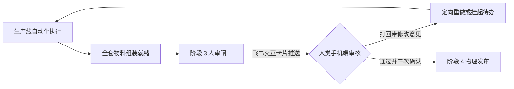
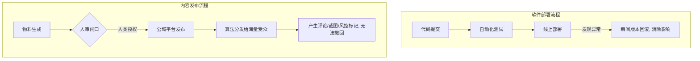
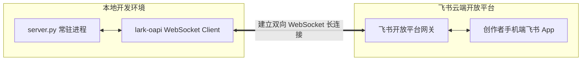

# 第 08 课：安全红线与飞书人审闸口：如何构建人机协同的最后一道安全防线？

一条完全无人值守的自动化脚本在凌晨两点启动。大模型在处理一份技术开源项目的更新日志时产生幻觉，把未经测试的实验性分支性能数据写成了生产环境十倍提升，并在文案末尾附带了一个未经核实的外部资源网盘链接。随后，语音合成、视频录制与自动上传脚本顺次执行，视频在凌晨三点被直接推送到短视频平台。早晨八点，评论区被多位开源作者指出数据作假，平台风控系统同时检测到口播中包含违规导流关键词，账号被判定为引流违规，处以封禁推荐流量七天的处罚。

这类事故在完全脱离人工监督的自动化实验中屡见不鲜。

许多开发者在初次搭建自动化流水线时，容易产生一种执念，希望系统从选题抓取、文案起草、配音录屏到最终发布能够实现百分之百的无人值守。然而，自媒体内容的发布是一个物理不可逆的外向动作。代码在本地跑错可以执行回滚，但内容一旦进入公域推荐池，产生的负面评价、版权侵权与平台风控标记无法一键撤回。

构建工业级内容流水线的核心准则，是在自动化生产与物理发布之间设立一道刚性的人机协同闸口。AI 负责完成百分之九十九的繁重物料准备，人类创作者则在移动端通过低阻力的即时通讯卡片，对关键红线执行最终仲裁。



## 1. 自媒体生产的 5 条不可逾越安全红线

内容生产流水线的自动化程度越高，越需要清晰的规则边界约束模型的生成行为。以下五条安全红线是自动化生产中必须内置的硬性契约。

### 1.1 事实与数据严禁臆造

技术类自媒体的核心资产是个人信誉与专业公信力。大语言模型具有天然的概率生成特性，在面对未知的参数、缺乏依据的对比基准时，容易生成表面通顺却完全虚假的数据。

技术结论必须在官方文档、开源代码提交记录或可复现的评测中找到出处。当提示词要求模型对比多个开源模型的推理延迟时，如果上下文资料中没有包含精确的实测数值，模型必须输出数据未披露，严禁推测或编造对比表格。

在工程实现中，如果让模型自行分析未知项目，提示词中缺少对缺失信息的处理规则时，模型会倾向于按照常见模型的均值填补空白。拦截这种问题的方法，是在前置校验阶段编写自动化检索脚本，检查文案中出现的每一个数字是否都在原始素材中有字面匹配。

```text
素材原文：该模型在 8 卡 H100 环境下单日吞吐量提升 35%。
模型生成：该模型在 8 卡 A100 环境下推理速度提升 50%。
拦截断言：发现未在源文件中声明的硬件型号 A100 与比率数字 50%，校验中断。
```

### 1.2 平台社区合规与防封禁约束

各大短视频平台对内容生态有严格的算法检测与人工巡查机制。触碰平台规则会导致作品被限流、下架，严重时会导致账号永久封禁。

平台合规红线主要包含以下三类：
1. 严禁外部导流：文案与口播中不得出现微信、公众号、网盘链接、私信领取资料等导流话术。平台不仅会识别视频画面中的文字，还会对音频执行语音转文字的实时分析。
2. 严禁绝对化违禁词：广告法与平台规范明确禁止使用全网第一、完全取代、绝无仅有、百分之百等绝对化表述。
3. 严禁夸大收益与虚假承诺：不得包含学会即可月入过万、零基础三天精通等夸大效果的煽动性文案。

在音频合成之前，必须通过纯代码字典对口播文稿执行正则扫描。平台风控系统经常将发音相近的同音词也纳入判定范围。如果仅仅检查字面文本，可能会漏掉口播中发音与违禁词高度重合的词组。

### 1.3 时效性标注、口语化表达与视听规范

除了真实性与合规性，自媒体内容还需要满足特定的传播属性。

时效性内容注明信源与日期。大模型领域技术迭代极快，前天发布的模型权重可能在今天就被官方修补。所有涉及最新发布、版本更新的内容，必须在文案与画面角落明确标注信息抓取日期与官方来源版本号。

口播采用第一人称口语化表达。口播稿是给人耳听的，而不是供眼睛阅读的书面论文。文案中需要避免使用长定语从句、多重括号解释以及生硬的书面转折词。每句话的长度尽量控制在二十字以内，符合自然呼吸节奏。

封面采用 9 比 16 比例且关键要素无遮挡。短视频平台的上下左右均有固定的界面组件，如右侧的互动按钮栏、底部的文案与进度条。封面的核心标题与视觉焦点必须落在安全区域内，防止被平台原生控件遮挡。

把这几条红线变成代码里的正则和断言，比在提示词里苦口婆心地劝模型听话要管用得多。

## 2. 为什么全自动生产线必须停在人审闸口？

明确了安全红线后，一个随之而来的工程决策是：既然可以通过脚本执行合规检查，为什么不能在检查全部通过后直接自动发布？

### 2.1 发布的物理不可逆性

软件工程与内容发布的风险模型存在本质差异。在代码部署体系中，存在沙箱测试、灰度发布、金丝雀发布以及版本回滚等一系列容错机制。如果线上出现异常，一条回滚命令可以在数秒内将系统恢复至健康状态。

短视频发布是一个具备单向扩散效应的物理动作。视频一旦上传并公开，平台的推荐算法会立即将内容推送到数百乃至数万名真实用户的手机屏幕上。



公域平台发布带来的潜在影响包括：
1. 算法分发不可撤回：即使在发现错误后立即删除视频，已经分发出去的播放量与用户认知已经产生，平台对账号健康度的隐式评分也会同步更新。
2. 舆论与法律风险不可控：若视频中存在未经授权的素材引用、侵权代码展示或错误的评测结论，极易被用户截图保存并在社交网络二次传播。
3. 平台风控惩罚具有滞后性：部分合规处罚在发布瞬间不会立刻显现。视频积累一定播放量之后才会触发人工二次审核，此时若被平台下架，负面影响已经形成。

如果自动化发布脚本在上传过程中遭遇网络中断，脚本没有记录原子状态就直接重试，会导致短视频后台连续创建两条一模一样的草稿甚至重复发布两条视频。这种因状态不同步导致的重复外发，属于必须由人工确认拦截的典型事故。

### 2.2 机器质检与人类授权的概念辨析

在自动化流水线的设计中，必须严格区分机器质检通过与人类发布授权这两个概念。

机器质检通过（Review Pass）代表技术指标的合规。它由确定性的测试脚本与大模型裁判执行，能够快速验证音频无死气、分段字数达标、违禁词检测为零、视听文件均已生成等客观条件。机器质检解决的是内容制作是否符合工程规范的问题。

人类发布授权（Publish Authorization）代表业务与法律责任的签署。它由内容所有者执行，负责对选题立意、技术判断的合理性、观感体验以及发布时机做出主观背书。

| 评估维度 | 机器质检通过（Review Pass） | 人类发布授权（Publish Authorization） |
|---|---|---|
| 执行主体 | 自动化脚本、规则引擎、裁判代理 | 账号所有者、人类创作者 |
| 判定依据 | 客观测量值、正则规则、文件完整性 | 语义合理性、价值观取向、战略定位 |
| 关注焦点 | 格式正确、音画同步、无违禁词 | 观点深度、受众共鸣、个人声誉背书 |
| 责任归属 | 工具执行层 | 账号主体与法律责任人 |
| 动作性质 | 中间态推进（drafting 迁移至 review） | 终态执行许可（review 迁移至 approved） |

在合理的分工体系下，人类不再充当底层操作员。AI 负责完成百分之九十九的生产准备工作，将标题、文案、封面、剪辑成片与底层发布命令全部组装完毕。人类只需要在手机端花费十秒钟扫一眼核心要素，点击按钮完成拍板。

把人从日常繁琐的文件搬运中解脱出来，让人专门守在闸口前做最终的裁决，系统的吞吐量和安全性才能兼顾。

## 3. 轻量级审批通道：接入 feishu-notify 机器人

为了让创作者在移动端以最低阻力完成审核，审批通道的选型至关重要。

### 3.1 为什么选择飞书官方 SDK 长连接模式？

传统的审批系统通常需要搭建 Web 控制台或配置公网 Webhook。这种方案需要购置云服务器、申请公网 IP、配置 HTTPS 域名证书，并处理复杂的网络安全防护。

使用飞书官方 SDK 提供的 WebSocket 长连接模式，可以在本地开发机或局域网工作站上直接运行审批常驻服务。



长连接模式具备以下架构优势：
1. 零运维成本：无需公网 IP、无需域名解析、无需在路由器上配置内网穿透端口映射。
2. 穿透局域网与防火墙：本地服务主动向飞书云端建立安全的长连接通道，出站流量默认允许，入站事件通过长连接通道双向回传。
3. 双向交互低延迟：云端卡片事件通过已建立的 TCP 通道毫秒级推送到本地，本地处理完成后能够立即回传更新卡片。

飞书交互卡片的回调接口有一个严格的 3 秒响应窗口约束。如果本地服务器在接收到用户点击事件后，同步去调用大模型生成文案或执行视频编码，一旦耗时超过 3 秒，飞书网关就会向客户端返回代号为 -356 的网络超时错误。

服务架构必须采用同步响应与异步重活解耦的设计。同步线程在 200 毫秒内向飞书网关返回卡片更新结构体与提示信息。耗时较长的重做与发布任务则抛给后台工作线程或子进程执行。

```python
def handle_card_action(data: bytes) -> str:
    event = json.loads(data)
    action_value = event.get("action", {}).get("value", {})
    
    # 同步路径：3秒内立即构造响应体并返回，严禁执行耗时操作
    toast_msg = "审核指令已接收，后台处理中"
    response_card = build_processing_card()
    
    # 异步路径：将重活抛入后台线程
    threading.Thread(target=async_worker, args=(action_value,)).start()
    
    return json.dumps({
        "toast": {"type": "info", "content": toast_msg},
        "card": response_card
    })
```

### 3.2 交互式审批卡片构造与表单陷阱

在飞书开放平台中，交互卡片采用 JSON 格式进行声明。一张完整的内容审核卡片包含头部主题、元数据摘要、正文预览、媒体资产信息以及操作按钮栏。

飞书交互卡片的 JSON 数据结构初看层级较多，容易让人感到繁琐。最直观的调试方法是先在飞书官方的卡片搭建工具中拖拽预览，确认视觉层次后再将导出的 JSON 结构填入 Python 模板。

在 `tools/feishu-bot/cards.py` 中，基础审核卡片的构造函数如下：

```python
def review_card(slug: str, title: str, content_type: str, slug_dir: str, preview: str = "") -> dict:
    type_label = {"kouban": "口播视频", "tuwen": "图文"}.get(content_type, content_type)
    elements = [
        {
            "tag": "div",
            "text": {
                "tag": "lark_md",
                "content": f"**选题：** {title}\n**类型：** {type_label}\n**目录：** `{slug_dir}`"
            },
        }
    ]
    if preview:
        elements.append({
            "tag": "div",
            "text": {"tag": "lark_md", "content": f"**摘要预览：**\n{preview}"}
        })
    elements.append({
        "tag": "action",
        "actions": [
            {
                "tag": "button",
                "text": {"tag": "plain_text", "content": "审核通过"},
                "type": "primary",
                "value": {"action": "approve", "slug": slug, "ns": "douyin"}
            },
            {
                "tag": "button",
                "text": {"tag": "plain_text", "content": "打回修改"},
                "type": "danger",
                "value": {"action": "reject", "slug": slug, "ns": "douyin"}
            },
        ],
    })
    return {
        "config": {"wide_screen_mode": True, "update_multi": True},
        "header": {
            "title": {"tag": "plain_text", "content": f"内容审核 | {title}"},
            "template": "blue"
        },
        "elements": elements,
    }
```

在构造包含用户输入框的打回原因卡片时，存在一个极易踩坑的 JSON 嵌套陷阱。

如果在 `form` 表单容器内部，为了对齐按钮而包裹了一层 `action` 容器，飞书手机端客户端在渲染时会出现内部结构解析异常，导致整个 `input` 输入框在界面上完全消失。正确的构造方式是将 `input` 输入组件与 `form_submit` 提交按钮直接平铺在 `form.elements` 数组中。

```python
def reject_reason_card(slug: str, title: str) -> dict:
    return {
        "config": {"wide_screen_mode": True, "update_multi": True},
        "header": {
            "title": {"tag": "plain_text", "content": f"打回修改 | {title}"},
            "template": "red"
        },
        "elements": [
            {
                "tag": "div",
                "text": {"tag": "lark_md", "content": "**请填写打回原因**（将作为 AI 定向重做的约束依据）："}
            },
            {
                # 避坑要点：form 内的 input 与 button 必须直接平铺在 elements 中，严禁包裹 action 标签
                "tag": "form",
                "name": "reject_form",
                "elements": [
                    {
                        "tag": "input",
                        "name": "reason_text",
                        "placeholder": {"tag": "plain_text", "content": "例如：开头3秒钩子平淡；第2段技术结论需补充官方信源"}
                    },
                    {
                        "tag": "button",
                        "action_type": "form_submit",
                        "name": "rework_btn",
                        "text": {"tag": "plain_text", "content": "打回并自动重做"},
                        "type": "primary",
                        "value": {"action": "reject_rework", "slug": slug, "ns": "douyin"}
                    },
                    {
                        "tag": "button",
                        "action_type": "form_submit",
                        "name": "todo_btn",
                        "text": {"tag": "plain_text", "content": "打回·挂起待办"},
                        "type": "default",
                        "value": {"action": "reject_todo", "slug": slug, "ns": "douyin"}
                    },
                ],
            },
        ],
    }
```

当团队在同一个飞书群中运行多个不同业务线的自动化机器人时，所有卡片按钮的 `value` 字典中必须注入命名空间字段（如 `ns: douyin`）。常驻服务在捕获事件后，先校验命名空间是否匹配。若收到不带命名空间或属于其他项目的事件，应直接忽略，避免两个后台服务相互抢占回调事件。

## 4. 双向流转：飞书事件回调与后续任务触发

当创作者在飞书卡片上点击操作按钮后，后台服务需要根据事件类型驱动状态机的精准迁移。

```mermaid
stateDiagram-v2
    [*] --> review: 内容生成完毕推审
    review --> approved: 人类点击审核通过
    review --> drafting: 人类点击打回并自动重做
    review --> rejected: 人类点击打回挂待办 / 超过重试上限
    
    state approved {
        [*] --> check_material: 自动组装最终物料
        check_material --> wait_publish: 推送二次确认发布卡
        wait_publish --> publishing: 人类点击确认发布
        wait_publish --> approved: 人类点击取消发布
    }
    
    publishing --> published: 平台发布成功
    publishing --> approved: 发布异常, 状态回退
```

### 4.1 用户点击通过：状态机迁移与二次发布确认卡

当人类审核员点击审核通过按钮时，系统并不直接调用底层发布接口，而是执行两步推进：

第一步：调用状态机工具将该条目的元数据状态从 `review` 翻转为 `approved`。

第二步：服务端通过确定性 Python 脚本读取当前目录下的 `meta.yaml`、`4-publish.md` 与 `assets/` 媒体资产文件夹。脚本拼装出最终将要在终端执行的发布命令与物料摘要，并向飞书推送一张确认发布卡片。

```python
def build_publish_confirm_payload(slug_dir: str) -> dict:
    meta = yaml.safe_load(open(f"{slug_dir}/meta.yaml"))
    publish_md = open(f"{slug_dir}/4-publish.md").read()
    
    title = meta.get("title", "")
    tags = meta.get("tags", [])
    video_path = f"{slug_dir}/assets/final.mp4"
    cover_path = f"{slug_dir}/assets/cover.png"
    
    errors = []
    if not os.path.exists(video_path):
        errors.append(f"视频文件缺失: {video_path}")
    if not os.path.exists(cover_path):
        errors.append(f"封面文件缺失: {cover_path}")
        
    cmd_display = f"uv run sau douyin upload-video --title '{title}' --tags '{','.join(tags)}' --video '{video_path}' --cover '{cover_path}'"
    
    return {
        "title": title,
        "summary": {
            "标题": title,
            "标签": " ".join(f"#{t}" for t in tags),
            "视频资产": video_path,
            "封面资产": cover_path
        },
        "cmd_display": cmd_display,
        "errors": errors
    }
```

如果检测到媒体文件缺失，确认发布卡片会标红展示错误清单，并隐藏确认发布按钮，仅允许点击取消。只有在全部物料完备的情况下，创作者点击卡片上的确认发布按钮，系统才会真正唤起发布执行器。两次点击对应两次明确的人类授权，杜绝了误触和盲发风险。

在网络抖动或用户快速连续点击时，飞书网关可能会在短时间内重复投递相同的事件。系统必须内置幂等锁机制。当某个条目正在执行发布任务时，将该条目的唯一标识写入内存互斥集合。后续重复的点击事件直接返回提示信息，防止向平台重复上传相同视频。

### 4.2 用户点击打回：结构化意见回写与受控自愈

当人类审核员发现文案存在瑕疵并点击打回并自动重做时，系统进入受控自愈循环：

第一步：从事件回调的 `action.form_value` 中提取人类填写的具体修改原因。

第二步：将打回时间、审核人与修改原因追加写入该条目的 `3-review.md` 审核记录文件中，并将 `meta.yaml` 的状态从 `review` 翻转回 `drafting`。

第三步：后台异步拉起子代理会话，将修改意见作为上下文约束，指导 AI 针对性修改 `2-script.md`，并在完成修改后重新提交人审。

自愈回路不能无限循环。因为人类对文案的主观评价缺乏确定性的收敛判据，如果模型在多次修改后依然无法满足要求，系统必须设置重试次数上限（建议 `REWORK_LIMIT = 2`）。

当同一条内容的自动重做次数达到两次仍被打回时，系统触发硬熔断。系统将状态翻转为 `rejected`，将卡片更新为转人工处理，并向飞书推送预警通知。后续由人类创作者亲自接管修改，或者决定废弃该选题。

在常驻服务通过子进程拉起命令行工具执行重做时，存在一个环境变量污染问题。如果开发机当前环境中配置了 OAuth 形式的鉴权令牌，子进程会默认继承父进程的环境变量。子进程会误将该令牌作为普通 API Key 传递给云端接口，导致接口抛出非法密钥错误。在拉起子进程前，必须在环境变量字典中显式移除该变量，让子进程回落到本地默认的认证凭证。

```python
def spawn_claude_worker(cmd: list[str]) -> subprocess.Popen:
    env = os.environ.copy()
    # 避坑要点：必须移除继承的外部环境变量，防止子进程鉴权失效
    env.pop("ANTHROPIC_API_KEY", None)
    return subprocess.Popen(
        cmd,
        env=env,
        stdout=subprocess.PIPE,
        stderr=subprocess.PIPE,
        text=True
    )
```

## 5. 实战演练：驱动审批与自愈回路的提示词工程

在整套飞书人审系统中，提示词是连接业务逻辑与模型动作的核心纽带。以下给出三套标准化提示词模板，分别负责驱动卡片生成、打回重构以及发布执行。

### 5.1 提示词模板一：驱动 AI 生成飞书审批交互卡片

用于在自动化生产线完成物料制作后，驱动 Worker Agent 自动提取物料信息、执行合规自检，并构造合法的飞书卡片 JSON 数据结构。

```markdown
# 角色与目标
你是一名自媒体流水线出审工程师，负责检查当前内容条目的物料完整性，执行合规自检，并生成符合飞书开放平台规范的交互式审核卡片数据。

# 输入资料契约
请按顺序读取以下文件：
1. 基础元数据：`<SLUG_DIR>/meta.yaml`（获取 title, slug, type, tags）
2. 完整口播文稿：`<SLUG_DIR>/2-script.md`
3. 媒体资产目录：`<SLUG_DIR>/assets/`（确认 final.mp4 与 cover.png 是否存在）

# 合规自检要求
在构造卡片前，对 `<SLUG_DIR>/2-script.md` 执行以下检查并生成检查清单：
1. 事实依据：文中文案是否均有明确信源，有无推测性 benchmark 数据。
2. 社区合规：是否包含外部导流词汇（微信、公众号、私信）、绝对化违禁词（最强、第一、绝对）。
3. 视听参数：封面图片是否为 9 比 16 比例。

# 输出规范
请输出合法的 JSON 格式，严禁包含 markdown 围栏外的多余文字。JSON 必须包含两部分：
1. `audit_summary`: 包含上述三项自检的 PASS 或 FAIL 状态与简短说明。
2. `card_payload`: 符合飞书交互卡片规范的完整字典对象，包含 header, elements（展示标题、类型、目录、自检清单以及审核通过与打回修改按钮），所有按钮的 value 必须携带 `{"slug": "<SLUG>", "ns": "douyin"}`。
```

### 5.2 提示词模板二：人类打回后驱动 AI 定向重构的提示词

当人类在飞书卡片中输入打回原因并提交后，常驻服务拉起独立的子代理会话，使用该提示词引导 AI 针对性修改文案，严禁破坏已有的未受损资产。

```markdown
# 角色与任务
你收到了一份来自人类审核员的打回修改指令。你的任务是针对人工意见对指定内容执行精准修复，并重新提请人审。

# 任务上下文
- 内容条目标识：`<SLUG>`
- 条目工作目录：`<SLUG_DIR>`
- 当前重做轮次：第 `<NTH>` 次（上限为 2 次）
- 人类打回原因：`<REASON_TEXT>`

# 执行规范与动作准则
1. 审查历史记录：
   读取 `<SLUG_DIR>/3-review.md` 与 `<SLUG_DIR>/2-script.md`，深入分析人类打回的痛点。
2. 外科手术式修改：
   仅针对打回原因指出的段落或词句进行精准重写。严禁重构没有被提及的合格小节，严禁擅自更换选题立意。
3. 视听资产联动评估：
   如果修改口播台词影响到了语音合成，仅重新生成对应变动段落的音频配置，保持其他配置不变。
4. 状态记账与归档：
   修改完成后，在 `<SLUG_DIR>/3-review.md` 中追加一行重做记录（包含修改说明与时间戳），并在终端执行命令将状态改回待审：
   `media flip <SLUG> review`

# 异常退出条件
如果在重做过程中遇到无法由 AI 独立决策的主观方向分歧，停止自动修改，在 `<SLUG_DIR>/3-review.md` 中记录待办事项，将状态保留为 `rejected` 并退出。
```

### 5.3 提示词模板三：二次确认发布与执行授权提示词

当人类在飞书端点击确认发布按钮后，常驻服务拉起发布代理，使用该提示词执行最终的物理发布动作。

```markdown
# 角色与职责
你是一名自媒体发布执行代理。人类创作者已经在飞书移动端对条目 `<SLUG>` 查阅了最终物料并点击了确认发布按钮，本次执行已获得最高权限授权。

# 执行前置条件检查
1. 确认该条目的元数据状态必须为 `approved`。若不是，立即终止并报错。
2. 确认 `<SLUG_DIR>/4-publish.md` 中声明的标题、话题标签与 `<SLUG_DIR>/assets/` 下的媒体文件均已就绪。

# 发布动作执行
在终端执行底层发布命令，跳过任何交互式二次确认提示：
`claude -p "/douyin-publish <SLUG> --publish"`

# 状态收尾与记账（唯一终态落盘）
1. 观察发布命令的控制台输出。
2. 仅在底层发布工具返回成功标记且平台返回有效作品标识后，调用状态收尾命令：
   `media publish-done <SLUG>`
3. 如果发布命令返回网络超时或登录凭据失效，严禁私自尝试自动化绕过登录，如实记录错误日志并保持当前状态不变。
```

## 6. 总结与作业

将自动化生产线停在人审闸口前，是保证自媒体内容质量与账号安全的必要手段。通过飞书官方 SDK 的 WebSocket 长连接，我们在无需公网服务器的前提下，构建了极低摩擦力的移动端审批体验。通过区分机器质检与人类授权、实施二次确认发布以及设置带熔断的自愈回路，流水线实现了兼具高效生产与风险可控的工程体系。

### 验收清单

在完成本课的内容配置后，可以通过以下清单验证审批闸口的完整性：

1. 飞书长连接常驻服务能够稳定运行，控制台日志输出连接成功状态。
2. 触发一次模拟出审流程，飞书群能准时收到包含视频摘要与自检清单的审核卡片。
3. 在飞书端点击审核通过，原卡片即时更新为处理中状态，并在 3 秒内收到包含最终发布命令的二次确认卡片。
4. 在飞书端点击打回修改并输入测试意见，本地服务能正确捕获输入内容，追加写入 `3-review.md` 并触发定向重构任务。
5. 当同一条目连续打回达到两次时，系统正确触发硬熔断，停止自动重做并推送转人工卡片。

### 课后作业

1. 搭建本地飞书机器人服务：
   在飞书开放平台创建一个企业自建应用，开启机器人能力并订阅 `card.action.trigger` 事件。使用 Python 与 `lark-oapi` 编写一个最小化常驻脚本，能够接收卡片点击并在控制台打印接收到的事件数据。

2. 设计防抖与幂等控制逻辑：
   编写一个带有内存锁机制的事件分发函数。模拟当用户在 1 秒内连续点击三次同一张卡片的确认发布按钮时，确保底层发布任务只被调度执行一次，其余两次点击均返回正在处理中的提示信息。
