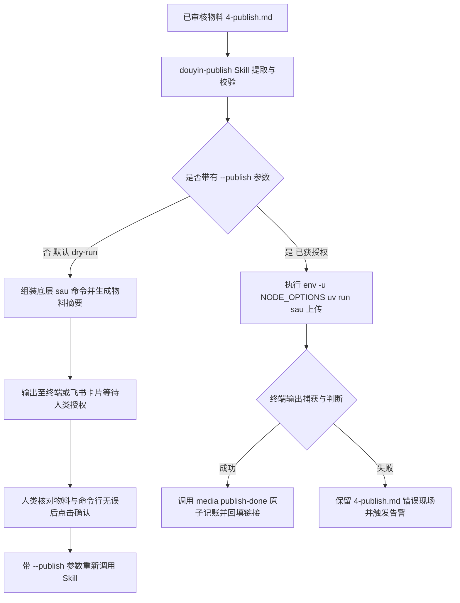

# 第 09 课：包装 social-auto-upload 发布 Skill：发布前必须 dry-run 的铁律与多平台发布实战

在自动化流水线的各个环节中，发布操作具有不可逆的外部副作用。文案写偏了可以重新生成，配音念错了可以重新合成，页面布局崩了可以重新调整代码。但一旦一条视频被真实上传到了公开平台，错误的标题、错位的封面或者未完成的测试视频就会直接进入平台审核流，并暴露在公网中。

许多工程师在尝试自动化发布时，第一反应是自己写一段浏览器自动化脚本。打开浏览器的开发者工具，抓取上传按钮的选择器，填写表单，点击发布。然而这类脚本在生产环境中往往跑不过两周。短视频平台前端频繁变动的 DOM 结构、文件切片上传协议、突发的活动弹窗以及严格的风控滑动验证码，会让手写脚本陷入无休止的维护泥潭。

构建高可用发布能力的工程解法包含两个核心支柱。第一，复用开源社区成熟的多平台上传引擎，通过薄封装将其包装为大语言模型可调用的标准发布技能。第二，在发布前严格推行 dry-run 预览机制，将大模型组装的执行命令与物料摘要先呈现给人类做二次确认，获得明确授权后才执行物理发布。



## 1. 技术选型：为什么不要自己手写平台上传脚本

在设计发布节点时，最常见的技术误区是低估了短视频平台创作者后台的工程复杂度。

### 1.1 短视频平台上传流程的复杂性与脆弱性

自己编写基于 Playwright 或 Selenium 的上传脚本，通常从录制一段上传点击流程开始。在本地测试时流程可以跑通，但一旦接入无人值守的定时调度，脚本就会频繁报错中断。折腾过浏览器自动化的人都会遇到类似情况：最耗费精力的环节往往在于平台在某个深夜静悄悄换了一套前端类名。

导致手写脚本崩溃的主要原因集中在四个维度：

1. 动态类名与 A/B 测试。头部内容平台的创作者后台通常采用现代前端工程架构，CSS 类名多为哈希编译产物，页面元素没有固定 ID。平台每周都会对部分用户灰度上线新版 UI，按钮文案可能从发布视频变为立即发布，上传输入框的 DOM 层级也可能随时调整。手写的 CSS 或 XPath 选择器会直接失效。

2. 大文件切片上传协议。视频文件并非通过一个简单的 HTTP POST 表单提交。平台在前端会计算视频的 SHA256 哈希值，根据网络状况将视频切割为数兆字节的二进制切片，并发向对象存储上传，最后调用合并接口。如果自动化脚本仅通过控制网页表单尝试注入文件，只要遇到网络波动导致的切片丢包，页面就会停在上传进度 99% 的状态，脚本无法捕获底层的重试信号。

3. 复杂弹窗与蒙层遮挡。短视频平台在创作者上传视频后，经常会弹出各类交互弹窗。包括但不限于：青少年模式提醒、创作者权益升级通知、平台专属话题推荐弹窗、以及强制要求的封面裁剪确认浮层。手写脚本如果只按固定时间等待元素，极易被突发的弹窗遮挡点击事件，导致定位超时异常。

4. 风控与行为轨迹检测。各大平台对自动化发布均设有反爬与风控规则。如果检测到浏览器在无头模式下运行，或者鼠标移动轨迹呈现机械的直线瞬间移动，就会立刻触发图形滑动验证码，甚至临时封禁网页端的投稿权限。

维护一个单平台的自研上传脚本，平均每月需要投入 10 到 15 个小时跟进前端改版与修复选择器。如果业务需要分发到抖音、小红书、B站和视频号等多个平台，维护成本会呈倍数膨胀。

如果你在自己写脚本时遇到了定位超时报错：

```text
playwright._impl._errors.TimeoutError: Page.wait_for_selector: Timeout 30000ms exceeded.
=========================== logs ===========================
waiting for locator("button.publish-btn-v2") to be visible
============================================================
```

这通常意味着平台修改了按钮的类名结构，或者上一层的封面裁剪弹窗未被关闭。

### 1.2 开源项目 social-auto-upload 核心架构与薄封装原则

专业的事情应当交给专门的开源项目来处理。开源项目 `social-auto-upload`（在命令行中通常调用其缩写 `sau`）是目前社区中维护度较高的多平台自动化上传框架。

`social-auto-upload` 的底层架构具备以下关键特性：

1. 环境完全隔离。项目通过 `uv` 包管理器搭配 Python 3.12 虚拟环境运行。它内置了打过反检测补丁的 Patchright 浏览器驱动，能够自动抹除常见的自动化特征，降低触发滑动验证码的概率。

2. 原生多平台支持。框架抽象了统一的上传基类，为抖音、小红书、B站、微信视频号等主流平台分别实现了视频（`upload-video`）和图文（`upload-note`）的专用上传器，统一处理了切片重传、封面上传与动态话题添加。

3. 账号与 Cookie 持久化。支持多账号独立管理，将各平台的会话状态持久化保存在本地 JSON 文件中，支持定时探活与免扫码复用。

针对这类成熟的开源工具，工程上的集成策略是薄封装原则。

薄封装原则包含三个具体要求：

1. 不侵入修改开源项目的核心代码。保持 `tools/social-auto-upload/` 目录为一个独立的 Git 子模块或独立依赖，随时可以通过 `git pull` 同步社区关于平台新版 DOM 的修复补丁。

2. 在外层建立契约映射。通过标准 Skill 规范，把自媒体流水线产出的标准内容文件，转换为 `sau` CLI 所需的入参。

3. 隔离外部不稳定性。如果平台发生重大改版导致 `sau` 上传失败，只需要在 `sau` 项目内部更新选择器，流水线上游的选题、脚本编写、配音与渲染代码完全不需要变动。

下表列出了自己维护脚本与采用薄封装开源框架的成本对比：

| 评估维度 | 自研手写 Playwright 脚本 | 薄封装 social-auto-upload |
|---|---|---|
| 多平台支持 | 每个平台需独立编写并测试 | 开源框架开箱即用支持 4 个主流平台 |
| 前端改版应对 | 需人工抓取 DOM 并修改选择器 | 依托开源社区协作更新代码 |
| 反爬与风控对抗 | 需自行研究 WebDriver 特征抹除 | 内置 Patchright 底层特征伪装 |
| 流水线集成方式 | 脚本与业务逻辑高度耦合 | 独立 CLI 进程调用，输入输出标准化 |
| 故障排查范围 | 需排查整条执行逻辑 | 职责清晰，定位快速锁定在 CLI 层 |

采用薄封装模式后，流水线关注的重心从如何点中页面按钮，转变为如何组织正确的物料契约。

## 2. 物料准备与契约映射：4-publish.md 规范

在生产流水线中，内容在进入发布阶段前，必须已经完成文案创作、音频合成、视频渲染与人类初审。发布阶段不应该再包含任何内容生成逻辑，它只负责消费已经确定好的物料。

### 2.1 出审前必产的发布物料清单

为了保证发布动作的确定性，流水线规定在创作完成并提交审核时，必须在对应内容目录下生成一份结构严格的 `4-publish.md` 文件。

一份标准的 `4-publish.md` 包含五个核心字段：

```markdown
# 发布物料：09-包装social-auto-upload发布Skill

- **标题**：站在巨人肩膀上：为什么你绝不应该手写视频上传脚本？
- **正文/简介**：做自媒体自动化最容易踩的坑就是自己写 Playwright 去点网页。平台一旦改版脚本全崩。本期分享如何用薄封装复用开源 CLI，以及发布前必须执行 dry-run 的安全铁律。
- **话题标签**：#AI编程 #自动化 #Claude #Python
- **封面**：assets/cover.png
- **媒体文件**：assets/final.mp4

## 建议发布时段
工作日晚间 19:30 - 21:00
```

为什么必须把物料以静态文件的形式提前固定下来？

如果在发布命令触发时才让大语言模型去即兴生成标题和话题，模型可能会因为温度采样产生非预期的变异。例如生成了包含违规导流词汇的简介，或者生成了超过平台字数限制的超长标题。将静态物料作为硬约束，能够确保发布的内容与审核人员在飞书卡片上看到的内容完全一致。

### 2.2 物料解析器设计与发布时段避坑

发布 Skill 需要从 `4-publish.md` 中提取各项数据，并将其精准映射为 `sau` 命令的参数。

字段映射规则如下：

1. 标题提取：提取 `- **标题**：` 后的整行文本。抖音平台对视频标题通常有长度限制（一般建议在 30 到 50 个字符以内），超长时应当给出截断警告。

2. 正文简介提取：提取 `- **正文/简介**：` 后的多行文本，对应视频上传命令的 `--desc` 参数，或者图文上传命令的 `--note` 参数。

3. 话题标签格式转换：在 `4-publish.md` 中，人类习惯使用带有 `#` 符号的标签（如 `#AI编程 #Python`）。但 `sau` CLI 的底层设计要求传入逗号分隔且不带 `#` 的字符串（例如 `--tags AI编程,Python`），`sau` 内部在向平台输入时会自动补充 `#` 符号。如果解析器没有剥离 `#` 号直接传入，平台发布出来的标签就会变成 `##AI编程`，导致话题索引失效。

4. 媒体文件与封面路径转换：必须将相对路径转换为运行环境下的绝对路径。例如 `assets/final.mp4` 需转换为 `/Users/yedi/douyin-media/content/2026-06-16/demo/assets/final.mp4`，防止子进程工作目录切换导致文件未找到。

5. 发布时间参数避坑：`sau` 接收 `--schedule` 参数用于定时发布，格式必须为严格的标准时间字符串 `YYYY-MM-DD HH:MM`（例如 `2026-06-16 19:30`）。

这里有一个极易出错的陷阱：严禁把 `4-publish.md` 里的自然语言建议（如建议发布时段：工作日晚间）直接拼接到 `--schedule` 参数中。当没有指定具体的标准时间戳时，默认不传递 `--schedule` 参数，代表立即发布。

同时，定时发布的时间点必须落在平台的合法时间窗口内。抖音通常要求定时发布时间距离当前时间至少在 2 小时以上，且不得超过 14 天。如果传入了一个 10 分钟后的时间，平台接口会直接报错拒绝。

下面是一个用 Python 实现的标准物料解析器代码：

```python
import re
import os
from pathlib import Path

def parse_publish_materials(material_path: str, base_dir: str) -> dict:
    with open(material_path, "r", encoding="utf-8") as f:
        content = f.read()

    # 提取标题
    title_match = re.search(r"-\s*\*\*标题\*\*\s*[:：]\s*(.+)", content)
    if not title_match:
        raise ValueError("4-publish.md 缺失必填字段：标题")
    title = title_match.group(1).strip()

    # 提取正文或简介
    desc_match = re.search(r"-\s*\*\*(?:正文/简介|正文|简介)\*\*\s*[:：]\s*(.+?)(?=\n-\s*\*\*|\n##|$)", content, re.S)
    if not desc_match:
        raise ValueError("4-publish.md 缺失必填字段：正文/简介")
    desc = desc_match.group(1).strip()

    # 提取话题标签并清理 # 号
    tags_match = re.search(r"-\s*\*\*话题标签\*\*\s*[:：]\s*(.+)", content)
    tags_list = []
    if tags_match:
        raw_tags = tags_match.group(1).strip()
        # 拆分并去除开头的 # 符号
        tags_list = [t.lstrip("#").strip() for t in re.split(r"[\s,，#]+", raw_tags) if t.strip()]
    formatted_tags = ",".join(tags_list)

    # 提取媒体文件路径
    media_match = re.search(r"-\s*\*\*媒体文件\*\*\s*[:：]\s*(.+)", content)
    if not media_match:
        raise ValueError("4-publish.md 缺失必填字段：媒体文件")
    raw_media_path = media_match.group(1).strip()
    abs_media_path = str(Path(base_dir) / raw_media_path)
    if not os.path.exists(abs_media_path):
        raise FileNotFoundError(f"媒体文件在磁盘上不存在：{abs_media_path}")

    # 提取封面路径（可选）
    cover_match = re.search(r"-\s*\*\*封面\*\*\s*[:：]\s*(.+)", content)
    abs_cover_path = None
    if cover_match:
        raw_cover_path = cover_match.group(1).strip()
        abs_cover_path = str(Path(base_dir) / raw_cover_path)
        if not os.path.exists(abs_cover_path):
            raise FileNotFoundError(f"封面文件在磁盘上不存在：{abs_cover_path}")

    return {
        "title": title,
        "desc": desc,
        "tags": formatted_tags,
        "media_file": abs_media_path,
        "cover_file": abs_cover_path
    }
```

如果你在运行解析器时遇到了 `FileNotFoundError` 报错，先检查路径拼接时是否漏掉了工作空间的根目录前缀。

## 3. 打造专属发布 Skill：douyin-publish 与 Dry-run 机制

有了底层工具和物料契约，下一步是把它们封装为一个可由大语言模型或流水线调度的 Skill：`douyin-publish`。

### 3.1 双模式设计：--dry-run vs --publish

在自动化流水线中，发布命令必须具备防御性设计。`douyin-publish` 采用了双模式运行机制：

```text
/douyin-publish <slug>            # 模式 1：默认 dry-run 预览，绝不执行物理上传
/douyin-publish <slug> --publish  # 模式 2：携带授权信号，直接执行真发
```

两种模式的职责划分十分严格：

1. 预览模式（未携带 `--publish` 参数）。Skill 读取物料文件，检查视频文件和封面是否存在，进行前置状态校验（`meta.yaml` 中的 `status` 必须为 `approved`）。然后拼装出完整的 `sau` CLI 命令行，连同物料摘要一起打印到终端或推送到飞书审批卡片。此时进程主动退出，绝不调用底层子进程去启动浏览器或发送网络请求。

2. 执行模式（携带了 `--publish` 参数）。携带 `--publish` 意味着调用方已经完成了人类授权（例如操作员在飞书卡片上点击了确认发布按钮）。Skill 收到该信号后，不再打印确认提示，不再发起二次人机对话询问，而是直接在子进程中调用拼装好的命令，并实时监控进程输出。

这种模式分离避免了自动化脚本陷入假死状态。如果在无交互环境（如后台脚本或定时调度）中调用发布，发现进程卡死无响应，多半是忘记传入 `--publish` 参数，导致 Skill 停在终端交互等待确认阶段。

### 3.2 为什么 Dry-run 是发布环节的绝对铁律

为什么不能让大模型直接一步到位执行发布？

大语言模型在生成命令行参数时具有概率性特征。即使提示词写得再详尽，模型偶尔也会发生参数幻觉：

1. 路径拼接错乱。可能将 `assets/final.mp4` 拼成了上一期的旧文件名，导致把错误的历史视频再次发布出去。

2. 标点与特殊字符转义异常。如果视频标题中包含双引号、单引号或反斜杠，模型在组装 Shell 命令时可能未正确添加转义符，导致 Shell 执行时截断命令，把标题后半截当成非法指令执行。

3. 发布时间解析偏离。把尚未到期的定时草稿以立即发布的形式公开。

Dry-run 机制的本质是在不可逆的操作前建立一道强制的反射面。无论大模型的推理过程如何，最终落到终端准备执行的那一行 Shell 代码，必须完整呈现在操作者的眼皮底下。看到真实的命令行与真实的视频路径，是确保系统安全的最硬底线。

### 3.3 核心提示词实战：三步引导 AI 完成发布调度

在实际工程中，如何让大语言模型稳定可靠地完成发布全流程？关键在于编写清晰、无歧义的调度提示词。

这套调度分为三步，每一步使用专门的提示词引导模型执行单一动作。

#### 第一步：发布 Dry-run 检查提示词

这一步的目标是让 AI 充当严谨的质检员与命令组装器。它必须先核查条目状态，校验本地物理文件，转换话题标签，最后生成完整命令。

你可以直接使用如下系统提示词：

```text
你是一个严谨的自动化发布调度 Agent。你的任务是对指定的内容条目执行发布前的 Dry-run 检查，拼装出可执行的 sau CLI 发布命令，并生成格式化核对报告。

【检查与执行规程】
1. 状态核查：读取 content/<slug>/meta.yaml 文件，检查 status 字段。必须严格等于 approved。如果状态不等于 approved，立即中止流程，输出错误说明并退出。
2. 物料读取与文件校验：
   - 读取 content/<slug>/4-publish.md 文件。
   - 提取 标题（title）、正文/简介（desc）、话题标签（tags）、封面路径（thumbnail）、媒体文件路径（file）。
   - 检查媒体文件与封面文件在磁盘上是否存在。若文件不存在，立即中止并报错。
3. 字段规则转换：
   - 话题标签必须清理掉所有 # 符号，转换为英文逗号分隔的纯文本字符串（例如：AI工具,编程技巧）。
   - 文件路径必须转换为本机的绝对路径。
   - 若 4-publish.md 仅有自然语言发布时段建议，且未传入明确的标准时间，则默认不传递 --schedule 参数，并在报告中显式标注为立即发布。
4. 命令拼装：
   - 视频内容拼装命令：
     cd "$SAU_DIR" && env -u NODE_OPTIONS uv run sau douyin upload-video --account main --file "<绝对路径.mp4>" --title "<标题>" --desc "<正文内容>" --tags <逗号分隔标签> --thumbnail "<封面绝对路径>" --headed
5. 铁律：本阶段为 Dry-run 模式，你绝对不能调用 Bash 工具去执行这条命令。你必须输出如下格式的物料摘要报告，然后停下等待人类确认：

【发布物料核对单 (Dry-run)】
- 作品 Slug：<slug>
- 视频标题：<标题>
- 话题标签：#标签1 #标签2
- 媒体文件：<绝对路径> (已验证存在)
- 封面文件：<绝对路径> (已验证存在)
- 发布模式：立即发布 / 定时发布 (<时间>)
- 待执行命令：
```bash
<完整 sau 命令>
```
请确认以上物料与命令是否正确。若确认发布，请下达带有 --publish 参数的授权指令。
```

#### 第二步：获得人类明确授权后的执行提示词

当操作员核对完 Dry-run 报告并确认无误后，会下达带有 `--publish` 参数的指令。此时模型应当直接触发真实执行，不再进行任何多余的确认询问。

执行阶段的调度提示词如下：

```text
你是一个自动化发布执行 Agent。你现在已经获得了人类的明确发布授权（指令中包含 --publish 标志）。

【执行规程】
1. 执行授权判定：检测到 --publish 参数，说明前置审核与 Dry-run 均已通过，你必须立即执行真实发布，禁止再次向人类询问确认，禁止只打印命令而不执行。
2. 环境变量与命令执行：
   - 必须使用 env -u NODE_OPTIONS 清除可能污染子进程的环境变量。
   - 调用 Bash 工具执行拼装好的 sau 上传命令。
3. 输出流监控与成功判断：
   - 捕获子进程的全部标准输出（stdout）与标准错误（stderr）。
   - 只有当输出流中明确包含 "视频发布成功"、"发布成功" 或 "submitted" 等成功标识时，才判定为发布成功。
4. 发布成功收尾记账：
   - 判定成功后，调用媒体管理 CLI 进行原子状态更新：
     media publish-done <slug>
   - 如果终端输出了作品链接，则追加 --url 参数传入作品链接。
   - 将实际发布时间与作品链接回填到 4-publish.md 文件的末尾记录区。
5. 向人类汇报最终执行结果与作品状态。
```

#### 第三步：异常排错与安全挂起提示词

在实际发布过程中，可能会遇到网络超时、Cookie 假死或平台接口风控。模型必须具备准确识别错误并安全处理的能力，最核心的底线是严禁盲目重复提交导致多发。看到终端打出绿色的发布成功字样，心里才算真正踏实。

异常处理提示词如下：

```text
你是一个发布异常排查与自愈 Agent。当 sau 上传命令返回非零退出码或在输出中报错时，按照以下规程进行排查与分流处理：

【排错与分流矩阵】
1. 偶发性网络超时与渲染阻塞（报错包含 TimeoutError、net::ERR_CONNECTION_TIMED_OUT、Page.wait_for_selector timeout）：
   - 允许且仅允许原样重新执行一次上传命令。
   - 若重试后成功，继续走正常收尾记账流程。
   - 若重试依然失败，判定为硬性阻塞，立即中止，严禁执行第 3 次重试。
2. 登录态失效与 Cookie 假死（报错包含 cookie expired、请先登录、Locator strict mode violation 且页面停留在登录弹窗）：
   - 严禁继续重试上传。
   - 输出明确的排查指引：旧 Cookie 已失效，请在终端执行强制重新扫码登录命令。
   - 保持 meta.yaml 中的 status 为 approved 不动，将错误日志追加到 4-publish.md。
3. 平台业务风控与规则拦截（报错包含 标题违规、包含敏感词、操作过于频繁、今日投稿次数已达上限）：
   - 绝对禁止重试。
   - 立即将任务标记为挂起（blocked）。
   - 输出告警信息，提取具体报错文本并推送到飞书运维通道，交由人工处理。

【记账底线】
无论发生何种异常，只要未明确收到平台发布成功的标识，绝对不得调用 media publish-done 命令，绝对不得修改 meta.yaml 的状态为 published。
```

通过这三组提示词的配合，大模型在发布流程中的角色被清晰地限制在指令组装、受控执行与异常归因上，杜绝了失控风险。

## 4. 账号登录态管理与异常排查

自动化发布依赖长效的 Cookie 登录态。在实际工程落地中，处理好 Cookie 的持久化、探活与特殊环境下的依赖冲突，是保证系统能够长期稳定运行的关键。

### 4.1 Cookie 持久化存储与自动探针校验

`social-auto-upload` 会将扫码登录成功后的浏览器上下文（包括 Cookie、LocalStorage 和 SessionStorage）序列化保存到本地文件：

```text
tools/social-auto-upload/cookies/douyin_main.json
```

在日常运行中，可以通过 `sau douyin check` 命令检查当前 Cookie 是否有效：

```bash
cd tools/social-auto-upload && uv run sau douyin check --account main
```

这里存在一个在生产中反复出现的探针误报陷阱：

`sau douyin check` 底层采用的是轻量级的接口探测。只要 Cookie 里的某些非核心字段未过期，探针可能就会返回 `valid`（有效）。甚至在调用 `sau douyin login` 时，底层的 `cookie_auth` 逻辑如果探测到这个弱有效的状态，会直接打印 `login flow completed` 并跳过拉起扫码界面的动作。

然而，当真正执行 `upload-video` 进入抖音创作者服务平台的深度上传页面时，平台会对关键的鉴权凭证（如 `sessionid`）进行严格校验。一旦 `sessionid` 过期，上传页面就会强制弹出手机验证码登录墙，导致自动化脚本抛出元素定位冲突异常：

```text
playwright._impl._errors.Error: Locator.click: Error: strict mode violation: locator("div.login-mask") resolved to 2 elements:
    1) <div class="login-mask">...</div> aka get_by_text("快捷登录")
    2) <div class="login-mask">...</div> aka get_by_text("密码登录")
```

如果你发现 `sau check` 返回 `valid`，但真正上传时卡在登录弹窗，这是因为弱探针没有检测 `sessionid` 的真实过期状态。

排查并解决 Cookie 假死问题的标准流程如下：

1. 强制移开旧 Cookie。遇到探针报 `valid` 但上传报登录墙的情况，先将旧的 Cookie 文件重命名备份：

```bash
cd tools/social-auto-upload
mv cookies/douyin_main.json cookies/douyin_main.json.bak
```

2. 强制拉起有头浏览器重新扫码：

```bash
env -u NODE_OPTIONS uv run sau douyin login --account main --headed
```

3. 验证新 Cookie 的有效期限。用代码检查生成的 `cookies/douyin_main.json`，找到 `name` 为 `sessionid` 的字段。核对它的 `expires` 时间戳是否在当前时间的 60 到 90 天之后。同时确认该 JSON 文件的修改时间（mtime）为刚刚写入。

### 4.2 常见发布异常排查与环境防污染

除了 Cookie 状态，发布环境还常遇到两类工程问题。

#### 1. NODE_OPTIONS 环境变量污染

在使用终端多路复用工具（如 cmux）或者特定的 Claude Code / Agent 会话环境中，父进程经常会向子进程注入 `NODE_OPTIONS` 环境变量。例如指向临时的 `restore-node-options.cjs` 脚本，用于维持会话跟踪。

当 `sau` 调用底层的 Patchright / Playwright 启动浏览器时，Playwright 内部会派生 Node.js 子进程。由于这些临时跟踪文件在会话结束后会被系统清理，遗留的 `NODE_OPTIONS` 环境变量会导致 Node 子进程启动失败，抛出如下报错：

```text
node:internal/modules/cjs/loader:1252
  throw err;
  ^
Error: Cannot find module '/var/folders/.../T/cmux-claude-node-options/restore-node-options.cjs'
    at Module._resolveFilename (node:internal/modules/cjs/loader:1249:15)
...
Connection closed while reading from the driver
```

解决这一问题的工程手段非常简单。在调用 `sau` 的所有命令前，显式使用 `env -u NODE_OPTIONS` 清除该环境变量：

```bash
cd tools/social-auto-upload && env -u NODE_OPTIONS uv run sau douyin upload-video ...
```

#### 2. 发布收尾的原子记账

一条内容发布成功后，流水线中涉及状态变更的地方共有三处：
- 条目自身的 `content/<slug>/meta.yaml` 需要将 `status` 从 `approved` 翻转为 `published`（或者定时发布的 `scheduled`）。
- 选题池 `content/_backlog/backlog.yaml` 中的对应选题条目需要从 `picked` 同步翻转为 `published`。
- 派生视图 `dashboard.md` 需要将该条目从在制列表中移出。

如果让大模型分别去修改这三个文件，极易出现漏改。例如修改了 `meta.yaml` 却忘记更新 `backlog.yaml`，导致后续选题调度重复拾取。

工程上必须将这三项变更收口到单一的控制台命令中：

```bash
media publish-done <slug> --url "https://www.douyin.com/video/123456789"
```

该命令由控制台 CLI（`tools/console/`）提供，内部在单个事务中完成三个文件的同步修改。如果暂时拿不到视频的线上 URL，可以直接运行 `media publish-done <slug>`，后续巡检工具会提示补填链接，但核心状态已经完成了原子翻转。

## 5. 验收标准与课后练习

为了确保你封装的发布 Skill 达到生产可用标准，请按照以下清单逐项验证。

### 5.1 验收标准

1. 环境与依赖隔离性：在 `tools/social-auto-upload` 目录下能够独立通过 `uv run sau --help` 查看到抖音上传子命令，且能够通过 `env -u NODE_OPTIONS uv run sau douyin check --account main` 正常执行探针检测。
2. 物料契约完备性：`content/<slug>/4-publish.md` 包含标准标题、正文简介、话题标签、封面路径与媒体文件字段，文件在磁盘上路径真实有效。
3. Dry-run 拦截可靠性：执行 `/douyin-publish <slug>` 时，系统只输出包含可复制 CLI 命令与物料核对单的摘要报告，绝不在后台启动浏览器或发起实际上传。
4. 授权发布完整性：执行 `/douyin-publish <slug> --publish` 时，能够顺利调用底层 `sau` 命令完成上传，并在成功后自动触发 `media publish-done` 同步更新所有状态文件。

### 5.2 课后练习

1. 在本地部署 `social-auto-upload` 项目，使用 `env -u NODE_OPTIONS uv run sau douyin login --account main --headed` 完成一次抖音账号的扫码登录，并在登录后打开 `cookies/douyin_main.json` 查看 `sessionid` 的过期时间。
2. 准备一段 10 秒钟的测试视频与一张 3:4 比例的封面图片，编写一份 `4-publish.md` 物料文件。
3. 运行发布 Skill 的 Dry-run 检查提示词。观察 AI 是否能准确识别并剥离话题标签中的 `#` 符号，并检查组装出的 `sau` 命令中各项参数是否为绝对路径。
