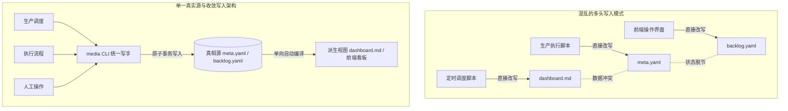
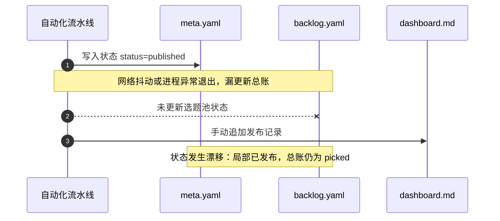
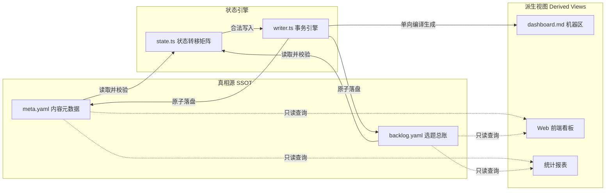
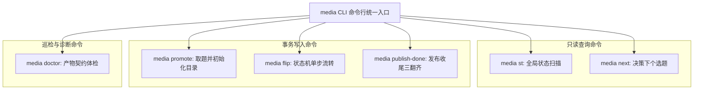
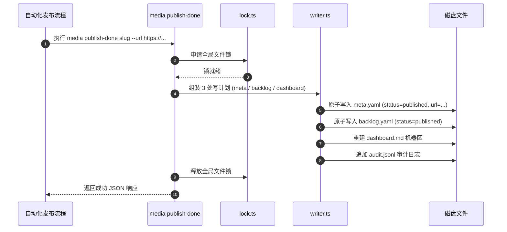
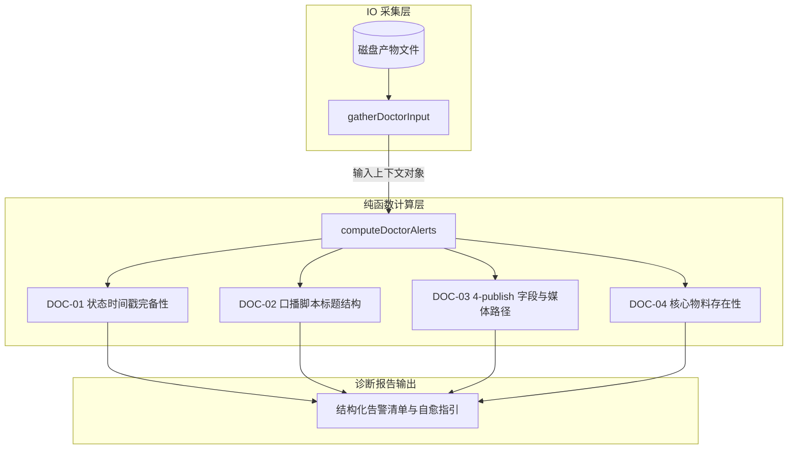
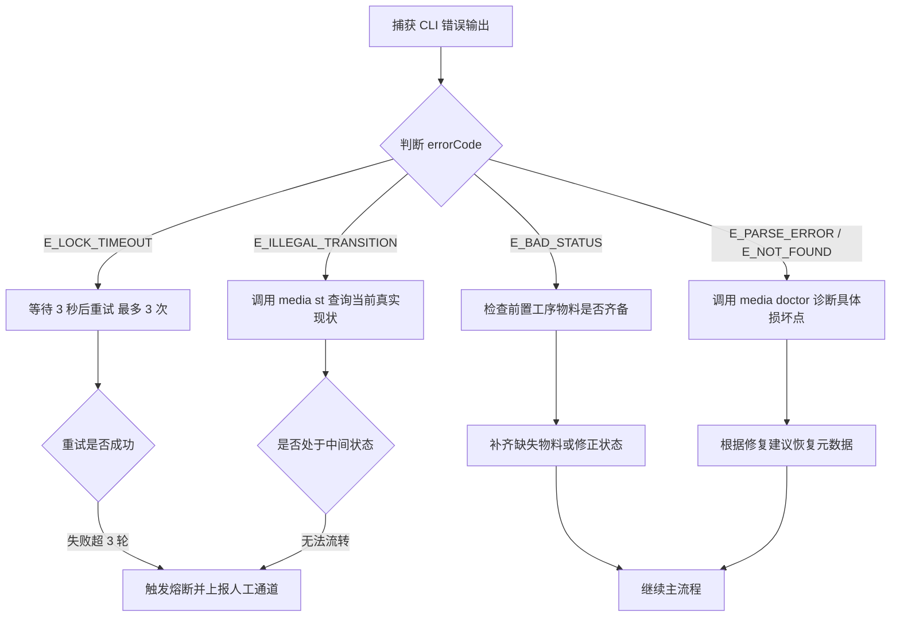

# 第 11 课：状态真相源与 media CLI：如何构建零上下文漂移的资产管理核心？

自动化流水线运行到第三天，终端显示某期视频已经发布，但磁盘里的元数据文件依然停留在待审核状态。打开看板表格，发现有人手动修改了文字，底层的脚本却因为读取不到文件变更而重复录屏。发布脚本执行成功了，线上链接没有写回选题池，下一轮选题调度又把同一个话题推上了日程。

多任务或多个脚本协作时，这类数据不一致十分常见。问题根源在于多处直接读写文件、缺乏唯一状态机定义，把派生视图当成了真相源。



解决状态漂移的核心方法是建立单一真实源架构，将领域状态机固化为纯函数，并通过全系统唯一的命令行工具收敛所有写操作。

## 1. 为什么多处写文件是分布式系统的噩梦？

在基于本地文件系统的自动化流水线中，每个任务组件都在消费和生产数据。如果没有严格的写权限控制，任何组件都可以随意修改文件内容，系统很快就会陷入状态混乱。

### 1.1 自媒体生产中的典型状态漂移

自媒体内容生产包含选题、脚本、录屏、配音、审核、发布与复盘等环节。在这个长流程中，常见的三种状态漂移如下：

第一种是派生视图与元数据脱节。运维人员或定时任务直接在 `dashboard.md` 中把某条内容标记为已完成，但对应内容目录下的 `meta.yaml` 没有同步更新。下游的录屏组件只读取 `meta.yaml`，发现状态仍然是制作中，于是重新启动浏览器执行录屏，浪费算力并覆盖已有产物。

第二种是跨文件更新缺失导致脏数据。发布脚本在平台上传成功后，把当前目录的 `meta.yaml` 状态修改为已发布，但忘记修改总选题池 `content/_backlog/backlog.yaml` 中对应条目的状态，也没有回填线上作品链接。下一次运行选题推荐算法时，系统从选题池读取到该条目仍然是候选状态，再次将其分配给创作者，造成选题重复制作。

第三种是并发无锁写入导致文件损坏。前端可视化看板与后台自动化任务同时操作同一个 YAML 文件。前端写入了修改后的标题，后台脚本写入了生成的视频路径。后完成写入的进程直接覆盖了先完成写入的进程，导致部分字段丢失或文件格式错乱。



如果在多进程并发写入时遇到 `EBUSY: resource busy or locked` 或 YAML 文件末尾被截断的报错，说明多个进程正在无保护地争抢同一个文件描述符。排查时先检查是否有多个脚本在脱离 CLI 的情况下直接调用文件写入接口，将所有写操作收敛到统一的加锁事务中可以彻底消除该现象。

### 1.2 单一真实源（SSOT）架构定义

消除数据漂移的根本原则是确立单一真实源（Single Source of Truth，SSOT）。在文件系统架构中，必须明确区分真相源与派生视图。

真相源是系统中持久化数据的唯一权威出处。在当前自媒体流水线中，真相源包含两类文件：

1. 细粒度内容元数据：每个内容目录下的 `meta.yaml`。它记录了该条内容专属的状态、标题、分发渠道、时间戳以及发布链接。
2. 粗粒度选题总账：`content/_backlog/backlog.yaml`。它记录了所有候选选题、已选选题、评分、赛道归属以及全局流转指针。

派生视图是根据真相源计算并渲染出的只读快照。`dashboard.md`、生成的 HTML 静态报告以及 Web 可视化看板都属于派生视图。



派生视图具有三个严格属性：
- 只读性：任何系统组件和人工操作都不能通过直接编辑派生视图来修改状态。
- 可丢弃性：如果 `dashboard.md` 发生格式损坏或被误删，系统可以随时读取 `meta.yaml` 和 `backlog.yaml` 重新生成完整的看板文件。
- 滞后容忍性：派生视图反映的是上一次事务提交时的快照，只要真相源保持一致，系统状态就是确定的。

如果在团队协作中发现有人习惯手动编辑 `dashboard.md` 中的表格行，可以在 Git 提交钩子或流水线前置检查中加入只读断言。一旦检测到派生视图被手工修改而底层 YAML 没有对应变更，直接拒绝提交并提示使用 `media` 命令进行操作。

## 2. 领域状态机建模：state.ts

在确定了数据存放位置之后，接下来的核心问题是：状态如何在这些文件中合法地改变。如果允许任意字段写入任意字符串，系统仍然会崩溃。必须在代码层建立严格的状态机模型。

### 2.1 自媒体全生命周期状态枚举

在自媒体生产中，内容生命周期与选题池生命周期的粒度不同。将两者解耦为两层状态，能够避免概念混淆。

内容元数据 `meta.yaml` 关注单个作品的具体生产工序，属于细粒度状态机。其状态枚举如下：
- `ideated`：已完成选题初始化，建立了专属内容目录。
- `drafting`：正在进行文案起草、网页制作、音频生成或录屏。
- `review`：物料已全部生成完毕，提交给人审通道等待审核。
- `approved`：人工审核通过，等待发布排期或准备发布。
- `scheduled`：已在平台配置定时发布，等待到达发布时间。
- `published`：已在平台正式公开发布。
- `rejected`：人工审核打回，需要重新修改文案或物料。
- `retro_done`：发布后已完成数据追踪与复盘分析，进入终态。

选题总账 `backlog.yaml` 关注选题在候选池中的流转，属于粗粒度状态机。其状态枚举如下：
- `idea`：候选选题，等待被选取。
- `picked`：已被选中并分配目录，正在生产中。
- `published`：对应内容已经发布上线。
- `expired`：因时效性过期或打分过低被清扫出池。
- `archived`：因主题重复或人工决策被归档。

两层状态机的映射关系如下表所示：

| 阶段 | backlog.yaml 状态 | meta.yaml 状态 | 说明 |
|---|---|---|---|
| 选题入池 | idea | （尚未创建目录） | 选题处于候选池中 |
| 取题开工 | picked | ideated / drafting | 初始化目录并开始制作 |
| 审核与排期 | picked | review / approved / scheduled | 制作完成等待发布 |
| 正式发布 | published | published | 双账本同步标记完成 |
| 数据复盘 | published | retro_done | 完成数据归因分析 |
| 淘汰清扫 | expired / archived | （无） | 选题未投产直接退出 |

如果遇到脚本报错 `E_BAD_ARG: 未知状态: Draft`，通常是因为大小写不匹配或使用了自定义词汇。整个系统中的状态字符串必须严格小写，并完全受控于枚举类型定义。

### 2.2 合法状态转移矩阵与非法越级拦截

状态不能任意跳转。例如，严禁直接从 `ideated` 跳转到 `published`，跳过制作与审核阶段必然导致空物料发布；严禁从 `published` 随意跳转回 `drafting`，已上线的内容不能静默回到制作中。

在 `tools/console/packages/core/src/state.ts` 中，合法的状态转移被定义为静态转移矩阵：

```typescript
export interface TransitionSpec {
  requiresReason: boolean
  line: 'production' | 'harness'
  viaCommand: 'flip' | 'promote' | 'publish-done' | 'sweep' | 'apply' | 'add'
}

export const META_TRANSITIONS: Record<MetaStatus, Partial<Record<MetaStatus, TransitionSpec>>> = {
  ideated: {
    drafting: { requiresReason: false, line: 'production', viaCommand: 'flip' },
  },
  drafting: {
    review: { requiresReason: false, line: 'production', viaCommand: 'flip' },
  },
  review: {
    drafting: { requiresReason: false, line: 'production', viaCommand: 'flip' },
    approved: { requiresReason: false, line: 'production', viaCommand: 'flip' },
    rejected: { requiresReason: true, line: 'production', viaCommand: 'flip' },
  },
  approved: {
    drafting: { requiresReason: false, line: 'production', viaCommand: 'flip' },
    scheduled: { requiresReason: false, line: 'production', viaCommand: 'publish-done' },
    published: { requiresReason: false, line: 'production', viaCommand: 'publish-done' },
  },
  scheduled: {
    published: { requiresReason: false, line: 'production', viaCommand: 'publish-done' },
  },
  published: {
    retro_done: { requiresReason: false, line: 'harness', viaCommand: 'flip' },
  },
  rejected: {
    drafting: { requiresReason: false, line: 'production', viaCommand: 'flip' },
  },
  retro_done: {},
}
```

为了确保状态校验逻辑可以在任何环境（CLI、Web 后端、单元测试）中无副作用地运行，状态断言函数被设计为纯函数：

```typescript
export function assertMetaTransition(from: MetaStatus, to: MetaStatus): TransitionSpec {
  const spec = META_TRANSITIONS[from]?.[to]
  if (!spec) {
    const legal = Object.keys(META_TRANSITIONS[from] ?? {})
    const legalStr = legal.length > 0 ? legal.join(', ') : '无（终态）'
    throw new MediaError(
      'E_ILLEGAL_TRANSITION',
      `${from} 到 ${to} 转移非法：${from} 当前合法出边为 ${legalStr}`,
      { rule: 'state:meta' },
    )
  }
  return spec
}
```

纯函数设计不依赖任何外部文件 I/O、全局变量或系统时钟。函数的输入是当前状态与目标状态，输出是转移规范或者抛出 `MediaError` 异常。这种设计保证了状态流转规则具备 100% 的可测试性。

如果在执行退回操作时遇到 `E_ILLEGAL_TRANSITION: approved 到 drafting 转移非法` 的报错，先查看状态转移表是否允许该出边。在业务演进中，审批后反悔重新改稿属于合理场景，只需要在状态表中为 `approved` 补齐指向 `drafting` 的出边配置即可平滑支持。

## 3. 全系统唯一写手：打造 media CLI

定义好状态机后，必须有一个唯一的执行者来落实这些规则。如果各个脚本和自动化流程分别去解析和序列化 YAML，很快就会因为格式差异破坏注释或缩进。全系统只能存在一个写手包，即 `media` CLI。

### 3.1 media 命令族全景设计

`media` CLI 为整个流水线提供了一组语义清晰的操作命令：

1. `media st`：只读状态汇总。扫描全仓所有的 `meta.yaml` 和 `backlog.yaml`，按制作中、待审核、已排期和异常告警分类输出表格，支持 `--json` 输出结构化数据。
2. `media next`：只读计算下一条应执行的选题。按照 `next_up` 指针、分数高低、深度赛道优先以及入池时间的规则进行决策。
3. `media promote <id> --slug <slug>`：原子取题。将 `backlog.yaml` 中指定 ID 的状态从 `idea` 翻转为 `picked`，并在 `content/<date>/<slug>/` 下基于模板初始化目录和 `meta.yaml`。
4. `media flip <slug> <target_status>`：执行单文件状态翻转。调用 `assertMetaTransition` 校验合法性，在 `meta.yaml` 中更新状态并追加当前时间戳。
5. `media publish-done <slug> --url <url>`：发布收尾原子记账。
6. `media doctor`：产物格式与健康状态巡检。



所有的写入命令都基于 `@console/core/writer` 引擎执行。写入过程遵循固定事务序列：
第一步，获取全局文件锁，防止并发写入冲突。
第二步，构建当前系统的数据快照（Snapshot）。
第三步，在内存中计算本次操作涉及的全部修改计划（PlannedWrite）。如果校验失败，在此阶段直接抛出异常，不产生任何磁盘写入。
第四步，如果带有 `--dry-run` 参数，打印将要修改的文件 diff 并安全退出。
第五步，对涉及的文件执行临时文件写入与重命名（temp-then-rename），保证文件系统层面的原子落盘。
第六步，在同一把锁内重新生成 `dashboard.md` 的机器标记区。
第七步，向 `tools/console/logs/audit.jsonl` 追加审计日志，记录执行者、命令参数、修改字段与时间。
第八步，释放文件锁。

如果在执行命令时遇到 `E_LOCK_TIMEOUT: 获取文件锁超时` 错误，说明有另一个前置任务正在执行耗时的写操作或者前置任务异常崩溃未能释放锁。可以检查 `.runtime/media.lock` 文件的创建时间，确认没有残留的死锁进程。

### 3.2 发布收尾原子性：三翻齐事务

在自动化发布完成时，系统需要同时变更三个位置的数据。如果拆成三条独立命令执行，一旦中途断电或网络中断，系统就会处于不一致的半提交状态。

`media publish-done` 将这三个动作封装为一个不可分割的原子事务：
1. 更新内容元数据：将 `meta.yaml` 的状态从 `approved` 或 `scheduled` 翻转为 `published`，记录发布时间戳，并回填线上作品 URL。
2. 同步选题总账：在 `backlog.yaml` 中找到与该内容绑定的选题条目，将其状态从 `picked` 翻转为 `published`。
3. 更新派生看板：自动从 `dashboard.md` 的在制表格中移除该条目，并刷新完成统计。



核心事务代码实现如下：

```typescript
export function registerPublishDone(program: Command): void {
  const cmd = program.command('publish-done <slug>').description('发布收尾：三翻齐原子事务')
  addWriteOptions(cmd)
  cmd
    .option('--scheduled <datetime>', '定时发布时间：YYYY-MM-DD HH:mm')
    .option('--url <url>', '作品线上链接')
  cmd.action((slug: string, opts: PublishDoneOptions) => {
    runTransaction(
      { root, cmd: 'publish-done', argv: process.argv.slice(2), actor: getActor(), dryRun: !!opts.dryRun },
      (snap: Snapshot) => {
        const entry = snap.contents.find((c) => c.slug === slug)
        if (!entry || !entry.meta) throw new MediaError('E_NOT_FOUND', `内容不存在：${slug}`)
        
        if (!['approved', 'scheduled', 'published'].includes(entry.meta.status)) {
          throw new MediaError('E_BAD_STATUS', `${slug} 当前状态 ${entry.meta.status}，无法执行发布收尾`)
        }

        const writes: PlannedWrite[] = []
        // 1. 计划 meta.yaml 状态翻转与链接回填
        writes.push(planMetaPublish(entry, opts))
        // 2. 计划 backlog.yaml 状态翻转
        if (entry.meta.source) {
          writes.push(planBacklogPublish(snap.backlog, entry.meta.source))
        }
        return writes
      }
    )
  })
}
```

如果在调用 `media publish-done` 时遇到 `E_BAD_STATUS: 当前状态 review，无法执行发布收尾` 错误，说明该内容尚未经过人工审批（未达到 `approved` 状态）。发布组件必须等待人工审核指令，不能擅自越级发布。

### 3.3 media doctor：系统健康自检与异常漂移修复

流水线长时间运行后，难免有异常文件产生。例如手动误删了脚本文件、图片路径写错或者元数据时间戳缺失。

`media doctor` 是专门用于产物格式与健康状态巡检的工具。在架构上，它遵循输入与计算分离的原则：
- `gatherDoctorInput()`：唯一的 I/O 入口，负责读取磁盘中的 `1-brief.md`、`2-script.md`、`4-publish.md` 和 `meta.yaml` 原文。
- `computeDoctorAlerts()`：纯计算函数，不产生任何 I/O 操作。接收输入对象并根据规则矩阵输出结构化的告警列表（Alerts）。



Doctor 检查的核心规则包括：
1. 时间戳完备性（DOC-01）：检查 `meta.yaml` 中达到的当前状态是否已完整记录了对应阶段的时间戳。
2. 脚本格式规范（DOC-02）：检查 `2-script.md` 是否存在且包含规范的一级标题。
3. 发布物料契约（DOC-03）：检查 `4-publish.md` 中填写的视频路径和封面路径在磁盘中是否真实存在，且路径中不包含占位符。
4. 孤儿条目与悬挂指针检测（DOC-04）：检查 `meta.yaml` 中的 `source` 字段是否能在 `backlog.yaml` 中找到对应记录。

如果在运行 `media doctor` 时出现 `DOC-03: 媒体文件不存在 assets/final.mp4`，说明录屏或渲染脚本虽然执行结束，但产物并没有成功保存到约定目录，此时需要重新触发渲染阶段。

## 4. 零代码实现：引导 AI 构建 CLI 工具包与提示词工程

在 Agentic 自动化体系中，不仅人类需要遵守规范，大语言模型编写的代码和执行的指令更需要严格受控。本节展示如何通过结构化提示词引导 AI 正确使用 CLI、维护单一真实源并实现错误自愈。

### 4.1 编写提示词驱动 AI 使用 media CLI

当 AI Agent 承担内容生产调度任务时，不能让模型直接用脚本去写文件。必须通过提示词明确告知其可用命令、输入输出规范与前置断言要求。

以下是驱动 AI 使用 `media` CLI 的标准系统提示词模板：

```markdown
你是一个自动化流水线执行 Agent。你的核心职责是按照生产规范推进内容流转。

【执行铁律】
1. 禁止直接调用文件读写接口修改 meta.yaml、backlog.yaml 或 dashboard.md。
2. 所有的状态查询必须先调用 `media st --json` 或 `media next --json`。
3. 所有的状态变更必须通过 `media flip`、`media promote` 或 `media publish-done` 执行。
4. 在执行状态变更前，必须前置断言当前状态是否满足转移前提。

【常用命令规范】
- 查询全局状态：`media st --json`
- 选取下一个候选选题：`media next --json`
- 取题并初始化工作区：`media promote <backlog_id> --slug <slug>`
- 翻转制作状态：`media flip <slug> <target_status>`（如果打回需附带 `--reason <原因>`）
- 完成发布收尾：`media publish-done <slug> --url <线上作品链接>`
- 产物契约体检：`media doctor --slug <slug> --json`

【执行步骤】
第 1 步：执行 `media st --json` 获取当前内容的真实状态。
第 2 步：比对当前状态与目标状态是否符合状态机出边规则。
第 3 步：调用对应 CLI 命令执行原子变更。
第 4 步：检查 CLI 返回的标准 JSON 包裹体，确认 ok 为 true。
```

当 AI 接收到推进任务的指令时，其生成的工具调用过程如下：

```json
{
  "thought": "准备将 2026-08-29-ep16 的状态从 drafting 推进到 review。首先调用 media flip 命令执行状态机翻转。",
  "tool_name": "execute_bash",
  "parameters": {
    "command": "media flip 2026-08-29-ep16 review --json"
  }
}
```

CLI 执行后返回标准化信封结构：

```json
{
  "ok": true,
  "cmd": "flip",
  "actor": "agent-runner",
  "writes": [
    {
      "path": "content/2026-08-29/ep16/meta.yaml",
      "fields": ["status", "timestamps.review"]
    }
  ],
  "alerts": []
}
```

模型解析到 `ok: true` 后即可确认写入已经原子落盘，且派生看板已同步更新。

如果在执行状态翻转前没有执行 `media st` 查询，导致模型在错误的前提下发出调用（例如在 `review` 状态下尝试执行 `media promote`），CLI 会返回错误并在 stderr 中输出合法出边。在提示词中强制要求执行前必须先读状态，可以避免这类盲目调用。

### 4.2 编写提示词强化单一真实源认知

大语言模型在多轮对话中容易产生上下文幻觉，在 Prompt 里自行脑补私有状态，误以为上一轮对话中讨论的内容已经生效。

为了消除这种幻觉，需要编写专门的约束提示词，禁止模型在内存中维护任务状态：

```markdown
【单一真实源与无状态约束】
你是一个无状态的执行节点。你在当前会话中不持有任何持久化状态。

【状态认知准则】
1. 禁止根据历史对话内容推断任务是否完成。
2. 一切任务进展以磁盘真相源为唯一依据。
3. 唯一的真相源为：
   - 细粒度元数据：`content/<date>/<slug>/meta.yaml`
   - 选题总账：`content/_backlog/backlog.yaml`
4. 严禁把 `dashboard.md` 中的文字作为前置判断依据，看板仅为展示层派生视图。
5. 每次开始执行新步骤前，必须通过 `media st --slug <slug> --json` 重新校验磁盘真实状态。
6. 如果对话历史中的上下文描述与 `media st` 返回的状态不一致，必须无条件以 `media st` 的结果为准，并纠正对话认知。
```

通过这一层提示词约束，即使上层会话因为网络重试重复发送了指令，Agent 重新读取磁盘真相源后，也会发现当前状态已经流转完毕，从而避免重复执行产生副作用。

### 4.3 并发冲突与异常状态下的自愈提示词设计

自动化流程在运行过程中可能会遇到文件锁冲突、非法状态越级或者 YAML 格式损坏。如果模型在遇到错误时直接抛出异常退出，整条流水线就会停摆。通过设计自愈提示词，可以引导 AI 在受控范围内进行自我诊断与状态修复。

以下是异常自愈与错误恢复的提示词设计：

```markdown
【CLI 异常捕获与自愈指引】
当你调用的 `media` CLI 命令返回错误（即 `ok: false` 或退出码非 0）时，严禁直接放弃任务，按以下决策树执行自愈流程：



【自愈规则分流】
1. 错误码为 `E_LOCK_TIMEOUT`：
   - 原因：其他并发进程正在写入。
   - 自愈动作：休眠 3 秒后重新发起同一命令，最多重试 3 次。
2. 错误码为 `E_ILLEGAL_TRANSITION`：
   - 原因：模型记忆的状态与磁盘真相源不一致。
   - 自愈动作：立即调用 `media st --slug <slug> --json` 重新获取最新状态。如果当前已经在目标状态之后，直接跳过当前步骤；如果是前置步骤遗漏，按合法迁移路径补齐前置操作。
3. 错误码为 `E_BAD_STATUS`：
   - 原因：前置审核或物料未就绪。
   - 自愈动作：调用 `media doctor --slug <slug> --json` 检查缺失字段，并在日志中明确标出阻塞原因。
4. 连续重试达到 3 轮仍然失败：
   - 触发安全熔断，停止自我修复，输出结构化告警日志并等待人工介入。
```

通过将结构化错误码与明确的修复动作一一对应，系统在遇到轻微抖动和临时状态偏差时能够自动恢复，在遇到严重结构损坏时能够及时熔断，兼顾了自动化效率与运行安全性。

## 5. 验收标准与课后实战

学完本课后，可以通过以下标准检验你的状态管理系统是否达到零上下文漂移的架构要求。

### 5.1 验收标准

1. 唯一写路径收敛验证：在整个工程代码中搜索文件写入方法，除 `@console/core/writer` 内部外，不存在任何直接调用 `fs.writeFileSync` 修改 `meta.yaml`、`backlog.yaml` 或 `dashboard.md` 的代码。
2. 状态机非法语义拦截：在终端执行非法状态翻转测试：
   ```bash
   media flip 2026-08-29-test published
   ```
   系统必须明确拦截并返回 `E_ILLEGAL_TRANSITION` 错误信息，指出当前状态不允许直接跳转到 `published`。
3. 事务原子性验证：执行一次完整的发布收尾操作：
   ```bash
   media publish-done 2026-08-29-test --url https://v.douyin.com/example/
   ```
   检查 `meta.yaml` 中的 `status` 和 `publish_url`、`backlog.yaml` 中的对应选题状态以及 `dashboard.md` 看板表格，三者在同一时间戳完成联动更新，无字段缺失。
4. 产物健康自检验证：执行 `media doctor`，命令能够完整扫描全仓内容目录，准确指出缺失的标题或资源路径。

### 5.2 课后实战作业

1. 本地状态机扩展：在 `tools/console/packages/core/src/state.ts` 中，为 `META_TRANSITIONS` 增加一个归档分支 `archived`，允许处于 `rejected` 或 `retro_done` 状态的内容转移到 `archived` 状态。
2. 编写单元测试：在 `state.test.ts` 中编写两组测试用例，分别断言 `rejected -> archived` 的合法转移，以及从 `drafting -> archived` 的越级拦截。
3. 提示词演练：在本地的大模型调试环境中，注入本课第 4 节的无状态约束提示词，模拟一次并发冲突场景，观察 AI 是否能够正确捕获 `E_LOCK_TIMEOUT` 并执行退避重试。
