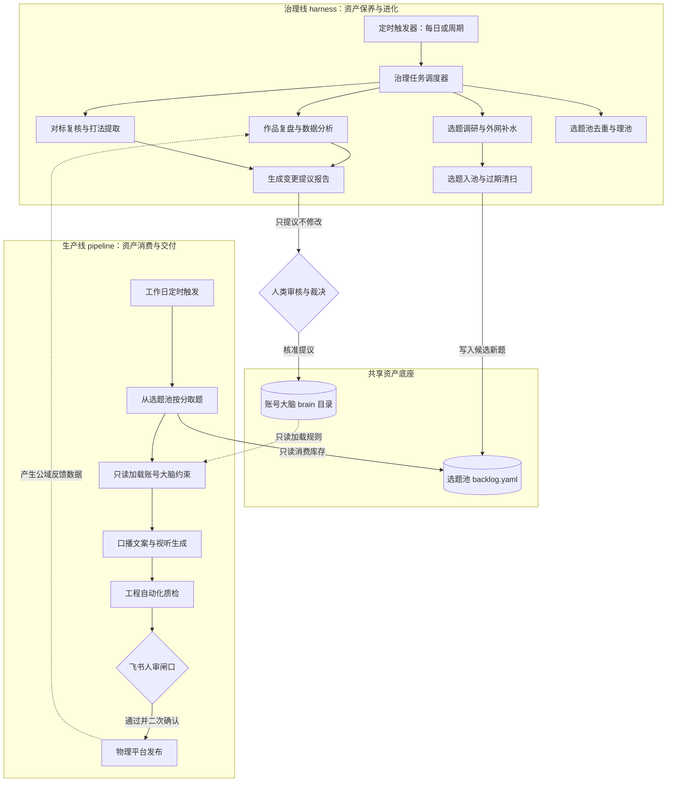
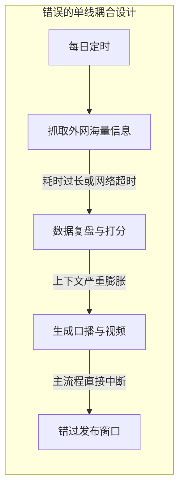
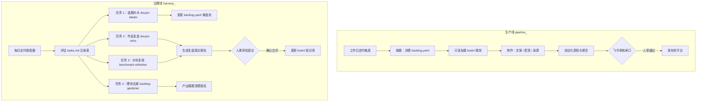
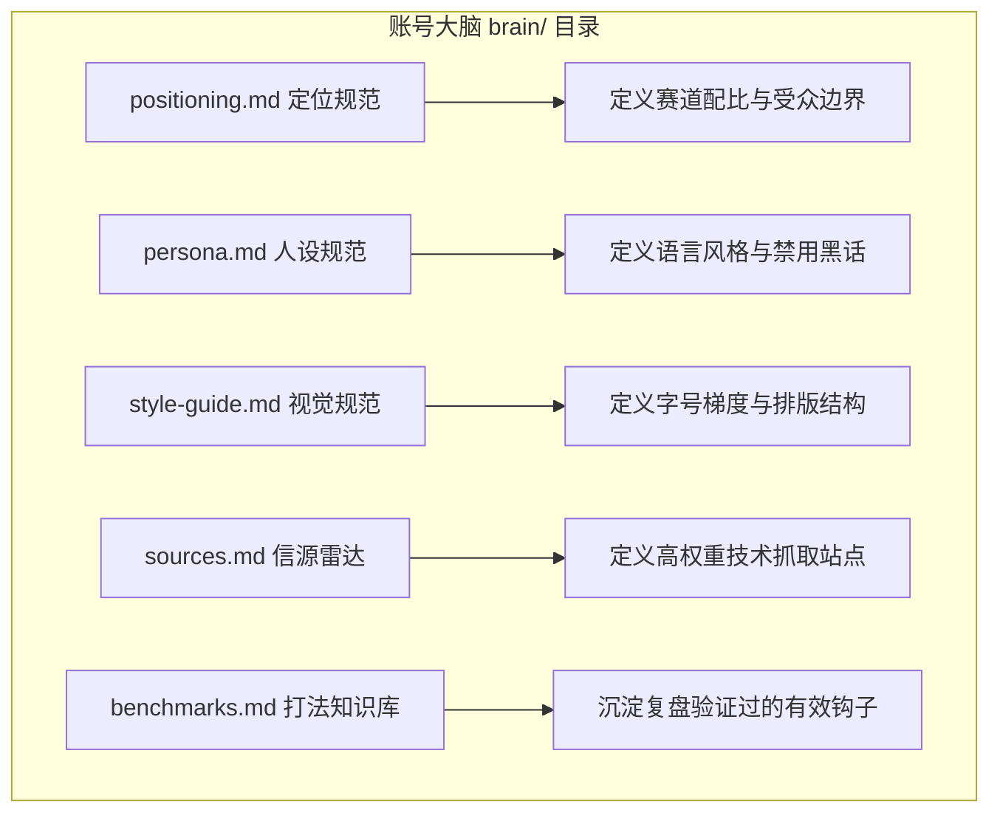

# 第 12 课：双线闭环与账号大脑：生产线与治理线的架构分工与资产沉淀

一套自动化脚本在部署初期通常表现良好。系统每天定时抓取主题、起草文案、生成音频并组装视频。然而在连续运行两三周后，系统往往会出现异常。选题库里的存量逐渐耗尽，每日抓取的外部热点早已过时。新生成的视频在平台上跳出率持续上升，播放量从最初的数千次跌落到两百次的基础推荐池。

很多工程团队在遇到这一现象时，第一反应是修改提示词或者更换底层大模型。但问题的根源并不在单次生成的模型能力，而在系统层面的资产维护缺失。

自动化流水线如果只有生产逻辑，本质上就是一个纯粹的资产消耗系统。系统每天在消耗初始设定的选题库存与经验规则，却没有任何机制负责补充新素材、复核旧经验与校准平台反馈。没有维护机制的自动化流水线，其内部无序度必然随着时间推移而持续上升，最终导致整个系统停摆。

解决这一工程困境的架构方案，是将单向的生产系统重构为生产线与治理线双线协同的自适应系统，并通过标准化的账号大脑沉淀业务规则与演进资产。



## 1. 自动化系统的无序退化与停摆原因

在软件系统长时间无人维护时，依赖外部接口与静态配置的模块会逐渐失效。内容生产系统对外部环境的依赖程度远高于传统工具软件，因而退化的速度也更快。

### 1.1 生产线断粮停产实录

生产系统最直接的故障是原料耗尽。

在一次实际运行记录中，流水线在初始阶段录入了 9 条经过人工精选的技术选题。生产线每天定时从选题库中提取一条评分最高的选题并生成视频。前 9 天系统运转正常，但在第 10 天，选题库中的未处理条目清零。

与此同时，外部技术热点的有效生命周期通常在 48 小时到 7 天之间。由于系统在初始部署后的 24 天内未配置定期的外部情报调研任务，不仅没有新增有效选题，此前存留的部分备选热点也已完全失效。生产线在后续的连续 6 天调度中，取题模块每次均返回空数据，导致构建流程在第一步直接退出，整个自动化流水线陷入实质性停工。

这种故障揭示了一个明确的工程事实：生产系统本身不具备原料生产能力。如果把生产与原料补给绑定在同一个触发时序中，只要生产逻辑出现分支异常，原料补充就会同步中断。

针对取题逻辑的异常拦截，需要在调度入口增加显式断言。

```python
# pipeline/fetch_task.py
import sys
import yaml
from pathlib import Path

def fetch_next_task(backlog_path: Path) -> dict:
    if not backlog_path.exists():
        raise FileNotFoundError(f"Backlog file not found: {backlog_path}")
    
    with open(backlog_path, "r", encoding="utf-8") as f:
        data = yaml.safe_load(f) or {}
    
    items = data.get("items", [])
    valid_candidates = [
        item for item in items 
        if item.get("status") == "idea" and not item.get("expired", False)
    ]
    
    if len(valid_candidates) == 0:
        # 拦截点：明确抛出库存耗尽异常，禁止静默退出或生成虚假内容
        print(f"[FATAL] 选题池有效库存为 0，生产线触发熔断。已通知治理线补水。", file=sys.stderr)
        sys.exit(101)
        
    # 按综合得分排序提取
    valid_candidates.sort(key=lambda x: x.get("score", 0), reverse=True)
    return valid_candidates[0]
```

如果取题脚本在库存为空时仅返回空字典而没有退出码中断，后续的文案起草 Agent 就会在缺少输入的情况下自由发挥，甚至凭空捏造虚假的技术发布会新闻。

### 1.2 外部环境演化带来的打法老化

内容消费平台的算法偏好与受众审美处于动态变化中。在 AI 技术领域，每周都有新的基础模型、开源框架与工具链发布。

三个月前有效的爆款钩子格式，在大量同质化账号模仿之后，观众在两秒内的跳出率会明显攀升。例如，以通用疑问句开头的文案模板在初期能够获得 45% 的五秒完播率，但在平台充斥同类句式后，该指标迅速跌落至 22%。

如果在系统中将生成规则硬编码为静态字符串，AI 模型就会持续产出符合旧标准却被当前平台算法判定为低质的内容。

在真实运营数据中，基准播放量在未做打法迭代的周期内，单条平均播放从 6915 次下滑到 2100 次，两秒跳出率从 0.38 上升至 0.52。系统虽然每天依然按时产出视频，但这些产出已经失去了传播价值。

```text
静态规则老化导致的生成偏差示例：
旧规则：开头一律使用“你一定不知道这个重磅 AI 工具发布了”。
实际反馈：受众对此类句式产生抗性，两秒跳出率达到 58%。
演进规则：开头直接展示终端报错或代码断言，用真实技术冲突切入。
```

将规则写死在代码文件深处会导致修改成本极高。必须将规则抽离为独立可维护的文本资产，并建立定期复核机制。

### 1.3 为什么单线模型无法自愈？

许多开发者尝试在单条生产流水线中增加调研和复盘逻辑。例如，让生产 Agent 在每天清晨先分析昨日数据、再抓取外网信息，最后制作当天的视频。

这种单线模型在实际运行中几乎必然崩溃，其核心原因在于资源挤兑与优先级错位。

1. 交付时限挤兑：日常生产任务具有刚性的时间节点，必须在规定时段前完成出片以便人工审核。当生产任务面临延迟风险时，没有硬性交付时间要求的复盘和调研任务总是最先被跳过或压缩。
2. 上下文污染：单个 Agent 串行处理复盘数据、海量推文与长篇口播文案时，上下文长度会迅速膨胀。这会导致模型在写作文案时遗忘核心人设约束，生成出充斥分析术语的生硬文案。
3. 容错脆弱性：外网抓取与数据统计涉及多个第三方网络请求，其网络超时和解析失败概率较高。如果在生产主流程中同步调用这些接口，外部波动就会直接击穿主生产线，导致当天的内容生产彻底中断。



生产任务与维护任务在执行频率、容错要求与资源消耗模式上存在根本差异。必须从物理架构上将二者彻底拆开。

## 2. 双线闭环模型设计：生产线与治理线的分工

双线架构将系统明确切分为两条职责独立的执行回路：负责消耗资产并完成交付的生产线，以及负责维护资产并驱动系统演进的治理线。



### 2.1 生产线（pipeline/）：专注资产消费

生产线的核心目标是确定性与交付速度。它就像工厂里的装配车间，接收合格的原料，按照既定的工艺标准，加工出符合质量预期的产品。

生产线的关键设计原则包括：
1. 单向只读依赖：生产线在执行过程中只读取外部资产，严禁在生产过程中修改账号大脑中的规则或重写对标库。
2. 严格的阶段契约：从选题提取（`1-ideate.md`）、内容创作（`2-create.md`）、机器出审（`3-review.md`）到物理发布（`4-publish.md`），每个环节都有明确的输入输出物料定义。
3. 停在人审闸口：全自动执行在机器质检通过后立即终止，向创作者推送审核卡片。未经人工点击授权，绝不执行物理发布。

生产线追求的是稳定产出。它的运行逻辑应该尽可能简单、线性且具备高容错能力。

### 2.2 治理线（harness/）：专注资产保养

治理线的核心目标是资产保鲜与规则迭代。它就像工厂里的设备维护与工艺改良部门，不直接参与当日产品的装配，而是负责检修设备、化验原料、分析废品并优化工艺参数。

治理线的关键设计原则包括：
1. 独立调度周期：治理线每天定时运行（包含周末与节假日），甚至针对不同任务配置不同的触发周期。
2. 容忍延迟与失败：治理任务如果因为网络波动导致抓取失败，可以记录日志并在下一个周期重试，不会对生产线的当日交付产生阻断性影响。
3. 统一任务注册表：所有的治理任务均在 `harness/tasks.md` 中进行声明式配置，调度器读取注册表并根据触发条件分配执行。

```yaml
# harness/tasks.md 中的任务注册声明片段
tasks:
  - task: retro
    skill: douyin-retro
    enabled: true
    trigger: post-publish-window
    windows: [24h, 72h, 7d]

  - task: benchmark-refresher
    skill: benchmark-refresher
    enabled: true
    trigger: periodic:30d

  - task: ideate
    skill: douyin-ideate
    enabled: true
    trigger: periodic:2d

  - task: backlog-gardener
    skill: backlog-gardener
    enabled: true
    trigger: periodic:7d
```

### 2.3 共享资产底座的读写隔离矩阵

生产线与治理线并非完全割裂，它们通过一套共享的资产底座实现解耦与协同。资产底座主要由选题池文件 `content/_backlog/backlog.yaml` 与账号大脑目录 `brain/` 构成。

为了防止多智能体并发修改导致状态错乱，必须制定严格的读写权限矩阵。

| 资产路径 | 资产性质 | 生产线权限 | 治理线权限 | 人工审核权限 |
|---|---|---|---|---|
| `content/_backlog/backlog.yaml` | 生产原料库存 | 读状态，仅修改当前消费题状态（idea 变 drafting） | 追加新候选题目，标记过期条目 | 最终拍板选题优先级与删除 |
| `brain/positioning.md` | 账号战略定位 | 严格只读 | 仅产出调整提议报告，严禁修改 | 审批并执行回写 |
| `brain/persona.md` | 语言风格与人设 | 严格只读 | 仅产出增补提议报告，严禁修改 | 审批并执行回写 |
| `brain/style-guide.md` | 视听工程规范 | 严格只读 | 仅产出优化提议报告，严禁修改 | 审批并执行回写 |
| `brain/sources.md` | 技术情报信源表 | 严格只读 | 周期探测信源活性，产出增删提议 | 审批并执行回写 |
| `brain/benchmarks.md` | 对标账号与打法库 | 严格只读 | 结合复盘数据归纳打法，产出提议 | 审批并执行回写 |

在此权限设计下，生产线永远不用担心自身行为会意外破坏系统底层的提示词与配置规则；治理线的所有分析产出也都被隔离在提议层，确保了系统运行状态的可控性。

## 3. 构建账号大脑：brain 目录五大件规范

账号大脑（`brain/`）是整个内容系统的大脑皮层。它将人类创作者的主观审美、定位策略与平台经验转化为大模型可严格解析的结构化 Markdown 契约。



### 3.1 positioning.md（定位）：赛道配比与价值主张

定位文件决定了账号的内容边界与受众筛选逻辑。

在 AI 领域，单纯做源码讲解受众较窄，而单纯追逐热点新闻又缺乏技术护城河。定位文件通过明确的内容配比，平衡技术深度与流量破圈。

```markdown
# 账号定位规范

## 一句话定位
AI 方向的工程提效实战与源码解读：以技术深度立身，以热点流量破圈。

## 目标人群
1. 一线开发工程师与 AI 应用开发者：关注如何将 AI 真正落地到工程工作流中。
2. 架构与源码深度爱好者：关注核心设计模式与底层实现机制。
3. 泛技术从业者：追踪高价值新模型与新工具的实际能力。

## 内容支柱与结构配比
1. 支柱一：技术深度（占比 60%）
   - 工程提效实战：具备完整可复现步骤的真实开发场景应用。
   - 源码深度拆解：热门开源项目与 Agent 框架的代码架构与机制剖析。
2. 支柱二：前沿流量（占比 40%）
   - 新模型与新工具首发技术评测：聚焦技术指标实测，不做无增量的资讯复述。

## 负面清单（严禁触碰）
1. 不做无技术代码与实操步骤的纯概念炒作。
2. 不使用标题党夸大模型能力。
3. 不发布未经技术社区核实的技术传闻。
```

### 3.2 persona.md（人设）：语言质感与禁忌词库

人设文件约束了文本生成 Agent 的语气、语调与用词习惯。

口播视频要求文案具备高度的口语感与真实感，严禁生成像学术论文或公关宣传稿一样的夹生书面语。

```markdown
# 人设与表达规范

## 语言基本原则
1. 第一人称工程师视角：像在白板前与同事讨论一个技术问题，平实直接。
2. 严禁书面化长句：单句长度不超过 25 个字，避免嵌套定语从句。
3. 严禁空泛黑话：禁止出现“赋能”、“抓手”、“底层逻辑闭环”等词汇。

## 口语化替换规则
- 禁用书面词：然而、鉴于此、不难发现、显而易见。
- 推荐口语词：但是、所以、我们来看、这里有个坑。

## 绝对红线
1. 严禁出现未经实测的绝对化词汇（如“最强”、“完全秒杀”）。
2. 严禁在文案中植入任何导流至外部私域的口播诱导。
```

### 3.3 style-guide.md（规范）：视听系统与排版标准

视觉规范定义了视频画面的视觉层级。短视频在移动端播放时，屏幕空间极其有限，字号过小或排版混乱会导致观众瞬间流失。

```markdown
# 视觉与排版规范

## 移动端文字字号梯度
- 核心钩子大字：120px - 160px（前 3 秒独占画面中心）
- 模块核心标题：66px - 88px（高对比度背景底色）
- 正文说明文字：40px - 46px（严格限制在 3 行以内）
- 注释与代码路径：24px - 28px（低饱和度灰色展示）

## 画面布局契约
1. 顶部 15% 与底部 20% 区域留白，避开平台的关注栏、文案描述与进度条控件。
2. 右侧 12% 区域留白，避开点赞、评论与分享按钮交互区。
3. 所有图表和代码必须具备高对比度暗色主题，背景色统一采用深灰黑基底。
```

### 3.4 sources.md（信息源）：高质量技术雷达清单

信息源文件规定了治理线进行情报补水时的合法抓取范围与权重优先级。

```markdown
# 技术信息源清单

## 第一梯队：核心技术源（权重 1.0）
- GitHub Trending（限定 Python, TypeScript, Rust 分类）
- Hugging Face Papers 与 Daily Papers 榜单
- Anthropic, OpenAI, Meta AI 官方工程博客与技术发布日志

## 第二梯队：深度讨论区（权重 0.8）
- Hacker News 首页高赞技术讨论帖
- X（Twitter）核心 AI 架构师与研究员关注列表
- Reddit 专门技术板块（r/LocalLLaMA, r/MachineLearning）

## 过滤规则
- 排除纯概念融资通报类新闻。
- 排除缺少开源仓库或测试报告的第三方评测。
```

### 3.5 benchmarks.md（打法库）：对标与有效模式库

对标文件不仅记录外部优秀的同类账号，更重要的是沉淀从自身复盘中提炼出的实测有效打法。

```markdown
# 对标账号与打法库

## 自身实测有效打法库（由复盘提议并经人工核准写入）

| 打法名称 | 适用赛道 | 核心逻辑 | 证据基线 |
|---|---|---|---|
| 矛盾反差式冷开场 | 技术深度类 | 第一句抛出一个常理上不该成立的技术事实，快速吸引注意 | ep06 实测两秒跳出率 0.3105，为全系列最低 |
| 具象行动号召结尾 | 通用赛道 | 结尾明确提示在评论区回复特定关键词获取完整工程配置 | 强行动号召样本互动率达到 4.8%，远高于模糊讨论式结尾 |
| 宽口径横评优先 | 技术深度类 | 跨厂商方案横向对比的受众触达率显著高于单点源码细节 | 架构横评选题七天播放量达到窄众源码题的 3.2 倍 |

## 待验证的观察项（严禁作为硬规则调用）
- 收藏率高但转粉率低的技术长图文，其长尾推荐周期是否显著更长（当前仅 2 个样本，需等待后续复盘补充证据）。
```

### 3.6 HOW 第一步：编写生产线消费账号大脑的提示词

生产线在调用大模型起草文案或生成页面时，必须以只读方式注入账号大脑的核心规则，并通过系统提示词建立安全防线。

以下是生产线在文案起草阶段使用的完整提示词模板。

```text
你是一名专注于 AI 工程实战与源码解读的技术内容编剧。
你的任务是根据输入的选题信息，编写一份高度口语化、逻辑严密的短视频口播文案与分屏画面脚本。

【输入资产约束（只读注入，严格服从）】
=== 账号定位约束（来源 brain/positioning.md） ===
{positioning_content}

=== 人设与语言风格（来源 brain/persona.md） ===
{persona_content}

=== 视觉排版层级（来源 brain/style-guide.md） ===
{style_guide_content}

=== 已验证打法策略（来源 brain/benchmarks.md） ===
{benchmarks_content}

【输入待制作选题】
- 选题标题：{task_title}
- 核心技术论点：{task_summary}
- 原始代码或技术素材：{task_raw_material}

【生成硬性红线】
1. 只读原则：上述 brain/ 规则是你的最高生成约束，你无权修改、重新定义或忽略这些规则。严禁在输出中包含对 brain/ 规则本身的讨论。
2. 杜绝元语言泄露：严禁在口播文案中念出“根据 6:4 定位原则”、“符合人设要求”等元规则词汇。
3. 口语化断言：每句话长度严格控制在 25 字以内，杜绝使用“然而”、“赋能”、“不难发现”等书面黑话。
4. 结构合规：必须采用 benchmarks.md 中验证有效的“矛盾反差冷开场 -> 机制深度剖析 -> 具象行动号召”三段式结构。

【输出格式要求】
输出为标准 JSON 格式，严禁包含 markdown 围栏外的多余说明：
{
  "hook_text": "前 3 秒开场口播文案",
  "hook_visual_text": "开场画面中心呈现的超大字体标题（120px级别）",
  "sections": [
    {
      "section_id": 1,
      "spoken_text": "分段口播文本，完全口语化",
      "visual_layout": "画面排版描述：代码高亮/架构流程图/对比表格",
      "visual_headline": "该屏的核心提炼标题（66px级别）",
      "visual_body": "屏幕辅助小字，不得超过三行"
    }
  ],
  "call_to_action": "结尾具体的行动指令文本"
}
```

```python
# pipeline/create_script.py 中的提示词装配实现
def build_production_prompt(task_data: dict, brain_dir: Path) -> str:
    # 强制只读加载 brain 资产
    positioning = (brain_dir / "positioning.md").read_text(encoding="utf-8")
    persona = (brain_dir / "persona.md").read_text(encoding="utf-8")
    style_guide = (brain_dir / "style-guide.md").read_text(encoding="utf-8")
    benchmarks = (brain_dir / "benchmarks.md").read_text(encoding="utf-8")
    
    template = Path("pipeline/prompts/draft_script.txt").read_text(encoding="utf-8")
    return template.format(
        positioning_content=positioning,
        persona_content=persona,
        style_guide_content=style_guide,
        benchmarks_content=benchmarks,
        task_title=task_data["title"],
        task_summary=task_data["summary"],
        task_raw_material=task_data["raw_material"]
    )
```

在提示词工程中，如果未在 Prompt 中明确声明禁止输出元规则，模型极易在文案第一句输出“今天我们按照 60% 技术深度的要求来聊聊这个项目”。通过输入输出契约的严格隔离，可以有效杜绝此类生成事故。

## 4. 治理线铁律：只产提议，绝不自动改大脑

治理线虽然承担着系统自适应与进化的使命，但它拥有的最高权限只能停留在提议层。

### 4.1 为什么严禁治理脚本直接写回 brain/？

让大模型直接拥有修改底层规则库的写权限，在系统工程上是一种极其危险的设计。

1. 小样本过拟合风险：单条视频的播放表现受到发布时间、平台偶发流量分配、突发社会热点等多种外在噪音影响。如果某条视频因为封面偶然失误导致播放量较低，自动归因脚本可能会推导出“此类技术主题受众完全不感兴趣”的错误结论。如果直接写回 `positioning.md`，就会直接砍掉整个核心赛道。
2. 规则漂移与退化：大模型在多轮自主迭代修改文本时，文字表达往往会逐步趋向平庸和泛化，失去初期人工设定的鲜明人设特征。
3. 缺少版本安全边界：直接覆盖原文件会导致历史策略难以追溯。当生产线生成质量发生雪崩时，开发者无法快速定位是哪一次自动修改引入了有毒规则。

因此，治理线必须遵循铁律：所有分析任务只生成结构化的执行记录与变更提议报告，系统底层的知识资产只有在人类审核确认后，才能通过受控流程合入。

### 4.2 HOW 第二步：编写治理线分析数据并产出变更提议的提示词

治理线在分析作品后台数据或外网对标时，需要使用高度结构化的分析提示词。该提示词强制模型进行多样本交叉验证，并输出带有可逆性评估的标准化提议信封。

```text
你是一名资深的技术自媒体运营分析专家与知识治理工程师。
你的任务是对输入的多期作品运营数据进行漏斗归因分析，对比基线指标，提取经验规律，并产出标准化的“账号大脑变更提议报告”。

【输入背景与现有规则（只读）】
=== 当前对标与打法库（brain/benchmarks.md） ===
{current_benchmarks}

=== 历史数据统计基线（来源 harness/data/baseline.json） ===
{baseline_data}

【输入待分析数据样本】
{recent_performance_data}

【分析与归因推理准则】
1. 样本充分性校验：单条作品播放量低于 1000 时，完播率和跳出率具有极高随机性，禁止基于单一低播放样本提出修改核心规则的建议。
2. 归因交叉验证：提出一项新增打法或判定旧打法失效，必须具备至少 2 个同方向的数据样本支持。
3. 严格禁止直接修改：你的输出只能是“提议报告”，严禁输出任何已修改文件的指令，严禁直接写入 brain/ 目录。

【输出报告格式契约】
请按照以下 Markdown 格式输出治理报告：

# 治理执行记录 · 数据复盘与打法演进 · {current_date}

## 1. 数据概况与基线偏离度
- 评估样本数量：X 条
- 核心指标对比（当前样本均值 vs 历史基线）：
  - 播放量中位数：XXX vs XXX
  - 两秒跳出率：XX% vs XX%
  - 五秒完播率：XX% vs XX%
  - 整体完播率：XX% vs XX%

## 2. 核心归因发现（每条必须附带具体数据证据）
| 观察条目 | 判定状态 | 核心证据与样本对应 |
|---|---|---|
| 例：终端报错开场 | [成立] | 样本 A 和 样本 B 两秒跳出率均低于 32%，优于基线 8 个百分点 |
| 例：模糊互动讨论结尾 | [失效] | 样本 C 和 样本 D 评论量仅为 1，互动率连续垫底 |

## 3. 账号大脑变更提议（待人类审批）
- 提议 1：[新增打法 / 修改规则 / 废除旧打法]
  - 目标文件：brain/benchmarks.md
  - 变更原因：对应上述发现 X，已有 2 个样本验证。
  - 原规则文本：无（新增）或 原文本内容
  - 建议修改为：建议写入的精确 Markdown 格式内容
  - 潜在风险与可逆性：低风险，若后续两期不达标可直接回滚。

## 4. 盲区与待观察项（数据不足，保持观望）
- 列出证据不足 2 个样本但值得后续跟踪的潜在趋势。
```

通过这一格式契约，治理线产出的每一份报告都包含清晰的数据来源、推导逻辑与待修改内容对比，人类审核者可以在几十秒内完成事实核验与价值判断。

### 4.3 变更提议的标准化信封与报告形态

治理任务产出的 Markdown 报告统一保存在 `harness/logs/<YYYY-MM-DD>-<task_name>.md` 中，并在 `harness/logs/index.jsonl` 中记录一行机器可读的索引账本。

```markdown
# 治理执行记录 · retro · 2026-07-17

## 任务 / 触发 / 目标
- 任务：作品数据复盘与打法提取
- 触发：发布后 7 天窗口到期（post-publish-window: 7d）
- 目标对象：分析 ep15 与 ep16 的全生命周期转化漏斗

## 现状与数据来源
拉取创作者中心数据后台，覆盖播放、流失漏斗、互动数据与评论内容。

## 发现与证据
| 条目 | 判定 | 证据 |
|---|---|---|
| 结尾强行动号召引导资料获取 | [成立] | ep15 评论数达到 42 条，达到基线 6 倍；对照组 ep16 软结尾评论仅 1 条 |
| 跨厂商架构横评选题破圈效应 | [成立] | 架构横评 7 天播放突破 30000 次，窄众实现细节题中位数仅 6500 次 |

## 变更提议（待人审勾选）
- [ ] 提议 A：在 brain/benchmarks.md 增加强行动号召有效打法条目
  - 修改前：无
  - 修改后：
    `| 结尾强行动号召（明确提示评论区回复获取工程物料） | 通用赛道 | 7 数据点同向验证，互动率提升 3 倍以上 |`
  - 可逆性：高，可随时在表格中删除此行。

## 落地记录（人审后回填）
- 状态：待审核
```

```jsonl
{"date":"2026-07-17","task":"retro","target":"ep15,ep16","proposals_count":1,"applied":false,"log_file":"harness/logs/2026-07-17-retro.md"}
```

### 4.4 HOW 第三步：人工核准后的知识资产回写与演进提示词

当创作者在飞书卡片或控制台终端中点击批准了某项变更提议后，系统会唤起资产回写 Agent。回写 Agent 的职责是将提议中的修改内容精准合入目标文件，同时保持原文件的排版格式与版本历史完整。

以下是资产回写 Agent 使用的提示词模板。

```text
你是一名专注知识库维护与版本控制的代码与文档管理 Agent。
你的任务是将人类审核员已经批准的“变更提议”，精准、安全地应用到账号大脑（brain/）的指定文件中。

【待合入的已批准提议】
- 提议目标文件：{target_file_path}
- 变更类型：{change_type}（新增 / 修改 / 删除）
- 原始规则内容定位锚点：{old_rule_anchor}
- 批准写入的精确内容：{approved_new_content}
- 审批人与审批时间：{approver_info}，{approval_timestamp}

【当前目标文件完整内容】
{target_file_full_content}

【执行纪律与安全红线】
1. 外科手术式修改：只修改与被批准提议直接相关的段落或表格行，严禁触碰、格式化或“优化”文件中无关的段落。
2. 保持文件结构完整：严格保持目标文件的 Markdown 标题层级、表格对齐方式与元数据注释。
3. 变更追踪记录：在目标文件末尾或头部版本记录区，追加一行紧凑的变更日志（包含审批人、日期与变更摘要）。
4. 幂等性保障：如果目标文件中已经存在完全相同的规则内容，直接返回无需重复应用的提示，严禁重复追加相同文本。

【输出要求】
输出修改后的完整文件内容，不要包含解释性前言或后记。
```

```python
# harness/apply_proposal.py 资产回写逻辑
def apply_approved_proposal(target_file: Path, new_content: str, proposal_id: str, approver: str):
    if not target_file.exists():
        raise FileNotFoundError(f"Target brain file does not exist: {target_file}")
    
    current_text = target_file.read_text(encoding="utf-8")
    
    # 构造回写提示词并调用模型执行精确合入
    prompt = build_apply_prompt(
        target_path=str(target_file),
        target_content=current_text,
        approved_content=new_content,
        approver=approver
    )
    
    updated_text = invoke_llm(prompt)
    
    # 回写前做非空与基本结构断言检查
    if len(updated_text.strip()) < len(current_text.strip()) * 0.7:
        raise ValueError("回写内容长度异常缩水，触发安全熔断，放弃写入。")
        
    target_file.write_text(updated_text, encoding="utf-8")
    print(f"[SUCCESS] 提议 {proposal_id} 已由 {approver} 批准并成功合入 {target_file.name}")
```

在执行回写操作时，如果脚本未对大模型的输出做长度与结构断言，模型可能在回写一个表格单元格时，不小心把整篇文档后面的其他章节全部遗漏。通过在写入前加入内容完整度校验，可以确保核心规则库的绝对安全。

## 5. 验收标准与动手实战

本节通过两个实操任务，建立规范的双线协同架构与账号大脑。

### 5.1 动手实操一：初始化账号大脑五大件

在项目根目录下创建 `brain/` 目录，并按照规范建立 5 个 Markdown 核心约束文件。

```bash
# 步骤 1：创建目录结构
mkdir -p brain harness/logs harness/data

# 步骤 2：初始化 5 个基础约束文件
touch brain/positioning.md
touch brain/persona.md
touch brain/style-guide.md
touch brain/sources.md
touch brain/benchmarks.md
```

每个文件应包含前面各小节中定义的核心配置，特别是 `positioning.md` 中的赛道比例与 `persona.md` 中的禁用词库。完成初始化后，该目录应作为生产线起草文案的只读输入源。

### 5.2 动手实操二：模拟一次完整的复盘提议与回写闭环

模拟治理线在分析多期数据后，提出一条新的有效打法，并由人工批准后合入大脑。

```text
实战演练步骤：
1. 准备输入数据：在 harness/data/test_retro.json 中录入两期视频数据（一期强行动号召，一期弱互动）。
2. 执行治理分析：调用治理分析提示词，生成一份包含变更提议的报告 harness/logs/test-retro-report.md。
3. 验证只读防线：检查 brain/benchmarks.md，确认在人工批准前，该文件未发生任何字节改动。
4. 人工批准确认：模拟人工核准提议 A。
5. 执行资产合入：调用回写脚本将新打法合入 brain/benchmarks.md，验证文件末尾已成功记录变更，且原有表格未被破坏。
```

### 5.3 验收自检清单

完成双线架构搭建后，对照以下清单进行逐项自检。

| 检查维度 | 检查项 | 合格标准 | 状态 |
|---|---|---|---|
| 架构解耦 | 生产线与治理线目录分离 | `pipeline/` 与 `harness/` 物理独立，无反向硬编码调用 | [通过] |
| 权限隔离 | 生产线读写权限控制 | 生产线在执行过程中对 `brain/` 目录仅有读取权限 | [通过] |
| 知识规范 | 大脑五大件完整性 | `brain/` 下 5 个约束文件均已建立且包含明确规则 | [通过] |
| 治理铁律 | 治理任务只产提议 | 治理任务仅输出 `harness/logs/` 报告，绝不自动写入 `brain/` | [通过] |
| 安全回写 | 资产回写熔断检查 | 人工核准回写时有文件长度与完整性校验，防止内容丢失 | [通过] |
| 异常拦截 | 选题库存耗尽拦截 | `backlog.yaml` 无有效题时抛出显式异常，禁止静默生成 | [通过] |
