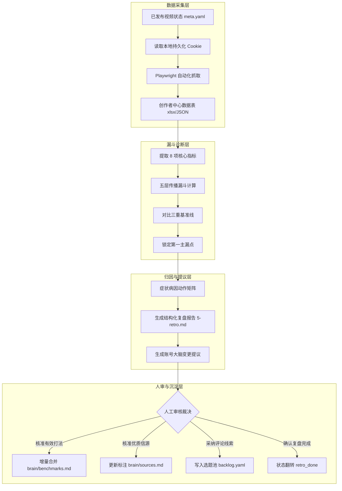
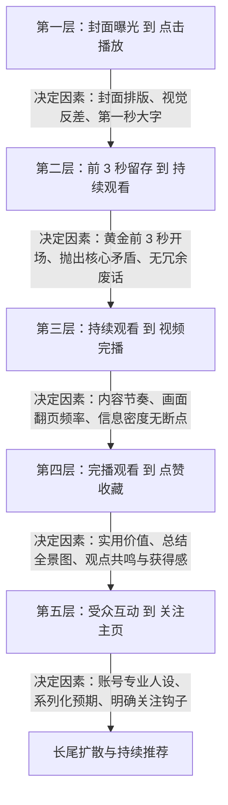

# 第 13 课：数据反哺与复盘归因：为什么只产报告不自动改大脑？

一条视频发布到内容平台之后，自动化系统的工作并没有结束。许多自动化流水线在完成视频上传后就停止了处理，后续既不拉取播放数据，也不分析受众反馈。这种单向输出的系统在运行一段时间后，往往会陷入内容效果持续下滑的困境。

选题端因为缺乏受众平台的直接数据接口，作品发布后的数据复盘就成了整个系统获取真实受众信号的唯一通道。断开复盘环节，账号的大脑就会失去迭代依据，持续产出脱离受众需求的内容。

复盘的目的在于把后台离散的数据指标翻译成下一条视频的具体工程动作。同时，为了防止单次数据波动污染核心规则库，系统必须坚持只产出报告与变更提议，由人工审核后再合并入库的治理原则。



## 1. 数据通道设计：免扫码抓取后台指标

获取准确且维度完整的后台数据，是进行数据复盘的第一步。如果每次复盘都需要人工打开浏览器扫码登录并手动复制数字，自动化的连续性就会被打断。

### 1.1 复用已保存的登录凭证

在前面的发布环节中，自动化工具已经将登录成功的 Cookie 保存在了本地持久化目录中。复盘模块不需要单独维护一套扫码登录流程，直接读取这份凭证即可建立合法会话。

```python
# scripts/fetch_metrics.py
import sys
import json
from pathlib import Path

def load_douyin_cookie(cookie_path: Path) -> list:
    if not cookie_path.exists():
        print(f"[ERROR] Cookie 文件不存在: {cookie_path}", file=sys.stderr)
        print(f"[ACTION] 请先在命令行运行 sau douyin login 完成登录", file=sys.stderr)
        # 抛出明确退出码 2，通知调用方停止后续分析
        sys.exit(2)
        
    try:
        with open(cookie_path, "r", encoding="utf-8") as f:
            cookies = json.load(f)
    except json.JSONDecodeError:
        print(f"[ERROR] Cookie 文件解析失败，可能已损坏: {cookie_path}", file=sys.stderr)
        sys.exit(2)
        
    if not isinstance(cookies, list) or len(cookies) == 0:
        print(f"[ERROR] Cookie 内容为空，无法建立会话", file=sys.stderr)
        sys.exit(2)
        
    return cookies
```

当 Cookie 失效时，脚本必须立即以特定退出码中断执行，并给出明确的人工修复提示。如果脚本在 Cookie 失效的情况下继续运行，后续抓取会返回未登录的空白页面，导致系统误将正常作品判定为零播放并做出错误的归因。

做网页自动化经常要和各种变动的登录态打交道。把凭证失效处理成明确的退出码，能让上层调度器省去大量猜谜的时间。

### 1.2 自动化脚本导出创作者中心数据表

创作者中心包含两个核心页面：
1. 账号总览页：提供全账号综合表现与同类作者百分位对标数据。
2. 作品分析页：提供每条作品的播放量、完播率、两秒跳出率、平均播放时长等明细字段。

相比直接用 DOM 选择器抓取随时可能变动的前端页面元素，调用创作者中心的导出数据功能并解析生成的电子表格更加稳健。

```python
# scripts/export_table.py
import sys
import zipfile
import xml.etree.ElementTree as ET
from pathlib import Path
from patchright.sync_api import sync_playwright

XML_NS = "{http://schemas.openxmlformats.org/spreadsheetml/2006/main}"

def download_content_table(cookie_path: Path, download_dir: Path) -> Path:
    download_dir.mkdir(parents=True, exist_ok=True)
    
    with sync_playwright() as p:
        browser = p.chromium.launch(headless=True)
        context = browser.new_context()
        
        # 注入本地 Cookie
        cookies = load_douyin_cookie(cookie_path)
        context.add_cookies(cookies)
        
        page = context.new_page()
        target_url = "https://creator.douyin.com/creator-micro/data-center/content"
        page.goto(target_url, wait_until="networkidle", timeout=45000)
        
        # 拦截点：检查是否被重定向到登录页
        if "login" in page.url:
            print("[ERROR] 会话已过期，页面重定向至登录页", file=sys.stderr)
            browser.close()
            sys.exit(2)
            
        # 监听并触发下载事件
        try:
            with page.expect_download(timeout=30000) as download_info:
                # 定位导出数据按钮
                export_button = page.locator("text=导出数据").first
                export_button.click()
            download = download_info.value
            save_path = download_dir / download.suggested_filename
            download.save_as(save_path)
            browser.close()
            return save_path
        except Exception as e:
            # 下载超时或选择器失效时，保存现场截图供排查
            screenshot_path = download_dir / "export_error.png"
            page.screenshot(path=screenshot_path)
            print(f"[ERROR] 导出数据失败，已保存排查截图: {screenshot_path}", file=sys.stderr)
            browser.close()
            sys.exit(1)

def parse_exported_xlsx(file_path: Path) -> list[dict]:
    with zipfile.ZipFile(file_path, "r") as archive:
        shared_strings = []
        if "xl/sharedStrings.xml" in archive.namelist():
            tree = ET.fromstring(archive.read("xl/sharedStrings.xml"))
            for item in tree.findall(f"{XML_NS}si"):
                text_node = item.find(f"{XML_NS}t")
                shared_strings.append(text_node.text if text_node is not None else "")

        sheet_tree = ET.fromstring(archive.read("xl/worksheets/sheet1.xml"))
        rows = []
        for row_node in sheet_tree.findall(f".//{XML_NS}row"):
            current_row = []
            for cell in row_node.findall(f"{XML_NS}c"):
                val_node = cell.find(f"{XML_NS}v")
                if val_node is None or val_node.text is None:
                    current_row.append("")
                    continue
                val = val_node.text
                if cell.get("t") == "s":
                    current_row.append(shared_strings[int(val)])
                else:
                    current_row.append(val)
            rows.append(current_row)

    if len(rows) < 2:
        return []

    # 字段名映射表
    column_mapping = {
        "作品名称": "title", "发布时间": "publish_time", "体裁": "format",
        "审核状态": "audit", "播放量": "plays", "完播率": "finish_rate",
        "5s完播率": "finish_5s", "封面点击率": "ctr", "2s跳出率": "bounce_2s",
        "平均播放时长": "avg_play_sec", "点赞量": "likes", "分享量": "shares",
        "评论量": "comments", "收藏量": "collects", "主页访问量": "profile_visits",
        "粉丝增量": "fans_delta"
    }

    headers = [column_mapping.get(h, h) for h in rows[0]]
    result = []
    for row in rows[1:]:
        row_dict = {}
        for index, header in enumerate(headers):
            val = row[index] if index < len(row) else ""
            try:
                if header in ["plays", "likes", "shares", "comments", "collects", "profile_visits", "fans_delta", "avg_play_sec"]:
                    row_dict[header] = float(val) if val not in ["", "-"] else 0.0
                elif header in ["finish_rate", "finish_5s", "ctr", "bounce_2s"]:
                    row_dict[header] = round(float(val), 6) if val not in ["", "-"] else 0.0
                else:
                    row_dict[header] = val
            except ValueError:
                row_dict[header] = val
        result.append(row_dict)
        
    return result
```

使用 Python 标准库直接解压并解析 XML，不需要安装额外的表格处理依赖。如果导出表格的第一行不是预期的表头，解析函数会返回空列表，上层调用者可以据此判断平台导出的格式是否发生变动。

### 1.3 核心指标快照全景

从创作者中心导出的原始数据经过清洗后，转换为包含四个维度的结构化指标快照。

```json
{
  "title": "手写 Mini Agent 架构拆解",
  "publish_time": "2026-07-08 18:30:00",
  "format": "视频",
  "audit": "公开正常分发",
  "plays": 16060.0,
  "ctr": 0.206,
  "bounce_2s": 0.362,
  "finish_5s": 0.420,
  "finish_rate": 0.0192,
  "avg_play_sec": 20.5,
  "likes": 196.0,
  "collects": 202.0,
  "comments": 7.0,
  "shares": 10.0,
  "profile_visits": 77.0,
  "fans_delta": 15.0,
  "peer_benchmark": {
    "plays_percentile": 88.0,
    "finish_rate_percentile": 62.0,
    "interaction_percentile": 45.0
  }
}
```

这些指标构成了后续所有归因计算的基础输入。为了保证复盘记录的可追溯性，导出的原始表格文件应当归档保存在独立的研究目录下，不得随临时文件一同清理。

### 1.4 用提示词引导 AI 执行采集与指标计算

在获取到原始数据后，我们可以编写明确的系统提示词，驱动大型语言模型完成指标清洗与基础计算。

```markdown
# 数据清洗与漏斗计算提示词

你是一个专业的内容数据分析助手。请根据输入的单条作品原始后台数据，完成数据格式化与基础漏斗指标计算。

## 输入数据
{{RAW_METRICS_JSON}}

## 计算要求
1. 计算总互动量：点赞量 + 收藏量 + 评论量 + 分享量。
2. 计算综合互动率：总互动量 / 播放量，保留四位小数。
3. 计算完播率指标：保留四位小数。
4. 计算转粉率：新增粉丝数 / 主页访问量，若主页访问量为 0 则标记为待确认。

## 异常拦截约束
- 如果播放量小于 500，必须在输出中显式声明：样本量较小，漏斗转化率存在较大随机波动，仅供参考。
- 严禁凭空估算未采集到的指标，缺失项统一填充为 null。

## 输出格式
请输出如下结构的标准 JSON：
```json
{
  "summary": {
    "plays": 0,
    "total_interactions": 0,
    "interaction_rate": 0.0,
    "finish_rate": 0.0,
    "fan_conversion_rate": 0.0
  },
  "flags": {
    "small_sample_warning": false,
    "missing_fields": []
  }
}
```
```

调用该提示词时，若输入的原始数据缺少完播率或播放时长等核心字段，模型会在标记字段中列出缺失项，防止错误的数据进入下一阶段。

## 2. 短视频传播五层漏斗与主漏点定位

面对后台十多项数据，如果只看孤立的绝对数字，很难发现内容的问题所在。短视频平台的分发机制是一层层的漏斗过滤。理清各层级之间的递进关系，才能找到数据下滑的真实位置。

### 2.1 传播五层漏斗深度拆解

短视频的传播过程可以拆解为五个连续递进的阶段。每一个阶段对应着不同的内容制作维度。



第一层是封面曝光到点击播放。在信息流中，封面和标题决定了受众是否愿意停下手指点进视频。衡量这一层的核心指标是封面点击率。制作时需要依靠高对比度的封面大字和清晰的视觉主体吸引注意力。

第二层是进入视频后的前三秒留存。受众点进视频后，开篇第一句话和第一屏画面决定了他们是划走还是留下。衡量这一层的指标包括两秒跳出率与五秒完播率。制作时需要使用自成立的第一句话，直接切入核心技术痛点。

第三层是前段留存到完整播放。受众看进内容后，中段的技术讲解节奏和画面信息密度决定了他们能否坚持看完。衡量这一层的是整体完播率与平均播放时长。制作时需要保持适宜的页面切换节奏，避免画面长时间静止。

第四层是从看完视频到产生互动。受众完整看完内容后，如果觉得内容有价值，会触发点赞和收藏；如果内容引发了观点讨论，会触发评论与转发。这一层的衡量指标是综合互动率与收藏点赞比。

第五层是从单条内容互动到关注账号主页。受众认可作者的专业度并期待后续内容时，会进入作者主页并点击关注。衡量这一层的是主页访问量与粉丝净增量。

### 2.2 三重基准线对比与主漏点定位

单看某一条视频的绝对数字，很难直接判断好坏。例如一条两百秒的长视频，其完播率通常只有百分之二左右，不能直接拿它和十五秒的短篇相比。

评估数据必须引入三条基准线：
1. 平台同类作者百分位：衡量作品在全平台同赛道作品中的相对水平。
2. 账号历史总体均值：衡量作品是否达到本账号的平均制作水准。
3. 同内容支柱历史均值：衡量作品在同类型主题（如深度源码拆解或前沿资讯）中的表现。

```python
# scripts/locate_bottleneck.py
def identify_primary_bottleneck(metrics: dict, baselines: dict) -> dict:
    # 样本量校验：播放量不足 500 时不执行严格漏斗判定
    if metrics.get("plays", 0) < 500:
        return {
            "bottleneck_stage": "sample_too_small",
            "stage_name": "样本量不足",
            "reason": "播放量低于 500，比率受偶发扰动影响过大，不做主漏点定性"
        }

    funnel_stages = [
        ("click_through", metrics["ctr"], baselines["ctr"], "封面与标题引流"),
        ("initial_retention", 1.0 - metrics["bounce_2s"], 1.0 - baselines["bounce_2s"], "前三秒冷开场留存"),
        ("mid_retention", metrics["finish_5s"], baselines["finish_5s"], "前五秒展开节奏"),
        ("completion", metrics["finish_rate"], baselines["finish_rate"], "中后段完整播放"),
        ("interaction", metrics["interaction_rate"], baselines["interaction_rate"], "完播后互动意愿"),
        ("conversion", metrics["fan_conversion_rate"], baselines["fan_conversion_rate"], "主页转粉意愿")
    ]
    
    for stage_key, actual_val, base_val, stage_name in funnel_stages:
        if base_val is None or actual_val is None:
            continue
        # 找出第一个明显低于基准线 15% 以上的环节
        if actual_val < base_val * 0.85:
            drop_ratio = round((base_val - actual_val) / base_val * 100, 2)
            return {
                "bottleneck_stage": stage_key,
                "stage_name": stage_name,
                "actual_value": actual_val,
                "baseline_value": base_val,
                "drop_percentage": drop_ratio
            }
            
    return {"bottleneck_stage": "none", "stage_name": "各环节均达标或高于基线"}
```

主漏点的判定原则是寻找最先低于基准线的环节。如果一条视频在前三秒留存上就已经远低于均值，即使后面的互动率偏低，核心问题也是开场没有留住人，后部的互动引导无法发挥作用。

在这里需要注意数据周期的影响。在视频发布后的前二十四小时内，主页访问量与转粉数据在平台后台可能存在统计延迟。如果过早对转粉率下结论，容易得出错误的判断。通常建议在发布七十二小时之后，再对转化层级做最终定性。

给播放量只有两三百的视频做精细归因，多半是在解读随机噪声。遇到这种情况，记下数据即可，不必过度纠结每个百分比的波动。

## 3. 实操归因：症状、病因与动作矩阵

找到主漏点之后，下一步是将统计层面的指标异常转化为制作层面的修改动作。归因矩阵建立了从症状到病因再到动作的映射关系。

### 3.1 三秒留存差的归因与改进

当视频的两秒跳出率高于百分之四十或五秒完播率低于百分之三十五时，表明视频在开场阶段流失了大量观众。

```text
症状表现：两秒跳出率过高，五秒完播率明显低于基准线。
常见病因：
1. 封面标题字号太小，移动端快速滑动时无法看清。
2. 开头第一句话包含废话承接语（例如“今天我们来聊聊一个有趣的话题”）。
3. 前两秒画面静止，缺少视觉动作或代码高亮变化。

改进动作：
1. 执行第一句自成立规则：开门见山抛出技术痛点或代码报错，删掉所有礼貌性寒暄。
2. 调整封面字号：将核心钩子文字放大到 88px 到 120px，使用高对比度背景底色。
3. 视频第一秒直接呈现终端报错或架构对比图，创造强烈的视觉冲突。
```

文案开场的质量直接决定了留存率。看两个实际文案开头的对比：

低效开头示例：
今天我们来聊聊大模型工具。最近常有人问我这些工具到底怎么选，我就抽空整理了一下主流工具的差异。

高效开头示例：
同样是两百行代码，为什么别人的 Agent 启动只需要二十毫秒，你的系统却要卡顿三秒？根源出在三个被忽视的底层调用上。

第二种写法直接抛出具体的性能反差与技术矛盾，受众在第一秒就能明确视频的技术价值，从而显著降低前两秒的跳出率。

### 3.2 完播率断崖式下滑的归因与改进

如果前五秒留存良好，但在二十秒到四十秒之间完播曲线出现断崖式下跌，说明问题出在中段的内容呈现节奏上。

```text
症状表现：前段留存达标，但平均播放时长远低于视频总长，完播率低于同类均值。
常见病因：
1. 单个代码页面停留时间超过 8 秒，画面缺乏动态演进。
2. 口播解说出现长达 1.5 秒以上的无声气口，节奏松散。
3. 抽象概念缺乏图表辅助，纯口述导致理解成本过高。

改进动作：
1. 提高视听切换频率：将单个视觉步骤的展示时间压缩在 4 到 6 秒内。
2. 自动化剪辑清理：通过音频体检脚本自动剔除大于 400 毫秒的停顿尖峰。
3. 引入架构动图：在复杂逻辑处使用流程演进动效替代静态文字解说。
```

长视频在信息密度与认知负荷之间需要保持平衡。遇到复杂的源码机制讲解时，将单条长视频拆分为两到三个小节的连续短篇，往往能取得更好的整体完播表现。

### 3.3 完播率高但无互动的归因与改进

当一条视频的播放时长和完播率都很高，但点赞、评论和转发量极低时，说明受众认可了内容质量，但缺乏表达和互动的动机。

```text
症状表现：完播率和均播时长高于基线，但综合互动率低于百分之二。
常见病因：
1. 内容属于纯事实叙述，缺乏有争议或值得讨论的观点。
2. 结尾缺少明确的总结卡片，受众看完直接滑走，没有保存动机。
3. 结尾的互动引导过于模糊（例如“欢迎大家在评论区讨论”）。

改进动作：
1. 增加实用总结页：在视频末尾增加一张高密度的架构选型对比表，激发受众收藏。
2. 设计具体行动指令：将模糊引导改为明确指令（例如“回复配置获取完整源码工程”）。
3. 提炼金句观点：在结尾处用两句话总结工程权衡，为受众提供转发到技术群的理由。
```

在实际运营中，收藏量大于点赞量的现象在深度技术视频中非常普遍。这种特征反映了技术受众把视频当作工具资料暂存的行为习惯，属于符合账号定位的良性信号。

### 3.4 评论区宝藏挖掘与新选题线索

评论区是受众真实反馈的集中地。受众在评论区提出的技术质疑、踩坑经历以及配置问题，是下一轮选题调研最优质的原料。

```text
评论区线索提取示例：
受众评论：“这个本地部署方案在 Windows 环境下经常报 dll 缺失，怎么解决？”
提炼病因：原视频只覆盖了 macOS 与 Linux 环境，遗漏了重要平台分支。
沉淀动作：
1. 在选题池 backlog.yaml 中新增条目：“Windows 环境部署 Python C 扩展排坑指南”。
2. 将该选题标记为衍生自评论区高频问题，赋予较高的初始优先级。
```

定期整理高频评论词云，能够帮助我们发现现有内容体系中的认知盲区，使选题库保持充沛的活力。

## 4. 治理沉淀：从复盘报告到大脑变更提议

许多系统在完成数据分析后，习惯让 AI 直接修改知识库与提示词模板。这种看似高度自动化的做法，在工程实践中会带来严重的系统风险。

### 4.1 为什么治理线严禁 AI 自动修改大脑？

自动化治理系统必须坚守一条底线：复盘只产出报告与变更提议，严禁未经人类确认自动修改账号大脑。

```mermaid
graph TD
    subgraph 危险路径：自动修改[危险路径：全自动修改大脑]
        E1[单条视频偶发跳出率高] --> E2[AI 自动推断规则]
        E2 --> E3[直接覆写 brain/benchmarks.md]
        E3 --> E4[后续所有视频强制采用新规则]
        E4 --> E5[产生规则过拟合与系统性震荡]
    end

    subgraph 安全路径：提议与人审[安全路径：治理线提议加人工核准]
        S1[单条视频数据异常] --> S2[AI 生成结构化复盘报告]
        S2 --> S3[生成待审变更提议 diff]
        S3 --> S4{人类工程师审查核验}
        S4 -->|积累 2 条以上同向证据| S5[人工确认合并入库]
        S4 -->|单次偶发扰动| S6[驳回提议并记录观察]
    end
```

禁止 AI 自动修改大脑的核心原因包括以下三点：

第一，防止单次小样本过拟合。短视频平台的单条播放受时段、推荐池偶发波动等外部因素影响很大。如果某条视频因为当天平台网络波动导致播放量偏低，AI 可能会误以为是文案风格存在缺陷，进而自动删去原本非常成功的开场规则。

第二，防止正负反馈震荡。如果系统今天因为跳出率高而将开场缩短到三秒，明天又因为完播后缺少解释而将开场拉长到十秒，核心规则库就会处于持续的摇摆与震荡中，导致后续生产的标准完全失控。

第三，知识库的增量腐蚀不可逆。账号大脑中的定位规范、人设要求和打法库是整个系统的宪章。一旦允许大模型自由覆写，提示词中的关键边界条件就会在多次迭代后被逐渐稀释和篡改，最终使整个系统失去原有的专业质感。

### 4.2 标准化复盘报告结构

治理任务要求每次复盘必须生成标准格式的 Markdown 报告，保存在对应的日志目录中。

```markdown
# 复盘报告：手写 Mini Agent 架构拆解

## 1. 基础数据快照
- 评估窗口：发布后 72 小时
- 播放量：16060（同类作者百分位：88%）
- 封面点击率：20.6%
- 两秒跳出率：36.2%
- 五秒完播率：42.0%
- 整体完播率：1.92%
- 平均播放时长：20.5 秒（视频总长：198 秒）
- 互动数据：点赞 196 / 收藏 202 / 评论 7 / 分享 10
- 转化数据：主页访问 77 / 净增粉丝 15

## 2. 漏斗诊断与主漏点
- 漏斗前段（曝光、点击、五秒留存）均显著高于同赛道均值，开场抓人有效。
- 主漏点定位在转化层级：完播后评论量较少（仅 7 条），互动率（2.58%）略低于历史基线（3.08%）。

## 3. 归因分析
- 封面大字与终端报错开场有效降低了跳出率，该模式表现稳定。
- 结尾处的行动号召偏软性，未给出具体的获取资料指令，导致评论互动不足。
- 收藏量超过点赞量，符合深度架构拆解的工具书属性。

## 4. 账号大脑变更提议（待人审）
- 提议 1（打法库）：建议在 brain/benchmarks.md 中新增打法记录：“强行动指令结尾（回复关键词获取配置）可提升评论率 50% 以上”。
  - 依据：本条弱指令仅获 7 条评论，而 ep15 强指令获 48 条评论，已具备两条同向证据。
- 提议 2（选题池）：从评论区提取 1 个新选题：“Windows 下 Python 扩展编译踩坑录”，建议写入 backlog.yaml。
```

标准化报告清晰地分离了客观数据、主观归因与变更提议，为人工裁决提供了完整的上下文。

### 4.3 四类产物提议的规范化落地

复盘产生的建议需要归类到四种明确的系统资产中：

1. 有效打法提议：针对反复验证有效的结构模式，向 `brain/benchmarks.md` 提交修改建议。
2. 优质信源提议：针对产生高播放内容的原始技术源，向 `brain/sources.md` 提高权重评分。
3. 衍生选题线索：针对受众高频提问，向 `content/_backlog/backlog.yaml` 录入新的待选条目。
4. 状态记账流转：在完成最终复盘后，通过工具将当前作品的 `meta.yaml` 状态更新为 `retro_done`。

需要说明的是，修改作品状态属于日常任务记账，不属于修改账号大脑的范畴，可以由自动化工具在流程结束时自动完成。

### 4.4 多时间窗口跟踪机制

短视频的数据表现具有时间累积效应。系统定义了三个阶段性的复盘窗口：

1. 发布后 24 小时：核心评估前三秒跳出率与初期播放爆发力，判断冷启动是否成功。
2. 发布后 72 小时：评估长尾流量沉淀与完播水平，此时主页访问和转粉数据基本准确。
3. 发布后 7 天：完成全生命周期定性，正式收口复盘结论，执行状态流转。

在多窗口跟踪中，需要警惕大分母稀释效应。当一条视频播放量突破数万次并进入更广泛的公域推荐池时，泛受众群体的涌入会导致整体完播率和互动率被动下降。此时不能简单地将比率下降判定为内容质量变差，而应结合绝对播放增量进行综合评估。

### 4.5 用提示词引导 AI 生成归因报告与变更提议

为了让大模型严格按照规范输出复盘报告，我们需要设计包含硬性约束的提示词。

```markdown
# 归因诊断与提议生成提示词

你是一个严谨的内容架构治理专家。请根据输入的清洗后数据快照与历史基准线，完成漏斗归因并输出变更提议。

## 输入上下文
- 本条作品数据：{{METRICS_JSON}}
- 历史基准线数据：{{BENCHMARKS_JSON}}
- 账号定位与打法库：{{BRAIN_BENCHMARKS_MD}}

## 任务要求
1. 对比基准线，明确指出本条作品的第一主漏点。
2. 依据症状归因矩阵，分析 2 到 3 条具体的病因与下一条内容的改进动作。
3. 提取 1 到 2 条账号大脑变更提议。

## 约束条件
- 严禁直接执行文件写入操作，所有建议必须以文本提议形式呈现。
- 每条打法变更提议必须附带明确的事实依据，并注明同向证据数量。若同向证据不足 2 条，只能列为观察项，不得建议修改基线。
- 严禁空泛评论，所有归因必须指向具体的制作要素（如开头第 1 句、字号、单屏时长、结尾指令）。

## 输出格式
请直接输出符合 5-retro.md 结构的 Markdown 文本。
```

该提示词将治理铁律内嵌到系统指令中，确保生成的提议具备严密的数据支撑。

### 4.6 人审决策后的知识库增量合并提示词

当人类工程师审核完复盘报告并批准了其中的变更提议后，我们可以使用专用的合并提示词，指导 AI 安全地更新知识库文件。

```markdown
# 知识库增量合并提示词

你是一个代码与规则库维护助手。人类工程师已经审核通过了以下变更提议，请执行针对知识库文件的安全增量合并。

## 输入信息
- 待修改文件路径：brain/benchmarks.md
- 待修改文件原始内容：
{{ORIGINAL_FILE_CONTENT}}
- 人工核准的提议内容：
{{APPROVED_PROPOSAL_TEXT}}

## 合并规则
1. 保持原文件的结构框架和排版格式不变。
2. 仅在对应的打法表格末尾追加新增条目，严禁删除或修改既有的稳定打法。
3. 如果提议内容是对历史均值基线的刷新，请更新对应指标数值，并保留更新时间戳。
4. 严格保持 Git diff 的最小化，不进行任何无关的格式调整。

## 输出要求
请直接输出合并后的完整文件内容，不得包含任何多余的解释说明。
```

通过这一套流程，既发挥了大模型快速处理数据和起草建议的能力，又通过人工闸口保障了核心规则库的纯净与稳定。

## 5. 验收标准与作业

完成本课的学习后，你需要通过实际操作验证复盘流程的完整性。

### 5.1 验收标准

1. 能够使用自动化脚本成功读取本地 Cookie 并导出创作者中心的数据表格。
2. 能够准确计算五层漏斗指标，并定位出第一主漏点。
3. 生成一份符合规范的 `5-retro.md` 复盘报告，报告中包含清晰的数据快照、归因分析和至少一条合规的变更提议。
4. 确认系统未发生未经授权的大脑文件修改行为。

### 5.2 课后作业

1. 运行复盘采集脚本，拉取你最近发布的一条视频后台数据，保存生成的原始表格文件。
2. 使用本课提供的提示词模板，生成该视频的结构化复盘报告。
3. 人工审查生成的报告，判断其中的变更提议是否具备充分的数据支撑，并手动完成一次向 `brain/benchmarks.md` 的打法增量合并。
