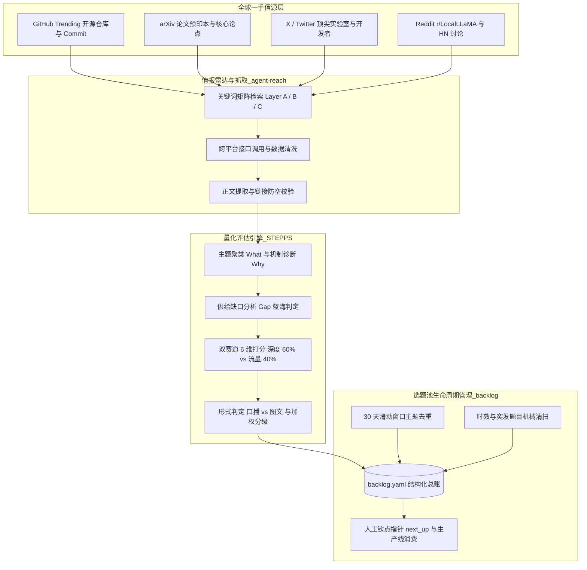
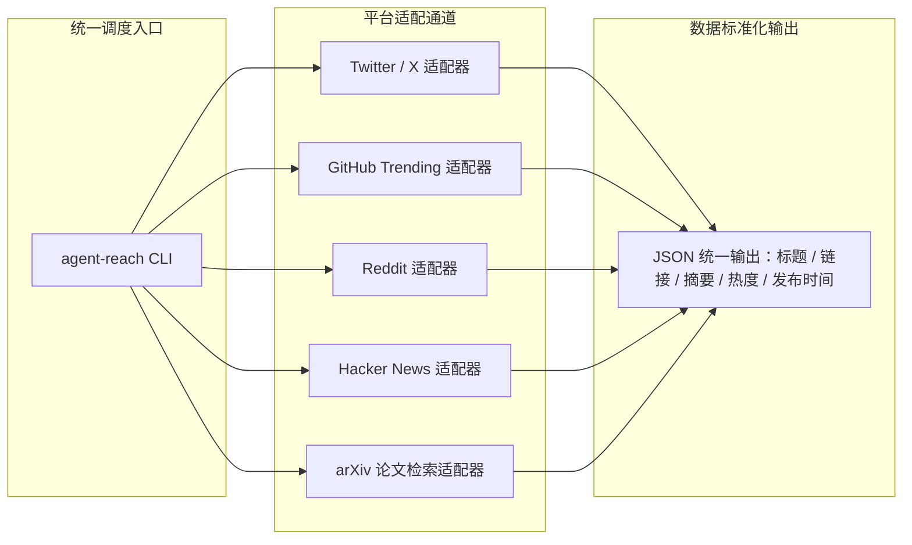
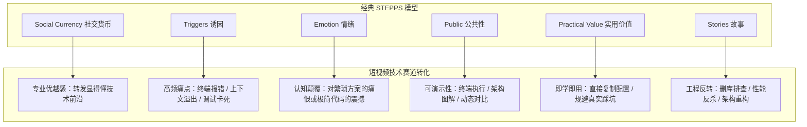
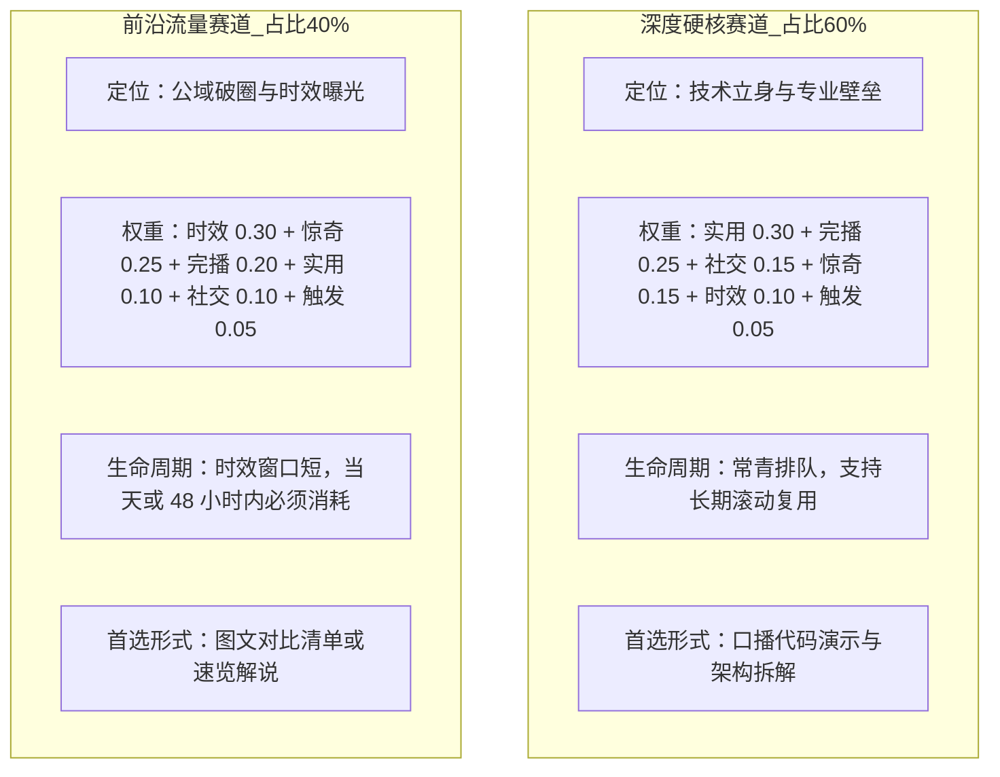
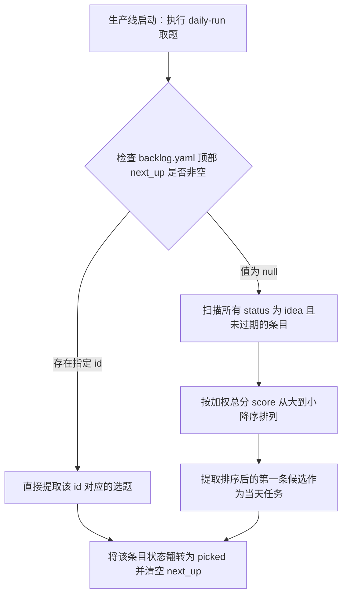
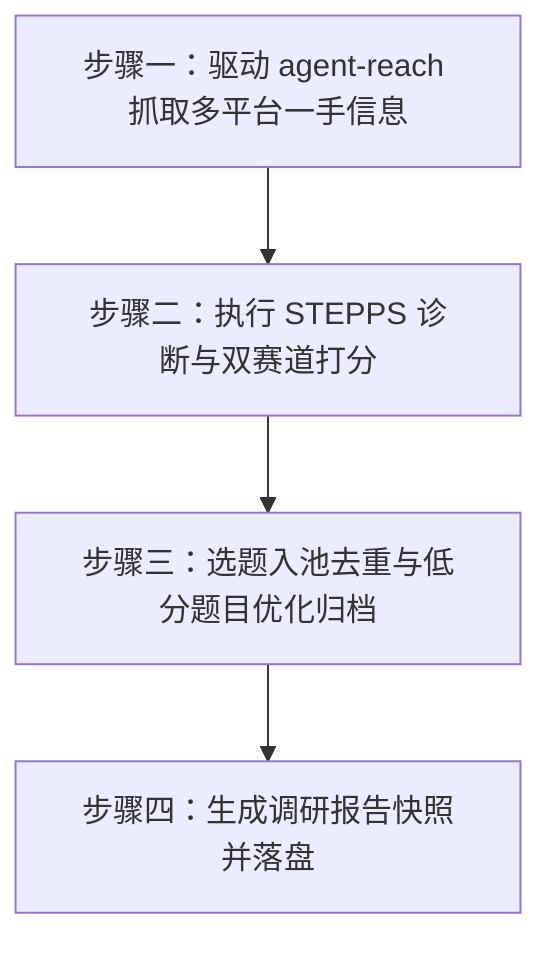

# 第 14 课：智能选题池与外网抓取：用 STEPPS 模型打造源源不断的技术选题库

让大语言模型随便列五个视频选题，得到的通常是千篇一律的泛化建议，比如某某技术的五个入门技巧或者未来发展趋势。这类建议缺乏工程细节与一手信息差，直接做成视频往往难以获得算法推荐。

内容生产系统的输入质量决定了最终交付物的上限。如果输入端只有国内转译过多次的二手资讯，输出端就很难产出具有技术穿透力的内容。

技术创作者需要的是一套自动化情报雷达与量化评估机制。系统定时扫描全球顶尖开源社区与核心研究员的一手动态，结合短视频传播动力学进行量化筛选，把符合定位的候选题目沉淀到结构化的选题池中，实现持续稳定的原料补给。



## 1. 情报雷达：用 agent-reach 嗅探全球一手技术动态

技术领域的知识传播存在明显的阶梯效应。一项新技术从论文发表、代码开源，到海外社区发酵，再到国内自媒体翻译搬运，通常存在 2 到 5 天的时间差。

### 1.1 为什么技术博主必须抓取海外一手源？

二次转译的内容往往在传播链条中丢失了最关键的工程上下文。

许多搬运文章为了追求大众阅读量，会将具体的代码断言、环境依赖冲突与性能瓶颈，抽象为宏观的行业概念。这类内容看似覆盖面广，但对真实开发者而言缺乏实操参考价值。

真正的技术信息差存在于原始现场：
1. 开源仓库的代码提交记录（Commit Log）与拉取请求（Pull Request），能直接反映框架架构的演进方向；
2. 顶尖实验室研究员在社交平台发布的非正式技术讨论，往往包含官方文档尚未收录的调试技巧；
3. 开源社区中针对特定硬件配置的调优讨论，直接对应着开发者在日常工作中踩到的真实故障。

直接抓取海外一手源，能够在技术热点尚未在国内泛滥前完成深度实测与视频制作，在时效与深度两个维度同时建立竞争优势。

关于短视频平台的受众偏好信号获取，这里需要说明一个架构抉择。许多开发者尝试用无头浏览器直接抓取短视频平台的搜索推荐热词，但在无人值守的自动化流水线中，这类操作极易触发平台的滑块验证与设备风控。

系统选择放弃在选题阶段直接抓取短视频平台数据，转而将注意力集中在全球技术社区的一手原料。平台受众的反馈信号由发布后的复盘模块从创作者后台提取，再反向校准选题打分权重。

在抓取海外信源时，网络请求超时与空数据是高频出现的异常情况。以下是用于信源抓取与数据校验的防御脚本。

```python
# scripts/fetch_sources.py
import sys
import subprocess
import json
from pathlib import Path

def fetch_platform_data(channel: str, query: str, limit: int = 10) -> list:
    cmd = ["agent-reach", "search", channel, query, "--limit", str(limit), "--json"]
    try:
        result = subprocess.run(cmd, capture_output=True, text=True, timeout=45)
    except subprocess.TimeoutExpired:
        print(f"[WARN] 抓取信源超时: channel={channel}, query={query}", file=sys.stderr)
        return []

    if result.returncode != 0:
        print(f"[ERROR] 抓取命令失败: {result.stderr.strip()}", file=sys.stderr)
        return []

    raw_output = result.stdout.strip()
    if not raw_output:
        return []

    try:
        items = json.loads(raw_output)
    except json.JSONDecodeError as e:
        print(f"[ERROR] JSON 解析异常: {e}, 原文: {raw_output[:100]}", file=sys.stderr)
        return []

    valid_items = []
    for item in items:
        # 拦截点：必须包含有效标题与可追溯链接，禁止无源信息进入下游
        title = item.get("title", "").strip()
        url = item.get("url", "").strip()
        if not title:
            continue
        if not url or not url.startswith("http"):
            # 部分社交平台正文内包含链接但顶层 url 字段为空，尝试从文本末尾提取
            text = item.get("text", "")
            extracted_urls = [w for w in text.split() if w.startswith("http://") or w.startswith("https://")]
            if extracted_urls:
                url = extracted_urls[-1]
                item["url"] = url
            else:
                continue
        valid_items.append(item)

    return valid_items
```

如果抓取模块在链接缺失时依然将条目放行，后续的深度解析 Agent 就会因为无法追溯代码仓库而陷入虚构细节的死循环。

### 1.2 开源抓取引擎 agent-reach 架构与平台通道

`agent-reach` 是一个面向 AI 智能体设计的全网信息检索与抓取命令行工具。它通过统一的调用协议，封装了海外多个异构平台的抓取适配器。



主要通道的抓取特性与参数配置要求如下：

1. X 与 Twitter 通道：重点监控顶尖 AI 实验室（Anthropic、OpenAI、Google DeepMind）与核心技术意见领袖。推文检索通常需要按互动量（转发、点赞）排序，过滤纯情绪抒发的简短推文；
2. GitHub Trending 通道：抓取最近 24 小时与最近 7 天在 AI、Agent、LLM 领域星标增长最快的仓库，重点提取 README 中的架构图与核心功能描述；
3. Reddit 通道：锁定 r/LocalLLaMA 与 r/MachineLearning 板块。由于该板块反爬严格，直接抓取正文容易返回状态码 403，调用时需要配置备用代理通道，或先抓取帖子标题与讨论热度，再针对性读取重点回帖；
4. Hacker News 通道：监控 Show HN 与 Ask HN 标签下的高分讨论，捕捉独立开发者推出的新型开源工具；
5. arXiv 通道：按计算机科学人工智能领域（cs.AI、cs.CL）检索最新的论文预印本，提取摘要中的实验对比数据。

在多平台并发抓取时，不同平台的响应格式差异很大。通过统一的清洗逻辑，将所有平台的数据标准化为包含标题、原始链接、来源渠道、热度数据与日期的结构化元组。

### 1.3 信源清单设计：brain/sources.md 的动态权重配置

系统不能漫无目的地在互联网上泛搜。必须将抓取范围约束在经过验证的信源配置文件中。

在账号大脑的 `brain/sources.md` 中，信源被切分为素材源与三层关键词矩阵。

```markdown
# 选题信息源配置

## 一、素材源列表

### 流量与时效源
- X / Twitter：监控官方账号与核心研究员推文
- Reddit：r/LocalLLaMA、r/MachineLearning
- Hacker News：AI 主题高赞讨论
- 官方 Release 页：各大开源模型与开发工具发布日志

### 深度与沉淀源
- GitHub Trending：AI / Agent / 开发者工具方向的热门开源项目
- arXiv：计算机科学分支下的最新架构论文

## 二、三层关键词矩阵

Layer A 平台体裁词（验证当前流行的内容呈现形式）
AI编程 · 用AI · AI实测 · AI效率 · AI工具

Layer B 深度领域词（对应账号的技术立身支柱）
Cursor · Claude Code · AI Agent · 大模型 · MCP · 源码解读 · RAG · 工作流自动化

Layer C 流量信号词（捕捉即时发布热点）
新模型发布 · AI新闻 · OpenAI · Anthropic · Gemini · 开源大模型
```

关键词矩阵的设计逻辑在于将宽泛的技术领域拆解为不同层级的探测探针。
1. Layer A 体裁词用于扫描短视频受众当前最容易接受的表达方式；
2. Layer B 深度词直接锚定账号的人设定位，确保抓取到的素材不会偏离工程实战方向；
3. Layer C 流量词用于捕获突发新闻，在第一时间抢占算法公域流量。

这套配置不是静态不变的。在每周的治理复盘中，系统会统计各个关键词对应选题的实际播放与涨粉数据，自动淘汰低效词，追加高转化词。

有时候网络抖动会导致某个特定平台的抓取完全落空。遇到这种情况不需要慌张，只要保持多源冗余，哪怕 Reddit 暂时返回空数据，GitHub 和 X 的增量依然足够支撑当天的选题筛选。

## 2. 科学打分：短视频 STEPPS 传播力模型落地

抓取到几十条甚至上百条原始技术动态后，系统面临的最关键挑战是如何从中挑出真正具有爆款潜力的选题。

如果完全依赖人工主观感觉挑题，创作者往往会陷入技术自嗨，挑选那些架构极其复杂但缺乏视觉呈现点或受众共鸣的冷门题目。必须建立一套量化的评估标准。

### 2.1 经典 STEPPS 模型在短视频技术赛道的落地

沃顿商学院教授乔纳·伯杰（Jonah Berger）在《疯传》中提出了 STEPPS 传播力模型。该模型包含六个驱动内容传播的核心要素：社交货币、诱因、情绪、公共性、实用价值与故事。

在面向程序员与技术爱好者的短视频赛道中，这六个要素需要做针对性的工程化转化。



1. 社交货币（Social Currency）：技术人员转发一条视频，核心动机是向同行展示自己的专业敏锐度。一个能解释新技术底层原理或提前透露重要技术动向的选题，能为观众提供充足的社交货币；
2. 诱因（Triggers）：选题切中的场景在观众日常开发中出现的频率越高，内容被激活唤醒的概率就越大。比如环境变量配置冲突、大模型长上下文截断、Token 消耗过快，都是每天写代码必然碰到的诱因；
3. 情绪（Emotion）：技术视频的情绪重在认知冲击与反差感。当观众看到原本需要手写两百行代码的工作流被一个配置彻底简化，或者某个大厂宣称的性能指标在实测中翻车时，情绪共鸣就会被迅速激发；
4. 公共性（Public）：短视频是视觉媒介，纯理论推导在没有可视载体时很难留住观众。选题必须具备终端命令行输出、架构拓扑流转或实时界面对比等可录屏演示的公共属性；
5. 实用价值（Practical Value）：视频必须提供看完就能用的具体产物，比如一段可以直接复制的配置文件、一个开源脚手架命令，或者一组防踩坑的参数检查清单；
6. 故事（Stories）：技术内容需要包裹在真实的工程解决过程中。从遇到诡异报错、排查源码，到最终定位根因并修复，完整的冲突故事远比干巴巴的参数罗列更具吸引力。

在评估候选题目时，要特别注意区分社交货币与情绪惊奇。社交货币是对外的，核心在于转发给别人能否显得自己专业；情绪惊奇是对内的，核心在于自己看到的瞬间是否产生认知颠覆。这两者在打分时通常一高一低，如果同一个选题在这两项上都给出满分，说明评估标准尚未完全理清。

### 2.2 4 维量化评分体系与 6 维指标数学加权

为了使评估过程可计算、可比较，系统将上述传播机制落地为 6 个基础打分维度，每个维度评分为 1 到 5 分：

| 维度名称 | 英文标识 | 核心考量问题 | 5 分标准特征 |
|---|---|---|---|
| 实用性 | practical | 看完能不能直接用到明天的工作中？ | 提供即学即用的配置、脚本或工作流，直接节省工时 |
| 社交性 | social | 转发给同行能否显得自己懂前沿？ | 揭示未公开的技术内幕或前沿架构，转发具备专业面子 |
| 惊奇度 | emotion | 结论是否具备强烈的反常识或认知颠覆？ | 颠覆传统认知，展现意想不到的极简解法或实测翻车 |
| 完播潜力 | hook | 前三秒是否有悬念，能否撑住完整播放？ | 带有天然的冲突对比、断言报错，具备动态演示节奏 |
| 时效性 | timeliness | 是否属于当下全网热议的新闻或新发布？ | 24 小时内发布的旗舰模型或重大开源突破，热度处于峰值 |
| 触发频次 | trigger | 观众在日常开发中多久会碰到一次？ | 属于高频开发过程中的必经环节，每天编码都会遇到 |

在没有成片的情况下评估完播潜力时，不要去主观猜测视频的剪辑效果，而是直接评估该选题本身是否天然具备视觉冲突与动态演示空间。能够进行前后对比实测的选题天然具备高完播潜力，纯文字资讯速报的完播潜力则相对较低。

根据加权综合得分，系统将选题划分为五个等级：
- S 级（得分 4.0 及以上）：高潜力爆款选题，具备强烈推荐价值，应立即安排制作；
- A 级（得分 3.5 到 3.9 分）：优质储备选题，进入优先制作排期队列；
- B 级（得分 3.0 到 3.4 分）：可用选题，但存在明显短板，需要调整切入角度或重新设计开篇钩子；
- C 级（得分 2.5 到 2.9 分）：平庸选题，暂时搁置，除非找到新的反常识切入点；
- D 级（得分 2.5 分以下）：低质选题，直接淘汰出局。

### 2.3 双赛道滚动配比

一个健康的技术账号不能只做突发新闻，也不能只讲枯燥的底层源码。纯做新闻会导致粉丝粘性极低、缺乏专业护城河；纯讲源码则会导致受众面过窄、播放量难以突破垂直圈层。

系统在账号大脑中定义了双赛道 6:4 滚动配比：60% 的选题分配给深度硬核赛道，40% 的选题分配给前沿流量赛道。



由于两条赛道的业务目标不同，其打分加权公式必须进行差异化设计：

深度赛道加权总分公式：
总分 = 实用分 × 0.30 + 完播分 × 0.25 + 社交分 × 0.15 + 惊奇分 × 0.15 + 时效分 × 0.10 + 触发分 × 0.05

流量赛道加权总分公式：
总分 = 时效分 × 0.30 + 惊奇分 × 0.25 + 完播分 × 0.20 + 实用分 × 0.10 + 社交分 × 0.10 + 触发分 × 0.05

在深度赛道中，实用与完播合计占据 55% 的权重。这一配比确保挑选出的题目能帮开发者解决实际问题，并且能被完整看完。而在流量赛道中，时效与惊奇合计占据 55% 的权重，旨在第一时间捕获算法推荐流量。

为了保护账号的长期技术资产，对于属于源码解读、底层原理剖析与工程提效类的深度常青题，系统在计算完加权总分后允许追加 0 到 0.3 分的定位契合加成。这能有效防止优质深度题因为时效分偏低而被误杀。

## 3. 选题池工程化：backlog.yaml 规范与理池

所有的评估产物如果散落在聊天记录或临时文本中，随着时间推移必然会丢失。必须建立一个版本化、可追踪、支持状态机流转的集中账本。

### 3.1 数据结构：content/_backlog/backlog.yaml 标准定义

选题池总账存放在 `content/_backlog/backlog.yaml`。它是所有候选选题在进入制作阶段前的唯一事实来源。

```yaml
# content/_backlog/backlog.yaml
next_up: null

topics:
  - id: 2026-07-15-001
    title: "终端防删库利器 cc-safety-net：解析命令语义拦截危险操作实测"
    alt_titles:
      - "给 Coding Agent 戴上紧箍咒：PreToolUse 钩子深度实战"
    track: depth
    format: kouban
    status: idea
    content_path: null
    score: 4.35
    tier: S
    scores:
      practical: 5
      social: 4
      emotion: 4
      hook: 4
      timeliness: 3
      trigger: 5
    urgency: queue
    reason: "切中开发者高频痛点，真实事故驱动，具备代码实测与拦截演示空间"
    links:
      - "https://github.com/example/cc-safety-net"
    tags:
      - coding-agent
      - safety
      - cli-tool
    created: 2026-07-15
    metrics: {}

  - id: 2026-07-15-002
    title: "Anthropic 披露隐藏思维空间：模型在思考链中究竟动了什么手脚"
    alt_titles:
      - "大模型可解释性最新突破：当模型陷入恐慌时会发生什么"
    track: depth
    format: kouban
    status: idea
    content_path: null
    score: 3.85
    tier: A
    scores:
      practical: 3
      social: 5
      emotion: 4
      hook: 4
      timeliness: 3
      trigger: 3
    urgency: queue
    reason: "顶级实验室论文揭秘，社交货币极高，适合做可视化概念拆解"
    links:
      - "https://www.anthropic.com/research/j-space"
    tags:
      - llm-internals
      - interpretability
      - anthropic
    created: 2026-07-15
    metrics: {}
```

每个字段具有严格的工程契约约束：
1. `id`：全局唯一编号，采用日期加序号的格式（如 `2026-07-15-001`）；
2. `track`：赛道归属，枚举值为 `depth`（深度）或 `traffic`（流量）；
3. `format`：建议的内容形式，`kouban`（口播视频）或 `tuwen`（图文笔记）；
4. `status`：生命周期状态，候选阶段一律为 `idea`。被生产线消费时翻转为 `picked`，正式发布后翻转为 `published`，过期未消费则翻转为 `expired`；
5. `urgency`：紧迫程度，`today` 表示突发热点必须在当日处理，`queue` 表示常青题目可以排队流转；
6. `tags`：归一化的主题标签列表，用于下游的自动化去重比对；
7. `content_path`：在状态翻转为 `picked` 时回填对应的内容工程路径，建立双向指针索引。

### 3.2 调度指针：人工钦点指针（next_up）

在全自动运行的流水线中，经常需要创作者对特定日期的选题进行人工干预。例如，当天出现了一项重大技术突破，创作者希望指定流水线跳过常规评分排序，优先制作该选题。

为了在保留自动化能力的同时支持人工干预，系统在 `backlog.yaml` 顶部设计了 `next_up` 调度指针。



这种机制将人工干预与自动调度干净地解耦。人工挑题只需要在文件顶部修改 `next_up` 的值，不需要手动剪切粘贴 YAML 列表中的大段内容，从根本上避免了因人工排版错误导致 YAML 语法损坏的风险。

### 3.3 撞题与陈旧清扫机制

如果一个选题池只进不出，随着时间推移必然会积累大量过期热点与相似题材，导致可用库存被垃圾数据淹没。

治理线通过 `backlog-gardener` 与机械清扫命令 `media backlog sweep` 定期维护选题池：

1. 30 天滑动窗口主题去重：新抓取的候选题目在入池前，必须提取其 `tags` 标签列表，与过去 30 天内已发布的视频以及现存池中未消费的题目进行交集比对。如果核心标签完全重合且切入角度缺乏差异化，直接拒绝入池；
2. 机械过期清扫：对于时效性评分 `timeliness` 大于等于 4 且入池超过 7 天未被消费的题目，或者标记为 `urgency: today` 且超过 48 小时未被制作的题目，系统会自动将其状态翻转为 `expired`；
3. 深度常青题保护：时效性评分较低但实用性评分高达 5 分的底层源码与架构实战题，不属于机械清扫的范围，允许在池内长期排队待选。

过期条目不会从 YAML 文件中被物理删除，而是保留在文件中作为历史去重比对的参照基准，确保系统不会在后续周期中重复抓取相同的陈旧话题。

## 4. 自动化调研 Skill 与提示词工程实战

将上述情报抓取、STEPPS 模型评估与选题池更新串联起来，就构成了治理线的自动化调研工具 `douyin-ideate`。

该环节的核心在于如何设计结构化的系统提示词，引导大语言模型准确调用工具、客观评分并输出符合机器契约的产物。



### 4.1 步骤一提示词：驱动 agent-reach 抓取多平台一手信息

第一步的目标是驱动智能体根据 `brain/sources.md` 中定义的信源与关键词，分批次执行全网检索，并完成基础数据清洗。

提示词设计必须严格限制检索范围与信息提取规则，禁止模型调用未经配置的无关渠道。

```text
你是一个专注于 AI 与软件工程领域的情报调研 Agent。

你的任务是读取 `brain/sources.md` 中的信源列表与三层关键词矩阵，调用 `agent-reach` 命令行工具抓取过去 48 小时内的全球一手技术动态。

执行要求：
1. 遍历信源：分别针对 GitHub Trending、Twitter/X、Reddit（r/LocalLLaMA 板块）、Hacker News 与 arXiv 发起检索；
2. 关键词探测：使用 Layer B（深度域词）与 Layer C（流量信号词）作为检索种子；
3. 数据清洗与防空：
   - 每条线索必须提取：标题（title）、原始链接（url）、来源渠道（source）、热度指标（stars/likes/comments）、发布日期（date）；
   - 检查 url 字段，若为空则从正文末尾提取。若依然无有效链接，直接剔除该条线索；
   - 过滤纯产品宣传、无技术细节的营销文案，以及缺乏代码或论文支撑的主观猜测；
4. 输出格式：整理为结构化的线索列表，准备进入下一步评估。

请开始执行检索，并在每批检索完成后输出抓取到的有效线索数量。
```

当模型执行检索时，可能会遇到某些泛词返回大量噪音的情况。例如直接搜索 `AI Agent` 会带回数百条低质推广。此时需要在提示词中加入负向约束，要求模型自动追加限定词（如 `coding agent cli github`），主动过滤宽泛搜索结果。

### 4.2 步骤二提示词：STEPPS 模型与双赛道打分评估提示词

第二步是调研流程的核心。模型需要对清洗后的线索进行主题聚类，分析传播机制，并严格按照双赛道公式进行 6 维量化打分。

```text
你是一个短视频技术内容传播力评估专家，精通 Jonah Berger 的 STEPPS 传播模型与短视频算法分发机制。

请读取清洗后的原始线索列表与账号大脑定位文件 `brain/positioning.md`，对每条候选线索执行深度机制诊断与量化打分。

执行步骤：
1. 主题聚类（What）：将所有线索归纳为 3 到 5 个核心技术主题群（如“Coding Agent 工作流实战”、“大模型可解释性揭秘”、“新模型性能对打实测”）；
2. 机制诊断（Why）：为每个主题群分析其核心传播动力，明确其依赖 STEPPS 模型中的哪两个核心维度，并给出一句话机制解释；
3. 缺口分析（Gap）：推断该主题在短视频平台的需求与供给现状，标记为蓝海（高需求低供给）或红海（高需求高供给）；
4. 赛道判定与 6 维打分：
   - 判定赛道：归类为 depth（深度常青）或 traffic（流量时效）；
   - 6 维打分（每项打 1-5 整数分）：
     * practical（实用性）：解决具体工程问题的即学即用程度
     * social（社交货币）：转发彰显专业认知与前沿眼界的程度
     * emotion（惊奇度）：颠覆传统认知或反常识的震撼程度
     * hook（完播潜力）：前三秒冲突与动态实测演示的承载能力
     * timeliness（时效性）：当下全网热度与突发关注程度
     * trigger（触发频次）：日常编码与调试中碰到的频率
   - 赛道加权总分计算：
     * 若 track 为 depth：总分 = practical*0.30 + hook*0.25 + social*0.15 + emotion*0.15 + timeliness*0.10 + trigger*0.05
     * 若 track 为 traffic：总分 = timeliness*0.30 + emotion*0.25 + hook*0.20 + practical*0.10 + social*0.10 + trigger*0.05
   - 评级判定：≥4.0 为 S 级，3.5-3.9 为 A 级，3.0-3.4 为 B 级，2.5-2.9 为 C 级，<2.5 为 D 级；
   - 形式判定：观点性强或代码演示选 kouban（口播），对比清单与速览选 tuwen（图文）。

输出要求：输出每一条候选的完整打分卡与计算明细，严禁模糊估分。
```

在打分过程中，大模型容易出现给分过于宽松的通病。为了防止所有题目都被打成 S 级，打分提示词中必须强调严格锚定各个维度的 5 分标准，要求打出 5 分必须在推荐理由中列举出具体的代码演示点或权威论文数据支撑。

### 4.3 步骤三提示词：选题入池、去重与更新 backlog.yaml

第三步负责将评分合格的选题写入系统总账，同时对低分或存在缺陷的选题给出处理意见。

```text
你是一个严谨的工程资产管理 Agent，负责维护 `content/_backlog/backlog.yaml`。

请读取上一步的打分结果与现存的 `content/_backlog/backlog.yaml` 文件，执行去重、低分优化与入池操作。

执行规则：
1. 30 天滑动窗口去重：
   - 提取候选选题的 tags 标签列表；
   - 与 backlog.yaml 中已有的条目以及已发布历史进行对比；
   - 若发现核心标签重合且切入角度相同，判定为撞题，拒绝入池并在报告中记录冲突条目；
2. 低分选题（B 级 / C 级）处置引导：
   - 对综合得分在 3.0 到 3.4 之间的 B 级选题：分析其最薄弱的维度，给出 1 条具体的角度优化建议（例如：将纯理论叙述调整为带有断言报错的实操排查）；
   - 对综合得分在 3.0 分以下的 C 级和 D 级选题：明确记录淘汰原因并归档，禁止写入 backlog.yaml；
3. 生成 YAML 候选条目：
   - 筛选出综合得分 ≥3.5 的 S 级与 A 级选题（以及经过角度优化后达标的题目）；
   - 按 YAML Schema 格式生成条目：包含 id（按当前日期递增）、title、alt_titles、track、format、status: idea、score、tier、scores（6 维明细）、urgency、reason、links、tags、created、metrics: {}；
4. 写入总账：
   - 调用 `media backlog add` 命令将合法候选追加到 `content/_backlog/backlog.yaml`。

请输出本轮新增入池的题目列表，以及被淘汰或被拦截的题目清单。
```

当遇到虽然技术价值很高但完播潜力较低的题目时，引导模型寻找降维改造路径。比如将一篇晦涩的分布式锁论文，改造为终端里真实复现一次死锁并用三行配置解决的实测视频，往往能将原本只有 C 级传播力的选题改造成 A 级优质选题。

### 4.4 调研报告落盘规范与幂等执行保护

每次运行 `douyin-ideate` 后，除了更新底层的 `backlog.yaml`，还必须在 `content/_research/` 目录下生成一份面向创作者阅读的 Markdown 调研报告。

报告文件命名格式固定为 `content/_research/research-YYYY-MM-DD.md`。

```markdown
# 选题调研报告 · 2026-07-15

## 数据概况
- agent-reach 抓取：5 个平台信源 / 62 条原始线索
- 过滤去重后候选池：5 条达标入池 / 2 条优化建议 / 4 条淘汰归档

## 一、AI 圈这两天的核心动态
- [开源工具] cc-safety-net：针对 Coding Agent 的终端命令拦截钩子（GitHub Trending 1200 stars）
- [顶级论文] Anthropic 隐藏思维空间研究：大模型思考链可解释性最新突破（Anthropic Research）
- [模型动态] Grok 4.5 官方发布：宣称 SWE-bench 取得新突破（x.ai 官方 Release）

## 二、传播机制诊断（Why）
### 主题群 1：Coding Agent 安全防护与实操工作流
核心驱动：实用价值 × 诱因频次
机制解释：开发者在将终端控制权交给 Agent 时普遍存在误删目录的焦虑，切中日常编码的高频痛点。

### 主题群 2：大模型思考链可解释性
核心驱动：社交货币 × 惊奇情绪
机制解释：顶级实验室披露模型内部思考细节，满足技术人员对黑盒内幕的好奇心，具备极高的行业讨论度。

## 三、供给缺口矩阵
| 角度 | 需求程度 | 平台现有供给（推断） | 竞争评级 |
|---|---|---|---|
| Coding Agent 终端防误删实战 | 高 | 低 | 蓝海 |
| 大模型隐藏思维空间原理解析 | 高 | 低 | 蓝海 |
| Grok 4.5 参数与跑分速览 | 中 | 高 | 红海 |

## 四、本批推荐选题（已写入 backlog.yaml）
| 序号 | 建议标题 | 赛道 | 形式 | 得分 | 推荐理由 | 紧迫度 | 原始链接 |
|---|---|---|---|---|---|---|---|
| 1 | 《终端防删库利器 cc-safety-net 实测》 | 深度 | 口播 | 4.35 (S) | 痛点极强，具备实测演示空间 | queue | https://github.com/example/cc-safety-net |
| 2 | 《Anthropic 披露隐藏思维空间：模型在想什么》 | 深度 | 口播 | 3.85 (A) | 顶级实验室论文，社交货币充足 | queue | https://www.anthropic.com/research/j-space |
| 3 | 《Grok 4.5 跑分真的碾压了吗：技术速览与祛魅》 | 流量 | 图文 | 3.55 (A) | 官方发布时效热点，适合做速览对比 | today | https://x.ai/blog/grok-4-5 |
```

为了保证自动化流水线的幂等性，脚本在写入报告和更新 backlog 前必须检查当天是否已经存在相同日期的报告文件。如果文件已存在，应提示覆盖确认或自动采用增量版本号（如 `research-2026-07-15.1.md`），避免因为重复执行导致相同的选题被多次插入选题池。

## 5. 验收标准与课后练习

完成本课的学习与配置后，可以通过以下标准检验智能选题系统的运行状态。

### 5.1 验收标准

1. 连通性验证：成功调用 `agent-reach` 从 GitHub Trending、X 或 Hacker News 至少两个海外渠道抓取到结构化的原始技术动态；
2. 打分一致性：输入测试数据后，模型能严格按照 `scoring.md` 中的公式计算加权总分，深度赛道与流量赛道的权重计算无偏差；
3. 去重与清扫机制生效：当向选题池插入包含相同 `tags` 的重复主题时，系统能正确拦截；运行 `media backlog sweep` 能正确识别出超期的时效性条目并标记为 `expired`；
4. 资产落盘完整：执行一轮完整的 `douyin-ideate` 调研后，`content/_research/` 目录下生成规范的 Markdown 调研报告，且 `content/_backlog/backlog.yaml` 中成功追加状态为 `idea` 的标准化候选条目。

### 5.2 课后练习

1. 信源雷达扩展：在你的 `brain/sources.md` 中，为你最关注的垂直技术方向（如前端工程、Rust 编程、嵌入式开发等）设计专属的三层关键词矩阵（Layer A/B/C），并配置两个核心关注的海外开源作者或实验室账号；
2. 运行一次手动调研：在终端执行 `/douyin-ideate --n 8`，观察 Agent 的多源抓取、数据清洗、机制诊断与打分过程，检查生成的调研报告，核对每条入池选题的 6 维打分是否客观合理；
3. 改造一条 B 级选题：在生成的调研报告中挑出一条得分在 3.0 到 3.4 分之间的 B 级选题。尝试修改其切入角度，增加终端实操报错或动态演示设计，重新打分并观察综合得分是否能跃升至 A 级。
