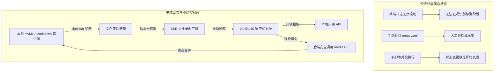
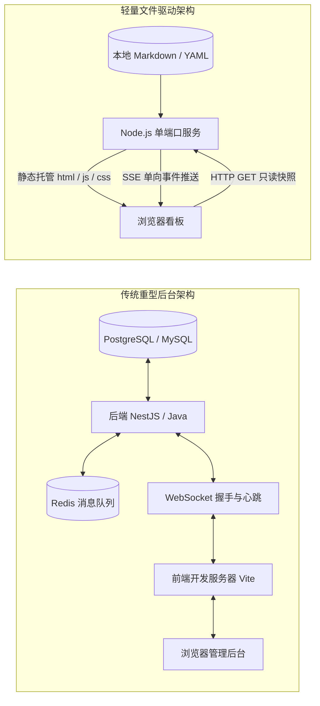
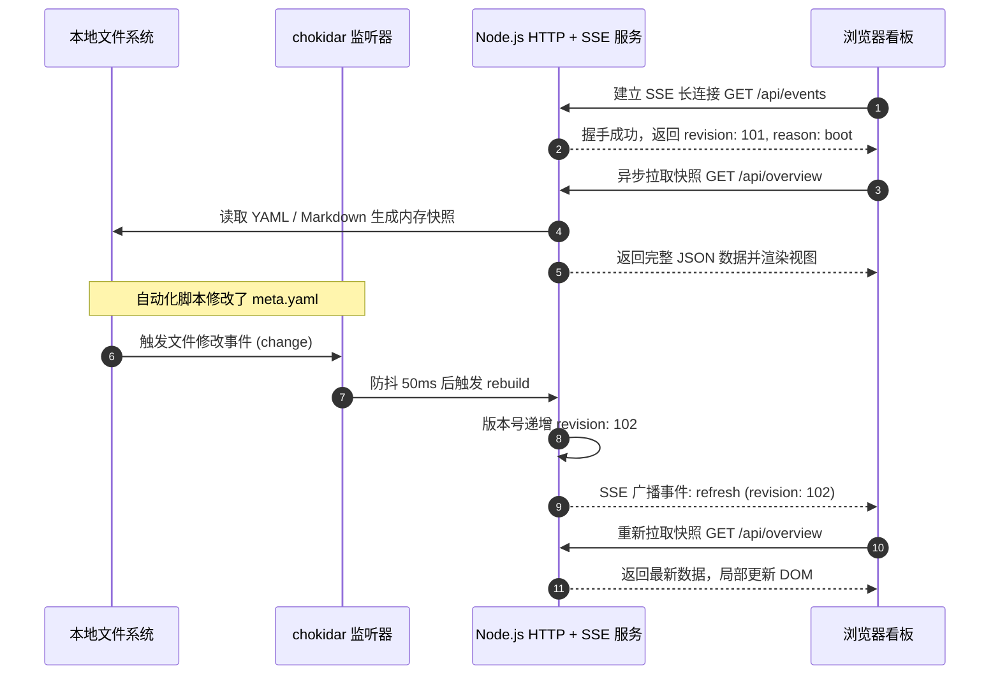
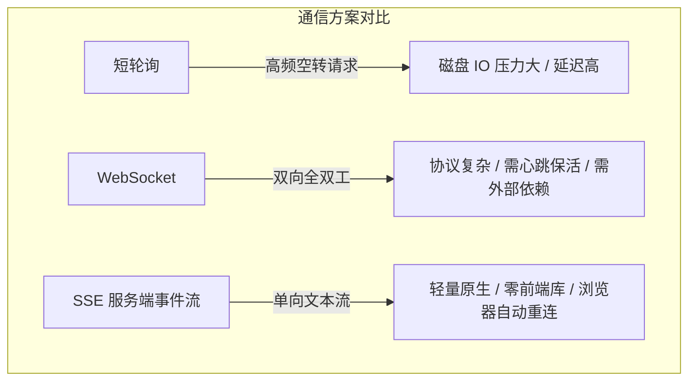
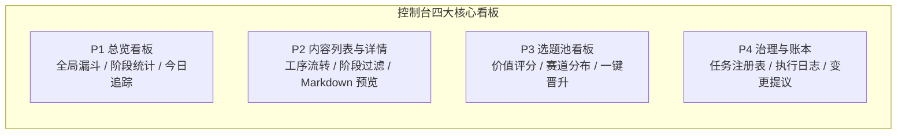

# 第 16 课：本地可视化控制台与SSE：零外部依赖的轻量监控与管理看板

自动化流水线启动之后，后台的调度器、爬虫、音频生成和录屏脚本都在静默运行。终端窗口里滚动着成百上千行日志。如果离开屏幕去冲一杯咖啡，回来时很难快速分辨当前到底卡在哪个环节：是文案还在起草，还是配音生成完毕等待人工审核，亦或是选题池里的候选话题已经耗尽。

在纯命令行环境下，为了查看流水线状态，通常需要手动执行多条查看命令，或者在文件管理器里一层层翻找各个目录下的元数据。这种黑盒状态不仅增加了日常巡检成本，也使得多任务协作变得迟钝。



解决这个方案不需要引入庞大复杂的前后端工程。我们可以搭建基于服务端事件流（Server-Sent Events，SSE）的轻量控制台。在零外部数据库、零繁重构建的前提下，它能把文件状态秒级同步到浏览器。

## 1. 技术选型：为什么是原生 Node.js 与 SSE？

为自动化系统做可视化时，很多人习惯沿用企业级技术栈。比如前端起 Vite 工程，后端用 NestJS 或 SpringBoot。中间再挂上 PostgreSQL 数据库、Redis 队列、WebSocket 与 Nginx 代理。

对于个人或小团队的本地自动化系统，这套传统方案会带来沉重的维护负担。

### 1.1 传统全栈管理后台的维护负担

传统的全栈后台系统建立在多进程、中心化数据库与双向通信的基础之上。在本地开发环境下，这套体系存在四个明显缺陷：

第一是环境脆弱与启动繁琐。为了打开一个监控页面，机器上需要常驻数据库容器、后端 API 进程和前端开发服务器。如果某天修改了数据表结构，还需要运行数据库迁移脚本。一旦跨机器迁移或者重装系统，环境配置往往需要耗费数小时。

第二是数据冗余与状态分裂。自动化流水线的真实产物和元数据本来就保存在磁盘文件（如 `meta.yaml` 和 `backlog.yaml`）中。如果在后台数据库中再存一份相同的状态，就必须编写大量的数据同步和双写校验逻辑。当磁盘文件被外部脚本或人工修改时，数据库无法及时感知，控制台展示的界面就会与磁盘真实状态脱节。

第三是资源开销过大。基于 Node.js 原生模块的轻量服务，内存占用通常在 30MB 以内。如果引入容器、数据库与 Java 虚拟机，会长期占用数个 G 的内存。这会挤占视频渲染和音频合成等核心生产算力。

第四是网络与端口冲突。前后端分离需要占用两个以上的端口，容易遇到跨域资源共享（CORS）限制。当本地其他服务占用了特定端口时，还需要反复修改端口配置和代理规则。



如果启动控制台时在终端看到 `Error: listen EADDRINUSE: address already in use :::5170` 的报错，说明上一个控制台进程尚未完全退出或端口被占用。排查时可以通过 `lsof -i :5170` 查找占用进程的 PID 并执行清理，也可以在启动脚本中加入端口自动探测机制。

### 1.2 单端口极简架构方案

为了彻底摆脱环境维护的泥潭，本地控制台应当追求极简的单端口设计。

整套系统只需要一个 Node.js 进程，同时承担三个职责：
1. 静态文件托管：直接向浏览器提供纯 HTML、CSS 和 JavaScript 文件，无需在本地运行独立的前端构建服务器。
2. 只读数据接口：提供 `GET /api/overview`、`GET /api/contents` 等轻量路由，按需读取磁盘中的 YAML 和 Markdown 文件，组装成 JSON 快照返回。
3. 服务端事件广播：维持一条长连接通道，在本地文件发生变化时向所有打开的浏览器标签页发送刷新通知。

这种架构的优势是开箱即用。代码库被克隆到任何安装了 Node.js 环境的机器上之后，只需要运行 `node server.js` 或者 `npm run console`，就可以在 `http://localhost:5170` 访问全部看板，没有安装数据库和配置连接池的要求。

系统的真实数据始终只存在于文件系统之中。控制台本身是一个纯粹的无状态投影仪，任何时候关闭控制台进程，都不会丢失任何生产数据；重启控制台后，页面展示的内容依然与磁盘文件完全吻合。

## 2. 数据流架构：只读快照与 SSE 被动刷新

确定了单端口架构之后，核心设计问题在于数据如何在后端与前端之间流转。

系统的数据流遵循纯只读快照与被动刷新原则。前端看板不维护自己的业务数据库，也不通过主动定时高频轮询去探测后端状态。



### 2.1 读路由设计与内存快照生成

控制台后端暴露的读路由全部设计为幂等的只读接口。

主要包含以下四类只读数据路由：
- `GET /api/overview`：汇总当前流水线各阶段的内容数量、今日生产追踪、治理任务执行概览以及系统警报列表。
- `GET /api/contents`：返回所有已立项内容的列表元数据，包含阶段标签、标题、创建时间、排期与发布状态。
- `GET /api/backlog`：返回当前选题池的总账数据，包含所有候选选题的评分、分类标签、赛道归属以及全局推荐指针。
- `GET /api/harness`：返回治理系统的任务注册表状态、近期运行账本记录以及等待人工审核的变更提议。

当客户端发起请求时，后端服务直接调用解析函数扫描对应的磁盘路径，读取目标文件的内容并将其格式化为标准的 JSON 响应。

为了提升吞吐量并减少重复的文件磁盘读取，后端可以维护一个基于版本的内存快照对象。只要底层文件没有变动，内存快照直接复用；一旦文件变动，快照标记为过期并触发重建。

### 2.2 为什么放弃主动轮询与 WebSocket

在实现前端数据与后端状态同步时，常见的技术路径有短轮询、长轮询、WebSocket 以及 SSE。

短轮询是在前端设置定时器，每隔一两秒向后端发送一次 HTTP 请求拉取最新数据。这种方式实现最简单，但缺点很明显：在绝大部分时间内，本地文件根本没有变化，成百上千次无效请求在白白消耗 CPU 时间与磁盘 I/O。如果为了省资源把轮询间隔拉长到十秒，那么流水线状态变化在界面上的反馈就会产生明显的滞后感。

WebSocket 支持双向通信。但建立 WebSocket 需要专门的协议握手、心跳维持、连接保活和复杂的状态机管理。在 Node.js 中往往需要引入额外的第三方依赖库。最重要的是，控制台的前端对后端的需求绝大多数时候是单向的数据广播，并不需要长连接上的高频上行通信。

服务端事件流（Server-Sent Events，SSE）是解决这类场景的最优解：
1. 协议轻量：SSE 基于标准 HTTP 协议，客户端发起普通 GET 请求并带上 `Accept: text/event-stream` 请求头，服务端保持连接不关闭，按流式文本格式向客户端逐行推送数据。
2. 原生支持：现代浏览器内置了 `EventSource` API，无需引入任何前端框架或客户端通信库。
3. 天然重连：当网络波动或服务端短暂重启导致连接断开时，浏览器的 `EventSource` 会自动发起重连，并在重连请求中通过 `Last-Event-ID` 携带上次接收到的消息位点。



### 2.3 基于 chokidar 的文件感知与被动广播

在本系统中，SSE 通道专门用来传递轻量的通知信号，具体数据由前端按需发起只读请求获取。

数据传输的分工非常清晰：
- SSE 通道负责传递极小的控制信号，例如 `{ event: "refresh", data: { revision: 102, reason: "fs" } }`。
- 具体的业务数据依然走标准的 HTTP REST API 拉取。

这种被动刷新机制的运转流程由本地文件监听器驱动。使用 Node.js 的文件监听库 `chokidar` 对工作目录下的关键路径进行监控：
- `content/` 目录：监听所有单条内容的 `meta.yaml`、文案文件以及生成的音视频资产。
- `content/_backlog/backlog.yaml`：监听选题池总账文件。
- `harness/tasks.md` 与 `harness/logs/`：监听治理任务定义与执行账本。
- `dashboard.md`：监听派生看板文件。

当 `chokidar` 捕获到文件的创建、修改或删除事件时，后端内部维护的 `revision` 版本号递增，随后 SSE 中心遍历当前所有活跃的客户端连接，逐一写入刷新事件。浏览器收到事件后，检查新的版本号是否大于本地缓存版本，如果大于则立即触发一次只读 API 的异步请求，更新页面展示。

如果在 SSE 连接建立后，浏览器控制台频繁打印 `net::ERR_INCOMPLETE_CHUNKED_ENCODING` 或连接立即断开，排查重点是服务端响应头是否缺少 `Cache-Control: no-cache`、`Content-Type: text/event-stream` 与 `Connection: keep-alive`，以及中间是否存在启用了响应缓冲的反向代理。

## 3. 快写路由设计：一切写操作收敛到 CLI

控制台不仅需要展示流水线状态，还承载了部分人工介入的操作。例如在审核通过后点击放行、打回不合格的物料、手动提升某个选题的生产优先级，或者批准治理系统的配置修改提议。

在设计这些交互按钮的后端接口时，存在一个重要的安全与架构红线：严禁后端服务直接修改文件系统。

```mermaid
flowchart TD
    subgraph 危险的直接写入
        BTN1[前端点击审核通过] --> ROUTE1[POST /api/review]
        ROUTE1 -->|fs.writeFileSync| YAML1[直接覆盖 meta.yaml]
        YAML1 -.破坏状态机校验.- ERR1[产生脏数据 / 状态不一致]
    end

    subgraph 收敛到 CLI 的安全回路
        BTN2[前端点击审核通过] --> ROUTE2[POST /api/actions/review]
        ROUTE2 -->|参数白名单校验| SAFE[校验 slug 与 decision]
        SAFE -->|execFile 安全调用| CLI[media review 命令]
        CLI -->|领域状态机计算| WRITE[原子写入 meta.yaml 与总账]
        WRITE -->|触发文件修改| WATCH[chokidar 捕获变动]
        WATCH -->|广播版本递增| SSE_PUSH[SSE 推送 refresh 事件]
        SSE_PUSH -->|拉取最新快照| UI_UPDATE[前端界面自动重绘]
    end
```



### 3.1 前端操作意图与动作路由

控制台界面上的人工操作通常集中在以下四种场景：
1. 内容审核判定：对处于 `review` 状态的内容执行 `approved`（通过）、`rework`（打回重做）或 `rejected`（废弃）。
2. 选题优先级调度：将选题池中某个特定的候选选题标记为 `next_up`，优先进入下一轮生产。
3. 选题立项晋升：手动将选题池中的某个条目转化为实际的内容目录，生成对应的 `meta.yaml`。
4. 治理提议应用：针对治理任务生成的修改提议，确认合并或归档。

在后端，这些操作被统一定义在 `/api/actions/*` 路径下，采用 POST 方法提交。

### 3.2 严禁后端直接写文件

为什么后端动作路由绝不能使用 `fs.writeFileSync` 直接修改磁盘上的 YAML 文件？

原因在于第 11 课中确立的状态机约束。修改一条内容的状态不是孤立地修改某个文件中的一个字符串，它伴随着一系列严格的业务规则校验：
- 状态转移合法性检查：只有处于 `review` 状态的内容才能转为 `approved`，不能跳过工序。
- 跨文件事务一致性：内容状态变更的同时，往往需要同步更新 `content/_backlog/backlog.yaml` 中的流转指针，并重新编译 `dashboard.md`。
- 审计日志记录：每一次状态修改都需要记录操作人、时间戳和变更原因。

如果后端的每个路由各自实现一套文件读写逻辑，很快就会与命令行工具 `media` 发生逻辑分叉，破坏单一真实源（SSOT）架构。

后端动作路由的职责仅限于参数校验与转发。在接收到前端请求后，后端服务对入参进行严格的类型与格式检查，组装成参数数组，通过 Node.js 原生的 `child_process.execFile` 调用 `media` 命令行工具。

使用 `execFile` 而非 `exec` 可以有效防范命令注入风险，参数作为独立字符串数组传递给操作系统，不经过 Shell 解释器解析。

```javascript
// 后端动作执行封装示例
import { execFile } from 'node:child_process';
import path from 'node:path';

export function runMediaCli(rootDir, args) {
  return new Promise((resolve, reject) => {
    const cliPath = path.join(rootDir, 'tools/console/packages/cli/dist/index.js');
    execFile('node', [cliPath, ...args], { cwd: rootDir, timeout: 15000 }, (error, stdout, stderr) => {
      if (error) {
        return resolve({
          success: false,
          exitCode: error.code || 1,
          stdout: stdout.toString(),
          stderr: stderr.toString(),
        });
      }
      resolve({
        success: true,
        exitCode: 0,
        stdout: stdout.toString(),
        stderr: stderr.toString(),
      });
    });
  });
}
```

如果调用动作接口时收到 `500 Internal Server Error` 且日志提示 `spawn node ENOENT` 或 CLI 执行超时，通常是因为执行路径未对齐或命令行工具未完成预编译。排查时应先确保项目在本地已完成构建，并在执行参数中配置合理的超时限制。

### 3.3 写入到视图自动更新的完整回路

通过将写操作收敛到 CLI，系统形成了完整的数据流回路：
1. 用户在浏览器中点击通过审核按钮。
2. 前端向 `/api/actions/review` 发送 POST 请求。
3. 后端接收请求，校验参数合法性，调用 `media review --slug 2026-06-25-ai-coding --decision approved`。
4. `media` CLI 执行领域状态机逻辑，原子更新目标 `meta.yaml` 并重新编译 `dashboard.md`。
5. CLI 进程正常退出，后端向前端返回 HTTP 200 成功响应。
6. 底层文件被修改，`chokidar` 监听到文件变化，触发防抖后使 `revision` 递增。
7. 后端 SSE 中心向所有连接的客户端推送 `refresh` 事件。
8. 浏览器收到 `refresh` 事件，自动重新请求 `/api/overview` 与 `/api/contents`。
9. 看板视图自动更新，审核通过的内容平滑移动到就绪队列中。

在这个过程中，前端无需在收到 API 响应后手动写复杂的 DOM 状态修补逻辑，一切视图渲染均以磁盘最新快照为准。

## 4. 提示词引导实战：驱动 AI 零依赖构建看板

在掌握了核心架构之后，实际开发中不需要从零手写每一行样板代码。可以通过精准的结构化提示词，驱动 AI 编程助手高效生成高质量、零外部多余依赖的控制台工程。

这一过程分为三个步骤：
第一步，构建 Node.js 原生 HTTP 与 SSE 事件广播服务；
第二步，构建 Vanilla JS 响应式单页只读看板；
第三步，编写自愈提示词处理高频文件抖动与断线指数退避重连。

### 4.1 提示词 1：构建 Node.js 原生 HTTP 与 SSE 广播服务

第一步的目标是让 AI 构建一个极简的后端服务器。要求服务具备静态托管能力、提供只读快照接口，并基于 `chokidar` 建立 SSE 广播机制。

```markdown
你是一名资深 Node.js 全栈工程师。请为本地自动化流水线编写一个轻量级控制台服务。

【技术约束】
1. 语言与运行时：Node.js 18+ 原生 ESM 模块。
2. 依赖限制：仅允许引入 chokidar 进行文件监听与 js-yaml 进行 YAML 解析，其余全部使用 Node.js 原生模块（http、fs、path、child_process）。严禁引入 Express/NestJS 等重型框架。
3. 单端口运行：默认监听 5170 端口，同时托管 public/ 目录下的静态文件与 /api/* 接口。

【核心功能实现】
1. 静态托管：
   - 根路径 / 默认返回 public/index.html。
   - 正确处理 .html、.js、.css、.svg、.json 等静态资源的 Content-Type。
2. 只读数据接口：
   - GET /api/overview：解析 content/ 目录与 content/_backlog/backlog.yaml，统计各阶段内容数量。
   - 接口均返回标准 JSON 结构：{ ok: true, data: ..., timestamp: "..." }。
3. SSE 服务端事件流中心：
   - 实现 SseHub 类，暴露 GET /api/events 路由。
   - 连接建立时设置响应头：Content-Type: text/event-stream、Cache-Control: no-cache、Connection: keep-alive。
   - 连接成功时立即发送初始事件：event: refresh, data: { revision: currentRevision, reason: "boot" }。
   - 维护 Set<Client> 集合，当客户端断开连接（req 触发 close 事件）时必须正确清理，防止内存泄漏。
   - 提供 broadcast(event, data) 方法向所有在线客户端推送消息。
   - 启动定时心跳，每 25 秒广播一次 ping 事件。
4. 文件变动感知与版本驱动：
   - 使用 chokidar.watch 监听 content/ 目录与 backlog.yaml。
   - 忽略隐藏文件与 node_modules 目录。
   - 捕获变动后，使用 50ms 防抖计时器触发内存快照重建，将内部 revision 版本号加 1，并调用 sseHub.broadcast("refresh", { revision, reason: "fs" })。

请输出完整、生产可用且注释清晰的 server.js 与 sse.js 代码。
```

AI 依据该提示词生成的服务端核心骨架如下：

```javascript
// server.js 核心骨架
import http from 'node:http';
import fs from 'node:fs';
import path from 'node:path';
import { SseHub } from './sse.js';
import { startWatcher } from './watcher.js';

const PORT = 5170;
const ROOT_DIR = process.cwd();
const PUBLIC_DIR = path.join(ROOT_DIR, 'public');

const sseHub = new SseHub();
let currentRevision = 1;

// 启动文件监听
startWatcher(ROOT_DIR, () => {
  currentRevision++;
  sseHub.broadcast('refresh', { revision: currentRevision, reason: 'fs' });
});

const MIME_TYPES = {
  '.html': 'text/html; charset=utf-8',
  '.js': 'application/javascript; charset=utf-8',
  '.css': 'text/css; charset=utf-8',
  '.json': 'application/json; charset=utf-8',
  '.svg': 'image/svg+xml',
};

const server = http.createServer(async (req, res) => {
  const url = new URL(req.url, `http://${req.headers.host}`);

  // 1. SSE 事件通道
  if (url.pathname === '/api/events') {
    return sseHub.handleConnection(req, res, currentRevision);
  }

  // 2. 只读数据 API
  if (url.pathname === '/api/overview') {
    res.writeHead(200, { 'Content-Type': 'application/json; charset=utf-8' });
    const overviewData = { ok: true, revision: currentRevision, data: { total: 12, inReview: 2 } };
    return res.end(JSON.stringify(overviewData));
  }

  // 3. 静态文件托管
  let filePath = path.join(PUBLIC_DIR, url.pathname === '/' ? 'index.html' : url.pathname);
  if (fs.existsSync(filePath) && fs.statSync(filePath).isFile()) {
    const ext = path.extname(filePath).toLowerCase();
    res.writeHead(200, { 'Content-Type': MIME_TYPES[ext] || 'application/octet-stream' });
    return fs.createReadStream(filePath).pipe(res);
  }

  res.writeHead(404, { 'Content-Type': 'text/plain; charset=utf-8' });
  res.end('Not Found');
});

server.listen(PORT, () => {
  console.log(`[Console] Server running at http://localhost:${PORT}`);
  sseHub.startHeartbeat();
});
```

### 4.2 提示词 2：构建 Vanilla JS 响应式单页只读看板

第二步的目标是构建原生前端单页应用。界面不依赖 Webpack、Vite、React 或 Vue 等构建工具。仅靠原生 HTML、CSS 和 JavaScript，即可实现 Tab 切换、数据渲染与 SSE 监听。

```markdown
你是一名资深前端工程师。请为本地自动化控制台设计一个零外部框架依赖的单页看板（Vanilla JS SPA）。

【技术约束】
1. 运行环境：现代浏览器（Chrome / Edge / Safari）。
2. 零外部依赖：纯原生 HTML5 + CSS3 + ES6 原生 JavaScript。严禁引入 React/Vue/jQuery/Bootstrap 或外部 CDN 脚本。
3. 纯只读渲染：数据全部通过 fetch 异步获取，严禁在前端本地维护持久化业务状态。

【页面结构与视图设计】
1. 页面布局：
   - 顶部导航栏：显示项目标题、全局 SSE 连接状态指示灯（绿色在线、黄色重连、红色离线）、最新数据版本号与刷新时间。
   - 左侧 Tab 切换栏：包含 总览（Overview）、内容列表（Contents）、选题池（Backlog）、系统治理（Governance）四大视图。
   - 主内容区：根据选中的 Tab 动态渲染对应的数据卡片与表格。
2. 核心交互与数据绑定：
   - 实现全局 Store 管理器，保存当前选中的 Tab 与最新的快照缓存。
   - 实现 Tab 切换机制，切换时不刷新页面，仅触发局部 DOM 重绘。
   - 编写通用的 HTML 模板渲染函数，根据 JSON 数据动态生成阶段统计卡片（待制作、制作中、待审核、已发布）。
3. SSE 客户端集成：
   - 在页面加载时初始化 window.EventSource 连接 /api/events。
   - 监听 refresh 事件：对比事件数据中的 revision 与本地 Store 的 revision。当服务端版本号更高时，自动重新触发当前视图的 fetch 接口，无感刷新界面。
   - 监听 ping 心跳事件，更新界面的最后心跳时间戳。

请输出结构清晰、包含现代暗色风格 CSS 样式的 public/index.html 与 public/app.js 代码。
```

AI 生成的前端核心客户端调度逻辑如下：

```javascript
// public/app.js 核心逻辑
class DashboardApp {
  constructor() {
    this.currentTab = 'overview';
    this.revision = 0;
    this.initElements();
    this.bindEvents();
    this.initSse();
    this.loadCurrentTab();
  }

  initElements() {
    this.statusDot = document.getElementById('status-dot');
    this.statusText = document.getElementById('status-text');
    this.revisionText = document.getElementById('revision-text');
    this.contentArea = document.getElementById('tab-content');
  }

  bindEvents() {
    document.querySelectorAll('.nav-tab').forEach((tab) => {
      tab.addEventListener('click', (e) => {
        document.querySelectorAll('.nav-tab').forEach((t) => t.classList.remove('active'));
        e.target.classList.add('active');
        this.currentTab = e.target.dataset.tab;
        this.loadCurrentTab();
      });
    });
  }

  initSse() {
    const eventSource = new EventSource('/api/events');

    eventSource.onopen = () => {
      this.statusDot.className = 'dot online';
      this.statusText.textContent = '实时连接正常';
    };

    eventSource.addEventListener('refresh', (e) => {
      const payload = JSON.parse(e.data);
      if (payload.revision > this.revision) {
        this.revision = payload.revision;
        this.revisionText.textContent = `Rev: ${this.revision}`;
        this.loadCurrentTab();
      }
    });

    eventSource.addEventListener('ping', () => {
      this.statusDot.classList.add('pulse');
      setTimeout(() => this.statusDot.classList.remove('pulse'), 1000);
    });

    eventSource.onerror = () => {
      this.statusDot.className = 'dot offline';
      this.statusText.textContent = '连接中断，重连中...';
    };
  }

  async loadCurrentTab() {
    if (this.currentTab === 'overview') {
      const res = await fetch('/api/overview');
      const json = await res.json();
      this.renderOverview(json.data);
    }
  }

  renderOverview(data) {
    this.contentArea.innerHTML = `
      <div class="kpi-grid">
        <div class="kpi-card"><h3>总内容数</h3><p class="num">${data.total || 0}</p></div>
        <div class="kpi-card"><h3>待审核</h3><p class="num warn">${data.inReview || 0}</p></div>
      </div>
    `;
  }
}

window.addEventListener('DOMContentLoaded', () => new DashboardApp());
```

### 4.3 提示词 3：自愈提示词处理高频抖动与断线重连

在生产环境中，系统可能遇到两类异常：
1. 本地脚本批量生成音视频切片或原子写入文件时，短时间内产生数十次文件变更事件，导致后端频繁重复计算快照与广播。
2. 浏览器休眠、系统待机或网络断开导致 SSE 连接意外挂起，原生 `EventSource` 默认重连策略可能引发请求风暴。

此时需要使用自愈提示词引导 AI 针对性地加入 50ms 防抖算法与前端指数退避重连机制。

```markdown
我们当前的 Node.js + SSE 看板在实际运行中暴露出两个健壮性问题，请对现有代码进行加固改造：

【问题诊断与复现场景】
1. 文件事件抖动问题：
   - 现象：当执行录屏或批量生成音频时，本地脚本会在 200ms 内连续创建并重命名多个临时文件。
   - 后果：chokidar 触发了 20 次 change 事件，导致服务端连续执行 20 次重量级的快照重建与 SSE 广播，浏览器界面发生肉眼可见的闪烁。
2. SSE 假死与重连风暴问题：
   - 现象：笔记本电脑合盖睡眠唤醒后，浏览器的 EventSource 连接处于假死状态，未收到错误事件也无法接收新广播；当服务端重启时，多个标签页以固定高频发起重连。

【自愈改造要求】
1. 服务端文件防抖（Debounce）改造：
   - 在 watcher.js 中引入 50ms 窗口防抖逻辑。当收到文件变动事件时，重置定时器，只有当 50ms 内无后续文件变动事件时，才统一执行一次 rebuild 与 broadcast。
   - 针对 chokidar 配置 awaitWriteFinish 参数（stabilityThreshold: 300ms, pollInterval: 50ms），确保大文件完全写入磁盘后再触发事件。
   - 针对临时文件（.tmp、.swp、.DS_Store 等）配置过滤规则。
2. 前端 SSE 客户端连接加固：
   - 封装 RobustEventSource 类，支持基于指数退避算法（Exponential Backoff）的自动重连。
   - 重连延迟基数为 1 秒，最大退避上限为 30 秒，每次重连失败将延迟时间翻倍，并加入 10% 到 20% 的随机抖动（Jitter），防止服务端重启时的并发惊群效应。
   - 增加心跳超时探测机制：如果超过 45 秒未收到任何事件（包括 ping），主动销毁旧连接并重新发起握手。

请输出加固后的 watcher.js 与客户端 RobustEventSource 模块代码。
```

AI 依据自愈提示词生成的加固实现如下：

```javascript
// watcher.js 加固实现
import chokidar from 'chokidar';
import path from 'node:path';

export function startWatcher(rootDir, onDebouncedChange) {
  const watchPaths = [
    path.join(rootDir, 'content'),
    path.join(rootDir, 'content/_backlog/backlog.yaml'),
    path.join(rootDir, 'harness'),
    path.join(rootDir, 'dashboard.md'),
  ];

  const watcher = chokidar.watch(watchPaths, {
    ignored: /(^|[/\\])\..|node_modules|\.tmp$|\.swp$/,
    ignoreInitial: true,
    awaitWriteFinish: {
      stabilityThreshold: 300,
      pollInterval: 50,
    },
  });

  let debounceTimer = null;
  const DEBOUNCE_MS = 50;

  const triggerChange = () => {
    if (debounceTimer) clearTimeout(debounceTimer);
    debounceTimer = setTimeout(() => {
      onDebouncedChange();
      debounceTimer = null;
    }, DEBOUNCE_MS);
  };

  watcher.on('all', (event, filePath) => {
    // 仅响应关心的数据文件
    if (/\.(ya?ml|md|jsonl|png|mp4)$/i.test(filePath)) {
      triggerChange();
    }
  });

  return watcher;
}
```

```javascript
// 前端客户端指数退避加固实现
class RobustEventSource {
  constructor(url, options = {}) {
    this.url = url;
    this.onRefresh = options.onRefresh || (() => {});
    this.onStatusChange = options.onStatusChange || (() => {});
    this.baseDelayMs = 1000;
    this.maxDelayMs = 30000;
    this.retryCount = 0;
    this.heartbeatTimeoutMs = 45000;
    this.heartbeatTimer = null;
    this.es = null;

    this.connect();
  }

  connect() {
    this.cleanup();
    this.onStatusChange('connecting');
    this.es = new EventSource(this.url);

    this.es.onopen = () => {
      this.retryCount = 0;
      this.resetHeartbeat();
      this.onStatusChange('online');
    };

    this.es.addEventListener('refresh', (e) => {
      this.resetHeartbeat();
      try {
        const data = JSON.parse(e.data);
        this.onRefresh(data);
      } catch (err) {
        console.error('SSE JSON 解析异常', err);
      }
    });

    this.es.addEventListener('ping', () => {
      this.resetHeartbeat();
    });

    this.es.onerror = () => {
      this.onStatusChange('offline');
      this.scheduleReconnect();
    };
  }

  resetHeartbeat() {
    if (this.heartbeatTimer) clearTimeout(this.heartbeatTimer);
    this.heartbeatTimer = setTimeout(() => {
      console.warn('SSE 心跳超时，主动重连');
      this.connect();
    }, this.heartbeatTimeoutMs);
  }

  scheduleReconnect() {
    this.cleanup();
    // 计算指数退避延迟并加入随机抖动
    const exponential = Math.min(this.maxDelayMs, this.baseDelayMs * Math.pow(2, this.retryCount));
    const jitter = exponential * (0.1 + Math.random() * 0.1);
    const delay = exponential + jitter;

    this.retryCount++;
    console.log(`将在 ${Math.round(delay)}ms 后尝试第 ${this.retryCount} 次重连`);
    setTimeout(() => this.connect(), delay);
  }

  cleanup() {
    if (this.heartbeatTimer) clearTimeout(this.heartbeatTimer);
    if (this.es) {
      this.es.close();
      this.es = null;
    }
  }
}
```

如果在控制台打开后，发现修改文件后前端偶发性地没有触发刷新，排查路径可以按层级排查：
首先，在服务端打印 watcher 捕获到的原始文件路径，检查文件是否被 `ignored` 正则误杀；
其次，检查前端控制台的 Network 面板，确认 `events` 请求是否返回了 `200` 并且处于 `Pending` 流式传输状态；
最后，如果在多标签页下只有部分页面刷新，检查服务端 `SseHub` 是否在某个客户端报错时中断了广播循环。

## 5. 核心看板视图设计与工程呈现

完成了底层通信与事件广播之后，控制台的前端需要呈现清晰、高信息密度的业务视图。

系统划分出四大核心看板视图，分别对应流水线运营的不同维度。



### 5.1 总览看板：流水线阶段卡片与今日待办

总览看板（Overview）是每天打开控制台后的第一眼视图。它的核心目标是回答一个问题：今天流水线运行到了什么程度，有没有需要人工介入的地方？

总览看板包含三个核心区域：
1. 阶段流转统计卡片：横向排布从 `ideated`、`drafting`、`review`、`approved` 到 `published` 的各阶段内容数量。处于 `review` 状态的卡片采用高亮颜色标出，直观提醒有内容正在等待人工审核。
2. 今日追踪（Daily Trace）：展示今日定时任务的执行日志与耗时，包括外网情报抓取条数、新入池选题数以及自动生成的物料状态。
3. 系统警报列表（Alerts）：展示去抖后的异常提示。例如检测到某个视频文件在 `meta.yaml` 中被引用但磁盘文件缺失，或者某条内容处于待审核状态超过 24 小时未处理。

### 5.2 内容列表与详情看板：流转追踪与 Markdown 渲染

内容列表看板（Contents）用于管理所有已经立项的内容单元。

该看板采用左侧列表、右侧抽屉式详情的设计：
- 列表区域：支持按状态（全部、起草中、待审核、已发布）进行快速过滤，每一行展示作品目录名（Slug）、标题、目标发布渠道、最后更新时间以及当前阶段的徽章。
- 详情抽屉：点击列表某一行后，右侧展开详情面板。面板内异步拉取并渲染该内容目录下的 `script.md` 口播文案，展示生成的音频文件播放控件、视频预览窗口以及 `meta.yaml` 属性表格。
- 操作区域：如果内容处于 `review` 阶段，面板底部提供通过审核与打回重做两个操作按钮。点击按钮后弹出确认框，输入打回原因后调用后端动作接口，由后端转发给 `media review` 执行。

### 5.3 选题池看板：分数排序与赛道分布

选题池看板（Backlog）负责呈现情报抓取与评分系统的输出结果。

看板的核心功能包括：
1. 分数矩阵列表：默认按综合传播力评分（Score）从高到低排序，展示选题的标题、核心卖点。同时标出来源平台（X / Reddit / GitHub / Hacker News）以及所属赛道（源码解读 / AI 实战 / 行业新闻）。
2. 状态标签过滤：区分展示候选待选（idea）、已晋升制作（picked）以及归档（archived）选题。
3. 一键提权与立项：在每条候选选题操作列提供设为下一条（Next Up）与一键晋升（Promote）按钮。点击后直接触发后端安全动作，自动创建内容目录并初始化元数据。

### 5.4 治理看板：任务注册表与待审变更提议

治理看板（Governance）映射的是 `harness/` 目录下的系统自审与资产维护状态。

看板分为上下两个板块：
- 上半部分展示治理任务注册表（Tasks Registry）。表中列出每个治理任务的触发周期、上次执行时间、当前状态以及运行成功率，覆盖复盘分析、对标账号复核与选题池理池等工作。
- 下半部分展示待审变更提议（Proposals）。当治理任务分析出对标账号策略过时或发现相似选题需要合并时，会生成提议报告。看板在此处高亮展示提议的具体差异（Diff），并提供批准应用或忽略归档的操作按钮，让人工在浏览器里就能完成对账号大脑策略的审阅。

## 6. 验收标准与排查清单

在完成控制台的搭建之后，通过以下三个步骤进行端到端的验收验证：

第一步，服务启动与页面加载验证：
在项目根目录下执行 `node server.js`，观察终端输出端口监听日志。在浏览器中打开 `http://localhost:5170`，检查四大看板页面是否能正常切换，顶部状态指示灯是否显示为绿色在线状态。

第二步，SSE 实时被动刷新验证：
保持浏览器控制台页面打开，在终端中使用编辑器手动修改任意一个 `content/*/meta.yaml` 文件中的标题字段并保存。观察浏览器界面是否在 1 秒之内自动更新了对应内容的标题，且整个过程无需手动刷新页面。

第三步，快写路由安全流转验证：
在内容列表页中找到一条处于待审核状态的内容，点击通过审核按钮。检查终端中是否打印出 `media review` CLI 的执行日志，查看磁盘上的 `meta.yaml` 状态是否被原子更新为 `approved`，同时观察前端页面上的状态徽章是否自动同步变为已批准。

在日常运行中，如果遇到常见故障，可对照以下清单进行排查：

1. 浏览器打开后页面空白或报 404 错误：
   检查 `server.js` 中的静态目录路径配置是否正确，确保 `public/` 目录下存在 `index.html`。

2. 修改文件后浏览器毫无反应：
   检查 `watcher.js` 监听的目录路径是否与实际项目结构一致；检查被修改的文件扩展名是否在监听白名单中。

3. 点击操作按钮后报 400 Bad Request：
   检查前端请求体 JSON 格式是否完整，核对 `slug`、`decision` 等字段的拼写是否符合后端白名单规范。

4. 终端提示 `EADDRINUSE` 端口占用：
   使用 `lsof -i :5170` 查找占用该端口的旧进程，执行 `kill -9 <PID>` 释放端口后重新启动服务。
