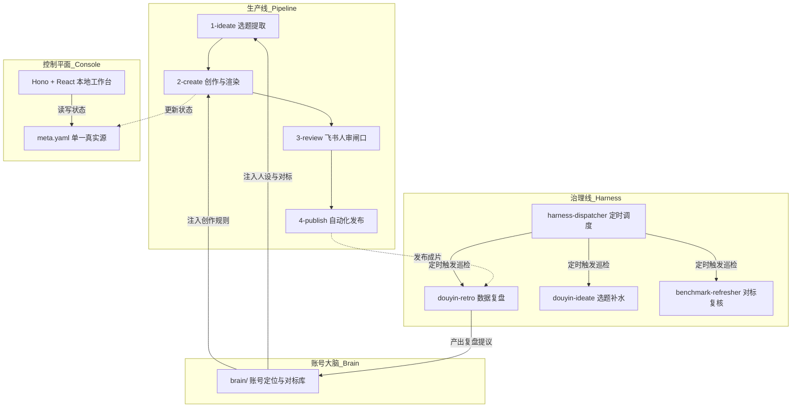
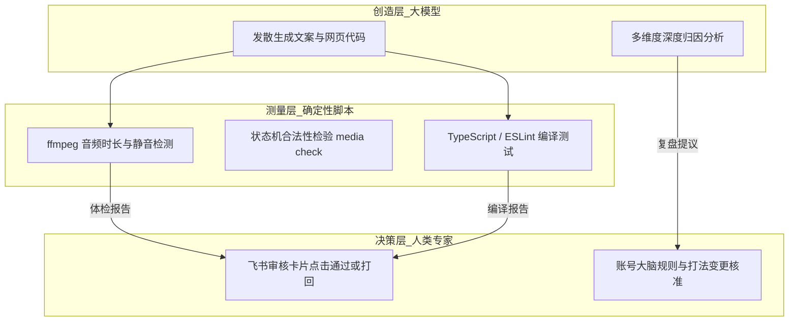
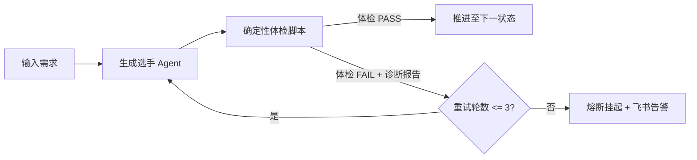
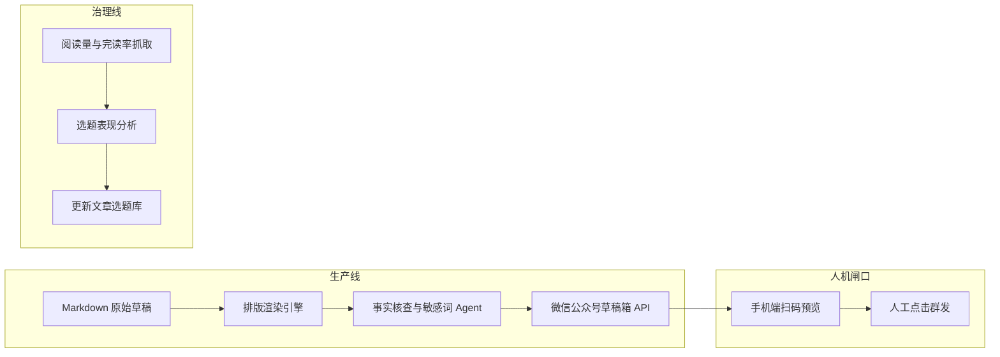
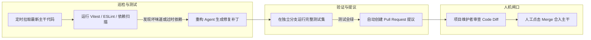
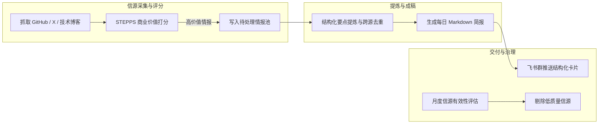

# 第 18 课：AI架构师超级个体心法：从写代码到造系统，一个人就是一支军队

在前面的 17 门课程中，我们从一篇文章的输入开始，逐步搭建起了一套流水线。整套系统包含了脚本提炼、动态网页渲染、分段语音合成、音视频体检、无头录屏、封面生成、飞书人审、自动化发布、数据复盘、选题补水、治理调度与本地可视化看板。

很多开发者在跟着做完整个案例后，会产生一个疑问：换成日常工作中的技术专栏写作、代码质量巡检或者竞品情报追踪，这套方法还能直接用吗？

答案是可以。模型的能力每年都在迭代，开源工具的接口也随时会变动。但状态机设计、双线解耦、裁判分离与真实反馈反哺的架构心法是长期稳定的。

本节我们将复盘整套自媒体流水线的底层架构，提炼出系统设计的三大铁律。接着展示如何将同一套心法迁移到三类典型场景，并给出四步行动清单与三套工程级引导提示词。



图解：左上为单向消费的生产线，右上为周期保养的治理线，左下为提供规则的大脑，右下为状态收敛的控制平面。

---

## 1. 复盘全景：我们究竟搭建了一个怎样的系统？

要把一套系统的方法论迁移到新领域，首先需要清晰拆解它背后的架构支柱与运行数据。

### 1.1 四大支柱全景架构复盘

我们搭建的自媒体流水线由四大支柱构成，每个支柱承担完全独立的系统职责：

1. 支柱 1：生产线（pipeline/）。职责是消费资产、单向向前、严格停在人审。从选题池中拾取一个高分选题，经过文案提炼、网页演示代码生成、分段语音合成、音画质量自动化体检、无头浏览器录屏，最终推送到飞书等待人类确认。生产线的核心原则是绝对不执行不可逆的发布动作，所有成片必须经过人类审批。
2. 支柱 2：治理线（harness/）。职责是保养资产、定时巡检、数据反哺。它不负责生产单条内容，而是定期复盘已发布视频的数据表现、补充选题池的新鲜素材、复核对标账号的打法是否过时。治理线只产出分析报告与变更提议，人工核准后才回写大脑。
3. 支柱 3：账号大脑（brain/）。职责是注入定位、对标基准与人设硬约束。它由一组纯文本文件组成，包括账号定位、对标库、语言风格与安全红线。大脑是整个系统的规则中心，所有生产与治理环节在启动前都必须加载大脑文件。
4. 支柱 4：控制平面（console/）。职责是文件驱动、状态收敛与可视化观察。它由轻量级的 Hono 后端与 React 前端构成，通过服务器发送事件实时感知文件变动，并提供可视化看板与任务触发能力。状态的唯一真相源始终是各个内容目录下的 meta.yaml 文件。

### 1.2 工业级实战数据复盘

在实际运行与迭代过程中，这套流水线积累了一组真实的工程数据：

| 评估维度 | 统计数值 | 工程含义与系统收益 |
|---|---|---|
| 真实内容发布 | 21 条视频 | 覆盖多模型对比、源码解读与架构实操等深度主题 |
| 全自动运转次数 | 26 次完整调度 | 从文章输入到出审卡片推送全流程无人值守 |
| 工程避坑闸口 | 18 处确定性拦截 | 覆盖白屏探测、音轨对齐、TTS 欠费降级等边界条件 |
| 单条内容生产耗时 | 从 150 分钟降至 8 分钟 | 人类只需在选题和出审两个环节做决策 |
| 自动化质检拦截率 | 100% 拦截多音字与音频异常 | 未发生过错音成片直接推送到审批端的情况 |

这 18 处工程避坑闸口是系统高可用性的基石。例如：
- 录屏首帧白屏探测：无头浏览器渲染前端动画时，偶发性出现 DOM 尚未挂载完成就提前录制的情况。录屏脚本在启动前对第一帧像素做纯白判定，如果为白屏则自动等待 500 毫秒重试，解决黑白屏坏片问题。
- 音视频 1.5 秒时钟对齐：动态网页中的 CSS 动画与独立合成的音频切片之间存在细微的时钟漂移。系统在配置中显式增加时间偏移量，让口播语音与动画动作保持帧级同步。
- TTS 余额探针：MiniMax 接口在余额耗尽时会返回 1008 错误码。如果直接进行批量合成，会导致整个生产线崩溃中断。系统在批量合成前先发单段探针请求，遇到 1008 错误时将状态安全标记为 drafting 待配音，并推送充值提醒，而不是抛出异常崩溃。

如果你在运行流水线时发现录屏脚本在特定分辨率下偶发卡死，多半是无头浏览器启动参数中缺少了禁用 GPU 沙箱的配置。你需要在脚本启动项中追加 --no-sandbox 参数。

### 1.3 角色跃迁：从单步搬运工到系统总设计师

许多人使用 AI 的方式，是在浏览器窗口里写一段提示词拿一段文案，再把文案手动复制到配音软件，接着打开剪辑软件对齐音轨。这种模式把人当成了各个软件之间的肉体数据总线。

METR 在 2024 年针对资深开发者开展了随机对照试验。实验表明，在缺乏自动化验证的环境下，频繁介入单步手动修补，整体任务耗时反而增加了 19%。

Norbert Wiener 在控制论中提出了监督控制理论：人类应当退回到监督者的位置，负责设定业务目标和裁决异常状态，把重复的测量、转换和执行交给确定性程序。

从单步搬运工跃迁到系统架构师，核心在于工作重心的转移：
- 搬运工每天的工作：反复调整单次提示词，祈祷模型输出完美结果；在各个软件之间手动复制粘贴数据。
- 架构师每天的工作：定义清晰的输入输出契约，编写确定性的体检与断言脚本，设计状态机流转规则，在关键节点设置人机审批闸口。

---

## 2. AI 时代的系统设计三大铁律

基于自媒体流水线的实战经验，我们可以提炼出三条适用于所有 AI 自动化系统的底层设计铁律。

### 2.1 铁律 1：极简技术栈（文件即存储，Markdown 即契约，CLI 即接口）

构建个人或小团队的自动化系统，最忌讳的是为了炫技引入沉重的外部基础设施。例如为了存几十个选题而部署一套分布式数据库，或者为了任务流转引入复杂的中间件。

为什么必须坚持极简技术栈？
1. 纯文本文件具备天然的版本管理优势。所有的配置、文案、状态和日志都是 Markdown 或 YAML 格式，可以用 Git 完整记录每一次变更，遇到异常可以直接回滚。
2. 命令行工具（CLI）是人类、脚本和 AI 之间最通用的交互接口。一个设计良好的 CLI 工具，人类可以在终端直接运行，定时脚本可以轻松调用，AI 也可以通过查看 --help 参数按需学习如何使用。
3. 相比于静态加载的协议扩展（如 MCP），CLI 具备懒加载的优势。模型不需要在一开始把所有工具的完整参数结构塞满上下文窗口，只有在需要执行特定操作时才调用帮助命令，降低了 token 消耗与上下文污染风险。

```bash
# 良好的 CLI 契约示例：状态查询与翻转统一收敛
media status content/2026-06-25-agentic-workflow
media advance content/2026-06-25-agentic-workflow --to reviewing
media check --all
```

如果你在编写 CLI 包装脚本时把几十页说明全量塞入系统提示词，会导致模型上下文迅速膨胀并出现指令遗忘。应当改为只给基础命令清单，由模型在需要时调用 --help 查看子命令参数。

### 2.2 铁律 2：清晰的信任边界（创造归模型，测量归脚本，决策归人类）

在大模型系统中，把所有事情都交给 AI 是一种危险的设计。大模型具备出色的发散理解与内容生成能力，但存在概率性幻觉与计算不稳定性。脚本没有审美，但在数值计算、规则匹配和格式校验上拥有百分之百的确定性。人类精力有限，但在商业方向、价值导向和安全合规上承担最终责任。

三权分立的设计模式如下：
1. 创造归模型：口播文案提炼、动态演示网页代码编写、复盘归因分析。这些任务需要语义理解和发散创造。
2. 测量归脚本：音频停顿与截断检测（ffmpeg）、状态机合法性校验（media check）、代码静态分析（ESLint）。这些任务必须由确定性代码执行，给出精确的数值结果。
3. 决策归人类：选题立项确认、最终发布审批、账号大脑规则修改。涉及外部发布和核心资产变更的操作，必须由人类点击确认。



图解：左边大模型负责创造生成，中间确定性脚本负责严格测量，右边人类专家负责终审裁决。

在实现质检环节时，不要赋予质检 Agent 直接修改正文的权限。如果让裁判一边挑毛病一边改代码，往往会导致它修好了一个语法错误却引入了另一个逻辑漏洞。正确的做法是让质检 Agent 只输出包含行号和修改建议的诊断报告，由生成选手读取报告进行针对性修复。

### 2.3 铁律 3：自愈机制优于神仙提示词

很多人花费大量时间去调试一段长达上千字的提示词，期望模型能够一次性输出完全符合预期的结果。然而，随着任务复杂度的上升，单次调优的边际效益会迅速递减。

为什么自愈回路优于单次生成？
1. 承认模型的随机性是工程落地的第一步。任何复杂任务都很难保证单次生成成功率达到 100%。
2. 构建自愈回路能够以极低的成本获得极高的系统可靠性。单次生成的成功率按 70% 计算。通过引入客观体检脚本与带具体改法的错误回传，允许系统最多进行 3 轮自我修复，整体任务的成功率可以提升至 97.3%（1 减去 0.3 的 3 次方）。
3. 必须配备严格的熔断机制。自愈循环必须限制最大轮数（通常设为 3 轮）。当 3 轮之后仍然无法通过体检时，系统应主动挂起并向飞书推送告警，等待人类介入排查，防止陷入死循环消耗 API 配额。



图解：左边生成后进入确定性体检，成功则流转，失败且在 3 轮内则携带诊断报告回传修复，超过 3 轮则熔断报警。

如果你发现自愈循环在特定用例上反复修改同一个错误，多半是体检脚本输出的报错信息过于模糊，模型无法定位具体问题。你需要在体检输出中提供精确的文件路径、失败原因与预期格式。

说白了，能用三行脚本搞定的检查，就别指望用一段提示词让模型猜。

---

## 3. 跨场景迁移实战指南：一套心法拓展三类场景

这套包含极简技术栈、清晰信任边界与自愈回路的心法，不仅适用于短视频制作，还可以直接迁移到许多其他日常业务场景中。

### 3.1 场景实战 1：微信公众号与技术专栏长文自动化写作与发布

在长文写作与专栏运营场景中，作者经常需要在 Markdown 撰写、排版适配、事实核查、封面制作与草稿箱上传之间反复切换。

我们可以使用相同的双线模型来搭建专栏流水线：



图解：上方为从草稿到微信草稿箱的生产线，中间为手机端人工预览终审，下方为基于阅读数据的治理反哺。

业务迁移映射细节：
1. 生产线设计：输入一篇技术草稿，排版工具自动将其转换为适配微信样式的 HTML，配图脚本自动提取核心概念生成信息图。事实核查 Agent 逐段检查代码示例与引用链接的可访问性。体检通过后调用微信公众平台 API 将内容推送到草稿箱。
2. 人机闸口设计：系统绝对不调用正式群发接口，而是向飞书推送草稿箱就绪通知。作者在手机端微信公众平台中打开预览，确认排版与阅读体验无误后，手动点击群发。
3. 治理线设计：每周定时抓取历史文章的阅读量、在看数与分享率，根据传播数据更新选题库中的受众偏好标签。

如果公众号发布脚本直接调用群发接口，一旦出现样式溢出或排版错乱将无法挽回。因此必须严格限制自动化脚本的权限边界为草稿箱写入。

### 3.2 场景实战 2：开源项目代码质量巡检与自动化重构提议

在维护开源项目或大型代码库时，代码规范检查、依赖升级与废弃 API 重构往往占据大量精力。

我们可以将双线架构应用到代码治理流程中：



图解：左边定时执行代码扫描与补丁生成，中间在隔离分支验证测试，右边由人类维护者审查 Diff 并确认合并。

业务迁移映射细节：
1. 生产线设计：巡检脚本在深夜自动拉取项目主干，执行静态检查与依赖漏洞扫描。当检测到可自动修复的问题时，重构 Agent 在独立的 feature 分支上修改代码并运行测试。测试通过后，自动提交 Pull Request，并在 PR 描述中详细列出重构原因、变更范围与测试覆盖率。
2. 架构防线设计：系统无权直接向 main 分支推送代码，必须通过 PR 形式提交。核心维护者在 GitHub 界面上查看 Diff，点击 Merge 或关闭。
3. 治理线设计：月度统计各类代码坏味道的出现频次，自动生成 ESLint 规则加固提议与团队开发规范更新建议。

如果自动化重构脚本直接向主分支推送提交，可能会绕过代码评审机制引入潜在的破坏性变更，应当始终要求通过 PR 形式向维护者交付。

### 3.3 场景实战 3：行业竞品动态追踪与每日智能内参生成

在技术调研与商业分析场景中，人工每天浏览大量外网资讯耗时且容易遗漏核心信息。

我们可以构建一个自动化的情报流水线：



图解：左边多源抓取并打分入池，中间提炼要点生成简报，右边推送到群聊并由治理线维护信源质量。

业务迁移映射细节：
1. 生产线设计：定时任务抓取关注的 GitHub 仓库 Release 记录、技术领袖社交动态与官方技术博客。使用预设的多维评分提示词过滤无实质内容的营销水文。将高价值情报提炼为包含核心结论、技术影响与原文链接的结构化摘要，生成每日内参。
2. 交付与审批设计：早上 8 点通过飞书 Webhook 推送内参卡片，团队成员点击卡片中的按钮可以对情报进行标记或一键转为立项任务。
3. 治理线设计：每月统计各信源提供有效情报的比例，自动降低低质量信源的抓取权重，保持情报池的高信噪比。

如果在抓取阶段未对单日抓取量与去重哈希进行检查，遇到突发的网络波动或页面结构变更时容易造成重复抓取。你需要在入池前进行基于 URL 或内容的唯一性哈希去重。

---

## 4. 给超级个体的四步行动清单与提示词实战

要把这套架构心法真正用起来，核心在于掌握如何用结构化的提示词引导 AI 完成系统顶层设计、测试构建与认知自省。

### 4.1 第一步：系统架构顶层设计与分层解耦

当你面对一个新的业务场景时，不要一上来就让大模型写具体的功能代码。第一步是编写提示词，让大模型充当资深系统架构师，梳理业务全流程、拆分生产线与治理线、定义数据契约与接口边界。

下面是可直接复制使用的系统架构顶层设计提示词：

```markdown
你是一名崇尚极简主义与确定性工程的资深系统架构师。
现在我需要为业务场景【<填入你的具体业务场景，例如：技术周刊自动化采编系统>】设计一套双线闭环的自动化流水线。

请遵循以下架构原则进行顶层设计：
1. 极简技术栈：以本地纯文本文件（Markdown/YAML）作为存储，以状态机作为数据流转核心，以命令行（CLI）作为标准交互接口。
2. 双线解耦：
   - 生产线（Pipeline）：负责消费资产、单向推进，在关键节点严格停在人审闸口，绝对不执行不可逆的发布操作。
   - 治理线（Harness）：负责保养资产、定时巡检、数据反哺，只产出分析报告与修改提议，人工核准后回写配置大脑。
3. 信任边界：大模型负责发散生成，确定性脚本负责严格测量，人类负责终审决策。

请按以下结构输出架构方案：
1. 业务流程拆解与状态机设计：列出从输入到交付的全部状态枚举与流转条件。
2. 目录结构与数据契约：给出核心文件目录树，以及 meta.yaml 或核心配置文件的数据结构定义。
3. 生产线与治理线模块职责表：明确每个模块的输入、输出、处理工具与执行策略。
4. 人机审批闸口与安全红线清单：明确列出哪些操作必须等待人类确认，哪些边界条件绝对禁止自动化执行。
5. 最小可行原型（MVP）分步实现路径：规划 3 到 5 个按顺序推进的落地步骤。
```

使用方法与卡点拦截：
- 将上述提示词中的业务场景替换为你的实际需求，发送给 Claude 或 GPT-4。
- 重点检查输出的状态机是否单向流转，以及不可逆操作是否被完全拦截在人机闸口之外。
- 如果大模型在顶层设计中引入了 Redis、MongoDB 或消息队列等重型组件，需要明确要求它降维为本地文件与 Git 存储。

### 4.2 第二步：确定性测试、防御性契约与状态机

完成顶层设计后，下一步是编写提示词，引导大模型为核心环节构建客观测试脚本、裁判 Agent 与状态机流转逻辑。

下面是可直接复制使用的确定性测试与状态机构建提示词：

```markdown
你是一名专注质量保障与防御性编程的资深测试架构师。
基于前文设计的业务状态机与数据契约，现在我们需要为【<填入具体处理环节，例如：文案生成与排版模块>】构建质量保障与状态机自愈闭环。

请完成以下三项工程交付：
1. 确定性体检脚本设计：
   - 编写一个可独立运行的 Node.js 或 Python 脚本，对上游产物进行硬性规则扫描。
   - 检查项必须完全客观、可量化（如：文件是否存在、字符数范围、禁用词命中、格式规范、必填字段完整性）。
   - 脚本必须输出结构化的 JSON 诊断报告，包含状态（PASS/FAIL）、失败原因、具体定位行号与修改建议。
2. 质检裁判 Agent 提示词设计：
   - 遵循选手与裁判分离原则，质检 Agent 仅拥有只读权限，负责对复杂语义质量进行挑刺。
   - 输出统一格式的缺陷清单，严禁直接修改源文件。
3. 状态机推进与 3 轮自愈闭环控制逻辑：
   - 给出状态机推进命令的实现逻辑（验证通过才允许 advance 状态）。
   - 设计最多 3 轮的自愈循环代码：生成 -> 体检 -> 读取诊断修复 -> 重新体检。
   - 超过 3 轮未通过时自动熔断挂起，并生成异常告警信息。
```

使用方法与卡点拦截：
- 把这段提示词发送给模型，让其生成具体的体检脚本代码与调度逻辑。
- 这一步逻辑确实容易绕，我们可以先抓住两个核心输入：一个是生成产物的文件路径，另一个是体检脚本返回的 JSON 字段定义。
- 如果测试脚本返回的错误信息过于简略（例如仅返回 false），模型在自愈时将无法获取具体修改指引。你必须确保测试脚本输出包含 failure_reason 和 fix_suggestion 的结构化数据。

### 4.3 第三步：认知纠偏与架构复盘

在系统搭建完成或运行一段时间后，系统往往会出现逻辑膨胀、单次提示词过长、人工手动搬运反弹等问题。此时需要使用架构复盘提示词引导自我纠偏，打破单次完美幻觉。

下面是可直接复制使用的系统自省与架构复盘提示词：

```markdown
你是一名严谨的软件架构审查专家。
以下是我们当前正在运行的自动化业务流水线实现方案与近期运行日志：
【<在此粘贴当前系统的核心代码、提示词配置或运行报错日志>】

请对当前系统进行全方位的架构健康度审查，重点诊断以下五个脆弱点：
1. 单次完美幻觉与提示词过载：是否存在指望靠一段超长提示词一次性做对所有事情的设计？哪些部分应该拆解为分步流水线或确定性脚本？
2. 肉体数据总线反弹：在整个流程中，人类是否还在某些环节充当手动复制粘贴的搬运工？如何用 CLI 或标准文件契约将其自动化？
3. 信任边界模糊：是否存在让大模型做精确计算/格式检查、或者让脚本做主观语义判断的错位设计？
4. 缺乏客观断言：当前的质检环节是否存在依赖人眼主观判断的情况？哪些质检点可以沉淀为确定性的自动化测试？
5. 治理与生产混杂：日常生产是否在直接修改长期规则？资产保养是否缺乏独立的定时机制？

请给出具体的系统减重与重构方案，明确标出哪些代码应被删除、哪些提示词应被精简、哪些脚本应被新增。
```

使用方法与卡点拦截：
- 当你感觉日常维护系统变得繁琐、或者频繁出现未知异常时，将相关代码与日志粘贴给模型进行复盘。
- 按照输出的诊断报告，一次只对一个子模块进行解耦重构，重构完成后立即运行基准测试验证。
- 如果复盘建议让你重写整个系统，不要一次性全部推倒，应当按照从最耗时、最痛苦的手动环节开始逐步替换。

### 4.4 第四步：建立人机审批闸口与定时治理线

最后一步是给系统加上安全闸门与自我演化机制：
1. 接入通知通道：使用飞书 Webhook 或邮件通知，将待审物料（如排版好的长文草稿、生成的代码 PR、每日内参卡片）推送到你的常用设备上。
2. 保持操作极简：审批端只提供通过与打回两个动作，打回时允许附带一句修改意见并自动触发重新生成。
3. 注册定时巡检：编写一个简单的配置文件或 Cron 任务，定期调度数据复盘与素材补水脚本，让系统在无人干预的情况下持续沉淀资产。

---

## 5. 总结与结课作业

### 5.1 全课程核心总结

回顾整个课程体系，我们从单步提示词交互出发，最终建立了一套工业级的自动化系统。

核心心法可以概括为以下四点：
1. 架构第一，模型第二：优秀的大模型是强劲的发动机，但决定系统能跑多远的是底盘架构、状态机与防御性契约。
2. 文件即存储，CLI 即接口：保持技术栈的极简，利用纯文本和 Git 进行状态管理，用 CLI 统一调用方式。
3. 明确分工，裁判解耦：创造归模型，测量归脚本，决策归人类。质检只出具诊断报告，不直接修改内容。
4. 双线闭环，持续反哺：生产线负责高效制造，治理线负责维护资产与反哺大脑，让系统随着时间推移自我进化。

无论未来大模型如何演进，只要你掌握了把模糊业务转化为确定性流水线的架构能力，你就拥有了作为超级个体的核心竞争力。

### 5.2 结课作业

为了将本课程学到的心法真正转化为你个人的工程能力，请完成以下两项结课作业：

1. 作业 1：撰写一份属于你自己的业务自动化蓝图。选择一个日常工作中的重复性业务，按照本节给出的顶层设计提示词，产出一份包含状态机、数据契约、双线划分与人机闸口的完整架构方案。
2. 作业 2：动手编写第一个确定性自愈质检脚本。编写一个可运行的体检脚本（Node.js 或 Python），对 AI 生成结果进行客观规则拦截，并实现一次携带错误报告的自动修复循环。

完成这两份作业后，你就已经迈出了从使用工具到建造系统的关键一步。
