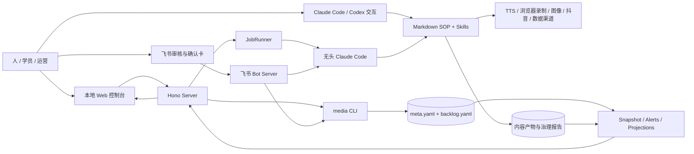

# AI 自媒体全流程课：产品与技术文档导航

> 快照日期：2026-08-24  
> 目标仓库：`/Users/yedizhang/yedi-study/douyin-media`  
> 文档性质：课程产品与当前参考实现的架构快照。现行运行规则仍以 `CLAUDE.md`、`pipeline/`、`harness/`、`.claude/skills/` 和 `tools/console/` 代码为准。

## 1. 本轮交付

本轮新增以下文档，不修改本目录已有的课程 ADR、示例账号、体量实测和写作规范：

| 文档 | 主要读者 | 解决的问题 |
|---|---|---|
| [10-产品需求文档-PRD.md](./10-产品需求文档-PRD.md) | PM、课程设计、研发、QA | 课程产品要服务谁、交付什么、哪些节点必须人审 |
| [11-总体技术架构方案.md](./11-总体技术架构方案.md) | 架构、前后端、Agent 工程 | 整个项目的分层、双线闭环、控制面和数据面如何协作 |
| [12-前端技术方案.md](./12-前端技术方案.md) | 前端、QA | 看板工作台的入口、路由、页面、状态、SSE、鉴权和交互契约 |
| [13-后端技术方案.md](./13-后端技术方案.md) | 后端、Agent 平台、QA | Hono Server、CLI 白名单、JobRunner、SSE、文件服务和终局裁决 |
| [14-Agent流水线与Skill编排方案.md](./14-Agent流水线与Skill编排方案.md) | Agent 工程、课程作者、运营 | 生产线、治理线、Skill、Sub Agent、人闸和外部工具如何串联 |
| [15-数据状态机与可靠性方案.md](./15-数据状态机与可靠性方案.md) | 架构、后端、QA | 文件真相源、双层状态机、原子写、审计、Check/Doctor 与恢复 |
| [16-测试运维安全与实施计划.md](./16-测试运维安全与实施计划.md) | Tech Lead、QA、运维、课程制作 | 如何验证、部署、演练故障，以及如何把当前项目切成训练营物料 |

## 2. 阅读顺序

### 2.1 产品与课程负责人

1. 先读 `00-ADR.md` 和 `03-已拍板补充.md`，确认训练营定位与课程结构。
2. 再读 PRD，确认用户旅程、功能边界、验收证据和待拍板项。
3. 最后读实施计划，决定 `starter/`、`checkpoint/`、`reference/`、`labs/` 的制作节奏。

### 2.2 研发与架构负责人

1. 先读总体技术架构，建立生产线、治理线、控制台和文件账本的整体模型。
2. 按职责阅读前端、后端、Agent 编排和数据可靠性方案。
3. 用测试运维方案做交付门禁，不以“Agent 说完成”为验收依据。

### 2.3 学员与助教

1. 先看 PRD 的用户旅程和课程里程碑。
2. 再看总体架构中的“一条内容如何流动”。
3. 实操时只按每个 checkpoint 的任务卡推进，不直接照抄完整参考实现。

## 3. 当前项目的一句话定义

这是一个以仓库文件为业务账本、以 Markdown SOP 和 Skill 驱动 Agent、以 CLI 收口状态写入、以本地 Web 控制台提供可视化和人工授权的 AI 自媒体生产与治理系统。

它同时包含四种形态：

- 内容生产系统：选题、创作、审核、发布、复盘。
- Agent 运行系统：Prompt、SOP、Skill、Sub Agent、无头 Claude Code 任务。
- 本地控制台：React 看板、Hono API、SSE、JobRunner、文件预览。
- 教学参考实现：把上述系统拆成训练营课程、里程碑、故障实验和迁移练习。

## 4. 系统范围图

## 5. 事实分级

为避免把计划写成现状，本组文档统一使用以下分级：

| 标记 | 含义 | 例子 |
|---|---|---|
| 已实现 | 当前仓库已有代码、契约或真实产物 | `media flip`、Hono API、React 看板、JobRunner |
| 现行规则 | 当前运行时必须遵守，但未必都由代码强制 | 工作日自动到出审、发布两次确认、治理提议人审后应用 |
| 课程化改造 | 为训练营交付需要新增或重组 | `starter/`、九个 checkpoint、故障实验说明 |
| 待演进 | 当前不做，满足条件后再启动 | 多租户、云数据库、远程 SaaS、自动扩容 |
| 待拍板 | 缺少产品或业务选择 | 是否要求真实发布、课程仓名称、个人或分组毕业项目 |

## 6. 真相源优先级

发生冲突时按以下顺序判断：

1. 可执行代码与运行时类型：`tools/console/packages/core/src/state.ts` 等。
2. 现行项目规则：`CLAUDE.md`、`pipeline/`、`harness/`、对应 Skill。
3. 当前内容条目的 `meta.yaml`、`backlog.yaml`、治理账本和审计日志。
4. 本目录技术方案。
5. `docs/` 下更早的历史 ADR。

已发现的典型文档漂移是：仓根 `README.md` 仍写“抖音暂无自动发布 skill、人工发布”，但现行 `CLAUDE.md`、`pipeline/4-publish.md` 和 `.claude/skills/douyin-publish/` 已形成“dry-run + 二次确认 + sau 真发”的链路。课程与研发实现应以现行规则为准，并在后续 `sop-doc-sync` 中修复旧说明。

## 7. 不在本轮范围内

- 不修改当前生产线、治理线、控制台或飞书 Bot 代码。
- 不替用户决定课程定价、招生、营销渠道或商业化方案。
- 不创建远端仓库，不公开现有参考仓，不执行真实抖音发布。
- 不把本地单用户架构扩成多租户 SaaS。
- 不生成 27 篇课程正文，也不切分 `starter/checkpoint/labs` 实体目录。

## 8. 术语表

| 术语 | 定义 |
|---|---|
| 生产线 | 消费选题池并生成终端内容的链路，自动化止于出审 |
| 治理线 / Harness | 对选题池、已发布内容、账号大脑和治理系统自身做周期维护的链路 |
| 大环 / Loop | 发布数据回流，形成提议，经人审后更新账号策略，再影响下一轮生产 |
| 真相源 | 决定系统当前事实的唯一数据来源，不等于展示页面 |
| 状态记账 | 通过 `media` CLI 修改状态、时间戳、关联指针和派生看板 |
| 快写动作 | 可由 Server 白名单映射到 `media` CLI、短时间完成的写操作 |
| 慢作业 | 需要启动无头 Claude Code、持续数分钟并通过 SSE 观察的任务 |
| 终局裁决 | 子进程结束后复读文件状态或 Git Diff，判断任务是否真的完成 |
| 人闸 | 审核、发布、治理提议应用等不可由 Agent 自主越过的授权节点 |
| 里程碑 | 从工具调用事件推导出的进度提示，只用于展示，不决定最终成功 |

