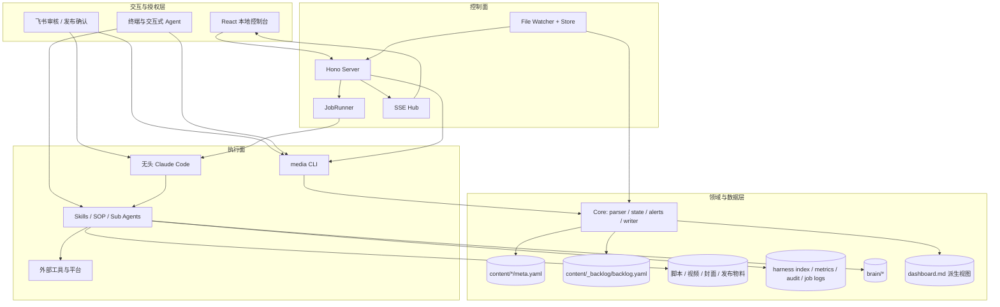
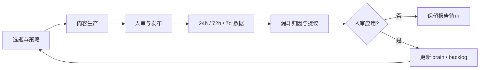
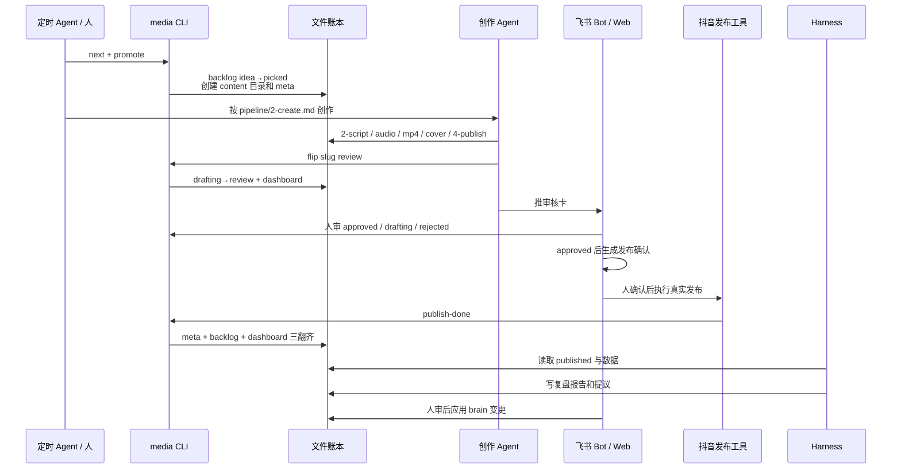

# AI 自媒体流水线总体技术架构方案

## 1. 架构结论

当前项目采用“文件账本 + Agent 执行面 + CLI 写入内核 + 本地 Web 控制面”的架构。

它没有把业务状态放进数据库，也没有让 Web Server 直接操作业务文件。业务事实保存在仓库中，Agent 负责判断和生产，CLI 负责受约束地落笔，Server 负责投影、授权和编排，UI 负责观察与人机交互。

这套架构适合当前单用户、本地优先、强可审计的项目，也适合作为课程参考实现。它不等同于面向多租户的云端 SaaS。

## 2. 架构目标

- 把一次性的 Agent 对话变成有状态、可恢复的流水线。
- 让生产和治理分开调度，又通过发布数据形成闭环。
- 让判断权留在 Agent/人，状态写入权收口到确定性程序。
- 让看板可操作，但不产生第二套业务真相。
- 让长任务可观察、可取消、可回放、可做终局裁决。
- 让不可逆动作和判断性变更必须经过人审。
- 让所有关键结果可通过文件、Diff、日志和测试复核。

## 3. 总体分层



## 4. 双线闭环

### 4.1 生产线

生产线消费选题池，目标是生成终端内容：

```text
选题池 → promote → 创作 → 质量闸 → 出审 → 人审 → 发布确认 → 发布
```

现行入口是 `pipeline/daily-run.md`。自动化工作日每天取一题，完成创作并停在 `review`。发布不属于自动默认权限。

### 4.2 治理线

治理线维护已有资产，目标是减缓系统熵增：

```text
任务注册表 → trigger 评估 → 执行 Skill → 报告/提议 → 人审 → 应用
```

现行入口是 `.claude/skills/harness-dispatcher/SKILL.md`，任务清单唯一出处是 `harness/tasks.md`。

### 4.3 大环



项目明确不在选题阶段爬抖音受众信号，平台反馈主要从发布后复盘进入。复盘断供会直接切断大环。

## 5. 控制面与数据面

### 5.1 数据面

数据面包含：

- `brain/`：账号定位、人设、风格、信息源、对标和 TTS 配置。
- `content/_backlog/backlog.yaml`：选题库存与粗粒度状态。
- `content/<date>/<slug>/`：内容工作单元及其全部产物。
- `harness/logs/index.jsonl`：治理运行账本。
- `harness/logs/metrics.jsonl`：复盘结构化指标，当前可为空。
- `tools/console/logs/audit.jsonl`：CLI 写事务审计。
- `tools/console/logs/jobs/`：无头 Agent 原始流与终态快照。

### 5.2 控制面

控制面包含：

- `media` CLI：确定性业务协议和唯一状态写入入口。
- Hono Server：只读投影、白名单动作、Job 管理、文件服务和鉴权。
- React UI：页面投影、交互、dry-run 预览、长任务观察和取消。
- 飞书 Bot：审核卡、发布确认卡和按钮回调。
- 定时 Agent：生产线与治理线的周期触发。

### 5.3 核心边界

| 边界 | 规则 |
|---|---|
| UI → Server | 只调用 API，不直接访问本地文件系统 |
| Server → 业务写入 | 快写只能通过白名单拼 `media` 参数；Server 禁止 import Core Writer |
| JobRunner → Agent | 用固定 Prompt、allowedTools、超时和单并发队列启动无头 CC |
| Agent → 状态 | Agent 调用 `media`，不能随意手改状态文件 |
| Dashboard → 业务 | 单向派生，不允许从 Dashboard 反写状态 |
| 治理报告 → Brain | 必须经过人审后才能应用 |
| Agent 自述 → 成败 | 只用于展示，成败由文件状态或 Git Diff 裁决 |

## 6. 模块地图

| 模块 | 路径 | 职责 |
|---|---|---|
| 项目规则 | `CLAUDE.md` | 双线边界、红线、真相源和 Skill 索引 |
| 生产契约 | `pipeline/*.md` | 每阶段输入、输出、状态、闸口 |
| 治理注册表 | `harness/tasks.md` | 任务、Skill、enabled、trigger、任务卡 |
| Agent 技能 | `.claude/skills/*` | 阶段操作细节、外部工具调用、报告格式 |
| Sub Agent | `.claude/agents/dubbing-reviewer.md` | 配音批次只判不改的职责分离 |
| Core | `tools/console/packages/core/src/` | 解析、快照、状态机、警报、Doctor、事务写 |
| CLI | `tools/console/packages/cli/src/` | `media` 命令及 JSON 信封 |
| Server | `tools/console/packages/server/src/` | API、Store、Watcher、SSE、JobRunner |
| CC Stream | `tools/console/packages/cc-stream/src/` | 无头 CC spawn、stream-json 解析与归一 |
| UI | `tools/console/packages/ui/src/` | React 页面、组件、API/SSE Store |
| 飞书 Bot | `tools/feishu-bot/` | 审核、确认发布、按钮回调与异步任务 |

## 7. 一条内容的端到端链路



## 8. 读路径

1. `Store.init()` 调用 `buildSnapshot(root)` 聚合内容、backlog、治理账本和 metrics。
2. Store 同时读取 `harness/tasks.md`，派生任务注册表和页面投影。
3. `chokidar` 监听业务文件，变更后 debounce rebuild。
4. Store revision 自增，SSE 广播 `refresh`。
5. UI 的 `usePageData` 按 revision 重新请求页面 API。

读接口不在每次请求时全仓扫描，主要消费内存快照。例外是少量受控文件证据和 Job 历史读取。

## 9. 写路径

### 9.1 快写动作

```text
UI POST → Server 参数校验 → whitelist.ts 拼固定 args
→ execFile(media, args) → CLI/Core 事务 → JSON 信封 → UI 展示
```

覆盖审核决策、backlog 提议应用、promote 和 next_up。

### 9.2 慢作业

```text
UI POST → JobRunner precheck → 幂等锁 → 单并发队列
→ 无头 Claude Code → stream-json → 归一事件 → SSE
→ 文件/账本/Git Diff 终局裁决 → result.json
```

覆盖真实发布、重做、治理提议应用、治理任务和开始创作。

## 10. 运行时与部署

### 10.1 当前形态

- 单机、本地、单用户。
- Server 监听 `127.0.0.1:5170`。
- UI 构建后由同一 Hono Server 静态托管。
- token 保存到 `tools/console/.runtime/token`，权限为 `0600`。
- `start.sh` 提供 start/status/stop/restart。
- macOS 可通过 `com.yedi.douyin-console.plist` 由 launchd 常驻。
- 飞书 Bot 是独立 Python 进程。
- 生产线与治理线定时触发配置在用户的 Claude Code 客户端外部目录，不属于仓库可移植状态。

### 10.2 课程参考仓要求

- 把本机绝对路径改为配置、相对路径或自动探测。
- 提供 macOS/Linux 的启动说明；Windows 至少说明限制。
- 外部凭证只通过环境变量或 `.env.example` 描述，禁止入库。
- 提供模拟发布和 fixture 数据，避免课程核心验收依赖真实平台。

## 11. 关键架构决策

### ADR-A：文件而非数据库作为当前真相源

原因：工作单元天然是文本和媒体文件；Git Diff 友好；Agent 直接可读；单用户规模不需要数据库运维。

代价：查询和并发能力有限；路径和格式需要严格约束；多用户扩展困难。

演进条件：出现多用户并发、远程协作、海量内容或跨设备同步需求时，再引入数据库，并保留文件导出和审计链。

### ADR-B：Agent 判断，CLI 落笔

原因：创作与归因需要模型判断，状态迁移与多文件一致性需要确定性程序。

代价：需要维护 CLI 契约、白名单和类型一致性。

### ADR-C：Server 不直接写业务文件

原因：避免 UI、Server、Skill 各自实现一套状态逻辑；所有入口复用同一事务和审计。

代价：Server 需要启动本地 CLI，并处理 PATH、可执行位和错误信封。

### ADR-D：单并发 JobRunner

原因：外部浏览器、账号 cookie、本地媒体资源和仓库写操作存在冲突；单并发最容易保证可解释性。

代价：长任务排队，吞吐低。

演进条件：能明确资源锁域和任务隔离后，可按账号/slug/task 分区并发，而不是直接全局放开。

### ADR-E：文件事实做终局裁决

原因：Agent 可能自述成功、工具可能部分执行、进程退出码也可能与业务结果不一致。

代价：每种 Job 需要独立 verdict 逻辑。

## 12. 当前风险与技术债

- `README.md` 与现行发布链路存在漂移，需要 `sop-doc-sync` 修正。
- 定时任务配置位于用户目录，参考仓无法仅靠 clone 复现调度。
- `launchd` plist 含本机绝对路径，只适用于当前机器。
- 外部 Skill、TTS、图像、浏览器和抖音工具的版本与凭证可能变化。
- metrics 结构已定义，但当前主仓 `metrics.jsonl` 可能尚未形成稳定数据量。
- JobRunner 为内存队列，Server 重启后不能继续运行中的子进程，只能从文件事实恢复可见性。
- `cc-stream` 的明文 thinking 在 headless 模式下不可得，UI 不能承诺展示完整思考过程。
- 生产和治理的某些操作仍依赖 Agent 遵守 SOP，尚未全部变成程序级强约束。

## 13. 演进路线

### 阶段 1：课程化与可移植

完成脱敏、配置化、fixture、starter/checkpoints/labs 和跨平台启动说明。

### 阶段 2：契约自动校验

增加 SOP/Skill/代码路径同步检查、课程 checkpoint 兼容性检查、外部工具健康检查。

### 阶段 3：资源分区并发

按内容条目、账号和外部资源定义锁域，支持有限并发和持久化队列。

### 阶段 4：远程与多用户

只有当课程或业务确实需要远程协作时，才引入数据库、对象存储、用户系统、权限模型和云端任务执行。

