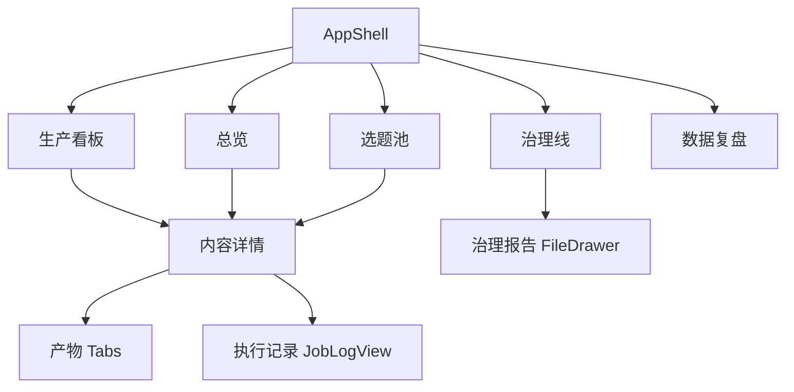
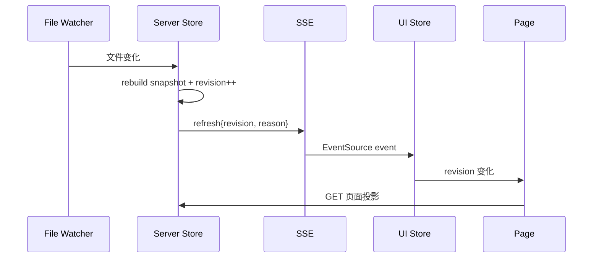

# 【Web】AI 自媒体流水线控制台前端技术方案

## 1. 方案结论

前端是本地控制面，不是业务真相源。它通过 Hono API 读取 Server 的内存投影，通过白名单动作和 Job API 发起操作，通过 SSE 获取仓库 revision 与任务进展。所有状态合法性和业务写入仍由 Core/CLI 保证。

当前前端已经实现 React 单页应用的主要页面和数据层。本方案的重点是固化现有入口链、页面/API 映射、交互边界和课程化改造要求。

## 2. 技术栈

| 类别 | 选型 | 当前版本/来源 |
|---|---|---|
| UI 框架 | React | `19.2.8` |
| 构建工具 | Vite | `8.2.1` |
| 路由 | React Router DOM | `7.18.2`，Hash Router |
| 组件库 | Ant Design | `6.6.1` |
| Markdown | `react-markdown` + `remark-gfm` | 报告和产物阅读 |
| 类型来源 | `@console/core`、`@console/server/api-types` | type-only import |
| 实时通信 | Browser EventSource | SSE |
| 测试 | Vitest + Playwright/Midscene | 单元、组件逻辑、E2E |

项目路径：`tools/console/packages/ui/`。

## 3. 完整入口链

按照“构建入口 → 页面入口 → React 挂载 → 路由 → 初始化 → 鉴权/API”梳理如下：

1. 构建入口：`tools/console/packages/ui/package.json`
   - `vite` 负责开发与打包。
   - `tsc -p tsconfig.json` 先做类型检查。
2. HTML 入口：`tools/console/packages/ui/index.html`。
3. React 挂载：`tools/console/packages/ui/src/main.tsx`
   - 先 import `./lib/bootstrapToken` 消费首屏 `#token=...`。
   - 创建 AntD `ConfigProvider`。
   - 挂载 `ConsoleProvider`。
   - 注入 FileDrawer 的真实文件解析器。
   - 用 `RouterProvider` 挂载路由。
4. 路由入口：`tools/console/packages/ui/src/app/routes.tsx`
   - 使用 `createHashRouter`。
   - 根壳为 `AppShell`。
5. 初始化：`tools/console/packages/ui/src/lib/store.tsx`
   - 建立 SSE。
   - 初拉 `/api/jobs`。
   - 维护 revision、连接状态、jobs Map 和手动 reloadTick。
6. 鉴权与 API：`tools/console/packages/ui/src/lib/api.ts`
   - token 首次从 URL hash 读取并存入 `localStorage('console.token')`。
   - 普通请求使用 `Authorization: Bearer`。
   - EventSource、img、a 无法自定义 header 时通过 query token。

## 4. 路由与页面

| 路由 | 页面文件 | 主数据源 | 主要动作 |
|---|---|---|---|
| `#/` | `pages/overview/index.tsx` | `GET /api/overview` | 查看证据、跳转 |
| `#/kanban` | `pages/kanban/index.tsx` | `GET /api/contents` | 启动创作、进入详情 |
| `#/backlog` | `pages/backlog/index.tsx` | `GET /api/backlog` + `GET /api/contents` | promote、next_up、应用理池提议 |
| `#/harness` | `pages/harness/index.tsx` | `GET /api/harness` | 手动跑治理、查看/应用提议 |
| `#/metrics` | `pages/metrics/index.tsx` | `GET /api/metrics` | 查看复盘数据 |
| `#/content/:slug` | `pages/detail/index.tsx` | `GET /api/content/:slug` | 审核、重做、发布、查看产物和 Job |
| `#/dev` | `pages/dev/index.tsx` | 本地 fixture | 跨页组件展示和调试 |

选择 Hash Router 的原因是 UI 与 Server 单端口静态托管时无需额外 SPA fallback 规则，也能避免 token hash 初始化与 history 路由冲突。当前 `bootstrapToken` 必须先于路由模块导入。

## 5. 页面信息架构



侧栏导航只暴露五个一级页面，内容详情从业务上下文进入，不作为一级入口。

## 6. 数据层设计

### 6.1 全局状态

`ConsoleProvider` 只维护真正跨页且高频变化的状态：

```ts
interface ConsoleStateValue {
  revision: number
  sseState: 'connecting' | 'open' | 'closed'
  jobs: Record<string, Job>
  reloadTick: number
}
```

页面业务数据不全部塞进全局 Store。每个页面通过 `usePageData<T>(path)` 独立请求，revision 或 reloadTick 变化时重新拉取。

### 6.2 页面请求

`lib/api.ts` 是全站唯一 fetch 出口：

- `apiGet<T>`：普通 GET。
- `apiGetText`：解 `/api/file` 信封。
- `postAction`：快写动作，返回 dry-run 和文件变化。
- `postJob`：慢作业，返回 jobId。
- `getJob/getJobLog/getJobHistory`：任务查询与回放。
- `cancelJob/cancelAllJobs`：即时取消。
- `assetUrl`：带 query token 的媒体 URL。

组件内不得裸写 fetch，以避免鉴权、错误信封和适配逻辑散落。

### 6.3 Revision 刷新



SSE 只做失效通知和 Job 推送，不把完整页面数据作为长连接状态同步。这样可以用普通 GET 重新建立完整视图，避免丢事件后状态不可恢复。

## 7. SSE 与 Job 观察

### 7.1 事件类型

- `refresh`：仓库快照 revision 变化。
- `ping`：连接保活。
- `job:<id>`：某个 Job 的完整快照，覆盖式合并。
- `job-log:<id>`：某个 Job 的归一事件追加流。

### 7.2 客户端策略

1. 应用挂载即建立 `/api/events?token=...`。
2. 首次 GET `/api/jobs` 获得 active、queued 和 recent。
3. 对已知 jobId 注册动态事件监听。
4. 提交慢作业后立即插入 queued 占位，避免等第一条 SSE 才显示。
5. `JobLogView` 先订阅实时事件，再拉历史，用 seq 去重合并。
6. SSE 重连时请求 `/api/health` 比对 revision，必要时触发页面重拉。

### 7.3 展示与判定分离

- narration、thinking、tool、toolDone 只用于帮助人理解过程。
- milestone 只展示阶段进度。
- Job 的 succeeded/failed 来自 Server verdict。
- 页面不得根据“出现了某个工具调用”自行宣布业务完成。

## 8. 写动作交互

### 8.1 快写动作

快写动作统一由 `useAction` 处理：

1. 用户填写参数。
2. 对高影响动作先提交 `dryRun: true`。
3. Modal 展示文件变化和原始 JSON。
4. 用户确认后提交正式动作。
5. Server 返回 Check 摘要，页面刷新。

当前动作：

```ts
type FastAction = 'review' | 'backlog-apply' | 'promote' | 'next-up'
```

### 8.2 慢作业

```ts
type JobAction =
  | 'publish'
  | 'rework'
  | 'apply-proposal'
  | 'harness-run'
  | 'create'
```

慢作业提交后由 `JobPanel` 展示排队、运行、校验和终态。用户可以取消单个任务或全部任务。

### 8.3 内容详情动作矩阵

| 当前状态 | 可见动作 | 说明 |
|---|---|---|
| `ideated` | 开始创作 | 提交 create Job |
| `drafting` | 继续/重做 | 依产品交互显示，不允许直接通过 |
| `review` | 通过、打回、拒绝 | 打回/拒绝必须写原因 |
| `approved` | 确认发布、反悔改稿 | 发布是独立授权 |
| `scheduled` | 查看状态 | 不允许重复发布 |
| `published` | 查看复盘 | 治理线可推进 retro_done |
| `retro_done` | 只读终态 | 人工例外不在普通 UI 暴露 |
| `rejected` | 重做 | 重新进入 drafting |

动作集合应由 API 返回的 `allowedTransitions` 与 Job precheck 共同约束，前端显示隐藏不是安全边界。

## 9. 核心组件

| 组件 | 路径 | 职责 |
|---|---|---|
| `AppShell` | `src/app/AppShell.tsx` | 导航、计数徽标、SSE 状态、全局 JobPanel |
| `AlertCard` | `src/components/AlertCard/` | 警报级别、证据路径和建议动作 |
| `StatusTag` | `src/components/StatusTag/` | 状态中文标签与视觉语义 |
| `DeadlineBadge` | `src/components/DeadlineBadge/` | 停留和截止时间 |
| `FileDrawer` | `src/components/FileDrawer/` | 安全读取并展示 Markdown/文本 |
| `JobPanel` | `src/components/JobPanel/` | 全局任务队列和取消 |
| `JobLogView` | `src/components/JobLogView/` | 工具调用、输出摘要、回放与实时合并 |
| `LineChart` | `src/components/LineChart/` | 轻量复盘趋势展示 |

## 10. 页面详细设计

### 10.1 总览页

数据源必须单一：`GET /api/overview`。页面显示：

- 今日生产阶段和证据轨迹。
- 在制状态计数。
- error/warn/info 警报。
- 面向人的待办聚合。
- 选题池水位。
- 治理任务心跳与待审提议。

空态要区分“今天尚未运行”“选题池为空”“数据解析失败”，不能统一显示无数据。

### 10.2 生产看板

- 用 Server 返回的 `ContentSummary[]` 分组，不在前端重造状态顺序。
- parse error 条目单独展示并给出证据路径。
- 卡片点击进入详情。
- `ideated` 行可启动创作，提交后立刻显示 queued Job。

### 10.3 选题池

- `PoolStats` 展示状态计数和过期风险。
- `IdeaTable` 展示 score、track、format、urgency、tags。
- `NextPickCard` 展示 `next_up` 或按 score 的选择理由与 runner-up。
- `PromoteDialog` 收集显式 slug 与可选日期。
- `SweepCard` 只展示机械清扫能力，不把判断性撞题与规则化过期混为一谈。
- `CollisionCard` 从治理报告读取提议，应用前 dry-run。

### 10.4 治理线

- 任务注册表展示 enabled、trigger、skill、lastRun、overdue。
- 无 Skill 的 `check` 任务不提供“启动 Agent”按钮。
- 报告阅读通过 FileDrawer/MarkdownView。
- 待审提议只统计 `applied:false && findings>0`。
- 应用提议启动 Job，最终展示 `git diff -- brain/` verdict。

### 10.5 内容详情

- `MetaHeader`：标题、状态、类型、支柱、发布时间和阻塞。
- `StageTimeline`：根据 timestamps 和当前状态渲染。
- `ArtifactTabs`：脚本、审核、发布、复盘、媒体与文件。
- `DecisionPanel`：只渲染合法动作，所有高风险动作带确认。
- `AuditTrail`：展示 CLI audit 的相关记录。
- `JobHistoryTab`：按 slug 拉取最多 50 条历史任务。

## 11. 鉴权与安全

1. 首次访问使用 `http://127.0.0.1:5170/#token=<token>`。
2. `bootstrapToken` 在 Router 初始化前消费 hash，避免 `#token` 被当成前端路由。
3. token 存入 localStorage，随后清理 URL。
4. 普通 API 走 Bearer header。
5. EventSource 和媒体 URL 通过 query token，这是浏览器能力限制，不应复用到普通 fetch。
6. 401 文案明确提示用户执行 `bash tools/console/start.sh status` 获取入口。
7. UI 不保存抖音 cookie、TTS key 或飞书 secret。

## 12. 错误与边界处理

- API 非 2xx 统一抛 `ApiError` 或转为 `ActionResult.ok=false`。
- SSE 断开显示连接状态，但页面仍可手动刷新。
- 单页面请求失败不应清空全局 jobs。
- 文件不存在、路径非法、Markdown 加载失败在 Drawer 内给出明确错误。
- parse error 内容仍显示占位卡，避免整个看板崩溃。
- 同一按钮重复点击要通过 pending 状态和 Server 幂等锁双重防护。
- 取消 running Job 后显示“正在停止”，收到最终 SSE 后再显示 cancelled。
- headless thinking 当前通常为空，UI 不显示虚假的“思考中”内容。

## 13. 课程化改造建议

### 13.1 必做

- 去除所有本机路径和真实凭证依赖。
- 提供 fixture 模式，让六个页面在没有外部平台时仍可运行。
- 为每个 checkpoint 固化页面截图、API 响应和验收命令。
- 把 `#/dev` 明确标为开发辅助，决定公开参考仓是否保留。
- 提供无真实发布权限时的模拟 Job 与 verdict。

### 13.2 可选

- 增加“课程模式”顶部提示，标明当前 checkpoint 和本章任务。
- 增加证据导出，将页面状态、关键 API 和 Job 结果汇总成里程碑报告。
- 增加只读演示模式，隐藏所有写动作。

这些功能均属于课程产品化，不是当前生产系统的前置条件。

## 14. 核心改动文件清单

本轮只产方案、不改代码。后续若执行课程化改造，主要涉及：

| 文件/目录 | 预期改动 |
|---|---|
| `tools/console/packages/ui/src/main.tsx` | 注入课程模式或 fixture provider |
| `tools/console/packages/ui/src/app/routes.tsx` | 决定开发页、课程页和只读模式路由 |
| `tools/console/packages/ui/src/lib/api.ts` | 模拟 API/真实 API 适配边界 |
| `tools/console/packages/ui/src/lib/store.tsx` | fixture 下的 revision/jobs 行为 |
| `tools/console/packages/ui/src/pages/*` | checkpoint 提示、证据导出、只读动作矩阵 |
| `tools/console/packages/ui/src/components/JobLogView/*` | 模拟日志与课程讲解标注 |
| `tools/console/e2e/tests/*` | 课程公开 fixture 的页面一致性验收 |

## 15. 前端验收

- TypeScript 构建通过。
- UI 页面没有裸 fetch。
- 首次 token 链路不产生 Router 首屏错误。
- 六个业务页面可达，详情页从至少两个入口可进入。
- 页面关键计数与 CLI/Server 数据一致。
- SSE 断开、重连和 revision 刷新可验证。
- 快写动作支持 dry-run，正式写入后页面刷新。
- 慢作业可显示队列、里程碑、日志、终局和取消。
- 401、404、409、500、502 均有可操作的人话提示。
- 只读课程模式下不能触发真实写动作或真实发布。

