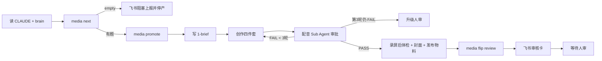

# Agent 流水线与 Skill 编排方案

## 1. 方案结论

项目把 Agent 能力分成四层：项目规则、阶段契约、可复用 Skill、确定性工具。Agent 负责在约束内判断和组合工具，不负责自行发明状态迁移、授权或验收标准。

生产线与治理线各自有独立入口和调度节奏，共享同一份账号大脑、选题池和内容账本，最终通过发布后数据形成闭环。

## 2. Agent 上下文分层

| 层级 | 路径/形态 | 放什么 | 不放什么 |
|---|---|---|---|
| 项目规则 | `CLAUDE.md` | 系统边界、红线、真相源、Skill 索引 | 阶段操作细节 |
| 账号上下文 | `brain/*` | 定位、人设、风格、对标、信息源、TTS 配置 | 状态机和工具实现 |
| 阶段契约 | `pipeline/*.md`、`harness/tasks.md` | 输入、输出、状态、闸口、任务注册 | 可变的命令步骤细节 |
| 执行 Skill | `.claude/skills/*/SKILL.md` | 具体流程、工具命令、失败处理 | 跨项目全局规则 |
| 确定性程序 | `media`、检查脚本、录制脚本 | 写入、校验、媒体处理 | 开放式业务判断 |
| 历史教训 | `pipeline/lessons.md` | 事故证据和约束由来 | 现行规则的唯一副本 |

同一规则只应有一个真相源，其余位置引用。否则 Agent 会读到互相冲突的两套做法。

## 3. 生产线编排

### 3.1 入口与触发

- 入口 Prompt：`pipeline/daily-run.md`。
- 触发：工作日定时 Agent；休息日人工按需。
- 产量：当前每天 1 条。
- 选题比例：深度:流量约 6:4，滚动平衡。
- 自动化边界：只到出审，不发布。

### 3.2 步骤



### 3.3 取题

`media next` 与 `media promote --auto` 复用 Core 的 `pickNext()`：

1. 合法 `next_up` 指针优先。
2. 否则 score 降序。
3. 同分 depth 优先。
4. 再按 created 早者、id 字典序。

取题为空时必须上报并停产，不能让 Agent 临时编造一个题绕过库存治理。

### 3.4 创作四件套

口播视频现行链路：

```text
web-video-presentation
  → tts-dub
  → dubbing-check / dubbing-reviewer
  → npm run record
```

关键产物：

- `2-script.md`：口播唯一真相源。
- `build/audio-segments.json`：配音输入派生件。
- `build/public/audio/**`：分段音频。
- `assets/<slug>.mp4`：最终成片。
- `assets/cover.png`：9:16 独立封面。
- `4-publish.md`：出审前必产的发布物料。

### 3.5 配音职责分离

`.claude/agents/dubbing-reviewer.md` 是只判不改的 Sub Agent：

- 检查完整性、语速、死气、真相源同步、多音字和音画整句一致。
- 返回 PASS/FAIL 和可执行改法。
- 修复、重合成和改文案由主 Agent 完成。
- 最多 3 轮，第 3 轮仍失败则升级人审。
- 不负责录屏后的抽帧检查。

这避免同一个 Agent 既生产又给自己放行。

### 3.6 成片质量闸

`pipeline/2-create.md` 的 A–G 闸口覆盖：

- 声画与字幕一致。
- 音频自然度和内部静音。
- 钩子冷启动。
- 事实、语气和平台合规。
- 竖版封面。
- 音画同步和字幕烧录。
- `4-publish.md` 字段可被飞书解析器消费。

任何一项未过，不得 `media flip <slug> review`。

## 4. 审核与发布编排

### 4.1 审核

`feishu-notify` 将口播稿、封面和必要信息推送为审核卡：

- 通过：`review → approved`。
- 打回：写意见，回到 `drafting`；可自动重做或挂待办。
- 拒绝：`review → rejected`，必须记录原因。

Web 详情页提供同等审核能力，最终都走 `media flip`。

### 4.2 发布二次确认

审核通过不等于发布授权：

1. 系统读取 `4-publish.md`，拼出 sau dry-run 和物料摘要。
2. 推送“确认发布”卡或 Web 确认对话框。
3. 人点击确认后，才调用 `/douyin-publish <slug> --publish`。
4. 发布成功后必须执行 `media publish-done <slug>`。

发布失败时不得提前翻 `published`。

### 4.3 阻塞上报

以下事件会导致当日无产出或流程挂起，必须经飞书通知：

- 选题池为空。
- TTS 余额不足。
- 录制连续失败。
- 审批通道故障。
- 发布 cookie 失效。
- 关键文件损坏。

通知必须说明事件、根因和需要人做什么。只写本地日志不算上报。

## 5. 治理线编排

### 5.1 Dispatcher

`.claude/skills/harness-dispatcher/SKILL.md` 是调度框架：

1. 读 `harness/tasks.md` YAML 注册表。
2. 读 `harness/logs/index.jsonl` 计算到期情况。
3. 对到点任务调用对应 Skill。
4. 收集执行记录报告。
5. 追加治理账本。
6. 汇报本轮执行、跳过和待审事项。

Dispatcher 不直接做治理判断，不改 `brain/`，不替执行 Skill 工作。

### 5.2 Trigger 类型

| Trigger | 语义 | 当前用途 |
|---|---|---|
| `post-publish-window` | 发布后 24h/72h/7d 到点执行 | retro |
| `periodic:Nd` | 距上次成功运行达到 N 天 | ideate、gardener、benchmark、audit、check |
| `weighted-pool` | 从同质维护债中按权重抽样 | 预留，暂无启用任务 |

事件型和周期型任务不能用随机权重延迟，否则会错过复盘窗口。

### 5.3 当前启用任务

| Task | Skill/执行器 | 作用 | 自动修改边界 |
|---|---|---|---|
| retro | `douyin-retro` | 发布数据、漏斗归因、大脑提议 | 报告和状态记账；不自动改 brain |
| benchmark-refresher | 同名 Skill | 对标与打法时效复核 | 只产报告 |
| ideate | `douyin-ideate` | 抓料、打分、入池、规则清扫 | 入池/机械清扫可写 |
| backlog-gardener | 同名 Skill | 撞题与重复提议 | 只产报告 |
| check | `media check --json` | 日巡状态账本 | 纯读 |
| account-audit | 同名 Skill | 治理线自审和有限调参 | 边界内数值可写 |

### 5.4 治理铁律

治理任务默认只产：

- 执行记录报告。
- 变更提议。
- 运行账本。

修改 `brain/`、判断性合并/剔除、线上内容调整都必须经过人审。允许自动的例外只有已拍板的状态记账与有限数值调整。

## 6. Skill 角色清单

### 6.1 生产相关

| Skill | 输入 | 主要输出 |
|---|---|---|
| `douyin-ideate` | brain、sources、backlog | 调研报告、候选入池、清扫 |
| `web-video-presentation` | `2-script.md` | Vite 演示与录制工程 |
| `tts-dub` | audio segments、TTS config | 分段音频 |
| `dubbing-check` | build 工程 | 客观检查结果 |
| `feishu-notify` | 内容条目/文本 | 审核卡、确认卡、阻塞通知 |
| `douyin-publish` | `4-publish.md`、媒体 | dry-run、真实发布、发布收尾 |

### 6.2 治理相关

| Skill | 输入 | 主要输出 |
|---|---|---|
| `douyin-retro` | 创作者数据、meta、发布内容 | 窗口快照、漏斗诊断、提议 |
| `benchmark-refresher` | benchmarks、外部证据 | 成立/存疑/失效/新增报告 |
| `backlog-gardener` | idea 池、已发布主题 | 合并/归档提议 |
| `account-audit` | index.jsonl、任务卡 | 治理指标、有限调参、提议 |
| `harness-dispatcher` | 注册表、账本 | 到期派发、收报告、记账 |

## 7. Agent 任务契约

所有定时或无头任务至少要说明：

```yaml
goal: 这次要推进什么
inputs: 必须读取的文件和参数
allowed_actions: 允许调用的 Skill/CLI/外部工具
forbidden_actions: 不得发布、不得改 brain 等
outputs: 必须生成的文件和状态
stop_conditions: 人审、余额不足、三轮失败等
acceptance: 用什么文件、命令和外部事实验收
```

课程应要求学员先写契约，再让 Agent 实现。只给一句“把流水线跑完”不算合格任务。

## 8. 信任与验收分级

| 信号 | 用途 | 能否决定完成 |
|---|---|---|
| Agent 文字回复 | 人读解释 | 否 |
| `say/thinking` 事件 | 过程展示 | 否 |
| 工具调用 | 里程碑和排障 | 否 |
| 工具退出码 | 局部信号 | 否 |
| 产物文件存在且格式通过 | 业务证据 | 是，按任务定义 |
| `meta.yaml/backlog.yaml` 状态 | 状态事实 | 是 |
| 外部平台结果 | 发布事实 | 是 |
| 治理账本新增行 | 治理执行事实 | 是 |
| Git Diff | 提议应用事实 | 是 |
| 测试与 Check/Doctor | 质量证据 | 是 |

## 9. 外部依赖边界

- 检索：agent-reach 等渠道；缺失渠道必须在报告标盲区。
- TTS：MiniMax/OpenAI 等 provider；余额和音色配置属于运行环境。
- 图像：外部模型和本地 Skill；生成结果必须落盘验收。
- 浏览器录制：headless 浏览器 + ffmpeg；必须抽帧和核字幕。
- 飞书：官方 SDK 长连接，不需要公网回调。
- 抖音：sau CLI、账号 cookie；失效时不得自动登录。
- 创作者数据：Excel/后台导出；只使用真实拉取值。

外部依赖失败时，Agent 必须降级、停下或请求人工，不得补写虚构事实。

## 10. 课程化改造

### 10.1 公开 Skill 清单

课程参考仓需要明确每个 Skill 的：

- 安装来源与许可证。
- 输入输出和最低版本。
- 是否需要外部凭证。
- 是否有模拟替代。
- 最后验证日期。
- 在哪个 checkpoint 首次引入。

### 10.2 模拟通道

为了让主课程不被外部平台阻塞，需要提供：

- 模拟 TTS 音频或短样例。
- 预制录屏/封面 fixture。
- 模拟飞书决策事件。
- 模拟发布 adapter 和外部 URL。
- 三窗口复盘样例数据。

真实工具作为进阶实验，不应成为所有学员完成主线的唯一通路。

### 10.3 调度可移植

当前定时任务存放在用户 Claude Code 配置目录。课程需把调度 Prompt 模板、安装命令和验证方法写入仓库，不能把现有本机定时状态当成交付。

## 11. 风险与改进

- Skill 与阶段契约可能漂移，需启用 `sop-doc-sync`。
- 外部通道可用性不稳定，报告必须记录证据覆盖面。
- 无头 CC allowedTools 仍较宽，公开课程可按 Job 类型进一步缩小。
- 里程碑依赖命令正则，Skill 命令变化后需要校准。
- 应用治理提议目前由 Agent 按“通过的提议”理解报告，后续可增加结构化勾选清单。
- 生产线与治理线各自调度，但共享仓库写锁；并发扩展前必须定义资源锁域。

## 12. Agent 编排验收

- 自动生产在 `review` 停止。
- 发布必须有两次独立人审证据。
- 配音 Reviewer 只判不改，最多三轮。
- 治理任务未授权时 `brain/` 零修改。
- 所有到期/跳过判断能从注册表和账本复算。
- 阻塞事件能通过用户可见通道上报。
- Agent 说成功但文件状态不符时，系统判失败。
- 外部数据缺失时明确标“未采/盲区”，不出现臆造指标。

