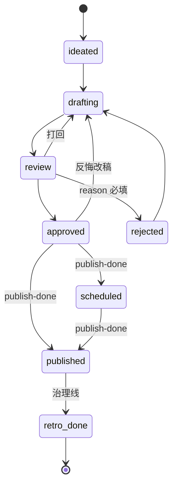
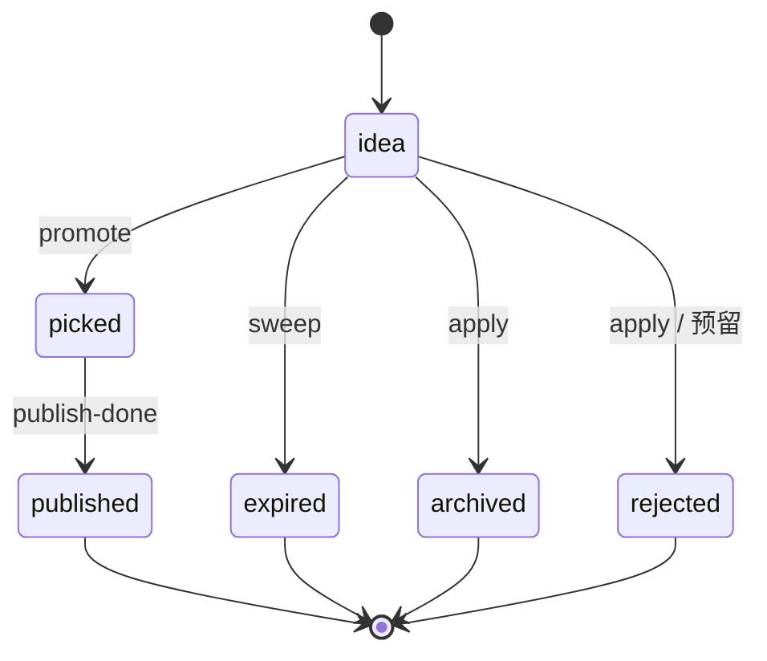

# 数据、状态机与可靠性方案

## 1. 方案结论

项目的可靠性核心不是“多加重试”，而是把业务事实、合法迁移、写入事务、派生视图、质量检查和审计证据分别放在明确位置。

内容细状态保存在 `meta.yaml`，选题库存粗状态保存在 `backlog.yaml`；两者由 `media` CLI 事务性维护。`dashboard.md`、Server 页面数据和 Job 里程碑都只是派生或展示，不是状态真相源。

## 2. 数据分层与所有权

| 数据 | 路径 | 所有者 | 写入方式 |
|---|---|---|---|
| 账号策略 | `brain/*` | 人审后的 Agent/人 | 治理提议通过后改 |
| 内容细状态 | `content/*/*/meta.yaml` | Core/CLI | `media promote/flip/publish-done` |
| 选题粗状态 | `content/_backlog/backlog.yaml` | Core/CLI | backlog/promote/publish-done |
| 内容产物 | `content/*/*/*.md`、`assets/` | 创作 Skill/人 | 文件生成与编辑 |
| 治理账本 | `harness/logs/index.jsonl` | Dispatcher/治理任务 | 追加记录 |
| 指标账本 | `harness/logs/metrics.jsonl` | `media metrics record` | 事务追加 |
| CLI 审计 | `tools/console/logs/audit.jsonl` | Core Writer | 每次写事务记录 |
| Job 原始流 | `tools/console/logs/jobs/*.jsonl` | cc-stream | 单 WriteStream 顺序追加 |
| Job 终态 | `tools/console/logs/jobs/*.result.json` | JobRunner | 终局落盘 |
| 看板 | `dashboard.md` | Core Writer | 写事务内重生成机器区 |

## 3. 内容工作单元

```text
content/<YYYY-MM-DD>/<slug>/
├── meta.yaml
├── 1-brief.md
├── 2-script.md
├── 3-review.md
├── 4-publish.md
├── 5-retro.md
├── build/          # 工作目录，不是最终资产
└── assets/         # cover、mp4 等最终媒体
```

系列内容可以通过 backlog 的 `plan_file` 使用外部计划文件作为 `1-brief.md` 等价物，但最终内容和状态仍落在本仓。

## 4. 领域数据结构

### 4.1 ContentMeta

```ts
interface ContentMeta {
  slug: string
  title: string
  type: 'kouban' | 'tuwen' | null
  pillar: 'depth' | 'traffic' | null
  status: MetaStatus
  source: string | null
  schedule: string | null
  publish_url: string | null
  timestamps: Partial<Record<MetaStatus, string>>
  blocker: Record<string, unknown>
}
```

### 4.2 BacklogTopic

```ts
interface BacklogTopic {
  id: string
  title: string
  alt_titles: string[]
  track: 'depth' | 'traffic'
  format: 'kouban' | 'tuwen'
  status: BacklogStatus
  content_path: string | null
  score: number | null
  tier: string | null
  scores: Record<string, number> | null
  urgency: 'queue' | 'today'
  reason: string
  links: string[]
  tags: string[]
  created: string
  metrics: Record<string, unknown>
  plan_file: string | null
}
```

## 5. Meta 细粒度状态机

唯一实现：`tools/console/packages/core/src/state.ts`。



| From | To | 命令 | 说明 |
|---|---|---|---|
| ideated | drafting | `flip` | 开始创作 |
| drafting | review | `flip` | 出审 |
| review | drafting | `flip` | 打回重做 |
| review | approved | `flip` | 审核通过 |
| review | rejected | `flip --reason` | 拒绝必须说明原因 |
| approved | drafting | `flip` | 审批后反悔改稿 |
| approved | scheduled/published | `publish-done` | 禁止普通 flip |
| scheduled | published | `publish-done` | 发布收尾 |
| published | retro_done | `flip` | 治理线唯一迁移 |
| rejected | drafting | `flip` | 决定重做 |

`retro_done` 是程序定义的终态。人工恢复可见性属于例外，不进入普通迁移表和 UI。

## 6. Backlog 粗粒度状态机



backlog 表示库存生命周期，不复制 meta 的创作细节。`picked` 后的 drafting/review/approved 都仍保持 backlog `picked`，直到真实发布收口。

## 7. 双层一致性

必须同时维护的关键关系：

- backlog `idea → picked` 时，创建内容目录和 meta `ideated`。
- backlog `content_path` 指向真实内容目录。
- meta `source` 反向指向 backlog id。
- meta `published|retro_done` 时，backlog 必须为 `published`。
- backlog `published` 时，内容 meta 必须达到 `published|retro_done`。

`media promote` 和 `media publish-done` 是跨层事务入口，禁止拆成多次手工修改。

## 8. Writer 事务

`tools/console/packages/core/src/writer.ts` 的事务顺序：

```text
拿全仓写锁
→ buildSnapshot
→ plan(snapshot) 完成全部业务校验和写计划
→ dry-run: 返回 Diff，不落盘
→ 计算所有新内容
→ temp-then-rename 原子写文件
→ 原子发布新目录
→ 同锁内重生成 dashboard 机器区
→ 写 audit.jsonl
→ 释放锁
→ 返回最终 alerts
```

任一步校验失败，必须在实际写入前抛错，保证零写入。

### 8.1 原子文件写

`writeFileAtomic()` 在目标同目录写临时文件，再 `rename` 覆盖。Watcher 不会读到半写内容。

### 8.2 原子目录创建

promote 复制模板时先在临时目录完整生成，再一次 rename 成最终内容目录。

### 8.3 YAML 最小编辑

Writer 对原始 YAML 节点做字节区间编辑，不对整份文档 `toString()`，避免注释、字段顺序和格式大面积漂移。

## 9. 锁与并发

### 9.1 CLI 全仓写锁

锁文件：`<repo>/.media.lock`。

- 使用 `openSync(..., 'wx')` 排他创建。
- 锁中记录 pid、时间和命令。
- 拿不到锁立即返回 `E_LOCKED`，不排队。
- 超过 30 秒且 pid 已不存在时可以抢占陈旧锁。
- 抢占行为写入审计账本。

### 9.2 JobRunner 业务锁

JobRunner 在启动 Agent 前按 slug/task/report 做幂等锁；CLI 在真正写文件时再用全仓锁。两层分别解决“不要重复派同一任务”和“任何写者不能并发落盘”。

### 9.3 并发演进原则

不能仅把 JobRunner 的 `active` 改成数组。未来并发必须先定义：

- 仓库写锁是否可分区。
- 浏览器、TTS、抖音账号和 cookie 是否共享。
- 同一 slug、同一 task、同一账号的冲突域。
- 外部 API 配额和预算。
- 日志、取消和终局裁决的隔离。

## 10. 审计与可追溯

### 10.1 CLI Audit

```ts
interface AuditEntry {
  ts: string
  actor: string
  cmd: string
  argv: string[]
  result: 'ok' | 'error'
  files: { path: string; fields: string[] }[]
  summary?: string
}
```

Server 通过 `MEDIA_ACTOR=console` 或 `console-job:<id>` 标记来源。交互式 CLI 默认记录系统用户名。

### 10.2 治理账本

治理执行以一行 JSON 记录 task、target、window、result、report、findings、applied。`applied:false` 表示报告已经生成，但提议还未入库。

### 10.3 Job 账本

- JSONL：原始 CC 事件，可排障和回放。
- result.json：最终 Job 快照，可跨 Server 重启查询。
- verdict：记录期望状态、实际状态、Diff 或说明。

## 11. Check：状态账本一致性

唯一实现：`tools/console/packages/core/src/alerts.ts`。

| 规则 | 级别 | 检查 |
|---|---|---|
| CHK-01 | error | meta 与 backlog 发布状态双层不同步 |
| CHK-02 | error | backlog picked 但 content_path 断链 |
| CHK-03 | error | scheduled 超过 24h 未回填 |
| CHK-04 | warn | review 停留超过 48h |
| CHK-05 | warn | published 无作品链接 |
| CHK-06 | warn | meta.source 或 content_path 指针断裂 |
| CHK-07 | info | 选题临近机械过期 |
| CHK-08 | warn | 工作日 21:00 后仍无当日内容目录 |

`media check --json` 和看板总览共用同一份 Alert 计算，避免 CLI 与 UI 两套口径。

已知缺口：CHK-08 目前只判断“无当日目录”，Snapshot 未包含“是否已经飞书阻塞上报”，因此会标明该限制。

## 12. Doctor：内容产物格式

唯一实现：`tools/console/packages/core/src/doctor.ts`。Check 管账本一致性，Doctor 管内容产物格式，两者不重叠。

主要规则：

- meta 必填字段、原始 status 合法、timestamps 完整。
- `1-brief.md` 存在，系列 `plan_file` 可作为等价物。
- drafting 之后 `2-script.md` 非空且有 H1。
- review 之后 `4-publish.md` 存在。
- 发布标题、正文、3–5 个标签、封面和媒体路径可解析。
- 禁止可解析的非 datetime “建议发布时段”，避免误传 sau `--schedule`。
- approved 阶段缺媒体是 error；已 scheduled/published 的历史媒体缺失可降为 warn。

Doctor 对 `4-publish.md` 字段解析镜像 `tools/feishu-bot/meta.py`，两处正则变化必须同步。

## 13. Dashboard 派生规则

`dashboard.md` 包含人写区和带 marker 的机器区。每次 CLI 正式写事务会在同一锁内：

1. 重建 Snapshot。
2. 计算 Alerts。
3. 重新渲染 wip、backlog、alerts 机器区。

marker 缺失时 Writer 不强行重写整份 dashboard，但 `media dashboard rebuild` 可显式修复。Dashboard 的展示异常不能作为手改 meta/backlog 的理由。

## 14. 失败恢复

| 故障 | 预期行为 | 恢复方式 |
|---|---|---|
| 写前校验失败 | 零写入 | 修参数/数据后重试 |
| 进程在单文件写中断 | temp 未 rename，不污染目标 | 清理孤儿 temp，重试 |
| 多文件事务中途失败 | 已写文件可能存在有限窗口 | Check + Audit 定位；命令设计应尽量先算后写 |
| 锁遗留 | 活 pid 拒绝；死 pid 超时可抢占 | 审计记录抢占 |
| meta 解析损坏 | Snapshot 降级，写命令拒绝 E_PARSE | 人工修复 YAML 后重建 |
| Server 崩溃 | 内存 Job 丢失 | 从文件状态、JSONL、result.json 恢复可见性 |
| Agent 假成功 | verdict 不通过，Job failed | 查看日志和文件证据 |
| 发布部分成功 | 不提前记账 | 核实平台后执行 publish-done 或人工处置 |
| 治理报告未应用 | `applied:false` 保留 | 人审后单独应用 |

## 15. 数据迁移与兼容

- 状态集合只能在 `core/types.ts` 和 `core/state.ts` 修改，再同步 parser、writer、API 和 UI。
- 新字段默认应向后兼容，解析器对未知历史字段保守处理。
- 不允许用全量 YAML stringify 做迁移，需保留注释和历史上下文。
- 对旧条目的特殊键和缺失时间戳，Doctor 应按真实历史校准，避免一上线就全量误报。
- 课程 checkpoint 必须固定数据 schema 版本，并提供从上一 checkpoint 的迁移命令。

## 16. 可靠性验收

- 非法状态迁移零写入。
- `publish-done` 同时维护 meta、backlog 和 dashboard。
- 并发两条写命令时只有一条拿锁。
- 死锁满足时间和 pid 条件后才可抢占。
- 原子写期间 Watcher 不读到半文件。
- Check CLI 与总览 Alert key 一致。
- Doctor 与飞书发布字段解析一致。
- Audit 能定位 actor、命令、文件和字段。
- Agent 自述成功但目标状态不符时 Job failed。
- Server 重启后业务事实不丢，终态 Job 可回放。

