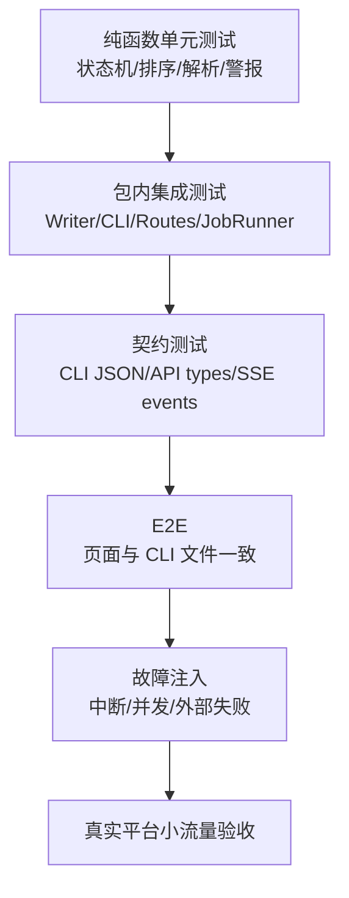

# 测试、运维、安全与课程实施计划

## 1. 交付结论

当前参考项目已经具备较完整的 Core、CLI、Server、UI、CC Stream 和 E2E 测试骨架，但“能在作者机器运行”不等于“可以作为训练营交付”。后续实施应先完成脱敏和可移植基线，再按九个课程里程碑切 starter/checkpoints/labs，最后才接真实外部平台。

本计划不在当前回合执行代码改造，只定义后续工作包、门禁和验收证据。

## 2. 当前测试体系

### 2.1 单元与集成测试

运行入口：

```bash
cd tools/console
npm test
```

测试框架为 Vitest，覆盖：

- Core：parser、state、snapshot、alerts、Doctor、Writer、YAML edit。
- CLI：全部主要读写命令、dry-run、历史事故回归。
- Server：鉴权、路由、白名单、Store、JobRunner、verdict、路径安全。
- CC Stream：spawn、normalize、milestone、transport fixture。
- UI：API/SSE/Store 纯逻辑、组件显示逻辑。

2026-08-24 已在当前工作区实际执行，结果为：

```text
Test Files  77 passed (77)
Tests       953 passed (953)
guard       371 个入库文件无内部标识关键词
```

这证明当前控制台代码的构建和测试基线通过，不代表业务内容账本没有历史告警。

### 2.2 E2E

入口：

```bash
cd tools/console
npm run e2e
```

当前 E2E 覆盖六个业务页：

- P1 总览。
- P2 生产看板。
- P3 内容详情。
- P4 选题池。
- P5 治理线。
- P6 数据复盘空态。

部分断言会把页面计数与 `media ... --json` 对照，符合“页面不是第二真相源”的验收原则。

### 2.3 业务检查

```bash
media check --json
media doctor --all --json
```

Check 与 Doctor 是产品运行门禁，不应被普通测试替代。

2026-08-24 当前主仓的只读实测基线：

| 命令 | 结果 | 解释 |
|---|---|---|
| `media check --json` | 25 条告警：3 error、18 warn、4 info；退出码 1 | 存在 backlog/meta 不同步、历史 scheduled 超时和发布链接待补等账本债 |
| `media doctor --all --json` | 40 条告警：5 error、24 warn、11 info；退出码 1 | 存在历史时间戳缺失、旧发布物料字段和归档媒体缺失等产物债 |

因此当前事实是“代码测试全绿，业务数据体检未绿”。后续制作公开 `reference/` 或 checkpoint 时，必须明确选择：修复这些历史债，或把它们迁入专门的故障 fixture；不能把带 error 的当前主仓直接当成课程健康基线。

## 3. 测试金字塔



真实平台验收位于最顶层，不能成为开发阶段唯一反馈环。

## 4. 关键测试矩阵

### 4.1 Core / CLI

| 场景 | 期望 |
|---|---|
| 合法 meta 迁移 | 状态、时间戳和审计正确 |
| 非法迁移 | `E_ILLEGAL_TRANSITION`，零写入 |
| rejected 无 reason | `E_MISSING_REASON` |
| promote | backlog、content 目录、meta、next_up、dashboard 一次完成 |
| publish-done | meta/backlog/dashboard 三翻齐 |
| dry-run | 只返回 Diff，不生成锁外副作用 |
| 并发写 | 第二个命令 `E_LOCKED` |
| 陈旧锁 | 仅死 pid + 超阈值允许抢占 |
| YAML 注释 | 最小编辑后保留 |
| Check/Doctor | 规则 key、level、证据路径稳定 |

### 4.2 Server

| 场景 | 期望 |
|---|---|
| 缺 token | 401 `AUTH_BAD_TOKEN` |
| 非法 slug/id/path | 400 或 `PATH_FORBIDDEN` |
| Server 参数白名单 | 不存在任意命令注入通路 |
| media 业务拒绝 | 409 `MEDIA_REJECTED` |
| media 不可用 | 502，有绝对路径兜底 |
| 单文件 parse error | 其它 API 正常，页面能降级 |
| Watcher 变化 | revision 自增、SSE refresh |
| Job 重复 | 409 `JOB_DUPLICATE` |
| Job 终局 | 先 verifying，再按 verdict 落终态 |
| Server 重启 | result.json 可查询，业务文件事实不丢 |

### 4.3 UI

| 场景 | 期望 |
|---|---|
| 首次 `#token` | 路由初始化前消费，不报首屏错误 |
| API 401 | 给出获取入口的可操作提示 |
| SSE 断线 | 显示状态并自动重连，页面可手动刷新 |
| revision 更新 | 页面数据重拉 |
| 快写 dry-run | 展示文件变化，再确认正式写 |
| 慢作业 | queued/running/verifying/terminal 全部可见 |
| 取消 Job | 正在停止与最终 cancelled 区分 |
| parse error 条目 | 不拖垮整个看板 |
| 页面计数 | 与 API/CLI 口径一致 |

### 4.4 Agent 与外部工具

| 场景 | 期望 |
|---|---|
| 选题池为空 | 停产并发阻塞通知 |
| TTS 余额不足 | status 保持 drafting |
| 音频缺段 | Reviewer FAIL，不录屏 |
| 三轮配音失败 | 升级人审 |
| headless 字幕缺失 | 抽帧失败，修复后重录 |
| approved 缺 mp4 | Doctor error，禁止发布 |
| cookie 失效 | 不自动登录，不 publish-done |
| 子进程说成功但 meta 未变 | Job failed |
| 治理任务无新账本 | harness-run failed |
| 提议应用无 brain Diff | apply-proposal failed |

## 5. 故障注入 Labs

课程至少提供以下可复现实验：

### Lab 1：手改状态造成双层不一致

- 注入：只把 meta 改成 published，不改 backlog。
- 观察：CHK-01 error。
- 修复：通过受控命令或 fixture reset 恢复。
- 学习点：为什么状态写入权要收口。

### Lab 2：写进程中断

- 注入：在临时文件已写、rename 前终止进程。
- 观察：目标文件保持完整，出现孤儿 temp。
- 学习点：temp-then-rename 的边界。

### Lab 3：并发写与陈旧锁

- 注入：同时启动两个写命令；再制造死 pid 锁。
- 观察：活锁拒绝、陈旧锁受控抢占、审计留痕。

### Lab 4：Agent 假成功

- 注入：Job 输出“完成”，但不翻目标状态。
- 观察：verdict 失败。
- 学习点：过程信号与业务事实分离。

### Lab 5：发布外部失败

- 注入：cookie 无效或模拟上传失败。
- 观察：状态不进入 published，Job 有错误和日志。

### Lab 6：SSE 断线与 Server 重启

- 注入：任务运行时刷新页面、断网、重启 Server。
- 观察：页面重连；终态日志可回放；运行中的任务不会被虚构恢复。

### Lab 7：治理越权

- 注入：让治理 Skill 试图直接修改 brain。
- 观察：任务契约/验收拒绝，报告仍可保留。
- 学习点：提议和应用分离。

## 6. 运维方案

### 6.1 本地启动

```bash
cd tools/console
npm run build
bash start.sh start
bash start.sh status
```

访问 URL 由 status 输出，形如：

```text
http://127.0.0.1:5170/#token=<token>
```

### 6.2 健康检查

- `/api/health`：Server、Snapshot、Watcher、Job、tick。
- `media check --json`：业务账本。
- `media doctor --all --json`：内容产物。
- `tools/console/logs/server.log`：Server 日志。
- `tools/console/logs/audit.jsonl`：写事务审计。
- `tools/console/logs/jobs/`：Agent 原始日志和终态。
- `harness/logs/index.jsonl`：治理执行账本。

### 6.3 常驻

当前 macOS 方案使用 launchd `RunAtLoad + KeepAlive`。公开课程不能直接复用含绝对路径的 plist，应提供生成脚本或模板，并说明与 `start.sh start/restart` 互斥。

### 6.4 备份与恢复

- 业务事实由 Git 管理，提交前检查是否包含凭证和大媒体。
- `assets` 中的大视频是否进入 Git/LFS/外部存储需课程仓单独决策。
- `.runtime/token`、外部 cookie、`.env` 不入库。
- Job logs 和 audit 可以按保留策略归档，不应无限增长。
- 恢复优先读取 meta/backlog/harness 账本，不从 dashboard 或 UI 缓存反推。

## 7. 安全方案

### 7.1 本地网络边界

- Server 监听 `127.0.0.1`，默认不对局域网开放。
- token 为随机 24 字节 base64url，文件权限 `0600`。
- 普通 API 使用 Bearer header，降低 URL/日志泄漏。

### 7.2 命令执行

- 快写使用 `execFile` 参数数组，不经过 shell。
- endpoint 到 args 只有一份白名单映射。
- slug、id、task、job id、report path 都有格式校验。
- 无头 CC 的工具白名单固定，后续可按 Job 类型继续收紧。

### 7.3 文件访问

- 只允许仓根相对路径。
- 拒绝路径穿越和根目录逃逸。
- 大文本有大小限制。
- 媒体 URL 也需要 token。

### 7.4 凭证与隐私

- TTS、图像、飞书、抖音凭证只通过环境或本地配置注入。
- 公开参考仓不得包含真实账号 cookie、App Secret、API key、个人手机号或企业内部链接。
- 日志展示工具输入/输出时要防止把环境变量和凭证原文暴露到 UI。
- 课程截图和 fixture 需再次脱敏。

### 7.5 不可逆动作

- 真实发布、公开仓库、删除历史资产等必须单独授权。
- dry-run 不是发布授权；审核通过也不是发布授权。
- 课程默认应优先模拟发布，真实发布作为自愿扩展。

## 8. 监控与告警

### 8.1 P0 指标

- Server 是否存活、revision 是否更新。
- Snapshot parse error 数。
- Check error/warn/info 数。
- Job active、queued、失败、取消和 stalling。
- 工作日是否空跑。
- review 积压和 scheduled 超时。
- 选题池 idea 水位和最近 ideate 时间。
- retro 7d 欠账数量。
- 外部通道连续失败次数。

### 8.2 告警通道

- 生产阻塞：飞书即时通知。
- 治理可延迟故障：报告记录；连续失败达到任务卡阈值后飞书告警。
- Server 本地故障：status/health + 日志；课程环境可额外提供终端诊断脚本。

## 9. 课程实施路线

### 9.1 总体阶段

| 阶段 | 工作 | 产物 | 退出门禁 |
|---|---|---|---|
| W0 | 基线冻结与脱敏 | reference 基线、许可证、依赖清单 | 无绝对路径/凭证/内部信息 |
| W1 | Starter 设计 | 最小骨架、样例账号、第一任务 | 新机器可初始化 |
| W2 | M1–M3 checkpoint | Agent 协作与流程建模 | 每个 checkpoint 可独立验收 |
| W3 | M4–M6 checkpoint | 生产线、CLI、状态机 | 主链路与故障注入通过 |
| W4 | M7–M9 checkpoint | 人闸、治理闭环、迁移 | 大环和毕业项目模板完成 |
| W5 | Labs 与助教材料 | 故障 fixture、rubric、答案 | 可重复 reset，证据标准统一 |
| W6 | 试运行 | 小班内测、问题清单、版本锁定 | P0 阻塞清零 |

### 9.2 九个里程碑建议

| 里程碑 | 目标 | 主要代码/文档增量 |
|---|---|---|
| M1 | 写出 Agent 任务契约 | CLAUDE、Prompt、最小运行记录 |
| M2 | 分清规则、SOP、Skill | brain、pipeline、skill 骨架 |
| M3 | 建模工作单元与状态 | content 模板、backlog、meta |
| M4 | 跑通选题到出审 | daily-run、创作产物、质量闸 |
| M5 | 建 Agent 友好 CLI | Core parser、JSON 信封、只读命令 |
| M6 | 收口状态与恢复 | Writer、状态机、锁、审计、Check |
| M7 | 建控制面与人闸 | Server、UI、SSE、飞书、发布确认 |
| M8 | 建治理线与复盘 | tasks、dispatcher、retro、提议 |
| M9 | 组装大环并跨域迁移 | 完整 Loop、故障演练、毕业项目 |

### 9.3 Checkpoint 制作规则

每个 checkpoint 必须包含：

- `README.md`：本章结论、任务、输入、完成定义。
- 起始代码与数据，不含下一章答案。
- 参考 Git Diff 或补丁。
- 单元/集成/E2E 验收命令。
- 至少一个失败 fixture。
- 四类证据提交模板。
- 从上一 checkpoint 升级的迁移说明。

## 10. 工作量拆分

以下是方案级估算，负责人和排期需另行拍板：

| 工作包 | 估时 | 角色 |
|---|---:|---|
| 基线脱敏、配置化、许可证复核 | 3–5 pd | Tech Lead |
| Starter 与公开样例账号 | 3–4 pd | 课程研发 + 内容 |
| 九个 checkpoint 切分 | 12–18 pd | 课程研发 |
| Labs 与 reset 工具 | 6–9 pd | QA + 课程研发 |
| UI/Server fixture 与模拟发布 | 5–8 pd | 前后端 |
| 27 篇正文与图位 | 15–25 pd | 课程作者 |
| 助教 rubric 与验收脚本 | 4–6 pd | QA + 助教 |
| 小班试运行与修订 | 5–10 pd | 全角色 |

总量受“Web 看板是否要求全实作”“是否接真实发布”两个待拍板项影响较大。

## 11. 发布门禁

训练营首次对外前，必须全部满足：

- 公开仓无绝对路径、凭证、内部链接和隐私信息。
- 所有 checkpoint 可从上一状态独立升级。
- `npm test`、E2E、Check、Doctor 全绿或有明确可接受豁免。
- 模拟主链路不依赖付费外部 API 也可完成。
- 真实发布默认关闭，启用步骤和风险清楚。
- 每个 Lab 能一键或按文档恢复。
- 课程正文引用的文件路径、命令和截图与锁定版本一致。
- 许可证覆盖代码、文档和第三方依赖。
- 学员数据和作业收集方式符合隐私要求。

## 12. 回滚策略

- 代码与课程文档按版本 tag 发布，checkpoint 不覆盖旧版。
- 外部工具升级先在兼容分支验证，失败回退到锁定版本。
- 真实发布 adapter 可通过配置切回 mock。
- UI/Server 课程模式有独立开关，不修改业务真相源格式。
- 数据 schema 变更提供向前迁移和备份，不用破坏性重写。
- 试运行出现 P0 问题时暂停招生或发布新批次，不让学员自行猜补丁。

## 13. 待拍板项

1. 首期是否允许真实抖音发布。
2. Web 看板是否要求学员完整实现。
3. 课程仓名、远端和可见性。
4. 视频等大媒体采用 Git LFS、Release 资产还是外部存储。
5. macOS 之外的正式支持范围。
6. 毕业项目个人/分组与助教配比。
7. 试运行时间、班级规模和通过标准。
