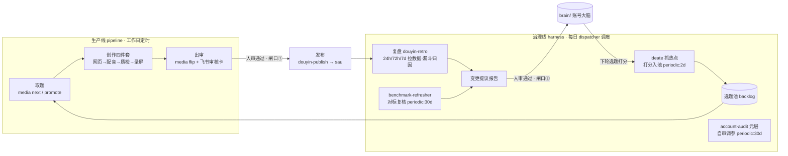

# 02 · 模块课程详细设计

> 上游：`00-ADR.md`（原则/亮点/心法线/分支制 D5）、`01-课程大纲.md`（课级规划）。本文把大纲下钻到**章节级**：模块 → 子课程 → 子课程目标 → 章节。正文写作以本文的章节表为提纲。
>
> 当前覆盖：**开篇（第 0 课）+ 模块一**（第 1–4 课）**+ 模块二**（第 5–8 课）**+ 模块五**（第 15–18 课）。模块三（第 9–10 课）、模块四（第 11–14 课）按同一格式增补。
> 章节表中「素材」= 正文取材的本仓一手文件。「类型」列标注章节在 ADR 每课骨架（地图/跟做/深挖/加油站/清单）中的角色——**这是给写作者看的脚手架**；章节标题本身按内容自然命名，学员面前不出现「跟做①」「原理深挖」这类模板词。

---

## 开篇 · 第 0 课 课程介绍与目标（不入模块，无代码分支）

- **课程定位**：开篇导览课，纯阅读无跟做。原第 1 课的「一天实录」「五段生长史」迁入本课；职责是宏观叙事——让学员在动手前看见「它真的在跑」「它是怎么组成的」「我学完能带走什么」。全部素材真实：实录取自 `pipeline/logs/`，数据取自已发布内容，架构对着仓库现状画，不画愿景图。
- **子课程目标**
  1. 建立全局图景：完整看一遍系统无人运行的一天，以及它已经产出的真实效果；
  2. 用技术视角拆开这套 Loop：前端/后端架构各是什么、Loop 数据流怎么转一圈；
  3. 明确三条收获线与结课产出（课程收获地图），完成学前自查（依赖、分支用法、跟做方式）。

| 章节 | 名称 | 类型 | 内容要点 | 素材 |
|---|---|---|---|---|
| 0.1 | 早上八点，AI 已经把活干完了 | 导览 | 一天真实运行实录走读：定时 agent 取题 → 创作（网页/配音/质检/录屏）→ 出审 → 飞书弹审核卡，人只点了两次按钮。逐段贴日志原文，标出「这是 AI 判断」「这是代码执行」「这是人进场」三种颜色 | `pipeline/logs/` 任一日实录、`pipeline/daily-run.md` |
| 0.2 | 我做出来的效果 | 导览 | 拿真实成果说话：已发布剧集清单与截图（成片画面/封面墙/抖音主页）、无人日更跑了多久、一条视频从取题到出审的耗时、飞书审核卡长什么样。诚实叙事：也说清哪里还要人（发布确认、复盘提议审批） | `content/` 已发布条目、`dashboard.md`、飞书卡截图 |
| 0.3 | 一张图看懂这套 Loop | 地图 | **Loop 全景流程图**（草图见本节后附，正文轮出精修图）：生产线（取题→创作→出审→人审→发布）+ 治理线（复盘/抓热点养池/对标复核/元层自审）+ 大环（发布→数据→提议→人审→brain→下轮打分）。指认两条铁律在图上的位置：全自动停在人审前、治理线只产报告不自动改 | `CLAUDE.md` 系统一句话、`harness/README.md` |
| 0.4 | 技术架构·前端：把内容「演」出来的那一层 | 地图 | ① 内容呈现层：`web-video-presentation` 产出的 Vite + React + TS 项目——「网页伪装视频」、点击驱动时间线、headless 无人录屏出 mp4；② 工作台：控制台 Web UI（`tools/console/packages/ui`）与 `dashboard.md` 派生视图。点透：这个系统的「前端」不是给用户的 App，是给内容和操作者的两块屏 | `tools/console/packages/ui`、web-video-presentation SKILL.md |
| 0.5 | 技术架构·后端：没有数据库的后端 | 地图 | 四层拆解：① **AI 编排层**——Claude Code + skills + subagents + 定时 agent，markdown SOP 就是编排代码；② **领域层**——`media` CLI（`packages/core`：state/alerts/atomic writer，状态规则唯一定义处）；③ **服务层**——console server + cc-stream、feishu-bot（Python：审批卡/按钮回调/发布触发）、sau 发布引擎（Python + 浏览器自动化）；④ **数据层**——没有数据库，git 仓库文件就是真相源（meta.yaml / backlog.yaml / index.jsonl 账本）。点透设计取向：判断归 LLM、确定性归代码、状态归文件 | `tools/console/packages/*`、`tools/feishu-bot/`、`tools/social-auto-upload` |
| 0.6 | 系统的五段生长史 = 你的学习路线 | 地图 | 课程总动线 = 系统真实演化顺序：单条视频→内容工厂→无人值守→治理线→Loop 方法论；每段末尾的「痛点」就是下一模块的开场（对应 01 大纲总动线图） | `01-课程大纲.md` 总动线图 |
| 0.7 | 你能学到什么：课程收获地图 | 地图 | **课程收获地图（draw.io 图，源文件 `assets/course-learning-map.drawio`）**：三条收获线（①一套自己的自闭环系统 ②Loop 七要素设计思想 ③六条 AI 协作心法）各自展开到具体条目，底部是结课检查清单七件产出。逐条口头预告在哪个模块拿到 | `assets/course-learning-map.drawio`、ADR 第五节 |
| 0.8 | 学前须知 | 清单 | ① 受众自查（会用 AI 工具即可，不要求工程背景）；② 依赖分级表（必需/推荐/可选 + 免费替代，引用 ADR 第七节，不复述）；③ 分支怎么用：一课一分支、`git diff` 相邻分支看增量、卡壳 checkout 参考态（引用 ADR D5）；④ 跟做方式：每课「地图→动手→原理→清单」的节奏说明 | `00-ADR.md` 七、D5 |

**Loop 全景流程图（0.3 用，草图）**——正文轮基于此出精修图，草图先钉住节点与边，防正文漂移：

**制图约定**（本课两张图 + 后续课程图）：图源文件统一住本 spec 目录 `assets/`（正文轮定了 `course/` 落位后随正文迁移）；draw.io（`.drawio`）为可编辑源，正文嵌入其导出的 png/svg，改图只改源文件再重导出，防图文两处漂移。收获地图已产（`assets/course-learning-map.drawio`）；Loop 精修图、前后端架构图在正文轮产出。

---

## 模块一 · 单点跑通：第一条口播视频

- **模块目标**：不讲系统设计大词，学员用三个开源 skill 拼出一条带配音、带字幕、无人录屏的完整口播视频。所有原理只挂在「手上刚发生的事」上。
- **模块里程碑**：学员手里有一条自己的成片 `final.mp4` + 竖版封面；并被引导说出模块二的问题——「第二条、第十条呢？状态谁记？」
- **涉及分支**：`01-setup` → `02-web-video` → `03-tts-dubbing` → `04-review-gate`（链式累积，见 ADR D5）。
- **外部依赖**：Claude Code（必需）；TTS（第 3 课起，推荐 MiniMax、可免费替代）；图像生成 API（第 4 课，可选）。

---

### 第 1 课 · 装备上手：让 AI 替你干活的最小配置

- **分支**：起点 =（无），完成 = `01-setup`（orphan 最小骨架：空目录约定 + 学员自己的 CLAUDE.md 雏形）
- **子课程目标**
  1. 装好 Claude Code，建立会话 / skill / CLAUDE.md 三个最小概念，完成第一次「让 AI 干活」；
  2. 摸一遍课程仓真身，建立自己的 `01-setup` 起点工作区；
  3. 初步理解「AI 时代为什么用 CLI」——这条线索将贯穿全课。

| 章节 | 名称 | 类型 | 内容要点 | 素材 |
|---|---|---|---|---|
| 1.1 | 从看热闹到上手 | 地图 | 第 0 课看完了全景与收获地图，本课把装备穿上：装工具、认概念、摸真身；本课结束时你有自己的起点骨架 | 本文开篇节回指 |
| 1.2 | 先让 AI 替你干一件小事 | 跟做 | 装 Claude Code、登录、权限模式一句话说明；用一个非编程小任务体验「描述意图 → AI 执行」 | — |
| 1.3 | AI 的说明书与宪法：skill 和 CLAUDE.md | 跟做 | skill = 给 AI 的方法论说明书（目录结构、`/` 调用与自动触发）；CLAUDE.md = 项目宪法（AI 每次干活前必读的硬约束）。装一个最简 skill 跑通 | `CLAUDE.md`、任一 `.claude/skills/*/SKILL.md` 头部 |
| 1.4 | 把课程仓请回家，摸一遍真身 | 跟做 | clone 后在 `main` 走读目录（brain / pipeline / harness / content / tools 各一句话，对着第 0 课架构图找实物）；跑 `media check --json` 感受「系统在自我体检」；checkout `01-setup` 作为自己的起点骨架 | `README.md`、`tools/console` |
| 1.5 | AI 时代为什么用 CLI | 深挖 | 文本进文本出 = LLM 的母语；可组合、可定时、可留痕；对比 GUI 自动化的脆弱。只开题不讲透，第 6 课回扣 | ADR 亮点 1 |
| 1.6 | 把说明书交给 AI，而不是把步骤背给自己 | 加油站 | skill 的本质：人沉淀方法论一次，AI 每次加载执行——这是全课「能不造轮子就不造」的第一块基石 | — |
| 1.7 | 出发前清点行囊 | 清单 | ① Claude Code 可用 ② 装过并调用过一个 skill ③ 在 main 跑通过 `media check` ④ 本地有 `01-setup` 分支工作区 | — |

---

### 第 2 课 · 开源件直用：web-video-presentation，从一篇文章到「伪装成视频的网页」

- **分支**：起点 = `01-setup`，完成 = `02-web-video`（含 skill 拷贝 + 学员自己的 script.md / outline.md / presentation 项目）
- **子课程目标**
  1. copy 开源 skill 走完 Phase 1→2：从自己的一篇文章产出口播稿、outline 与完整可点击的网页演示；
  2. 理解长任务 skill 的分层设计——Phase 切分与 Checkpoint 硬节点是「人机对齐点」；
  3. 掌握口播稿写作三律（3 秒钩子 / 冷开 / 口语化）。

| 章节 | 名称 | 类型 | 内容要点 | 素材 |
|---|---|---|---|---|
| 2.1 | 四件套的第一件 | 地图 | 口播视频链路 = 网页（本课）→ 配音（第 3 课）→ 质检（第 4 课）→ 录屏（第 4 课）；网页是整条时间线的骨架 | `pipeline/2-create.md` 分支 A 总览 |
| 2.2 | 把开源 skill 请进来 | 跟做 | copy `web-video-presentation` 到 `.claude/skills/`；读 SKILL.md 的工作流总览图（先看地图再上路）；「开源直用」教法说明：不改它，学它 | `.claude/skills/web-video-presentation/SKILL.md` |
| 2.3 | 备料：你的第一篇口播稿 | 跟做 | 选一篇自己的文章/笔记当 article.md；顺势讲口播稿三律——3 秒钩子、冷开铁律（第一句自成立，用 L11「上一集」事故引入）、口语化不写论文腔 | `lessons.md` L11、`pipeline/2-create.md` 步骤 1 |
| 2.4 | 一次产出稿子与计划，然后停下来 | 跟做 | 跑 Phase 1 产 script.md + outline.md；在 **Checkpoint Plan 停下**，逐项对齐五件事（稿子/outline/主题/素材/开发模式）；体验「AI 停下来问你」和「AI 一路跑到黑」的区别。**心法现场**：对齐拍板的结论当场落进 script/outline——关键结论落文档，不留在对话里（对话会结束，文档才是共享记忆） | SKILL.md Phase 1 + Checkpoint Plan |
| 2.5 | 第 1 章亲自验收，剩下的放手 | 跟做 | 脚手架 → 第 1 章 = 主线程完整版本（强制 anchor）→ **硬节点人工验收第 1 章**（不可跳过）→ 选开发模式（A 逐章 / B 顺序 / C 并行）完成剩余章节 → 本地点击走完全片 | SKILL.md Phase 2 |
| 2.6 | 长任务 skill 怎么分层 | 深挖 | Phase = 阶段切分；Checkpoint = 人机对齐点（放在返工成本突变处：稿子定了才开发、第 1 章过了才批量）；「outline 只规划节奏不规划动画」= 计划与创作的职责切分。对比无 checkpoint 的一次到黑：错到最后才发现 | SKILL.md、ADR 亮点 2 |
| 2.7 | 网页为什么能伪装成视频 | 深挖 | 点击驱动 = 确定性时间线：每次点击推进一个口播节拍、每步独占整屏——这个设计选择让第 4 课的「无人录屏」成为可能（伏笔明示） | SKILL.md 设计说明 |
| 2.8 | 三种开发节奏，和背后的并行 agent | 加油站 | A 逐章 / B 顺序 / C 并行 = 三种人机协作节奏；C 模式背后是多 agent 分章并做——为第 4 课 Subagent 正式登场打伏笔 | SKILL.md Phase 2.3 |
| 2.9 | 收工自查：能从头点到尾吗 | 清单 | ① script.md / outline.md / presentation 项目齐 ② Checkpoint Plan 五件事逐项对齐过 ③ 第 1 章经人工验收 ④ 网页可从头点到尾 ⑤ 第一句冷开自成立 | — |

---

### 第 3 课 · 配音链：tts-dub 与「真相源」的第一堂课

- **分支**：起点 = `02-web-video`，完成 = `03-tts-dubbing`（含 audio-segments.json、tts.config.json 模板、public/audio/ 成品段）
- **子课程目标**
  1. 从网页项目抽出分段文案并批量合成配音，处理一个多音字、清一次死气；
  2. 建立**真相源与派生件**纪律——本课核心心智模型，用 L2 事故讲透代价；
  3. 学会给 AI 的任务定「机器可验的完成判据」。

| 章节 | 名称 | 类型 | 内容要点 | 素材 |
|---|---|---|---|---|
| 3.1 | 给时间线配上声音 | 地图 | 四件套第二件；本课产物（每段 mp3）是第 4 课录屏 mux 的原料 | `pipeline/2-create.md` 步骤 3 |
| 3.2 | 从网页里抽出分段文案 | 跟做 | `npm run extract-narrations` → `audio-segments.json`；现场画出派生链：`2-script.md`（真相源）→ `narrations.ts` → `audio-segments.json`（合成只认它） | `pipeline/2-create.md` 步骤 2–3 |
| 3.3 | 配置你的声音 | 跟做 | `tts.config.json`：音色 / 语速 / overrides 结构；供应商选择：MiniMax（推荐）或免费 TTS（edge-tts 等，skill 本身 provider-agnostic）；模板化配置不进 git（ADR D5 安全红线） | `brain/tts.config.json` |
| 3.4 | 批量合成前，先探一下余额 | 跟做 | 先单段试合成探余额，再批量；讲 L9：余额尽（1008）要「停在明确状态 + 报人」，不硬跑不静默——无人系统对外部依赖的标准姿势（第 10 课回扣） | `lessons.md` L9 |
| 3.5 | 多音字与死气：TTS 的两类典型病 | 跟做 | 多音字：overrides 逐段注音（L10）；同段两读无解要改文案（L17）；增删段必重排 overrides 键（L18）。死气：silencedetect 扫 >0.45s → depause 去停顿——**必须写临时文件再 move、跑完复扫验数为 0**（L16 静默失败事故现场重演） | `lessons.md` L10/L16/L17/L18 |
| 3.6 | 一次音画不符事故：真相源与派生件 | 深挖 | L2 事故完整复盘：改了 narration 没重抽，画面新钩子、声音旧钩子，连过两轮截图检查都没抓到。规则：**改上游必重抽下游、必删旧产物再合成**；真相源纪律是一切多产物流水线的地基（第 5、15 课回扣） | `lessons.md` L2、`pipeline/2-create.md` 真相源铁律 |
| 3.7 | 轮子坏了怎么办 | 深挖 | skill 自带的 mmx CLI 是坏的 → 绕开直调 HTTP。「能不造轮子就不造」的完整版：直用 > 换胎 > 包装 > 自建，逐级升级、每级都要说得出理由（第 7 课接「包装」级） | `pipeline/2-create.md` 步骤 3 注 |
| 3.8 | 「命令没报错」不等于「干成了」 | 加油站 | 验产物不验 exit code（复扫数为 0 才算完）。给 AI 派活时把判据写进任务——这是后面一切自动化闸口的原型 | `lessons.md` L16 |
| 3.9 | 收工自查：复扫数为 0 才算完 | 清单 | ① 全部段 mp3 生成且落位正确 ② 至少处理过 1 个多音字 ③ silencedetect 复扫死气数为 0 ④ 能口述派生链并说出「改稿后要做哪三步」 | — |

---

### 第 4 课 · 质检闸口与成片：第一次派 Subagent

- **分支**：起点 = `03-tts-dubbing`，完成 = `04-review-gate`（含 reviewer agent 定义、final.mp4、cover.png、终检清单）
- **子课程目标**
  1. 照抄 dubbing-reviewer 派出第一个质检 subagent，跑通 PASS/FAIL 修复循环；
  2. 无人录屏出成片、抽帧体检、生成竖版封面，走完终检闸；
  3. 理解 Subagent 职责分离与「检查前置」的终检闸设计。

| 章节 | 名称 | 类型 | 内容要点 | 素材 |
|---|---|---|---|---|
| 4.1 | 最后一公里 | 地图 | 素材已齐（网页 + 配音），本课三件事：质检 → 录屏 → 封面；出模块一里程碑 | `pipeline/2-create.md` 步骤 4–6 |
| 4.2 | 请进第一位质检员 | 跟做 | `.claude/agents/` 下的 agent 定义文件长什么样（角色/工具权限/**无 Edit/Write**）；照抄 dubbing-reviewer 进自己的仓 | `.claude/agents/` dubbing-reviewer 定义 |
| 4.3 | PASS 还是 FAIL：第一轮质检循环 | 跟做 | 派 reviewer 审配音批次（完整性/语速离群/多音字/音画一致）→ 回 PASS 或 FAIL+每条改法 → FAIL 由主回话修复重合成 → 再派复审（带轮次号）→ ≤3 轮，超限升级人审 | `pipeline/2-create.md` 步骤 4 |
| 4.4 | 无人录屏与录后体检 | 跟做 | `npm run build && npm run record -- --serve --out final.mp4`（headless 确定性渲染 + 自动 mux）；L15 字幕坑：`--serve` 覆盖 `--url` 导致漏 `?subs=1`，录后必须抽帧验「字幕已烧入」；查 headless 拉伸（webm 时长 > 墙钟则去拉伸） | `pipeline/2-create.md` 步骤 5、`lessons.md` L15 |
| 4.5 | 封面：独立的发布物料 | 跟做 | 竖版 9:16 封面生成（图像 skill 或任意文生图手动出）；L1 事故：拿横屏视频帧充数、让模型自由发挥编出仓鼠——封面要锁风格锚点；封面不入录屏，改封面无需重录 | `pipeline/2-create.md` 步骤 6、`lessons.md` L1 |
| 4.6 | 终检闸：一次过完，再交审 | 跟做 | 在**最终 mp4** 上过：A 声画一致 / B 音频自然度 / C 钩子冷启动 / D 事实合规 / E 封面 / F 音画同步 /（G 发布物料本模块先留白，第 7 课补齐并说明为什么）| `pipeline/2-create.md` 终检闸 |
| 4.7 | 质检员为什么不能自己动手改 | 深挖 | 只判不改（无写权限）：既防「自己检查自己」的动机污染，也防质检顺手改出新问题；修复权归主回话；3 轮上限 = 自动循环要有出口，出口通向人。这套「闸口 + 分权 + 上限」范式贯穿后面所有自动化环节 | ADR 亮点 11 |
| 4.8 | 为什么所有检查要一次过完 | 深挖 | L4 事故：钩子、封面、音画、死气各炸一轮、反复重渲染，有的过审后才发现。规则：所有检查一次性前置过完再交审；**验成品不验半成品**（组件截图只证明画面，不证明声音/节奏/成片） | `lessons.md` L4 |
| 4.9 | 你已经有了一支最小 Agent Team | 加油站 | 何时派子代理：需要独立判断（质检）/ 可并行（第 2 课模式 C）/ 需要权限隔离（只读）。何时不派：主线修复类工作留在主会话。本课「主回话 + reviewer」就是最小 Agent Team。**心法主讲**：拆 agent 按判断独立性、权限、并行度拆，不按工作量拆 | ADR 亮点 11 |
| 4.10 | 里程碑:你的第一条成片 | 清单 | ① reviewer 至少跑过一轮且留有判定记录 ② final.mp4 字幕已烧入、音画同步 ③ 封面为竖版非视频帧 ④ 终检闸 A–F 逐项勾过。**抛出下一问**：第二条怎么办？谁记得每条到哪一步了？——进模块二 | — |

---

## 模块二 · 从作品到工厂：状态机与记账

- **模块目标**：把「一次成功」变成「可重复的流水线」。核心四件事：状态机与真相源账本（第 5 课）、CLI 记账与第一次 SDD（第 6 课）、发布与二次包装（第 7 课）、把人放进环里（第 8 课）。
- **模块里程碑**：学员拥有一条「取题→创作→出审→人审→确认→发布→记账」全链贯通、人审把关的流水线；并被引导说出模块三的问题——「还是要人每天来点火」。
- **涉及分支**：`05-content-factory` → `06-media-cli` → `07-publish-wrapper` → `08-human-review`（链式累积，见 ADR D5）。
- **外部依赖**：抖音账号（第 7 课，可选——无账号停在 dry-run）；飞书自建应用（第 8 课，推荐——可降级本地确认模式）。

---

### 第 5 课 · 内容工厂的骨架：目录、状态机、账号大脑

- **分支**：起点 = `04-review-gate`，完成 = `05-content-factory`（含 content/_template、_backlog 骨架、brain 五件初稿、dashboard 雏形）
- **子课程目标**
  1. 搭出内容工厂目录骨架：`content/`（一条内容一目录 + meta.yaml）、`content/_backlog/`（选题池总账）、`brain/`（账号大脑五件）、`dashboard.md`；
  2. 建立两个心智模型——**阶段是状态字段不是目录位置**、**真相源 vs 派生视图**；
  3. 用 AI 生成自己账号的 brain 五件套初稿，学会写「给 AI 消费的文档」。

| 章节 | 名称 | 类型 | 内容要点 | 素材 |
|---|---|---|---|---|
| 5.1 | 十条视频之后的乱账 | 地图 | 模块一结尾之问展开：条目多了以后「哪条在哪一步」靠脑子记必乱；本课先立骨架不产内容——工厂先有货架和账本，再谈开工 | 第 4 课结尾回指 |
| 5.2 | 一条内容住一个目录 | 跟做 | 照抄 `content/_template/`：meta.yaml + 编号文件（1-brief→5-retro，非全必产）+ assets；档案层（md+meta）进 git、工作区（build/demo）与媒体本体 gitignore | `content/_template/` README + meta.yaml |
| 5.3 | 阶段写在字段里，不写在文件夹上 | 深挖 | meta.yaml 的 status 字段承载生命周期 vs 「按阶段挪文件夹」方案：挪目录会断路径引用、断 git 历史、并发易撞；状态是数据不是位置 | meta.yaml、模板 README |
| 5.4 | 选题池，一本粗账 | 跟做 | `_backlog/backlog.yaml`：字段走读（id/track/score/tags…）；**双层状态**——backlog 管粗粒度三态、meta.yaml 管细粒度，互不镜像；双向指针（content_path ↔ meta.source）；`next_up` 人工钦点指针 | `backlog.yaml` 头注释 |
| 5.5 | 账号大脑五件套 | 跟做 | 用 AI 按课程仓模板生成自己的 positioning / persona / style-guide / sources / benchmarks 初稿；brain 是所有创作与选题决策的唯一依据，也是日后 Loop 反哺的唯一落点（伏笔明示） | `brain/` 五件 |
| 5.6 | 写给 AI 看的人设文档 | 写作技巧 | 与写给人看的差别：判据可执行（「开口 3 秒给钩子」而非「要有吸引力」）、禁忌具体到词、留「待补充」空位让复盘回填 | `brain/persona.md` |
| 5.7 | dashboard 只是投影 | 深挖 | 派生视图与真相源分工：dashboard 头部自我声明「本文件是派生视图，不是真相源」；状态真相 = 各 meta.yaml + backlog.yaml；第 3 课真相源纪律的系统级版本 | `dashboard.md` 头部 |
| 5.8 | 收工自查 | 清单 | ① 骨架四件齐（content/_template、_backlog、brain、dashboard）② brain 五件初稿成文 ③ 能口述双层状态账的分工 ④ 能说出「阶段为什么不是目录」 | — |

---

### 第 6 课 · 记账为什么要 CLI：用 SDD 让 AI 造出 media 命令

- **分支**：起点 = `05-content-factory`，完成 = `06-media-cli`（含学员的 spec 文档 + AI 生成的记账 CLI + 契约用例）
- **子课程目标**
  1. 亲历一次「让 AI 自觉记账」的失败实验，理解**判断归 LLM、确定性归代码**；
  2. 完成第一次完整 SDD：人写 spec（状态合法值、迁移规则、四个子命令契约），AI 生成 CLI，全程不看实现；
  3. 学会用契约用例验收，而不是 review 代码。

| 章节 | 名称 | 类型 | 内容要点 | 素材 |
|---|---|---|---|---|
| 6.1 | 先让 AI 自觉记账，看它怎么漏 | 跟做 | 第 1 课埋的伏笔兑现：实验——让 AI 直接管三处账（meta/backlog/dashboard），连翻几轮状态后盘账；本仓实证：backlog 漏翻曾发生两次，靠事后补账 | `pipeline/4-publish.md` 发布收尾注 |
| 6.2 | 为什么它必然漏 | 深挖 | 每次对话都在重新发明规则：多处一致性是确定性活，交给概率模型等于每次掷骰子；亮点 1 正面讲透——LLM 干判断活（slug 怎么起、题好不好），确定性活压进代码 | — |
| 6.3 | 写你的第一份 spec | 跟做 | spec 内容三块：状态合法值与迁移表（何时需 reason、经哪条命令）、四个子命令契约（next/promote/flip/check 的输入输出与错误）、非法操作的报错要求；生产版参照 `state.ts` 的迁移表结构 | `tools/console/packages/core/src/state.ts` |
| 6.4 | 让 AI 从 spec 造出 CLI | 跟做 | 派 AI 按 spec 生成；验收只跑契约用例：非法迁移要被拒且报出合法出边、promote 幂等性、check 能查出手工制造的坏账——不看一行实现 | — |
| 6.5 | 一条命令五处改齐 | 深挖 | `media promote` 的原子性：backlog 翻 picked + 回填 content_path + 清 next_up + 建内容目录 + 写 meta，五处一次改齐；把「容易漏的多处一致性」压进一个原子操作，是记账 CLI 的核心设计 | `pipeline/daily-run.md` 取题步骤 |
| 6.6 | check，同一个裁判 | 深挖 | 一致性规则唯一定义在代码（`alerts.ts`），AI 和人都信同一个裁判；第 1 课跑的那次体检、看到的那些告警，现在能看懂它怎么来的了 | `tools/console/packages/core/src/alerts.ts` |
| 6.7 | 规格是唯一要写的代码 | 加油站 | **SDD 正式登场**：人写规格、AI 写实现、契约用例验收；与第 2 课 outline 只管信息密度不管动画同构——规格与实现分工；后面第 9/12 课两次回扣 | — |
| 6.8 | 收工自查 | 清单 | ① 自己的 media CLI 四命令可用 ② 非法迁移被拒并报合法出边 ③ check 对当前仓干净 ④ 能说出 promote 改了哪五处 | — |

---

### 第 7 课 · 发布与二次包装：为什么不直接用 social-auto-upload

- **分支**：起点 = `06-media-cli`，完成 = `07-publish-wrapper`（含 sau 环境 + 学员自己的 publish skill + dry-run 留痕）
- **子课程目标**
  1. 装开源 `social-auto-upload`，裸用 sau CLI 走一遍（登录/校验/dry-run，有账号可真发）；
  2. 按 spec 让 AI 包出自己的 publish skill：状态校验 → 字段映射 → dry-run → `--publish` 单一授权 → 留痕；
  3. 理解**二次包装的判断标准**与**不可逆操作的自动化边界**。

| 章节 | 名称 | 类型 | 内容要点 | 素材 |
|---|---|---|---|---|
| 7.1 | 内容做完了，怎么送出门 | 地图 | 发布是全流水线唯一不可逆的外向动作；本课先裸用开源件，再包一层——轮子四级的第三级「包装」正式登场（第 3 课的伏笔） | 第 3 课轮子四级回指 |
| 7.2 | 裸用 social-auto-upload | 跟做 | 装 sau（uv + python）；`sau douyin login --headed` 扫码；`sau douyin check` 验 cookie；拼一条 upload-video 命令（无账号者到拼命令为止） | `tools/social-auto-upload` |
| 7.3 | 裸工具的三个缺口 | 深挖 | sau 什么都能发——它不认识你的状态机（drafting 的也能发）、没有授权确认（命令一敲就上传）、不留痕（发完无档案）；**包装补的是工具与系统契约之间的缝，不是重写工具** | `douyin-publish/SKILL.md` |
| 7.4 | 包一层，你自己的发布 skill | 跟做 | 写 spec 让 AI 生成：Step 0 校验（status 必须 approved + 物料齐）→ cookie 校验 → 字段映射拼 sau 命令 → dry-run 闸 → 真发 → 留痕回填；对照课程仓 douyin-publish 的五步工作流 | `douyin-publish/SKILL.md` 工作流 |
| 7.5 | dry-run 铁律与单一授权信号 | 深挖 | 不带 `--publish` 只拼完整命令+物料摘要、绝不执行；带 `--publish` = 授权已发生在上游，直接真发不再求确认（非交互场景会卡死在第二道确认上）；**授权信号要单一且语义明确**——亮点 5 | SKILL.md 铁律段 |
| 7.6 | 真实世界会抖 | 跟做 | L7 慢渲染超时、L8 UI 浮层挡按钮：失败先原样重试一次再排查，浏览器自动化就是会抖；cookie 失效不自动登录（扫码是人的事）；引擎坏了优先升级底层项目而非改封装 | `lessons.md` L7/L8 |
| 7.7 | 铁律为什么写在最前面 | 加油站 | 给 AI 的工具说明书怎么写：红线前置（skill 的铁律段在文件头，AI 读到工作流之前先读到禁令）；**心法主讲·铁律前置**——第 1 课 CLAUDE.md 实验的进阶版 | SKILL.md 结构 |
| 7.8 | 收工自查 | 清单 | ① dry-run 输出完整 sau 命令+物料摘要且未执行 ② 非 approved 状态被拒 ③ 失败重试路径能口述 ④（可选）真发过一条 | — |

---

### 第 8 课 · 人在环上：飞书双卡与闸口位置设计

- **分支**：起点 = `07-publish-wrapper`，完成 = `08-human-review`（含通知通道配置模板 + 双卡流程跑通记录）
- **子课程目标**
  1. 搭起自己的审批通道（飞书自建应用长连接，或降级本地确认模式），跑通「出审→审核卡→过审→确认发布卡→真发→记账」全链；
  2. 理解**闸口位置设计**与两次确认的分工；
  3. 掌握 Human-in-the-loop 模式——把人的进场做成结构化事件。

| 章节 | 名称 | 类型 | 内容要点 | 素材 |
|---|---|---|---|---|
| 8.1 | 流水线里只有两次点击 | 地图 | 全自动停在出审，人只在两个点进场：审内容、准发布；本课把这两次点击从「你在终端里盯着」搬进通知通道 | `pipeline/3-review.md` |
| 8.2 | 搭起通道 | 跟做 | 飞书自建应用 + 官方 SDK 长连接（无需公网）；出站 notify 发卡、入站 server 收按钮；config 含 secret 不进 git（安全红线回扣）；没有飞书就降级：本地确认模式（终端里问一句），契约不变通道可换 | `feishu-notify/SKILL.md`、`tools/feishu-bot/` |
| 8.3 | 第一张卡，审核 | 跟做 | 出审后推三样：口播稿全文 + 封面图 + 审核卡（通过/打回）——让人**看着真实内容**判断，不是看一行「请审核」；对照人审清单六条（事实/时效/定位/语气/合规/观感） | `3-review.md` 人审清单、notify.py |
| 8.4 | 第二张卡，确认发布 | 跟做 | 过审 → status=approved → server 拼最终 sau 命令+物料 → 推确认发布卡 → 人点确认 → `claude -p /publish <slug> --publish` 真发 → `media publish-done` 记账收尾；画完整时序图 | `4-publish.md`、server.py 流程 |
| 8.5 | 过审不等于发布授权 | 深挖 | 两张卡两个决策：审核卡审「内容质量行不行」，确认卡审「此刻要不要发」（看着最终真实物料与发布时间授权）；合并成一次点击 = 人在没看到最终物料时就授权了不可逆动作 | feishu-notify 设计说明 |
| 8.6 | 闸口为什么钉在这里 | 深挖 | **闸口位置设计**（亮点 6）：只放在不可逆点之前——更早（每步都问）人会疲劳成点头机器，更晚（发完再看）收不回来；第 2 课 Checkpoint 的系统级版本：返工成本突变处停，不可逆点前必停 | 第 2 课 6.1 回指 |
| 8.7 | 按钮怎么变成 --publish | 深挖 | 审批数据流走读：按钮点击 → server 收事件 → flip approved → 拼物料 → 确认点击 → 带 `--publish` 派发布——上一课「授权信号单一明确」在这里闭合：`--publish` 的来路就是那次点击 | server.py、第 7 课 7.5 回指 |
| 8.8 | 人的进场是结构化事件 | 加油站 | **Human-in-the-loop 通用模式**：口头同意（对话里说「可以发」）无法驱动系统；结构化事件（卡片按钮→状态翻转→命令标志）才可审计、可追溯、可自动化；第 11/14 课回扣（治理线人审、元层限幅） | — |
| 8.9 | 里程碑，一条有人把关的流水线 | 清单 | ① 全链跑通（出审→双卡→发布→记账）② 两张卡各自的决策能口述 ③ 状态账三处一致（meta/backlog/dashboard）④ check 干净。**抛出下一问**：链路全通，但每天还是要你来点火开工——进模块三 | — |

---

## 模块五 · 方法论提炼与结课（4 课）

- **模块目标**：把 Loop 的方法论提炼出来带走。本模块先讲系统怎么长记性（第 15 课），再补上一直被绕开的完整后端——把无头 AI 当一台进程管理，讲清消息解析与接口设计（第 16 课，**主链必经**）；接着把派生视图从文件升成屏（第 17 课，可选增强）；最后整课程回望，用 Loop 七要素把整门课收成一张总纲，带学员把这张图迁移到自己的领域（第 18 课）。
- **模块里程碑**：学员手里有自己会进化的 `lessons.md` + 一份最小后端闭环（读接口 + 快写 + 慢作业 + job runner，主链只要求理解设计）+ 一份一页纸最小 Loop 迁移设计。
- **涉及分支**：`15-lessons-memory` → `16-console-backend` → `17-console-ui`（链式累积，见 ADR D5；第 18 课结课不设代码分支）。
- **外部依赖**：Node 后端工具链（第 16 课，可选——主链只要求理解设计，可读课程仓 console server 成品）；Node 前端工具链（第 17 课，可选）。

---

### 第 15 课 · 系统怎么长记性：教训驱动进化

- **分支**：起点 = `14-account-audit`，完成 = `15-lessons-memory`（含学员自己的 lessons.md + 至少一条真实踩坑登记 + 规则回写 SOP 标 Lx 回指）
- **子课程目标**
  1. 建立自己的教训账本 `lessons.md`，把跟做过程中真实踩的坑登记成「故事」；
  2. 理解**故事与规则分离**：故事只写一处，规则回写对应 SOP 标 Lx 回指；
  3. 走读 L1–L18 全表，能指认每条坑如何变成前面课程里的某条铁律；收拢文档架构防漂移约定全景。

| 章节 | 名称 | 类型 | 内容要点 | 素材 |
|---|---|---|---|---|
| 15.1 | 系统也会熵增 | 地图 | 模块四讲完「系统自己养自己」，还有一个死角没顾上：池子会烂、打法会过时——这些结论都是踩出来的。本课让系统学会长记性：踩过的坑不重踩 | 模块四回指 |
| 15.2 | 教训账本：踩坑先登记故事 | 跟做 | 建立自己的 `lessons.md`：踩坑先登记「故事」（现象/根因/修法），不急着提炼规则；登记自己跟做时真实踩的坑（每个学员一定踩过） | `pipeline/lessons.md` 结构 |
| 15.3 | 规则住到该在的位置 | 跟做 | 故事沉淀后，规则回写对应 SOP 标 Lx 回指（如第 4 课终检闸引用 L15）；故事只住 lessons.md，SOP 只留标号——防 SOP 变成事故陈列馆 | `pipeline/lessons.md`、第 4 课 4.4 |
| 15.4 | 故事与规则分离 | 深挖 | 亮点 12 完整讲：故事只写一处（防 SOP 变事故陈列馆），规则住它该在的位置（防教训变没人读的博物馆）；两者靠 Lx 编号互链 | `pipeline/lessons.md` 全文 |
| 15.5 | L1–L18 全表导读 | 深挖 | 全表逐条走读：每条坑变成前面课程里的哪条铁律（L2→真相源纪律、L4→终检闸、L14→阻塞即上报、L16→验产物不验 exit code……）；教训不是历史，是每课判断的来路 | `pipeline/lessons.md` |
| 15.6 | 打法与坑分流 | 深挖 | 复盘沉淀的「打法」进 `brain/benchmarks.md`（正反馈），「坑」进 `lessons.md`（负反馈）——两条落点不同，正反馈指导选题打分，负反馈守住执行纪律 | `brain/benchmarks.md`、`pipeline/lessons.md` |
| 15.7 | 文档架构防漂移约定全景 | 深挖 | 把散在前面各课的约定收拢成一张全景：真相源唯一、派生视图标注、同一规则只写一处（Lx 回指）、历史存档只读——系统不只是内容会进化，文档体系也要防熵增 | `CLAUDE.md` 文档架构约定 |
| 15.8 | 收工自查 | 清单 | ① 自己的 lessons.md 建立 ② 至少登记 1 条真实踩坑（故事）③ 至少 1 条规则回写 SOP 标了 Lx ④ 能说出 L2/L4/L14/L16 各是哪条铁律的来路 | — |

---

### 第 16 课 · 后端架构：无头 AI 是一台进程，不是一张嘴

- **分支**：起点 = `15-lessons-memory`，完成 = `16-console-backend`（含学员的 spec 文档 + AI 生成的最小后端闭环：读接口 + 快写 + 慢作业 + job runner，全程不看实现）
- **子课程目标**
  1. 建立主判断：无头 AI 是一台进程，不是一张嘴——最小权限、判成败看它改的文件、容忍它死（状态可重建）；
  2. 用 SDD 让 AI 从 spec 造出最小后端闭环：读接口（信封）+ 快写 + 慢作业 + job runner，验收跑契约判据不看代码；
  3. 理解消息结构解析与 HTTP 接口设计的核心取舍：三层解析、信任分级、动作层白名单、快写/慢作业分界、token 按威胁模型定档。

| 章节 | 名称 | 类型 | 内容要点 | 素材 |
|---|---|---|---|---|
| 16.1 | 一直被绕开的完整后端 | 地图 | 第 8 课把无头 claude 当黑盒：喂一句 prompt，等它改完 meta.status 就走。黑盒主链够用，但任务一多黑盒就露三个缝：进程起了没、它在干什么、它是不是死了。本课拆开黑盒，把无头 AI 当一台进程管理 | 第 8 课回指、`0818-看板后端与CC进程调度技术方案.md` §1 |
| 16.2 | 无头 AI 是一台进程，不是一张嘴 | 深挖 | **主判断**：无头 AI 不是会说话的黑盒，是一台你 spawn 出来的进程。三个推论：最小权限（`--allowedTools` 白名单，模型叙述只是参考不是授权）、判成败看它改的文件（不看它的文字）、容忍它死（进程会崩，但状态在文件里，重建即恢复） | `0818-看板后端与CC进程调度技术方案.md` §6 |
| 16.3 | 拉起一个安全的无头 claude | 跟做 | 写 spawn claude -p 的最小安全版，四个防坑点逐条拆：env 剔除 `ANTHROPIC_API_KEY`（本机是 OAuth token，误当 API key → Invalid API key；剔除后回落 ~/.claude 登录凭证）；`--allowedTools` 白名单（最小工具面）；授权语义写死进 prompt（「人已在界面确认 = 授权」，不在运行时弹确认）；成败判定读状态不读文字（`result.is_error` 双重确认 + 复读 meta.status，绝不解析自然语言） | `0818-看板后端与CC进程调度技术方案.md` §6、`tools/console/packages/server` 实际 spawn 代码 |
| 16.4 | 别让两个发布同时跑 | 跟做 | 幂等锁与单并发：同 slug 同时只许一个任务（409 JOB_DUPLICATE，双击/回调重投都进不来——继承第 8 课 `_publishing` set 的教训）；单并发不引队列中间件（本地单人工具背不动，内存任务表 Map + 子进程句柄就够）；崩溃安全靠文件真相（server 挂了任务表丢了无所谓，真相在文件里，重启后快照 + media check 给出真实状态）。Job 状态机 queued → running → verifying → succeeded/failed，超时不直接判死先跑 verdict | `0818-看板后端与CC进程调度技术方案.md` §6、§9 |
| 16.5 | 读懂无头 AI 在说什么 | 深挖 | 概念铺垫（「job 快照」与「claude 无头输出事件流」这两个学员从没见过的概念先立起来）：claude 无头输出是机器可读的 stream-json 事件流，text / tool_use / tool_result 混排，一行一个 JSON；信任分级三层（text 只展示、tool_use 驱动步骤条、meta.status 唯一裁决）；三层解析（传输层 readline + JSON.parse 半行缓冲 → 事件归一层 6 种 NormEvent 按 tool_use.id 去重 → 里程碑引擎声明式匹配表 正则×tool_use）；cc-stream 为什么独立成零依赖叶子包（引擎进包、知识留外，五包边界硬切） | `02-后端执行方案.md`、`tools/console/packages/cc-stream` |
| 16.6 | 把进程的操作接成接口 | 跟做 | HTTP 接口设计四个取舍逐条过：动作层白名单 1:1（POST /api/actions/* 逐个映射 media 命令，execFile args 数组不经 shell，注入面为零——对比「自由转发」方案）；快写与慢作业两条通道（快写 execFile media 毫秒回；慢作业 spawn claude -p 回 202 + jobId，进度走 SSE，3 秒回调窗口与 202 的关系）；读响应信封统一 `{revision, now, data}`（前端拿 revision 当版本号，对比无结构响应）；token 按威胁模型定档（单机单用户不上认证系统，只 bind 127.0.0.1 防浏览器侧 CSRF） | `02-后端执行方案.md`、`01-CLI执行方案.md` |
| 16.7 | 最小后端闭环，一页 spec 起 | 跟做 | **SDD 第四次实战（后端）**：写一份 spec 让 AI 从零造出最小后端——一个读接口 GET /api/contents（信封）、一条快写 POST /api/actions/promote、一个慢作业 POST /api/actions/publish、一个 job runner 最小版；可粘贴任务契约 + 验收判据（跑契约不 review 代码）；对接上一课留下的黑盒：发布 skill 照旧被 spawn 出来跑 | `01-CLI执行方案.md`（动作层）、`02-后端执行方案.md` |
| 16.8 | 写路径纪律：文件系统即总线 | 加油站 | server 永不直接写文件，写路径唯一入口 media（唯一 import writer.ts 的包，server 禁 import writer.ts）；写命令事务序（拿锁→校验→dry-run→原子落盘→重生成投影→审计）；**文件系统即总线**：写者与读者经文件系统解耦，谁都能崩，状态可重建——把第 5 课「真相源在文件里」从概念落成工程实现 | `00-执行版总览.md`、`01-CLI执行方案.md` 写命令事务序 |
| 16.9 | 几个判断带走 | 清单 | 主判断一条（无头 AI 是一台进程，不是一张嘴，三推论定义它，四能力管起它）+ 支撑（四防坑点、幂等锁单并发、信任分级三层、写路径纪律收在 media） | — |

---

### 第 17 课 · 前端面板：把派生视图从文件升成屏

- **分支**：起点 = `16-console-backend`，完成 = `17-console-ui`（含学员的看板面板：至少一页跑通「账本→API→渲染→SSE 刷新」整环）
- **子课程目标**
  1. 判断什么时候值得把 dashboard.md 升成 Web UI（裁决台 vs 只读看板）；
  2. 用 SDD 让 AI 从 spec 造出看板面板：定三样输入（页面清单/数据契约/视觉 token），先建一页跑通整环再逐页补；
  3. 理解派生视图升级的本质：面板不记状态，真相源仍在文件里，revision 只是「账本变了」的信号。

| 章节 | 名称 | 类型 | 内容要点 | 素材 |
|---|---|---|---|---|
| 17.1 | 什么时候值得升级 | 地图 | 判断标准一条：看板从只读变成要你每天在它上面做裁决，才值得从 markdown 升 Web UI；只读看板 markdown 可 diff 可回滚，比任何面板都便宜（同第 5 课选文件当账本的逻辑） | `2026-08-18-看板前端技术方案.md` F1 |
| 17.2 | 选型跟着前提走 | 深挖 | 前端选型四连，全带推翻记录：React vs vanilla（只读看板升级成裁决台，前提变结论变）；Vite vs Umi（本地单人工具背不动 Umi 的约定链）；antd vs 手写组件（Table/Drawer/Steps 真实用武之地，token 映射承接设计系统）；不上图表库（metrics 折线自绘约六十行，引库不成比例） | `2026-08-18-看板前端技术方案.md` F1–F5 |
| 17.3 | 面板这层暴露什么 | 地图 | 面板对外只有一份接口清单：读六页、写两条通道、加一个健康灯；每个动作都不直接改账，改账一律走 media——上一课的后端就是这一层的全部接口 | 第 16 课回指、`03-前端执行方案.md` |
| 17.4 | 数据层只走两个现成函数 | 深挖 | usePageData（挂载拉一次，revision 变自动重拉）+ useJob（消费单条任务事件流）；前端不缓存账本，SSE 推 refresh 带新 revision 整站重拉——缓存失效问题从源头消失（不上状态库的理由） | `03-前端执行方案.md` §7 |
| 17.5 | 写动作怎么走回账本 | 深挖 | 快写路径（前端 useAction 发 POST → server execFile media → revision 加一推 SSE → 全站重拉）与慢作业路径（POST publish 回 202 + jobId → SSE 收 job:<id> 快照 → 发布改账后 revision 加一）；两条路径都在 media 改账后收口 | `03-前端执行方案.md`、第 16 课 16.6 回指 |
| 17.6 | 给 AI 的 spec 钉三样 | 跟做 | 三样 spec 输入：页面清单（六页每页核心组件/读哪本账/主要动作）、数据契约（账本→server API + SSE，revision 变就重拉）、视觉 token（设计系统映射进 antd theme，视觉只引 token 不写死色值）；每条约定都可 grep 判真伪 | `2026-08-18-看板前端技术方案.md`、`docs/design/` 六页设计稿 |
| 17.7 | 先建一页跑通整环 | 跟做 | 施工拆四步，每步可单独验收：建包 → 数据层（lib/api + sse + store）→ 建 P1 总览页 → SSE 联调；AI 会怎么错逐条预警（依赖没登记、组件裸 fetch、色值写死、SSE proxy 缓冲没关）；验收判据一条：改一个账本字段，屏幕自动更新 | `tools/console/packages/ui` 成品 |
| 17.8 | 几个判断带走 | 清单 | ① 能说出「什么时候值得升」的判断 ② 三样 spec 输入能背 ③ 全站数据只走两个 hook ④ 能口述快写路径每步谁改了哪本账 ⑤ 验收判据两条能跑 | — |

---

### 第 18 课 · 结课：把整门课收成一张总纲

- **分支**：起点 = `17-console-ui`，完成 =（无，结课不设代码分支）
- **子课程目标**
  1. 五段生长史逐段回望，每段三列（实物/判断/课号），说出每段判断是后面哪段的支点；
  2. 用 Loop 七要素把整门课收成一张总纲，每个要素能说出「少了它环会断在哪」；
  3. 把七要素迁移到自己领域，产出「最小 Loop 设计一页纸」七格。

| 章节 | 名称 | 类型 | 内容要点 | 素材 |
|---|---|---|---|---|
| 18.1 | 结课不教新命令 | 地图 | 本课把前面十七课攒下的判断收成一张能带走的图；系统只是案例，可迁移的是你搭它时立起的每条判断 | 01 大纲总动线图回指 |
| 18.2 | 五段生长史回望 | 深挖 | 按五段逐段回望，每段三列：这段搭了什么实物 / 掌握了哪条判断 / 对应课号；每段收一句「这段立的判断，是后面哪段的支点」 | 01 大纲总动线图回指 |
| 18.3 | Loop 七要素总纲 | 深挖 | 七要素收成总纲表（要素×课号×实物×一句话判断）：真相源与状态机 + 文件系统即总线（第 16 课）、确定性接口（第 6 课）、闸口（第 7/8 课）、调度（第 9/12 课）、反哺回路（第 13 课）、自审与记性（第 14/15 课）、**进程管理**（第 16 课新增的梁）；每个要素后讲「为什么是这根梁，少了它环会断在哪」 | 前十七课回指 |
| 18.4 | 搭建心法：系统设计层 | 深挖 | 7–8 条判断，每条「判断+为什么+代价」：真相源永远在文件里；写路径唯一入口；人审只钉在不可逆点；信息流单向可控；判断归 LLM、确定性归代码；先撞墙再立规则；能造最小就最小；无头 AI 是进程不是嘴。第 16 课是「文件系统即总线 + 进程管理」的现场，第 17 课是「派生视图升成屏」的现场 | — |
| 18.5 | AI 协作心法收拢 | 深挖 | 心法线六条逐条指回示范课：落文档不落对话（1/5/9/15）、按判断独立性拆 agent（4/14）、返工成本突变处对齐（2）、机器可验判据（3/6/10）、说明书思维（2/9）、铁律前置（4/7）；它们嵌在各课，本课收拢 | 00-ADR 心法线 |
| 18.6 | 迁移指南：七要素带到你的领域 | 跟做 | 口播视频只是本课的「货」；把七要素映射到其它领域各举一例（个人知识库运营/开源项目维护/求职投递流水线）；完成自己领域的「最小 Loop 设计一页纸」七格（领域名 + 七要素各填一行） | — |
| 18.7 | 结课检查清单 | 清单 | ① 至少一条自产成片 ② 带人审闸口的流水线 ③ daily-run + 定时触发 ④ 治理线至少注册 ideate + check + retro ⑤ 自己的 lessons.md ⑥ 最小后端闭环 ⑦ 一页纸最小 Loop 迁移设计 | — |

---

## 待增补

模块三（第 9–10 课）、模块四（第 11–14 课）——按同一格式增补进本文件。
