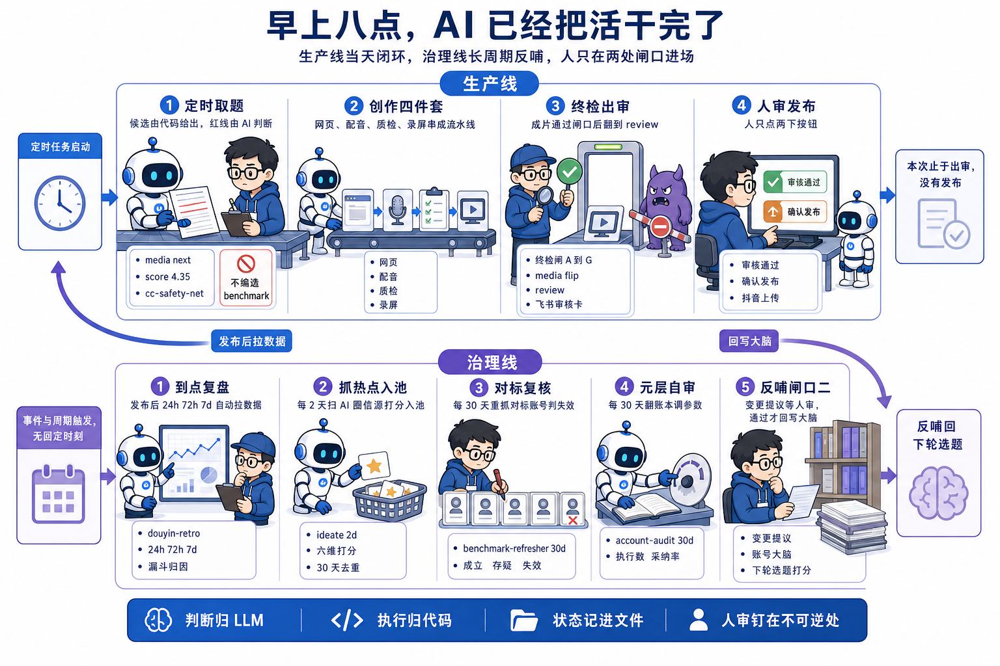
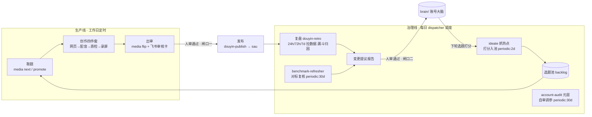
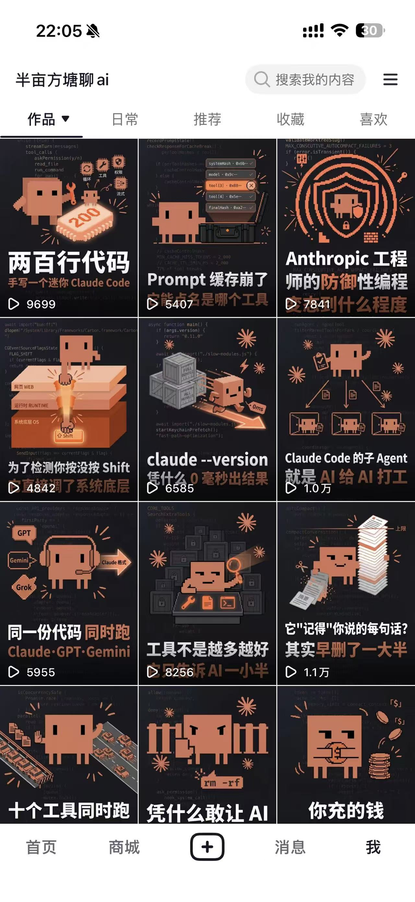
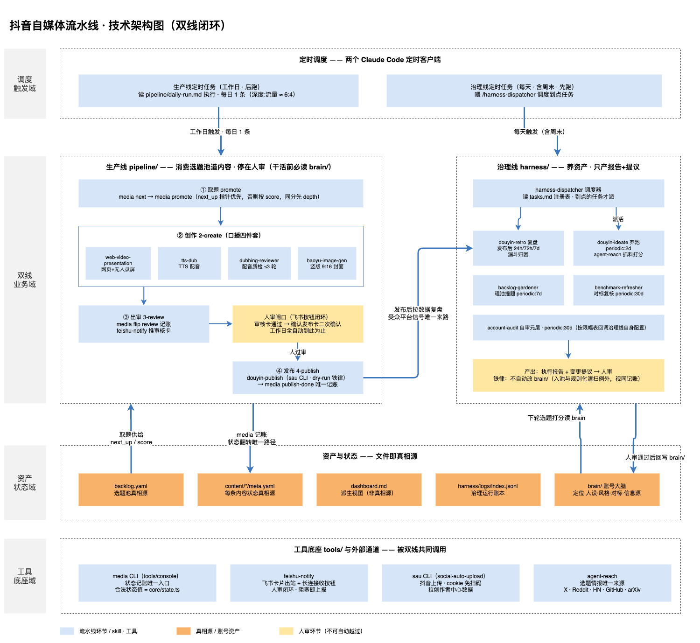
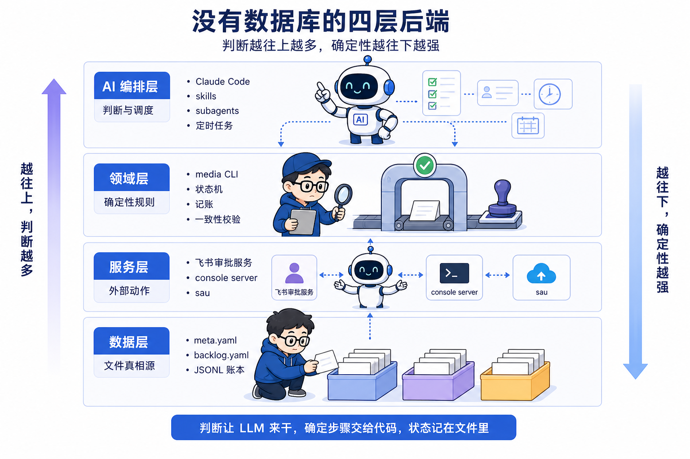
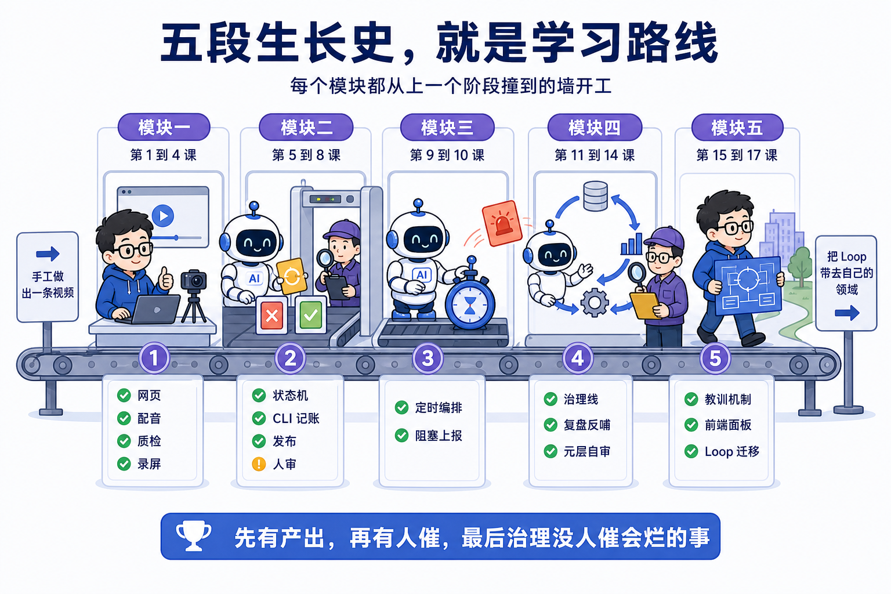
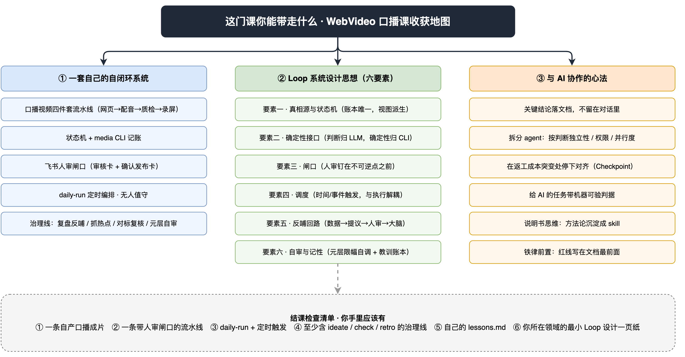

# 第 0 课 课程介绍与目标，先看它真的在跑

> 代码仓库：<https://git.aicodex.cc/devlist/douyin-media>
> 对应分支：`main`（课程导览，无专属教学分支）

你现在看到的是一门口播视频制作课，它的主角是那套会自己跑起来的系统。完成十七课后，你会得到一套属于你自己的 AI 工作流，选题、创作、复盘、调参这些环节它都能自己跑起来，人只做审核。整门课的一句主张现在就说，**判断让 LLM 来干，执行交给确定性代码，状态记进文件，人审只钉在不可逆处。** 后面每一节，都在回扣这一句话。

系统跑起来的样子是，AI 定时开工，人只做审核。到点之后，复盘数据自动拉回，热点自动抓进选题池，对标账号的复核也由系统自己跑，连系统自己的调度参数，都由系统自己提议怎么调。抖音口播视频是这套系统每天产出的货，系统才是这门课真正交付的东西。

课程有一个约定，全程不要求你手写一行代码。记账 CLI、调度器、审批服务这些需要写代码的地方，都由 AI 工具生成，你负责写清楚规格、设计好流程、再把好验收关。这门课的门槛只有一个，用过 AI 工具。用过 ChatGPT、Cursor 或 Claude 这类产品就能跟下来；涉及的每个工程概念，都会在第一次出现时给一句话解释。这一课先给你最常用的四个，LLM 是大语言模型，ChatGPT 这类 AI 的智能核心；CLI 是命令行工具，在终端里敲文字命令、回车拿文字结果；状态机是让系统只能处在少数几个固定状态、按固定规则在状态之间切换；subagent 是主 AI 派出去的另一个 AI，只做你交给它的那一件事。

这一课是开篇导览，没有动手环节。任务是三件事，看一遍这套系统无人运行的真实一天，用技术视角把它拆开看清结构，明确你学完能带走什么。读完你应能回答三个问题，它到底自动到什么程度，它由哪几块组成，我要不要投入十七课的时间，并完成文末的学前自查。

## 一、早上八点，AI 已经把活干完了


空谈自动化没有说服力，直接看一天的真实运行日志。下面转述本仓 `pipeline/logs/2026-07-16.md` 那天的运行日志，定时任务把一条名为 `cc-safety-net` 的技术拆解视频从一个选题条目做到了推审核卡等人审，全程无人值守。

为了看清每一步是谁在干活，日志给每个动作标了角色。大模型在做决策，标 AI 判断；确定性程序在跑，比如翻状态、合成音频、比对时长，标代码执行；需要人类点头的时刻，标人进场。三分法贯穿全课程，系统的所有设计问题，本质都是这件事该归哪个角色。

### 1.1 取题，AI 挑但红线说了算

早上定时任务启动，第一件事是从选题池取题。日志第一段记录取题过程，next_up 指针为空，于是按 score 取最高分。排在前面的几条都要人亲手跑实测才能诚实产出，自动跑必然编造 benchmark，撞上红线，于是跳过，留给人。最后取的是能诚实自动做完的最高分，cc-safety-net，score 4.35。

这一步里，代码执行一方的 `media next` 命令按既定规则（人工钦点指针优先、否则按分数）给出候选；AI 判断一方发现分数最高的三条题都需要人亲手跑实测才能诚实做完，自动做必然编造数据，于是主动跳过，取了能诚实做完的最高分。红线约束写在项目宪法里，AI 读到了，并且执行了。

选定后，`media promote` 一条命令完成取题记账。它输入选题 id 和目录名 slug，一条命令把五处账一次改齐，要么全改、要么全不改，一致性由命令保证，这正是状态记进文件这句话的落地。这里也能看出让 AI 直接记账会怎么错，它可能只改了其中一两处、其余的忘了改，留下断链，等下一次体检命令报红才发现。这条命令具体改哪五处、每处怎么落，第 6 课你亲手造出自己的版本时逐处拆开讲。

### 1.2 创作，跑通四件套流水线

接下来是本课程模块一要带你完整跟做的口播四件套，写稿、配音、质检、录屏，四步串成一条流水线。

日志接着记创作的四件套。源码亲验用 shallow clone 拿到目标仓库 v1.0.6，逐条读引擎源码，结论都锚到文件行号。口播稿 5 章 13 步，约 3 分 49 秒。网页复用上一集脚手架，重写 5 章组件。配音先拿单段探余额，正常后全 13 段合成，多音字逐段注音 8 类，去停顿后死气复扫归零。配音审批 dubbing-reviewer 第一轮就 PASS。录屏确定性渲染出 final.mp4，228.931 秒对预期 228.9 秒，无拉伸。封面竖版 9 比 16，复用系列吉祥物。

写稿、读源码、设计画面是 AI 判断；TTS 合成、静音检测、无人录屏、时长比对是代码执行；中间那个 dubbing-reviewer R1 PASS 是主 AI 派出的另一个 AI（子代理）在给配音质检，它只有判定权、没有修改权。AI 检查 AI，权限还做了隔离，这是第 4 课的主题。

### 1.3 出审，系统停在人面前

终检闸 A 到 G 全部在最终 mp4 上验，全过。`media flip` 把这条内容的 status 翻到 review，落下 review 时间戳，dashboard 重新生成，飞书审核卡推送成功。**本次定时任务止于出审，没有发布。**

系统跑到这里主动停下。当天晚上人进场只做了两个动作，在飞书审核卡上点通过，再在确认发布卡上点确认发布，第二次点击才触发真正的抖音上传。整条链路里人的总工作量，就是看一遍成片，点两下按钮。


### 1.4 治理线：复盘、抓热点、对标复核，反哺战略

上面只看了生产线，治理线在同一天也按自己的节奏自动开工，干的都是没人催、但放着会烂的事。同一天的 `harness/logs/2026-07-16-retro.md` 记着，09:09 复盘被调度器准时拉起来。复盘不按固定时刻触发，而是发布后 24 小时、72 小时、7 天三个窗口，事件到了才跑。

当天复盘盯上两条内容，spec-driven-development 的 7 天窗和 ponytail-lazy-senior-dev 的 72 小时窗。它从创作者中心拉回真实数据，spec-driven 7 天播放 30132，全账号最高、是基线的 4.36 倍，还修正了 24 小时窗口对这条视频的两处误判——早窗数据没跑满，转粉和互动率的结论要等 72 小时以上才可信。复盘只产变更提议报告，把强 CTA、宽口径选题这类打法写进去等人审勾选，自己不动账号大脑。

除了复盘，治理线还有三班周期任务，挂在同一个调度器上。选题调研每 2 天自动抓一轮 AI 圈信源，双赛道六维打分、30 天去重、过期清扫，候选题直接入选题池，下一轮取题就有新料；对标复核每 30 天用 agent-reach 重抓对标账号和爆款拆解，逐条判成立、存疑还是失效，提议更新脑里的有效打法；元层自审每 30 天翻运行账本，统计每个治理任务的执行数、成功率、人采纳率，自己提议调整调度参数。

治理线产出的每条建议都停在人面前。生产线当天就到出审为止，治理线走的是长周期反哺：平台反馈变成变更提议，人审通过才回写账号大脑，成为下一轮选题打分的依据。两条线都转起来，这套 Loop 才是闭环。

这一天看下来，开篇那句主张在每一步都兑现了，判断、执行、状态各有归属。生产线的人只在最后点两下，治理线的建议也一律停在人审勾选，没有一条自动改大脑。



## 二、我做出来的效果

系统从 2026 年 6 月中旬跑到现在，产出已发布视频 24 条，一个 15 集的源码解读系列（EP01 到 EP15），加上 spec-driven-development、karpathy-autoresearch 等多条独立深度题。以下数据全部来自系统复盘线从抖音创作者中心拉回的真实记录（可在本仓 `harness/logs/` 逐条溯源）。

- 最好的一条是 `spec-driven-development`，7 天播放 30132，是账号基线的 4.36 倍，全账号最高。复盘报告还修正了 24 小时早期数据的两处误判，一处是转粉强度被低估，一处是互动率低源于破圈稀释。多窗口复盘的价值就在这里，24 小时窗里的两处误判，到 7 天窗再看就被纠正了；
- 还有一次干净的对照实验，同一周发布的两条视频，一条用评论区扣 K3 换对账笔记的强 CTA（行动号召），评论 8 条；另一条沿用旧的软 CTA，评论 2 条，四倍差，让强 CTA 从猜测变成了写进账号大脑的打法。

## 三、一张图看懂这套 Loop

前面看的是流水账，现在把整套系统压进一张图。整条数据流大致是这样。



图上有三个约束，是整套系统的骨架，光看图看不出来。

第一，**两个闸口都钉在不可逆操作之前**。闸口一在发布前，视频发出去就收不回；闸口二在改账号大脑前，大脑是所有选题打分和创作风格的依据，改错一条会污染后面每一条内容。除这两处外，全程无人值守。这两个闸口精确放在错了没法撤销的位置上，其余环节一律无人值守。多设一个闸口，就多一处要人盯的点，无人值守就多破一个口，所以闸口只放两处。

第二，**受众信号只有一条来路**。选题端从不爬抖音热榜，平台反馈全部从发布、复盘拉数据这一条边进入系统。这条保守的约束换来的是可归因，信号来源单一，一条视频火了，你能确定是选题打分的功劳还是蹭了推荐流。

第三，**治理线只产报告，不自动改**。复盘、对标复核产出的都是变更提议，人审通过才回写大脑。上半部分的生产线有时效、有人催；下半部分的治理线管的是没人催、但放着会烂的事，选题池会过期、打法会过时、数据没人看。这两条线的划分标准，是模块四的核心内容。

三个约束合起来，就是开篇那句主张在流程上的落地。

### 3.1 这套 Loop 不止跑抖音

课程交付的是一条抖音口播视频生产线，但 Loop 本身不挑平台。把判断让 LLM 干、执行交给确定性代码、状态记进文件、人审只钉在不可逆处」这套骨架搬到另一个平台，要换的只有两处，发布接口和复盘数据源；取题、创作、反哺、调参，全是同一套。

| 抖音：本课程的自动生产线 | 小红书：同一套 Loop 的迁移实例 |
| --- | --- |
|  |  |
| 课程交付的那条口播视频生产线，取题、创作、出审、发布、复盘全自动闭环，人只审两处闸口。 | 我用同一套思维搭的骑行知识图谱账号：自动调研话题、自动创作作品、自动发布、复盘后自动调整打法，运营一个半月粉丝破 800。 |

这是可迁移的直接证据。你带走的不只是怎么在抖音发口播视频」，而是一套能搬到任何内容平台的 Loop。第 15 到 17 课（模块五）会把这套方法论正式提炼成可迁移的框架。

## 四、技术拆解，看这套系统的前端与后端

把它当成一个软件项目来审视，**这个仓库里没有一行手写的业务代码**，所有 TypeScript、Python 都由 AI 生成，人写的是 markdown（规格、流程、约束）。架构是清晰的四层，每一步都有章法。

先看整套系统的技术架构全景。四个横向的域从上到下依次是调度触发、双线业务、资产状态、工具底座，生产线与治理线在中间并排跑，发布后拉数据复盘那条横向箭头把大环接起来，黄色块是仅有的两处人审闸口（源文件 `../../2026-08-25-技术架构全景/assets/流水线技术架构图.drawio`，可用 draw.io 打开编辑）。



再给仓库一张平面图，目录到这就够看，深层的每课细讲。

```plain
douyin-media/
├── CLAUDE.md          # 项目宪法，AI 每次开工先读的规则
├── brain/             # 账号大脑，定位、人设、风格、对标、信息源，创作决策的依据
├── pipeline/          # 生产线，取题到出审的阶段 SOP，加编排入口 daily-run.md
├── harness/           # 治理线，任务注册表、复盘 SOP、运行账本
├── content/           # 内容条目，一条视频一个目录，状态写在各自的 meta.yaml
├── tools/             # 自建工具，media 记账 CLI、飞书审批服务、console 前端
├── dashboard.md       # 状态看板，派生视图，真相源在 content/ 各 meta.yaml
└── .claude/skills/    # 开箱即用的开源 skill 集合（配音、录屏、质检、发布）
```

这张平面图按两条线分。pipeline 和 content 是生产线，负责造内容和翻状态；harness 和 brain 是治理线，负责养池子、调战略；tools 和 .claude/skills 是工具层，把判断落成命令、把方法论装进 skill。后面十七课的每一块，都落在这张图的某个位置上。

### 4.1 前端，两块屏

这个系统的前端是两块用途完全不同的屏。

- 内容呈现层是每条口播视频的画面，本体是一个 Vite + React + TypeScript 网页，开源 skill `web-video-presentation` 的产出。它把口播稿变成点击驱动的网页，每点一下推进一个口播节拍，每一步独占整屏。用网页做画面容器，是本系统的一个关键取舍，点击驱动让时间线成为确定性的，headless 浏览器模拟点击就能自动录屏，配音由 ffmpeg 按段自动对齐。上一节实录里 228.931s 对预期 228.9s 的精度就是这么来的。这个选型的代价是必须背一个浏览器渲染环境，每一步画面都经 headless Chrome 渲染，出片吞吐受渲染速度约束。换一条路，进剪辑软件逐帧摆，画面控制更细，代价是每条都要人工操作，无人值守这条路就断了。第 2 课你会亲手做出一个。
- 工作台是给运营者（也就是你）看的控制台 Web UI（`tools/console/packages/ui`）和一份 `dashboard.md` 看板。dashboard 的定位是派生视图，头部第一行就写明它是派生视图，状态真相源在每条内容的 `meta.yaml`，本文件从账本汇总生成。视图与真相分离，这是第 5 课的主题。

### 4.2 后端，没有数据库的后端

后端四层，从上往下。

| 层 | 组成 | 职责 |
| --- | --- | --- |
| AI 编排层 | Claude Code + skills + subagents + 定时任务 | 读 markdown SOP 执行；所有判断活在这层 |
| 领域层 | `media` CLI（`tools/console/packages/core`） | 状态机、记账、一致性校验；规则唯一定义处 |
| 服务层 | 飞书审批服务（Python）、console server、sau 发布引擎（外部开源件，第 7 课自装） | 审核卡收发、按钮回调、浏览器自动化上传 |
| 数据层 | git 仓库里的文件 | meta.yaml / backlog.yaml / jsonl 账本 |

数据层没有数据库。每条内容的状态写在它目录下的 `meta.yaml`，选题池是一个 YAML 文件，运行账本是一行行追加的 JSONL。文件即数据库，git 即审计日志，每次状态变更都有 commit 可查，AI 和人读写同一套纯文本。选文件还是选数据库，这里有一个取舍，一句话讲完，数据库省查询、防脏数据，但 AI 直接读写纯文本的门槛更低。这套系统选文件，因为整套流水线跑在 LLM 之上，纯文本对 LLM 最友好。两种方案的对比和各自代价，第 5 课你亲手建内容工厂时展开。

这四层背后是同一个设计取向，后面十七课会反复回到它，**判断的活让 LLM 来干，把判断落成确定步骤交给代码，跑完以后的状态记在文件里**。AI 决定选哪个题，但改五处账由 CLI 一个原子命令完成；AI 写口播稿，但静音是否超过 0.45 秒，由 ffmpeg 判定。哪些事归代码、哪些判断归 AI，是这门课最有含金量的判断力。



### 4.3 命令清单，这套系统的对外接口

把上面的分层压到命令层面，整条链路对外暴露的核心接口，集中在五个命令或 skill 上。每个都能用一句话讲清它输入什么、做什么、改哪几处账。

| 命令或 skill | 输入 | 做什么 | 改哪几处账 |
| --- | --- | --- | --- |
| `media next` | 读选题池 `backlog.yaml` 和 `next_up` 指针 | 模拟取题，输出会取谁、为什么 | 只读，不改账 |
| `media promote` | 选题 id（或 `--auto`）加目录名 slug | 取题记账，建目录写 meta | 五处，见 1.1 |
| `media flip` | 内容 slug 和目标状态 | 校验迁移合法后翻状态、落时间戳 | `meta.yaml` 的 status 和 timestamps |
| `douyin-publish` | 一条 status=approved 的内容和物料 | dry-run 出命令给人确认，授权后调 sau 上传 | 发布后调 `media publish-done` 三翻齐 |
| `douyin-retro` | 创作者中心 cookie | 拉数据、漏斗归因、产报告 | 不改账，产变更提议等人审 |

这五个接口串起来，就是 mermaid 图里的整条链路，next 取题、promote 落账、flip 翻状态、publish 上传、retro 复盘。除了这五个，还有 `media check`、`media doctor` 这类体检命令，它们属于自检，后面课程会讲到。这些活之所以要由代码执行，是因为 AI 手改账本会出小错，把 review 拼成 reveiw，或者翻完状态忘了落时间戳。这类错不会当场炸，只会在几天后的体检里悄悄冒出来。命令清单、怎么设计、技术栈、核心流程这四样，当前最容易被当成 AI 会自己处理而跳过，这门课偏要把它们讲透。

## 五、五段生长史，就是你的学习路线

这套系统是分五段长出来的，课程模块顺序就是它真实的演化顺序，每个模块的开场都是上个阶段撞到的墙。

| 模块 | 你要做的 | 对应的真实痛点 |
| --- | --- | --- |
| 一（第 1 到 4 课） | 手工做出一条口播视频 | 无（起点） |
| 二（第 5 到 8 课） | 状态机 + CLI 记账 + 发布 + 人审闸口 | 第二条、第十条视频，状态谁记？ |
| 三（第 9 到 10 课） | 定时编排 + 阻塞上报 | 还是要人每天点火 |
| 四（第 11 到 14 课） | 治理线 + 复盘反哺 + 元层自审 | 池子过期、打法过时、数据没人看 |
| 五（第 15 到 17 课） | 教训机制 + 前端面板 + Loop 方法论迁移 | 把思想带去你自己的领域 |



"先撞墙再讲规则"这句话有实际来处。模块三会讲一条铁律"阻塞即上报"，它的出处是系统曾因选题池空连续空跑 6 天，每天都在本地日志里喊没题了，但没人看日志，于是有了"只写本地日志不算上报、必须推飞书"的规则。这门课的每条规则，背后都对应一次真实的撞墙，先撞过再立规则。这个模块顺序不能倒过来，模块四的治理线只在生产线跑顺之后才有意义，先有产出、再有人催、最后才轮到没人催会烂的事。

## 六、你能学到什么

课程的收获压缩成一张地图（源文件 `assets/course-learning-map.drawio`，可用 draw.io 打开编辑）。



三条收获线，对应三种不同层次的东西。

1. 结课时你会得到一套属于你自己的自闭环系统，看得见摸得着。它包括口播视频四件套流水线、状态机与记账 CLI、人审闸口、定时无人值守、带复盘反哺的治理线，每课跟做累积，结课时全部长在你自己的仓库里；
2. 你还会带走一套 Loop 系统设计思想，一个可迁移的框架。它包括真相源与状态机、确定性接口、闸口、调度、反哺回路、自审与记性、进程管理，七要素在结课时正式提炼，但每一个你都会先在具体某课亲手搭过；
3. 你还会带走一套与 AI 协作的心法，工作方式会因此改变。它不单独开课，全部嵌在跟做过程里，做到那一步时自然讲到。关键结论要落成文档，落到磁盘才算数；拆分 agent 按判断独立性。在返工成本突变的地方停下来对齐，派给 AI 的任务要带机器可验的判据。

结课时你手里应该有七件东西，这也是第 18 课的验收清单，1、至少一条自产口播成片；2、一条带人审闸口的完整流水线；3、daily-run 编排 + 定时触发；4、至少含选题、体检、复盘三个任务的治理线；5、你自己的踩坑教训账本；6、一份最小后端闭环（读接口、快写、慢作业、job runner）；7、把 Loop 七要素迁移到你所在领域的最小设计一页纸。

## 七、学前须知与自查

### 7.1 你需要准备什么

课程依赖分三级，推荐级以下都有免费替代，不会因为不想付费而卡住。

| 依赖 | 用在 | 级别 | 没有怎么办 |
| --- | --- | --- | --- |
| Claude Code（或同类 CLI agent） | 全程 | 必需 | 无替代，它是课程根基 |
| MiniMax TTS（付费） | 配音（第 3 课起） | 推荐 | 换 edge-tts 等免费 TTS，skill 本身不绑供应商 |
| 飞书自建应用 | 人审卡（第 8 课） | 推荐 | 课程提供本地文件 + 手动确认的降级模式 |
| 抖音账号 | 发布/复盘（第 7、13 课） | 可选 | 停在出审即可，复盘课提供样例数据集 |
| 图像生成 API | 封面（第 4 课） | 可选 | 任意文生图工具手动出图 |

### 7.2 代码分支怎么用

一课一分支，第 1 课对应 `01-setup`，第 2 课对应 `02-web-video`，以此类推。每个分支是该课跟做完成后的参考状态，卡壳时 checkout 对照，`git diff` 相邻两个分支就是那一课的全部增量。主分支 `main` 是生产系统真身，即课程终态的完整参考。

### 7.3 每课的节奏

正课每课固定四拍，先给一张你在整个系统里的位置的地图，然后动手做出一个能跑的东西，再回头拆它背后的设计决策，最后停下来，把这一课真正留下的东西用几个判断收住。原理永远挂在你刚做完的操作上，所以不建议跳着看，每课的墙都是给下一课的规则打的地基。

### 7.4 学前自查

本课没有代码产出，自查只有三项。

| 检查项 | 怎么确认 |
| --- | --- |
| 明确了课程边界 | 能说出这门课不教什么，不教手写代码，不教涨粉技巧 |
| 依赖心里有数 | 对照 7.1 的表，知道自己哪几项走替代方案 |
| 三个开篇问题有答案 | 它自动到什么程度 / 由哪几块组成 / 我为什么要学 |

## 八、几个判断带走

这一课没让你动手，但立了三个贯穿全课的锚点。第一个，系统的所有设计问题，本质都是这件事该归哪个角色，AI 判断、代码执行、人进场三选一。第二个，判断让 LLM 来干，执行交给确定性代码，状态记进文件。第三个，人审只钉在不可逆点前，其余流程全程无人值守。后面十七课做的每个决定，都能追溯回这三个锚点。

下一课开始动手，装好 Claude Code，写你的第一个 skill 和 CLAUDE.md，把课程仓 clone 回家跑通第一条体检命令，从看热闹，到把装备穿上。
