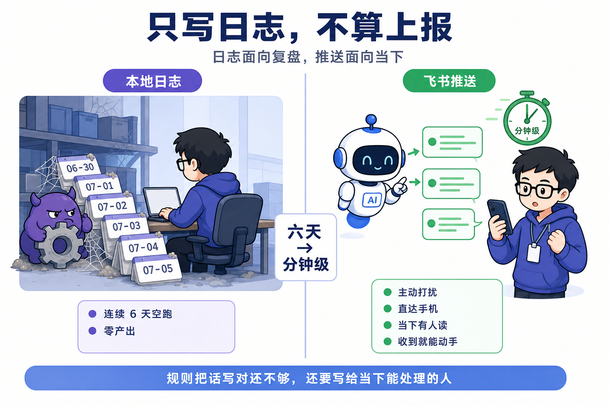
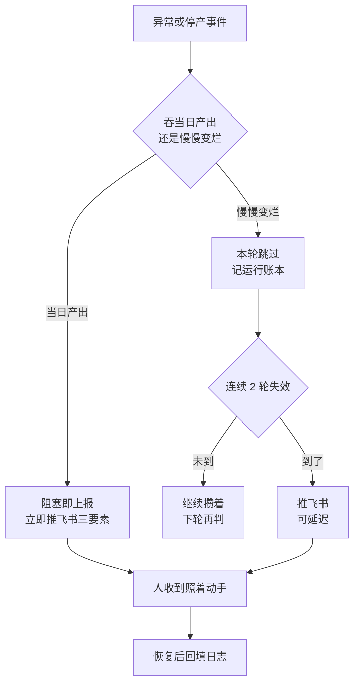
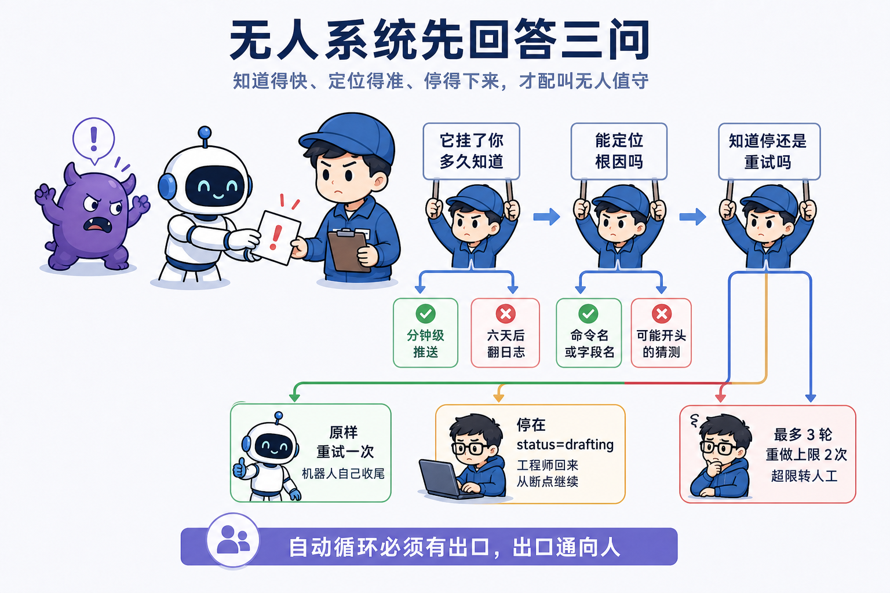

# 第 10 课 阻塞即上报，无人系统的可观测性

**只写本地日志不算上报。** 这是本课要立住的判断。无人系统的合格判据落在三问上。它挂了，你多久知道。知道了，能不能照着通知直接动手修。它自己知不知道该停还是该重试。三问都过，你的系统才配叫无人值守，三问的展开见第五节。只写日志，它只是没人看，不算无人值守。

第 9 课把点火权交给了时间。定时 agent 早上自动取题、创作、出审，停在人审，人只需要审两下。从那一刻起，系统在跑的时候身边没有你。那它没在跑的时候，你什么时候才会知道。本课回答这个问题。给 daily-run 加上报通道，定哪些事件值得推，想清楚外部依赖耗尽时停在哪。先看一次真实事故，它正是这条铁律的由来。

## 一、日志连续写了六天，人没看见

只写本地日志不算上报，这句原则来自一次真实的六天空跑。

2026 年 6 月 30 日早上，定时 agent 照常开工，取题时发现队列空了。当时 daily-run 的模式还是清系列日更，只从 claude-code-source-series 系列里取题，而整个系列 15 集在 6 月 29 日已全部发布收官。池子里剩的 9 条单题不在系列取题范围。agent 按铁律停产，写了日志。

日志写得很规矩，标注一天比一天重。

| 日期 | 日志做了什么 | 标注 |
|---|---|---|
| 06-30 | 停产，记系列已清完 | 无 |
| 07-01 | 停产，提模式切换建议 | 连续第 2 天空跑 |
| 07-02 | 停产，写清空跑根因 | 已连续第 3 天空跑，决策已过期 |
| 07-03 | 停产，列出两个改法 | 根因与决策请求，已逾期 4 天 |
| 07-04 | 停产，重复请求 | 已逾期 5 天 |
| 07-05 | 停产，重复请求 | 已逾期 6 天 |

六天，零产出。日志每一天都判定停产，写根因，请人做决策，标逾期天数，标注一天比一天重。每天的日志末尾还写着一句，不推飞书，绝不发布。问题就出在这一句上。

agent 检查得很到位。它用 awk 数 backlog 里 status:idea 的条数，用 yaml 解析系列段，再列全系列的状态分布，三重自证队列确实为空。它越尽责，越说明问题出在判断的下游，没有人读它的判断。

根因是模式切换决策一直没人做。系列 6 月 29 日收官后，daily-run 的当前模式段还停在清系列，定时任务 prompt 也还写着做系列下一期，取题必落空。agent 没权自动切模式，那属于内容策略决策，它把决策请求写进了日志。请求在仓库里没人处理，放了六天，直到 7 月 8 日人发起一次工程重构，才读到这些日志。

当时的规则有一处指错了对象。它要求队列空了就停，并把系列已清完写清楚。写清楚这个动作落在日志上，规则的告知止步于日志。规则把话写对了地方，但写错了读者。7 月 8 日改规则时，把告知的对象从日志换成飞书，阻塞即上报铁律就此立下。当天的重构不止这一条，daily-run 切回双赛道选题驱动，backlog 加了 next_up 指针，ideate 加了过期清扫，生产线归到 pipeline，治理线提到顶层 harness。停产上报是其中一条，它决定以后每一次停产，人都会知道。

这条教训记成 L14，沉淀成一句话，只写本地日志不算上报。

为什么日志不算上报。日志的读者是后来的人，复盘时的人。上报的读者是当下的人。无人系统里，当下没有人在翻日志，日志写进仓库那一刻就没有读者了。上报是把消息推到人的手机，从被动等待变成主动打扰。这一条在后面每一节都要反复回扣，它是本课的判据。



## 二、上报通道怎么搭

给 daily-run 加上报通道，核心是一条出站的文本通知加三要素，第 8 课搭好的飞书通道直接复用，不需要新造。

上报走 feishu-notify 的文本通知能力，一次出站调用把一行字推进飞书群。它只依赖 config.yaml 里的 chat_id 和机器人凭证，不需要 server 长连接在线。上报是单向告知，没有按钮要收，所以它比审批通道轻。这个分工要记清楚。第 8 课的审核卡要人点击回传，必须依赖长连接收回调，上报只要人知道，出站即达。

先看命令。上报是一条命令推一条消息，走 feishu-notify 的文本通知能力。你只敲命令，不用看代码。

这条命令的 Python 实现由 AI 写好放在仓库里。tools/feishu-bot 的 feishu.py 已经把 send_text 实现好。你要推什么，用大白话说出来，AI 照它调 skill，阻塞即上报节里写的就是这样一句。

```text
feishu-notify 推一条文本通知，内容是 事件 取题空
```

推什么内容，daily-run 的阻塞即上报节钉死了三要素。事件，根因，需要人做什么。三样缺一，人就不能照着通知直接动手。

事件写一句话，是什么停了。例子，取题空。根因同样一句话，但要可定位，写命令名或字段名。例子，backlog 中 status:idea 为 0，daily-run 仍按清系列模式取题。需要人做什么写具体动作，比如补池子还是充值。例子，切回双赛道选题驱动，更新 daily-run 当前模式段。三样写全，人收到通知不需要再爬任何日志。

三条消息连起来，就是一个完整的停产现场。

```text
事件 取题空
根因 backlog 中 status:idea 为 0，daily-run 仍按清系列模式取题，取题必落空
需要人做什么 切回双赛道选题驱动，更新 daily-run 当前模式段
```

人一眼扫完三条，直接照第三条动手。事件说明发生了什么，根因交代为什么，需要人做什么落在最后，直接给动作。三样分开推，是因为人的处理顺序正好是这个顺序，先扫事件，再读根因，最后执行动作。


阻塞即上报节在 daily-run 里的位置，在执行步骤之后、产出之前。定时 agent 从入口 prompt 往下读，先读到取题、创作、出审三步，再读到这条铁律，最后是产出说明。停产事件发生时，agent 按这条铁律执行。铁律和步骤同处一份文档，每天开工都会读到，这是它比散在各处日志强的地方。

通知长什么样，这里有两个设计取舍。

三推还是一推。一推把三要素挤进一条文本，消息少，但人要点开才看到根因和动作，飞书折叠后事件可能被略过。三推拆成三条，事件在第一条当标题，根因在第二条，需要人做什么收在最后一条，任何一条单独看都成立。代价是多两条消息的打扰。上报的目的是让人注意到并动手，三条消息的打扰换来注意力的直达。daily-run 的阻塞即上报节写的正是三推文本通知。

纯文本还是结构化卡片。纯文本轻，一次 send_text 两行代码，出站即达，不依赖长连接。结构化卡片字段对齐，还能放按钮，但卡片 JSON 要维护，按钮要收回调，就得依赖 server 在线，上报通道就变重了。课程仓在两种场合选了不同的路。人审闸口用卡片双卡，因为要人点击产生结构化事件，第 8 课讲过，按钮点击要落成记录。上报用纯文本，因为人看完动手，不需要点击回传。需要人回传事件的地方用卡片，只需要人知道的用文本，这个分工值得记住。

为什么日志不是上报，技术栈层面再钉一句。日志是仓库里的 markdown 文件，是 git 管理的一堆记录。推送是飞书群里的消息，直达手机。日志面向复盘，推送面向当下。把上报做在日志里，等于把当下要人知道的事，寄存在一个没人读的地方。这正是 L14 的教训。

设计讲完了，派工。给 AI 的自然语言任务契约，直接粘贴。

```markdown
给 daily-run 加上报通道。
1. 加一节，标题写阻塞即上报，列停产事件清单，取题空、TTS 余额返 1008、录制失败超重试、审批通道故障。
2. 每个停产事件按三要素推飞书文本通知，事件、根因、需要人做什么。
3. 三次 send_text，一次一个要素，顺序固定，先事件，再根因，最后需要人做什么。
4. 根因要可定位，写命令名或字段名，不写可能开头的猜测。
5. 需要人做什么要具体到动作，例如跑 douyin-ideate 补水、去 MiniMax 控制台充值、重启 server。
6. 推通知的同时写运行日志，日志内容与通知一致。
7. 验证，手工触发一次取题空，手机收到三条气泡，三要素齐全，人照着第三条能直接动手。
```

验收就一条。手工触发一次停产，手机收到三条气泡，事件、根因、需要人做什么各一条，你照着第三条能直接动手，不需要再翻日志。这一步把多久知道从六天压到分钟级。

这条通道和状态账是配套的。第 9 课讲的断点，在停产事件上兑现成状态字段。取题空，系统停在停产状态，不留半成品。余额尽，系统停在 drafting，就差配音。人回来从断点继续，不会重复生产，也不会从零再来。上报保证人知道断点在哪，状态账保证人接得上断点。

这一步 AI 会怎么错。它会把三要素挤成一句有内容待处理请查看，或者只写事件和根因，漏掉需要人做什么。根因常常写成可能开头的猜测，可定位的命令名丢在一边。推完通知不写日志，账本断档。上报也会被拖进 server 回调，把轻通道做重。验收时逐条对照，三要素齐全、根因可定位、动作具体、日志同步、通道保持出站。

阻塞即上报对定时 agent 也是一份授权。第 4 课讲自动循环要有出口，出口通向人。对定时 agent 来说，这条铁律就是它的出口。遇到取题空、余额尽这类它处理不了的事，它不用硬撑，不用自己发明决策，停手写上报就是正确行为。上一课把点火权交给时间，这一课把停手上报的规矩交给 agent，它停得下来，也知道停下来该做什么。

## 三、哪些事件值得推

哪些事件值得推，判据是一条，这条异常吞掉的是当日产出，还是慢慢变烂。

这里摆两个方案。全量推，任何异常都推一条。好处是永远不会漏报，坏处是把人推疲劳。第 8 课讲过，人每次进场都要读材料、判断、动手，注意力是全系统最稀缺的资源。异常每天都有，大部分不值得人放下手里的事。全量推一个星期，人开始忽略通知，等到真停产那条来的时候，混在一堆噪音里，效果和没报一样。第 8 课的闸口疲劳，在通知通道上重演。

分级推，按规则决定推不推。当日产出有硬时效，今天没做出来就是今天的损失，明天补不回。吞当日产出的，阻塞即上报，立即推。慢慢变烂的单轮可跳过，先记运行账本，连续失效再推。课程仓选分级推，代价是要维护分级规则，初期会漏判，漏判的由复盘兜底。

分级按的是这条异常会不会立刻伤到当天产出或状态账，跟它属于哪条线无关。两条线各自的规则，仓库里写得分明。

生产线是阻塞即上报。daily-run 列了停产事件清单，取题空、TTS 余额返 1008、录制失败超重试、审批通道故障，任何一条都立即推飞书，同时写运行日志。取题空，当天没有题目进入创作。余额返 1008，配音卡死在合成，把后面的出审全堵住。录制失败超重试，成片出不来。审批通道故障最隐蔽，内容停在出审，审核卡推不出去，人也点不了按钮。这几个事件有一个共同点，都导致当日无产出或流程挂起。

治理线是连续 2 轮失效才推。retro 任务卡写了一句，数据通道失效本轮跳过并在报告记原因，连续 2 轮失效才推飞书，治理线可延迟，不套生产线的阻塞即上报。为什么治理线可以延迟，因为治理任务养的是资产。漏一次复盘，池子不会立刻坏，选题不会马上过期，单轮跳过的损失接近零。它可以攒到账本里，攒成规律再打扰人。

但即便在治理线内部，判据也一致。治理线自己的状态日巡，error 级一样走阻塞即上报，check 任务卡写着，error 级当天必须有人介入，不能带病继续跑生产线。因为状态账坏掉会污染下一天的取题和创作，它吞掉的还是当日产出。而 retro 的数据通道失效，只影响当轮复盘，攒两轮再推。判据落回同一句，吞当日产出的立即推。

治理线其它任务按同样的节奏。ideate 每两天养一次池，漏一轮，池子不会立刻空。benchmark-refresher 每月复核对标，漏一个月，打法可能过时，但不会当天爆。它们的异常都可以攒，攒成规律再推。

分级会漏判，这是选分级推的代价。漏判的兜底在复盘。复盘拉数据会看到空窗，一段该产出的日子没有内容，反查就能发现是不是有停产没报。漏掉的停产被复盘补报，分级漏判就不至于变成永久沉默。



图里分岔的判据只有一条，吞当日产出的立即推，慢慢变烂的攒到连续两轮再推，在噪音和漏报之间取中间档。

把本课判据套回这张图。你多久知道，由分级决定，该立即推的不等。能不能照着通知动手，由三要素决定。分级保证人不被噪音淹没，三要素保证人收到就能动手。两者合起来，才是一个可用的上报。

## 四、外部依赖耗尽，停在明确状态

外部依赖耗尽，要停在明确状态并报人，不硬跑也不静默。这是本课对第三类停产事件的处理。

L9 事故是这么来的。EP13 创作到配音环节，MiniMax TTS 余额耗尽，接口返回 1008，配音链卡死，后面出审全堵住。余额是外部依赖，系统自己充不了值，人不去充值，重试一百次也还是 1008。这条教训在 2-create.md 里定成规则，批量合成前先单段试合成探余额，返回 1008 就停在 status=drafting，推飞书报充值，不推审不硬跑。

三个姿势摆开对比。硬跑，批量合成撞余额，每段都失败重试，前面的钱白烧，后面留下一批半成品，日志里全是失败记录。静默，停在某个中间态，没有报人，无人知道，和 L14 一个下场。停在明确状态加报充值，系统翻到 drafting，一条内容就差配音，人收到通知知道要干什么，充完值回来从合成继续，不从头取题。

为什么状态字段是关键。drafting 就是断点。它意味着这条内容差配音，人回来只补这一步，前面的口播稿、网页、分段文案都还在，不用重做。如果停在别处，或者干脆不回填状态，人回来不知道该从哪继续，等于从头再走一遍。停在明确状态，是把断点写进状态账，让人和系统都能接上。

探测为什么前置。先单段试合成探余额，再批量。探测放在批量之前，是为了避免批量合成到一半才撞余额。撞在中间，前面几段已经烧了钱，后面几段全废，账本上还留着一批半成品。前置探测把撞在中间变成撞在开头，损失最小。

外部依赖耗尽的标准姿势，和上报分级放一起看。取题空是池子内部空了，该推，让人补水。余额尽是外部账户空了，该推，让人充值。两者都是当日无产出，都走阻塞即上报。区别在需要人做什么，一个补池子，一个充值。三要素里的第三样，正是为这种区分留的位置。

同一个姿势用在另一处外部依赖上。抖音 cookie 失效，发布失败，feishu-notify 的处理是不自动登录，停下来等人扫码。扫码只能人来做，系统代劳不了，失败卡上写清需要人做什么，人扫完码重发。cookie 和 TTS 余额一样，都是系统自己充不了值的依赖，处置用同一个姿势，停在明确状态，报清需要人做什么。

## 五、无人系统的三问

无人系统的合格判据落在三问上，三问都过才配叫无人值守。这是本课加油站要讲透的。

第一问，它挂了你多久知道。L14 的答案是六天。上报加装之后是分钟级。答案差两个数量级，唯一变量是日志还是推送。这一问量化了判据里的多久知道。

第二问，你知道时能定位根因吗。L14 六天日志里，根因其实每天都有写，模式没切换，取题必落空，写得很清楚。但根因留在日志里，人没看见，定位能力归零。三要素里的根因这一样，就是让定位跟着通知走，人收到时根因已经在手里，不用再翻仓库。这一问量化了判据里能不能照着通知动手的前一半。

第三问，它自己知道该停还是该重试吗。这决定需要人做什么的内容，也决定自动循环的出口。系统要知道三类处置。可自动重试的，自己来，录制失败先原样重试一次再停，这是第 7 课 L7 处理发布抖动的方式。该停的，取题空、余额尽，停下等人。该升级的，自愈到上限就转人，第 4 课的配音质检最多 3 轮，feishu-notify 的重做上限 2 次，超限停止自愈转人工。自动循环要有出口，出口通向人。

第三问的答案落到上报上，就写在需要人做什么这一要素里。系统判断为可自动重试的，通知里写无需操作，自己收尾。判断为该停的，通知标出停在哪一步，人回来接上。判断为要升级转人的，通知把要找的人写清楚。无论哪一种，人收到的通知都直接告诉他系统想让他干什么，他不用替系统重新判断一遍该停还是该重试。



三问连起来回答一个更大的问题，自动化到哪一步为止。系统挂了自己知道、能报根因、能决定停还是重试，这是自动化的上界。超过这个上界，决定权交给人。第 8 课的闸口思想在这里延续，人只处理收不回或不可自动收敛的事。

## 六、核心流程，能口述

本课的东西串成一条能口述的路径，从事件发生到人动手到恢复收口。

异常或停产事件发生。先分级判定，这条异常吞当日产出吗。吞，走阻塞即上报，立即推；不吞，记运行账本，连续两轮失效再推。判定之后写三要素，事件、根因、需要人做什么。三次 send_text 推出去，事件第一条，根因第二条，需要人做什么第三条。人手机收到，照着第三条动手。系统恢复，从断点继续。最后回填运行日志，事件、处置、恢复时间。

每一步落在不同的位置。分级判定由 daily-run 入口 prompt 的阻塞即上报节决定，那是定时 agent 每次开工读的规则。三要素在 agent 手里拼出来，是它写给人的话。推送走 feishu-notify 的 send_text，出站调用，不依赖长连接。恢复等在人动手之后，充完值或切完模式，系统从断点继续。收口回到运行日志，同时把状态账补齐。

这条路径能口述，是检验本课有没有做成的办法。说不出来，说明上报还是散在代码里，没成为一条可预期的流程。

拿取题空走一遍全流程。早上 agent 开工，media next --json 返回 decision 为 empty，当日无产出。分级判定，吞当日产出，走阻塞即上报。拼三要素，事件取题空，根因池子里没有 idea 且模式未切换，需要人做什么切回双赛道。三条 send_text 推出去。人手机收到，切完模式。第二天 agent 再取题，有题可做，从创作继续。日志回填，记下这次停产的处置和恢复时间。这一条路径，把本课所有概念过了一遍。

## 七、几个判断带走

三个判断带走。只写本地日志不算上报，上报是推送到手机的动作，它挂了多久知道，由推送决定。吞当日产出的立即推，慢慢变烂的攒到连续两轮再推，不是所有异常都值得打扰人。外部依赖耗尽停在明确状态加报充值，报给人的三要素，事件、根因、需要人做什么，缺一样人就不能照着通知直接动手。

无人日更到这里跑通了。定时 agent 取题、创作、出审，停产会上报，人只在两处进场。但停一下想一个问题。这套系统跑了几周之后，选题池会过期，对标打法会过时，发布的数据没有人看。上报保证的是当天不停产，那些没有人催、放着会烂的东西，谁来养。那是治理线的事，模块四从下一课开始。
