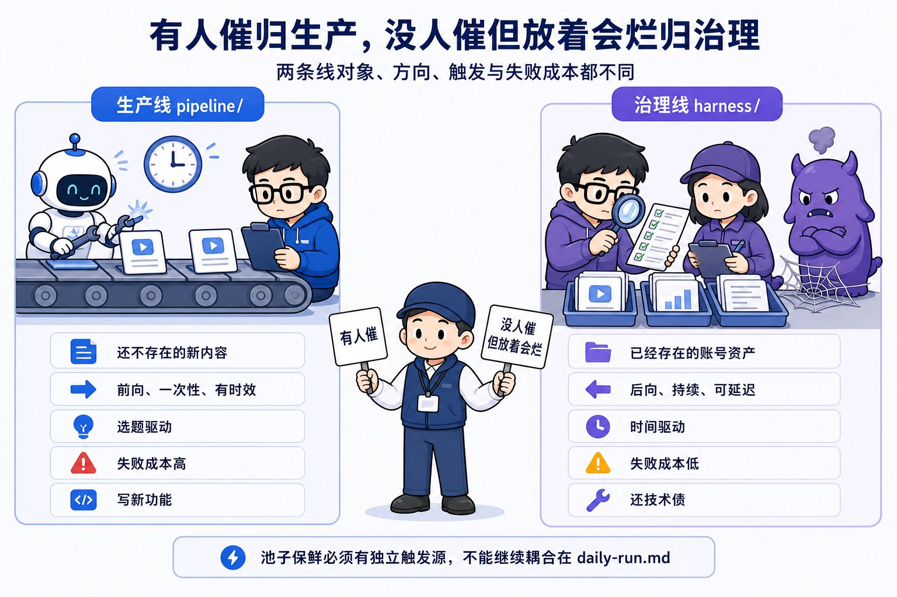
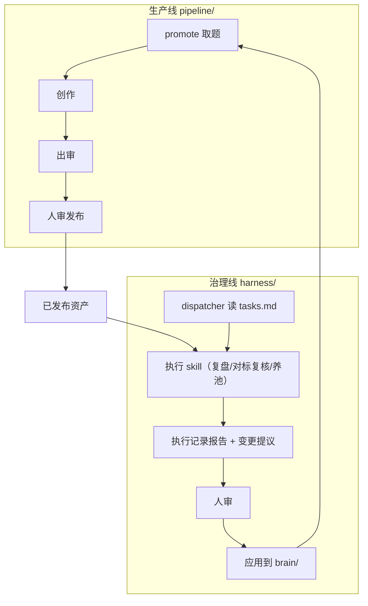
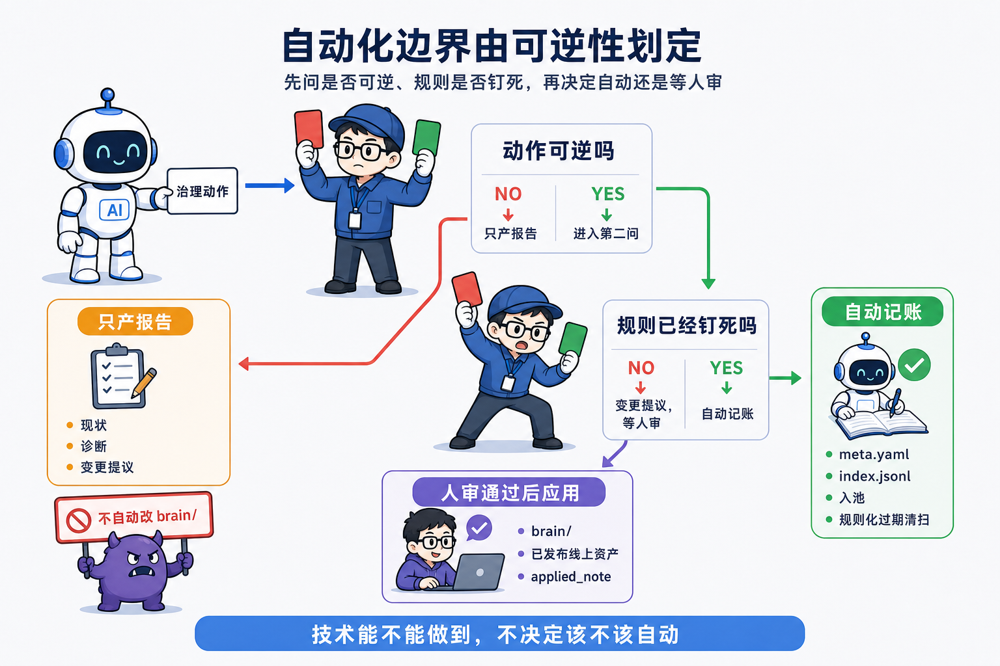
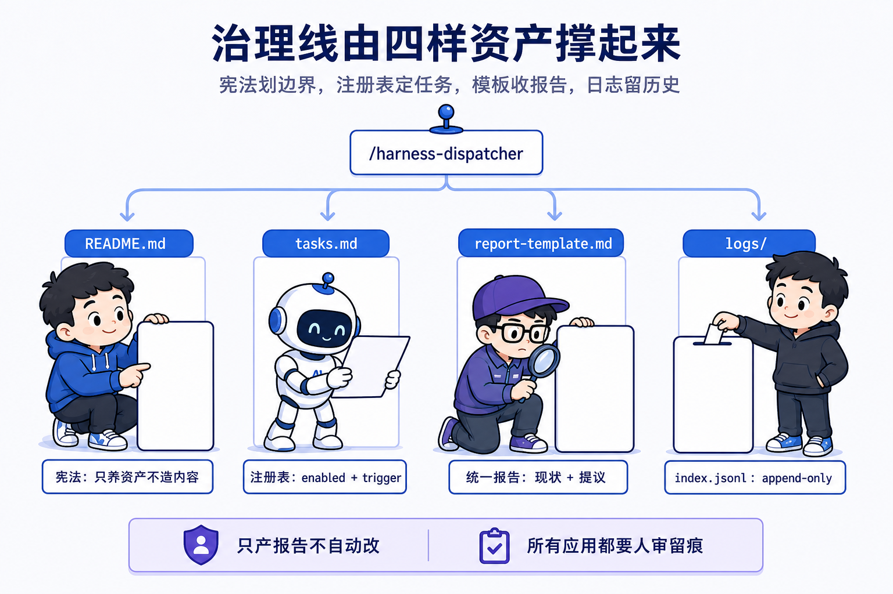

# 第 11 课 熵增与治理线，没人催但放着会烂的

自动化的边界由可逆性划定，不由技术能不能划定。能自动的只有可逆且规则钉死的动作，其余一律走报告等审。这是本课要立住的判断，模块四的四课都从这一句展开。

模块三跑通了无人日更，AI 早上醒来已经把活干到人审这一步。跑几周后你会撞见一个新问题。选题池里的题开始过期，benchmarks 里的对标账号过时了也没人提醒，发布出去的作品数据躺在创作者中心，一条通知也没有。系统每一天都在离真实状态远一点，却没有任何一个环节负责把它拉回来。生产线只做一件事，造新内容。造得越勤，存量资产上积的偏差越多。课程仓管这条线叫账号熵增治理线，熵增取的是物理意义，封闭系统自发走向混乱。账号不治理，就自发走向过期、过时、数据堆积，治理线就是那个定期把偏差拉回来的装置。

这一课的任务是把这堆没人催的账盘清楚，为自己的系统立一条治理线，并把边界写进一份宪法。治理线只养资产不造内容，只产报告不自动改。做完后你手里多一份本账号的治理线任务卡草稿，至少两个任务，各列 trigger 与产物，存成一个 md 文件，能打开核对。另能说出这条线的准入判据、铁律和资产面四样东西，能口述一次治理动作从触发到应用落地的完整路径。

## 一、跑几周后，账会烂

先给烂账一个具体的画面，用课程仓自己摔过的跟头。2026-07-08 全仓架构审计发现，daily-run 从 06-30 起连续空跑，因为上一个内容系列已经收官，没有题可取。选题池里 9 条 idea 全部是 06-14 入池的，24 天没人消化，时效题已经过期。负责给池子补水的 ideate 从 06-14 之后一次都没跑过。三件事是同一个根因，池子保鲜的活当时耦合在生产线的 daily-run 上，生产模式一变，保鲜跟着停摆。

这个跟头记在 `docs/Iterative-spec/00-架构历史文档/2026-07-08-工程重构与流水线恢复待办.md`，背景段一行写全，选题池 9 条 idea 全是 06-14 入池、24 天无人消化、时效题已过期，ideate 自 06-14 后再没跑过。douyin-ideate 的执行文档里也留了一句，只入不出的池子会烂，2026-07-08 教训是 9 条 idea 躺 24 天全过时。

这三样烂账没有一件有人催。选题过期不催你，对标过时不催你。发布数据躺在后台，也没有任何通知来喊你。它们放着会烂，等你哪天翻到才想起来。治理线规划的文档把这件事讲成一句硬道理，账号每运营一天，系统记录的状态和世界的真实状态就多偏离一点，而没有任何一个生产环节负责把偏差拉回来。生产只管造新的，造新的动作恰好不会碰到已经存在的资产，偏差只会越积越多。

这次停摆还有一个细节。模式切换本身是合理动作，清系列收官，双赛道接上，人已经授权。合理的切换照样让保鲜停摆，因为保鲜没有独立的触发源，它借的是 daily-run，daily-run 一换逻辑它就断。治理线要解决的，就是给这些没人催的活补上独立的触发源，让它们到点自动跑。

跟做从这里开始。把你自己的池子、对标、发布数据翻出来，列一张没人催的清单。

```plain
盘点我这条流水线的存量资产，各给一句现状：
1. 选题池：哪些条目入池超过两周还没动？哪些时效题已经过期？
2. 对标账号：brain/benchmarks.md 里列的对标，最近一个月还活跃吗？
3. 发布数据：最近发布的作品，播放、完播、涨粉各是什么水平？
只列清单和现状，不写建议，不自己动手改任何文件。
```

放着会烂的东西很多，能不能自动修是后话，先分清哪些东西归谁管。归生产线的是有人催、有时效的，归治理线的是没人催、但放着会烂的，这正是下一节的准入判据。

## 二、准入判据，两条线为什么必须分开

治理线的宪法第一条是判据。有人催、有时效的，归生产线；没人催、但放着会烂的，才进治理线。这句话是硬边界，往这条线里加任务时先过这个判据，防止它慢慢长成第二条生产线。

两条线互不相干。生产线对象是还不存在的新内容，方向前向、一次性、有时效，触发是选题驱动，有题就跑。治理线对象是已经存在的账号资产，方向后向、持续、可延迟，触发是时间驱动，定时巡检。失败成本差一个量级，生产错过热点就错过了，治理没清可以下次再清。规划文档给了一句口诀，有人催就归生产，没人催但放着会烂就归治理。两条线的差异并排看更清楚。

| | 生产线 pipeline/ | 治理线 harness/ |
|---|---|---|
| 对象 | 还不存在的新内容 | 已经存在的账号资产 |
| 方向 | 前向、一次性、有时效 | 后向、持续、可延迟 |
| 触发 | 选题驱动，有题就跑 | 时间驱动，定时巡检 |
| 失败成本 | 高，错过热点或发了烂内容 | 低，没清就下次再清 |
| 类比 | 写新功能 | 还技术债 |



表里每一列都指向同一个区分，有人催的有明确时效，没人催的定期查。

为什么要分开，课程仓用一次实证回答。池子保鲜是典型的治理活，调研入池、过期清扫，周期两天，没人催。它一开始住在 daily-run 里，跟着生产跑。生产从清系列日更切到双赛道模式时，daily-run 改成另一套取题逻辑，保鲜的活没有独立调度，于是整个 24 天没人跑。分开之后，ideate 迁进治理线，注册成 periodic:2d 任务，daily-run 里只留一段过渡期兜底，等治理线定时验稳就摘除。这件事的修订记在 harness/README.md 的边界节，治理线养池子，生产线消费池子。

两条线和它们之间的闭环画出来是这样。



图里两条线唯一交汇在 brain，发布后的数据经治理线变成 brain 的变更，人审后再喂回下一轮取题，这就是大环。

判据的另一半是别把治理线改造成第二条生产线。加权随机调度只适用于一堆同质、无序、可延迟的维护债，内容生产有时效、有编排顺序，不能随机延迟。这句话写进了规划文档的边界警告，本课先立住，trigger 三种类型在第五节列出，选型原理留给下一课。

## 三、只产报告，不自动改

治理线的铁律是只产报告，不自动改。所有任务，含复盘，只产出执行记录报告加变更提议，写清现状、诊断、建议改什么。改 brain 账号大脑、改已发布线上资产，一律人审通过后才应用，与发布铁律一致，不可逆操作不自动化。

可自动的边界由可逆性划定。状态机记账可自动，meta.yaml 置 retro_done、写治理日志，这些视同状态记账，不算改大脑。选题池的入池和规则化过期清扫也可自动，入池置 status:idea，清扫按已人审钉死的规则跑，都视同记账。撞题合并、剔除是判断性变更，只产提议，人审后应用。这一条在 harness/README.md 的铁律节钉死。

技术能不能自动，和该不该自动，是两件事。机器可判对错的、可回滚的、规则已经钉死的，交给自动；判断性的、不可逆的，走报告等审。课程仓的 report-template 把这一条写成头注，本报告只提议、不落地，改 brain 或线上资产由人审勾选后才应用。

验证层因此也不单独建 skill。规划文档把这个决定写明，治理产出是报告加提议、不自动改，校验只要看两件事，格式对、没碰 brain，塞进 dispatcher 即可。自动改的流程才需要一层独立的验证器，只产报告的流程用不着。

应用留痕也靠账。harness/logs/index.jsonl 里每一行都记着 applied 和 applied_note，某次复盘报告在 2026-08-19 由人在看板逐条人审通过，5 条提议全部落地到 benchmarks.md。改没改、谁批准的、落到哪个文件，一行账查得到。第 8 课立的规矩在这里重演，人的决定落成机器可读的事件，治理线的人审应用就是第二次。

反面看一眼自动改会怎样。复盘查完发现打法过时，AI 直接改 benchmarks.md，改完没有 diff 给人看，下一次选题已经按新打法打了分，事后想查是谁在何时因为什么改的，查不到。这一条和发布铁律是同一件事，不可逆的操作留给人，可逆的记账留给机器。



## 四、选题池是库存资产，归治理线养

把资产视角立起来。选题池是库存资产，调研入池是补库存，造内容从 promote 那一刻起算，归生产线。复盘和巡检作用于已经存在的资产，同理归治理线。harness/README.md 把出处写明，调研入池类比 coze harness 的 add-tests 补测试库存。

资产视角和内容视角的区别，决定一个动作该放哪条线、边界怎么划。补库存的动作可逆、规则可钉死，入池记账、过期清扫可以自动。造内容的动作有时效、有判断，归生产线。两边的观察口径不同，生产线看今天有没有题做，治理线看池子里还有多少货、哪条该先做。

backlog.yaml 的头注把库存和细账分开，状态分两层别混，backlog 管粗粒度三态，content 的 meta.yaml 管细粒度状态，backlog 不镜像细粒度状态。双向指针让两本账互认，backlog 条目的 content_path 指向内容目录，内容的 meta.source 指回 backlog id。第 5 课立过粗账细账的划分，本课给这条划分补上归属，粗账归治理线养，细账随生产线翻。去重也在这本账上做，按 tags 归一化主题标签比对，30 天内同主题直接丢，无 tags 时退化为标题加链接比对。深度常青题不在过期清扫的命中范围，可以长期排队，时效题才被规则收走。

这个视角还解释了为什么过期清扫的规则要人先钉死。入池和清扫是自动的，但自动的前提是规则已经人审过。timeliness 高于等于 4 超过 7 天、today 超过 2 天，判 expired，这条规则写死在 douyin-ideate Step 2.0，每轮运行自动执行。自动执行的是规则，规则本身先过了人审，这是可逆性边界在入池这一个点的具体落法。

## 五、治理线的资产面，四样东西

治理线本身也由四样资产撑起来，全在 harness/ 目录下，外加一个入口。这一节把每样讲清，输入什么、做什么、改哪几处账。

第一样，README.md，宪法。它声明这条线只养账号的存量资产、逆其熵增，不造终端内容、不追增长。读它的人每想往线里加任务，先拿准入判据过一遍。输入是新任务想不想进这条线，输出是进或不进，宪法本身不碰账，只划边界。

第二样，tasks.md，任务注册表。yaml 是机器契约，dispatcher 读它，对每个 enabled 任务评估 trigger，到点的才跑。输入是任务清单，输出是到点任务列表。新增任务就改这一个文件，加一条 yaml 加一张任务卡，不动 dispatcher，调度和执行解耦。这一课只需要知道注册表的存在和它只产报告，任务卡全文留给下一课。

注册表里的 trigger 分三种，是任务性质选型的结果。post-publish-window 是事件触发，对 status 是 published 且到点还没做检查点的内容跑，复盘用它。periodic 是周期触发，距上次成功运行满 N 天就跑，读 logs/index.jsonl 算，养池、对标复核、元层自审都用它。weighted-pool 是预留的同质维护债池，按 weight 加权随机挑目标摊开跑，暂无任务启用。当前启用 5 个任务，养大脑的 retro 和 benchmark-refresher，养池子的 ideate 和 backlog-gardener，元层 account-audit。另 5 个 TODO 登记在册且 disabled，任务卡即接入规格，接入就是按卡写执行 skill 加翻 enabled。

第三样，report-template.md，统一报告格式。治理线所有任务共用一份模板，任务与触发、现状、发现、变更提议、盲区、落地记录。输入是治理执行的现状与发现，输出是结构化报告。报告存 harness/logs 下按日期和任务命名，<date>-<task>.md，摘要追加进 logs/index.jsonl。

第四样，logs/，报告落位加运行账本。单次详细报告是 md 文件，append-only 的运行摘要是 index.jsonl，每行一条，记录时间、任务、目标、窗口、结果、报告路径、发现数、是否应用。audit 元层读的就是它，本课先把账记上。

入口是 /harness-dispatcher。定时任务由人在 Claude Code 客户端配置，每日一次，建议排在生产线之前，让当天取题用上新鲜池子。没到点或没配置时手动跑。单个治理任务也可以直接手动触发，比如 /douyin-retro 后接 slug。

四样资产里，宪法和注册表划边界，报告和日志走流程，唯一碰账的是可逆的记账类动作，它们落在 media 命令上，其余一律报告等审。



本课的实物交付物在这里收口。把你第一节盘点出来的没人催的活，写成一份治理线任务卡草稿，存到 harness/tasks-draft.md，至少两个任务，各列 trigger 与产物。核对点两个，任务数不小于二，每个任务都写清了 trigger 和产物。这份草稿是下一课 tasks.md 的素材。

## 六、怎么设计，两个决策点

这一节把治理线最核心的两个设计决策摆开，各给两个方案和代价，让你换自己设计时知道取舍在哪。

第一个决策，治理动作放哪。方案 A 混进 daily-run，治理活跟着生产编排顺带做，省一条独立的触发链。代价是本仓实证过的，生产模式一换，保鲜跟着停摆，24 天没人跑。方案 B 独立治理线，时间驱动、独立调度，生产怎么换不牵连。课程仓选 B。代价是多一条线、多一个调度器，任务要单独注册。

这个切换留了过渡期兜底。daily-run 在取题时若发现 content/_research/ 最新报告距今超过 2 天，仍先手动跑一轮 douyin-ideate 再取题，判断幂等，谁先跑谁更新报告日期，另一边自动跳过。等治理线定时跑稳，人再摘除这段兜底。过渡期的存在说明一个切换不会一步到位，旧路径先留口子，新路径验稳再拆。

第二个决策，治理结果怎么落地。方案 A 自动改，AI 查完直接改 brain、直接改已发布资产，省人审那一步。代价是不可逆动作失去人这一关，改错无痕，还和发布铁律打架。方案 B 只产报告加变更提议，人审通过后才应用。课程仓选 B。代价是每次落地要人等，低客观任务高频跑只会堆积待审报告，这个教训写进了 tasks.md 的权重说明，机器可判对错的权重 8 到 10，需人拍板的权重不超过 4。

两个决策指向同一个判断。方案 A 在技术能不能上做文章，方案 B 在可逆不可逆上划界。自动化的边界由可逆性划定，技术能不能做到，不改变这条边界。

## 七、技术栈，为什么选文档加 skill

治理线的载体是文档加 skill。README、tasks.md、report-template 都是文本文件，dispatcher 是 .claude/skills 下的一个 skill，全程没有需要编译运行的程序。这个选型要回答为什么。

三个理由。低频，治理任务周期是两天到三十天，事件窗口是发布后二十四小时到七天，一天跑一次都嫌多，不值得为一个低频动作维护一套常驻程序。人审驱动，每个任务终点是一份报告，等的是人，程序的执行链在这里断掉，剩下的流程是人在 git 里勾选。可 diff，加一个任务就是改 tasks.md 的一段 yaml 加一张任务卡，删一个任务就是翻 enabled，每一步都是 git 里可见的 diff，人审的就是这个 diff。

对比程序方案，cron 加脚本。代价是任务逻辑埋在代码里，加任务要改代码要重新部署，改了什么要靠读代码，审不了 diff。文本方案的代价是另一面，yaml 没有强制校验，写错字段要等 dispatcher 跑的时候才知道，所以任务卡把契约写在人话里，由人审把关。

dispatcher 也不用纯加权随机。复盘是事件触发、benchmark 是周期，都不是同质随机债，加权池留给未来 per-item 任务。调度逻辑也住进 skill，调度要被 AI 读、被审计，改起来可 diff，这正是文本载体的用处。

记账的可自动部分单独落在 media CLI，这是本系统里唯一的程序。文档划边界，skill 执行，CLI 记账，各管一段。边界由可逆性划，判断锚点在技术栈上落到这里。

## 八、核心流程，一次治理动作怎么走

把整个流程串起来口述一遍，六步。盘点烂账，跑几周后把过期选题、过时对标、没人看的发布数据翻出来，看清有哪些东西放着会烂。准入判据划线，一条一条过，有人催的归生产，没人催但放着会烂的进治理。立宪法，把边界和铁律写成 README，只养资产不造内容、只产报告不自动改。注册任务，在 tasks.md 里加一条 yaml，定好 trigger，enabled 翻 true。出报告，到点由 dispatcher 派执行 skill，产出执行记录报告加变更提议。人审应用，人在报告上勾选，落地到 brain 或已发布资产，落地记录回填日志。

拿复盘走一遍完整路径。一条内容发布后 72 小时，dispatcher 读 tasks.md，评估 post-publish-window 触发，命中了，派 douyin-retro。douyin-retro 拉创作者中心后台数据，曝光、播放、完播率、平均播放时长，漏斗归因找主漏点，看评论区挖真实反馈。复盘是受众平台信号唯一的来路，选题端不爬抖音，这一条写在它的任务卡里，断供等于账号大脑停止迭代。复盘的时机在任务卡里钉死，发布后 24 小时、72 小时、7 天各拉一次数据，容差正负 12 小时。严重逾期、超窗超过 7 天的，不硬补，那是 retro-debt-collector 的活，它还没接入前由人手动 /douyin-retro 收。机器按窗口跑新鲜的，逾期欠账留给人或专门的收债任务。产出执行记录报告加大脑变更提议，建议改 benchmarks.md 的哪条打法。报告落 harness/logs 下按日期命名的 md，摘要追加进 index.jsonl。人在报告上勾选，通过后应用到 brain/benchmarks.md，落地记录回填 applied 字段，meta.yaml 的 status 置 retro_done，这是任务记账，可自动。

这条路径上，自动的部分是触发、执行、报告、记账，判断的部分是人审、应用。每一步 AI 会怎么错，dispatcher 把事件触发当周期跑，到点没到也跑；执行 skill 只拉数据不出提议，报告里没有变更清单；报告把已提议写成已应用；落地记录不填，审计时查不到这笔应用是谁批准的。验收就看报告有没有提议、落地记录有没有回填。

## 九、几个判断带走

自动化的边界由可逆性划定，不由技术能不能划定，能自动的只有可逆且规则钉死的动作。治理线只养资产不造内容，准入判据是没人催但放着会烂的，有人催有时效的归生产线。只产报告不自动改，改 brain 改已发布资产一律人审后应用，可逆记账落 CLI。

宪法立了，任务注册了，但谁到点把它们跑起来还是空的。下一课做调度与执行解耦，用 SDD 让 AI 造出自己的 dispatcher skill 和 tasks.md 注册表，注册前两个任务，你第一次看到治理线到点自动跑起来。
