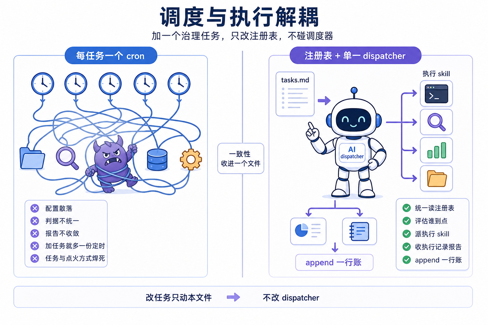
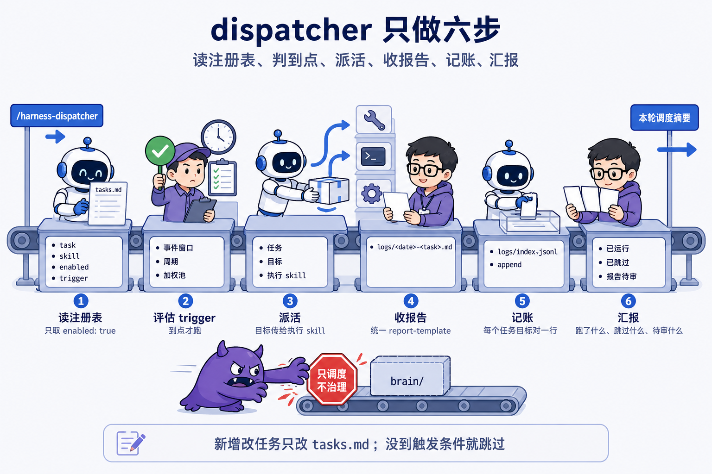
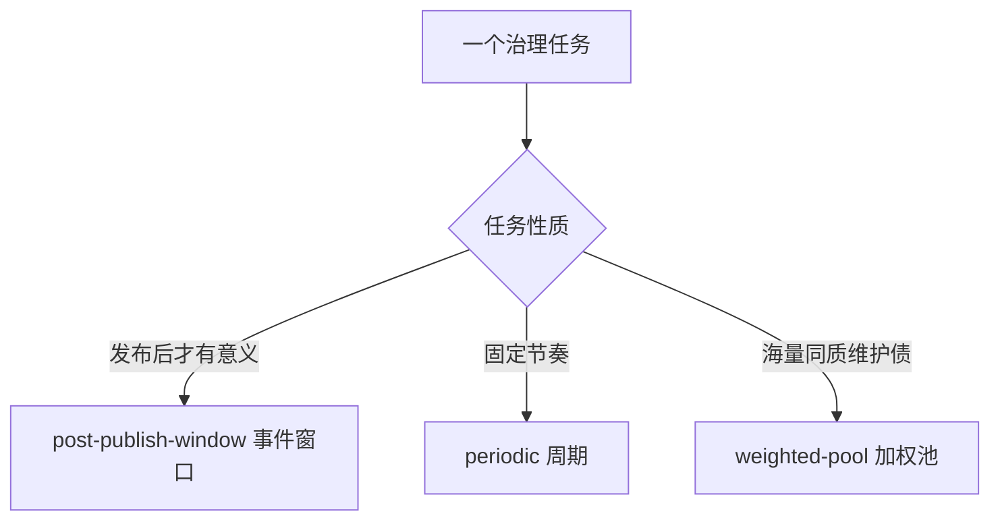
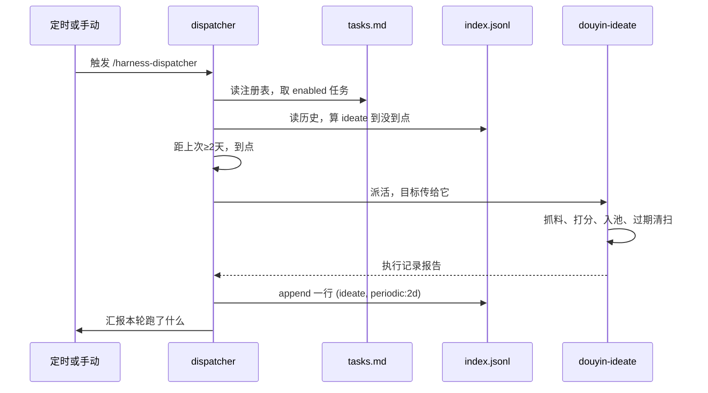

# 第 12 课 调度与执行解耦，dispatcher 与任务注册表

> 代码仓库：<https://git.aicodex.cc/devlist/douyin-media>
> 对应分支：`12-dispatcher`

加一个治理任务只改注册表，不碰调度器。调度与执行解耦，任务才能独立生长，调度器才能保持稳定。这是本课要立住的判断，课程仓 `harness/` 目录里存着一整套为它作证的证据。

第 11 课给系统立了治理线宪法，只养资产不造内容，只产报告不自动改。宪法还盘出了要养的事，选题池保鲜、撞题理池、对标复核、发布复盘、状态账本日巡。宪法没有回答一个问题，谁在什么时间点醒这些事。上一课结束时，每件事要么靠人记得手动跑，要么靠人给每件事各配一个定时。靠人记得会忘，各配一个定时会散。

这一课把点醒这件事收成一个调度器。跟做部分用 SDD 让 AI 生成你自己的 dispatcher skill 和 tasks.md 注册表，注册两个任务，check 启用能真跑，ideate 先登记不启用，写第一张任务卡。做完后你手里有四个能用的状态。dispatcher 跑一轮能正确评估 trigger，把到点的任务派出去。tasks.md 里登记了 check 和 ideate 两个任务，check 启用，ideate 等它的执行 skill 建好再翻 enabled。第一张任务卡五件事写全。你能口述从 dispatcher 被触发到 ideate 养池记一行账的完整路径。

## 一、五件要养的事，缺一个统一的点醒者

治理线缺一个统一的点醒者。上一课立了宪法，要养的事有五件，每件长着自己的节律。

复盘看发布后的窗口。一条内容发布满 24 小时、72 小时、7 天，各是一个检查点，过了窗口数据就失真，这是 `post-publish-window` 的由来。对标复核怕的是旧做法过时，AI 圈几周一变，需要周期性复核。养池要定期抓料入池，太久不补，池子里的选题全过期，课程仓实证过，24 天没补水，9 条全过期。理池要定期撞题去重，池子越大重复题越浪费人挑题的注意力。状态账本要每天巡检一遍，让账目错误当天暴露。

这五件事有一个共同点，没人催、放着会烂，这是上一课立的治理线准入判据。准入判据只回答了哪些事该进治理线，没回答谁在什么时间跑它们。缺的这个位置，就是调度器。

在课程仓给调度器腾位置之前，先看一个更早的教训，它说明耦合的代价。养池这件事曾经耦合在生产线的 daily-run 编排上，生产一换模式，保鲜就跟着停摆，清系列期加空跑期共三周零调研。任务和它依赖的点火方式焊死在一起，一方换模式，另一方就死。这条实证记在 `harness/tasks.md` 的 ideate 任务卡里，是解耦这件事的第一手证据。

缺统一点醒者的第二种可能，是给每件事各配一个 cron。五个 cron 散在各处，每加一个任务就多一份没人统一管的配置。判断到没到点，每个 cron 自己算，判据不统一。跑完的产物和报告没有统一落点，账记在哪各自为政。这离失控只差任务数继续涨。

## 二、把跑谁收进一个调度器

解耦的落点是注册表加单一调度器，加任务只改注册表。两个方案摆开。

方案 A，每任务各配一个 cron。它的好处是直接，每件事一个定时，逻辑简单。代价在任务数上去之后，配置散落、判据不统一、产物不收敛，前面一节已经数过。任务和点火方式焊在一起，和养池耦合在 daily-run 上同一个病根。

方案 B，注册表加单一 dispatcher。所有任务登记在一份 yaml 里，dispatcher 只做一件事，读注册表，评估谁到点，把到点的派给对应执行 skill，收回执行记录报告，记一行账。加一个任务，在 yaml 里加一条，翻一下 enabled，不动调度器。

课程仓选方案 B，证据就在 `harness/tasks.md` 头部那一句注释里，改任务只动本文件，不改 dispatcher，调度与执行解耦。这句注释是给人和给 AI 读的契约。

方案 B 的代价也摆明。dispatcher 要读注册表、要读运行账本算周期、要调 skill，首版比几个 cron 多花功夫。执行 skill 要产出统一格式的报告，才能被 dispatcher 收回，这要求每个任务遵守 report-template 的格式。这两笔是一次性投入，摊在任务数增长上。

把方案 B 和方案 A 放在一起看，差别就是一致性落在哪。方案 A 的一致性靠人记住所有 cron 的位置和判据，方案 B 的一致性收进一个文件。第 6 课 promote 命令把五处账压进一个原子操作，让容易漏的多处一致性不再靠记性。这里同一个思想放大到任务编排，把加任务的改动压进 tasks.md 一个文件。多处一致性的正确归宿是一个点，一个文件，一条命令，而不是分散在各处的配置。

于是判断锚点立住。加一个治理任务只改注册表，不碰调度器。调度与执行解耦，任务才能独立生长，调度器才能保持稳定。后面每一节都在为这一句补证据。



## 三、dispatcher 的六步

dispatcher 对外暴露的就是一个工作流，六步。流程定义在课程仓 `.claude/skills/harness-dispatcher/SKILL.md` 里，这里把它拆开讲，每一步的输入输出都摆明。

第一步读注册表。解析 `harness/tasks.md` 的 yaml，取出 `enabled: true` 的任务。`enabled: false` 的任务是登记在册的 TODO，占位但不跑。

第二步逐任务评估 trigger。到点才跑，这是它的红线。三种 trigger 三种判据，事件窗口扫内容目录里的 meta.yaml 挑落窗口的内容，周期从运行账本算上次成功运行距今几天，加权池按 weight 加权随机挑目标。判据细节在第五节展开。

第三步派活。对到点的任务，用 Skill 工具调它的执行 skill，把目标当参数传进去。一次调度可以跑多个任务、多个目标。

第四步收报告。执行 skill 产出执行记录报告，按 report-template 格式落 `logs/<date>-<task>.md`。

第五步记账。每个任务目标对 append 一行到 `logs/index.jsonl`，一行一个任务目标对。

第六步汇报。跟用户说这轮跑了哪些任务、产了哪些报告待审、哪些没到点跳过。

六步里藏着四条红线。只调度不治理，dispatcher 不直接改 brain、不改线上、不替执行 skill 干活。到点才跑，没到触发条件的任务跳过并说明，别为跑而跑。解耦，新增改任务等于改 tasks.md。加权随机不滥用，只有加权池任务才随机，事件和周期任务严格按条件。

这四条红线里，第一条和第四条最容易被 AI 写丢。AI 容易把 dispatcher 写成什么都干的角色，顺手把执行 skill 的活也做了。也容易把加权随机写成默认策略，对所有任务都用随机。这两处都要在派工契约里钉死，第九节会写。



## 四、tasks.md，机器读的注册表

tasks.md 是机器读的注册表，四个字段定一个任务。直接看课程仓的 yaml 节选。

```yaml
tasks:
  - task: ideate
    skill: douyin-ideate
    enabled: true
    trigger: periodic:2d

  - task: check
    enabled: true
    trigger: periodic:1d
```

字段一共四个。`task` 是任务名。`skill` 是执行它的 skill，没有 skill 的任务这一行缺省，比如 check 没有 skill 字段，它纯走 CLI。`enabled` 是开关，false 的任务登记在册但不跑。`trigger` 是触发方式，周期任务带间隔，事件任务带窗口列表，加权池任务带权重。

四个字段不多不少。多一个字段，加任务的人就要多理解一层，少一个字段，调度器就没法判断该不该跑。注册表是机器契约，字段的解析规则住在 dispatcher 的 skill 里，任务卡住在同一个文件的下半部分，同一规则只写一处，防两处漂移。

yaml 头部还有一段给人和给 AI 读的说明书，交代三件事。触发感知，不是无脑加权随机。改任务只动本文件，不改 dispatcher。写法纪律，有执行 skill 的任务，卡只写契约级判据，操作步骤住 skill。

这一段说明书不能被 yaml 库洗掉。第 6 课挖过这个坑，多数 yaml 库读写一遍会把注释重新排版甚至冲掉，账本头部的说明书会消失。tasks.md 的头部注释也是同一个性质，派工时要指定只改目标字段、不动其它字节。这步 AI 会怎么错，它图省事用最顺手的 yaml 库，写完注册表，头部注释被重排，机器契约还在，说明书没了。验收时打开文件看头部注释在不在。

注册表和任务卡都不手写。派工姿势写死一句，让 AI 读文件、补全、交回你核对，核对点两个，字段键写对，头部注释还在。yaml 最小语法只记一句，一行一个键值对，`键: 值` 的冒号后要有一个空格，列表项以 `- ` 开头，缩进表示层级。

技术栈到这里该回答一个追问，为什么是 yaml 注册表加 skill 调用，而不是一个独立脚本矩阵。脚本矩阵的形态是每个任务一个脚本，各自判断自己的到点条件，各自跑自己的活。它的代价是判断逻辑散在每份脚本里，加任务要写新脚本，改判据要改多处，和每任务各配一个 cron 同一个病根。yaml 注册表把判断逻辑收进 dispatcher 一处，加任务只加数据，判据只住一处。选 yaml 是因为它是纯文本、可 diff、可回滚，和 daily-run、任务卡住在同一个文件里，人审改配置就是改一段文本。代价是 yaml 需要解析器，dispatcher 要处理解析失败的情况，这份成本换来加任务不动代码。

## 五、trigger 三型，按任务性质选型

dispatcher 评估到点，靠的是 trigger 字段。三种 trigger，按任务性质选，谁也别替代谁。

事件窗口 `post-publish-window`，给发布后才有意义的任务用。判据是扫内容目录里所有 meta.yaml，挑 `status: published` 且发布时间落在某窗口的内容，这个窗口在注册表里列出，24 小时、72 小时、7 天，容差正负 12 小时，还要确认该窗口没在运行账本里留过记录。复盘用它，因为复盘要看发布后的实时数据，过了窗口数据就失真。误用的代价是拿周期去跑，复盘会被固定间隔点醒，要么错过窗口，要么在窗口内重复跑。

周期 `periodic:Nd`，给固定节奏的任务用。判据是从运行账本找该任务上次成功运行的时间，距今大于等于 N 天，或者从没跑过。养池用它，每两天补一次库存。状态账本日巡用它，每天巡检一遍。误用的代价是拿事件窗口去跑周期任务，任务会因为没有发布事件而永远不被点醒。

加权池 `weighted-pool`，给海量同质维护债用。判据是按 weight 加权随机从候选目标里挑 1 到 K 个摊开跑。课程仓预留给 link-rot 这类任务，每个链接要验一次活，链接成千上万，同质、量大、逐条跑不完，随机抽一部分摊开跑。weight 的定法按客观度分层，机器可判对错的权重高，课程仓给 link-rot 和 sop-sync 定 10，需要人拍板的权重低，给 stale-fact 和 cover-style 定 4，低客观任务高频跑只会堆积待审报告。误用的代价是把加权随机用在所有任务上，复盘这类事件任务被随机点醒，错过窗口。



图上三路，选型先看任务性质，再看有没有对应的触发方式。课程仓在 tasks.md 和 README 里反复写一句，触发感知，不是无脑加权随机，原因是复盘是事件触发、对标复核是周期，都不是同质随机债，加权池只预留给未来的 per-item 任务。加权随机是个好用的轮子，但只该装在加权池这一种任务上。

## 六、任务卡，五件事撑一张卡

注册表决定跑谁，任务卡决定跑得对不对。每张任务卡五件事，为什么存在、目标怎么选、干什么、产物与记账、人审关注点。课程仓 `harness/tasks.md` 的下半部分就是五张启用卡加五张 TODO 卡。

五件事各管一块。为什么存在回答这个任务为什么值得进治理线，对应准入判据的哪一条。目标怎么选回答这次跑该挑哪些对象，是判据级的定义。干什么回答这个任务具体做什么，有 skill 的卡这一节只写一句步骤住 skill，不重复操作细节。产物与记账回答跑完落什么文件、翻什么状态、记什么账。人审关注点回答人审这个任务的报告时该盯哪里。

写法纪律是，已有执行 skill 的任务，卡只写契约级判据，操作步骤住 skill，同一规则只写一处。这样任务卡和 skill 不会两处漂移。课程仓 check 卡是标准例子，它没有 skill，干什么一节就一句话，直接执行 `media check --json`，不经 LLM，规则唯一定义在 alerts.ts。

没有 skill 的卡，五件事就是未来 skill 的规格种子。这是 SDD 又一次出现。第 6 课你写 spec 让 AI 造出 media 命令，spec 是唯一需要人写的代码。TODO 任务卡承担同样的角色，任务卡即接入规格，接入等于按卡写执行 skill 加翻 enabled。课程仓五个 TODO 任务，link-rot、sop-sync、stale-fact、cover-style、retro-debt，每一张卡都写得像一份待实现的 spec。retro-debt 卡里甚至写了规格三件，逐条补跑、取当下快照、window 字段记 debt，AI 照这张卡就能把 skill 写出来。

你写第一张卡时，选 check 这种没有 skill 依赖的任务最合适，它门槛最低，卡里写清五件事，派工后 AI 照着建 skill。也可选一个你系统里真实存在的维护债，写它的规格种子，下一课接入复盘时用得上。

这步 AI 会怎么错，它把卡写成操作步骤，把 skill 里的细节又抄一遍，两处漂移当场埋下。验收时看卡里有没有出现操作级命令，出现了就要求改成契约级判据。


## 七、运行账本，index.jsonl 一行一笔

调度器要算周期、判窗口，靠的是运行账本 `harness/logs/index.jsonl`。文件里每一行是一条执行记录，一个任务目标对一笔账。格式长这样。

```json
{"ts":"<ISO>","task":"retro","target":"2026-06-20/cc-source","window":"72h","result":"report","report":"logs/2026-06-20-retro.md","findings":<n>,"applied":false}
```

字段逐个看。`ts` 是执行时间戳。`task` 是任务名。`target` 是这次跑的对象，复盘是内容路径，养池是整个选题池。`window` 记触发方式，周期任务写 `periodic:2d`，事件任务写窗口值。`result` 记产物形态。`report` 是纯报告，可以叠加后缀，`report+pooled` 表示报告加入池，`report+retro_done` 表示报告加状态翻转，真实账本里还能看到 `+swept` 过期清扫、`+publish-health-flag` 发布健康标记。只列到这里，不穷举。`report` 指向落盘的报告文件。`findings` 记发现条数。`applied` 记是否已被应用，false 表示仅出报告待人审，这是治理铁律的账本形态。

课程仓真实账本里翻几行，能直接看到这条铁律在跑。2026-07-15 养池那行，`result` 是 `report+pooled+swept`，`applied` 是 false，报告落 `content/_research/research-2026-07-15.md`。2026-07-17 复盘那行，`result` 是 `report+retro_done+publish-health-flag`，`applied` 是 true，后面跟一条 `applied_note`，记人审通过了哪几条、落了哪个文件。账本自己就把哪笔已应用、哪笔还挂着说得清清楚楚。

一行记录怎么产生，就是第六步记账做的事，append 一个任务目标对。append 是纯追加，不修改已有行，这是记账的铁律，保证账本历史不可篡改。

把调度历史当数据，是这一课埋的伏笔。index.jsonl 攒着的每行，ts、task、target、window、result、applied，都是下一课和元层的原料。下一课的复盘要看哪条内容做过哪个窗口，元层的自审要统计每个任务执行数、成功率、人采纳率。现在先把它记全，记的时候少一个字段，后面哪一层都算不出来。

## 八、从被触发到记一行账

从 dispatcher 被触发到养池记一行账，是一条八步的口述路径。把前面六步连成图。这段走的是课程仓的真实路径，课程仓里 ideate 已启用；你自己注册时 ideate 先登记不启用，等执行 skill 建好再翻。



口述这八步。人配置的定时任务或手动指令触发 dispatcher。dispatcher 读 tasks.md 的 yaml，取出 enabled 的任务。对 ideate 这条，它读 index.jsonl，按 task 过滤出 ideate 的账，取最近一行，解析 ts 算距今几天。养池的到点判据还有一个细节，ideate 任务卡写明以 `content/_research/` 最新报告日期为准，因为调研可能被人工或生产线兜底触发，不只看账本，距今大于等于 2 天才跑。到点后 dispatcher 用 Skill 工具调 douyin-ideate，把目标传给执行 skill。douyin-ideate 抓料、打分、30 天去重、过期清扫，候选全部入池，产调研报告。dispatcher 收回执行记录报告。最后 append 一行到 index.jsonl，ts、task、target、window 写 `periodic:2d`、result 写 report+pooled、report 指报告路径、findings 写条数、applied 写 false。然后汇报。

这条路径里，判断到没到点在 dispatcher，真正干活的在 skill，记账在 index.jsonl 收口。三个角色各守一段，谁都不会跨进别人的职责。调度器只是那个评估到点、把活交出去、把账记下来的角色，它自己一行治理活都不干。

## 九、派工，SDD 第二次实战

这是第 6 课之后的第二次完整 SDD，规格的对象从一个记账 CLI 换成调度器 skill 加注册表。现在把前面所有设计交给 AI。

派工契约三段，直接粘贴。

```plain
用 SDD 实现治理调度器，两个产物，dispatcher skill 和 tasks.md 注册表。

## 第一段，dispatcher skill
写 .claude/skills/harness-dispatcher/SKILL.md。头部 description 写清触发词，覆盖跑治理、巡检一轮、harness、治理调度、dispatcher 这些说法。正文六步。
第一步读 tasks.md 的 yaml，只取 enabled: true 的任务。
第二步逐任务评估 trigger，三种类型三种判据。
事件窗口扫内容目录的 meta.yaml，挑 published 且发布时间落在注册表 windows 字段所列窗口、且该窗口未在 index.jsonl 留过记录的内容。
周期从 index.jsonl 找该任务上次成功运行时间，距今大于等于注册表的间隔天数才到点。
加权池按 weight 加权随机挑目标，当前没有启用任务就跳过。
第三步用 Skill 工具调执行 skill，把目标当参数传进去。
第四步收执行记录报告，按 report-template 格式落 logs/<date>-<task>.md。
第五步每个任务目标对 append 一行到 index.jsonl，字段 ts、task、target、window、result、report、findings、applied，applied 一律 false。
第六步汇报本轮跑了哪些、哪些跳过、产了哪些报告待审。
四条红线写进 skill。只调度不治理，不直接改 brain 不改线上。到点才跑。新增改任务只改 tasks.md。加权随机只给加权池任务，事件和周期任务严格按条件。

## 第二段，tasks.md 注册表
写 harness/tasks.md。yaml 里注册两个任务，check 直接用你已有的 media check，ideate 先登记不启用，都不依赖还没复制的 skill。
check 任务，没有 skill，enabled true，trigger periodic:1d，它直接调你自己的 media check，是本课唯一能真跑的任务。
ideate 任务，skill 写 douyin-ideate，enabled false，trigger periodic:2d，它的执行 skill 你还没有，先登记在册当 TODO，卡当规格种子，等建好 skill 再翻 enabled。
yaml 头部保留三句说明书，触发感知不是无脑加权随机，改任务只动本文件不改 dispatcher，有 skill 的卡只写契约级判据。yaml 编辑不得重排或冲掉头部注释。

## 第三段，第一张任务卡
为 check 写任务卡，五件事齐全。为什么存在写状态漏翻只能靠人偶然发现，日巡把偶然发现变成每日必报。目标怎么选写全仓状态账本，无筛选，每次全量跑。干什么写直接执行 media check --json，不经 LLM。产物与记账写 check 结果摘要随本次执行记录 append 进 index.jsonl，纯读不改文件不产提议。人审关注点写 error 级当天必须有人介入，warn 级择期处理。
```

三段契约就是你要验收的三样。dispatcher 跑一轮，能正确评估两个任务的 trigger，enabled 的到点才派出去。tasks.md 里两条任务，enabled、trigger 和契约一致，头部注释还在。check 卡五件事全。实现代码不用 review，跑契约用例验收。

AI 交回来的货最容易在五个地方走样。第一，把任务名硬编码进 skill 正文，加任务要改 skill，解耦当场失效，验收时加一条任务只改 tasks.md 看 dispatcher 认不认。第二，周期判据写成猜日历，比如逢双日就跑，不读 index.jsonl，验收时把上次成功时间改成昨天，看它跑不跑。第三，加权随机写成默认策略，所有任务都随机，验收时看 ideate 是不是严格按周期。第四，忘记账，index.jsonl 没 append，下一轮周期算不出来，验收时跑完查账本有没有多一行。第五，用会重排注释的 yaml 库，把 tasks.md 头部说明书洗掉，验收时看注释还在不在。

五处走样各对应一段契约，这也是为什么契约要写这么细。SDD 第二次实战到此收口，你一行实现代码没写，调度器已经能跑。

几个判断带走。加一个治理任务只改注册表，不碰调度器，调度与执行解耦，任务才能独立生长。trigger 按任务性质选型，事件窗口、周期、加权池，谁也别替代谁。任务卡五件事，有 skill 的卡只写契约级判据，没 skill 的卡是规格种子。运行账本一行一笔，把调度历史当数据。

治理线现在有了点醒者。每天到点，dispatcher 把到点的任务派出去，报告落盘，账本追加，人只审报告。但跑起来的任务产出的数据，还停在一行行记录里。发布后的复盘数据、养池的调研、对标的复核，这些数据要变成下一个选题的打分依据，还差一条从数据回到大脑的路。下一课把这条大环接上，复盘反哺、热点入池、竞对复核三件套接入治理线，数据第一次流回大脑。
