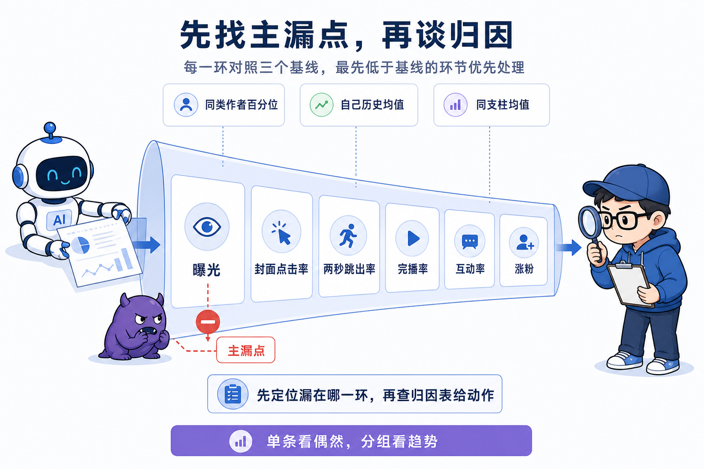
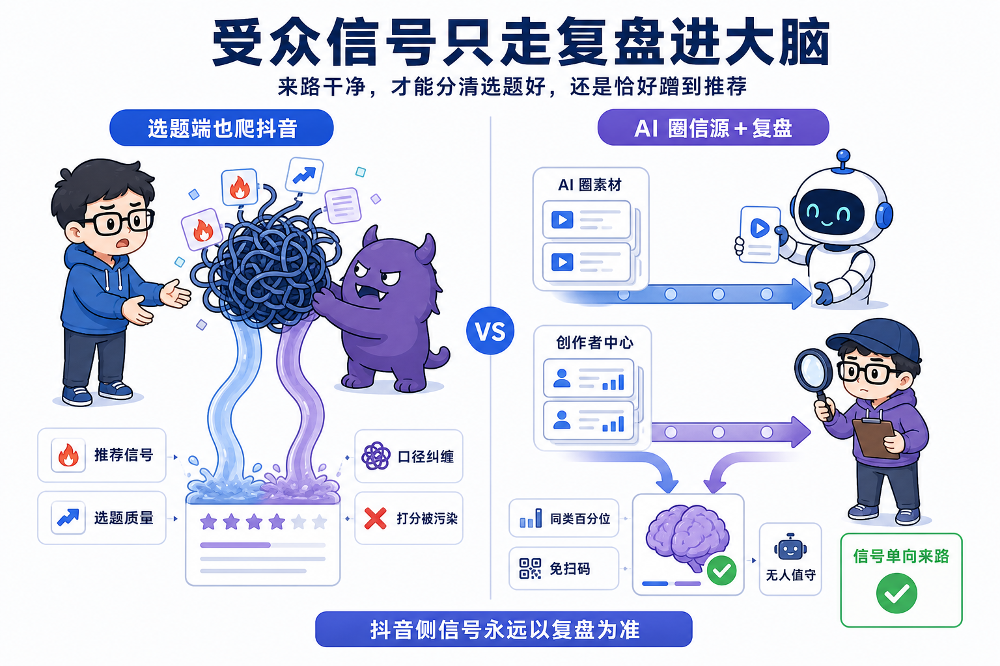
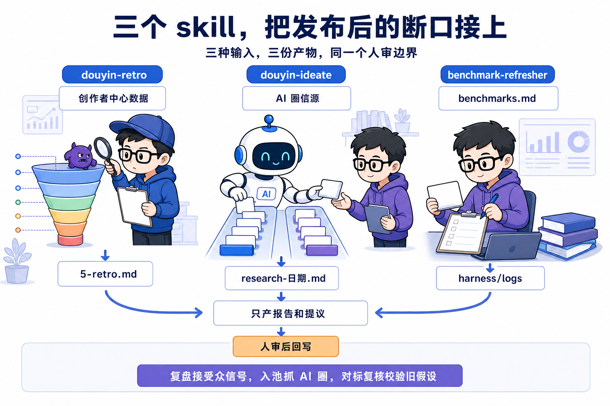
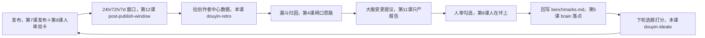

# 第 13 课 大环闭合，复盘、热点入池、对标复核

模块三收工时，生产线已经无人值守。定时 agent 每天替你取题、创作、出审，人只做两件事，点过审核卡，点确认发布卡。可你把镜头拉远看整条流水线，会看到环是开口的。选题池的出入口都通，发布之后那一截是断的。数据发出去没人回头看一眼，brain 里那批对标和打法还停在开账号那天的假设，下一轮选题打分用的还是旧尺子。

第 11 课立了治理线宪法，第 12 课把调度器和任务注册表搭起来，三张任务卡已经躺在 tasks.md 里等着执行。这一课给三张卡装上各自的执行 skill，让它们真的跑起来，把发布之后那一截接上。做完这一课，你手里的系统第一次成为一条完整的环，一条已发布内容从发布到回写 brain 的路径，你能不看笔记口述。

全课立一个判断，后面每一节都回扣它。受众平台的反馈只走复盘这一条路进大脑，才能分清一条内容是选题好，还是恰好蹭到了推荐。这套设计把这条来路叫**信号单向来路**，本课的判断锚点。

## 一、复盘，把发布的数据接回来

复盘是治理线里唯一碰受众数据的任务，信号进来就靠这一条路。窗口一到，dispatcher 派活给 douyin-retro，它做四步，拉数据、归因、产报告、提议。

第一步拉数据。数据通道复用 social-auto-upload 的抖音 cookie，免扫码，跑 fetch.py 脚本。tools/social-auto-upload 不在课程仓 clone 里，是外部件，第 7 课按 sau-setup 的说明自装。装好才有这个目录和 cookie 通道。

```bash
cd tools/social-auto-upload
.venv/bin/python <skill>/scripts/fetch.py --out /tmp/retro.json --keep-xlsx content/_research/
```

脚本用标准库解析，零额外依赖，产物是一份 JSON，账号级对标百分位加每一条作品的十六个字段。fetch.py 有一个约定要记住，退出码 2 代表 cookie 失效，这时候去跑 sau douyin login 刷新，然后停止。拿空数据硬分析是复盘的大忌，cookie 挂了就是挂了，先修通道再谈归因。

不打算发抖音的学员，跳过这条拉数路径。课程仓 `content/_research/作品列表.xlsx` 是现成样例，clone 就在仓库里。用它当输入，不跑 fetch.py，直接从下面的 `media metrics record` 起做归因，把样例数据喂进命令。归因的每一步照常走，主漏点、归因表、分组横切都不依赖你的账号。这也让结课检查清单第④项在无账号条件下照样完成。第④项是一条注册了 ideate、check、retro 的治理线，retro 一环对无账号学员的标准是用样例数据跑通归因、产出报告和提议，不要求真实拉数。

拉到数据立刻记账，不等分析。命令是 media metrics record，一次记一条目标作品在一个窗口的表现。

先交代命令来源。第 6 课你自建的是 next、promote、flip、check 四个命令，本课的 metrics record、后面的 backlog sweep 不在里面，retro_done 这个状态也不在你自建的迁移表里，自建版会拒掉。本课按课程仓 main 的完整版写，摘的命令是 `git checkout main -- tools/console`，摘完按第 1 课的方式构建。也可以让 AI 照第 6 课的 SDD 方式补命令，两条路都通，本课默认用完整版。

```bash
media metrics record <slug> --window <24h|72h|7d> --json-data '<该条数据对象>'
```

这条命令把播放量、完播率、平均播放时长、点赞、评论、收藏、涨粉、主页访问这些数字写进账，7 天窗口还自动回填选题池对应条目的 metrics 字段。记账和分析解耦，分析半路被打断，数据也已经留了痕。这个先记后析的顺序和第 3 课真相源纪律是同一个道理，原始数据先落地，后面的分析随时可以重跑。

第二步归因。归因要把数字异常翻译成下一条该改什么，具体分两步走，先定位漏在漏斗哪一环，再查归因表给动作。漏斗是抖音推荐机制的层层过滤，曝光到点进看封面点击率，点进到留下看两秒跳出率，留下到看完看完播率，看完到被推看互动率，互动到沉淀看涨粉。每一环拿这条作品和三个基线比，同类作者百分位、自己历史均值、同支柱均值，最先低于基线的那一环就是主漏点，优先归因它，别的先放着。归因表长这样，封面点击率低对应封面标题没勾住，动作是改封面文案；两秒跳出高对应前 3 秒钩子废，动作是重写开场；完播率低对应节奏拖、信息密度低，动作是压缩时长卡掉废段；互动率低对应有信息没共鸣，动作是结尾加提问或 takeaway。互动率的算法是点赞加收藏加评论加转发再除以播放。每条作品归完因，再做一次横切，按支柱、体裁、时长、来源分组比均值，找系统性规律，单条看偶然，分组看趋势。

第三步产报告。报告两份。一份写进这条内容自己的目录，5-retro.md，数据快照加漏斗诊断加主漏点加归因加动作清单，模板在 content/_template 里。一份是治理执行记录报告，落 harness/logs/日期-retro.md，格式用统一的报告模板，任务触发目标、现状、发现表、变更提议、盲区、落地记录五段，变更提议列成可勾选项。原始 xlsx 留在 content/_research，可追溯。

第四步收口记账。分析做完，这条内容的状态翻成 retro_done。

```bash
media flip <slug> retro_done
```

同时 dashboard 数据汇总表补上快照行，index.jsonl 记一条记录，applied 先置 false。复盘本身到此为止，它只产报告和提议，绝不自动改 brain，这是第 11 课的铁律，这一课的执行 skill 原样兑现。三个窗口各有各的看点，24 小时看首日反应和冷启动，72 小时看衰减斜率，7 天看长尾。小样本要警惕，播放量三位数的时候，漏斗里每个百分比都是噪音，别拿一条冷门内容去推翻基线。



## 二、复盘怎么设计，归因要能重算

复盘用脚本归因，不用人工看数，因为归因要能重算。这是本课第一个设计决策，两个方案摆出来。

方案 A，人工看数。发布后每天抽空去创作者中心翻一遍，哪条播放高、哪条评论多，心里记个大概，觉得火就想想为什么，把结论带进下一题。代价摆在这里。数据不会等人，24 小时、72 小时、7 天三个窗口一晃就过，人一忙就漏。历史均值靠记性，记不住就没有对照，不知道这一条到底是好是坏。样本攒到几十条，肉眼看不过来，系统性规律藏在分组均值里，人眼抓不出来。最要紧的是，人工看数的结论写不进机器，下一轮打分没法拿上一轮做输入，环接不上。

方案 B，脚本归因。脚本按固定窗口去创作者中心拉数，拉到即记账，每条内容的每一环自动和三个基线比，最先低于基线的环标成主漏点，查归因表给一条动作。这套做法的好处是可重复、能定时、留痕可查，窗口过了还有账可追，几十条样本的均值一条命令就算出来。代价是归因表只覆盖已知症状，平台新出的分发动作、账号特有的一次性异常，脚本只会标成盲区，要人去看，报告里专门留了盲区一段。

课程仓选了 B，理由只有一条，归因要能重算。A 的结论依赖人当时的记忆和状态，同一份数据换个人看能得出两套结论。B 的每一步都有原始数据顶着，同一份数据任何时刻重跑都得出同一个主漏点。可重算是让结论能被回写 brain、能被下一轮打分引用的前提。A 和 B 还可以混着用，脚本负责机械定位，人负责盲区，课程仓现在就是这么跑的，报告把机器判不了的全列进盲区等人。

## 三、为什么从创作者中心拉数，不爬抖音

受众平台的信号从哪条路进系统，课程仓的答案是只从复盘进，选题端不碰抖音。这是本课第二个设计决策，也有两个方案。

方案 A，选题端也爬抖音。抓抖音热门、同领域爆款，当选题线索，看起来能直接抄近道。课程仓实测过这条路，2026 年 6 月，采集通道试了抖音主站，反爬太重，headless 浏览器抓不到内容，computer-use 和 Claude-in-Chrome 都要人守在屏幕前，进不了无人流水线。这是可行性，第一道闸就过不去。

就算爬到了，还有个更深的坑，口径问题。抖音给你的是推荐信号，推荐信号和选题质量纠缠在一起，分不开。一条视频播放高，你拿不到数据说清是选题踩中大众需求，还是平台恰好给了冷启动流量。选题端直接吃这个信号，打分就被污染，加权重还是减权重没有依据，你不知道是选题好还是恰好蹭到推荐。判断锚点那句话在这里落第一次。

方案 B，选题端只从 AI 圈信源抓料，受众信号单走复盘。复盘的数据来自创作者中心后台，能看到这条内容在自己账号上的真实表现。曝光、播放、完播率、互动、涨粉，每一环都有平台给的同类百分位当参照，归因就在可控口径里做。这样打分的人永远只看两类输入，AI 圈的素材，加上复盘沉淀下来的结论，每一类来路都干净。代价是选题端少了抖音热门的直接线索，新方向的发现会慢，这块缺口靠两件事补，对标复核从 B 站和 YouTube 捞正在涨的同类账号，复盘评论区挖真实反馈。

技术栈上这条选择对应一个具体事实，复盘拉的是创作者中心，不是抖音公开页。创作者中心的数据带同类百分位，是平台白送的对标参照，公开页没有。创作者中心走 sau 的 cookie 通道，免扫码、可无人值守，公开页反爬。课程仓的 fetch.py 用标准库解析，不加新依赖，因为这里只有一个动作，把后台列表导成 JSON，不值得为它引入一个解析框架。选标准库选的就是这一点，动作越小，依赖越轻，越不容易坏。



## 四、热点入池，选题端只信 AI 圈

ideate 每两天跑一轮，选题端只从 AI 圈抓料。它用 agent-reach 抓 AI 圈的实质素材，X、Reddit、HackerNews、GitHub、arxiv，抓最近两三天的增量，新模型、新工具、AI 新闻、值得拆的项目，每条线索记下标题、链接、来源、热度信号、日期。agent-reach 有几个已知的坑，search-twitter 的链接字段常空，要从推文正文末尾取 URL，热门泛词如 Cursor 噪音多需要筛，Reddit 读帖要代理，这些写在 skill 里，跑之前先看一眼。

抓完过五道筛子。第一道过期清扫，每轮必做，先于去重，机械规则把过期的 idea 翻成 expired，记账走 media backlog sweep --apply，expired 条目留在池里做去重比对，不删除。第二道去重，agent-reach 的线索按主题合并，再和选题池加已发历史比对，30 天内同主题直接丢。第三道砍题，不符定位、做不了、纯噪音的砍掉。第四道机制分析，把候选聚成三到五个主题群，诊断每群靠什么传播，实用、惊奇、时效热度、社交货币里挑两三个，给一句机制解释。第五道列缺口，哪些角度需求高供给少，哪些已红海要差异化。

筛完打分，双赛道六维。每条候选先判赛道，深度题还是流量题，两套权重，深度题重实用和完播，流量题重时效和惊奇。六个维度，实用、社交、惊奇、完播、时效、触发，各打 1 到 5 分，按对应赛道权重算总分，落到 S、A、B、C、D 五档，S 级立即做，A 级优先排，D 级放弃。打完分定形式，口播还是图文，判断不了时深度题默认口播、流量速览默认图文。再定 urgency，流量题蹭突发热点是 today，深度题默认 queue，蹭旗舰发布可以破例升 today。最后按账号 6 比 4 的配比把深度题和流量题混排成一份清单。

产出两份东西。调研报告 research-日期.md 写进 content/_research，是给人读的快照。候选全部入池，每一条按字段契约写进候选文件，title、alt_titles、track、format、score、tier、六维 scores、urgency、reason、links、tags、created，然后走 media backlog add。撞车的条目默认拒收，命令会列出撞了谁，确认是差异化新角度可以 --force 单条放行。manual 模式停在这里，提示人读报告挑题。第 11 课说的闸就在这一步，机器可以打分、排序、写报告，挑哪条做还是人说了算。

真实跑一轮看效果。2026 年 7 月 17 日那轮，agent-reach 扫了约 60 条线索，去重去噪后 4 条入池，Kimi K3 发布、Grok Build 开源、Muse Spark 跑分口径、Ornith 存疑待核，2 条深度 2 条流量，同时按规则清扫了 3 条过期 idea，两条 today 超 2 天一条超 7 天，全部翻 expired。入池和过期清扫视同状态记账，可以自动，这是治理线宪法划好的边界。撞题合并、剔除这类判断性动作不归 ideate，归 backlog-gardener，只产提议，人审后应用。改打分权重更不在本任务里，打分偏差靠复盘反哺校准。

## 五、对标复核，验证打法还成立吗

brain 里的对标和打法会变旧，benchmark-refresher 定期重抓，验证它们还成立吗。AI 圈几周一变，对标账号会停更转向，一条打法三个月前成立，今天可能已被新形式取代。这个任务默认三十天一次，把 brain/benchmarks.md 全量过一遍。

流程四步。第一步读现状，把 benchmarks.md 的对标账号、有效打法、爆款拆解逐条列出来，每条带着当初为什么收录。第二步抓当前证据，agent-reach 搜 X、Reddit、HN、GitHub、YouTube、B 站、小红书。打法看底层假设还成立吗，绑定具体技术的打法，看那个技术过气没有。对标看跨平台露出的账号近况，顺手从 B 站和 YouTube 捞正在涨的同类账号当新候选。爆款拆解看那些为什么火的模式还在不在当下热内容里。第三步逐条判定，成立、存疑、失效、建议新增四类，每条必须带证据，链接加日期，无证据不下结论。第四步产报告，按统一模板写到 harness/logs/日期-benchmark-refresher.md，变更提议列成可勾选项，人审后勾哪条改哪条，任务绝不自动改 brain。

这个任务有一个写在自己 skill 开头的能力边界。agent-reach 能验 X、Reddit、HN、GitHub、YouTube、B 站、小红书，验不了抖音账号的活跃度，抖音反爬，没有读取通道。纯抖音的对标只能标需人工核，或者交给复盘用自己的数据侧面印证，报告里如实标盲区。这个边界和信号单向来路是同一个选择的两面，抖音侧的信号只从复盘那一条路进，benchmark-refresher 用跨平台证据补旁证，抖音自身表现永远以复盘为准。

课程仓 2026 年 8 月那轮复核是活例子。程序员鱼皮在 B 站高度活跃，99.4 万粉，投稿 959 条，首发实测打法证据显著强化，一条 DeepSeek Harness 首发实测 81.3 万播放。柱子哥连续两轮核实不到，挂了五十二天，报告建议人拍板，配抖音渠道去核、降级保留、或者直接剔除。LLM 张老师那条是错的，原来录那条视频的是极客时间，LLM 张老师本尊 6.5 万粉，方向是手写大模型代码，和 Claude Code 源码无关。卢菁博士名字对不上人，11.6 万粉的大号和小号被写混了。一轮复核挖出三处硬错，这些错只有定期重抓才能暴露，平时根本看不出来。那轮复核还验证了一条打法，宽口径 AI 工程题破圈，课程仓自己的复盘数据早就得出这个结论，这次在外部平台拿到独立证据，横评体裁在 B 站和 YouTube 都是头部，自有结论和外部证据第一次同向。



## 六、这就是 Loop，大环全景

把整条环画出来，发布之后接复盘，归因产提议，人审回写，brain 喂给下轮打分，环合上。



环上每一段都不是今天凭空造的。发布是第 7 课的二次包装加第 8 课的人审双卡。窗口触发是第 12 课的 dispatcher 读注册表，retro 卡写的是 post-publish-window。归因借了第 4 课闸口的思路，检查一次性前置，找主漏点只盯最先低于基线的那一环，验最终数据不撒网。只产报告是第 11 课的治理线铁律，复盘和复核都原样兑现。人在环上点按钮，是第 8 课把人的进场做成结构化事件，这里人审勾选的就是那份变更提议清单。回写 brain 落在第 5 课立的账号大脑，它从立起来那天就是决策依据的唯一落点。下轮打分是本课 ideate 的双赛道六维。第 12 课把调度和执行解耦，这一课把执行填满，整条环第一次闭合。

口述一遍完整路径。一条内容发布，meta.status 翻成 published。24 小时后 dispatcher 发现它到点，派 douyin-retro，脚本拉创作者中心数据，拉到即记账。归因找到主漏点，查归因表给动作，写进这条内容的 5-retro.md。收口把状态翻成 retro_done，report 落到 logs，index.jsonl 记 applied false。人读报告，勾选大脑变更提议，回写 brain/benchmarks.md，新增或修正打法行，刷新历史均值基线，index.jsonl 的 applied 翻 true。两天后 ideate 跑新一轮，读 benchmarks.md 打分，新打法进权重，新基线当对照。新选题入池、被挑中、创作、发布。环回到起点。这条路径的每一站都能指出文件在哪、命令是哪条、人来不来，这就是本课的验收标准。

要把这三件套接进你自己的治理线，可以照这段话派工。我的注册表里 retro、ideate、benchmark-refresher 三张卡已经启用，请按 douyin-retro、douyin-ideate、benchmark-refresher 三个 skill 的流程各跑通一轮。复盘先拉一条已发布内容的数据，media metrics record 记账，漏斗归因写进 5-retro.md，media flip 翻 retro_done，报告按统一模板落到 logs，只产提议不碰 brain。调研按 agent-reach 抓料、双赛道打分、backlog add 入池，停在 manual 模式。对标复核把 benchmarks.md 逐条过一遍，标成立、存疑、失效、建议新增，报告落 logs。三样都停在人审，不自动改任何 brain 文件。

## 七、窗口触发与欠账

复盘是窗口触发，窗口错过就是永久欠账。一条内容发布后，24 小时、72 小时、7 天各拉一次，容差正负 12 小时，同一个目标同一个窗口只跑一次，记录落在 index.jsonl。窗口错过的数据不会回来，趋势指标不可比，这是窗口触发和周期触发的根本差别，周期过了下轮还能补，窗口过了就永久欠账。

课程仓真实欠过。2026 年 7 月 8 日那轮复盘，账本显示治理线首跑只清了两个检查点，EP05 之后欠了一串。那轮按窗口逾期不超过 7 天筛出可补目标，明确排除已严重逾期的那批，因为补做的数据是当下快照，不是窗口值，硬补进去只会污染历史均值基线。欠账怎么办，两条路。

第一条，人工收。手动 /douyin-retro 把欠的补上，数据取当下快照，报告显著标注补做，非窗口值，趋势指标不可比。index.jsonl 的 window 字段记 debt，和正窗数据区分开，之后做横向对比时知道这组数口径不同。

第二条，把补账本身做成一个任务。tasks.md 里躺着一张 retro-debt-collector 任务卡，disabled，它没有执行 skill，只有五件事，为什么存在、目标怎么选、干什么、产物与记账、人审关注点。这五件事就是未来写执行 skill 的规格种子，接入那天按卡写 skill，翻 enabled。第 12 课说过任务卡是 SDD 的又一次应用，这里是它最纯粹的样子，能力还没建，规格先占位，账先记着，等它被接上的那天直接照着干。account-audit 的任务卡里还有一条联动，retro 逾期积压超过 3 条就报警，并建议接上 retro-debt-collector。用规格占位未来的能力，这句话会在第 14 课元层那里再次出现。

## 八、数据不只是数字，评论区是人的来信

评论区是实打实的人在说话，一条评论可能就是一个新选题。复盘报告里的互动率是一个数字，但数字背后是具体的提问和具体的抱怨。课程仓把看评论区写成了复盘的固定动作，目标是抓真实反馈和新选题线索。

复盘报告的变更提议里有一类专门收这个，评论热词、衍生线索，建议进 content/_backlog 入池。入池前过一道 ideate 去重，防止和池里已有的题撞车。这是数字和文本的分工，数字指路，告诉你哪条值得翻，文本给肉，告诉你翻到了什么。07-08 那轮复盘，ep15 评论 25 条全系列最高，报告把这条列为人工待办，评论文本抓取的工具还没建，建议人亲自去创作者中心翻一遍挖新选题线索。25 这个数字本身没有内容，它指着一个有内容的地方，数据不只是数字，说的是这件事。

顺着这个思路还有一层。复盘沉淀的打法里有一条是结尾给具体行动号召，评论区扣 XX 换资料，那条打法的证据是 7 个数据点，全是评论数和互动率，正面反面各一堆。评论区既是反馈来源，也是打法验证的考场，一个 CTA 有没有用，看它撬动的评论数就知道，数字和文本在这里互相印证。给 AI 派活时把这条写进复盘任务卡，看评论区是固定动作，挖到的线索要落进变更提议，入池前先过 ideate 去重。

## 九、几个判断带走

主判断一条，受众平台的反馈只走复盘一条路进大脑，才能分清是选题好还是恰好蹭到推荐。三句支撑。复盘用脚本归因不用人工看数，因为归因要能重算，可重算才有资格回写 brain。选题端只从 AI 圈抓料，打分才不被推荐信号污染，抖音侧信号永远以复盘为准。窗口错过就是欠账，欠账靠规格占位，retro-debt-collector 的卡就是未来能力的种子。

留一个问题收尾。治理线现在会自己跑了，复盘、入池、复核、调度，都注册在 tasks.md 里，会按窗口和周期被 dispatcher 派出去。可这些任务跑得好不好，间隔设得合不合理，采纳率高不高，没人看着。dispatcher 会不会一直去选注定低产的任务，调度的参数会不会一直停在开账号那天拍脑袋的值。第 14 课讲治理线自己怎么被看着，元层自审，读运行账本，给治理线自己的参数划一条可自调的边界。
