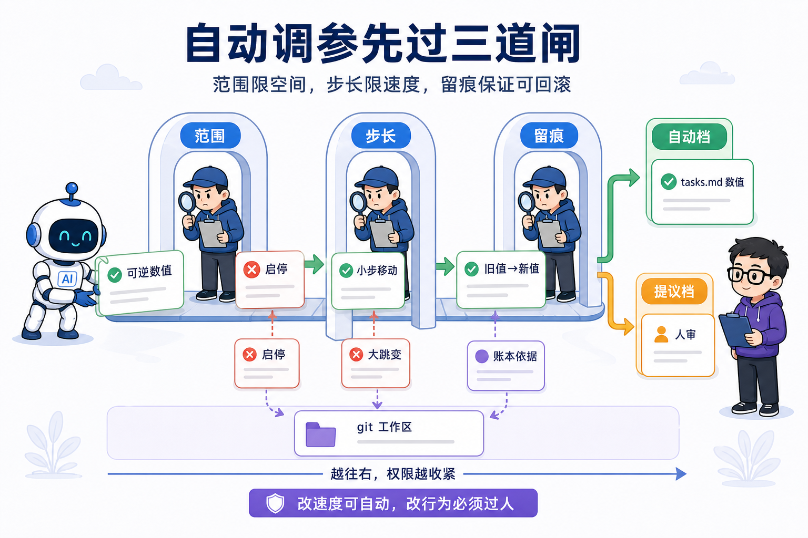
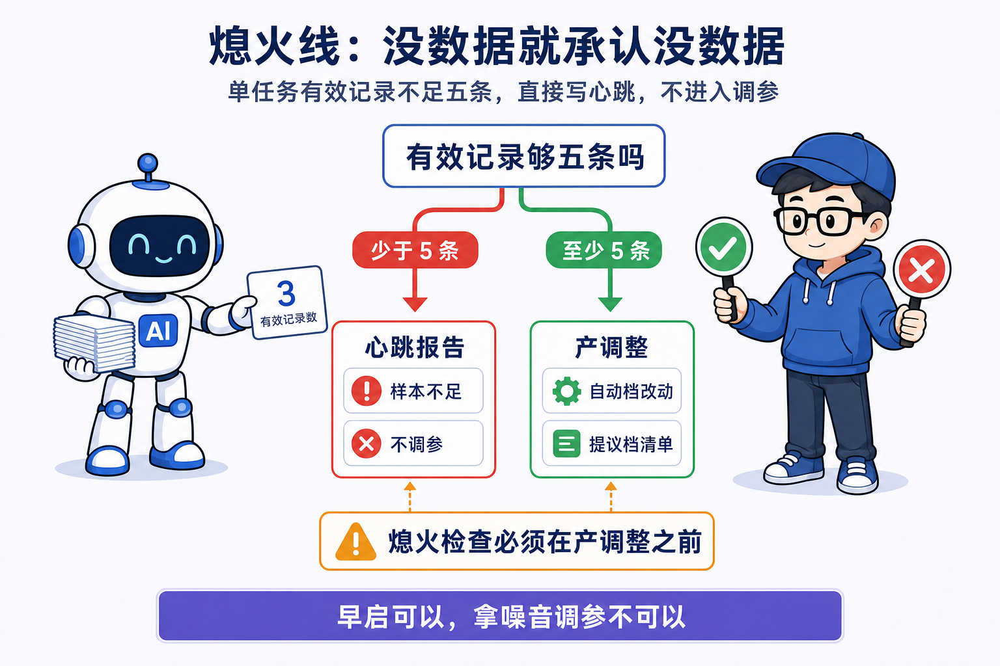
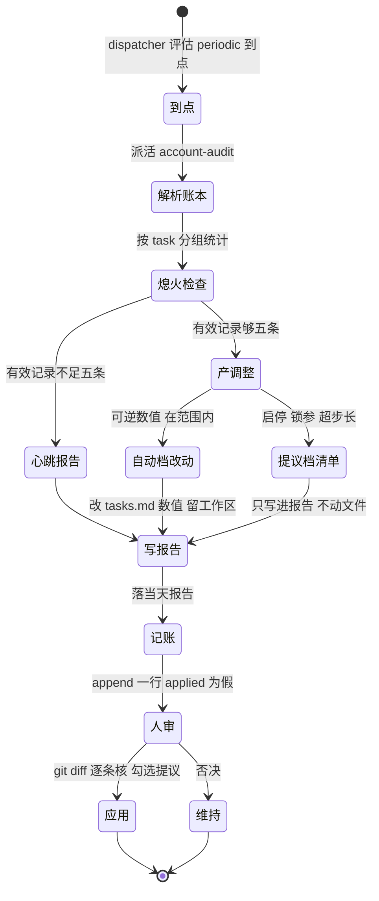
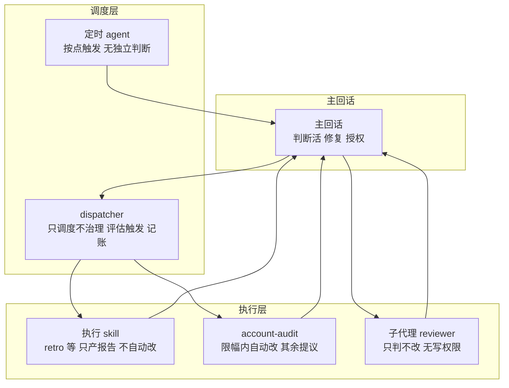

# 第 14 课 元层自审，系统自己调自己的边界

> 代码仓库：<https://git.aicodex.cc/devlist/douyin-media>
> 对应分支：`14-account-audit`

**AI 自己改自己的配置不是玄学，是一张明确的权限表。范围、步长、留痕，写在表里，不在模型里。** 前十三课搭起来的系统已经能自己养自己。第 11 课立了治理线，只养资产不造内容，只产报告不自动改。第 12 课让 dispatcher 读 tasks.md 注册表派活，调度与执行解耦。第 13 课把大环闭合，发布、复盘、提议、人审、回写大脑、下轮打分，一环扣一环。但整条治理线还缺一双看着自己的眼睛。tasks.md 里每个间隔、每个窗口、每个权重，都是第一次配置时人拍脑袋定的。系统跑起来之后这些数字对不对，没有人回头看。没有这一层，配置在钉下那一刻就被冻结。本课接入治理线的元层 account-audit。它读运行账本，统计每个任务执行多少次、成多少次、人的采纳率多少，再按一张钉死的限幅表回调整治线自己的配置。能自动调的只有可逆数值，启停和大跳变一律交给人审。做完这一课，你的系统多了一层看着自己的机制，Loop 自己调自己，模块四的题眼在这一课收口。

## 一、治理线也会烂，参数钉下就被冻结

治理线本身也在熵增。第 11 课给治理线定的准入判据是没人催、但放着会烂的，才进这条线。这条判据对治理线自己同样成立。dispatcher 的触发类型、每个任务的周期和窗口、加权池的权重，全是第一次配置时人拍脑袋给的初始值。不对着运行数据调，dispatcher 会一直选注定低产的任务，系统会一直按一个可能错得离谱的节奏跑下去。真实仓库 account-audit 的任务卡开场就把这件事挑明，weight、周期、窗口全是初始拍脑袋，没有这层，配置在钉下那一刻就被冻结。这句话值得你抄进自己的任务卡，它是元层存在的全部理由。

治理线的宪法只产报告不自动改，管的是 brain 和已发布资产，那是不可逆的。元层调的是治理线自己的配置，这是另一类东西。间隔、窗口、权重是写在 tasks.md 里的数字，改错了 git 能回滚，是可逆的。所以元层的自动改没有破坏宪法，它在宪法划出的可逆边界之内，给自己开了一个口子。这个口子开在哪，本课第五节讲透。

2026 年 7 月 8 日元层首跑，留下了一份真实报告。当时账本只有 12 条，全部是当天批量补跑的记录，历史跨度零天。所有任务的有效记录都低于熄火线的五条，所以它一个参数都没改，只出了心跳报告。但它在心跳里报了一个结构性的东西。retro 逾期积压六条，超过任务卡阈值三条，它据此提议接入还在禁用状态的 retro-debt-collector。这就是元层第一跑的价值。即使没数据可调，它也能看见治理线里那种放着不会自愈的结构性欠账，并且把提议写下来交给人审。

元层审的是治理线自己，不碰 brain、不碰内容、不碰生产线。这一条写在 account-audit 的 SKILL.md 开头，是它的边界。它读的账本、改的配置、写的报告，全在 harness 这个目录里。你给元层派活时，边界也要这样钉死，它一旦越界去改生产线的参数，就是新的失控点。

## 二、读账本，把每任务跑过的路数清楚

元层的第一步是读账本，不是读报告。账本在 harness/logs/index.jsonl，一行一条执行记录，是 JSON 格式。字段有 ts、task、target、window、result、report、findings、applied。ts 是执行时间，task 是任务名，target 是这次任务作用的对象，window 是触发窗口，result 是结果类型，report 是报告路径，findings 是提议条数，applied 是是否被人审应用。拿真实的账本举例，一条是 retro 对某条内容的 72 小时窗口复盘，findings 四，applied 为真，note 里写人在看板逐条人审通过。另一条是 benchmark-refresher 的周期复盘，findings 十四，applied 为假，note 里写十条变更提议全部待人审，brain 零改动。你在自己的仓里读账本，看到的就是这样的行。

按 task 分组统计。截至 2026 年 8 月 19 日，真实账本四十行。retro 二十七条，ideate 六条，benchmark-refresher 三条，backlog-gardener 三条，account-audit 一条。这个分布本身就有信息量。retro 是窗口触发，内容一发布就有 24 小时、72 小时、7 天三个检查点，记录最多。ideate 是两天一跑，六个月积累六条，节奏正常。benchmark-refresher 三十天一跑，只有三条。backlog-gardener 七天一跑也只有三条，因为它注册得晚。元层要读的就是这样的分布，哪条任务跑得多、哪条跑得少、哪条跑出过 applied 为真。

成功率怎么数是个设计问题。result 字段有 report、report+pooled、report+pooled+swept、report+publish-health-flag、report+retro_done、no-targets、skipped-duplicate 等变体，组合后缀是一次执行里顺带做完的附加动作。no-targets 表示这次没有目标可处理，skipped-duplicate 表示重复触发被调度层拒绝。这两类不是失败，是调度层在正确说不。元层统计成功率时要把它们单列，否则会把没跑成和跑错了混成一个数。课程仓的真实账本里就有一条 skipped-duplicate，记录里写当日已有成功运行，任务卡钉距上次成功不满三十天不跑，判定为重复触发，跳过执行。这类行说明调度层没空转，它认得自己的触发条件。你给自己定成功率口径时，先想清楚 no-targets 和 skipped-duplicate 算不算成功，这个决定会影响后面所有判断。

采纳率看 applied 字段。但 applied 由人审后翻成 true，且 applied_note 记录落地细节。有的报告是部分落地。真实账本里 retro 06 月 28 日那批，applied 为真，note 里写本轮只落了 brain 部分，提议三和提议四没落，因为超出本次只改 brain 的授权范围，待另行授权。所以采纳率不能只看布尔值，要抽样看 note 里的落地范围。这一节的结论是，读账本先读字段，统计先定口径，口径不定，后面的调参全是空转。

这步 AI 会怎么错。它会把 result 字段的变体当成不同任务，数出十几行"新任务"。它会数错 applied，把 applied 为假当成没采纳，忽略 note 里写的人审还没做。它会从账本里数出 ideate 零条，直接下结论说 ideate 没跑，但 ideate 的判据是 content 目录下 research 报告日期，账本本来就不记它。元层统计 ideate 要另查报告日期，这是账本格式的已知边界。

## 三、定你的自调限幅表

限幅表把能自动改什么钉成一张表，字段是参数、当前值、可自调范围、单次步长。锁定状态用范围字段表达，范围写成锁定，就是不允许自动动。这张表就是判断锚点说的那张权限表。真实仓库的限幅表有五行。

| 参数 | 当前 | 可自调范围 | 单次步长 |
|---|---|---|---|
| benchmark-refresher 间隔 | 30d | 14~60d | ×1.5 或 ÷1.5 |
| backlog-gardener 间隔 | 7d | 7~30d | ×1.5 或 ÷1.5 |
| ideate 间隔 | 2d | 锁定 | - |
| retro 窗口 24h/72h/7d | - | 锁定 | - |
| weighted-pool weight | 预留 | 1~12 | ≤±3 |

先看怎么设计这张表，这里摆两个方案。方案 A，全部参数人审，任何改动都先提报告等人点头。方案 B，元层在限幅表范围内自动改可逆数值，范围外和启停类一律提议人审。方案 A 最安全，但配置会冻在那里，因为人不会每周去看一次配置 diff，这恰恰是元层要治的病。方案 B 自动调可逆数值，把人的注意力只留给启停和大跳变，代价是元层自己也要被范围和步长约束，还要留痕，否则它就成了一个新的失控点。课程仓选方案 B，判断锚点的三个词，范围、步长、留痕，就是对方案 B 的约束。

再看怎么定哪些可自动。真实表的规律很清晰。间隔数值可自动，因为它是连续量，改错是慢漂移，git 能回滚。ideate 间隔锁定，因为生产线消费选题池的节奏依赖它，动它等于动生产，必须人审。retro 的 24 小时、72 小时、7 天三个窗口锁定，因为它们是复盘方法论本身，不是调度参数。weighted-pool 的权重预留 1 到 12，步长不超过正负三，因为加权池还没有启用任务，先占位。你定自己的表时按这个规律套，连续可逆数值进自动档，和别处耦合的参数进锁定，判断方法论的进锁定，占位字段先给范围不给动作。

限幅表之上还有一层调整规则，它是 if-then 规则，不是数值表。真实仓库写了五条。连续两轮成功且零发现，间隔放宽一档。出现人采纳的重要提议，间隔收紧一档。采纳率低于三成且样本够五条，不自动动，提议降频或修任务卡。连续三次执行失败，提议停用。retro 逾期积压超三条，报警并建议接 retro-debt-collector。这一层把表从静态变成动态，表给边界，规则给动作，缺一层这张表就是一纸空文。

## 四、五步流程，从账本到两档清单

account-audit 不是 CLI，是一个 skill，对外暴露的是五步工作流。第一步解析账本，index.jsonl 一行一笔账，按行解析 JSON、按 task 字段分组，统计执行数、成功率、findings 总数、采纳率、retro 逾期积压。采纳率口径和逾期积压的算法在任务卡里，见第六、七节。第二步熄火检查，有效记录不足五条的任务只进报告标样本不足，跳过调参。第三步产调整，逐条对照限幅表和调整规则。第四步写报告，落到 harness/logs 当天日期的 account-audit 报告，格式照 report-template。第五步停，交给 dispatcher 记账。元层自己也是 periodic 任务，它的执行也是一行账，由 dispatcher 追加进 index.jsonl。

第三步产调整分成两档。自动档，范围内的可逆数值，直接改 tasks.md 的 yaml 对应字段，报告里记旧值到新值加依据，依据是账本哪几行，改动留在 git 工作区供人 diff 复核。先垫一个 git 概念：git 里文件分「已提交」和「还没提交」两种状态，改动先停在「还没提交」（工作区），人用 `git diff` 能看到改了什么，确认后才由人 commit 固化。自动档只改到工作区，就是让每一步改动在固化前都过得了人眼。提议档，启停、锁定参数、超步长、修任务卡措辞，只写进报告等人审，不动文件。这两档的分界就是判断锚点的分界，自动档只在范围内动数字，其余一律过人。

第四步写报告，report-template 是治理线所有任务的统一格式，五段。现状是查了什么用什么查，发现是逐条带证据，变更提议是人审勾选的清单，盲区是机器查不了需要人工的部分，落地记录是人审后回填。account-audit 的报告在此基础上加三样，各任务指标表、样本状态、自动档改动清单。心跳报告也照写全格式，只是自动档改动清单为空。

一次元层自审从解析账本到人审应用的完整路径可以口述。dispatcher 评估 periodic 三十天到点，派活给 account-audit。它读 index.jsonl 按 task 分组统计。熄火检查，不足五条的标样本不足。够五条的进产调整，自动档改动留在 git 工作区，提议档写进报告。报告落盘到当天日期的文件。dispatcher 追加一行账，applied 为假。人看到报告，先 git diff 逐条核自动档改动，改错可回滚，再勾选提议档。勾完应用，applied 翻 true。这条路径上，自动档的收口在 git 工作区，提议档的收口在人的勾选，账本的收口在 applied 字段。

这步 AI 会怎么错。它会把自动档改动直接 commit 掉，应该留在 git 工作区供人 diff。它会越过限幅表范围改数值，比如把 benchmark-refresher 间隔改到 10 天，范围外必须走提议档。它会因样本不足空转出建议，比如拿三条记录说采纳率偏低建议降频，应该标样本不足等积累。它会改 tasks.md 的文字部分，比如顺手改任务卡的措辞，红线是只动 yaml 数值字段。你把验收写进 spec，人审就看这几处。

## 五、自动档与提议档的分界线

范围、步长、留痕，三道闸把自动档框死，这就是判断锚点的展开。先看为什么范围加步长双重限。只有范围，比如 14 到 60 天，一次改动可以整个范围跳过去，等于没有限。步长乘 1.5 或除 1.5，限的是每轮移动速度。两者合起来，配置只能慢漂移，每一轮 diff 足够小，人审得过来。这是系统自我调参的第一个设计选择，把单次移动幅度压小，让每一步都在人可复核的尺度内。

再看为什么必留痕。自动档改动记旧值到新值，加依据，依据是账本哪几行，改动留在 git 工作区。留痕让自动档可回滚、可审计。没有留痕，自动档改完了事后说不清改了什么、为什么改，那和玄学没有区别。判断锚点说写在表里不在模型里，留痕就是把改动从模型的动作变成表上的记录。

再看为什么启停必须人审。调间隔是调速度，启停是改行为。一个错的间隔是看得见的慢漂移，你可以从账本里观察到。一个错停的任务是无声的空洞，它不报错，只是该做的事不再发生。第 10 课的空跑事故就是这个形态，取题空跑了六天，日志喊了六天人没看见。停一个任务如果走自动档，等于把这种无声的空洞交给一个自动判断。所以启停一律提议人审。连续三次执行失败，元层提议停用，而不是自动归零。真实仓库把这个选择讲得很直白，比自动归零保守，任务少且各有独立职责，误停伤闭环。这条保守是刻意的，因为治理线的任务每一条都有独立职责，停错一条，大环就断一节。

分界线的本质是，自动档只允许系统在可逆的数值空间里缓慢移动，凡是改变行为本身的动作，全部交回给人。你给元层写限幅表时，先问这个问题，这个参数改了，是改速度还是改行为。改速度的进自动档，改行为的进提议档。判断锚点在这一节落到第一个实处，范围限住移动空间，步长限住移动速度，留痕保证每一次移动都查得清。



把前面所有设计交给 AI 时，可以照这段话派工。

```text
用 SDD 给治理线接入元层 account-audit，两个产物，一个 skill 加一个任务卡。

## 第一段，account-audit skill
写 .claude/skills/account-audit/SKILL.md，头部 description 写清触发词，覆盖治理线自审、调权、audit、账本分析这些说法。正文五步。第一步解析账本，读 harness/logs/index.jsonl，按 task 分组，统计每任务执行数、成功率、findings 总数、采纳率、retro 逾期积压。采纳率只算落盘满七天的报告，分母是有变更提议的报告数。retro 逾期积压扫 meta.yaml 里 published 超过七天还没翻 retro_done 的条目。第二步熄火检查，单任务有效记录不足五条只标样本不足，跳过调参。第三步产调整，逐条对照任务卡的限幅表与调整规则。自动档，范围内的可逆数值，直接改 harness/tasks.md 的 yaml 对应字段，报告里记旧值到新值加依据，改动留 git 工作区。提议档，启停、锁定参数、超步长、修任务卡措辞，只写进报告不动文件。第四步写报告，落 harness/logs/当天日期-account-audit.md，格式照 report-template，加各任务指标表、样本状态、自动档改动清单。第五步停，交给 dispatcher 记账，本任务自己的执行也是一行账。

## 第二段，tasks.md 里的任务卡
在 harness/tasks.md 立 account-audit 任务卡，五件事齐全。为什么存在写 weight、周期、窗口全是初始拍脑袋，没这层就冻结，早启的代价被熄火线兜住。目标怎么选写 index.jsonl 全量加报告抽样，熄火线是单任务有效记录不足五条只出报告标样本不足不调参。干什么写统计每任务执行数、成功率、人采纳率、逾期积压，按限幅表边界回调本文件配置，步骤住 skill。产物与记账写报告加 index.jsonl 一行。人审关注点写自动档改动在 git diff 里逐条核，提议档重点看采纳率归因，提议多人采纳低是修任务卡不是加大力度。

## 第三段，限幅表和调整规则
限幅表五行。benchmark-refresher 间隔 30 天，可自调范围 14 到 60 天，单次步长乘 1.5 或除 1.5。backlog-gardener 间隔 7 天，范围 7 到 30 天，步长乘 1.5 或除 1.5。ideate 间隔 2 天，锁定。retro 的 24 小时、72 小时、7 天三个窗口，锁定。weighted-pool weight 预留，范围 1 到 12，步长不超过正负三。调整规则五条。连续两轮成功且零发现，间隔放宽一档。出现人采纳的重要提议，间隔收紧一档。采纳率低于三成且样本够五条，不自动动，提议降频或修任务卡。连续三次执行失败，提议停用。retro 逾期积压超三条，报警并建议接 retro-debt-collector。

## 第四段，红线
两条。只动 harness/tasks.md 的 yaml 数值字段，任务卡文字和别的文件一概不碰。不因样本不足空转出建议，没数据就说没数据。
```

这段契约你验收时盯三处。skill 五步齐，熄火线在解析账本之后、产调整之前。任务卡五件事全，限幅表五行、调整规则五条，跟上面写的一致。自动档改动只出现在 tasks.md 的数值字段，git 工作区里能 diff 出来。

## 六、熄火线，没数据就承认没数据

熄火线是权限表的第一条。单任务有效记录不足五条，只出样本不足报告，不调参。这条线的位置很关键，它在产调整之前，解析账本之后。数据不够，根本不进调参环节，直接写心跳。这是判断锚点在时间轴上的第一个体现，表里写明什么时候不许调，不是等模型自己觉得该不该调。



为什么是五条。小样本全是噪音，一次成功或一次失败不是趋势。第 13 课接的复盘任务卡里有句人审关注点，小样本别过度归因，播放量三位数时漏斗百分比全是噪音。元层把这句话用在自己身上，一条记录的 benchmark-refresher 表现好，不说明它该放宽间隔，一条记录表现差，也不说明它该收紧。五条是课程仓选的样本门槛，你定自己的表时，门槛可以不同，但必须有，没有门槛的元层会拿一两行账本给自己加戏。

2026 年 7 月 8 日的首跑就是实证。当时 benchmark-refresher 一条，backlog-gardener 一条，retro 十条但窗口锁定，ideate 零条账本不记，全任务都过不了熄火线。元层一个参数没改，出了心跳。心跳也是报告，照写全格式，样本状态逐任务标样本不足，自动档改动清单为空。这份报告的价值在验证账本格式能读、分组统计能跑、报告能落盘，等于先给元层自己跑一遍体检，而不是一上来就调参。

熄火线早启是任务卡里一个值得单独看的设计。元层的任务卡写，早启的代价被熄火线兜住，没数据时只产心跳报告，顺带验证账本格式。这解决了一个真实的先有鸡还是先有蛋问题。元层要等数据积累够才能调参，但账本格式对不对、统计能不能跑通，需要元层跑了才知道。熄火线让元层可以在数据不够时先上车，只做不伤人的事，把管道跑通，等数据积累够了再开始调。你接入元层时不用等数据攒够，现在就接，它在前几个周期只会产心跳，这本身就是在验证你的账本。

元层红线的第二条写着，不因样本不足空转出建议，没数据就说没数据。这句是熄火线的灵魂。一个没有熄火线的元层，会在样本不足时硬凑一个方向，把噪音当信号，然后堂而皇之调参。有了熄火线，没数据时它就明说没数据。判断锚点在这一节落到第二个实处，权限表不仅写能改什么，也写什么时候不许改。

## 七、采纳率，只统计落盘满七天的报告

采纳率口径只有一句话，只统计落盘满七天的报告，分母是有变更提议的报告数。为什么是七天。报告要给人留审的时间，落盘当天甚至当周，人可能还没来得及看。把还没落盘的报告算进分母，人还没来得及审会被当成不采纳，采纳率假性偏低，会触发采纳率低于三成要修任务卡的错误动作。七天是课程仓给的人审缓冲期，你定自己的口径时，这个数字要跟你实际的审报告频率匹配，人的审速跟不上，缓冲期要更长。

2026 年 7 月 8 日的首跑盲区写得很实在。采纳率口径要求落盘满七天，当轮唯一满足条件的是 6 月 28 日那批报告，但样本仍不足五条，判断不了人采纳的整体趋势，只能观察到 6 月 28 日的提议当时还没被人应用。元层在盲区里补了一句，这构不成采纳率低的结论，样本不足不能定性。这是元层对口径的诚实执行，宁可说自己不知道，也不拿不足的样本下结论。

账本里还能看到采纳的细节比布尔值复杂。2026 年 8 月 19 日，一批 applied 翻成 true，note 写人在看板逐条人审通过。但部分落地的情况在 note 里留下痕迹，retro 6 月 28 日那批提议三和提议四没落，因为超出只改 brain 的授权范围，待另行授权。采纳率统计如果不看 note，会把部分落地当成全部采纳。所以元层统计采纳率时，要抽样看报告路径对应的 note，核对落地范围。

再看采纳率低这个信号怎么用。真实仓库的人审关注点写，提议多人采纳低，等于任务跑偏产报告垃圾，该修的是任务卡。这个判断把采纳率和任务卡接在一起。一个任务提议一堆，人一条不采纳，问题在任务卡的目标或口径本身，产的是没人要的报告。这时加大力度只会产更多垃圾报告，正确动作是修任务卡，重新定这个任务该查什么、该提议什么。调间隔改不了提议质量，改任务卡才改得了。判断锚点在这一节落到第三个实处，采纳率不是用来惩罚任务的，是用来诊断任务卡的。

## 八、为什么读账本不读报告

元层的输入是 index.jsonl，不是各报告 md 文件。理由回到第 3 课和第 5 课立过的真相源纪律，账本是真相源，报告是派生件。报告是给人读的散文，账本是一行一条的结构化 JSON。要算执行数、成功率、采纳率，需要的是结构化的字段，不是散文。读报告等于解析自然语言，再从报告里重新推一遍账本已经有的东西，两处漂移的风险。账本里还有报告没有的字段，applied、window、target，计数落盘满七天需要报告路径和 ts，账本都带。


这个选择也有代价和边界。账本只记 dispatcher 追加的，它不记人工在看板手动补跑的细节，不记某些任务的特殊判据。ideate 就是例子，账本不记它的记录，判据是 content 目录下 research 报告日期。元层统计 ideate 时要另查报告日期，账本的零条不能当它没跑。元层也不能只信账本，account-audit 的 SKILL 在干活前必读里写，抽样读对应报告核对 findings 与 applied。账本说 applied 为真，报告里要能对得上。这就是第 3 课的派生链，改上游必抽下游，账本改了报告要能解释，报告改了账本要能回查。

技术栈上，账本用的是 JSONL，一行一个 JSON 对象，不是整块 JSON 文件。选 JSONL 的理由是追加友好，dispatcher 每次只 append 一行，不用读整个文件再重写，多任务并发写也不会互相覆盖整块。解析成本低，按行读、按字段取值。代价是 JSONL 没有索引，统计要全量扫一遍，四十行无所谓，四十万行就要考虑别的存储。你的系统规模到那个量级之前，JSONL 就是账本的合适形态。这一节的核心是一句，元层读账本读的是结构，不是文字，真相源在结构化数据里，散文只给要深查的人看。

## 九、元层自审循环

下面这张图是元层一次自审的完整循环，从 dispatcher 到点到人审应用，心跳路径和调参路径都画在里面。



心跳路径从熄火检查直接到写报告，不带任何自动档改动，但它照样走完写报告、记账、人审这一段。这说明样本不足时循环不中断，只是不产改动。人审是图上唯一一条指向应用或维持的分岔，自动档和提议档都在人审处汇合，没有一条边绕过人。你读这张图时记住一点，循环里所有改动的出口都是人审，图上的每一条边都是权限表的一个条目。

## 十、六类 AI 角色，权限都写在文档里

这一课的加油站把全系统的 AI 角色摆到一张图上看分工和权限。第 4 课你第一次派出子代理时，主回话加 reviewer 是一支最小 Agent Team。走到第 14 课，这支队伍已经长成了六类角色。

定时 agent 在 Claude Code 客户端按点触发，到点把入口文档喂给主回话，它没有独立判断，只负责把时间变成一次启动。主回话跑 daily-run 或 dispatcher，干判断活，编排当天流程，修复问题，做授权，它是唯一承担判断职责的角色。子代理是第 4 课那位 reviewer，只判不改，没有写权限，最多三轮回合，超出上限升级人审，它的权限写在 agent 定义文件里。dispatcher 读 tasks.md 注册表评估触发条件，把到点的任务派给执行 skill，收回报告，append 记账，它只调度不治理，权限写在它的 SKILL 里。执行 skill 们，retro、ideate、benchmark-refresher、backlog-gardener，各自只产报告，除 ideate 的入池和规则化清扫外不自动改任何资产，权限写在任务卡和各自 SKILL 的红线段。元层 account-audit 是最后一种，它在限幅表范围内自动改 tasks.md 数值，范围外只提议，权限写在任务卡的限幅表里。

把六类角色画成一张图，分工和权限一眼看清。



这张图的要点是每一个角色的权限都写在某处文档里。子代理无写权限写在 agent 定义，dispatcher 只调度写在 SKILL，执行 skill 只产报告写在任务卡和红线，元层限幅写在限幅表。没有一个角色是让它看着办的。第 4 课的心法在这里收口，拆 agent 按判断独立性、权限隔离、可并行度拆，不按工作量拆。这个系统里每个角色都是按这条拆出来的，判断独立性把主回话和 reviewer 分开，权限隔离把只读的质检和可写的修复分开，可并行度让多个执行 skill 能同时被 dispatcher 派出去。判断锚点在这一节扩成整个系统的原则，AI 自己改自己的配置是权限表，这一整队 AI 角色的权限也全是表，没有一个在模型里。

## 十一、几个判断带走

三个判断带走。第一个是本课主判断，AI 自己改自己的配置是一张明确的权限表，范围、步长、留痕写在表里，不在模型里，自动档只在可逆数值里慢漂移，启停和大跳变一律过人审。第二个是熄火线，单任务记录不足五条只出样本不足报告不调参，没数据时最优动作是承认没数据，表里写明什么时候不许调。第三个是采纳率口径，只统计落盘满七天的报告，别把还没来得及审当成不采纳，提议多采纳低是修任务卡的信号，不是加大力度的理由。

系统现在会自己调自己的参数了，但调参只改数字，改不了认知。一条任务卡跑偏了，提议产出一堆没人要的报告，数字再调也救不回来。踩过的坑、验证过的打法、修过任务卡的理由，这些教训散在对话里就丢了。第 15 课讲系统怎么长记性，把教训落成文档，让规则回写对应的地方。元层让系统会调参，教训账本让系统记得为什么这么调。这两个合起来，系统才算真的会自己养自己。
