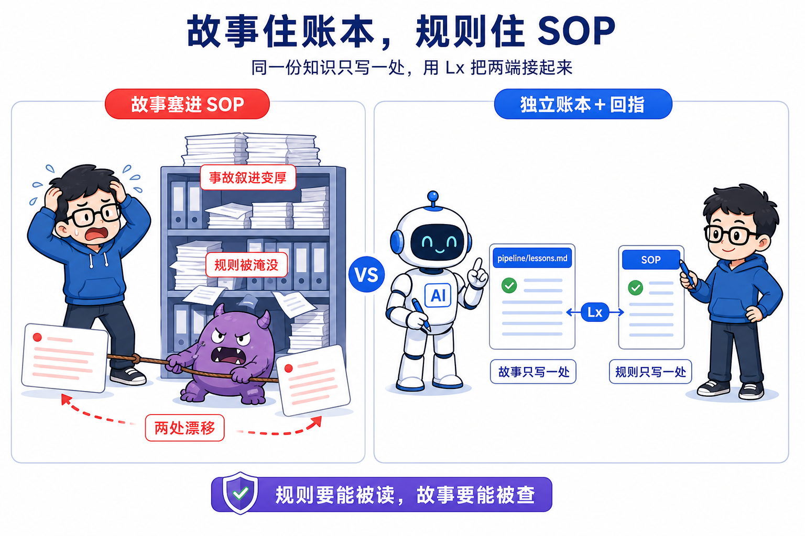
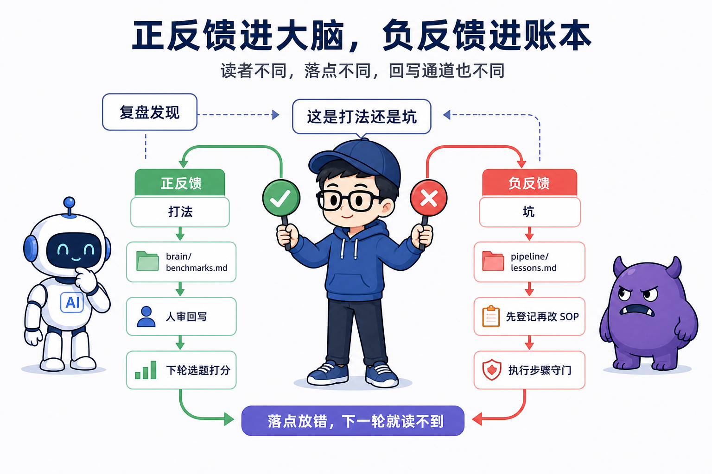

# 第 15 课 系统怎么长记性，教训驱动进化

> 代码仓库：<https://git.aicodex.cc/devlist/douyin-media>
> 对应分支：`15-lessons-memory`

本课立一个判断。**坑先登记成故事，规则回写进它该在的位置。教训的落点决定它会不会被读、会不会驱动下一轮。** 这套系统跑了两三个月，十八次踩坑登记在 `pipeline/lessons.md` 里，编号从 L1 到 L18。你在前面每一课撞过的坑，都对应一条 L 开头的编号。第 3 课的音画不符是 L2，第 4 课的漏字幕是 L15，第 7 课的发布重试是 L7 和 L8。第 0 课开篇就预告过，这十八条会作为先撞墙、再讲规则的素材分配进后面每一课。现在你站在模块五，墙撞得差不多了，本课把整张账本摊开，拆开登记和回写两件事，再把机制搬进你自己的仓。

本课的任务是建立你自己的 lessons.md 机制。把你跟做过程中真实踩过的坑登记进去，没真踩过的，从课程仓 pipeline/lessons.md 里挑三条最可能踩的，改写成预防性规则登进自己的账本。每条坑提炼成一句话规则，回写到对应 SOP 并标上 Lx。做完后，你的仓里躺着第一张自己的教训账本，编号是你自己摔出来的，编号指回你自己 SOP 里的规则。

## 一、教训账本长什么样

**lessons.md 是一张三列的表，坑的故事记在中间，规则回指写在右边。** 文件住在 `pipeline/lessons.md`，标题叫踩坑教训登记簿，后缀标注单一位置。打开先读头部约定段，四句话。第一句，教训的故事只写这里，对应的规则住它该在的 SOP 或 skill，标 Lx 回指本表。第二句，新坑踩了先登记再改 SOP。第三句，复盘沉淀的打法不在这，去 brain/benchmarks.md。第四句，这里只收坑。

约定段里藏着两个决定。故事只写这里，把坑从 SOP 里请出去。规则住它该在的位置，落点列不复制规则，只给出规则的住址。一个决定管故事住哪，一个决定管规则住哪，两个合起来才是机制。这四句各管一件事，故事住哪、新坑时序、打法边界、内容范围，内容不重叠。

表头三列。编号列 L 开头，L1 到 L18 顺序排。坑列写明事故本身加出处，括号里是第几集第几步。现行规则落点列写规则回写到了哪个 SOP 的哪一步或哪个终检闸。这一列是引用，不是副本，规则正文不在表里，在它指向的地方。

看一条真的。L2 这一行，坑的原文讲 EP02 改了 narration 没重抽分段文案，画面新钩子、声音旧钩子，连过两轮组件截图检查都没抓到。落点写 2-create.md 步骤 3 真相源铁律加终检闸 A，规则是改 narration 必重抽、删旧 mp3、重合成，检查在最终 mp4 上做。你第 3 课撞的就是这一条。

从读的角度再看一遍这条机制。你读 2-create.md 终检闸 A，会看到改过 narration 必须重抽重合成这句，行尾标 L2。想追这条规矩从哪来，回账本找 L2，看到出处是 EP02 那场事故。规则在 SOP，故事在账本，两边用一个编号接上。只读账本不读 SOP，你看到的是事故列表，看不到规矩长什么样。只读 SOP 不读账本，你知道规矩，看不到它从哪来。两头都要读，才既知道规矩又知道出处。

这套格式就是 lessons.md 对外暴露的接口。登记一条坑，占一个新编号，写清出处，把规则指向它的落点，三步。引用一条坑，读落点那一列，找到 SOP 里带 Lx 的规则。

## 二、故事为什么单住一处

**坑的故事直接写进 SOP，还是独立登记再加回指，两个方案各有代价，现行的是后者。**

方案 A，故事直接塞进 SOP。坑在哪个步骤踩的，就在哪个步骤下面写一段事故经过。好处是就近，读到规则就看见它从哪来，不用跳文件。代价很快露出来。SOP 会被故事越撑越厚，十八条事故塞进 2-create.md，步骤和事故混在一起，AI 顺序读文档时被故事带偏，规则淹没在叙述里。一个坑横跨两个 SOP 时更糟，比如 L16 既管去停顿又管验收，两处各写一遍，改规则时改了一处忘了另一处，下一次执行读到旧版。两处漂移由此开始。SOP 慢慢变成事故陈列馆，规则陈列在事故堆里，反而没人读了。

方案 B，独立登记簿加回指。故事统一进 lessons.md，SOP 里只留规则，规则行尾标 Lx 指回账本。好处两条。执行文件干净，规则是规则，故事是故事，AI 读到的是步骤加约束，不被叙述干扰。坑只写一处，改故事永远只动一个文件，不存在两处漂移。代价也多两条。多一个文件要维护，登记和回写是两步。读 SOP 的人想看事故全貌，得多跳一次到账本。

现行选 B。理由第一条，规则要能被读，故事要能被查。执行步骤里只放规则，行文干净，AI 顺序读文档不会被故事带偏，这也是第 7 课讲铁律前置时同一个原理，约束要出现在执行者读到步骤之前。理由第二条，同一规则只写一处，这是 CLAUDE.md 文档架构约定的头一条，故事搬出去正是为了守住这一条。



两个方案都不免费，B 也有它认下的代价。登记和回写两步都靠自觉，没有工具逼你。落点列写空话，账本就退化成装饰。这一点靠第六节的技术栈选型和第八节的验收动作兜底，不在设计里假装能免费拿到。

回扣本课判断。教训的落点分两处，故事落点在账本，规则落点在 SOP。落点放错，要么 SOP 变事故陈列馆，要么教训变没人读的博物馆。

## 三、打法进大脑，坑进账本

**复盘产出的东西分两种，正反馈进 brain/benchmarks.md，负反馈进 lessons.md。** lessons.md 头部约定段第三句已经把这分流写死，打法不在这，去 brain/benchmarks.md，这里只收坑。

为什么要分流。正反馈和负反馈的读者不同。打法是说哪条标题风格有效、哪个对标账号还能抄、哪类选题观众买账，这些给下轮选题打分用，住在 brain/benchmarks.md，它是账号大脑的一部分，第 5 课立过 brain 五件套，对标和打法都住那里，douyin-ideate 打分时读它。坑是说哪个步骤会静默失败、哪个字段会被机器误读，这些给执行步骤守门用，住在 lessons.md，SOP 引用它。读者不同，落点就要不同。

分流的通道也不同。打法走治理线的回写通道。复盘只产报告和变更提议，人审通过后才回写 brain/benchmarks.md，这是 CLAUDE.md 流程纪律里的铁律，模块四的大环把发布数据变回大脑提议，走的就是这条。坑走直接登记通道，踩了先登记再改 SOP，不需要等人审。两类回写的审批等级不同，打法会改变下一轮的打分依据，属于策略变更，要人审；坑是事实记录，踩了就是踩了，先记下来不伤害任何策略。

落点错位的代价。打法写进 lessons.md，下轮选题打分读不到，正反馈断链，有效的打法白积累。坑写进 brain，执行步骤读不到，负反馈守不了门，同一个坑下轮接着踩。两本账的读者不同，混了等于两边都读不到。正反馈给打分用，负反馈给执行用，账本各司其职，分流本身就是记性的边界。



## 四、L1 到 L18，每条坑变成的铁律

**十八条坑按环节排开，每条都对应一条前面课程已经立过的铁律。** 落点集中在四群。配音链和创作最密，L2、L3、L9、L10、L16、L17、L18 七条全在 2-create.md 步骤 3 附近，那里是真相源、多音字、死气三条纪律的汇聚点。封面和终检四条，L1、L4、L5、L15。发布两条，L7、L8。口播稿两条，L11、L12。工程和编排两条，L13、L14。

全表如下，第三列是每条坑变成的铁律落在前面哪一课。

| # | 坑（一句话） | 铁律（现行规则落点） | 前面课程里的落点 |
|---|---|---|---|
| L1 | 封面让模型自由发挥编出仓鼠，拿横屏帧充数也被打回 | 封面必竖版 9 比 16，系列用上一集做锚锁吉祥物 | 第 4 课封面一节 |
| L2 | 改了 narration 没重抽，画面新钩子声音旧钩子，两轮截图检查没抓到 | 改 narration 必重抽删旧重合成，检查在最终 mp4 上做 | 第 3 课音画不符事故 |
| L3 | 十八字撑 6.78 秒含一秒死气，引号触发 | silencedetect 超 0.45 秒即去停顿 | 第 3 课死气一节 |
| L4 | 钩子、封面、音画、死气各炸一轮，反复重渲染 | 所有检查一次性前置过完再交审 | 第 4 课终检闸一节 |
| L5 | 出审没产 4-publish.md，确认发布卡缺标题无法发布 | 出审前必产 4-publish.md | 模块二契约，第 7 课第 8 课读它取物料时接住 |
| L6 | 发布时段写成非 datetime 文本，被原样传给调度参数 | 不写可解析的发布时段，默认立即发，定时由人在确认卡指定 | 模块二契约，第 8 课确认卡显示发布时间 |
| L7 | 首发慢渲染超时，重试同命令一次即过 | 发布失败先原样重试一次再排查 | 第 7 课真实世界会抖 |
| L8 | UI 浮层挡封面按钮，退出码 1，清浮层重跑一次过 | 退出码 1 先看截图是否浮层类环境问题 | 第 1 课 CLI 取舍、第 7 课真实世界会抖 |
| L9 | MiniMax 余额耗尽返 1008，卡死配音到出审链路 | 先单段探测，余额尽停在挂起状态并推人充值 | 第 3 课探余额一节、模块三阻塞即上报课 |
| L10 | 多音字各十几行的行漏注音，质检打回重合成 | 多音字注音进 tts.config.json 的 overrides | 第 3 课多音字一节 |
| L11 | 开头承接上一集，首刷观众没上下文划走 | 第一句自成立，系列承接放结尾钩 | 第 2 课冷开铁律 |
| L12 | 口语梗词被过度规避导致重录，平台实际不禁 | 只避硬违禁，口语词不规避不重录 | 第 8 课人审清单的违禁词边界 |
| L13 | 每集 build 重装依赖，浪费且版本漂移 | 克隆上一集 build 复用 node_modules，别重装 | 模块一 build 步骤 |
| L14 | 取题空跑六天，只写本地日志没人看见 | 停产挂起必推飞书，只写日志不算上报 | 模块三阻塞即上报课 |
| L15 | 首录漏字幕，录屏默认不带字幕参数，服务模式覆盖网址 | 录屏前确认字幕参数，录后抽帧查字幕已烧入 | 第 4 课录后体检 |
| L16 | 去停顿原地写，工具打开输出即截断输入，十七段静默失败 | 输出写临时文件再挪回，跑完复扫验数为 0 | 第 3 课死气一节、别拿退出码当验收 |
| L17 | 同段同字两读，逐段注音无解 | 改文案解冲突，同步三处真相源 | 第 3 课多音字一节 |
| L18 | 删段后注音键没重排，注音注到错的段上 | 增删段后必重排键名并重跑抽取 | 第 3 课多音字一节 |

你数一遍自己在前面课程里撞过几条。第 3 课你亲手绕开七条，第 4 课三条，第 7 课两条，第 2 课一条，第 1 课借 L8 讲过 CLI 的取舍。剩下 L5、L6、L12、L13 四条没有独立的事故课，规则住在 2-create.md 终检闸和 3-review.md 人审清单里，你走到对应环节时由契约接住。L14 在模块三的阻塞即上报课里完整复盘，那是无人系统可观测性的题眼。

这张表本身就是导读。它把十八次事故压缩成十八行，每一行是一个故事的索引，指向一条你学过的铁律。读表能复述铁律，追出处翻账本，这就是登记簿的价值，它是索引，不是仓库。

## 五、一条坑走完的路径

**从踩坑到被下一轮引用，完整路径五步，每一步的落点都定死。** 第一步踩坑，运行中某个环节翻车，产生一个能复述的事故。第二步登记故事，事故写成一段话记进 lessons.md，占一个新编号，出处写清哪一集哪一步。第三步提炼规则，从故事里抽出下次怎么做才对，一句话，能放进 SOP 的某一步。第四步回写 SOP 标 Lx，规则写进对应 SOP 的步骤或终检闸，行尾标编号回指账本，这一步改的是 SOP 这一处账。第五步被引用，执行者跑那一步读到规则，契约引用编号，坑不再踩第二遍。


故事只登记一次，规则回到它守卫的那一步旁边，下一次执行自然读到。

拿 L16 走一遍完整路径，它是这套机制最贵的一次验证。踩坑发生在 kimi-k3 批量去停顿，命令把输出写回输入同一个文件，ffmpeg 打开输出瞬间截断输入，十七段一段没处理，命令一声没吭，退出码全是 0，死气全留着。登记进 lessons.md，坑一栏写清原地写和静默失败，出处写 EP 批次。提炼成规则一句话，去停顿必须写临时文件再挪回，跑完必复扫验数为 0，别信退出码信复扫。回写进 2-create.md 步骤 3 死气检查，标 L16。第 3 课把同一条规则再提炼成课程级铁律，验产物不验退出码，第 3 课第 11、12 步的派工契约把它写成可粘贴的 spec。这条坑从踩到被引用，全程没离开文件系统，每一步都在一个可 diff 的文件里留痕。

再走一条短的，看这条路径最短能有多短。L15 漏字幕，踩坑在录屏默认不带字幕参数，登记后规则变成录屏前确认字幕参数、录后抽帧查字幕已烧入，回写进 2-create.md 步骤 5 和终检闸 A。第 4 课录后体检那一节，你亲手执行过这条规则。一条坑从登记到被引用，最短路径就是第 4 课那一节。

口述验收。不看任何代码，把五步背出来，再说出每步改了哪处账。登记改 lessons.md，回写改 SOP，提炼和引用都不落盘。这条路径是文档系统里最便宜的记忆，它不建索引文件，不写后台任务，只靠一个编号把两个文件接起来。

## 六、为什么是纯文档加引用

**lessons.md 用纯 markdown 加引用，不上数据库，不上标签系统，理由就一条，账本要和它守卫的 SOP 同层。** 账本的读者有两个，人翻 git 能读，AI 顺序读文件能读，两者都不用装任何客户端。纯文本在 git 里可 diff 可回滚，登记一条坑就是一行提交，和改 SOP 共用同一套版本历史。数据库多一层查询接口，标签系统多一层解析器，每加一层，两个读者就各多一个入口要配。

关联用引用不用关系。坑和规则的关联是一对一，一条坑一条规则。数据库的外键、标签系统的双链，都是解决多对多的，这里用不着。一个编号 Lx 就是纯文本里最便宜的外键，SOP 里写 Lx，账本里找编号，两边对上。第 5 课讲文件代数据库时立过同一个判断，本课是它在教训层的又一次落地。

代价说清楚，不能只讲便宜。纯文本没有约束校验，数据库能保证落点列必填，markdown 拦不住你把规则落点写成以后注意四个字。上数据库要定义表结构、写插入查询、给两个读者各做一层读写界面，而这里的数据量是一张十八条的表，用数据库是给一颗钉子配一台机床。也没有自动重排，中间插编号会挤位。对策是编号插入不重排。新坑永远追加在表尾取下一个号，Lx 是标识，不是序号，SOP 引用的是标识，插入新坑不影响已有引用。这和数据库用 UUID 不用自增 id 是同一个道理，只是这里用纯文本实现。最后一条对策把验收动作本身写进流程，逐条核对编号能解析回账本，靠人审兜住没约束那半条。

本课回到课程心法线的第一条。关键结论落文档，不留在对话里，对话会结束，文档才是人和 AI 的共享记忆。lessons.md 是这条心法最直接的一处落地，踩坑的结论不留在当天的会话里，写进账本，下一个会话才读得到。

## 七、文档架构防漂移约定全景

**lessons.md 是防漂移约定的一角，整套约定有四根柱子，全写在 CLAUDE.md 的文档架构约定一节。** 第一根，真相源唯一。状态的真相源是各 meta.yaml 加 backlog.yaml，dashboard.md 是派生视图，只能看不能改。第 5 课立过这个结构，第 6 课用记账唯一入口收口，状态只经命令翻转，其它环节不代翻。第二根，派生视图标注。dashboard.md 在文件里标自己是派生视图，非真相源。教训账本同样做，它在头部标自己是坑故事的单一位置，两类文档都用一句标注定死自己的身份。第三根，同一规则只写一处，其余引用。lessons.md 的落点列指向 SOP 的某一步，SOP 里标编号回指账本，两边都不复制全文。第 9 课把这条扩到整个 pipeline，阶段契约定输入输出状态翻转闸口，操作细节住 skill。最后一根，历史存档只读。docs/ 是只读历史存档，现行规则不得只住那里，设计迭代文档住 Iterative-spec 子文件夹，md 不裸放。

四根柱子连起来看，防漂移的机制是给每一类文档定死它的身份。它是什么源，规则写几处，能改不能改，都在文档架构约定里一次性说清。lessons.md 在这个全景里的身份是坑故事的真源，单一位置，规则落点是引用。它和 dashboard.md 的声明是同一类动作，一个标我是派生视图别改，一个标我是故事唯一位置别到处写，两句标注都是文档对自己身份的自我约束。


回扣本课判断。教训的落点就是它在文档架构里的身份。故事落点在账本，规则落点在 SOP，身份定死，位置就不会漂。防漂移防的不是写错，是同一份知识在多个位置各长各的，最后谁也不信谁。

## 八、建你自己的教训账本

**把机制搬进你自己的仓，再把跟做时真踩的坑登记进去，第一步是建文件。** 在你流水线的 pipeline/ 下建 lessons.md，头部写约定段，下面建空表。约定段四句照抄本课第一节那四句。表头三列，编号、坑（出处）、现行规则落点。

然后登记你真实的坑。跟做这几课你一定会踩，只是没登记。来源有两种。一种是你确实踩过的，比如改了口播稿没重抽导致音画不符、多音字读错、死气没清干净、录完才发现没字幕、封面被 AI 自由发挥、build 反复重装、发布失败没先原样重试、半夜回看日志发现停了几天没人看见，这八类里挑三条真发生的。一种是全程 AI 代劳、自己没真踩过的，从课程仓 `pipeline/lessons.md` 的 L1 到 L18 里挑三条你最可能踩的，改写成预防性规则登进自己的账本。这样写不算编造。坑从课程仓真实登记过的账本里选，你登的是预防性规则，不是虚构事故。

派工契约分两段。第一段建账本，第二段回写。

```text
第一段，在我仓库的 pipeline/ 下建一本踩坑教训登记簿，文件名 lessons.md。
开头写约定段四句。故事只写这一处。新坑先登记再改 SOP。复盘沉淀的打法不在这，去 brain/benchmarks.md。这里只收坑。
表头三列，编号、坑（出处）、现行规则落点。编号空着，等我给你三条坑。
我报真踩过的，或者从课程仓 pipeline/lessons.md 的 L1 到 L18 里挑三条改成预防性规则。你逐条登记。坑这一列写事故本身，括号里标出处，从课程仓选的标 Lx。现行规则落点先写规则要回写的 SOP 文件和步骤，规则正文不写进表。
约束。编号从 L1 起连续。不写打法类条目。落点不许写以后注意这类空话，必须指到真实文件路径加步骤。输出，一张三条的表。
```

```text
第二段，把三条规则回写进对应 SOP。
打开落点指向的文件和步骤，在相关步骤加一句规则，行尾标 Lx 回指账本。
约束。SOP 里只加规则，不复制故事，故事只在 lessons.md 里。一条规则对应一个编号，编号在账本里能查到。
输出。SOP 的改动清单，每处新增标它带的编号，以及这条规则在账本里的行号。
```

这段契约你验收时盯五处。约定段四句在不在。编号从 L1 连续。每条坑的出处写清来源，真踩过的写跟做哪一步，从课程仓选的标 Lx 编号。落点指到的 SOP 路径真实存在，打开能看到那条规则。SOP 的改动清单里每条新增都带编号，且编号能回到账本那一行。

验收可以落成一条命令，核编号能不能解析回账本。

```bash
grep -n "L[0-9]" pipeline/lessons.md        # 列出所有编号与坑行
grep -n "(L[0-9])" <落点SOP>                 # 看 SOP 里每个 Lx 回指
# 验收：两条 grep 的结果数一致，账本每个编号在 SOP 里都有回指
```

AI 会怎么错，验收时对应盯。最常见的，它把整条坑的故事原样复制进 SOP，落点列和 SOP 各一份，两处漂移，违反同一规则只写一处。约定段可能被整个跳过，账本失去单一位置的自我声明。打法条目容易混进来，比如这条标题风格效果好，正反馈串进负反馈账。落点列最常写成以后注意，回写无从下手。空架子也常见，只建表不填坑，验收时你只看到一张空表。编号还可能被补零，L1 写成 L01，SOP 引用时对不上。这六种翻车各盯一眼，返工一次就能收干净。

验收过关后，把这张表放进 git。往后的坑，先登记再改 SOP，规则回到它守卫的那一步。你从这一步开始，系统第一次有了自己的记性。

几个判断带走。坑先登记成故事，规则回写进它该在的位置，教训的落点决定它会不会被读、会不会驱动下一轮。故事只在 lessons.md，规则只在 SOP，同一规则只写一处。打法进 brain，坑进 lessons，正负反馈的读者不同。纯文本加编号引用够用，一对一关联不需要数据库。

下一课开始补绕了一整门课的那块看板。系统搭到模块四，meta、backlog、index.jsonl、brain 全齐了，可你每天还翻着 dashboard.md 那份 markdown 看状态。第 16 课先补一块底座，讲清无头 AI 这台机器怎么被进程管理、消息怎么解析、对外暴露什么接口，面板依赖的全部接口都在那里。第 17 课再用 SDD 把派生视图从文件升成屏，造出你自己的 Pipeline Console。再下一课结课，把七根梁收成 Loop 七要素总纲，带你把这张图迁移到自己的领域。到那里，这门课收口。
