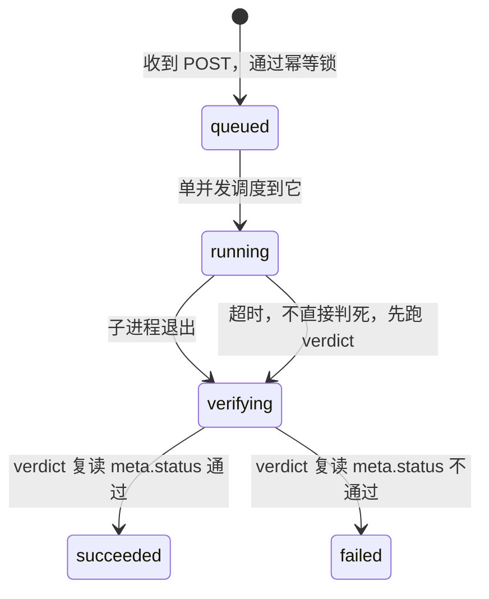
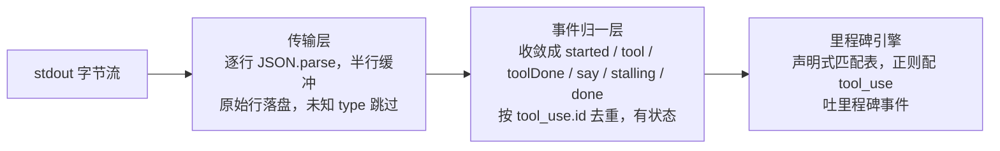
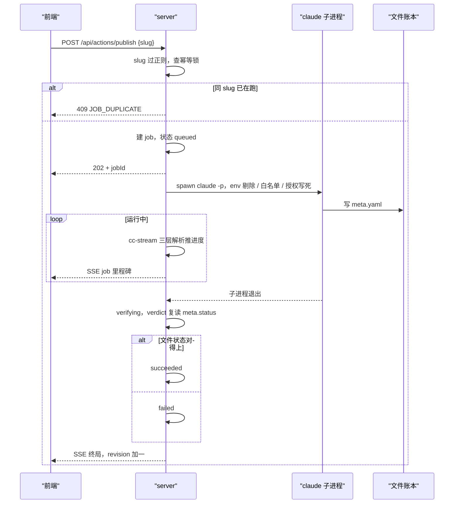
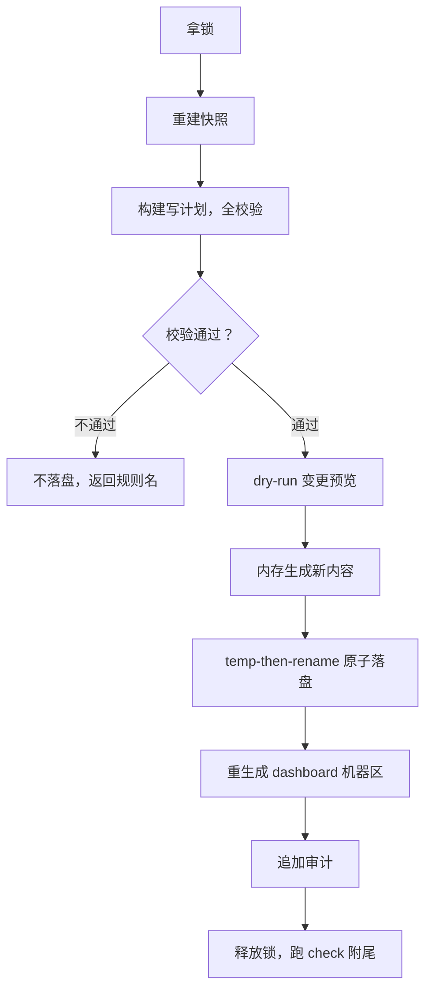

# 第 16 课 后端架构，把无头 AI 当成一台进程管理

第 8 课把无头 claude 当黑盒用，主链一路跑到今天，本课拆开黑盒。先立判断。**无头 AI 是一台进程，不是一张嘴。你给它最小权限、你判它成败看它改的文件、它死了你也不用慌，因为状态在文件里，重建就恢复。**

学完这一课，你手里多一个能跑的最小后端闭环。一个读接口、一条快写、一个慢作业、一个 job runner，四件套由 AI 按你写的 spec 造出来，你验收它交回的契约判据，不看一行实现。本课是主链必经，结课时把整门课收成总纲，这台进程管理就是七根梁之一。

## 一、一直被绕开的完整后端

**第 8 课把无头 claude 当黑盒用，主链够用，任务一多黑盒就露出三个缝，本课把这三个缝一个个拆开补上。**

回看第 8 课。人在飞书点了确认发布，server 拉起一个无头进程，跑发布 skill，改完 meta.status 收工。你从头到尾只看两样，进去的 prompt 和出来的状态，中间整段是黑的。这条路径到今天还在一集一集地发，说明黑盒在主链够用。够用的原因很简单，任务少，一天一两条，你不需要知道中间细节。

任务一多，三个缝就露出来。第一个缝，进程起了没。长任务拉起之后，它是不是真的在跑，你没有任何反馈，起了没起都不知道。第二个缝，它在干什么。发布 skill 要跑几分钟，走到哪一步了，是校验、是上传、还是卡住了，你看不见。第三个缝，它是不是死了。进程崩了没有心跳，没有墓碑，它死了你也察觉不到。

三个缝的答案指向同一件事，把它当成一台进程管理。进程是什么就按什么管，它的生死、它的进度，都变成可观测、可控制的对象，它吐出的每一行输出都有处可查。本课先立这台进程的三个推论，再把推论落成四个能力，拉起一个安全的进程、别让两个同时跑、读懂它在说什么、把进程的操作接成接口。

这一课从头到尾没离开第 5 课立的那句话。真相源在文件里。进程可以随便死，账本不能丢，这一句就是后面所有设计的根。

## 二、无头 AI 是一台进程，不是一张嘴

**无头 AI 是一台进程，不是一张嘴，三个推论是它的完整定义，最小权限、判成败看文件、容忍它死。**

第 8 课的黑盒形象帮你过了主链，但它藏起了一件事。你面对的是一台能启动、能观察、会退出的进程，它有标准输入输出，有退出码，会崩溃。把黑盒换成进程，视角一换，管理它的方式就全出来了。

推论一，最小权限。你拉起它的时候，只给它干活要用的工具，这就是 `--allowedTools` 白名单的来历。它说出来的话只是它的叙述，当不了真。它说我要删文件，不等于它有能力删文件。权限在你拉起时给的白名单里，不在它说的话里。这一条把第 7 课的铁律从发布推到全部无头任务，不可逆动作的授权必须发生在你这边，不在进程那一边。

推论二，判成败看它改的文件，不看它说的话。它可能口齿伶俐说自己成功了，其实文件里状态没动。它也可能报错退出，但关键的账已经翻到位了。第 8 课立过 meta.status 是唯一裁判，本课把它推到进程视角。进程的输出是叙述，它改的文件的最终状态才是裁决。这句话就是后面三层信任分级的根。

推论三，容忍它死。进程会崩，这是事实，不用防，要接住。它死了你不用慌，因为状态在文件里。文件是进程之外的另一个世界，进程死了文件还在，重启一个进程读文件，状态就回来了。这一条是整个系统敢自动化、敢无人值守的底气，也是文件系统当真相源的系统级红利。

三个推论收成一句。为什么敢给最小权限、敢只看文件判成败、敢容忍它死，因为真相从不在进程里，在文件里。这句话把第 5 课的概念从纸面落到了工程。

## 三、拉起一个安全的无头 claude

**spawn 一个无头 claude，四个防坑点，每个都是从真实运行里长出来的，少一个都是事故。**

做后台的人都要会一件事，用代码把 claude 拉起来。技术栈是 Node 的 child_process。拉起有两种写法，差在一行，后果差很远。

方案 A，拼一条 shell 字符串。把 prompt、路径、参数全拼进一个字符串，丢给 shell 执行。代价是注入面，prompt 里一个引号一个分号就能把命令改掉，发布命令里还带着路径和物料，拼错一次就是一次事故。方案 B，用 execFile 或 spawn 直接传参数数组，不经 shell。prompt 是数组里的一项，特殊字符只是数据，不会变成命令。选 B，这一条对应项目里的一句纪律，一切 media 调用和 claude 调用都走参数数组，不经 shell。

拉起一个无头 claude 的调用长这样，四个参数各对应一个防坑点。

```js
spawn("claude", ["-p", prompt, "--output-format", "stream-json"], {
  env: cleanEnv(process.env),       // 防坑一，剔除 ANTHROPIC_API_KEY
  allowedTools: ["Bash", "Read"],   // 防坑二，白名单只给任务要的工具
  // 防坑三写不进参数，写进 prompt
  // 防坑四发生在进程退出之后，读状态不读文字
});
```

防坑一，env 剔除 `ANTHROPIC_API_KEY`。本机 Claude Code 登录用的是 OAuth 凭证，存在 `~/.claude`。如果子进程环境里混进一个 `ANTHROPIC_API_KEY`，无头 claude 会把它当成 API key 去调 Anthropic 接口，API key 和本机 OAuth 凭证对不上，回一句 Invalid API key，任务直接死。所以拉起之前把这个变量从环境里剔掉，无头 claude 才能回落到 `~/.claude` 的登录凭证。这一坑在飞书 server 实测里踩过，2026 年 8 月 18 日写进技术方案时记为第一条。

防坑二，`--allowedTools` 白名单。不给白名单，无头 claude 没有工具可用。给全了，比如把 Bash 全开，就等于让一个没人看管的进程裸奔。正确做法是只给这个任务要的工具，发布任务给 Bash、Read、Write、Edit、Skill，打回重做给同一套，应用提议按路径限权。白名单是权限的落地，对应推论一。

防坑三，授权语义写死进 prompt。发布不可逆，但无头进程里没有人能回答确认吗。所以授权在拉起来之前就确定好，写进 prompt，子进程只需要执行。这一条和第 7 课的 `--publish` 单一信号是同一条纪律，授权发生在你这边，进程那边永远不弹确认，弹了也没人回答，流程会卡死在没人看的界面上。

防坑四，成败判定读状态不读文字。进程退出后，先看 `result` 事件的 `is_error`，这还不够，还要复读文件的 meta.status，两个对上了才算成功。绝不解析无头 claude 输出的自然语言来判成败，它说的不算，文件说的才算。这是推论二在代码里的落地。

## 四、别让两个发布同时跑

**同一 slug 同时只许一个任务，用幂等锁兜住；单并发就够，不引队列中间件；进程死了任务表丢了不用怕，真相在文件里。**

假设没有这一层防护。你在详情页点了两次发布按钮，或者飞书回调重投了一次，两个发布任务同时被拉起，同时跑同一条内容，双发。发布不可逆，双发就是两条内容发出去，这是事故。

怎么防，三个方案摆出来。方案 A，不加锁，靠人别点两次。双击是人类本能，这条靠不住。方案 B，内存里记一个正在跑的集合，跑之前查一下。飞书 server 的 `_publishing` set 就是这么做，但它在飞书进程里，只有飞书那一路防得住，而且进程一重启集合就没了。方案 C，幂等锁放后端，同一 slug 同时只许一个任务，第二个直接拿 409 `JOB_DUPLICATE`。选 C，它把双击、回调重投、多个入口全兜住，是整个系统发布幂等锁的唯一实现。

为什么要单并发，为什么不上队列中间件。你的流水线本来就是串行的，一次只有一个任务在跑。本地单人工具背不动 RabbitMQ、BullMQ 这类队列中间件，一个内存任务表加一个子进程句柄就够。代价是任务表在内存里，进程死了就没了，这个代价后面那一条把它补回来。

崩溃安全靠文件真相。server 挂了，内存任务表消失，正在跑的子进程也会跟着退出。重启之后你怎么知道哪些任务真干成了。答案是不猜，读文件。重启后重建快照，跑一遍 `media check`，文件给出真实状态，任务表按文件真相重建。谁都能崩，状态可重建，事件可丢，状态不可丢。

job 状态机走五步，queued 到 running 到 verifying 到 succeeded 或 failed。



中间为什么多一站 verifying。子进程退出了，任务成没成还不知道，要先跑一次裁决。裁决读的是文件，不是子进程的自述。超时也不直接判死，先跑 verdict，文件状态说成功就是成功。课程仓的测试里有一条这样的用例，子进程自报成功，但 meta.status 没回到 published，verifying 之后判 failed。这一站把推论二焊死在状态机里。

## 五、读懂无头 AI 在说什么

**无头 claude 的输出是机器可读的事件流，分三层解析，每一层只干一件事；信任分级决定哪一层能驱动什么。**

这一节是本课的硬骨头，先从两个你没见过的概念铺起。

第一个概念，job 快照。上一节刚立过，一个任务的当前状态，id、slug、状态机走到哪一步、里程碑到哪、花了多少钱，就是一条 job 快照。任务面板画的就是它，SSE 推的就是它。

第二个概念，claude 无头输出。你在终端里看 `claude -p`，看到的是给人读的文本。加一个参数 `--output-format stream-json`，输出变成一行一个 JSON 的事件流，每行是一个事件。2026 年 8 月 18 日实测过一次，事件谱系是这些，会话启动、钩子噪音、assistant 消息、tool_use 记录、tool_result 返回、终局 result。为什么输出要做成事件流，不要一段文字，因为要进度。人读文字可以等全部出来，机器要实时知道它到哪一步了，事件流就是机器能逐条消费的进度。

再立信任分级。这三类事件信得过多少，不一样。模型叙述，就是它说的话，只展示，永不驱动状态。工具事件，它真实调用了哪个工具、带什么参数，驱动步骤时间线。文件状态，meta.status 经过监听推上来的，唯一裁决。一句话，展示层信 text，步骤层信 tool_use，裁决层信文件。这三层信任分级对应主判断的推论二。

分层怎么解析。三层，每层各干一件事。

第一层，传输层。逐行读 stdout，JSON.parse 每行，半行缓冲，原始行原样落盘留审计，未知 type 静默跳过。它只做一件事，把字节流变成事件，不认识任何事件语义。

第二层，事件归一层。有状态的一层，把原始事件收敛成六种内部事件，started、tool、toolDone、say、stalling、done。它解决一个脏问题，assistant 消息随内容块增长会重复出现，同一事件出现两遍，按 tool_use.id 去重。去重需要跨事件状态，所以这层必须有状态，传输层不认识 assistant 结构，做不了这个。

第三层，里程碑引擎。吃一份声明式匹配表，正则配上 tool_use，匹配到就吐一个里程碑事件。匹配表是谁给的，调用方注入的，发布有哪几步、哪一步算里程碑，是领域知识，不在包里。

三层收口，传输层把字节变事件，归一层把事件变语义，里程碑把语义变进度。

三层解析的管线收在一张图上。



图点破一句。三层是三道收口，字节、事件、语义各归各的层；状态只住在归一层，传输层和里程碑引擎都无状态。

这一套解析独立成包，叫 cc-stream。它独立的关键是边界，包内没有一行代码认识发布、meta.yaml、media，它是通用的无头 CC 观察器。为什么这么切，引擎进包，知识留外。里程碑表的内容留在 server，终局裁决留在 server，成本展示的策略留在 server，包只做解析，不掺领域。这样切的好处，一是五包边界硬切，server 禁 import writer.ts，core 和 cc-stream 互不认识；二是好测，用真实输出当 fixture，每次 Claude Code 升版重新采集一份，协议漂移让测试先红。stream-json 是半文档化协议，这是这个包唯一的真实风险，真实 fixture 就是对它的对策。

## 六、把进程的操作接成接口

**后端对外只有一份接口清单，四个取舍定了它的形状，动作层白名单逐个映射、快写慢作业分通道、读响应统一信封、token 按威胁模型定档。**

先看命令清单，后端对外暴露什么。读接口，GET /api/contents 一类的快照读，出信封。动作接口，POST /api/actions/promote 一类的快写，POST /api/actions/publish 一类的慢作业。事件通道，SSE /api/events，推刷新信号和 job 进度。健康接口，GET /api/health，带 revision 和进程态。

第一个取舍，动作层白名单逐个映射。方案 A，自由转发，前端把命令名和参数传过来，server 照转给 media。代价是注入面，前端传什么 server 就执行什么，等于把 shell 开放给浏览器。方案 B，白名单映射，POST /api/actions/promote 只映射一条 media promote 命令，入参就 id 和 slug，参数走 execFile 数组，不经 shell，注入面为零。选 B。

第二个取舍，快写和慢作业分两条通道。快写四条，promote、review、backlog-apply、next-up，execFile 调 media，毫秒级，同步回。慢作业三条，publish、rework、apply-proposal，spawn 起 claude，分钟级，先回 202 加 jobId，进度走 SSE。为什么分，两个理由。一是 3 秒回调窗口，飞书卡片回调要在 3 秒内响应，同步等一个分钟级的任务，回调就超时了。二是语义，202 表示已接受、处理中，正好匹配慢作业。这一条把第 8 课的体验搬上接口，你在面板点发布，跟点飞书确认，走的是同一条慢作业通道。

第三个取舍，读响应统一信封。方案 A，每个接口自己想返回什么，前端每个接口单独适配，加一个字段就要改一处消费。方案 B，统一信封，revision 加 now 加 data，revision 是数据版本号，每次重建快照加一，前端拿它当缓存失效信号。选 B。信封的意义在前端那课兑现，这里先把形状立住。

第四个取舍，token 按威胁模型定档。威胁模型是什么，单机单用户，没有多用户，没有公网。最坏情况是恶意网页让浏览器发请求到 127.0.0.1，浏览器侧 CSRF。对策就两样，只 bind 127.0.0.1，UI 携带启动时生成的 token，防住 CSRF 就够了。不上认证系统，不做登录，不做权限。这一条是克制，单机单用户上认证系统是过度工程，判断依据是威胁模型，不是技术能力。

四个取舍过完，核心流程你该能口述。一次发布动作的完整路径，前端 POST /api/actions/publish，带 slug。server 校验参数，slug 过正则。查幂等锁，同 slug 在跑就 409 JOB_DUPLICATE。建 job，状态 queued，回 202 加 jobId。spawn claude -p，env 剔除、白名单、授权写死、输出走 cc-stream。三层解析推进度，里程碑广播 SSE。子进程退出，进 verifying，verdict 复读 meta.status。终态 succeeded 或 failed，SSE 广播终局。这条路径背下来，每一站谁在哪翻账，你心里就有数了。

一次发布的完整路径画成时序图，照着复核。



图点破一句。202 只代表已接受，不代表已成功；成败在最后 verifying 复读文件才落定，SSE 的 job 事件只是给面板看的进度，不是裁决。

## 七、最小后端闭环，一页 spec 起

**用 SDD 让 AI 从一页 spec 造出最小后端，四件套，验收跑契约判据不看代码。**

SDD 这一路走到第三次实战。第 6 课造 media CLI，第 12 课造 dispatcher，都是命令行工具。这一次不一样，造的是一个 server，有 HTTP 接口，有 SSE 通道。但套路一样，人写 spec，AI 写实现，契约用例验收。

最小到什么程度。四件套，一个读接口 GET /api/contents，出信封。一条快写 POST /api/actions/promote，execFile 调 media。一个慢作业 POST /api/actions/publish，spawn claude -p。一个 job runner 最小版，状态机加幂等锁加 SSE 广播。不做的明确说出来。认证系统、队列中间件、数据库、前端，这四样都不做。最小闭环的意思是，四件套能跑通一次完整循环，从读到写到一个慢作业跑到终态。

施工拆五步，每步可单独验收，AI 会怎么错写在每一步后面。

第一步，建包起 server。Node 加 TypeScript，一个健康接口先回 revision。AI 会怎么错，包名猜错、端口猜错、TypeScript 配置漏，验收时看健康接口能不能 curl 通。

第二步，读接口。buildSnapshot 读 content/ 下所有 meta.yaml，全量重建快照，套信封。它每次都是全量重建，不维护增量——全仓百余个小文件，重建一次不到 100 毫秒，这是不搞增量缓存的物理前提：省下的时间远小于增量的复杂度。AI 会怎么错，revision 随手生成一个随机数，正确做法是每次重建快照加一，revision 的唯一产地是 store rebuild。验收时连打两次，revision 必须递增。

第三步，快写。execFile 调 media promote，每个入参都过白名单校验，slug 过正则，backlogId 同理有专门校验——快写是注入的最后一层防线，入参校验和动作层白名单一个都不能少。AI 会怎么错，图省事用 exec 拼 shell 字符串，注入面又回来了。验收时传一个含引号的 slug，看它拒绝还是照转。

第四步，慢作业加 job runner。spawn claude -p，四防坑点逐条落，状态机跑起来。AI 会怎么错，env 没剔除 ANTHROPIC_API_KEY，或者幂等锁没写，双击直接双发。验收时同 slug 连发两次，第二发必须 409。

第五步，SSE 闭环。job 进度广播，文件一变推 refresh。AI 会怎么错，SSE 连上但事件名对不上，前端收不到。验收时改一个 meta.yaml，1 秒内收到 refresh，revision 加一。

施工五步串成一条链，每步都有验收闸。


图点破一句。五步每一步都有 curl 或改文件的验收闸，链断在哪步就修哪步，不必推倒重来。

可粘贴的任务契约放这里，粘贴给 AI 就能派工。

```text
在 tools/console 下新增一个最小后端，Node 加 TypeScript，端口 5170，只监听 127.0.0.1。

四件套，只做这四样。
一、读接口 GET /api/contents。读 content/ 下所有 meta.yaml，全量重建快照，返回信封 {revision, now, data}，data 里每条内容含 slug 和 status。revision 是整数，每次重建快照加一，不从别处取数。
二、快写 POST /api/actions/promote。入参 {id, slug}。调 media 的 promote 命令，用 execFile 参数数组，不经 shell。slug 过正则 ^[a-z0-9][a-z0-9-]{1,64}$。成功回 200，失败回 409 并透传 media 报的规则名。
三、慢作业 POST /api/actions/publish。入参 {slug}。先查同 slug 是否已有任务在跑，有就回 409 JOB_DUPLICATE。没有就建一个 job，状态 queued，回 202 加 jobId。然后 spawn claude -p 跑发布。spawn 必须做四件事。env 剔除 ANTHROPIC_API_KEY。--allowedTools 只给 Bash,Read,Write,Edit,Skill。授权语义写进 prompt，不让子进程请求确认。进程退出后先看 result.is_error，再复读 content/<slug>/meta.yaml 的 status，等于 published 或 scheduled 才算成功。
四、job runner 最小版。内存任务表，单并发，一个跑完才跑下一个。状态机 queued 到 running 到 verifying 到 succeeded 或 failed。支持取消，取消时先 SIGTERM、10 秒宽限后 SIGKILL。进度广播走 SSE /api/events，事件名 job:<id>。原始输出落盘 logs/jobs/<id>.jsonl。

约束。server 不直接写任何文件。所有写都通过调 media 命令完成，不 import 任何写文件的模块。新增依赖必须先登记理由。

验收。五条全过才算完。
一、GET /api/contents 返回信封，连续两次 revision 递增。
二、POST promote 一个 id，内容目录建出来，status 翻到 picked。
三、同一个 slug 连发两次 publish，第二次拿 409 JOB_DUPLICATE。
四、拿一条 status=approved 的内容发 publish，任务走完 state 是 succeeded 或 failed，且和复读 meta.status 的结论一致。
五、手动改一个 meta.yaml 的 status，1 秒内 SSE 收到 refresh，revision 加一。
```

四件套里最重的是慢作业，四防坑点全落在它身上。验收时盯第五条的 SSE 闭环，这条过了，读和写就收口成环了。

job runner 还该有一个能力，取消。发布点错了，得有办法把任务停下来。取消要做得优雅：先 SIGTERM，给子进程 10 秒宽限收拾现场，还不停就 SIGKILL 强杀，别让一台卡死的 claude 永久占着——第 8 课讲过无头 claude 的超时终止，这里落到 job runner 上。

## 八、写路径纪律，文件系统即总线

**server 永不直接写文件，写路径唯一入口是 media；文件系统即总线，谁都能崩，状态可重建。**

本课加油站讲一件贯穿全系统的事。你在第 6 课立的规矩，状态翻转要在 media 里做合法性校验，五处账一次改齐。到了后端，这条规矩被焊成一条包边界。全仓唯一 import writer.ts 的包是 cli，server 禁 import writer.ts。server 想改账，只能走两条路，快写用 execFile 调 media，慢作业用 spawn claude -p 让子进程去跑。为什么这么严，跟第 6 课同一条理由。server 直接写文件，会绕过合法性校验，一个非法迁移静默进账，会绕过审计，这一笔账是谁改的查不到。两道防线都收在 media 这一道闸上。

写命令本身有一条事务序，拿锁，重建快照，构建写计划全校验，dry-run 变更预览，内存生成新内容，temp-then-rename 原子落盘，重生成 dashboard 机器区，追加审计，释放锁，跑一遍 check 附尾。这里盯两个点。一是先校验后落盘，写计划阶段把全部校验过完，校验不过就不落盘。二是原子落盘，temp-then-rename，半截文件不会出现在真相源位置，任何人读到 meta.yaml，看到的都是完整的一版。

事务序画成一张图，两个闸口标出来。



图点破一句。两个闸口画在图里，校验在落盘前、不过就停；落盘走 temp-then-rename，真相源位置永远只有完整一版。

然后是本课这个名字的出处，文件系统即总线。写者和读者不直接通信，都经过文件系统。飞书侧写了文件，console server 的监听看到变化，重建快照，推 SSE，前端刷新。飞书进程和 console 进程零直接耦合，各自独立跑，谁都能崩。飞书崩了，文件还在，console 照常看板。console 崩了，文件还在，重启后快照重建。文件系统是它们之间唯一的接口，也是唯一的真相。

这一课从第 5 课的真相源出发，绕了一大圈，回到同一句。进程会死，机器会崩，文件不会，文件就是那台永远在的机器。

## 九、几个判断带走

**主判断一条，无头 AI 是一台进程，不是一张嘴。三个推论定义它，最小权限、判成败看文件、容忍它死。四个能力把它管起来，拉起一个安全的进程、别让两个同时跑、读懂它在说什么、把进程的操作接成接口。写路径纪律把真相源焊在文件里。** 几句支撑带走的。spawn 四防坑点少一个都是事故，env 剔除、白名单、授权写死、读状态不读文字。同一 slug 同时只许一个任务，幂等锁兜住双击和回调重投，单并发就够，不上队列中间件。信任分级三层，展示层信 text，步骤层信 tool_use，裁决层信文件。server 永不直接写文件，写路径唯一入口是 media，校验和审计都收在这一道闸上。

下一课把派生视图从文件升成屏。你这一课造的后端，读接口和两条写通道，就是下一课面板的全部接口。第 17 课升完屏，第 18 课结课收口。
