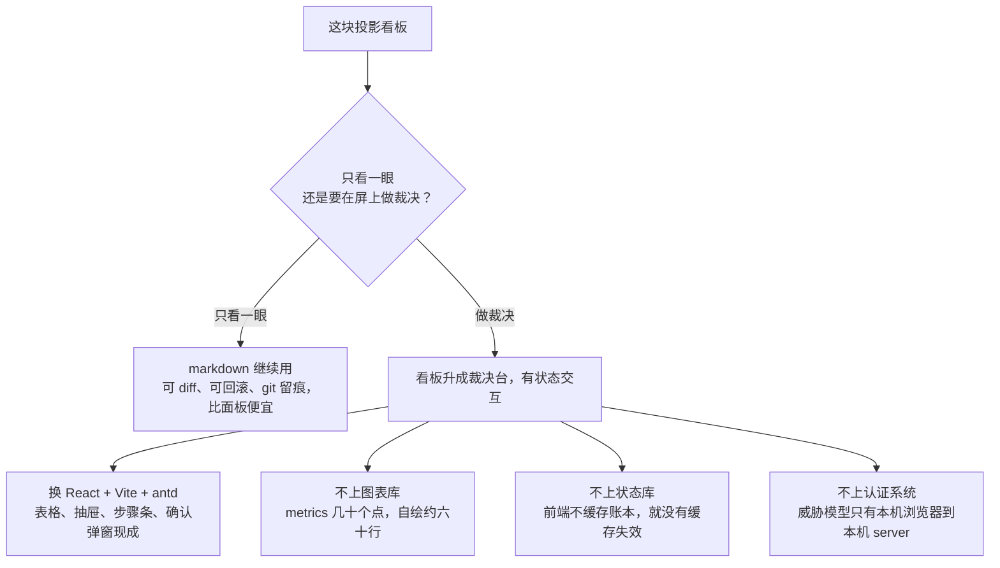
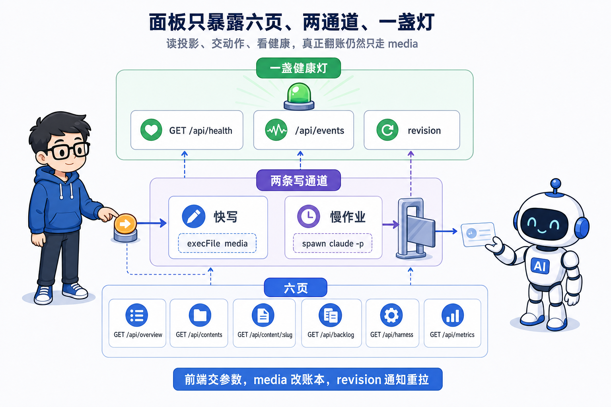
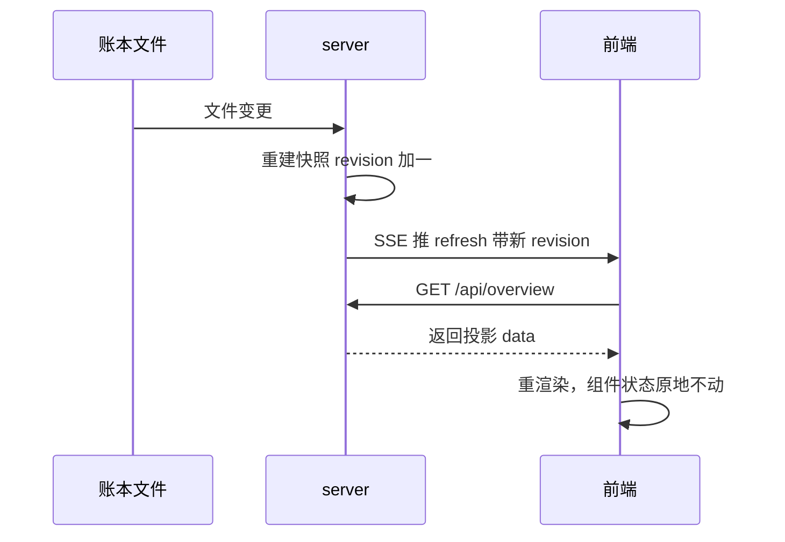
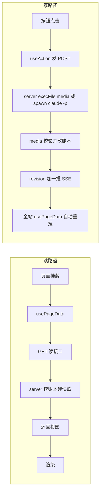
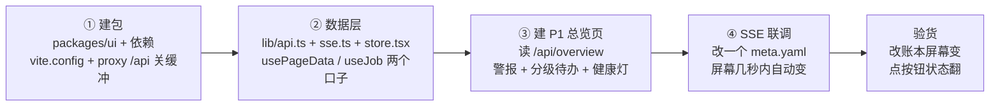

# 第 17 课 前端面板，把派生视图从文件升成屏

第 5 课立过一句话，`dashboard.md` 只是投影，真相源在文件里。此后十一课，你造了 `media` 记账命令，造了定时调度，造了治理线，投影层一直停在 markdown，靠每次跑完手动重生成。本课把它升成一块屏幕。先立判断。**面板不记状态。账本一改，server 推一个 `revision`，前端整站重拉重渲染。前端不缓存账本，就没有缓存失效。真相源永远在文件里，面板只是它的一档投影。**

学完这一课，你手里多一块能跑的看板面板。它把 `dashboard.md` 那五段变成六页屏，读同一份账本，账本一改屏幕自己跟着变，你还能在屏上点按钮走完一次状态翻转。整块面板由 AI 按你写的 spec 造出来，你验收它交回的页面清单和可 grep 的约定，不看它的实现代码。

本课是可选增强，跳过不影响结课主链。它的价值是把第 6 课造的命令变成看得见的界面。

## 一、什么时候值得升级

**markdown 看板继续用还是升 Web UI，判断标准只有一条，看板从只读变成要你在它上面做裁决。只读，markdown 够；要裁决，才值得升。**

先看现在这块投影。`dashboard.md` 头部写着派生视图，声明状态从各内容 `meta.yaml` 汇总、选题池从 `backlog.yaml` 汇总。正文分五段，在制、待人确认、已发布、选题池、数据汇总，每段有机器区和人写区，机器区标着 auto 开头，人写区标着机器不碰。头部还有几行最后同步时间戳，是你每次跑完手动更新的。第 5 课你亲手画过那张在制表，往后每翻一次状态就要重画一次，忘画就过期。

它够用的场景很清楚。一天只看一次，状态一两天翻一处，人只是确认账没记错。这种频率下 markdown 可 diff、可回滚、git 里留痕，比任何面板都便宜，这也是第 5 课选文件当账本的同一条逻辑。

不够用的场景从第 8 课开始变多。人审要进系统，你每天在飞书卡和文件之间来回；第 9 课之后，每天早上你想先看一遍昨晚跑到哪，markdown 看板要翻 git 才知道有没有更新；你要在屏上批过审、看倒计时、盯 job 进度。技术方案 F1 把这件事记成一句话，产品从只读看板升级成裁决台。

方案 A，继续用 markdown。代价是交互不进系统，状态翻转还靠 CLI，看板仍是快照，手工同步每次跑完要记得重生成，忘了就过期，过期就误导看它的人。

方案 B，升 Web UI。代价是要搭一条前端链，要选型，要维护构建产物。收益是看板自己跟账本走，账本一改屏幕就变，交互直接落在账本上，人审在屏上完成。

判断就落在裁决这个词上。看板的读者从偶尔看一眼变成每天在它上面做决定，升。这一升只是投影换了载体，第 5 课那条性质没变，面板仍然不记状态，状态仍在文件里。


## 二、选型跟着前提走

**技术栈选 React 加 Vite 加 antd，因为这块面板的交互组件多，表格、抽屉、步骤条、确认弹窗都有现成的，手写要几百行。** 前提变结论跟着变，早前只读看板用零构建方案就够，产品升级成裁决台后，审批、任务进度、倒计时全是有状态交互，才换 React。vanilla 为什么撑不住有状态交互：界面要在多份状态之间保存、恢复，vanilla 得自己补「存 UI 态、恢复 UI 态」的补丁，本质是手搓一个乞丐版 React——不如直接用现成的。Vite 对本地单人工具够轻，改完就刷新，AI 增量维护友好。antd 默认主题和原型设计系统冲突，Neutral Modern 的色板、圆角、字体、间距、语义色映射进 antd 主题配置，`theme.css` 保留给自绘组件，两边同一组 CSS 变量值。图表库不上，metrics 折线单序列几十个点，自绘约六十行，引库不成比例。状态库也不上，而且理由不是「轻」而是「没必要」：状态库解决的问题是前端缓存与失效管理，而这个系统前端不缓存账本就没有失效，问题被压回源头——为不存在的问题引依赖，是这几条选型里最不值的一笔。

运行时四件 `react`、`react-dom`、`react-router-dom`、`antd`，开发依赖五件 `vite`、`typescript`、`@vitejs/plugin-react`、`@types/react`、`@types/react-dom`，依赖清单刻意穷尽，新增依赖必须回依赖表记理由。dev 是 `vite dev` 加 proxy `/api`；prod 是 `vite build` 把产物落 `packages/ui/dist`，server 的 serveStatic 指向它，仅本机访问加 token。token 按威胁模型定档：威胁模型只有本机浏览器到本机 server，bind 127.0.0.1 加一个启动生成的 token 防浏览器侧 CSRF，到此为止，不上认证系统（新第 16 课后端课详讲）。构建产物进 git，clone 即跑，不强制装前端工具链。这跟第 1 课「构建产物不入 git」不同：第 1 课防的是大体积二进制，前端 `dist` 是几十个小文本文件，进 git 换 clone 即跑、省一套工具链，代价是改 `src` 必须同 commit 重建 `dist`——单人流水线里这个代价可控，规则随前提调。

选型的分叉收在一张图上。



图点破一句。升不升只问一句话，你还要不要在屏上做裁决；升了之后选什么、不选什么跟着前提走，三样不上都是因为那个问题在前提里不存在。

## 三、面板这层暴露什么

**面板这一层对外只有一份接口清单，读六页、写两条通道、加一个健康灯。每个动作都不直接改账，改账一律走 `media`。**

先说六页路径。六页路径对应设计稿六页，`/overview` 总览晨检，`/kanban` 生产看板，`/detail/:slug` 内容详情，`/backlog` 选题池，`/harness` 治理线，`/metrics` 数据复盘。每页读一份投影，只读不改。路由就是给网页里每一页分配一个网址后缀，`/overview` 进总览页、`/backlog` 进选题池页，`react-router-dom` 是负责这件事的库——一个网页里有六个 URL，每个地址一屏。

读接口六个，对应六页。`GET /api/overview` 喂总览页，`GET /api/contents` 喂看板页并支持按状态过滤，`GET /api/content/:slug` 喂详情页，`GET /api/backlog` 喂选题池页，`GET /api/harness` 喂治理线页，`GET /api/metrics` 喂数据复盘页。出参信封统一是 `revision` 加 `now` 加 `data`，前端从信封里取投影，顺手拿 `revision` 当数据版本号。

数据层两个现成函数。`usePageData(url)` 在页面打开时拉一次数据，之后 `revision` 一变就自动重拉。`useJob(id)` 消费单条任务的事件流，驱动任务面板。全站读数据只走这两个函数，组件里不自己拉数据。

SSE 一条通道，`/api/events`。SSE 是服务器主动把更新推给浏览器的通道，比网页自己反复问省事。server 推 `refresh` 事件，带新 `revision`；推 `job:<id>` 事件，带任务全量快照。前端不用反复问，账本一改就收到信号。断线能自动重连，连接恢复后前端拉一次 `/api/health` 比对 `revision`，服务端重启 `revision` 归零也能校准回来。

写动作分两条通道。快写四条，`POST /api/actions/review`、`backlog-apply`、`promote`、`next-up`，server 用 `execFile("media", [...])` 秒回，翻完账顺带返回这次改动了哪些文件。慢作业三条，`POST /api/actions/publish`、`rework`、`apply-proposal`，server 用 `spawn claude -p` 起任务，先回 202 加 `jobId`，进度走 SSE。两条通道改的都是账本字段，但翻账发生在 `media` 命令里，前端只交参数，server 只负责把参数喂给 `media`。

健康灯一个，`GET /api/health`，带 `revision` 和进程态，快照解析错误数、文件监听是否就绪、任务队列长度。前端用它做顶栏状态灯，也用它做 SSE 断线重连时的 revision 校准。



## 四、数据层只走两个现成函数

**全站数据流只有两种，各配一个现成函数，不用手写状态管理。** `usePageData(url)` 在页面打开时拉一次数据，之后 `revision` 一变就自动重拉。`useJob(id)` 消费单条任务的事件流，驱动任务面板。hook 就是封装好的函数，`usePageData`/`useJob` 是组件拿数据的两个口子。组件若自己发请求，就绕过「版本号一变就整站重拉」的统一机制，缓存失效又回来了，所以 spec 把它写成硬约束。组件里不许自己拉数据，跑 `grep -rn "fetch(" src` 命中应该只有 `lib/api.ts` 本体，这是可 grep 判真伪的形态。UI 态放组件里，展开行、筛选值、滚动位原地不动，重新拉数据不清空。

**服务器一改账本，广播一个版本号，前端收到版本号整站重拉，不用逐个接口同步。** 前端拿版本号当信号，自己不留账本副本，账本一变就整站重拉，缓存过期这个问题不存在。状态库解决的是前端缓存和失效管理，这个系统把缓存问题压回源头，前端干脆不缓存账本。server 端也立个物理前提：不维护增量，账本一变全量重建快照——全仓百余小文件，不到 100ms，这是零状态库的前提（新第 16 课后端课详讲）。

这条数据流画成一张时序图，读路径完整走一遍。



图点破一句。前端收到的只有版本号数字，投影数据是它自己拉回来的，它手里没有账本副本，缓存失效这问题从源头消失。server 那边文件监听用防抖：文件一改防抖 500ms 重建快照，连续改账只重建一次；再挂一个 10 分钟定时器，让超时类告警在文件不动时也会过期。

## 五、写动作怎么走回账本

**前端和 server 都不直接写文件。翻账唯一入口是 `media` 命令，前端动作只交参数，server 要么快写要么起慢作业，账本一变 `revision` 就推，全站重拉。**

写路径纪律在 00 执行版总览里定死。全系统状态写入唯一入口是 `media` CLI，唯一 import writer.ts 的包。server 永不直接写文件，快写用 `execFile("media", [...])`，慢作业用 `spawn claude -p`，server 禁止 import writer.ts。

为什么这么严。第 6 课立过，状态翻转要在 `media` 里做合法性校验，五处账一次改齐。前端直接改文件会绕过校验，一个非法迁移静默进账。server 直接写文件会绕过审计，这一笔账是谁改的查不到。两道防线都收在 `media` 这一道闸上。

快写路径走一遍。你在选题池点 promote，前端 `useAction` 发 `POST /api/actions/promote`，带 slug。server 校验参数——动作名只认接口清单里的七条，每个入参过白名单校验，slug 有专门的 slug 校验、backlogId 同理，不认识的一律拒——然后 `execFile("media", ["promote", "--slug", ...])`。`media` 校验当前状态，把 backlog 条目从 idea 翻到 picked，回填 content_path。写完后 `revision` 加一，SSE 推 `refresh`，全站 `usePageData` 自动重拉。从点按钮到屏幕更新，几秒内完成。

慢作业路径走一遍。你在详情页点发布，前端 `useJobAction` 发 `POST /api/actions/publish`，server 回 202 加 `jobId`。前端把 `jobId` 注册上 SSE 的 `job:<id>` 监听，任务面板画进度。server 这边 `spawn claude -p` 起发布 skill，跑 dry-run、等授权、真发、回填 `publish_url`，每一步广播一条 job 快照。发布改账后 `revision` 加一，全站重拉。

你可能想问，server 又没在终端里盯着，怎么知道干到「等授权」还是「真发」？claude 干活时把每一步动作（调用了哪个工具、改了哪个文件）以机器可读的事件流吐出来，server 解析这些事件画进度——这个引擎叫 cc-stream，第 16 课后端课立过。但进度只是展示，成功失败仍然只认 `meta.status` 账，进度可丢，裁决不能丢。慢作业也串行：同一时刻只跑一个，任务表是内存里的一个 Map，不上队列中间件——流水线本来就串行，为没出现的并发付架构税不值（幂等锁与单并发的完整设计在第 16 课后端课）。

在哪校验，`media` 里。在哪翻账，`media` 里。前端不校验状态迁移，它只展示当前状态和合法动作，合法动作清单来自 `state.ts`，这也是第 6 课那条规则唯一定义在代码里的延续。

读和写两条路径收在一张图上。



图点破一句。两条路径都在 `media` 改账后收口，`revision` 加一是全站唯一的信号源。口述验收，不看代码，把快写路径背出来，再说出每一步谁改了哪本账。

## 六、给 AI 的 spec 钉三样

**给 AI 造前端，spec 只钉三样，页面清单、数据契约、视觉 token。三样钉死，AI 就能从设计稿造出真前端，你验收时不看实现。**

第一样，页面清单。六页每页的核心组件、读哪份账本、主要动作列在下表，AI 照着建页，不自由发挥。

| 页面 | 核心组件 | 读哪份账本 | 主要动作 |
| --- | --- | --- | --- |
| P1 总览晨检 | `Alert`、`Card`、`DeadlineBadge`、`Statistic` | 全仓快照（meta.yaml 加 backlog.yaml 汇总） | 看警报与分级待办倒计时，只读 |
| P2 生产看板 | 简化状态列表 | 各内容 meta.yaml，按状态过滤 | 看单人在制与已发布进度 |
| P3 内容详情 | `Drawer`、`Descriptions`、`Timeline`、`CommandChip` | 单条内容 meta.yaml 加任务进度 | 看状态迁移，点审批、打回、发布 |
| P4 选题池 | `Table` 排序筛选行展开、`CommandChip` | backlog.yaml 加撞题对照 | promote、next-up 取题翻账 |
| P5 治理线 | 任务注册表、运行历史、提议列表 | tasks.md 注册表加运行账本 | 看任务与提议，执行或派发 |
| P6 数据复盘 | 表格加自绘折线 | 复盘数据账本（metrics.jsonl） | 看发布数据与漏斗归因 |

P2 特意瘦身，单人在制只有零到两条，团队看板的七列形态用不上。P3 操作区只展示当前状态的合法迁移。

第二样，数据契约。账本到 server API 加 SSE，`revision` 变了就重拉。每一页读哪个端点写进契约，每一类写动作走快写还是慢作业写进契约。写动作的参数由 server 白名单校验并重新拼装，前端只交 slug/id/action，不认识的动作一律拒。把接口那节的清单整段抄进 spec，再加一句，数据只走 `usePageData` 和 `useJob`，组件里不自己拉数据。

第三样，视觉 token。设计系统映射进 antd theme。Neutral Modern 的色板、圆角、字体、间距、语义色映射进 `ConfigProvider` theme 配置，`theme.css` 保留给自绘组件，两边同一组 CSS 变量值。spec 里写死一句，视觉值只准引 token，写死色值字号算违规。

四条约定再补一条，一页一目录，页面私有组件不出目录，跨页复用满两处才升到共享 components。为什么是这三样加四条。页面清单管造什么，数据契约管从哪拿数、改哪本账，视觉 token 管长什么样。每条约定都能用一条命令验真伪，一页一目录看目录结构，数据层跑 grep 查组件有没有自己拉数据，视觉 token 跑 grep 搜色值，依赖登记查依赖表。这是 SDD 的又一次实战，前面第 6 课造过 media CLI、第 7 课写过发布封装的规格、第 9 课写过编排流程的文档、第 12 课造过调度器，这次是前端。


## 七、先建一页跑通整环

**先建一页，跑通账本到 API 到渲染到 SSE 刷新的整环，再逐页补。施工拆四步，每步可单独验收。**

第一步，建包。建 `packages/ui`，装依赖，配 `vite.config.ts` 和页面路径。开发时网页和后端是两个独立程序、各占一个端口，proxy 让网页把 `/api` 开头的请求转给后端那个端口，dev 用 `vite dev` 加 proxy `/api`；SSE 是长连接，proxy 若缓冲会堵住它，所以要关缓冲，vite.config 里留注释。AI 会怎么错，依赖没登记直接装，或者装错主版本，验收时核对依赖表。

第二步，数据层。建 `lib/api.ts`、`lib/sse.ts`、`lib/store.tsx`，一个 `ConsoleProvider` 加 `usePageData` 和 `useJob`。AI 会怎么错，组件里自己拉数据绕开现成函数，验收时跑 grep。

第三步，建 P1 总览页。读 `GET /api/overview`，渲警报和分级待办，健康灯接 `/api/health`。AI 会怎么错，色值写死不引 token，页面私有组件放进共享 components，验收时逐条对着四条约定过。

第四步，SSE 联调。改一个 `meta.yaml` 字段，屏幕几秒内自动变。AI 会怎么错，SSE 连上但 `revision` 收不到，多半是 proxy 缓冲没关；或者服务端重启后 revision 归零，前端没校准，验收时重启一次服务再改账本，屏幕要能跟上。

验货判据一条。改一个账本字段，屏幕自动更新；点一个动作按钮，状态翻转，屏幕跟着变。全程不看一行实现代码。

施工四步串成一条链，每步都有验收闸。



图点破一句。四步每一步都有单独的验收闸，建包核对依赖表、数据层跑 grep、P1 过四条约定、联调重启一次还能跟上；链断在哪步就修哪步，不必推倒重来。

可粘贴的任务契约放这里。这份 spec 只写第一页，跑通整环后再扩展，扩展顺序照技术方案，P1 到 P3 到 P4 到 P5 到 P2 和 P6，每建一页完整可用再建下一页。

```text
在 tools/console 下新增 packages/ui，Vite 加 React 加 antd 加 react-router-dom，TypeScript。
页面上先只做一页，总览，路由 /overview。之后逐页补，每建一页完整可用再建下一页。

页面清单。总览页读 GET /api/overview 和 GET /api/health。上段放警报区，渲染返回的 alerts，按严重度分级，同类合并。下段放分级待办，渲染待处理条目，带死线倒计时，逾期标红。顶栏放健康灯，读 /api/health 的 revision 和进程态。

数据契约。全站数据只走 usePageData 和 useJob 两个 hook，组件里不裸 fetch。usePageData 挂载时 fetch，SSE 的 revision 变化时自动重拉。接 SSE /api/events，收到 refresh 事件就把新 revision 存进全局，收到 job 事件更新任务面板。lib/api.ts 是全站唯一 fetch 出口。

视觉 token。视觉值只准引 token。Neutral Modern 色板、圆角、字体、间距映射进 antd ConfigProvider theme 配置，自绘组件用 theme.css 的 CSS 变量，两边同一组值。不许写死色值字号。

约束。一页一目录，总览页的私有组件放 src/pages/overview/ 下，跨页复用满两处才升 src/components/。新增依赖必须先登记理由。构建产物 dist 进 git，改 src 必须同时重建 dist。

验收。改 content/ 下任意一个 meta.yaml 的 status 字段，总览页在几秒内自动更新。点一个动作按钮，账本字段变化，屏幕跟着变。这两条过了就算通过。
```

这份契约里三样输入齐全，页面清单管造什么，数据契约管从哪拿数，视觉 token 管长什么样。逐页补的时候，把第一页的清单换成对应页的组件和端点，其余照抄。

## 八、几个判断带走

**主判断一条，面板不记状态，账本一改 `revision` 一推，前端整站重拉，前端不缓存账本就没有缓存失效，真相源永远在文件里，面板只是投影的另一档。** 三句支撑。什么时候升，看板从只读变成你每天在它上面做裁决才值得从 markdown 升 Web UI。选型跟着前提走，只读看板零构建够，升级成裁决台就换 React，前提变结论跟着变。翻账唯一入口是 media，前端和 server 都不直接写文件，写动作只交参数，账本变了全站重拉。

下一课是结课。你从第 1 课搭到现在，每一课立了一根 Loop 的梁，本课这根是把派生视图升成屏。第 18 课把七根梁收成一张总纲，Loop 七要素，再带你把这张图迁移到你自己的领域。到那里，这门课收口。
