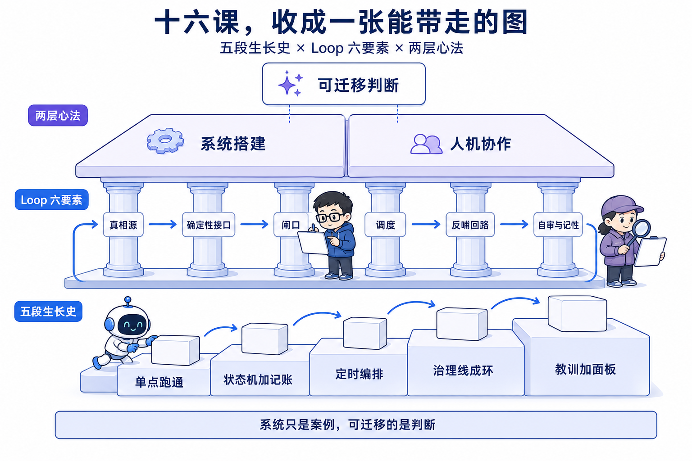
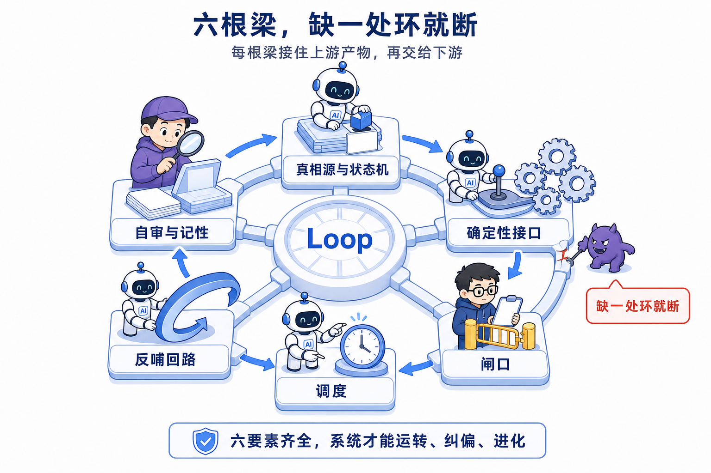
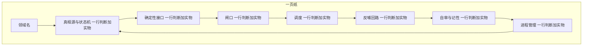
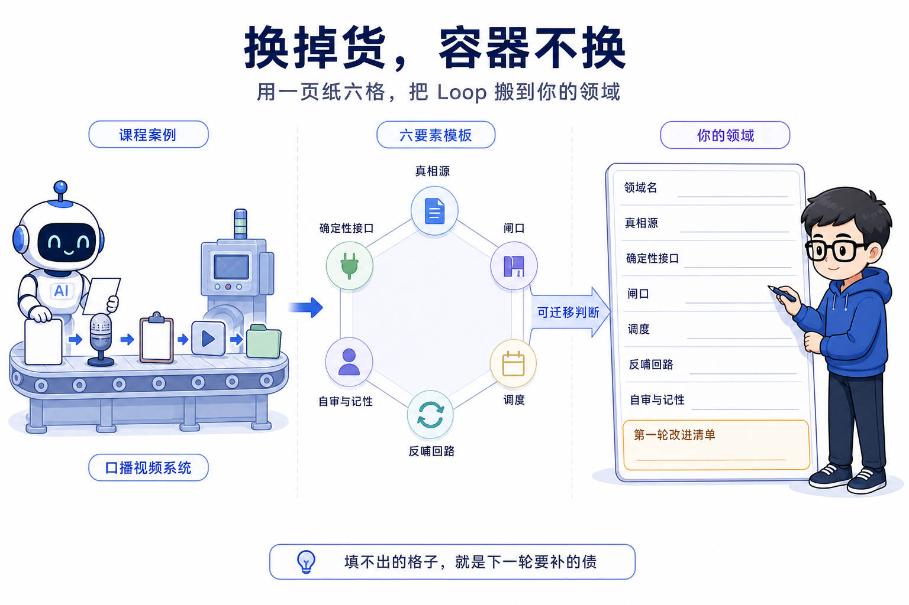

# 第 18 课 结课总纲，把十七课收成一张能带走的图

结课不教新命令。你从第 0 课一路搭到这里，手里已经有一套会自己跑的系统，定时 agent 每天自动取题、创作、出审，人只在不可逆处点两下，治理线自己复盘自己调参。这一课唯一要做的事，是把前面十七课攒下的判断收成一张能带走的图。**系统只是案例，可迁移的是你搭它时立起的每条判断。** 这是本课唯一的判断锚点，后面每一节都在回扣它。

先看这张图分几层。最底下是五段生长史，按时间排，是你实际搭过的东西。中间是 Loop 七要素，按功能排，七根梁收成一栋楼。最上面是两层心法，一层管系统怎么设计，一层管人怎么和 AI 一起干活。三层叠起来，就是这门课的完整交付。

本课没有新命令、没有新工具、没有新的代码分支。你做的事情是回望和收拢，把已经造出来的东西重新命名一遍。回望有两种收法，下面先讲清楚为什么选这一种，再动手。

## 一、五段生长史，你搭过什么

整门课的编排顺序就是这套系统真实的生长顺序。第 0 课开篇给过一张五段表，那时候它是一张预告，你看到的是别人系统的生长史。现在它是一张回执，每一格你都亲手填过。这一节用一张表把五段回望完，每段三列，这段搭了什么实物、掌握了哪条判断、对应哪几课。

| 段 | 这段搭了什么实物 | 掌握了哪条判断 | 对应课号 |
| --- | --- | --- | --- |
| 单点跑通 | 一条完整口播成片，网页、配音、质检、录屏、封面五件套 | 时间线骨架先对齐再批量；真相源向下派生；质检判改分权 | 第 0 到 4 课 |
| 状态机加记账 | content 目录、backlog 选题池、brain 五件套、media CLI、发布包装、飞书双卡 | 状态是数据不是位置；记账是确定性活；发布默认档位是演习；人的决定做成机器可读事件 | 第 5 到 8 课 |
| 定时编排 | daily-run.md 入口、定时任务、上报通道 | 文档即程序；只写本地日志不算上报 | 第 9 到 10 课 |
| 治理线成环 | 治理线宪法、dispatcher、tasks.md 注册表、复盘三件套、account-audit 元层 | 自动化边界由可逆性划定；调度与执行解耦；信号单向来路；自审是一张权限表 | 第 11 到 14 课 |
| 教训、后端与面板 | lessons.md 教训账本、最小后端、前端看板面板 | 坑先登记成故事；无头 AI 当进程管；面板不记状态 | 第 15 到 17 课 |

表格里每一段都收在一句支点话上，这句支点正是下一段为什么存在。

第一段的支点。你手里有了第一条成片，第二个问题跟着浮出来，第二条呢，十条呢，状态谁记。单点跑通产出了需要被管理的内容，状态机是被它逼出来的。**单点跑通产出的东西需要账本接住，是第二段的支点。**

第二段的支点。账立起来了，流水线能重复跑，但每天还要你坐到终端前点火，休一天假就停一天工。状态机和记账把重复变可靠，把可靠变无人，是第三段定时编排的前提。**账能记就能交给时间去跑，是第三段的支点。**

第三段的支点。无人日更跑起来了，挂了你多久知道这个问题被阻塞即上报接住。但跑几周之后，池子过期、打法过时、数据没人看，生产线只会造新内容，没人负责把偏差拉回来。无人系统暴露了没人催会烂的熵增，治理线是被它逼出来的。**无人跑起来才看得见熵增，是第四段的支点。**

第四段的支点。大环闭合，系统能自己养自己。但调参只改数字，改不了认知，踩过的坑散在对话里就丢了。系统会跑会调，还要记得住为什么这么跑、看得见跑得怎么样。教训账本、最小后端和面板是第五段补上的三块。**系统会自己跑，还要记得住、管得动、看得见，是第五段的支点。**

第五段没有下一段。它收口在三件事上，最小后端把无头进程管起来，教训账本让系统记得住，面板让系统看得见。到这一段，五根梁全部立完。

五段回望的方式本身也有取舍，这里摆一次技术辨析。收这门课，有两个框架可用。一个按时间回望，就是刚做的这张表，沿生长史一段一段看。好处是贴合你实际动手的顺序，每一段你都亲历过，认知负荷低，一眼能认出每样实物。坏处是时间顺序管不了功能结构，五段之间是线性推进，看不出七要素互相咬合的关系。一个按功能收口，就是下一节的 Loop 七要素，把分散在各段的判断按系统功能重新归类。好处是直指系统为什么能自闭环，坏处是它脱离了你动手的时间线，单看显得抽象。这一课两个都用，生长史回望负责让你认出每样实物，七要素负责把实物收成一张结构图。选这个组合的理由是，结课要让判断可迁移，可迁移靠结构，但结构要能指回你亲手搭过的东西，指不回去就记不住，记不住就带不走。

五段搭完，把十七课攒下的命令也收成一张总表。本课不教新命令，下面这些命令你在前面每一课都敲过或读过，这里只是把它们摆到一张表上，每项一句输入和做什么。命令是系统的对外接口，接口越少，系统越不容易被绕过，多一个命令就多一处要维护的入口。

| 命令或文档 | 输入 | 做什么 |
| --- | --- | --- |
| media next | 无 | 预演取题，报会取谁为什么，只读不翻账 |
| media promote | 选题 id 加 slug | 取题记账，backlog 翻 picked、回填指针、建目录写 meta，五处一次改齐 |
| media flip | slug 加目标状态 | 过迁移表翻状态，补时间戳，重建 dashboard 在制表 |
| media publish-done | slug 加作品链接 | 发布记账，meta 加 backlog 加 dashboard 三处收口 |
| media check | 无 | 全仓一致性体检，规则唯一定义在代码里 |
| douyin-publish | 一条 approved 的内容 | 先 dry-run 演习，授权后真发，发完调 publish-done 记账 |
| daily-run.md | 无 | 定时 agent 的入口 prompt，串起取题到出审，停在人审 |
| harness-dispatcher | 无 | 读 tasks.md 注册表评估触发，派活并追加一行账到 index.jsonl |
| feishu-notify | 内容或事件 | 推审核卡、确认发布卡，或推三要素文本通知 |

数一下，九个接口覆盖了从取题到复盘到调参的全部动作。第 6 课说过，命令少一个，就有一处记账退回手工。命令表的收口处是这一句判断，接口少，系统的确定性就多一分。

## 二、Loop 七要素，七根梁收成一栋楼

生长史看时间，七要素看结构。把五段回望里散落的判断按功能重新归类，会得到七个要素，它们合起来正好构成一个能自己转的环。这七根梁你都已经搭过，这里只做一件事，把它们命名出来，指回课号，指回实物，再点破每根梁缺了环会断在哪。

总纲表先摆出来。收总纲用表格还是用散文，这里选了表格。散文顺着读，但七要素之间是空间结构，用表把要素、课号、实物、判断四列对齐，一眼看全。代价是每格只能装一句话，深一层的意思放回正文各段展开。

| 要素 | 指回课号 | 对应实物 | 一句话判断 |
| --- | --- | --- | --- |
| 真相源与状态机 | 模块二，第 5 课；第 16 课 | meta.yaml 加 backlog.yaml 加 brain 五件套；文件系统即总线 | 状态是数据不是位置，账本唯一；写者读者经文件解耦，谁都能崩，状态可重建 |
| 确定性接口 | 第 6 课 | media CLI，迁移表加一致性规则 | 记账是确定性活，判断归 LLM、确定性归代码 |
| 闸口 | 第 7 8 课 | dry-run 加飞书双卡 | 人审钉在不可逆点前，授权信号单一明确 |
| 调度 | 第 9 12 课 | daily-run 加 dispatcher 加 tasks.md | 文档即程序，调度与执行解耦 |
| 反哺回路 | 第 13 课 | douyin-retro 到提议到人审到 brain | 信号单向来路，数据变回下一轮打分依据 |
| 自审与记性 | 第 14 15 课 | account-audit 加 lessons.md | 自审是一张权限表，坑先登记成故事 |
| 进程管理 | 第 16 课 | cc-stream 加 console server 加 job runner | 无头 AI 是一台进程，最小权限、判成败看文件、容忍它死 |

七根梁收成一个环，画出来是这样。

图点破一句。环上没有一条边是多余的，每一根梁都从上一根那里接住一个产物，再交给下一根，少一根，环就断在那一处。

这张图里的七根梁，第 0 课你已经见过一次。开篇那张 Loop 全景图是按流程画的，取题到创作到发布到复盘，走的是时间线。现在这张按结构画的，把时间线折叠成一个环。同一条系统，两种画法，前一种让你看清每天发生什么，后一种让你看清什么支撑着每天发生什么。到自己的领域搭系统，你带走的应该是后一张。七要素从哪来，一句话说清，它是十七课所有判断按功能归类的产物，每一根都能指回你亲手搭过的那一课。

下面逐根讲，为什么是这根梁，少了它环会断在哪。

第一根，真相源与状态机。它管一切状态记在哪。内容的细账住各条 meta.yaml，选题的粗账住 backlog.yaml，决策依据住 brain 五件套，dashboard 和面板是派生视图只读。第 16 课再补一句，写者和读者不直接通信，都经文件系统解耦，谁都能崩，状态可重建。少了它，状态散落在目录位置、看板和对话里，没有一处是权威，下一根确定性接口就无从下手，因为它要改的账连定义都没有。断在这，整个环没有地基。

第二根，确定性接口。它管状态怎么翻。翻状态是答案唯一的确定性活，收进 media 命令，迁移表显式画全，五处账一次改齐。少了它，翻状态退回 AI 自觉，第 6 课那个实验的现场，让 AI 自觉记账，一次翻两条、中途插任务、隔天新开对话，三种花样三种漏法，把确定性活交给概率模型漏账是必然。漏一处，环上就多一笔坏账。坏账攒到一定量，账本不再可信，后面每一根读到的都是脏数据。断在这，真相源名存实亡。

第三根，闸口。它管人在哪进场。发布不可逆，改 brain 不可逆，两个不可逆点前各钉一道人审，其余全程无人。少了它，要么不可逆动作没有授权直接执行，要么人审撒满全流程把注意力推疲劳，两个方向都让环失去人的校准。断在这，环要么失控要么失察。

第四根，调度。它管谁在什么时间醒过来。定时 agent 读 daily-run，dispatcher 读 tasks.md，到点把活派出去。少了它，每一环都要人记得去点，系统退化成手动流水线，治理线的任务没人点醒就永远躺着。断在这，环不再自己转。

第五根，反哺回路。它管数据怎么流回大脑。发布后复盘拉数据，漏斗归因产提议，人审后回写 brain，下一轮打分读 brain。少了它，发布完的数据躺在创作者中心没人看，brain 停在开账号那天的假设，下一轮打分用的还是旧尺子，系统每转一圈都在原地打转。课程仓实测过替代路线的代价，选题端爬抖音，反爬太重进不了无人流水线，就算爬到了，推荐信号和选题质量纠缠分不开，打分被污染。所以信号只走复盘这一条路，可归因才可重算。断在这，环不闭合，只剩一条生产线在单向消耗。

第六根，自审与记性。它管系统自己怎么被看着。account-audit 读运行账本，按限幅表调治理线自己的参数，lessons.md 把坑登记成故事，规则回写 SOP。少了它，配置钉下那一刻就被冻结，踩过的坑下一轮接着踩，系统跑得再顺也不会变好。断在这，环会转，但不会进化。

第七根，进程管理。它管系统的活由谁在什么状态里跑。spawn 出来的无头 AI 是一台进程，拉起时给最小权限白名单，成败判它改的文件不判它说的话，容忍它死因为状态在文件里，重启即恢复。少了它，每个 AI 任务当黑盒用，起了没起看不见，走到哪一步看不见，成没成靠它自报，双击还会双发。断在这，环上每一段都在黑盒里空转，出了事只能等它自己暴露。

七根梁讲完，回扣开篇判断。这一节把十七课攒下的判断重新归了一次类，归类本身没有产生任何新东西，但可迁移性出现了。你到自己的领域搭系统时，不用按时间从头撞一遍墙，直接照着七要素填空就行。

## 三、搭建心法，十七课攒下的系统判断

七要素是系统层面的结构，搭建心法是设计层面的选择。结构告诉你环由几根梁组成，心法告诉你搭每一根梁时按什么原则选。下面八条，每条都是一句判断加为什么加代价，全部从前面课程的真实决策里来，没有一条是凭空想出来的。

第一条，**真相源永远在文件里**。第 3 课音画不符的学费买来的，改上游必重抽下游。第 5 课把它升级成系统级，状态真相源在 meta 和 backlog，dashboard 只是投影。第 16 课文件系统即总线，谁都能崩，状态可重建。第 17 课面板再升一档，面板不记状态，账本一改推 revision 整站重拉。为什么。文件可 diff、可回滚、AI 零门槛读写，git 就是审计日志，人和 AI 信的是同一份真相。代价。文件没有数据库的约束和索引，一致性要靠 check 这类体检命令兜底，索引和约束都得自己用代码补，查一次全库要现读一遍文件。

第二条，**写路径唯一入口**。第 6 课把五处账压进 promote 一条命令，第 8 课发布收口只走 publish-done，第 16 课后端把这条焊成包边界，server 永不直接写文件，第 17 课前端也不直接写文件，写动作全绕回 media。为什么。翻状态夹着合法性校验和一致性，多处分散做，谁都会漏，唯一入口把容易漏的多处一致性压进一个原子操作，一条命令要么全做完要么全不做。代价。加一处新账务就要扩命令，命令本身要维护，但比起漏账之后追查的代价，这笔维护费便宜得多。

第三条，**人审只钉在不可逆点**。第 7 课立发布是唯一不可逆的外向动作，第 8 课把发布和改 brain 两个不可逆点各钉一道人审。为什么。人的注意力是全系统最稀缺的资源，闸口撒满全流程，人会疲劳成点头机器，处处停顿等于没有停顿，只钉不可逆点才让每一次进场都有收不回的决定可审。代价。不可逆点判错一处，就把该审的放走了，这个判据要在设计时反复确认，别把可逆环节当不可逆，也别反过来。

第四条，**信息流单向可控**。第 13 课信号单向来路，受众反馈只走复盘一条路进大脑，选题端不爬抖音。为什么。信号来源单一，一条内容火了，才能分清是选题好还是恰好蹭到推荐，打分不被污染，归因可重算，可重算才有资格回写 brain。代价。选题端少了抖音热门的直接线索，新方向的发现会慢，要另开对标复核从跨平台捞证据补旁证。

第五条，**判断归 LLM、确定性归代码**。第 0 课立的设计取向，第 6 课给了一个可操作判据，先问这件事答案是不是唯一，唯一进代码，不唯一留给人或 AI。为什么。确定性活交给概率模型等于每次掷骰子，漏账是必然，判断活交给规则引擎等于让它猜。代价。分界线本身要判断，标错类别，要么代码写死限制发挥，要么 AI 自由发挥不可控，这条分界线的判断力，正是这门课最有含金量的东西。

第六条，**先撞墙再立规则**。这门课的每条铁律都对应一次真实事故，L14 六天空跑立了阻塞即上报，L2 音画不符立了真相源纪律，L15 漏字幕立了录后体检。为什么。规则写在撞墙之后，执行者才知道这条规则挡的是哪堵墙，规则才有说服力，也不会被当成过度设计，课程模块顺序本身就是沿撞墙顺序排的。代价。撞墙要付学费，撞了墙还要有人把教训登记下来回写 SOP，不然墙白撞，这正是第 15 课教训账本要接住的活。

第七条，**能造最小就最小**。第 6 课第一版四个命令就够，publish-done 这些是踩坑后补的。第 12 课加权随机只预留给未来的 per-item 任务，不用在所有任务上。第 17 课图表库不上，metrics 折线自绘六十行。为什么。最小可跑的系统先转起来，多余的复杂度留到被真实需求逼出来再加，加的时候带着第六条先撞墙的教训。代价。最小意味着有些边界没覆盖，踩到没覆盖的坑再补，这是刻意认下的，好过一开始就堆上一套用不上的复杂度。

第八条，**无头 AI 是进程不是嘴**。第 16 课把当黑盒用了十六课的无头 claude 拆开。你给它最小权限，判成败看它改的文件，容忍它死，因为状态在文件里，重启即恢复。为什么。把它当助手，你会信它说的话，双击就双发，卡死当在跑；把它当进程，你才会给它白名单、上幂等锁、看文件判成败，它的话只当展示，它的文件才是裁决。代价。判成败看文件，要求每个任务都留下可判的文件痕迹，有些 AI 任务的产出不是文件，要专门设计一个落点。

八条心法里，第 16 课后端是文件系统即总线加进程管理的现场，第 17 课面板是派生视图升成屏的现场。后端把无头进程管起来，写者读者经文件解耦；面板把真相源推到了最极端的形态，面板是最花哨的派生件，却不记任何状态，状态还是回到文件里。你看到面板上任何一个数字，都值得追问一句，它对应的真相源文件在哪。追问得出来，说明这条心法还在生效，追问不出来，说明投影又偷偷变回了账本。

## 四、与 AI 协作的六条心法

七要素和八条心法管系统，还有一层管人怎么和 AI 一起干活。这一层不单独开课，全部嵌在跟做过程里现场示范，本课把它们收拢成六条清单。

第一条，**关键结论落文档，不留在对话里**。对话会结束，文档才是人和 AI 的共享记忆。示范课在第 1 课落 CLAUDE.md 项目宪法，第 5 课落 brain 五件套，第 9 课落 daily-run 入口，第 15 课落 lessons.md 教训账本。判据是，你今天在对话里说清的一件事，明天新开对话 AI 还能读到吗，读不到就是没落，落下来才是人和 AI 的共享记忆。

第二条，**按判断独立性拆 agent**。拆 agent 的尺子是判断独立性、权限隔离、可并行度，不按工作量拆。第 4 课质检 reviewer 只判不改，无写权限，修复归主会话。第 14 课六类 AI 角色全部摆开，每个角色的权限都写在某处文档里。判据是，一个角色独立出去，它的判断是不是自成一体，它能不能只读不改，拆出去之后职责会不会和别处重叠。

第三条，**在返工成本突变处停下对齐**。第 2 课 Checkpoint 硬节点，稿子定了才开发，第 1 章过了才批量。为什么停在这些位置，因为返工成本在这些位置从便宜变贵，停了能省下后面的大返工，别的没有突变的位置不设卡。判据是，找一个返工成本跳变的位置，在那里插一道人审，成本没突变的地方不设卡。

第四条，**给 AI 的任务带机器可验判据**。第 3 课死气复扫数为 0，第 6 课契约用例验收，第 10 课三要素通知人照着能动手。判据是，AI 交回来的货，你能用一条命令或一次 grep 验证它做对了，验证不了等于没做，验产物不验 exit code。

第五条，**说明书思维**。方法论沉淀成 skill 一次，AI 每次加载执行。第 2 课读开源 skill 的说明书直接拿来用，第 9 课写 daily-run 让定时 agent 当解释器。判据是，这个方法你能不能写成一页 AI 照做的说明书，写不出来说明你自己还没想透，想透的人才写得出一页说明书。

第六条，**铁律前置**。红线写在文档最前面，AI 先看到约束再看到步骤。第 7 课 skill 铁律段放第一个小节，第 1 课 CLAUDE.md 内容红线先于一切任务加载。判据是，打开一份给 AI 的文档，前几行是不是就是不能做什么，不是，就重排，把红线挪到最前面。

六条心法嵌在各课，本课收拢。它们和八条系统心法的区别是作用对象不同，八条管系统怎么设计，这六条管人怎么派活。系统是案例，七要素是结构，两层心法才是你真正带走的东西。

## 五、把这张图迁移到你的领域

七要素和两层心法收完，剩下最后一步，把这套结构搬到你自己的领域。口播视频流水线只是本课的货，七要素是容器，容器不挑货。先回答一个必然的问题，这七要素是自媒体专用的吗。看一遍要素名，真相源、确定性接口、闸口、调度、反哺、自审与记性、进程管理，没有一样带着视频的痕迹，它们描述的是一个系统保持可运转、可纠偏、可进化的共性。货会换，容器不换。下面给每个要素举一个其它领域的映射例，让你看清这套结构能搬到哪。

真相源与状态机。个人知识库运营里，原子笔记是唯一真相源，反向链接是派生索引，改一条笔记，所有引用它的页面都要跟着看一遍，和第 3 课改上游必重抽下游同一条纪律。笔记散在多个工具里，就等于状态散在多个目录，没有一个权威版本，改一处漏一处。

确定性接口。开源项目维护里，git 提交是确定性接口，所有状态变更走 commit，人审 diff，第 6 课 promote 五处一次改齐在这里对应一条 commit 只做一件事。没有这个接口，改一行代码绕开 commit，就查不到谁改的、为什么改、出了事怎么回滚。

闸口。开源项目里，PR 合并前必须 review，不可逆点是合并进主干，第 8 课人审钉在不可逆点前，对应合并前的一道 review 关卡，合并之后改起来要 revert，成本陡增。少了这道关卡，错误代码进了主干，要等线上炸了才被发现，收不回来。

调度。求职投递流水线里，一周一次的定时复盘是调度，投递、笔试、面试、offer 各状态由它点醒推进，第 9 课文档即程序对应把你的投递 SOP 写成一份可执行文档。一周不点醒，投递就停在同一个状态，岗位窗口一过就永久错过，和复盘窗口错过一个道理。

反哺回路。求职里，每次面试后的复盘数据流回投递策略，什么岗位值得投、简历哪段要改，第 13 课信号单向来路对应只从面试反馈这一条路学，不靠瞎猜。每轮面试都是信号，攒够了才知道该调简历还是该换方向，靠猜只会越投越偏。

自审与记性。个人知识库里，每周统计一次笔记产读比，读得少就调收藏策略，踩过的坑记进自己的 lessons，第 14 课权限表对应给收藏策略划自调边界，第 15 课教训账本对应自己的踩坑登记。没有这一层，收藏策略会停在第一天拍脑袋的值，踩过的坑下个月再踩一遍。

进程管理。个人项目里，你通过命令行拉起 AI 跑批任务，给最小权限、看它改的文件判成败、挂掉自动重启，对应第 16 课把无头 AI 当进程管。没有这一层，AI 任务当黑盒用，跑了没跑、成没成全看不见，出了双发才知道。

映射例看完了，每个要素在你的领域里落哪，这就是迁移。迁移的产物要落成一页纸，能落到一页纸上，才谈得上带走。这里摆一次技术辨析。迁移落地有两个做法。一个自由发挥，把七要素在心里过一遍，想到哪写到哪。好处是不受形式束缚，写起来顺畅。坏处是容易漏要素，也容易把判断写成愿望，愿望没法验证。一个是一页纸七格，领域名占一格，七要素各占一格，每格填一行判断加一个实物。好处是七格逼着你把每个要素都落到具体可验证的东西，坏处是形式固定，有些领域某个要素暂时空着会显得尴尬。选一页纸七格，因为迁移的目标是带走一张能填空的结构图，一页纸七格是最小的可验证形态，空着的格子本身就是你接下来要补的清单。

一页纸长这样。

图点破一句。七格不要求一次填满，哪一格能填出判断加实物，哪一格就是你已经能迁移的部分，填不出的格子是下一轮要补的债。最后一格连回第一格，这一页纸本身就是一张待填的 Loop 图。

填这页纸的操作路径可以口述。第一步写领域名，一句话说清这是哪个系统。第二步到第八步，逐格填七要素，每格一行判断加一个具体实物，实物必须是你这个领域里真实存在的东西，不写愿望。第九步，检查环通不通，从真相源出发顺着箭头走一圈，看每个交接处有没有掉链子的地方。第十步，标出空着的格子，把它列成你接下来的第一轮改进清单。

结课检查清单七件也在这里收口。至少一条自产口播成片，一条带人审闸口的完整流水线，一份 daily-run 加定时触发，一条至少注册了 ideate 加 check 加 retro 的治理线，没发过抖音的学员 retro 用第 13 课的样例数据跑通归因、产出报告和提议也算完成，一本自己的 lessons.md，一份最小后端闭环（读接口、快写、慢作业、job runner），一页纸最小 Loop 迁移设计。前六件是系统本身，第七件是迁移，第七件就是这一页纸。对照一遍，前六件缺了哪件，回去补哪课，第七件没填完，它就是你的第一个新 Loop 的起点。

## 六、几个判断带走

结课没有下一课，收尾不设钩子，改成行动召唤。

主判断复述一遍。结课不教新命令，它把前面十七课攒下的判断收成一张能带走的图。系统只是案例，可迁移的是你搭它时立起的每条判断。

三条支撑再各说一句。第一，生长史回望让你认出自己搭过什么，七要素收口把实物收成结构，两层心法让结构可迁移，三样合起来才是能带走的图。第二，七要素缺一根环就断一处，真相源与状态机、确定性接口、闸口、调度、反哺回路、自审与记性、进程管理，七根梁收成一栋楼，环上每一处断裂你都亲手修过一次。第三，迁移的产物是一页纸七格，领域名加七要素各一行，填不出的格子是你下一轮要补的债。

把这一路走下来的方式也说一句。你搭这套系统全程没手写一行代码，你做的事是写规格、派活、验收，一路和 AI 协作。这套方式本身也是带得走的，第四节的六条协作心法就是它的浓缩。到新领域，你仍是那个写规格、把好验收关的人，手艺没有换。

现在轮到你了。去你的领域，打开一页空白，写上领域名，把七格逐行填下去。这一页纸不要求今天填满，但第一格现在就能填，领域名你已经有了，剩下的每一格都指向你真实做过的一件事。填到空着的格子时，不要停，把它写进你的第一轮改进清单，那正是你下一个 Loop 的起点。
