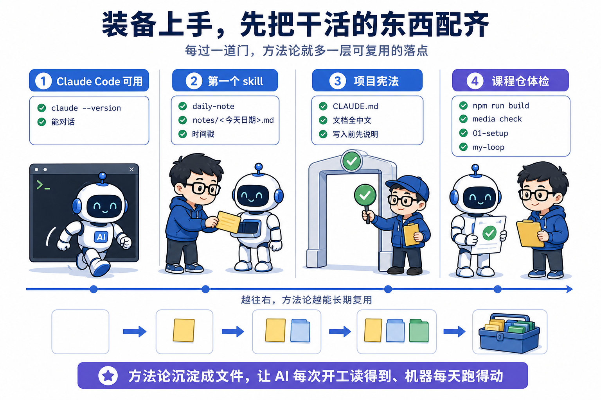
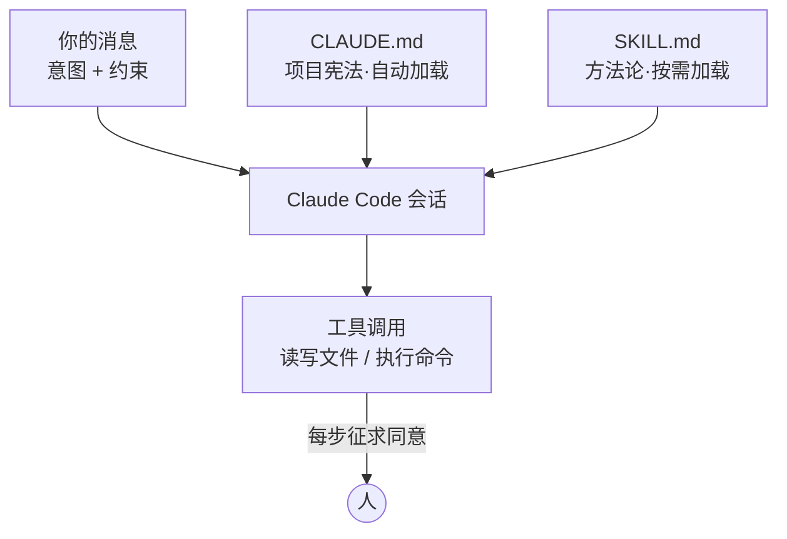
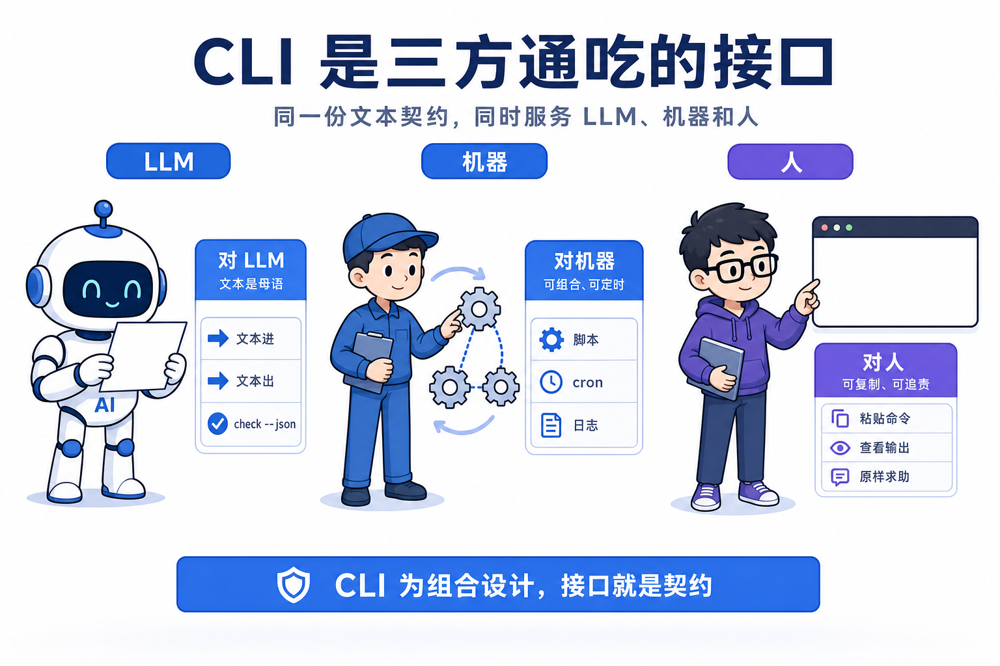

# 第 1 课 装备上手，先把干活的东西配齐

**装备上手的全部动作，是把你的方法论沉淀成文件，让 AI 每次开工读得到、机器每天跑得动。**

第 0 课结束时，你看过了这套系统无人运行的一天，AI 取题、创作、质检、推审核卡，人只点两下按钮。你也知道了它的四层结构，和那句设计取向，判断归 LLM，确定性归代码，状态记在文件里。但到目前为止这些都是别人的系统，你的手上还什么都没有。

直接跳去第 2 课做视频是不行的。那一课要 copy 一个开源 skill 并让 AI 按它的流程干活，如果你还不知道 skill 是什么、AI 从哪读到它、怎么约束 AI 的行为，每一步你都只能照抄命令，不理解发生了什么，这门课就退化成了操作说明书。工具和概念的地基必须先打好，而且要打在亲手验证过的程度上。

这一课的任务是配齐最小装备，做完后你应该达到四个状态。Claude Code 装好且能对话；亲手让 AI 写过并跑通了一个 skill；用 CLAUDE.md 成功约束过一次 AI 的行为；课程仓 clone 到本地、构建通过、`media check` 跑出了真实的体检结果，并站在了自己的起点分支 `01-setup` 上。



## 一、先让 AI 替你干一件小事

先让 AI 干一件零风险的杂事，你会看清它靠什么干活，也会第一次摸到意图交给 AI、红线由人钉死这个搭配。对话里的约束只活一次，这正是下一节要把方法论搬进文件的原因。

### 1.1 安装与登录

Claude Code 是一个跑在终端里的 AI agent，你用自然语言描述任务，它调用工具（读写文件、执行命令）去完成。先认识终端，终端是电脑上敲文字命令的窗口，macOS 里叫终端（Terminal），在启动台搜索 Terminal 打开，Windows 用 PowerShell。命令就是一行字，在终端里粘贴一行、按回车，它执行完回一行结果，这门课每个动手步骤都在终端里完成。目录就是文件夹，命令里的 `.` 表示当前目录，`..` 表示上一级，`cd 名字` 进目录，`cd ..` 回上一级。安装只要一条命令，但装之前先确认 Node 装没装，Node.js 是让 JavaScript 程序在电脑上运行的运行时，npm 是它的包管理器，装 Node 会一起带上。

```bash
node --version                              # 输出一串版本号（如 v22.3.0）即已装好；报 command not found 就去 nodejs.org 装 LTS 版再回来
npm install -g @anthropic-ai/claude-code   # 装好 Node 后执行，全局安装
claude --version                            # 输出版本号即安装成功，第 1 项验收通过
```

Node 装好、`node --version` 有输出的，继续往下。想用原生安装方式或安装遇到问题，以[官方文档](https://docs.claude.com/en/docs/claude-code/setup)为准。装好后在任意目录输入 `claude` 启动，首次会引导登录（订阅账号或 API key 均可）。它走 npm 发行，所以先要有 Node，装最新 LTS 版本最稳。

安装这一步，先说 AI 会怎么错。让它代劳装环境，它容易装错版本，`npm install -g` 不带版本号，它可能帮你敲成旧版本，也可能建议你用 `npx` 临时拉一个每次现下、下次还要重下的方式，装出来的环境不持久。所以安装自己敲，装完看 `claude --version` 输出版本号再往下走。

关于权限，先只需要知道一件事。默认模式下，Claude Code 每次要写文件或执行命令都会先征求你的同意，你按回车放行、按 Esc 拒绝。这个 AI 提议、人放行的交互，本身就是这门课要讲的闸口思想的最小形态，先体感一下，不用深究配置。

### 1.2 第一个任务

不写代码，让它干件杂事。先在终端里建一个练习目录再进去，`mkdir practice` 建目录，`cd practice` 进去，然后启动 `claude`，把这段话贴给它。

```plain
看一下我的下载目录（~/Downloads），按文件类型统计数量和总大小，
把结果整理成一个 markdown 表格，存到当前目录的 downloads-report.md。
不要移动或删除任何文件。
```

观察它的动作序列，先跑 `ls` 或 `du` 之类的命令收集信息（每次征求你同意），然后写文件。任务完成后照下面这样验证。

```bash
cat downloads-report.md   # 应看到一个统计表格，数字与你的实际文件对得上（cat 文件名 = 在终端里打印这个文件的内容）
```

这几分钟的小任务里，有两个要点后面还会反复用到。第一，你只交代了要做成什么，没规定用什么命令统计，它自己选了办法；第二，你在 prompt 末尾写了一条约束，不许它移动或删除任何文件，它遵守了。意图交给 AI 发挥、红线由人钉死，这个搭配后面每一课都在用。

这个任务里，AI 会这么错。它可能不先跑命令收集，直接凭印象猜一个文件名和大小写进表格，数字和你的下载目录对不上。所以验证这一步不能省，`cat` 出来之后，拿表格里的数字和 `ls` 实际看到的比一下，对不上就在对话里让它重跑一遍统计命令再写。验证靠你把结果和事实对照，AI 不会告诉你它猜了数字。

这里顺带一个小的设计点。你让它输出 markdown 表格，是因为表格结构固定，你一眼能核数字；让它自己选，它可能给你一段散文，核对的成本就上去了。约定输出格式，本身就是派工时要钉的第一件事，后面每一课的派工 spec 都从这一步起手。

到这里，你教它的东西都只活在一次对话里。它替你统计了下载目录，但这份能力没有留下来，下一次对话它不会自动沿用，因为你刚才的要求只在这一次有效。下一节要做的，就是把方法论从对话里搬进文件，让它每次开工都读得到，这是本课那句判断的第一步。

## 二、AI 的说明书与宪法，skill 和 CLAUDE.md

要让 AI 稳定地按你的方法论干活，得把方法论写成它每次都能读到的文件，skill 管一类任务怎么做，CLAUDE.md 管整个项目永远要遵守什么。刚才的任务是一次性的，对话结束，你教它的一切都消失了，所以这一步是装备的核心。

动手之前先做一个方案取舍，这也是本课要交的第一个设计题。把方法论传给 AI 有两条路。第一条路是每次对话现贴，开工前把规则复制进 prompt。好处是灵活，随时能改；代价是每次重贴，一忙就漏，而且昨天贴的版本和今天贴的可能对不上。第二条路是写进文件，让 AI 开工时自动加载。代价是要先花一次功夫把规则写清楚，之后还得维护；好处是稳定，一次写好次次生效，还能进 git 接受审查。这门课选第二条，整套系统的方法论都住在文件里。

### 2.1 skill，给 AI 的方法论说明书

skill 是一个按约定放置的 markdown 文件包，摆法大致是这样。

```plain
.claude/skills/
└── daily-note/
    └── SKILL.md    # 头部是元信息（名字、什么时候用），正文是操作流程
```

AI 在两种情况下会加载它，你显式输入 `/daily-note` 调用，或它根据 SKILL.md 头部的描述判断当前任务匹配、自动触发。可以把 skill 理解成新员工的入职手册，方法论写一次，之后每个任务都照手册执行，不必每次口头重新交代。这个 skill 跑起来就三步，AI 收到 `/daily-note` 或自己判断触发，读 SKILL.md 里的流程，往 notes/当天日期.md 追加一条带时间戳的笔记，文件不存在就先建。三步能口述，这个 skill 你就掌握了。

skill 的技术栈就一样东西，markdown 加一段 YAML 头，没有任何运行时依赖。选它是因为 AI 的母语是纯文本，markdown 它读得最稳，人也读得懂、改得动、能进 git 做 diff。代价是 markdown 没有强校验，头部的字段写错它不会报错，只会悄悄不触发，所以每一步都要人工验一遍。换成别的载体各有坑，写成代码脚本，每次改规则都要动代码还要跑测试；写成网页或 PDF，AI 解析不稳，人也没法 diff。

### 2.2 动手，让 AI 给自己写一个 skill

第一个 skill 不用你写，让 AI 写，这也是你第一次体验用 AI 造工具。在你的练习目录里，把这段话说给 Claude Code 听。

```plain
在 .claude/skills/daily-note/ 下创建一个 SKILL.md，做一个记当日笔记的技能。
要求：
1. 触发后在 notes/<今天日期>.md 追加一条带时间戳的笔记，内容是我给的文字
2. 如果当天文件不存在就先创建，标题为日期
3. SKILL.md 头部写清 name 和 description，description 里说明什么时候该用它
不要加这三条要求之外的功能。
```

生成后人工审查两个重点。第一是 description 写得像不像触发条件，它决定 AI 什么时候会自动想起这个 skill；第二是流程步骤是否就是你要的三条，有没有自作主张加功能。确认后照下面这样验证。

```bash
# 在 claude 会话里输入：/daily-note 今天完成了课程第 1 课
cat notes/$(date +%Y-%m-%d).md   # 应看到带时间戳的这条笔记，第 2 项验收通过（$(date +%Y-%m-%d) 让终端自动填今天的日期）
```

这里有两个 AI 会怎么错，都是审查时要盯的地方。第一个错在 description，这是让 AI 写 skill 最容易写歪的字段。你让它写什么时候该用，它常写成这个 skill 是干什么的，把触发场景写成了功能描述。功能描述它猜不到什么时候该自动调，这个 skill 就退化成只能靠你手动敲斜杠命令触发，自动加载废了。审查时只问一个问题，AI 在什么情况下会主动想起它，答得上，description 才合格。第二个错是加戏。你给了三条要求，AI 常顺手加第四条，比如自动建目录、自动分类、加一个删除功能。多的功能你现在用不上，还会在验证时混进来干扰判断，所以 prompt 里那句不要加这三条之外的功能是硬约束，审查时把 SKILL.md 的流程逐条和你给的三条对齐，多一条就让它删。

### 2.3 CLAUDE.md，项目宪法

skill 是怎么做某类事，CLAUDE.md 是在这个项目里永远要遵守什么，AI 每次在该目录下干活前都会读它，相当于项目宪法。它的加载方式比 skill 更省心，你进这个目录启动 claude，它开工前自动读一遍，之后整个项目里的所有任务都遵守里面的规则，不用你逐次交代。做个最小实验，在练习目录建一个 `CLAUDE.md`，内容照抄下面这样。

```markdown
# 项目规则
- 本项目所有产出文档一律使用中文，包括代码注释。
- 任何文件写入前，先用一句话说明要写什么。
```

然后随便派个会产出文档的任务，观察它是否先说明再写、是否全中文。AI 先说明再写、文档全中文，第 3 项验收通过。

规则生效的那一刻，你就复现了第 0 课实录里的那件事，AI 主动跳过三条高分选题，因为不臆造 benchmark 写在了生产仓的 CLAUDE.md 里。你刚才写的那两条，和它遵守的那几十条，是同一类东西，只是规则数量不同。

规则写在哪一层，也有取舍。全局的 `~/.claude/CLAUDE.md` 管你机器上所有项目，写一次处处生效，代价是一条规则进了全局文件，对所有仓库都起作用，你在别的项目也会被这条中文规则约束，容易误伤。项目级的 `CLAUDE.md` 只在进这个目录时生效，边界清楚，代价是每个项目要单独维护一份。这门课选项目级，因为规则要有边界，账号的红线不该管到你写个人脚本的项目。

现在把这一节的三样东西放进一张图里，一次对话中，AI 读到的东西大致是这样组装的。



这张图按约束的生命周期排了序，从短到长。消息里的约束只管这一次对话，skill 里的流程管一类任务，到了 CLAUDE.md，规则要管整个项目的所有任务。后面课程你会不断做同一件事，把对话里验证过的结论，写进更长生命周期的文件里，这就是关键结论落文档这条协作心法的机制基础。对话会结束，文件才是人和 AI 的共享记忆，本课开篇的判断在这里落地，方法论沉淀成文件，才谈得上每次开工读得到。


## 三、把课程仓请回家，摸一遍真身

装备的最后一件，是把整套系统的真身 clone 到本地。它是本课那句判断的一个大号成品，方法论已经全部沉淀成文件，你摸一遍，就知道这套系统长什么样。

### 3.1 clone 与走读

动手前先认三个 git 词。git 是版本管理工具，把每次改动记成一条带说明的历史，随时能回退、能对照；clone 是把远程仓库完整复制到本地；分支是仓库里平行的版本线，checkout 是切到某条分支上干活。第 0 课讲过一课一分支，这里先把这三个词用起来。

```bash
git clone https://github.com/ZhangYedi-cmd/douyin-media.git douyin-media && cd douyin-media
```

clone 这一步，AI 会这么错。让它帮你 clone，它可能把仓库下到一个你不记得的路径，回头找不到。所以 clone 自己敲，命令里的目录名就是你想要的 `douyin-media`，看到目录建出来再走。

这个克隆下来的仓库，就是往后的课程仓。它有两个世界，`main` 分支是生产系统的完整真身，全部 skill、模板、素材都在这条分支上；`01-setup` 等教学分支是每课跟做完成后的参考状态。你干活的地方是自己的分支，缺什么就从 main 上摘过来，摘的命令是 `git checkout main -- 路径`，它把 main 上指定路径的文件复制进你当前分支，不换分支。从第 2 课起，你会反复用它把 skill 和模板装进自己的系统。

对照第 0 课 §四的目录结构图，五个目录各看一眼就好，每个都会有专门的课细讲。

```plain
brain/      # 账号大脑，定位、人设、风格、对标，所有创作决策的依据（第 5 课）
pipeline/   # 生产线，各阶段 SOP 加编排入口 daily-run.md（模块二、三）
harness/    # 治理线，任务注册表加复盘 SOP 加运行账本（模块四）
content/    # 内容条目，一条视频一个目录，状态写在各自的 meta.yaml
tools/      # 自建工具，media CLI、飞书审批服务；发布引擎 sau 是外部件，第 7 课自装
```

顺手打开 `pipeline/lessons.md` 扫一眼，18 条踩坑记录，每条一行坑的故事加规则落点。不用细读，后面的课会一条条带你撞。

### 3.2 跑一次真实体检

`media` 是这套系统的记账 CLI（第 6 课你会用 AI 造出自己的版本）。它的源码是 TypeScript 写的，构建产物不入 git，clone 后要先构建，步骤如下。

```bash
cd tools/console
npm install && npm run build    # TypeScript 编译，一两分钟
node packages/cli/dist/index.js check --json   # 输出 JSON；能说出 error / warn / info 各代表什么，第 4 项验收通过
```

预期输出是一段 JSON，列出 errors / warns / infos 三级问题。

这条命令从输入到输出的完整路径，你可以口述。先读全仓的状态账本，`content/` 里每条内容的 `meta.yaml`，加 `content/_backlog` 里的 `backlog.yaml`。再逐条对照 `packages/core/src/alerts.ts` 里定义的检查规则，一条规则命中一个不一致，就记一条。最后按严重程度分成 error、warn、info 三级，序列化成 JSON 打印。整条路径三句能说完，先读账本，再对规则，最后出 JSON。能口述，这个组件对你就透明了。

这里有一个坑要提前说明，你大概率会看到非零的告警数，比如 published 条目缺作品链接、scheduled 超时未回填。这些告警是生产仓真实存在的待办，你没有装错。check 的职责就是把状态账本里所有不一致翻出来摆在明面上。一个把账本不一致全部打印出来的系统，比一个显示一切正常的演示项目更值得学，你看到的每条告警，背后都是一条写死在 alerts.ts 里的一致性规则，机器每天都在按这套规则巡检。

这步 AI 会这么错。你拿着这段 JSON 去问 AI，它容易把 warn 说成装错了要你重装，或者不读 alerts.ts 就凭感觉解释 error 和 warn 的区别。正确的用法是先让它读 `packages/core/src/alerts.ts`，再让它对着每条告警说，这条命中的是哪条规则、规则原文是什么。它答得上来，解释才可信。

### 3.3 站上自己的起点

```bash
cd ../.. && git checkout 01-setup   # 本课的完成态参考分支
git checkout -b my-loop             # 从这里拉出你自己的工作分支
git branch                          # 预期当前在 my-loop 上，第 5 项验收通过
```

切分支这一步，AI 会这么错。让它帮你切分支，它可能直接在 `01-setup` 上接着干活，忘了拉自己的分支，或者拉完不验证当前在哪。所以 `git branch` 看一眼，当前分支名对了才算。

`01-setup` 是刻意的最小骨架，目录约定加一个 CLAUDE.md 雏形，没有别的。你的系统将从这里开始，随每课分支逐步长出来；卡壳时 `git diff` 你的分支和该课参考分支，就能看到差在哪。

## 四、AI 时代为什么用 CLI

方法论沉淀成文件，AI 每次开工读得到，这一步你在前面几节做完了。要让机器每天照着文件里的规则跑，还需要一个执行接口，这套系统选的接口从头到脚都是命令行。为什么是 CLI，答案先给，CLI 是三方通吃的接口。

这里展开一个方案取舍。让 AI 干活，接口有两条路。一条是操作图形界面，用浏览器自动化点按钮。代价是 GUI 为人眼设计，每处像素都是不稳定因素，本仓真实踩过这个坑，发布引擎用浏览器自动化上传抖音，某天页面弹了个浮层挡住按钮，整条流水线就地失败（lessons.md 的 L8）。另一条是把功能暴露成 CLI，文本进文本出。代价是功能要专门写一个命令入口，前期多一道工序，但换来接口稳定，CLI 为组合设计，接口就是契约。这套系统全选了 CLI。

三个方向各看一眼。对 LLM 来说，文本进、文本出，是它的母语，`check --json` 的输出 AI 能直接读懂并据此行动。对机器来说，命令能串进任何脚本，这一步的输出直接喂给下一步的输入，一条流水线就拼得出来；要定时，一行 cron 就够；要追责，每次调用留一行日志，谁在什么时候动了什么，事后查得到。落在人身上，你刚才复制粘贴就能跑，出问题把命令和输出原样贴给别人就能求助。



第 6 课你会站在反面亲历一次，先试着让 AI 直接管理状态账本，看它怎么漏账，再用 AI 造出 CLI 把确定性活收走。

## 五、这次把说明书交给 AI 保管

本课开篇的判断在这一节收口，你装的装备、写的 skill、摸过的课程仓，最终都把方法论沉淀进了文件。传统学工具的路径是人背操作步骤，学会了只存在自己脑子里，换台电脑就带不走。你今天做的不同，把方法论写进 SKILL.md，技能就存在文件里，换项目、换人都跟着走，还能进 git 接受审查和迭代。这门课能不造轮子就不造，是这个观念的推论，别人写好的说明书，也就是开源 skill，拿来就能用，下一课你就要这么干。

**几个决策带走。** 意图交给 AI、红线由人钉死，这个搭配从第一个小任务起就在用。约束按生命周期分层，从对话里的一句话，到 skill 的一类任务，再到 CLAUDE.md 的整个项目。构建产物不入 git，clone 后先 build 再跑。三条背后是同一句判断，方法论沉淀成文件，让 AI 每次开工读得到、机器每天跑得动。

下一课正式进入四件套，copy 开源 skill `web-video-presentation`，拿你自己的一篇文章，做出第一个伪装成视频的网页。你会第一次见到一个精心设计的长任务 skill，是怎么在关键节点停下来和你对齐的。
