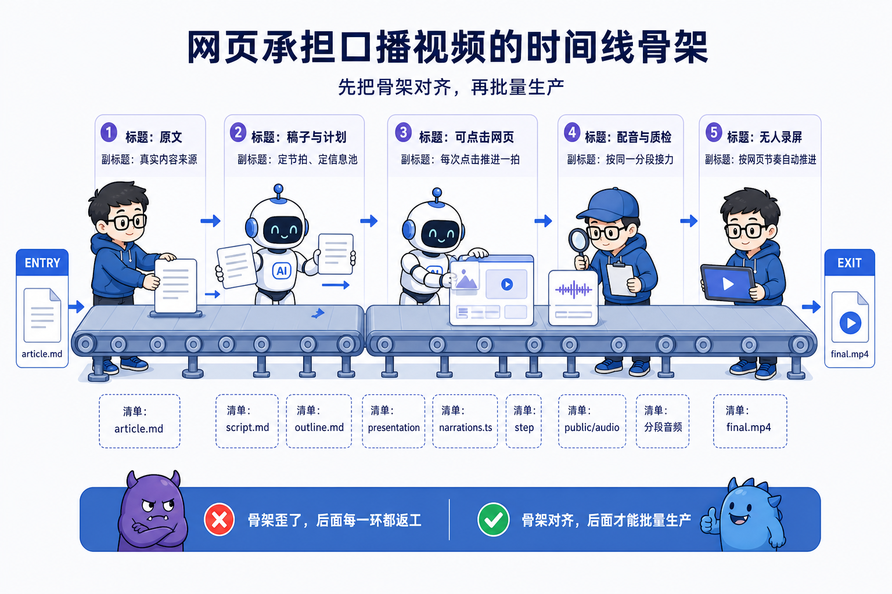
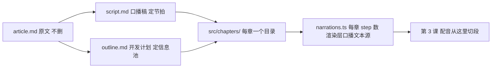
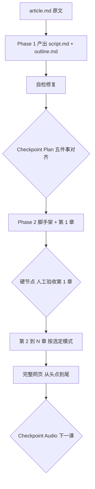
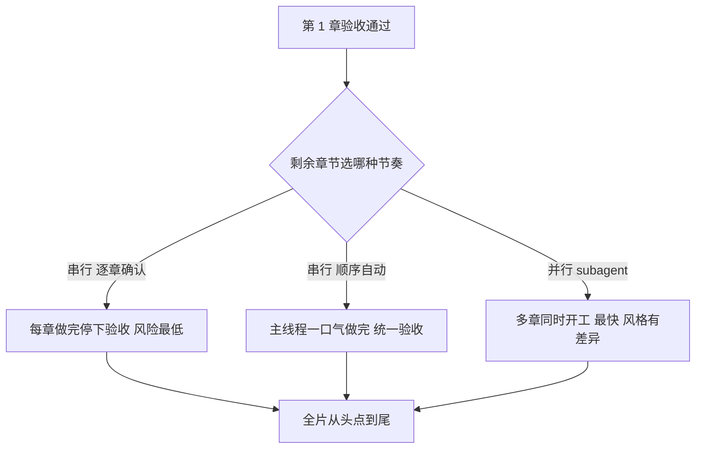

# 第 2 课 从一篇文章到伪装成视频的网页，四件套的第一件

> 代码仓库：<https://git.aicodex.cc/devlist/douyin-media>
> 对应分支：`02-web-video`

第 1 课收工时，你的装备已经齐了。Claude Code 能对话，你亲手让 AI 写过一个 skill 并跑通，CLAUDE.md 的规则约束过一次 AI 的行为，课程仓在本地构建通过，你站在自己的工作分支上。

但装备齐和能干活之间还差一段。如果现在直接对 AI 说"把我这篇文章做成视频"，它会一路生成到底，你在终点收到一个几百行代码的网页项目，稿子的节奏不是你要的，画面风格也不是你要的，改起来处处牵连。大任务交给 AI 的正确姿势，需要一个精心设计过的流程来托底，而这样的流程已经有人开源了。

这一课立一个判断，也是后面全部课的地基。**口播视频的时间线骨架由网页承担，先把骨架对齐，再批量生产**。网页决定后面配音怎么分段、录屏按什么节奏推进，骨架没对齐就批量生产，每一环都在返工。

这一课的任务，是把开源 skill web-video-presentation 请进你的仓库，拿你自己的一篇文章走完它的前两个阶段，产出口播稿、开发计划和一个完整可点击的网页演示。做完后达到四个状态，script.md 和 outline.md 经你逐项确认过，第 1 章画面经你亲自验收过，整个网页能从头点到尾，第一句口播不依赖任何上文也能站得住。

## 一、四件套的第一件

口播视频由四个环节接力，网页（本课）、配音（第 3 课）、质检（第 4 课）、录屏成片（第 4 课）。网页排第一，因为整条视频的时间线骨架由它承担，配音按它的分段合成，录屏按它的节奏推进。

骨架正是这一课要立的判断。网页决定后面每一环的输入，配音的段落数来自网页的 step 数，录屏的节奏来自网页的点击推进。骨架歪了，后面每一环都在返工；骨架对齐了，后面每一环都是顺着骨架批量生产。所以这一课只做一件事，把骨架对齐。



## 二、把开源 skill 请进来

这个 skill 是开源项目。第 1 课你已经知道，skill 的本体是一组按约定摆放的 markdown，安装就是复制。这是你第一次从课程仓摘 skill，说一个后面会反复用到的动作。你 clone 课程仓后已经切到自己的分支，main 分支还留着课程的全部文件，缺哪个文件就用 git checkout main -- 路径 摘到当前分支，不用换分支。这条命令只取路径对应的那一个文件，其余原样不动。

```bash
# 在你自己的工作目录（第 1 课建的分支）执行
git checkout main -- .claude/skills/web-video-presentation
ls .claude/skills/web-video-presentation   # 应看到 SKILL.md、references/、templates/、themes/
```

装完先别急着跑，花五分钟读一遍 SKILL.md 开头的工作流总览图。它把整个制作过程切成了四个 Phase，本课走的这段插着两个必须停下来的 Checkpoint，配音前还有一个 Checkpoint Audio，留给下一课。这张图就是本课的行进路线，也是第六节要拆的分层样本。

按课程的组件三分法，这个 skill 属于开源直用。我们一行都不改它，用它、看懂它、然后把它的设计手法学走。

### 2.1 工作流步骤，逐条看输入与账

skill 对外暴露的工作流一共六步。每一步看四栏，输入、动作、改哪几处账、验收句。这里的账就是文件，本课还没有 media 那样的记账 CLI，skill 落盘的每一个文件就是它的账，你验收时翻的也是这些文件。

| 步骤 | 输入 | 做什么 | 改哪几处账 | 验收句 |
| --- | --- | --- | --- | --- |
| 1.1 识别输入 | 你丢给它的一句话或一个文件 | 判断你给的是文章、口播稿还是空主题 | 无，只读 | 它先反问清楚输入来源 |
| 1.2 一次产出 | article.md | 生成口播稿与开发计划 | 新建 script.md、outline.md | 两个文件落盘，article.md 不删 |
| Checkpoint Plan | script.md、outline.md | 停下来列五件事等你确认 | 你拍板的修改写回两个文件 | 五件事全部有结论且落盘 |
| 2.1 脚手架 | 选定的主题 id | 跑 scaffold.sh 建项目 | 新建 presentation/ 整个目录 | npm run dev 能起 |
| 2.2 第 1 章 | outline.md 第 1 章、主题、article.md | 主线程做完整第 1 章 | 新建该章目录下的 .tsx、.css、narrations.ts | 你逐屏点完第 1 章 |
| 2.3 第 2~N 章 | 剩余章节、选定模式 | 按逐章或顺序或并行做完 | 每章新建一个 src/chapters/ 目录 | 全片从头点到尾 |

六步里只有两处必须停，Checkpoint Plan 和第 1 章验收。这两个停顿的位置，是本课后半段要拆的重点。把账串成一张图，文件之间的指向就是数据流。



先不深究，现在把前两个阶段跑起来。

## 三、备料，你的第一篇口播稿原料

skill 的输入是一篇文章。从你自己写过的东西里挑，技术笔记、复盘、博客都行，一千五百字到四千字比较合适。没有存货就现写一篇几百字的干货短文，主题随意，但必须是你真懂的内容，后面验收画面时你要判断对错。

文章交给 skill 之前，先立三条口播稿的规矩。skill 生成 script.md 时会自动遵守，你确认稿子时也按这三条把关。

1、开头 3 秒要有钩子。刷短视频的人给你的耐心只有一划的时间，第一句话必须给出看下去的理由。

2、第一句必须自成立。本仓踩过这个坑，登记在 lessons.md 的 L11。系列视频的口播开头写了"上一集我们讲到"，第一次刷到的观众没有上一集，直接划走。承接可以放结尾，开头永远冷启动。

3、口语化。写给耳朵，一句一个意思，书面长句念出来就是论文腔。

这三条是你验收稿子的尺子。第四节过 Checkpoint 时，第一刀就砍在第一句上。

## 四、一次产出稿子与计划，然后停下来

### 4.1 跑 Phase 1

在你的工作目录启动 claude，把文章交给它。下面这段直接粘贴，输入、约束、输出格式都写全了。

```plain
用 web-video-presentation 把 article.md 做成口播视频网页。

约束
1. 文章是我写的，技术细节以文中为准，不要自行扩充事实，不要编造数字。
2. 先读完 SKILL.md 和 references/ 里 SCRIPT-STYLE.md、OUTLINE-FORMAT.md 再动手，严格按 skill 定义的 Phase 走。
3. 每次产出后先过对应的检查清单，修完再汇报。

输出
1. script.md，口播稿，第一句必须自成立，不依赖上文，开头 3 秒要有钩子。
2. outline.md，开发计划，每章切几步、每步屏幕放什么、信息池从原文抽哪些数字与案例。

完成后停下来，列出 Checkpoint Plan 的五件事等我确认，不要继续开发。
```

Phase 1 会一次产出两个文件。script.md 是口播稿，决定每一拍说什么；outline.md 是开发计划，决定章节怎么切、每一步屏幕上放什么，并从原文抽出数字、引用、案例组成信息池。原文 article.md 保留不删，后面做画面时它是细节的来源。

这一步有两个常见的翻车。第一，AI 一路生成不停 Checkpoint，把稿子、大纲、脚手架、全部章节一口气做完，本来到五件事该停的那一步被它跳过去，你收到一整个项目。判断标准很硬，它没有停在五件事等你确认，就是越过了硬节点，立刻打断重来。第二，它无视"技术细节以文中为准"这条约束，顺手编一个原文没有的数字填进信息池。后面验画面时你发现数字对不上，要返工的对象从稿子变成了已经写进组件的那一步。

### 4.2 Checkpoint Plan，五件事一次对齐

两个文件落盘后，skill 会强制停下来，列出五件事等你确认，稿子、开发计划、视觉主题、素材、开发模式。这是它设计里的硬节点，你确认之前它一步都不往下走。

这个停顿点有一个统一命名，**先出清单，人审边界，再生成**。清单是 script.md 和 outline.md 两个文件；人审边界是五件事逐项拍板；生成是拍板后进 Phase 2 写网页。本课后面每个停顿都用这套命名，AI 越过中间这条边界往下走，就是本步要防的错。

逐项过的时候重点看两处。一是稿子的第一句，按上一节的冷开规矩把关；二是 outline 里每章的信息池，池里的细节够不够撑起画面，不够就现在补，进了开发阶段再补要连带改组件。

对齐拍板的结论，当场落进文件。你说"第二章拆成两章"，就让 AI 改 outline.md 再继续。这段意见也用一段话派给 AI。

```plain
我确认过了，意见如下。

1. script.md 第一句改成"……"，现在这个开头假设观众看过上一集，要重写。
2. outline.md 第二章拆成两章，原来一次放两个信息点，各占一章更清楚。
3. 信息池里补一条，原文提到"……"，画面需要这个数字。

把你按上面改完的 script.md 和 outline.md 重新落盘，然后逐条回我你改了什么。
```

这段里最难学的是最后一句。你要它改完重新落盘，再回你改了什么。AI 最常见的错，是口头说"好的，我记住了，第二章拆成两章"，然后文件里一个字没动。对话会结束，文件才是你和 AI 的共享记忆。它说改了，你就翻文件验；口头对齐但文件没改，等于没改。这个习惯从本课起贯穿全部课程。

### 4.3 验证

```bash
ls article.md script.md outline.md   # 三个文件齐，article 没删
head -5 script.md                     # 第一句读一遍，冷开是否自成立
```

这两条 bash 是这步的验收句。文件齐不齐看一眼 ls，第一句站不站得住读一遍 head。AI 在这里常犯的错，是只验文件存在不验内容，告诉你"三个文件都生成了"，你打开 script.md，第一句还是"上一集我们讲到"。存在只是壳，这一课的骨架判断落在内容上，head -5 读第一句是必做动作。

## 五、第 1 章亲自验收，剩下的放手

确认后进入 Phase 2。skill 先搭项目脚手架，然后只做第 1 章，做完再次强制停下，等你验收。这又是一个硬节点，不可跳过。

### 5.1 第 1 章一次做到位，它是后面所有章节的基准

第 1 章要一次做到位，节奏、视觉、真素材都齐全，没有骨架版的说法。它是整套主题在你这个题材下的第一次落地，主题的颜色、字体够不够用，指引有没有盲区，都会在第 1 章暴露。现在暴露，改的是指引和主题；等后面几章都写完才暴露，改的是已经写完的一串组件。这就是把骨架对齐再批量生产的第二个落点，第一个落点是 Checkpoint Plan，第二个就是第 1 章。

验收方式很直接。

```bash
cd presentation && npm run dev   # 打开本地地址，逐次点击走完第 1 章
```

npm run dev 会一直占着当前终端，开发服务器跑着网页才看得到，关了就断。后面还要敲命令时，另开一个新终端回到工作目录继续，这个窗口别关。

看三样东西。每次点击是否恰好推进口播稿的一拍；画面信息与你的原文是否相符；视觉风格是否符合你在 Checkpoint 选的主题。有问题现在提，第 1 章会成为后面所有章节的基准，此刻的返工成本最低。

提问题也有格式，把问题写成一段话派给 AI。

```plain
第 1 章验收，问题如下。

1. 第 3 步点击推进了两拍内容，拆成两屏，各推进一拍。
2. 第 5 步画面里的数字和原文不符，原文是"……"，你写成了"……"。
3. 视觉主题我选的是深色底，现在第 1 章是白底，统一。

改完把第 1 章重新落盘，再跑一次自检，然后回我改了什么，我再验收。
```

这一段和 Checkpoint 的对齐段落是同一个结构，指出问题之后，要求它改完回报。你可以把"回我改了什么"当作每段派工话术的固定尾巴。

### 5.2 剩下的章节，选一种节奏

第 1 章过关后，skill 会问你用哪种模式完成剩余章节，逐章确认、顺序自动、并行。第一次跟做建议选逐章确认，多走几次验收，熟了以后再用并行省时间。模式选择也用一段话交代。

```plain
第 1 章验收通过，剩余章节用逐章确认模式。

每做完一章就停下来，列出这一章做了什么，等我确认后再做下一章。
```

全部章节完成后，从头点到尾走一遍全片。这一步的验收句是，每一章之间没有断点，进度条推进顺畅。

这里每步都有一个 AI 会犯的错。验收时它可能只问你一句"第 1 章好了吗"，不给你"看三样东西"的清单，你稀里糊涂说"好了"，问题就带进了后面所有章节。你要主动按三样东西逐条过，它不给清单你就自己列。这是人审边界的另一半，AI 的 Checkpoint 和你的验收，两边都要站人。

## 六、这个 skill 为什么这样设计

做完再回头看，这个 skill 值得学的地方比它产出的网页更多。

### 6.1 停顿放在返工成本突变的地方

本课走到的这段有两个强制停顿，Checkpoint Plan 和第 1 章验收；配音前还有 Checkpoint Audio，下一课处理。位置选得很准。稿子和大纲确定之前，改动只涉及两个 markdown 文件，代价几乎为零；进入开发后，同样的改动要连带组件、样式、口播分段。第 1 章验收同理，基准章过了关，批量生产才安全。

停顿的价值取决于位置。放在返工成本突变的地方，一次对齐挡掉后面十次返工。处处停顿，人会机械地点确认，疲劳之后每个 Checkpoint 都不再管用。第 0 课讲的闸口思想，在这里第一次落到实物上。


### 6.2 计划和创作分了工

outline 有一条边界，它规定每章切几步、每步屏幕上有什么信息，却禁止写动画怎么做。理由写在 skill 自己的文档里，把动画写死，章节实现就退化成翻译机；留白，做每一章时才能按内容现场设计，成片才有视频感。计划管节奏和信息密度，创作管表现，两层各司其职。

这个分工和课程的另一处纪律是同一个道理。模块二里，阶段契约管输入输出，skill 管操作细节，两层分家。它和 Checkpoint 的分段一起，构成整个课程反复出现的一个动作，先定边界，再让 AI 在边界内自由发挥。


### 6.3 产出完成后先自检再交人

skill 还有一条硬性协议，script、outline、每一章做完，都要先过一遍对应的检查清单，修完问题再向用户汇报。执行方式按能力排序，能开独立 reviewer agent 就开，不能就用 subagent，都不行才自己逐项核对。你在第 1 章验收时遇到的问题比预想少，就是这层自检先兜住了一轮。让 AI 检查 AI 的活，第 4 课会正式展开。

### 6.4 技术栈，为什么是 Vite + React + TS

脚手架产出的 presentation/ 是一个 Vite + React + TypeScript 项目。选这三样各有理由，也各有代价，每一样都是一次取舍。

Vite 管改完就刷新。口播网页的日常工作流是改一屏、看一眼、再改，这种节奏最怕等。Vite 改一处，浏览器立刻出新画面，不用先走一遍打包；换成老式构建工具，改一行等几秒，人很快失去耐心。代价是只面向现代浏览器，对本课无所谓，录制画面跑在本地 Chrome 和录屏工具上。

React 管拆文件。每一章一个目录，目录里放这一章的组件，点击推进靠一个 step 数。几十章如果不拆，改动全堆在一个文件里，改一处牵连全部；拆成每章一个目录，返工范围锁在这一章。代价是组件写法第一眼看会懵，好在你不写代码，AI 写，你只看画面。

TypeScript 管早报错。章节组件和脚本都用 TS，写错字段名、step 类型对不上，构建时就报错，不用等到录屏才发现。skill 把每章的 step 数和口播文本收进 narrations.ts 这一处，音频提取也读它。这里收窄一层，narrations.ts 是网页渲染层内部的源；整条链的真相源是口播稿 script.md，第 3 课讲。代价是脚手架重一点，多一层类型标注。

这三样一起撑起"点击推进、每屏独占、可录屏"这个目标。本课你不需要会写这三样，原理不用懂，但要知道 skill 为什么选它们，因为下一课你会看到配音环节反过来读 narrations.ts，技术选型会在下游继续兑现。

整条流程画在一张图里。



图上两个菱形加一个人工验收，就是全流程仅有的三次人为介入，其余节点全部自动推进。介入次数少而位置准，这是长任务流程设计的目标状态。

## 七、三种开发节奏，串行和并行怎么选

剩余章节有三种模式。逐章确认是人机交替，每章做完停下等你；顺序自动是 AI 独走，主线程一口气做完再统一验收；并行是多个 subagent 同时各做一章。

先摆决策点。这是一个串行和并行的取舍，两种方案各有代价。串行，逐章确认和顺序自动都算，好处是节奏可控，每章有问题当场改，坏处是慢，一章接一章排队。并行，模式 C，好处是快，N 章同时开工，坏处是各章风格会有差异，因为每个 subagent 看不到别的 subagent 的产出。skill 自己的文档把这种风格差异当成预期，说它就是人手写视频时多 voice、多视角的自然差异，主题的颜色字体 token 会兜底视觉统一，气质不会跑偏。

判断选哪边，看一个条件。并行能成立，靠的是 outline 提前把章节切干净了，每章拿着自己的大纲段落和信息池独立开工，互不依赖。任务能不能并行，取决于切分做得好不好。切分没做好，并行只会把返工放大成 N 份。所以第一次跟做选逐章确认，等 outline 的切分手法练熟了，再上并行省时间。



这张图和第六节那张是同一件事的两个切片，第六节画流程的停顿，这张画停顿之后的分岔。切分能力到第 4 课的 subagent 协作会直接用到。

几个判断带走。本课的主判断只有一个，口播视频的时间线骨架由网页承担，先把骨架对齐，再批量生产。从它往下走三件事。停顿放在返工成本突变处；对齐结论当场落文件；计划不写动画，创作留在章节开发时现场做。

下一课给这个网页配上声音。你会第一次直面这门课最重要的工程纪律，真相源与派生件，本仓为它付出过一次完整的音画不符事故。
