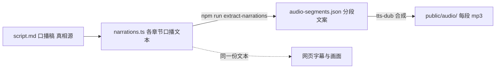
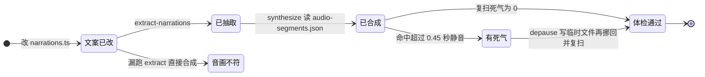

# 第 3 课 配音链与真相源，一条真相源向下的派生流水线

> 代码仓库：<https://git.aicodex.cc/devlist/douyin-media>
> 对应分支：`03-tts-dubbing`

第 2 课结束时，网页已经能从头点到尾，每次点击推进口播稿的一拍。但它还是默片，录屏出来没法看。

本课的判断只有一句。**配音链是一条真相源向下的派生流水线，坑都长在派生层没跟着真相源重生成，和拿退出码当验收这两处。** 配音听起来简单，把文字送进 TTS 出 mp3 就完了，真做起来它是模块一坑最密的一段。本仓在这里付过完整学费，改了文案忘了重抽，成片画面是新钩子、声音是旧钩子，连过两轮检查都没抓到；一段十八个字的配音被引号触发出一秒死寂；批量去停顿的命令静默失败，十七段一段没处理，退出码却是 0。每个坑产出一条要照做的规矩，这一课边做边把它们钉进流程。

任务是给第 2 课的网页配齐全部分段音频。做完后达到四个状态，每段 mp3 生成且落位正确，至少亲手处理过一个多音字，死气复扫数字为零，不看笔记能说出这条链路的真相源是谁、改了稿子要补做哪三步。

进配音链之前，先在仓库根目录把这一课要用的两个 skill 复制进当前分支。它们不在你现在的分支上，用 git checkout 从课程仓 main 分支摘，不换分支。

```bash
git checkout main -- .claude/skills/tts-dub        # 这条命令把课程仓 main 上的 tts-dub 摘进你当前分支
git checkout main -- .claude/skills/dubbing-check  # 这条命令把课程仓 main 上的 dubbing-check 摘进你当前分支
```

两个 skill 都住仓库根的 `.claude/skills/` 下。本课的合成、检查命令都在第 2 课建的 presentation 目录里跑，skill 在上层的仓库根，所以命令里用 `../.claude/skills/` 指过去，`..` 就是上一级目录。

## 一、给时间线配上声音

先给本课产物定位。它是一组按章节和步骤命名的 mp3，落在网页项目 public/audio/ 下。第 4 课录屏时，它们被自动混流进成片。网页定节奏，音频填内容，两者按同一份分段文案对齐，这份文案是谁、从哪来，就是本课的主线。

先把这条链路画清楚，本课所有纪律都从这张图出发。



图上要记住一件事。**合成程序只认 audio-segments.json，它认不出你三分钟前改过 narrations.ts。上游是真相源，下游全是派生件，任何一层改了，它右边每一层都要重新生成。** 这句话现在像常识，第六节给你看违反它的完整代价。


## 二、从网页里抽出分段文案

分段文案不靠手写，它从网页源码里抽出来，抽的这一步就是全链的第一个真相源检查点。在 presentation 目录跑，第 2 课结束你就停在这里，本课后续的命令都在这个目录里跑，不再特意说明。

```bash
npm run extract-narrations   # 扫所有章节的 narrations.ts，产出 audio-segments.json
cat audio-segments.json | head -20   # 每段一条，含 chapter、step、text、audio
# 验收：stderr 打 extracted N segments from M chapters，head 能逐段对回 narrations.ts
```

这个命令做一件事，扫 src/chapters/ 下每个章节的 narrations.ts，按 chapters.ts 注册顺序摊平成一条段清单，写进 audio-segments.json。step 从 1 起编号，空字符串段自动跳过，无声过场不烧 token。它读的是源码里的文案，产出的是一个中间文件。

出完清单别急着合成。这里要立本课反复用到的一个姿势，叫两段式。第一段，让 AI 把段清单摊给你看，按章节列出段数和每段首句。第二段，你逐段对照 narrations.ts 确认切分和文本都对，这就是人审边界，你点头之前它不许碰合成。两段之间必须停住。第四节探余额、第六节做合成后校验，都是同一个闸在不同位置重装。

这一步 AI 会怎么错，直接读完 narrations.ts 就开合，不出清单给你看，等你发现问题时已经烧掉几十段的钱。

## 三、配置你的声音

配音引擎用你刚复制的 tts-dub skill，它读一份配置加一份分段文案，逐段合成。先把设计讲清，再给派工契约。

命令清单。tts-dub 对外就一个主命令加几个开关。`synthesize.mjs` 读 config 和 segments 两份文件，逐段调供应商出 mp3，落到 `<outDir>/<chapter>/<step>.mp3`，改的是 public/audio/ 下音频文件这一处账。`--force` 全量重合成，默认跳过已存在的 mp3。`--only chapter/step` 只补指定段。`list-voices.mjs` 列账户里的克隆音色，按时间排序，标出最新一条。

怎么设计。合成器外挂成独立 skill，不用网页骨架自带的合成脚本，两个方案的取舍摆在这里。方案 A 是直接用骨架自带的 `npm run synthesize-audio`，好处是一套脚手架全包、零额外文件，代价是它走 mmx CLI，而 CLI 的 `--pronunciation` 参数把多音字注音拼成字符串、供应商 API 要数组，多音字校正直接失效，这一层坏了你修不动，只能绕。方案 B 是外挂 tts-dub，直调供应商的 T2A HTTP 接口，绕开坏掉的 CLI，把多音字逐段注音、念法规整、批量重试都握在自己手里，代价是多一个 skill 要维护，换供应商时改一个 provider 文件即可。本仓选了 B。选它的原因是多音字和念法控制是中文口播的刚需，挂在 CLI 上等于把命脉交给一个修不动的坏轮子。要接受的代价是组件边界多一条，网页骨架管文案和画面，tts-dub 管声音。

技术栈。合成层直调供应商 HTTP，用的是 Node 原生 fetch 加 fs，没有第三方音频库。为什么不用音频库，因为合成器自己不处理音频，只做读 JSON、调 HTTP、写文件三件事，音频处理全交给下游 ffmpeg，第五节讲。供应商选 MiniMax 还是换免费引擎，按第 0 课的依赖选择来。MiniMax 音质好但付费，中文多音字可精确控制，支持逐段发音、音高、语速；不想付费换 edge-tts 一类，代价是多音字只能靠改文本绕，精度打折。tts-dub 的 provider 层就是为可换供应商设计的，一个 provider 一个文件。

配置本身先复制模板。先把账号级配置模板复制进项目。

```bash
git checkout main -- brain/tts.config.json   # 这条命令把课程仓 main 上的账号级配置模板摘进你当前分支，不换分支，git 从子目录跑路径也按仓库根算
cp ../brain/tts.config.json tts.config.json   # 从仓库根复制成当前 presentation 根的 tts.config.json（音色、语速、多音字覆盖都在这）
# 验收：presentation 根出现 tts.config.json，四个字段 voice_id、speed、pitch、overrides 齐全
```

配置里四个字段现在就要认识。voice_id 是音色 id，speed 是全局语速，pitch 是全局音高，overrides 按段号覆盖单段的读音或语速，第五节处理多音字全靠它。有一件事提前说明，tts.config.json 里带着你的 API key 或音色资产，属于第 0 课讲过的安全红线，进 git 的只能是去了密钥的模板。

账号与密钥先备好。API key 是供应商发给你的一串密钥，程序拿它调用付费接口，谁拿到谁就能替你花钱。去哪申请，MiniMax 官方开放平台注册账号，建一个应用，拿到 API key。不想付费就用免费替代 edge-tts，它是微软的文本转语音，不需要密钥，但 tts-dub 当前内置 provider 只有 MiniMax 和 OpenAI，换 edge-tts 得改 provider 层。两条路的具体接入都以 tts-dub skill 的 SKILL.md 为准。

核心流程。synthesize 从 json 到 mp3 这条路径，你要能不看代码口述下来，后面验收全靠它。

1. 读两份输入。JSON.parse 读 tts.config.json 和 audio-segments.json，读不到或格式错在这一步就抛错退出，这是第一处校验。
2. 定落点。outDir 取 config.outDir，模板里是 public/audio，每段输出路径是 `<outDir>/<chapter>/<step>.mp3`。
3. 遍历每段算 id。第一处翻转在这，`existsSync(out) && !force` 就 skip，打 `[skip] id` 不重新合成。这是断点续合，也是旧文件不删就装作干完的根源。
4. 算参数。overrides 按段覆盖，speed 取 override 优先、全局兜底；normalize 只改配音文本，不碰字幕源。
5. 调供应商。provider.synthesize 内部带三次指数退避重试，防串行限流。
6. 收口。递归建目录、写 mp3 文件、打 `[ok] id (size KB)`；抛错则 fail 加一，打 `[FAIL] id` 加原因。
7. 全段跑完再收一次口。打 `done N synthesized S skipped F failed`，`process.exit(fail ? 2 : 0)`。

记住最后这行的语义，2 表示有失败段，0 表示没有失败段，但 0 不保证每段都合成了，跳过的段也贡献 0。第八节告诉你这个语义差了多少事。

```bash
node ../.claude/skills/tts-dub/scripts/synthesize.mjs --config tts.config.json --segments audio-segments.json
ls public/audio/   # 按章节分目录，每步一个 mp3
# 验收：stderr 收口行 F failed 为 0，ls 的 mp3 数与 audio-segments.json 段数一致
```

这条路径里的状态翻转，用一张图收束。



段只有走到体检通过才算数。漏跑 extract 会掉进音画不符，去完停顿不复扫会带着有死气出厂。第五节和第六节把这两条岔路各自讲透。

## 四、批量合成之前，先探一下余额

第三节那条全量合成命令，先别急着跑。直接全量有个隐患，付费 TTS 的余额可能在第 40 段耗尽，前 39 段的钱花了，任务卡在半截。本仓的做法是先拿一段试。

```bash
# 用只含第一段的 segments 文件跑一次，确认服务正常再全量
node ../.claude/skills/tts-dub/scripts/synthesize.mjs --config tts.config.json --segments test-one.json
# 验收：第一段出 mp3 且非 0 字节，stderr 无 [FAIL]，才许进全量
```

这个习惯的出处是 lessons.md 的 L9。某天 MiniMax 余额耗尽返回错误码 1008，流水线卡死在配音环节。之后立的规矩是，探测到余额尽就停在明确状态并通知人充值，既不硬跑也不装作没事。

外部依赖会在任何时刻断供，无人系统面对这件事只许一种姿势。先尽早探测，把断供发现在它造成浪费之前，别等跑到第 40 段才发现。真探到了就停在明确的挂起状态，把任务标成就差配音，不硬跑也不装成没事。停稳之后必须把人喊醒，推到飞书，只写本地日志等于没人看得见。三步顺序不能乱，缺一步，前面省下的钱会加倍赔进去。模块三讲上报机制时会回到这里。

这一步 AI 会怎么错，跳过单段探测直接全量，或者探测失败后把 1008 当成换段文案重试继续硬跑，把余额打穿。

## 五、多音字与死气，TTS 的两类典型病

全量合成完，先别听一遍就完事，两类病要主动查，都查脚本不靠耳朵。

### 5.1 多音字

TTS 读中文最常见的错误。本仓真实案例 L10，一句“各十几行”的“行”被读成 xíng，质检打回重合成。修法是在 tts.config.json 的 overrides 里按段注音，只影响配音输入，字幕仍显示原字。

先认一个路径。你现在就在 presentation 目录里，check 命令末尾的 `.` 就代表当前目录，不用敲绝对路径。想知道当前目录的绝对路径，敲 `pwd` 看一眼。

```bash
node ../.claude/skills/dubbing-check/scripts/check-pronunciation.mjs .
# 验收：风险点逐条列出，且没有任一段同时含两种读音；有就进 overrides 注音或改文案
```

两个边界提前说清，都来自真实返工。同一段里同一个字要读两个音，L17 的案例，“就得打折”的 děi 和“诚实得多”的轻声 de 同段，注音救不了，因为逐段注音只能解同字在不同段不同读，解不了同段两读。出路是改文案绕开冲突，并且 script.md、narrations.ts、组件三处同步改。另外，增删段之后段号会移位，overrides 里按旧段号写的注音会注到错的段上，L18，改动段数后必须重排键名再重新 extract。

这一步 AI 会怎么错，把 pronunciation 设成全局字替换，“执行”和“N 行”并存时全局“行”注成 háng，把“执行”也读错。判据就一句，确认全片没有任一段同时含两种读音，才许用按段注音。

### 5.2 死气

死气指段内超过 0.45 秒的非句读静音，引号、破折号、拟声词都可能触发，听感是句子中间突然断气。L3 的真实案例，EP02 开头一个十八字的段撑了 6.78 秒，含一秒死气。用 dubbing-check 的脚本扫。

```bash
node ../.claude/skills/dubbing-check/scripts/check-silence.mjs .
# 验收：stderr 打 无 0.45s 以上内部死气；有则逐段列出位置和时长，exit 1
```

命中的段用去停顿脚本处理，这里有一个坑必须提前说明。L16 的事故里，去停顿命令把输出写回输入同一个文件，ffmpeg 打开输出的瞬间截断了输入，十七段全部静默失败，命令一声没吭，退出码全是 0。规矩由此而来，输出先写临时文件再挪回去，跑完必须重扫验证数字归零。

```bash
node rec/depause.mjs <段>.mp3 <段>.tmp.mp3 0.25 -38 0.30 0.45 && mv <段>.tmp.mp3 <段>.mp3
node ../.claude/skills/dubbing-check/scripts/check-silence.mjs .   # 复扫，超限死气应为 0
# 验收：复扫打 无 0.45s 以上内部死气，ls 确认 .tmp 已挪回、无残留
```

depause 的参数你不用调。段内静音超过 0.45 秒会被压到 0.25 秒，-38 是静音判定线，其余参数 AI 处理。L16 那次失败，就是这套规则根本没生效，因为 ffmpeg 先把自己要读的输入文件清空了。

技术栈。为什么静音检测交给 ffmpeg。ffmpeg 是音视频处理的事实标准，静音检测这件事自己写要处理采样率、声道、分帧、阈值、首尾剔除五件事，ffmpeg 一个 silencedetect 滤镜全包了，边界情况它都替你踩过。它挡的坑就是不要自己写音频 DSP。代价两条，滤镜链语法晦涩，`-af silencedetect=noise=-38dB:d=0.3` 这类参数不看文档记不住；还有它打开输出文件立即截断这个行为，L16 的静默失败正源于此，所以规矩是输出永远先写临时文件。ffprobe 是它的同门，读时长、读媒体信息，check-silence 里用它拿每段实测秒数。


## 六、一次音画不符事故

现在讲本课最重要的纪律，用本仓最贵的一次学费讲。

L2 的事故经过是这样。制作 EP02 时改了开头的口播文案，narrations.ts 更新了，但没有重跑 extract-narrations，audio-segments.json 里躺着旧文案。合成程序照着旧文案出音频，网页画面和字幕用新文案。成片效果，观众看到新钩子，听到旧钩子。更麻烦的在后面，这个问题连过两轮检查都没被抓到，因为检查方式是对组件截图，截图只能证明画面对，证明不了声音对。

事故换来两条规矩。第一条管制作，改过任何口播文案，必须重跑 extract，删掉改动段的旧 mp3，再重新合成，三步一步不能省。合成脚本按文件名跳过已存在的 mp3，旧文件不删它就装作干完了。第二条管检查，**验收对象必须是最终产物，半成品的检查通过说明不了成品**，这条第 4 课的终检闸会接走。

```bash
npm run extract-narrations
rm public/audio/<chapter>/<step>.mp3   # 删改动段，否则按文件名被 skip
node ../.claude/skills/tts-dub/scripts/synthesize.mjs --config tts.config.json --segments audio-segments.json
node ../.claude/skills/dubbing-check/scripts/check-source-sync.mjs .
# 验收：check-source-sync 打 全部 N 段 audio-segments == narrations
```


把第二节那张图再看一遍。这条链路上每个文件都有明确上下游，出问题时先问一句哪一层是真相源、它右边的派生件重新生成了没有，多数疑难杂症在这一问里现形。模块二讲状态账本时，你会再见到同一个结构，一个真相源加一批从它派生出来的视图，改真相源要重生成所有派生件，那时它不叫文案，叫状态。

## 七、轮子坏了怎么办

轮子坏了不要急着自己造，先看能不能绕一层。一个小插曲值得单独说。web-video-presentation 自带音频合成脚本，本可以直接用，但它调用的命令行工具在课程仓的实践中坏了。处理方式值得学，绕开坏掉的一层，直接调它底下的 HTTP 接口，其余部分照旧复用，这就是 tts-dub 的由来。第三节里那个方案 B，选它的完整理由在这里收口。

由此把课程的轮子观补全成四级，直接用，坏了换胎，接口对不上就包一层，都不行才自建。每升一级成本翻一番，所以每升一级都要说得出理由。本课停在第二级。第 7 课的发布环节会到第三级，为什么给能用的开源工具再包一层，到时候讲。

## 八、别拿退出码当验收

本课加油站只有一句话，但它是后面一切自动化的地基。

先把地基立起来：命令跑完会返回一个数字，叫退出码，0 表示成功、非 0 表示出错，终端一般不显示但脚本能读到。

L16 那次静默失败，十七段一段没处理，每条命令都体面地退出了。如果验收标准是命令没报错，这批废品就出厂了。拦住它的标准是复扫数字为零，一个跟结果直接对话的判据。给 AI 派活同理，**验收要写成检查产物的具体指标，别写成跑完没报错**。第 4 课的质检 subagent，整个就是这句话的机器化。

## 九、把整条配音链写成派工契约

现在每一环你都懂了，把整条链写成一段可以丢给 AI 的自然语言契约。这份契约不填表也不摘要，每一步都给编号、约束、输出格式，AI 照着走完就是一条体检通过的配音链。

```text
你在 presentation 目录工作，用你刚复制的 tts-dub 和 dubbing-check 两个 skill，不要自己发明音频处理。

第 1 步 抽分段文案。跑 npm run extract-narrations，扫所有章节的 narrations.ts 产出 audio-segments.json。约束：只读 narrations.ts，不去改它。输出：stderr 报 extracted N segments from M chapters。

第 2 步 出段清单给人审。把 audio-segments.json 按章节列出段数与每段首句，停在这里等我确认切分和文本都对。约束：我确认之前不许合成，不许烧 token。输出：逐段清单，我能对照 narrations.ts 核对。

第 3 步 备配置。把 brain/tts.config.json 模板复制进项目根，跑 list-voices.mjs 列账户克隆音色，按时间取最新那条填进 voice_id。约束：配置里不许出现真实 API key，进 git 的只能是去了密钥的模板。输出：tts.config.json，含 voice_id、speed、pitch，overrides 留空。

第 4 步 单段试合成。用只含第一段的 segments 文件跑 synthesize，确认供应商可用。约束：这步不许跳过，直接全量合成的结果作废。输出：第一段 mp3 非 0 字节，stderr 无 [FAIL]。

第 5 步 全量合成。跑 synthesize，带 config 和 segments 两份参数。约束：默认跳过已存在 mp3，这是断点续合；哪段要重合成，先删那段旧 mp3 再跑。输出：stderr 收口行 done 之后 F failed 必须是 0。

第 6 步 真相源同步。跑 check-source-sync.mjs，验 audio-segments.json 每段文本等于对应 narrations.ts。约束：改过文案没重抽会在这步现形，不一致要回第 1 步。输出：全部 N 段 audio-segments == narrations，不一致则列出具体段和两侧文本。

第 7 步 完整性。跑 check-completeness.mjs，验每段 mp3 存在、非 0 字节、时长大于 0、段数与清单一致。约束：漏合成或旧音色残留都算 FAIL。输出：全部段通过，无缺失段。

第 8 步 多音字。跑 check-pronunciation.mjs 扫风险点。约束：确认全片没有任一段同时含两种读音，才许用按段注音；同段两读只能改文案，注音解决不了同段两读。输出：风险点清单，每处标处置方式。

第 9 步 语速离群。跑 check-pace.mjs 标过快过慢的段。约束：算的是剔除停顿后的纯发音语速，含英文词的段偏慢是统计假象，别误提速。输出：离群段清单，偏快拆句，偏慢提 speed。

第 10 步 死气扫描。跑 check-silence.mjs 列段内超 0.45 秒的静音。约束：这是客观问题，不因英文密集豁免。输出：无 0.45s 以上内部死气，或逐段列出位置和时长。

第 11 步 去停顿。对命中的段跑 depause，输出先写 .tmp 再 mv 回原文件。约束：绝不许输出写回输入同一个文件，ffmpeg 会先截断输入，静默失败。参数固定 0.25 -38 0.30 0.45。输出：每段处理完生成新 mp3，无 .tmp 残留。

第 12 步 复扫归零。再跑一次 check-silence.mjs。约束：不去停顿直接复扫的结果作废，复扫不为 0 就回第 11 步。输出：无 0.45s 以上内部死气，exit 0。

验收标准整体一句话，第 6 到第 12 步每步的通过输出都出现，且第 5 步失败数为 0，才算整条链干完。任何一步只有命令没报错、没有通过输出，都按没干成处理，回退到该步重来。
```

三个判断带走。合成只认 audio-segments.json，改上游必须重生成下游；输出写临时文件再挪回，跑完复扫验数；外部依赖先探测再批量，探测到断供就停在挂起状态并推人。

下一课是模块一的收官。你会派出自己的第一个质检 subagent 审这批音频，然后无人录屏出成片、生成封面、过终检闸，第一条完整的口播视频就在你手里了。
