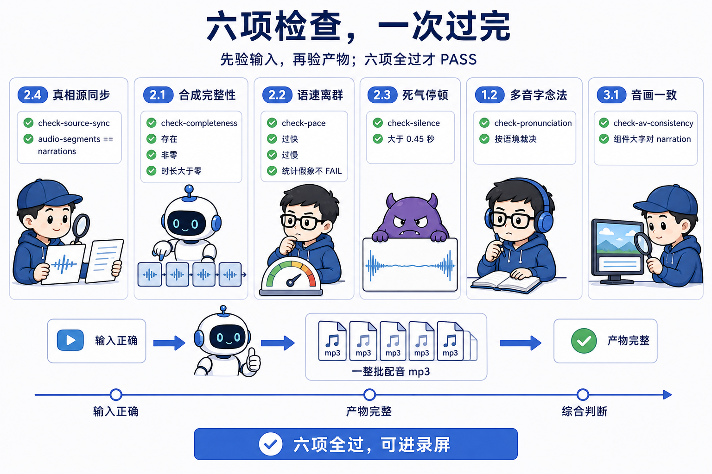
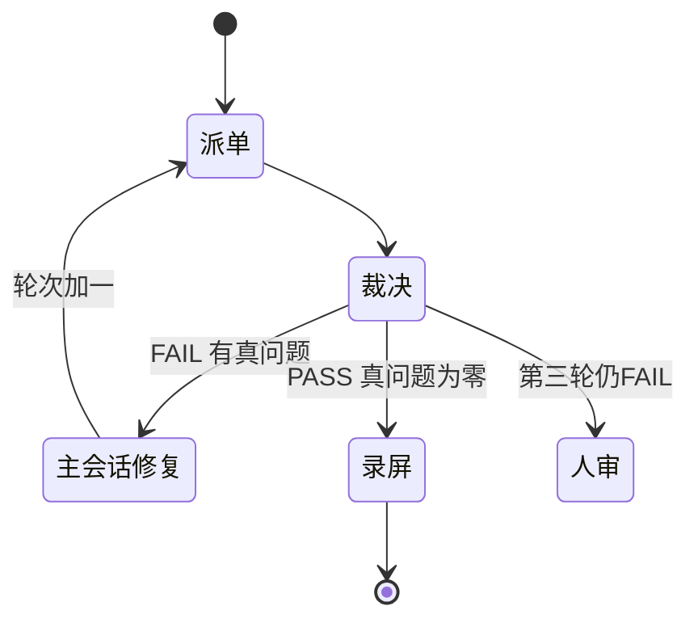
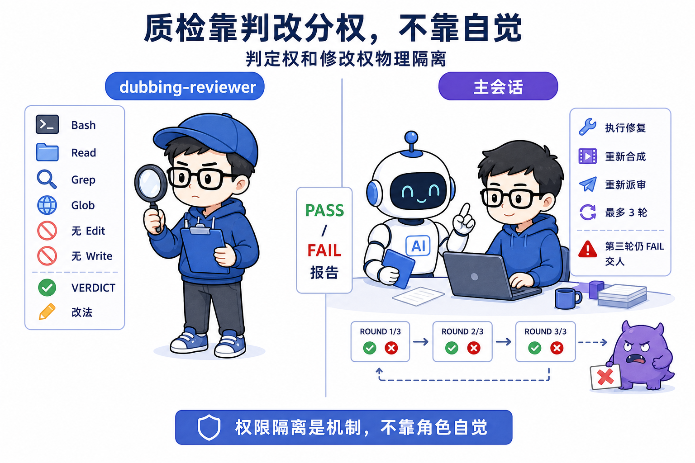
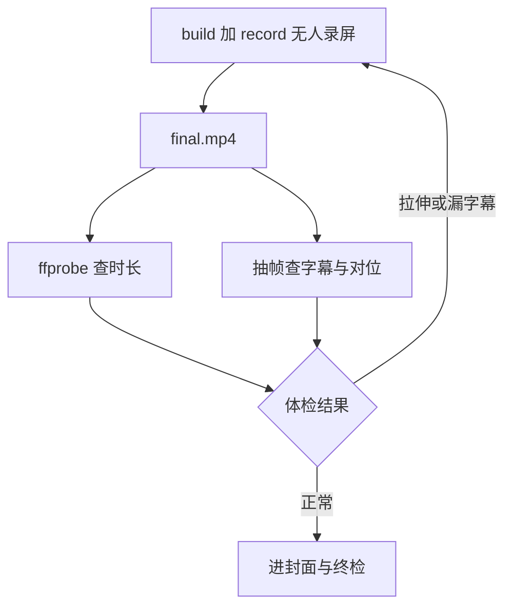
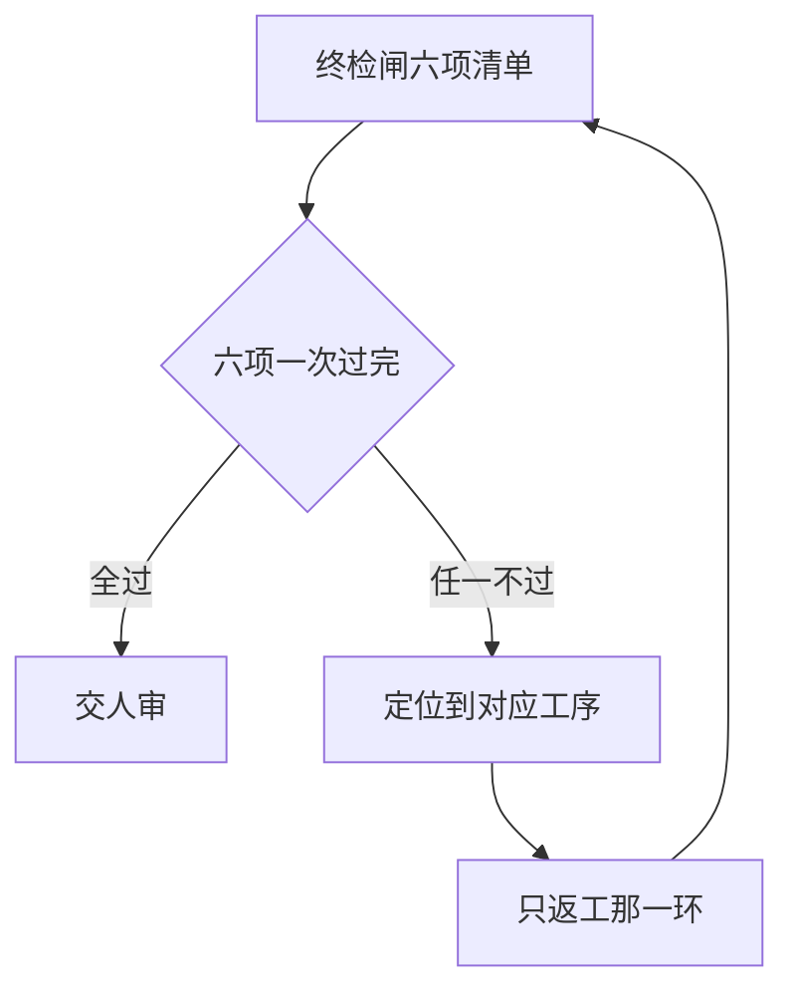

# 第 4 课 质检闸口与成片，第一次派 Subagent

> 代码仓库：<https://git.aicodex.cc/devlist/douyin-media>
> 对应分支：`04-review-gate`

这一课立的判断是，**质检靠判改分权，不靠自觉**。判定权给一个独立角色，修复权留在主会话，两个角色物理隔离。检查提前打包一次过完，不让问题在返工里逐轮冒出来。循环限定轮次，走不完就升级到人。后面每一节都在落实这三条。

第 3 课结束时，你手里有一整批合成好的音频，多音字处理过，死气复扫归零。素材全齐了，网页管画面，音频管声音，接下来录屏混流就能出成片。但先停一下。死气和段数这类客观指标你查过了，语速是否拖沓、读音在语境里对不对、音频文案和画面大字是否一致，这些要综合判断的事还没人查。你自己刚做完这批音频，让你自己来查，人会天然偏向放行自己的工作，质检行业里叫既当运动员又当裁判。上一课结尾说过，机器可验的判据要交给一个独立角色，现在就落地。

这一课是模块一的收官。任务是四件事，派出你的第一个质检 subagent 审配音批次，无人录屏出成片并做录后体检，生成竖版封面，最后过一遍终检闸。做完后你手里有一条完整的口播视频，模块一的里程碑就算立住了。

## 一、最后一公里

本课的三个环节有严格顺序。质检在录屏之前，因为配音返工要重新混流，录完再发现问题等于白录。封面在最后且独立，它是发布物料，压根不进成片，改封面永远不用重录。

顺序本身就是判改分权的延伸。质检先跑，等于让独立角色在你把音频焊进成片之前先卡一道。焊进去之后发现问题，返工成本就翻倍。封面独立在成片之外，改封面不动成片，两道工序互不拖累。

从成本这头再读一遍顺序。录屏这一步把音频和画面钉成一条时间线，产出的 final.mp4 是半成品之上第一件完整产物。一旦钉死，改任何一段音频都要重新混流。所以质检放在钉死之前，是给改错留出便宜的位置。

## 二、请进第一位质检员

课程仓里有一个现成的质检员定义，先摘进你的仓再看它长什么样。缺文件从 main 分支摘，摘的命令是 `git checkout main -- 路径`，第 1 课讲过，它把 main 上指定路径的文件复制进你当前分支，不换分支。

```bash
git checkout main -- .claude/agents/dubbing-reviewer.md
head -8 .claude/agents/dubbing-reviewer.md
```

验收看两处。头部 name、description、tools 三行都出来，tools 那一行只有 Bash、Read、Grep、Glob 四个，没有 Edit，没有 Write。

```yaml
# .claude/agents/dubbing-reviewer.md（节选）
name: dubbing-reviewer
description: 口播视频配音批次的质检判官……只判不改（无 Edit/Write）……最多 3 轮。
tools: Bash, Read, Grep, Glob
```

subagent 的定义就是一个 markdown 文件。头部声明名字、职责、工具权限，正文写工作流程。注意 tools 那一行，它拿到的工具只有跑命令、读文件、搜索，没有 Edit 和 Write。这个质检员在物理上改不了任何东西，发现问题只能报告。权限故意配残，是本课深挖的主题。上面那条 checkout 已经把它复制进你的仓。

用 `ls .claude/agents/` 确认文件在。之后派单时，Claude 才认得这个角色名。

它的正文规定了六个检查点，每个都配了 dubbing-check 里的现成脚本。这张表是它的工作底稿，出处都在课程仓的 `.claude/skills/dubbing-check/` 下。

| 检查点 | 脚本 | 验什么 |
| --- | --- | --- |
| 2.4 真相源同步 | check-source-sync.mjs | audio-segments.json 与 narrations.ts 文本一致 |
| 2.1 合成完整性 | check-completeness.mjs | 每段 mp3 存在、非零字节、时长大于零、段数对得上 |
| 2.2 语速离群 | check-pace.mjs | 剔停顿后的纯发音语速，标过快过慢 |
| 2.3 死气停顿 | check-silence.mjs | 段内大于 0.45 秒的非句读静音 |
| 1.2 多音字念法 | check-pronunciation.mjs | 列风险字，看语境判读错没读错 |
| 3.1 音画一致 | check-av-consistency.mjs | 组件硬编码整句与 narration 对不上 |



六条里两条是硬门槛，真相源同步和合成完整性，脚本 exit 1 直接 FAIL。其余四条要 reviewer 看输出下裁决，脚本只列候选，不替它判。

检查点 2.4 被放在第一位，有它的道理。后面五条全部拿 audio-segments.json 当输入，真相源一旦和 narrations.ts 对不上，后面查出来的语速、死气、多音字全是在查一份旧文案，查得再细也没意义。所以先验输入，再验产物。

## 三、PASS 还是 FAIL，第一轮质检循环

在主会话里派单。这段原样贴，第一轮的派单就长这样。第一行那个工程目录，填你第 2 课网页项目的构建输出目录，从课程仓根目录看是 `presentation/build`，在 presentation/ 目录里敲 pwd 能看到它的绝对路径。

```plain
派 dubbing-reviewer 审配音批次，工程目录 presentation/build，当前轮次 1。

你只有 Bash、Read、Grep、Glob 四个工具，没有 Edit 和 Write。先读 .claude/skills/dubbing-check/SKILL.md，吃透真假离群和多音字动态注音两条认知，再逐项跑六个检查点。顺序是 2.4 真相源同步、2.1 合成完整性、2.2 语速离群、2.3 死气、1.2 多音字、3.1 音画一致。

裁决口径三条。硬门槛不一致或缺段零字节，直接 FAIL。统计假象不 FAIL。真问题逐条给可直接执行的改法。

输出按固定结构回。VERDICT 一行写 PASS 或 FAIL。ROUND 写当前轮次。FAIL 时列 BLOCKING，每条写检查点、位置、问题、改法。NON-BLOCKING 写建议。SUMMARY 一句话结论。
```

它跑完会回一份固定结构的裁决。

```plain
VERDICT: PASS
ROUND: 1/3
BLOCKING:
NON-BLOCKING:
SUMMARY: 六项全过，可进录屏
```

FAIL 时 BLOCKING 逐条列问题和可直接执行的改法，比如某段在 overrides 加注音、某句文案把数字改成汉字念法。

接下来的循环有明确分工。FAIL 的话，改法由你在主会话执行，该改文案改文案、该重合成重合成，第 3 课的三步纪律别忘了。改完再派它复审，派单时轮次加一。上限三轮，第三轮还是 FAIL 就停下来交给人裁决，说明问题超出了自动循环能收敛的范围。三轮不是随便定的。FAIL 的代价是整条第 3 课链路重走一遍，改文案、重合成、复扫，每一步都花钱。三轮足够覆盖单点问题，超过三轮还收不拢，问题多半不在单点，交给人的效率更高。

这个循环长这样。



派单这一环 AI 最容易出错的地方，是 reviewer 只验抛出不验行为。它跑 check 脚本，只看 exit code 和有没有报错，不读输出的具体内容，把脚本跑通了当成检查通过了。真相源同步这种脚本，输出里写的是哪几段不一致，它若不读，就漏掉脚本明确列出来但没抛错的问题。所以派单里写死一句，逐项跑完读输出下裁决，别只报跑没跑通。

它的裁决口径里有一个细节值得看。语速检查会把含英文术语的段标成偏慢，因为 query.ts 这类词念起来天然费时，这属于统计假象，它按规程不 FAIL。质检员的价值一半在查出真问题，另一半在不把假问题当真问题，每一次误判的 FAIL 都消耗你一轮完整返工。

判改分权在这张图里第一次跑起来。reviewer 只出裁决和改法，主会话执行修复，两个角色之间没有含糊地带。



## 四、无人录屏与录后体检

质检 PASS 后录屏。

```bash
npm run build && npm run record -- --serve --out final.mp4
```

验收句，命令跑完 final.mp4 出现在项目根目录，大小非零，时长和预期时间线的误差在 ±1 秒内算过。

第 2 课埋的伏笔在这里兑现，点击驱动的确定性时间线让机器可以代替人录屏。三个技术选择撑着这件事，逐个说。

headless 浏览器是 Playwright 驱动的 Chromium。它按 audio-segments.json 的每段时长，逐 step 按方向键推进，每步停留等于该段时长加 buffer，全程零人工。选它是因为录屏要的是确定性，不是有人盯着。人手录屏时机不稳，没人守的录屏才有可复现的时间线。它挡掉的坑是手工录屏加后期对轨，那条路每一步都靠人，一步都不能自动化。代价是重动画下 Chromium 抓帧跟不上实时，画面和音频会错位，所以录完必须校准时长。校准 AI 会自动做，按音频真实时长把画面拉回正确位置，你只需要录后抽帧验对位。这步不做，成片尾部会滞后一步，抽帧一验就露馅。

ffprobe 负责读每段 mp3 的真实时长。时间线不用估算的字数，用实测的音频秒数，画面和音频才能共用一条 per-step 时间线，天然同步。代价是它随 ffmpeg 一起装，多一个工具链依赖，换来的时长数字可信。

npm run record 是一条命令出片的收口。--serve 让它自起 vite preview，录完自动关，省掉手动起 dev 再手动关。它内部就是 headless 录画面，ffmpeg 把各段 mp3 拼成音轨，再合成 mp4。

但录出来先别庆祝，有一个真实的坑等着（L15，pipeline/lessons.md）。录屏脚本默认打开的网址不带字幕参数，--serve 又会覆盖 --url，某集成片因此整条没字幕，直到抽帧对照上一集才发现。所以录后体检是固定动作，录屏前先确认脚本的 URL 带了 ?subs=1。

```bash
ffprobe final.mp4 2>&1 | grep Duration
```

验收句，输出的 Duration 与 audio-segments.json 各段时长之和加 buffer 的误差在 ±1 秒内算过，偏差超过 1 秒说明画面被拉伸。

```bash
ffmpeg -ss 3 -i final.mp4 -frames:v 1 -update 1 out.png
```

验收句，抽出的帧里字幕已烧入，画面 step 与该时刻口播对应。ffmpeg 8.x 抽单帧必须加 -update 1，否则不落图。

录后体检的对象是 final.mp4 本身。上一课的教训在这里复用，半成品的检查证明不了成品，网页能点、音频能放，都不代表混流后的成片没问题。

这段体检长这样。



体检这一环 AI 最容易出错的地方，是照着模板跑 npm run record，URL 不带 ?subs=1，整条成片没字幕，到抽帧才暴露。所以录屏前加一道确认，检查脚本导航的 URL 带没带字幕参数。判改分权在这里换了个说法，**验产物，不验 exit code**，命令没报错不代表成片没问题。

## 五、封面，独立的发布物料

抖音信息流里封面是竖版 9 比 16，横屏成片截帧充数会被两条黑边毁掉点击率。本仓在这上面有一条教训（L1，pipeline/lessons.md），里面记着两件事。早期让图像模型自由发挥，它凭空编了一只仓鼠吉祥物，和账号已有视觉毫无关系，被打回重做。也试过拿视频帧充数，同样被打回。

三条路摆开看。

截帧，拿成片某一帧当封面。省事，但成片是 16 比 9 横屏，塞进 9 比 16 的信息流要么留黑边，要么裁掉主体。黑边在信息流里最伤点击，这条路一开始就该排除。

图像模型自由发挥，给它一句生成封面的指令。模型没有你账号的视觉记忆，凭概率往外编，编出来的吉祥物和主页上一张图对不上，这是 L1 那次事故的现场。

独立生成加锁锚点，这条路是现行的。用手头任何文生图工具，给它三样东西，竖版比例、你账号的固定视觉元素（颜色、字体气质、吉祥物，第一条视频就是你的起点风格）、本集标题大字。生成后存进 assets 目录，提示词一并存档，下一条视频以此为锚，主页封面墙才会像同一个人的账号。这条路的代价是每次多走一步文生图，多存一份提示词。和重录成片相比，这步成本可以忽略。

派单就长这样，原样贴。

```plain
给本集成片生成竖版封面，比例 9 比 16。

风格锚点用上一集的封面做参考，锁定账号固定的视觉元素，颜色、字体气质、吉祥物。不要另起炉灶，吉祥物别画成别的东西。

封面上放本集标题大字，字号占画面高度约四分之一，标题文字原样照抄，不改词。

生成后存进项目 assets 目录，文件名带集数。把这次用的提示词原样存一份，下一条视频以此为锚。

一次出两张给我选，每张附一句它用了哪个锚点。
```

验收句，存下的图是竖版，不是成片帧，提示词文件在旁边。封面不进录屏，后面改封面不用碰成片。

封面这环 AI 最容易出错的地方，是它不听锁锚点这一条，自行发挥加新元素。所以派单里把不要另起炉灶写成约束，再让它在输出里交代用了哪个锚点，逼它对着锚点干活。判改分权在这里管的是，锚点由上一集定，本集只执行，不允许本集重新发明视觉。

## 六、终检闸，一次过完再交审

最后一道工序。本仓的规矩是六项检查一次过完，全部在最终成片上验。还有第七项发布物料，学到第 7 课才有发布环节，届时补上。

先出清单。

| 检查项 | 验什么 |
| --- | --- |
| A 声画一致 | 抽查钩子加两段，把听到的、看到的和字幕三处对上 |
| B 音频自然度 | 死气复扫为零，第 3 课已做，此处确认没因返工回潮 |
| C 钩子冷启动 | 第一句无上文自成立，第 2 课立的规矩，最后再验一遍 |
| D 事实与合规 | 技术结论在你的原文里站得住，无编造数据 |
| E 封面 | 竖版、非视频帧、锚点风格 |
| F 音画同步 | 成片时长与时间线误差在 ±1 秒内，抽帧对位 |

再划人审边界。D 事实与合规里，机器只核对成片说法和原文一致，结论真不真、能不能溯源，由人拍板，机器不替你判断。第七项发布物料本次不验，标待补。这条边界划清，机器才不会越权替人下判断。

最后逐项验。派单原样贴。

```plain
派你跑终检闸，对象是 final.mp4 和项目目录。

先出六项清单，逐项写清验什么，一项不许跳。清单出完停一下，划两条边界。第一条，D 事实与合规，机器只核对成片说法和原文一致，结论真假由人拍板。第二条，第七项发布物料本次不验，标待补。

再逐项验。A 声画一致抽查钩子加两段，把听到的、看到的和字幕三处对上。B 音频自然度死气复扫为零。C 钩子冷启动第一句无上文自成立。D 事实与合规在原文里站得住。E 封面竖版、非视频帧、锚点风格。F 音画同步时长与时间线误差在 ±1 秒内、抽帧对位。

输出每项一行，写检查项和通过还是不过，不过的定位到哪道工序返工。六项全过才算 PASS。
```

**检查前置打包，一遍过完再交审**，这条规矩是被返工逼出来的（L4，pipeline/lessons.md）。EP02 时期的做法是发现一个修一个。钩子出问题就重渲染，修完封面又冒出来，再修完死气又冒出来，每轮都重新渲染，个别问题过审后才暴露。检查前置打包，一遍过完再交审，总成本远低于反应式的逐轮修。

分流长这样。




终检这环 AI 最容易出错的地方，是派它跑六项，它只查了声画一致和封面两项就回 PASS，其余四项没验。所以派单里写死，一项不许跳，输出逐项给结论，用输出格式逼它验全。

## 七、质检员为什么不能自己动手改

回头拆第二节那个刻意配残的权限。让 reviewer 顺手把问题修了，这一步必须禁止。

理由有两条。第一条关于动机。判定和修复放在同一个角色身上，它会把该改的判成不用改，改起来省事的和必须改的之间，界线会往省事那边偏。它省自己的事，你丢的是质检的可信度。

第二条关于风险。质检时顺手改动会引入新变化，而新变化没有第二个人再检查。它改完自己说过了，这条改动就带着未验证的状态进了成片。

**判定权和修改权分开**，reviewer 的报告才可信，主会话的修复才有人把关。这是判改分权最直白的一段，前面每一节都在为它做注脚。这里配残权限是机制，不是信任。如果不砍 Edit 和 Write，只靠一句口头约定让 reviewer 别改，那这条约定和没有一样。权限砍掉之后，改不了这件事由工具保证，不由 reviewer 自觉保证。

三轮上限是这个设计的另一半。自动循环必须有出口，否则两个 AI 可以无限对改下去，而出口通向人。把整件事连起来，就是一套固定的分工。判定交给只判不改的角色，修复交给改了再送检的角色，中间限三轮，三轮走不完就升级到人。后面课程里这套做法会反复出现，飞书人审是它，治理线只产报告不自动改也是它，此处是你第一次亲手搭。

## 八、你已经有了一支最小 Agent Team

本课加油站讲拆分 agent 的判据。你现在的配置，主会话负责制作和修复，dubbing-reviewer 负责判定，这就是一支最小的 agent 团队。回想当初拆分的理由，都落在当前配置上。判定需要独立视角，所以单开一个角色。既然只判定不修复，写权限就砍掉。两个角色各自的活都完整，拆开之后各干各的，不互相等。

拆 agent 有三个判据。第一个看需不需要独立视角。第二个看权限要不要和主会话隔离。第三个看任务能不能并行，第 2 课的并行开发模式就是这一条。工作量大小恰恰在判据之外，纯粹为了分摊工作量把一个连贯任务切两半，接缝处的上下文交接会吃掉全部收益。

判改分权在这里上升成了一条通用原则。判定单开，因为它要独立视角。写权限砍掉，因为它只判定不修复。拆不拆不看工作量，看的是这三样。

## 九、几个判断带走

模块一到此收官，四个判断带走。

主判断，质检靠判改分权，不靠自觉。判定权和修复权分开，报告才可信。

支撑它的有三条。检查前置，六项一次过完再交审，总成本低于逐轮修。验产物不验 exit code，命令没报错不代表成片没问题。循环限轮次，三轮走不完就升级到人。

在收工前留一个问题。第一条做完了，等条目攒到十来条，哪条写完稿、哪条还卡在配音环节等着审，谁记得住。靠脑子记两条就乱，翻目录找更要命。模块二从这个问题开工，给你的内容上状态机。
