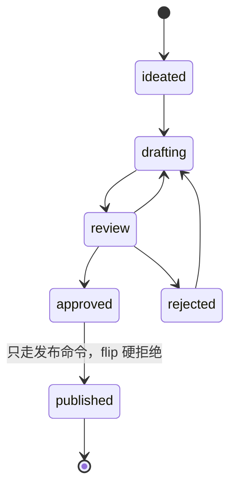

# 第 6 课 记账为什么要 CLI，用 SDD 让 AI 造出 media 命令

记账是确定性活，人写规格、AI 写实现、契约验收，人一行实现代码都不写。这是本课的全部结论，后面每一节给它补论据。

第 5 课立好了账本结构，meta.yaml 管细账、backlog.yaml 管粗账、dashboard 是投影。但账本立好，账未必记得对。一次状态翻转牵扯三处，meta 的 status 要改、timestamps 要补，赶上发布还要同步 backlog 和 dashboard，全靠记性。

第 1 课埋过一个伏笔，说这套系统从头到脚都是 CLI，还说你会先站在反面亲历一次。现在兑现。这一课先做一个注定失败的实验，让 AI 自觉记账，看它怎么漏，然后用这门课第一次完整的 SDD（规格驱动开发），让 AI 造出你自己的记账命令行工具，全程不看一行实现代码。

这一课的任务做完后，你应该达到四个状态。手里有一个自己的 media CLI，next、promote、flip、check 四个命令可用；非法的状态迁移会被它拒绝并报出合法出边；check 对你当前的仓跑出干净结果；能说出 promote 一条命令改了哪五处账。

## 一、先让 AI 自觉记账，看它怎么漏

先做一个不给工具的实验，证明记账这件事不能靠自觉。不给 AI 任何工具，只在对话里交代规则，然后连续派几轮活。

```plain
本仓状态记账规则：内容状态记在各自 meta.yaml 的 status 字段，
合法顺序是 ideated → drafting → review → approved → published；
翻状态时要同步补 timestamps 对应字段；
翻到 published 时还要把 backlog.yaml 对应条目置 published、
并更新 dashboard.md 的在制表。
现在把 <slug-A> 翻到 drafting。
```

第一轮多半没问题。接着换几个花样，隔一天新开对话再翻一条、一次翻两条、中途插一个别的任务再回来翻。这三个花样各打一个软肋。隔一天新开对话，上一段上下文里的规则没了；一次翻两条，批量操作里容易漏掉中间那条；中途插任务，注意力被别的活冲淡。翻完盘账，逐条对照 meta、backlog、dashboard 三处是否一致。

你大概率会等到这些结果，某一轮忘了补 timestamps；某一轮 dashboard 忘了更新；新开的对话里它把规则记岔，翻出一个规则外的状态值。课程仓在还没有 media 命令的时期就是这么记账的，backlog 漏翻发生过两次，都靠日常巡检事后补账，这个教训连同补账办法一起记进了 4-publish.md 的操作清单，至今还在。

这个实验要证的就一句话，把确定性活交给概率模型会漏。它漏的每一处，都是本课要收进代码的地方。

## 二、为什么它必然漏

漏账和模型聪明程度无关。换最强的模型来，漏账频率会降，不会归零，因为每次对话它都在凭对规则的转述重新发明一遍执行过程。三处账的路径、字段名、翻转顺序，每一次都重新组织，每一次都有概率在某处走样。规则没有落到任何文件里，只存在于上下文中。上下文一结束，规则就消失；上下文一长，规则又被别的任务冲淡。

把这件事放到第 0 课那句设计取向里看就清楚了，判断归 LLM，确定性归代码。哪条题先做、slug 起什么名、稿子好不好，这些是判断活，AI 干得比规则引擎好。三处账保持一致、状态只走合法边，这些是确定性活，正确答案唯一、步骤固定，交给概率模型执行等于每次掷骰子。确定性活的正确归宿是代码，写一次，之后每次执行都分毫不差。

以后遇到一件活，先问它答案是不是唯一。唯一就是确定活，进代码；不唯一就是判断活，留给人或 AI。这道界线是第 0 课那句设计取向给的一个可操作判据。所以要造一个记账 CLI。造之前先回答一个问题，代码谁来写。这门课的答案是你一行都不写，你只写规格。这就是人写规格、AI 写实现的由来。


## 三、先想清楚四个命令和一个技术栈，spec 才写得出来

写 spec 之前有一道更靠前的活，想清楚这个 CLI 长什么样。spec 只是把想清楚的东西写成契约，脑子里没有设计，spec 就只剩空话。这一步要定命令清单、几个设计取舍、技术栈，每一处取舍都要在两个方案里选过一轮再落笔。

先定形态，账务操作交给什么载体。这里有三个候选。第一个是 AI 直记账，第一节的实验已经把它证伪，规则只活在上下文里，每次对话重新发明，漏账是必然。第二个是纯脚本，一堆 .sh 或 .mjs 文件，跑一次记一次账，比 AI 直记账强，规则至少长在盘上，代价是没有统一的命令入口和参数约定，脚本之间各写各的，谁调用都得记住脚本名和参数位置，改一个字段要翻好几个脚本。第三个是 CLI，命令、参数、报错格式都收进一个入口，一个 help 就能自述全部能力。选 CLI，因为记账是人和 AI 高频共用的活，统一入口和统一报错本身就在降漏账概率。代价是首版要多花一点功夫搭命令框架，这笔开销一次性，后面每个新命令都摊薄。

命令清单跟着定下来，记账这件事就是四个动作，下面四个命令各管一件。

| 命令 | 输入 | 做什么 | 改哪几处账 |
| --- | --- | --- | --- |
| next | 无 | 模拟取题，告诉你下一个会取谁、为什么（next_up 钦点优先，否则按 score） | 只读，不翻账 |
| promote | 一个 slug | 把一条选题从池里提出来开工 | backlog idea 翻 picked、回填 content_path、清 next_up、建目录、写 meta，五处一次改齐 |
| flip | slug 加目标状态 | 翻一条内容的 status | 过迁移表校验，改 meta.status、补 timestamps、重建 dashboard 在制表 |
| check | 无，可选 --json | 扫全仓跑一致性规则 | 只读，输出 error 和 warn |

四个命令不多不少，正好覆盖记账的全生命周期，取题、开工、流转、体检四件事各有一个命令接住，多一个命令就多一处要维护的入口，少一个就有一处记账退回手工。注意 next 和 promote 的分工，next 只读预演，promote 才动账。这个先演后做的思想，你在第 7 课发布环节还会再见一次。别一上来就想抄全，课程仓的 media 后来长出了 publish-done、st、doctor、next-up，每一件都是踩过坑之后补的，第一版四个就够。


再定状态迁移规则怎么放。两个方案。一个是散写 if，每个命令里遇到翻状态就写 `if (from === 'review' && to === 'approved')`，第一版写得快，代价是规则散在各处，改一条边要全仓找 if，漏改一处就是非法边放行。一个是显式迁移表，一张数据结构列全所有合法边，所有合法性判定都查这张表，代价是首版要先定义表结构，多写一段数据。选迁移表，因为它是这张账的单一真相源，改规则改一处，flip 和 check 信的是同一张表。

最后定代码结构。两个方案。一个是单层，命令逻辑和领域规则写在一个文件里，首版最快，代价是规则和命令耦合，改规则要动命令，加命令要再读一遍规则，回归全靠人。一个是两层，领域逻辑（迁移表、一致性规则）单独一个包，命令壳一个包，命令只是薄薄一层转发，代价是首版要拆两个包，慢一点。选两层，规则只有一处定义，改规则不碰命令，命令想加就加。

技术栈跟着定。语言选 TypeScript，状态值要类型兜底。打个比方，类型系统像一道筛子，状态值写错在工具跑起来之前就被拦下，不用等跑的时候才发现错，代价是多写类型声明，样板代码变多。命令框架用 commander，声明式注册命令和选项，省掉手写参数解析，代价是多一个依赖。账本读写有个坑要提前躲开，多数 yaml 库的序列化会把注释重新排版，把账本头部的说明书冲掉，所以要么选能保注释的写法，要么自己写一段只改目标字段、不动其它字节的编辑逻辑。写路径必须保注释——YAML 的注释就是审计留痕，终检记录、取题说明、清扫留痕全在 status 行注释里，AI 若整篇重写等于抹账，验收看 git diff 只许目标字段。契约用例用 vitest 跑，快、零配置。

命令、栈、结构定了，spec 才有原料。人写规格的前提是脑子里有设计，这一步做的就是把"记账是确定性活"翻译成几个可以落进契约的选择。

## 四、写你的第一份 spec

spec 是唯一需要人写的代码，它把"记账是确定性活"翻译成 AI 能照着做的契约。SDD 的分工是人写规格、AI 写实现、契约用例验收。你的 spec 要覆盖三块。

第一块，状态合法值与迁移表。哪些状态存在、每个状态能翻去哪、哪条边需要附理由。课程仓的生产版把这张表写在 `tools/console/packages/core/src/state.ts` 里，节选给你看结构。

```typescript
// state.ts（节选）：迁移表就是一张显式的图，写命令的合法性判定全部经此
export const META_TRANSITIONS = {
  review: {
    drafting: { requiresReason: false },   // 打回重做
    approved: { requiresReason: false },
    rejected: { requiresReason: true },    // 拒绝必须留理由
  },
  // ...
}
```

你的第一版状态机不用照抄生产版，五六个状态够用。把它画成一张图，状态是节点，合法边是箭头，这张图就是你的迁移表，没画的边就是非法边。



图上没有 drafting 直接到 published 的箭头，所以 flip 把 drafting 翻 published 会被拒，并报出 drafting 的合法出边 review。图上 review 到 rejected 的边要求理由，这条边就是复盘的原料，规则层面强制留痕，这种细节就该在 spec 里想清楚。迁移表必须显式画全，图上没有的边一律不存在，这就是"迁移表显式"四个字落在纸上的样子。

再注意图上 approved 到 published 这条边标了「只走发布命令，flip 硬拒绝」。发布是三翻齐事务，backlog 要翻、dashboard 要重建，单翻 meta 必然造出双层不同步——第 5 课的历史账灾就是从这里来的。所以这条边要焊死在命令里，flip 拒绝直达 published，人想绕都绕不过；你第一版还没有发布命令，flip 的迁移表就不接 published 这条边，等第 7 课包好发布封装再走。

第二块，四个子命令的契约。每条写清输入、行为、输出、错误。

```markdown
## media next
- 只读：next_up 有钦点就报钦点，没有就按 score 取最高的一条
- 输出要取谁、为什么，不写任何文件
## media promote <slug>
- 读 backlog 里 <slug> 的条目，把 status 从 idea 翻成 picked
- 回填 content_path 指针、清 next_up 指针、建内容目录、写 meta.yaml 初值
- 五处改动一次落盘，不能只落其中几处
## media flip <slug> <目标状态>
- 读 <slug> 的 meta.yaml，按迁移表校验 当前状态 → 目标状态
- 非法迁移：报错退出，错误信息必须列出当前状态的全部合法出边
- 合法：改 status、补 timestamps 对应字段、重建 dashboard 在制表
## media check
- 全仓巡检：meta 状态值合法性、backlog 与 meta 双向指针一致、
  picked 条目必有 content_path……每条规则一个编号
- 输出分 error / warn 两级，支持 --json
```

第三块，报错要求。非法操作被拒时，错误信息要能直接指导下一步，报出合法出边就是最低标准。flip 把 drafting 翻 published 被拒时，报错里要出现 review 这个合法出边，人看了不用回头翻迁移表就知道下一步往哪走。工具的报错是给 AI 和人共读的，含糊的报错等于没报。

写 spec 前可以先读一遍生产版的迁移表找感觉，但别抄超出你需要的复杂度，课程仓的双层状态、publish-done 三翻齐事务，是它踩过账灾后长出来的，你的系统还没到那一步。

## 五、给 spec 补上机器契约：参数与错误契约

上一节写了行为契约，这节补机器契约。命令契约管「做什么」，参数契约管「参数怎么定义、怎么校验、报错长什么样」。不补这一层，AI 拿到 spec 时对这三件事全凭自由发挥，验收时你也没有判据。

先把参数形态分清楚。`media flip my-first-video review` 里 `my-first-video` 和 `review` 是位置参数，按先后位置取值；`--reason "打回理由"` 是选项，用名字取值，可有可无。每个写命令都挂三个全局选项：`--root <路径>` 指仓在哪，`--json` 把输出变机器可读，`--dry-run` 只演算不落盘。写者身份不进参数，走环境变量 `MEDIA_ACTOR`，不设就取系统用户名——为什么非要它？因为 audit 要记得出这笔账是飞书、console、定时 agent 里谁改的，写者归因是审计的生存前提，没有它账就没人认。

校验顺序固定，不散写 if。先查 status 是不是合法值，再查迁移表这条边存不存在，最后查这条边要不要理由。错误码集中定义：`E_BAD_ARG` 参数值非法、`E_ILLEGAL_TRANSITION` 非法迁移、`E_MISSING_REASON` 该带理由没带。非法迁移的报错必须列出当前状态的全部合法出边。退出码一张表：0 成功、1 规则拒绝、3 锁冲突。

`--json` 的输出是给机器吃的统一信封。成功是 `{ok,cmd,data,writes,alerts}`，失败是 `{ok:false,cmd,error:{code,message}}`。为什么非统一不可？它是 server 动作层和治理线日巡的共同消费接口，各命令自创形状，下游没人敢吃。命令帮助页是活文档，`media flip --help` 直接渲染迁移表，命令自述什么合法什么非法，人不用另翻文档。

这段契约可以直接粘进你的 spec，AI 照它实现，验收照它判。

```markdown
## media 的参数与错误契约（本 spec 的通用约定）
- 每个写命令都带三个全局选项：--root <路径>、--json、--dry-run；写者身份读环境变量 MEDIA_ACTOR，不设则取系统用户名。
- flip 的参数：位置参数 <slug> <status>；--reason <text> 只有 requiresReason 的边（rejected）必填，其它边给了也忽略。
- 校验顺序固定：先查 status 是合法值 → 再查迁移表这条边存在 → 边要求理由但缺 --reason 则报错。校验规则收进领域层（迁移表同一处），命令壳只调用、不散写 if。
- 报错三件套：错误码（E_BAD_ARG / E_ILLEGAL_TRANSITION / E_MISSING_REASON / E_NOT_FOUND）+ 人话 + 非法迁移必须列出当前状态全部合法出边。
- 退出码：0 成功 / 1 规则拒绝 / 3 锁冲突。有 error 的 check 退出码为 1。
- --json 输出信封：成功 {"ok":true,"cmd":"flip","data":{...},"writes":[...],"alerts":[...]}；失败 {"ok":false,"cmd":"flip","error":{"code":"...","message":"..."}}。
```

验收对应补两条判据。`media flip my-first-video rejected` 不带 `--reason`，应报 E_MISSING_REASON，这是参数契约独有的判据；`media flip my-first-video published` 报 E_ILLEGAL_TRANSITION 且列出合法出边、退出码 1，后面的验收里已有对应用例，这里把错误码名点出来，验收时照着码判，不只看人话。

## 六、让 AI 从 spec 造出 CLI

spec 落盘后派活。

```plain
按 docs/media-cli-spec.md 实现 media 命令行工具。
迁移表必须作为显式数据结构存在，所有合法性判定经它，不得散写 if。
写入必须是事务：先全部校验、再一次性落盘，中途失败不留半套账；并发写要加锁，撞锁报错；写命令要记写者身份和变更清单（audit）。
实现完成后自行跑通 spec 里的全部契约用例再来汇报。
```

它写代码的时候你不用看。但派工之后 AI 不会一字不差照办，它容易在五个地方走样，你要在 spec 里先堵死，别等它交回来才发现。

第一，散写 if。你把"所有合法性判定经迁移表"写进 spec，它可能嫌查表麻烦，直接在 flip 命令里写 `if (from === 'drafting' && to === 'published') return 报错`。这一写，规则就有两处定义，改一处漏一处，flip 和 check 会信不同的表。堵法是把"不得散写 if"写进派工约束，验收时抽查一条边是不是查表出来的。

第二，用重排注释的 yaml 库。账本头部有说明书注释，多数 yaml 库读写一遍会把注释重新排版甚至冲掉，它图省事用最顺手的库，写完跑通用例却把账本头注释洗没了。堵法是在 spec 里点明这个坑，指定"只改目标字段、不动其它字节"。

第三，只验抛出不验行为。它会写一个用例断言"非法迁移会抛错"，却不验错误信息里是否列了合法出边。抛错和报全出边是两回事，报全出边才是你能照着走的。堵法是在契约用例里写死"错误信息必须包含当前状态的全部合法出边"。

第四，参数契约自由发挥。它可能把 `--reason` 设计成每条边都必填——实际只有 rejected 这条边要理由，其它边给了也忽略；可能把参数校验散在各命令里写 if，而不是收进迁移表那一处；`--json` 输出自创形状，不统一信封。堵法是把上一节的参数与错误契约整段粘进 spec，验收时按错误码和信封判，不只看人话。

第五，把写事务当顺序改文件。它可能先改 meta 再改 backlog、改到一半校验失败留半套账；两条命令并发跑不加锁写坏账；写完不记 audit。堵法是把事务约束写进派工，验收时故意并发跑两条、故意中途打断，看账有没有半套——这条的反面就是第 5 课那种历史账灾。

AI 交付后，先把它挂成全局命令。用 `npm link` 把命令挂成全局 `media`，`which media` 自查装好没。这一课的自建 media 只实现 next、promote、flip、check 四个核心命令，够你把记账原理走通。后段课程用到的 publish-done、metrics record、backlog sweep 等命令，直接摘课程仓 main 的完整版（`git checkout main -- tools/console`，按第 1 课方式构建），或让 AI 照本课的规格方式补命令，第 13 课会同步这个口径。

验收只做一件事，跑契约用例。下面五条对应收工要验的五件事，spec 落盘这件事在上一节已经验过，其余四条都写进命令预期里。

```bash
media next
# 预期：打印下一个会取谁、为什么（next_up 钦点优先，否则按 score），只读不翻账
media promote my-second-video
# 预期：backlog 条目 idea 翻 picked、回填 content_path、清 next_up、建目录、写 meta，五处一次改齐
media flip my-first-video drafting && cat content/*/my-first-video/meta.yaml
# 预期：status 变 drafting，timestamps 补上对应字段
media flip my-first-video published
# 预期：被拒，错误信息列出 drafting 的合法出边 review
media check --json
# 预期：error 级零条算干净，有 error 就要修；warn 级可以留下。手工把某条 meta 的 status 改成乱写的值再跑，应报 error
```

第三条用例值得专门做，故意制造坏账验证裁判抓得到，这是对 check 本身的测试。全部用例过了就收工，实现代码从头到尾不用 review。这是 SDD 的纪律，验收对象是契约不是代码，契约验收四个字在这里执行。第 3 课立的"验产物不验 exit code"在这里又进了一步，产物的定义由 spec 说了算。

## 七、一条命令五处改齐

四个命令里 promote 最值得回头拆。它做的事是把一条选题从池里提出来开工，一条命令从输入到落盘，你能不看代码口述出这条路径。

输入一个 slug。读 backlog.yaml 里这个 slug 的条目。把条目的 status 从 idea 翻成 picked。回填 content_path 指针，指向即将创建的内容目录。清掉 next_up 指针，别让下一个取题者再撞上它。创建内容目录。写入 meta.yaml 初值。最后收口，五处改动一次落盘，dashboard 在制表重建。

这八步连起来是一条可以口述的路径，每一步的产物喂给下一步，最后一步收口把五处改动一次落盘，任何一步只落一半，check 都会抓出来。你以后给 AI 派 promote 的活，就让 AI 按这八步复述一遍，复述得下来才算真的懂了这个命令。五处分散着做，就是第一节实验里漏账的温床，谁都会漏掉其中一两处。promote 的设计是把五处压进一个原子操作，一条命令要么全做完，要么全不做。记账 CLI 的核心价值就在这，找出所有容易漏的多处一致性，逐个压进原子操作。你设计自己系统的账务时，凡是发现"做 A 时要记得同步 B 和 C"这种句式，就是在提示你造一条原子命令。记性靠不住的地方，用代码把确定性钉死。


## 八、写事务，一条命令的运行时路径

promote 说「一次落盘、要么全做完要么全不做」，这节把这句话拆到文件系统层面，讲清原子性到底靠什么撑起来。以后给 AI 派写命令的活，这段路径就是验收的底稿。

一条写命令的运行时路径是固定的：拿锁（同一时刻同一个仓只许一个写命令）→ 读全仓快照 → 在快照上做全部校验，任一失败整条命令零写入 → 把五处改动算成一个写计划 → 逐文件写临时文件、写完改名替换（写不坏半截）→ 同一把锁内重建 dashboard 机器区 → 追加一行审计（谁、何时、改了哪些文件）→ 释放锁 → 尾部自动跑一遍 check，把告警附在输出里。

为什么是这条路径？最容易想到的反面是顺序改文件：先改 meta 再改 backlog，改到一半校验失败，meta 翻了、backlog 没翻，留下半套账——这正是第 5 课历史双层不同步事故的温床。事务路径把「全部校验」挪到写入之前，校验在内存全过才落盘，任一失败零写入，git diff 里只出现该改的白名单行，人可以照 diff 验收。temp 写完再改名替换，保证写不坏半截：写一半断电，旧文件还在，不会有残缺的中间态。

锁解决并发。定时任务和人同时 promote，两个进程一起改五个文件就互相踩。拿锁把写命令串起来，第二个撞锁报 E_LOCKED，退出码 3。audit 解决追溯。每次写命令 append 一行 `{ts, actor, cmd, argv, result, files}`，谁、何时、改了哪些文件，一条命令一笔账——这是「结构化事件、可审计」在 CLI 层的落地，第 8 课讲的是飞书按钮事件，media 自己的审计轨迹在这。尾部 check 解决自查。写事务跑完自动重算快照、跑一遍 check 把告警附在输出里，AI 干完活立刻知道自己有没有弄坏账。

验收三件套。`git status` 看 audit.jsonl 多了一行；故意同时跑两条 promote，应有一条报锁冲突（E_LOCKED）；中途 Ctrl-C，meta 和 backlog 不应出现「改了一半」的状态。

## 九、check，同一个裁判

四个命令里还差 check 没讲透。第 1 课你在课程仓跑过一次 `media check --json`，看到一堆真实告警，当时只说了这是系统在自我体检，现在能把它说完整了。

一致性规则唯一定义在代码里，课程仓是 `packages/core/src/alerts.ts`，每条告警对应一条编号规则。唯一定义意味着 AI 和人信的是同一个裁判，AI 干完活跑 check 确认没破坏账务，人巡检跑 check 看有什么待办，定时任务每天跑 check 盯全仓。没有这个裁判，一致性就靠每个参与者各自的理解，而各自理解必然漂移。

第 1 课你在课程仓跑出的那堆告警，就来自 alerts.ts 里的这些规则，每一条告警背后都是一个编号。你自己的 check 现在规则少，没关系，它的价值随规则增长。以后每次踩到一种新的坏账，把它写成一条 check 规则，裁判就多会抓一种犯规。第 15 课讲系统怎么长记性，这是其中一条路。

check 把"账一致"这件确定性活收进代码，人验收时信 check 的输出，AI 的汇报不直接作数。

## 十、规格是唯一要写的代码

本课加油站把 SDD 说透。这次实战里你写了 spec，AI 写了实现，契约用例做了验收，三个角色缺一不可，但人的精力只花在第一个。

第 2 课的 outline 和这一课的 spec 是同一个分工。outline 规定每章的信息密度、禁止规定动画怎么做，spec 规定行为契约、不规定代码怎么写。规格管"什么必须成立"，实现管"怎么做到"。规格写得越干净，实现方的自由度越大，验收也越有依据。反过来，规格里混进实现细节，AI 就退化成翻译机，你也失去了"只验契约"的权利。

SDD 后面还会用几次，第 7 课写发布封装的规格，第 9 课写编排流程，第 12 课造调度器。规格驱动不只是造工具的方法，是把活派给 AI 的通用姿势。它也有代价，写 spec 要花时间，所以只在确定性活上用。记账、迁移、巡检这些答案唯一的活，值得先花十分钟写契约；起名、选题这些答案不唯一的活，套 spec 只会限制 AI 的发挥。

人写规格、AI 写实现、契约验收，这三句话在本课全部兑现。你一行实现代码没写，media 命令已经能跑。

一条判断带走。记账是确定性活，人写规格、AI 写实现、契约验收。

下一课解决出门的问题。内容能造、账能记，发布还差临门一脚，而发布是整条流水线里唯一不可逆的动作。你会先裸用一个开源发布引擎，再亲手给它包一层，第 3 课轮子四级里的"包装"级正式登场。
