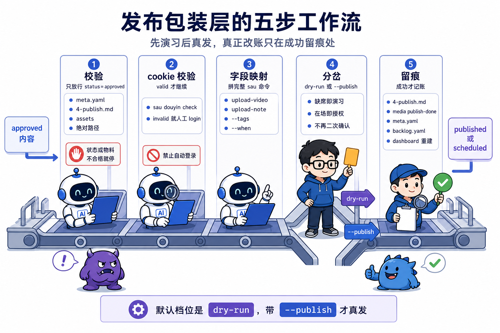
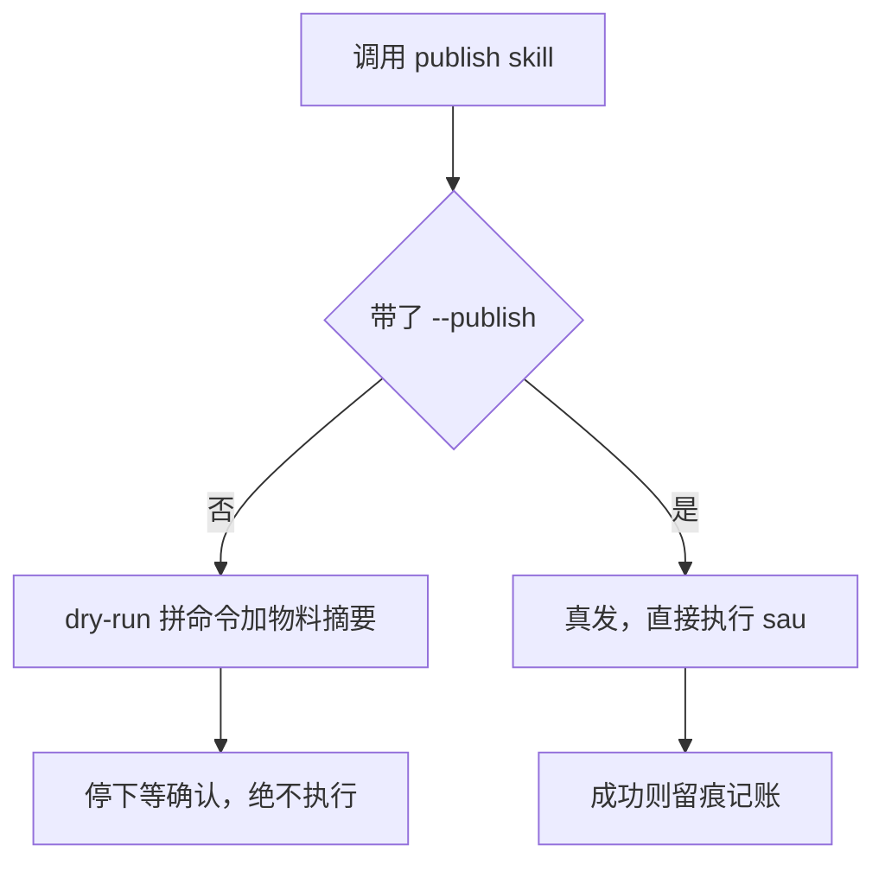
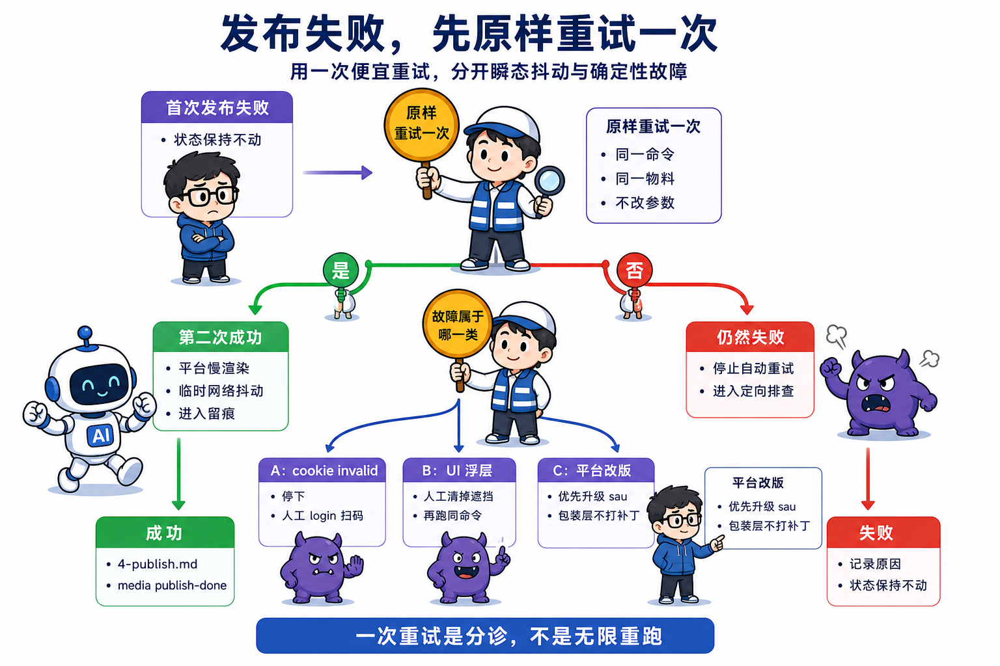
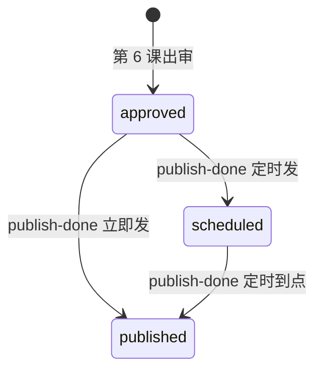

# 第 7 课 发布与二次包装，为什么不直接用 social-auto-upload

> 代码仓库：<https://git.aicodex.cc/devlist/douyin-media>
> 对应分支：`07-publish-wrapper`

本课立一个判断，发布是唯一不可逆的外向动作，所以它的自动化默认档位必须是演习。

第 6 课收工时，你的系统能造内容、能记账，一条内容可以体面地走到 approved。但它还出不了门，从 approved 到真正出现在抖音上，中间隔着上传这件事。发布和前面所有环节都不一样，稿子改坏了能重写，音频合错了能重合成，视频发出去就是发出去了，删除也留痕。这个属性决定了本课的一切设计。

上传本身不用自己造轮子，开源项目 social-auto-upload（下称 sau）已经把浏览器自动化上传做好了，本课先裸用它，然后回答一个问题，都能用了为什么还要再包一层。第 3 课轮子四级里的第三级，包装，这一课正式登场。

任务做完后你应该达到四个状态。sau 环境可用且 cookie 有效；你自己的 publish skill 在 dry-run 模式下输出完整命令加物料摘要且绝不执行；拿一条非 approved 的内容去发会被拒；失败后的重试路径能口述。有抖音账号的可以真发一条，没有的停在 dry-run，全课不受影响。

## 一、先裸用 social-auto-upload

这一节把引擎装进来跑通。装之前先回答技术栈问题，为什么不手搓浏览器自动化，也不另找工具。手搓的路你在第 4 课已经走过一次，录屏用 headless 浏览器，但上传要走的 DOM 流程比录屏复杂得多，还随抖音改版频繁变，自己维护一套上传 DOM 脚本很快会烂掉。走官方开放平台 API 是另一条路，它面向企业开发者，个人号够不着门槛。sau 是成熟开源项目，登录、上传、图文、定时、多账号这些抖音上传的动作它都写好了，还自带排错文档，社区里有人维护，改版了有人跟着修。选它的理由是它把浏览器自动化这件事做完了，你的流水线不用重写一遍上传逻辑。代价也清楚，你锁定了它的上游，它改版你就得跟着升级，这个代价在 §五兑现。

环境用一个命令装。sau 是学员自装的外部开源件，clone 课程仓不包含它，安装步骤照 `.claude/skills/douyin-publish/references/sau-setup.md`。它是 Python 项目，用 uv 管环境。

```bash
cd tools && git clone <social-auto-upload 地址> && cd social-auto-upload
uv sync                                        # 装依赖，应输出依赖解析完、无报错
uv run sau douyin login --account main --headed # 弹 Chromium 出二维码，手机抖音扫码
uv run sau douyin check --account main          # 验 cookie，应输出 valid
```

uv 挡了一个具体的坑。sau 要求 Python 3.13 以下，你机器上系统默认的可能是 3.14，直接用 pip 装会撞版本墙。uv 按项目文件建一个 3.12 的独立 venv，依赖和版本都锁在项目目录里，跟系统 Python 完全隔离，`uv run` 每次都进这个环境，不碰全局版本。这是它比裸 pip 值的地方，不换运行时，只挡环境漂移。`.claude/skills/douyin-publish/references/sau-setup.md` 记着这个版本坑，2026 年 6 月实测时正是靠 uv 绕开的。

登录本质是把 cookie 存到本地，供后续无头上传复用。cookie 属于第 0 课讲过的安全红线，它落在 `cookies/` 目录里，这个目录必须进 gitignore。现在用 `git status` 确认一遍，应看到 `cookies/` 未被 git 跟踪。

然后拼一条上传命令。有账号的可以真跑，没账号的拼到这一步就够了。命令长，先看它每一段要什么。

```bash
uv run sau douyin upload-video --account main \
  --file <成片绝对路径>.mp4 --title "<标题>" \
  --desc "<正文简介>" --tags AI,编程 --thumbnail <封面绝对路径>.png
```

`--file` 是成片 mp4 的绝对路径，`--title` 是标题，`--desc` 是正文简介，`--tags` 逗号分隔不带 #，`--thumbnail` 是封面绝对路径。sau 会起一个自动化浏览器，替你走完人手动上传的全部点击，成功时应输出 `视频发布成功` 或 `submitted`。

图文走另一条子命令，字段略有不同。`upload-note` 用 `--images` 按发布顺序接多个图片绝对路径，首图就是封面，`--note` 是正文，最多 35 张、不支持 GIF。视频和图文两条命令的入参差别不大，等你写包装层字段映射时要把这份差别落进 spec，别让 AI 把图文的图片路径拼成视频的 `--file`。到这里上传能力已经齐了，你现在能手动把一条视频发到抖音上。

## 二、裸工具的三个缺口

现在停下来看一个问题。既然 sau 什么都能干，直接在流水线里调它不就完了。

试着从系统的角度审视这条命令，会看到三个缺口。第一，它不认识你的状态机，一条还在 drafting 的半成品、一条已经 rejected 的废稿，路径喂给它照发不误，第 6 课辛苦立起来的状态纪律在它面前形同虚设。第二，它没有授权环节，命令一敲就开始上传，而这是全流水线唯一不可逆的动作，敲错一次没有后悔药。第三，它不留痕，发完了什么档案都没有，实际发布时间、用的哪个账号、成没成功，全靠人记。

这三个缺口没有一个是 sau 的 bug。它是一个通用上传工具，本来就不该认识你的 meta.yaml。缺的东西有一个共同名字，你的系统契约。**二次包装补的是工具与系统契约之间的缝，这就是它的全部职责**，接手去重写上传逻辑就等于自建轮子。反过来说，如果你发现自己在包装层里重写上传逻辑，那就是越界了。

三个缺口合起来指向同一处，这个工具不知道发布这件事不可逆，不知道哪条能发、什么时候该停下来问人、发完该记在哪。这一层认识要由你的包装层补上，这就是本课后面全部设计的起点。


## 三、包一层，你自己的发布 skill

包装的形态是一个 skill，写 spec 让 AI 生成，套路和第 6 课完全一样。写 spec 之前先把形态选清楚，有三条路，其中一条你已经走过。

方案 A，直接调 sau。流水线走到发布就手拼命令、手动确认、手动记账，一步都不用写。代价是三个缺口原样保留，状态校验靠记性，授权靠自觉，留痕靠人肉，这条只在一个人一天一条的时候成立，批量一上来就崩。

方案 B，独立脚本。把校验、映射、留痕写进一个 .sh 或 .py，一次写好反复调用，比 A 强在规则固化了，不会每次重打。代价是脚本不认识 AI，它读不到第 6 课立的状态机，字段从哪来、账号用哪个、发布时段怎么定，这些判断活它做不了，得在脚本外面配齐，配置一旦比逻辑还长，脚本就变成另一份要维护的账。

方案 C，包装成一个 skill。规则和流程写成一页说明书，AI 每次照着执行，校验、映射、留痕的步骤它走，判断活它做，卡住的地方停下来问人。这和第 6 课选 CLI 是同一个理由，判断留给 LLM，流程交给契约。代价是要把说明书写清楚，写不清 AI 就自由发挥，这正是本课后半节要教你的东西。

本课选 C。它把唯一不可逆这件事处理得最干净，校验闸、授权信号、留痕三样都能落进说明书，不再依赖执行的人记得。

包装的形态定了，spec 要规定五步工作流，对照课程仓 douyin-publish 的生产版。这份 spec 你直接粘贴给 AI 就能派工，五步各写了约束、输出和改哪几处真相账。

```text
写一个发布 skill，命名 douyin-publish，底层调用 sau CLI，不手搓浏览器 DOM。
它管一件事，把一条 status=approved 的内容发到抖音，先演习后真发，发完记账。

skill 开头第一段就写两条铁律，位置在一切操作说明之前。
第一条，只发 status=approved，其它状态一律拒绝。
第二条，不带 --publish 就是演习，绝不执行；带了 --publish 就是已授权，直接真发，不再求确认。

步骤一，校验。
读 content/<slug>/meta.yaml，status 必须等于 approved，其它值一律拒绝并报出实际状态。
读 4-publish.md，取标题、正文、话题标签、封面路径、建议发布时段。
查 assets/ 目录，成片 mp4（视频）或图片（图文）、封面文件必须真实存在，路径一律取绝对路径。
任一缺失就报告缺什么、缺在哪，然后停止，不进下一步。
本步只读不写，不改任何账，产物是放行或拒绝的判断。

步骤二，cookie 校验。
执行 cd "$SAU_DIR" && uv run sau douyin check --account main。
输出 valid 才继续；输出 invalid 就停下，提示人手动跑 login 扫码，禁止自动登录。
本步不改账。

步骤三，字段映射。
把步骤一读到的字段拼成完整 sau 命令。
视频用 upload-video，图文用 upload-note；--tags 逗号分隔不带 #；发布时间取 --when 参数，没有就取 4-publish.md 建议时段，再没有就是立即发，并在摘要里显式标"立即发布"。
输出一行完整可复制的 sau 命令。本步不改账。

步骤四，分岔。
调用没带 --publish，走 dry-run，输出完整 sau 命令加物料摘要（标题、正文摘要、话题、封面文件、发布时间是立即还是定时），绝不执行，然后停下等确认。
调用带了 --publish，说明授权已在上游完成，直接执行命令，跳过 dry-run，不再求确认。
dry-run 不改账；真发成功才进步骤五。

步骤五，留痕。
真发成功后，把实际发布时间、能拿到的作品链接、用的账号回填进 4-publish.md。
然后执行 media publish-done <slug> 一次翻齐两处真相账 meta.yaml、backlog.yaml，dashboard 投影由重建命令重算，合称三翻齐。
失败只写失败原因到 4-publish.md，不调 publish-done，状态保持不动。
输出一行已发布加回填摘要，或一行失败原因加状态未动。
```



五步里只有两处做决定，校验和分岔决定放不放行，留痕一次三翻齐，其余步骤都在读、在拼、在判断。你验收这份 spec 时，就看它有没有把改账位置写死。

三翻齐这个名字，前面第 5、6 课叫它三处账。这里把话收紧，三个文件还是要动齐，但只有 meta.yaml 和 backlog.yaml 算账，publish-done 翻的就是这两处，dashboard.md 是派生投影，不占账的名额，翻完由重建命令重算。三个动作合称三翻齐，本质没变，只是把第三处的性质说准了。

派工用两段式，别一口气让 AI 生成整个 SKILL.md。先让它列出 skill 会有哪几节、每节写什么规则，你对照上面五步确认边界没歪，再让它按清单生成全文。第一段产出的是清单，第二段才是正文，中间隔着一次人审。生成后验收三条，非 approved 被拒、物料缺失被拒、dry-run 不执行任何上传。

验收最容易踩的坑有两个。一个是只验 status 不验物料，AI 可能读一眼 meta.yaml 就放行，不查 assets 里成片和封面是不是真实存在，等你真发时才发现文件路径是空的，所以验收时故意移走封面文件，看它拒还是不拒。另一个是只验报错不验演习，AI 可能做出一个"拒绝时抛错"的 skill，但 dry-run 模式下照旧起了浏览器，报错和未执行是两件事，dry-run 这条要真跑一次，确认它只打印命令、没有起任何浏览器进程。

AI 执行时还会错两处。字段映射那步，AI 容易把 `--tags` 拼成带 # 的形式，sau 要求逗号分隔不带 #，带 # 会重复。留痕那步，AI 容易只写 4-publish.md 不调 `media publish-done`，或反过来只调 publish-done 不回填时间链接，三翻齐凑不齐，验收时盯这两处。

## 四、dry-run 铁律与单一授权信号

第四步的分岔规则一句话就能说清。不带 `--publish`，默认走 dry-run，只拼完整 sau 命令加物料摘要给人看，绝不执行，然后停下等确认。带上 `--publish`，调用方已经拿到人的授权，直接真发，跳过 dry-run，不再求确认。



这张图只有两个出口，停下等确认和执行。缺了那个 `--publish` 标志，就永远走不到右边。

两半各有讲究。前一半是 dry-run 铁律，默认路径永远是只看不发，输出完整到可复制执行的命令加物料摘要，让人看到的就是将要发生的。一次 dry-run 的输出长这样。

```text
命令：cd "$SAU_DIR" && uv run sau douyin upload-video --account main --file <abs>.mp4 --title "标题" --desc "正文" --tags AI,编程 --thumbnail <abs>.png --schedule "2026-08-26 19:30"
物料：标题 ... | 正文摘要 ... | 话题 AI,编程 | 封面 xxx.png | 定时 2026-08-26 19:30
状态：未执行，等待确认
```

三行信息各干一件事，命令可复制、物料可核对、状态说明此刻什么都没发生。不可逆动作的自动化，默认档位必须是演习，这一句就是本课开篇的判断，现在落到了具体的分岔上。

后一半反直觉，带了 `--publish` 为什么不再确认一次，多问一道不是更安全吗。真发这条命令是被自动化流程调起的，`claude -p` 无头执行，没有人守在终端，skill 若在这时弹出"确认吗"，流程就永远卡死在一个没人会回答的问题上。所以授权被设计成发生在上游，人在飞书点了确认，调用方才会带上 `--publish`，这个标志出现就等于授权已完成，skill 见它直接执行。

单一信号这个设计有两个被否掉的方案，摆出来看取舍。第一个方案在 skill 里再弹一次交互确认，真发前问一句"确认吗"，最直观，但无头场景没人回答，等于把流程卡死，上一段已经说过。第二个方案设两个开关，`--publish` 管是否真发、`--confirm` 管是否已确认，比单一信号多一个维度，也给调用方多留一个漏传的机会，两个信号组合出四种状态，出错面变大，还引出一个哪个开关优先的模糊地带。单一信号把授权压缩成一个二值，在场即授权，缺席即演习，没有第三种状态可漏。

授权信号要单一且语义明确。`--publish` 是唯一信号，在场即已授权，缺席即演习，没有第二个开关、没有模糊地带。至于上游的确认具体长什么样、人在哪里点，是下一课的全部内容。

## 五、真实世界会抖

发布环节的坑和前面几课不同，多数来自物理世界的抖动。课程仓两条真实教训。

L7，某集首发赶上平台慢渲染，上传超时失败，原样重跑同一条命令，一次就过。L8，某天抖音页面弹了个 UI 浮层挡住"选择封面"按钮，自动化点不到，退出码 1，人清掉浮层后重跑同命令，一次过。第 1 课讲 CLI 对比 GUI 时提过这条事故，现在你站在它发生的位置了。

两条教训合成一条规矩，发布失败先原样重试一次，再排查。浏览器自动化面对的是一个会变的页面，弹窗、慢网络、临时改版都可能是原因。环境瞬态，重试即可，重试一次就过的问题不值得排查，重试仍失败的才值得。你的 spec 里应该有这条。一次这个数不是随便定的，环境瞬态大多在第二次就恢复，多试几次不提高通过率，改版、cookie 失效这类确定性问题，重试一百次也是同一个错。先原样重试一次是一道便宜的分诊，试一次就把两类原因分开。



另外两条边界也来自真实运行。cookie 失效不自动登录，扫码是人的事，skill 探测到失效就停下报人。引擎跟不上平台改版时，优先升级 sau 上游项目，不要在自己的包装层里打补丁，包装层越薄越好，厚了就开始接管本该属于轮子的职责。这就是 §一说的锁上游代价，改版了你只能等它修或自己提 PR，补丁打在包装层只会让你下次升级更疼。

## 六、铁律为什么写在最前面

本课加油站讲一件小事，课程仓 douyin-publish 的 SKILL.md 里，铁律段落在第一个小节，比工作流、比环境说明都靠前。

这个顺序是设计。skill 的读者是 AI，AI 读文档和执行任务的方式是顺序的，红线写在最前面，它在了解任何操作细节之前先知道什么不能做。反过来把红线埋在文档中后部，AI 可能读到工作流就开始动手，红线还没进上下文。你第 1 课给 CLAUDE.md 写规则时已经用过这个原理，项目宪法先于一切任务加载，本课只是把它推到单个工具的粒度。

给 AI 写说明书的心法就一句，**铁律前置**。最重要的约束放在最先被读到的位置，这对人类读者同样成立，只是 AI 对顺序更敏感，它不会像人一样先把全文翻一遍。而这句铁律的内容，兜了一圈还是开篇那个判断，唯一不可逆的动作，它的红线必须最先进入执行者的上下文。

## 七、从 approved 到 published，一条命令走完

把前面拆开的五步串成一条路径，你应该能口述它。一条内容从 approved 出发，skill 先读 meta.yaml 校验状态、读 4-publish.md 取物料、查 assets 确认文件存在，这一关只放行或拒绝，不改账。接着 check cookie，valid 才继续。然后字段映射拼出完整 sau 命令，还没到执行。分岔处不带 `--publish` 就停在演习，带了才真发。真发成功后留痕，回填时间和链接到 4-publish.md，再调 `media publish-done` 一次翻齐两处真相账 meta.yaml、backlog.yaml，dashboard 投影由重建命令重算，合称三翻齐，这条内容走到 published，整条路径收口。



翻到 published 和 scheduled 只有 `media publish-done` 这一条边，第 6 课立的记账唯一入口，在这一课收口。定时发是一条内容先停 scheduled、到点再补记 published 的两跳，走完才算出账干净。

整条路径上真正翻账的只有留痕一处，分岔处决定走不走真发，留痕处一次三翻齐。其余步骤都在读、在拼、在判断，不落盘。你验收自己有没有懂，就看能不能不看任何代码，把这个路径从头背到尾，并说出每一步改不改账。

几个判断带走。唯一不可逆，所以默认档位是演习。包装补的是工具与系统契约之间的缝，重写上传逻辑的事留给上游。授权信号单一且语义明确，`--publish` 在场即授权。铁律前置，红线先于操作进入 AI 的上下文。

下一课补上本课刻意留空的那一环。`--publish` 等于授权已发生在上游，那上游在哪，人在什么界面上看到什么信息、点下哪个按钮，这次点击又怎么变成命令行上的一个标志。你会搭起自己的审批通道，跑通两张卡片的完整闭环，模块二在那里收官。
