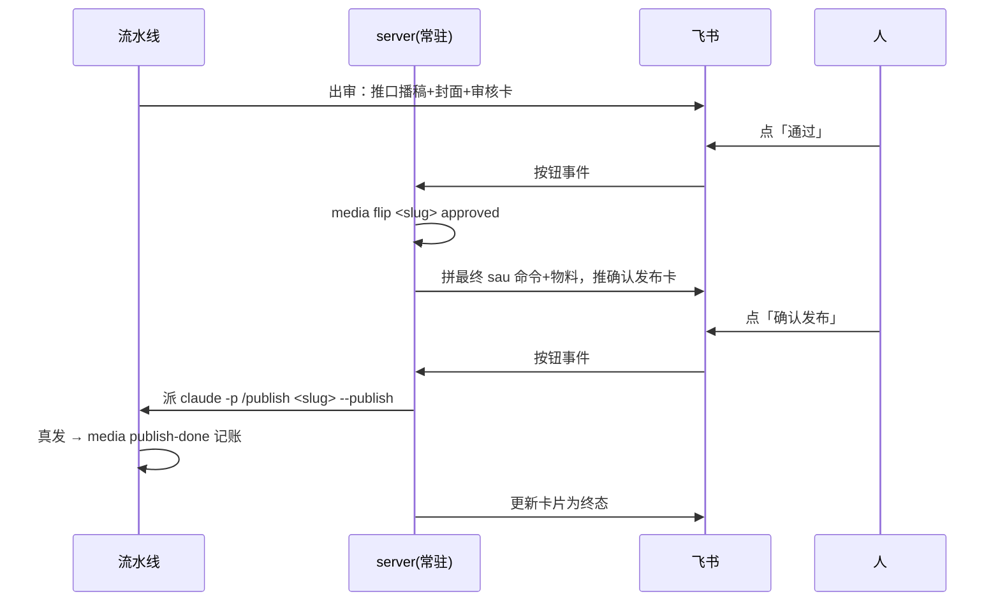

# 第 8 课 人在环上，飞书双卡与闸口位置设计

**把人的决定做成机器可读的事件，而不是留在对话里的一句话。** 这是本课要立住的判断。整条流水线十几个环节，人的进场被压到两次点击，两次点击都落成带时间戳、带操作人、会翻转状态的记录，机器照着记录继续走。人还在环上，但环不再等人来找它，它来找人。

第 7 课结尾留了一个空。publish skill 见到 `--publish` 就直接真发，因为授权已经发生在上游。这一课就是那个上游。

回想你现在的流程，内容出审之后，你要自己记得去看稿、在终端里翻状态、再手敲发布命令。人成了流程的一部分，还是最不可靠的那部分，会忘、会拖、会在终端里敲错。这套系统的解法是把人的两次进场都搬进一个通知通道，内容出审自动推到你手机上，你点两次按钮，其余全部自动。两次点击就是两次结构化事件，不再是一句散在对话里的"可以发"。

这一课的任务是搭起自己的审批通道，跑通全链，出审推审核卡，人点通过，系统推确认发布卡，人点确认，真发，记账。主路径用本地终端确认模式，不申请任何应用，从头到尾验收；飞书自建应用是进阶可选，等你要离开终端再换皮，两个版本契约完全一样。做完后你达到四个状态，全链跑通一次，两张卡各自的决策能口述，发布后三翻齐，`media check` 干净。模块二在本课收官。

## 一、流水线里只有两次点击

先把人的位置钉准。课程仓 `pipeline/3-review.md` 开头一句话，工作日全自动到此为止，AI 把成品备齐，人来把关。整条流水线里人只出现在两个点，出审后判断内容行不行，发布前确认此刻发不发。除这两点外，从取题到录屏到记账，没有一步需要人。为什么是这两点，第六节会摆多一个和少一个各自的代价，这里先把位置记住。

本课要做的就是把这两个点做成两张卡片。先看全链的时序，本课所有小节都在实现这张图的某一段。



图上人只出现两次，都是一次点击。两次点击之间和之后的所有边，全部自动。这两次点击就是本课要落地的两个结构化事件，一次授权内容，一次授权发布。

## 二、搭起通道

这条通道的结构是一出一入两个动作。出站是一个命令行脚本，把稿件和卡片推给人看；入站收人的决定。飞书版里入站是一个常驻 server，靠长连接收按钮回调；本地版把两个动作合成一个程序，出站打印完就地在终端等输入。

先讲通道载体怎么选，这里摆两个方案。方案 A 是飞书自建应用，方案 B 是本地终端确认。飞书版把卡片推到手机，人随时点，server 在后台等回调；代价是要建应用、要拿 app_id 和 secret、要管一份配置文件，这几样都有申请门槛。终端版在本地打印同样内容等输入，零依赖，代价是人必须在电脑前，离不开座位。课程仓生产里选飞书，让人能离开终端；但本课跟做先走终端版，它不申请任何东西，你能从头到尾验收，飞书是进阶可选。契约对两个方案一视同仁，通道只是皮。


再讲飞书版回调怎么收，这是走飞书进阶路径才要做的选型。飞书给自建应用两种收事件的方式。方式一，长连接，你的电脑不用服务器，事件直接推下来，家里的机器就能收，代价是断网就收不到。方式二，事件发到你的一台服务器上，需要服务器、域名、证书三样，还要管续期，代价更大。个人在家跑流水线，方式二这几样成本都不值得，飞书版选方式一。飞书开放平台的官方文档把这两种方式写在《事件订阅》一节，配置回调地址与密钥（open.feishu.cn/document/server-docs/event-subscription-guide/event-subscription-configure-/configure-callback-address-and-key，2026-08-25 访问）。

飞书长连接的边界也讲清。它断网就没法收事件，这正是本地终端模式要先做出来的理由；它掉线会自动重连，但重连窗口内的事件可能延迟或漏掉，重要操作别只靠一条卡，本地日志和 meta.yaml 的账才是最终凭据。这句话放在前面，是怕你把飞书当成账本，飞书是通道，账本在仓库里。

两个程序的分工也钉死，这是 spec 里写死的契约。notify 只产出消息，不碰状态账，它读稿读封面、拼卡片、推出去就结束。server 只处理事件，不产出内容，它收到按钮就翻账、拼命令、派进程。产出和记账分在两个程序里，谁出问题都不会带坏另一个。本地版把两半合成一个程序，契约里的分工不变。这套分工落到 spec 里就是那两条验收，notify 验收三连，server 验收全链。

技术栈说清。两个程序都用 Python 写，放在 `tools/feishu-bot/`。选 Python 因为飞书官方的示例就是 Python，卡片 JSON 好拼，跟 tts-dub、录屏那批 node 脚本并存不冲突。代价是长连接断了要等它自动重连，飞书官方升级要跟着改。配置属于安全红线，app_id 和 secret 推上 GitHub 就是事故，课程仓的做法是 `config.yaml` 本体 gitignore，仓里只放 `config.example.yaml` 模板，你照办。`tools/feishu-bot/` 里就这几个文件，notify.py 出站，server.py 入站，feishu.py 封装飞书接口，cards.py 拼卡片 JSON。你看一遍文件名，就知道这条通道由哪几块拼起来。

主路径从本地终端模式搭起，不申请任何应用、不配 app_id，让 AI 按下面 spec 把契约实现出来，本地版把两半合成一个程序。这一步不写代码，飞书版要做的搭建放到本节末尾的进阶清单。

代码不用手写，这又是一次 SDD。spec 里写清两个程序的契约，输出格式、落盘路径、验收三样都要写全，AI 才会照着交。

```markdown
## notify（出站 CLI）
- 输入 slug：定位 content/<slug>/ 下的 meta.yaml 与物料目录
- 读三样：口播稿全文、封面图、审核卡（通过/打回两钮）
- 输出格式：飞书卡片 JSON，按钮 value 带 slug 与动作
- 落盘：不落盘，只推消息；预览 best-effort，缺稿缺图只少推那部分，不挡卡片
- 验收：手机依次收到稿、封面、卡片三连
## server（入站常驻）
- 长连接收按钮事件，按钮值里带 slug
- 通过 → media flip <slug> approved → 拼发布物料 → 推确认发布卡
- 确认发布 → 派 claude -p 带 --publish 真发 → 轮询 meta.status 判成败 → 更新卡片
- 打回 → 弹原因输入 → 记录意见、flip 回 drafting
- 验收：全链走一遍，meta 停在 published，check 干净
```

本地版把推卡片这一步换成在终端里打印同样内容并等待输入，两个程序合成一个，契约一字不改。跑起来后它先打印这条待审内容的稿子全文、封面路径和审核卡，停住等你输入。你输入 `通过`，它调 `media flip` 把状态翻成 approved，接着打印第二张确认发布卡和完整 sau 命令，又停住等你输入。你输入 `确认发布`，它才派 `claude -p` 真发。这一端是常驻的，跑起来就占死这个终端，要再操作就另开一个新终端继续。验收看三样，出审后终端依次打印稿、封面、审核卡三连；输入 `通过` 后 meta.yaml 的 status 变成 approved；输入 `确认发布` 走完全链后 meta 停在 published、`media check` 干净。这条路径上的状态翻转和记账，本地版和飞书版完全一样。本地版脚本的名字以你的 AI 输出为准，示例里叫 `local.py`。通道是可替换的皮，契约才是本体，以后想换成 Telegram 或邮件，也只换皮。

飞书版是进阶可选，等本地版跑通、你确实要离开终端再换皮。搭建步骤照文档办事，最小操作清单五步。第一步，在飞书开放平台建一个自建应用，自建应用就是你自己建的一个飞书应用，用来发消息收事件。第二步，在凭证与基础信息里拿 App ID 和 App Secret，app_id 是应用身份号，secret 是应用密钥，填进配置后不能提交到 git。第三步，开机器人能力，让应用能以机器人身份在群里发消息，发布应用后把机器人拉进目标群。第四步，事件与回调的订阅方式选长连接，订阅卡片按钮事件。第五步，把 `config.example.yaml` 复制成 `config.yaml` 填入真实值，跑 notify 推卡、跑 server 收回调。

这步 AI 会怎么错。它会把 app_id 和 secret 写进提交的代码，或者把 config.yaml 一起 commit，本地版没有这些配置，AI 就不该造出来；它会在 spec 里漏掉落盘路径，两个程序写完不知道对方的产物在哪；它会只推一条"有内容待审"链接，把全文和封面省掉。验收就看三样，本地版终端能看到三连，`git status` 里没有多出的配置文件，两条命令各跑一遍能对上 spec。

## 三、第一张卡，审核

出站脚本推的东西有讲究，三样连发，口播稿全文、封面图，最后才是带按钮的卡片。一行"有内容待审，请查看"式的通知不算数。

让人看着真实内容判断。通知只带链接，人就要设备切换、找文件、开预览，摩擦大到一定程度，人会开始凭印象点通过，审核闸就名存实亡了。稿子和封面直接出现在眼前，本地版是终端打印，飞书版是聊天窗口，扫一遍再点按钮，审核才真的发生。成片 mp4 不推本体，体积超限，物料里标注文件名，想看本体本地开。

审什么也要落成清单，不然每次审核的标准都在漂。课程仓 `pipeline/3-review.md` 的人审清单六条，事实、时效、定位、语气、合规、观感，每条一个可核的点，技术结论正确且数据有出处，热点已核实且标来源日期，贴合账号支柱，第一人称口语化且钩子有效，无违禁词且无违规导流，封面字幕达标。抄进你的 3-review.md，人审也要有 spec。清单的价值在防漂移，没有清单，这次审稿抓的是语气，下次抓的是合规，标准随心情走，六条钉在 3-review.md 里，每一次人审都是同一把尺。

审核卡上两个按钮，通过和打回。通过只是把状态从 review 翻到 approved，告诉系统内容过关了，离发布还差一步。打回也不是删除，它把状态翻回 drafting，让人重做。两个按钮都是状态翻转，都落进 meta.yaml，谁点的、什么时候点的，都留痕。

跑一遍看效果。

```bash
cd tools/feishu-bot && python3 local.py --slug <你的slug>
# 终端应依次打印：稿件全文、封面、审核卡
```

这步 AI 会怎么错。它会把卡片按钮的 value 写成空，回调时不知道翻转哪个 slug；它会在推消息时漏掉封面或稿子，只推卡片。验收就看本地版终端是不是三连，以及输入一次打回（飞书版在手机上点），程序能不能拿到 slug 和动作。

## 四、第二张卡，确认发布

人点了通过，server 接管。它先记账，再拼发布物料，推出第二张卡。这里要看清四步各自碰的命令，以及每条命令动的是哪几处账。

`media flip <slug> approved`，输入 slug 和状态 approved，把该条 meta.yaml 的 status 字段从 review 翻成 approved，行尾写时间戳，只改 meta.yaml 这一处真相账，写事务，翻 published 或 scheduled 会被硬拒绝。`claude -p /publish <slug> --publish`，输入 slug 和 `--publish` 标志，起一个无头 Claude Code 进程执行 publish skill 真发抖音，真发成功后再由 skill 调 `media publish-done` 记账。`media publish-done <slug> --url <链接>`，输入 slug 和作品链接，可选 `--scheduled` 定时，meta 的 status 翻成 published 或 scheduled，时间戳回填，backlog.yaml 里该选题从 picked 翻成 published，发布链接回填，改 meta 和 backlog 两处真相账，dashboard 投影由重建命令重算，写事务。`media check --json`，无业务输入只读，读 meta.yaml 和 backlog.yaml 建快照，跑 alerts 规则，输出 error、warn、info 计数，不改任何账，有 error 退出码为 1。

一条事件从头到尾怎么走，可以口述出来。人在手机上点通过，飞书把按钮事件推到常驻 server，server 从按钮 value 里读出 slug 和动作，先校验动作合法，再调 `media flip` 翻 meta 状态，翻完读发布物料拼确认卡，推出第二张卡。人点确认发布，server 派 `claude -p` 真发，发完由 publish skill 调 `media publish-done` 三翻齐，server 轮询 status 确认翻到 published，更新卡片为终态，最后 `media check` 收口验三翻齐。这条路径上，校验在动作读 slug 时发生，翻转在 flip 和 publish-done 两步完成。收口交给最后的 check。

server 记账后做一件确定性工作，读发布物料、拼出最终完整的 sau 命令和物料摘要，推出第二张卡。卡上是标题、正文、话题、封面、发布时间、完整命令，下面两个按钮，确认发布、取消。

点确认，server 派出无头进程执行 `claude -p /publish <slug> --publish`。第 7 课那个标志的来路在这里闭合。`--publish` 由这次按钮点击直接产生。从按钮到标志之间，是一条无人插手的确定路径。

成败判定也有讲究。server 不信进程的退出码，它轮询 meta.yaml 的 status，翻到 published 才算成功，然后把卡片更新成终态。第 3 课那句"验产物不验 exit code"，在这里用在了发布上，状态账就是产物。

这里可以再往深一层，立成原则，叫三级信任。系统里跑着三类信息，可信度从低到高排。模型文本，claude 嘴里说的每一句，最不可信，只拿来展示，永远不驱动状态。工具事件，claude 调了哪个工具、改了哪个文件，比文本可信，可以拿来画进度条，但不裁决成败。文件状态，meta.status 这种躺在文件里的账，是唯一裁决——它不靠谁转述，谁都能查。这三级排出来的纪律一句话，文本永不驱动状态。你现在看到的「轮询 status 不验 exit code」，就是这条纪律在发布环节的样子。

这步 AI 会怎么错，它只验 `claude -p` 进程的退出码，进程 0 退出就判成功，但 meta.status 还停在 approved，因为 publish skill 崩在记账之前；它会在打回时只 flip 回 drafting，把原因输入弹出来后丢掉，不落意见。正确做法是轮询 status 账，打回要把意见写进 meta.yaml 或 3-review.md。它还会把回调做成同步重活，人在手机上点完确认，server 当场跑去发布，飞书 3 秒等不到响应就判超时重投；会不设幂等锁，人连点两次确认就触发两次发布，不可逆动作双发；会把本机的 `ANTHROPIC_API_KEY` 带进 claude -p 子进程，被当成 API key 用，发布必失败。这三件加上退出码判成败，下一节的安全拉起四件事和回调三件事会逐个给堵法。

发布收口在三翻齐。真相账只有两处，meta.yaml 记这一条内容走到哪一步，backlog.yaml 记这个选题出没出街，publish-done 改的就是这两处。dashboard.md 是派生投影，不占账的名额，发布后用 `media dashboard rebuild` 重算。最后 `media check --json` 对两处真相账做一致性体检，有 error 就停。真相账的真相源永远是 meta.yaml 和 backlog.yaml，dashboard 只是给你看的。

点取消则什么都不发生，状态留在 approved，改天可以重新发起。

从通过到发布，人的两次决定都成了记录，一次 flip 写进 meta.yaml，一次确认触发真发与三翻齐。没有一句"可以发"散在对话里。

## 五、server 收到按钮后，那台无头 claude 怎么被安全拉起

上面说 server 派 claude -p，这一节讲这步怎么派得安全。飞书进阶路径跑通后，这四个动作不齐，发布必失败或不可逆动作有双发风险，逐一钉死。

第一件，环境剔除。server 拉起的 claude -p 子进程，env 里必须删掉 `ANTHROPIC_API_KEY`。本机这个变量其实是 OAuth token（`sk-ant-oat01-…`），子 claude 误当成 API key，直接 Invalid API key，发布必失败；剔掉后它回落 `~/.claude` 的登录凭证。这是「真实世界会抖」里最便宜的一课——不是架构选择题，是环境语义：同名变量在不同机器、不同进程里含义可能完全不同。

第二件，工具白名单。claude -p 只给发布链要用的 `--allowedTools`，不给任意工具。无头进程没人盯着，工具面越窄，越不可能干出你没授权的事。

第三件，超时与终止。claude 可能卡死。超时先 SIGTERM，给 10 秒宽限收拾现场，再 SIGKILL 强杀，别让卡死的进程永久占着。

第四件，结果不读退出码。claude 可能自己没崩、退出码 0，但 publish skill 崩在记账之前。轮询 meta.status 翻到 published 才算成功，这就是上一节的成败判定，这里落在进程管理上。

回调还要守三件事。第一，3 秒内必须响应——飞书要求回调 3 秒内回，同步跑发布必然超时卡死，「响应先回 + 后台干活 + 异步补卡」是平台时限逼出来的形态。第二，卡片更新两路走，响应里直接带新卡原子更新，再加一条异步补卡兜底，两条路哪条先到都行。第三，同一条重复点击要有幂等锁——飞书会重投回调、人也可能连点，发布不可逆，双击双发没有后悔药，无锁就靠人的自觉防错，锁让第二次点击被拒。

自动重做还要有上限。发布失败允许自动重试，但重试有次数天花板，超限转人工——第 4 课质检三轮上限的发布侧版本。别让一台无头进程对同一个不可逆动作无限重试。

验收补两条。飞书版跑通后连点两次「确认发布」，应只发一次，第二次被拒；故意把 `ANTHROPIC_API_KEY` 留在环境里跑一次，应看到发布失败的错误信息，而不是「成功」。

## 六、过审不等于发布授权

现在回答一个必然出现的疑问，都过审了，为什么不顺手发了，还要人再点第二次。

因为两张卡审的是两个不同的问题。审核卡审内容质量，这条稿子、这张封面，够不够格出街，答案不随时间变。确认卡审的是此刻要不要发，人此刻看到的是最终真实物料和真实发布时间，此刻的判断还包括时机对不对、今天是否出了什么事不宜发。两个决策合并成一次点击，等于人只看了内容、没看最终物料和时间，就授权了一个不可逆动作。

这里也摆一次取舍。方案 A 合并成一次点击，省一步，代价是人在没看过最终物料和时间时授权了不可逆动作。方案 B 保留两次点击，代价是多点一次，换来人对不可逆动作的最后一眼。课程仓选 B。你搭自己的系统时会有冲动合并这两步，图省一次点击，别合。省掉的那次点击，省的是人对不可逆动作的最后一眼。

课程仓把这个原则写成一句话，通过不等于直接发，两次点击等于两次人类授权。


举一个合并失败的例子。你把两步合成一步，人在审核卡上点通过，系统立刻真发。三天后你发现那天发的是旧版封面，因为人点通过时看的还是初稿，最终版封面是后补的。此时视频已经出街，收不回，人也没有在看过最终物料之后留下任何一次确认记录。两次点击省下的，是查得清的一条授权链。

这一节是主判断的另一面。两次授权如果并进一次点击，"此刻发不发"这个决定就没有落成独立的事件，它被并进了"内容行不行"里，事后查不到人是在什么时间、看过什么物料之后点的头。

## 七、闸口为什么钉在这里

把镜头拉远看闸口的位置。整条流水线十几个环节，为什么人只把守这两处。

闸口不能更晚，发布之后人才看见，看见也收不回，不可逆点之后的检查全是验尸。闸口也不该更早更密，如果每个环节都要人点头，取题点一次、稿子点一次、配音点一次，人很快会疲劳成点头机器，每次都点通过，闸口全部形同虚设。多一个闸口，人就多读一遍材料、多等一次，误点也多一次，成本全堆在人身上，系统却不见得更安全。第 2 课讲 Checkpoint 时说过，停顿的价值取决于位置，处处停顿等于没有停顿。

于是原则收敛成一句，闸口只钉在不可逆点之前，且只钉在那里。这是主判断的一条推论。人的决定要落成事件，落成事件有成本，人每次进场都要读材料、判断、点按钮，所以闸口只能钉在收不回的决定上。可逆环节交给自动质检，第 4 课的 reviewer 就在干这个。人的注意力是全系统最稀缺的资源，只该用在收不回的决定上。第 2 课的 Checkpoint 管一次创作的返工成本，本课的闸口管整条流水线不可逆性，同一个思想，两个尺度。

## 八、人的进场是结构化事件

本课加油站讲 Human-in-the-loop 的通用模式。对比两种"人同意了"。

一种是口头的，你在对话里跟 AI 说这条可以发。它有三个毛病。留不下痕迹，三天后说不清谁在何时同意了什么。驱动不了流程，同意散在对话里，自动化流程读不到。边界不清，"可以发"是授权立即发还是授权今晚发，没人说得准。

另一种是本课搭的，结构化事件。一个结构化事件带四样东西，时间戳、操作人、动作、对象。时间戳和操作人解决追溯，动作决定机器下一步干什么，对象点明翻转哪一条。四样凑齐，事件才能被机器读、被账本记、被复盘查。按钮点击有时间戳有操作人，状态翻转落在 meta.yaml 里，授权变成命令行上一个语义明确的标志。整条流水线从此可审计，每一笔授权查得到是谁在何时点的。它也能自动推进，状态一翻，机器就照着走。第 6 课的状态机在这里显出另一层价值，它既是记账工具，也是人机之间的协议。人的决定翻转状态，机器读状态行动，两边不需要互相猜。

把人放进自动化系统的正确姿势就这一句，**把人的决定做成机器可读的事件，而不是留在对话里的一句话**。模块四你会看到它的两次重演，治理线的提议人审后才应用，元层的调参出限幅就升级人审。


## 九、几个判断带走

三个判断带走。把人的决定做成机器可读的事件，而不是留在对话里的一句话，这是人机协作的正确姿势。闸口只钉在不可逆点之前，两次点击是两次授权，别合并。通道是可替换的皮，契约才是本体，换飞书换 Telegram 都只换皮。

模块二到此收官。但留意你现在的一天是怎么开始的。还是你坐到电脑前，敲命令取题，盯着创作跑完，看着它出审。系统很能干，可每天早上给它点火的还是你，你休一天假它就停一天工。下一个模块把点火权交给时间，你会写一份让定时 agent 照着执行的入口文档，第一次体验早上醒来，AI 已经把活干到了人审这一步。
