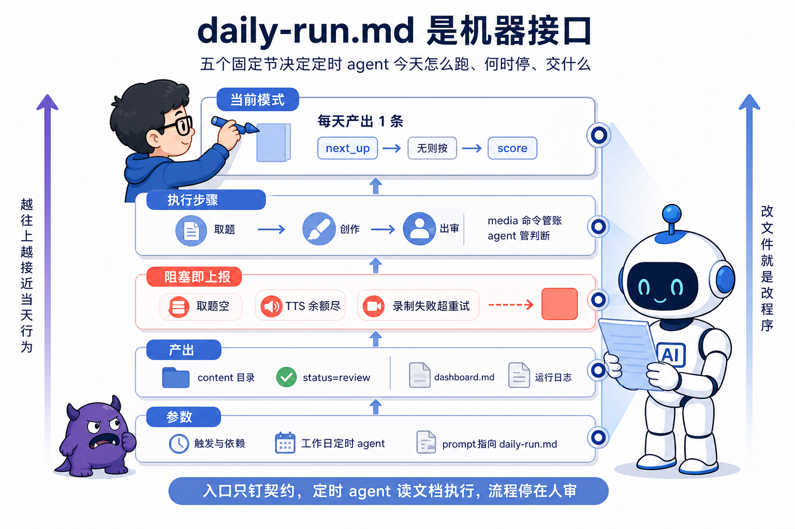
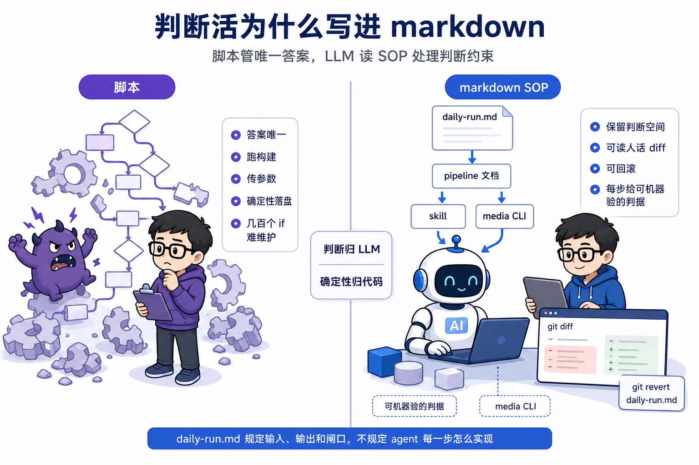
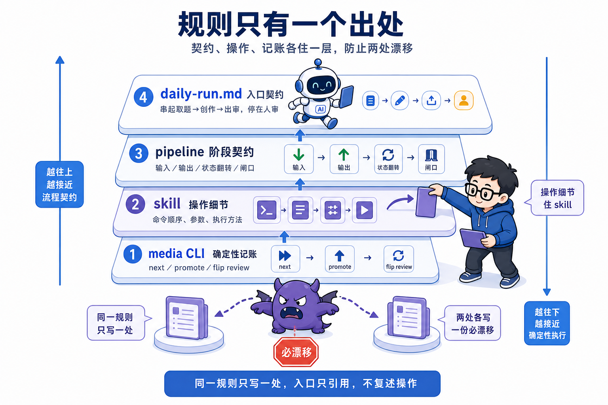
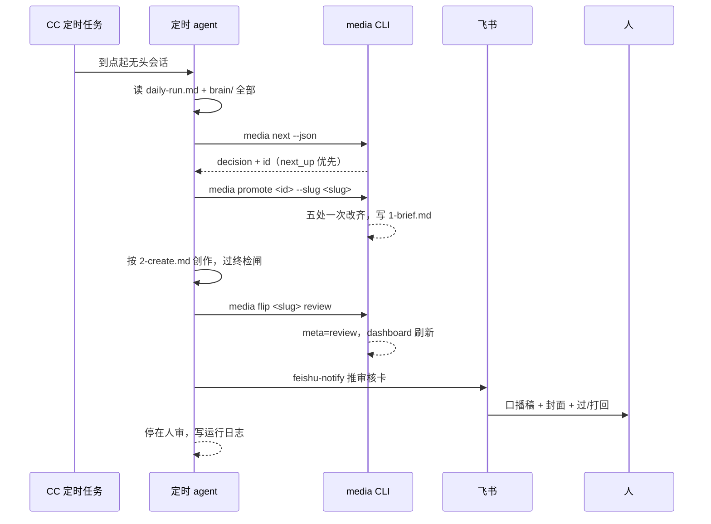
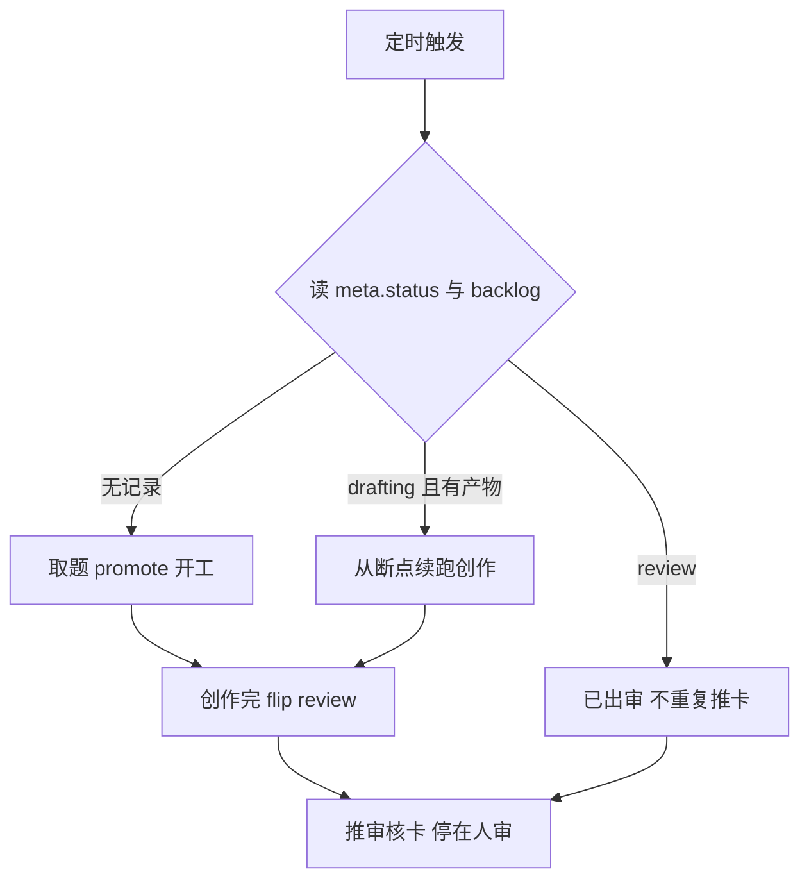

# 第 9 课 文档即程序，daily-run 编排与定时 agent

文档即程序。你写的 daily-run.md 是定时 agent 的入口 prompt，编排流程和造工具是同一套 SDD。把流程写成机器可读的文档，流程就能被定时跑起来。这是本课要立住的判断。

第 8 课收工时，流水线从取题到发布已经全自动，人的两次进场被压成两张卡上的两次点击。但每天开始的方式没变。你坐到终端前，敲取题命令，盯着创作跑完，看着它出审。系统很能干，可每天早上给它点火的还是你，你休一天假它就停一天工。这一课把点火权交给时间。

这一课的任务是写一份自己的 daily-run.md 入口 prompt，串起取题、创作、出审，停在人审，再配一个定时任务到点喂给它，跑一次完整的无人日更。做完后达到四个状态。一份能跑通全链的 daily-run.md；一个到点自己启动的定时任务；一次完整的无人日更实录；能口述从定时触发到停在人审的完整路径。

## 一、daily-run.md 是给定时 agent 读的入口

daily-run.md 的每一节都在回答定时 agent 执行时的一个问题，节结构就是这份入口的接口。定时 agent 到点不读别的东西，就读这一份文件，文件说什么它就做什么。

课程仓的 daily-run.md 开头一句话点名身份，定时 agent 读这个文件执行，串起取题、创作、出审，停在人审。这句话把两件事钉死，这份文件是给机器读的，机器的职责边界到出审为止。

往下分五节，各定一件事。

当前模式节定今天的任务定义。每天产几条，深度和流量怎么配，取题优先级怎么排，池子保鲜归谁管。这一节是入口里最常改的地方，模式一换，改这一节，定时 agent 明天就按新模式跑。

执行步骤节定流程怎么走，五步，每一步给命令、给判据、给产物。取题步给 next 和 promote 的命令，创作步只写一句按 2-create.md 出口播成品，出审步给 flip 命令和推卡动作，最后一步写不发布，到此停。定时 agent 每一步照着执行，命令直接可跑，判据直接可查。

阻塞即上报节定什么情况停下来。取题空、TTS 余额尽、录制失败超重试，这类导致当日无产出或流程挂起的事件，一律推飞书给人，同时写运行日志。这一节是无人系统的保命条款，第 10 课会展开讲。

产出节定落盘什么。当日一个内容目录，状态停在 review；停产时一条阻塞通知加日志。更新后的 dashboard.md，运行日志写入 pipeline/logs/ 下当天文件。产出写清了，agent 跑完才知道自己要交什么，人第二天才知道去哪看结果。

参数节定触发和依赖。工作日定时 agent，prompt 在用户目录的 scheduled-tasks 下，读本文件执行；用到的 skill 见各 pipeline 文档；治理线不在本表。参数节回答"这个入口靠什么活着"。

节结构是固定的取数位置。人改当前模式节，agent 明天就换行为，改文件就是改程序。你的入口不用照抄课程仓的双赛道和过渡兜底，骨架对齐就够了。下面是可直接粘贴的骨架，占位符换成你自己的。

```markdown
# 工作日全自动编排（入口 Prompt）

> 定时 agent 读这个文件执行。串起 取题→创作→出审，停在人审。

## 当前模式
- 每天产出 1 条。
- 取题优先级：backlog 顶部 next_up 指针（人钦点）→ 无则 status:idea 中按 score 取最高。

## 执行步骤
1. 读 brain/ 全部 + CLAUDE.md。
2. 取题：media next --json。decision 非 empty 拿到 id；empty 则停产上报，不硬造题。
   media promote <id> --slug <slug>，完成后写 1-brief.md。
3. 创作：按 pipeline/2-create.md 出口播成品，过终检闸。
4. 出审：media flip <slug> review，经 feishu-notify 推审核卡。
5. 不发布：到此停，等人在飞书点过/打回。

## 阻塞即上报
凡导致当日无产出或流程挂起的事件，一律经 feishu-notify 推文本通知给人。

## 产出
- 当日 1 个内容目录（status=review）；或停产时一条阻塞通知
- 更新后的 dashboard.md
- 运行日志写入 pipeline/logs/<日期>.md

## 参数
- 触发：工作日定时 agent（prompt 在 ~/.claude/scheduled-tasks/<任务名>/SKILL.md，读本文件执行）
```

骨架里的冒号和箭头沿用课程仓的机器字段风格，命令和状态值照抄即可。真正的判断活在你填的占位符里，每天产几条、取题规则写多严、阻塞事件列多全。填完这份文件，你就有了自己流水线的入口程序。



## 二、编排里动账的命令

编排里动账的命令只有三个，next 只读预演，promote 一次改五处，flip 翻 meta 重建 dashboard，每一处的口径都和第 6 课一致。定时 agent 全程不手改账，账务动作全部收敛在 media 命令里，这是第 6 课那句判断归 LLM、确定性归代码在编排里的执行。

| 命令 | 编排里的位置 | 做什么 | 改哪几处账 |
| --- | --- | --- | --- |
| next | 取题第一步 | 预演取题，输出 decision 和 id | 只读，不翻账 |
| promote | 取题第二步 | 把选题提出来开工 | backlog idea 翻 picked、回填 content_path、清 next_up、建目录、写 meta，五处一次改齐 |
| flip review | 出审 | 把成片翻到 review 交人审 | 过迁移表校验，改 meta.status、补 timestamps、重建 dashboard 在制表 |

取题步先跑 next --json。它只读预演，告诉你下一个会取谁、为什么，next_up 钦点优先，否则按 score。decision 非 empty，拿到 id，进入 promote；decision 是 empty，说明池里没有 idea，停产推飞书，不硬造题。硬造题是内容红线，没题就承认没题。

promote 接住 id 开工。它把 backlog 条目从 idea 翻成 picked，回填 content_path，清掉 next_up 指针，建内容目录，写 meta.yaml 初值，五处一次改齐。第 6 课说过，这五处分散着做就是漏账的温床，压进一条命令才不出错。promote 还有一个 auto 变体，一步做完取题加记账，同一套取题规则，默认无人跑就用它。

promote 完成后写 1-brief.md 喂下一步。brief 是判断活，slug 怎么起、brief 里写什么，agent 定，不写进命令。取题这条链上，命令管账，agent 管判断，分工清楚。

出审步跑 flip review。它过迁移表校验，把 meta.status 翻到 review，补时间戳，重建 dashboard 在制表，一条命令完成记账。翻完推审核卡，状态停在 review 等人审。出审有个前提，终检闸 G 要求先产 4-publish.md，这条教训登记在 L5 和 L6，规则细节在 2-create.md。

三个命令正好覆盖从池子到人审的账务全生命周期。next 预演不落盘，promote 开工落盘，flip 交审落盘。第 6 课那四个命令里的 check 不在编排主路径上，它留给发布收口，第 8 课已经讲过，定时 agent 到出审为止，不碰发布记账。

## 三、定时触发怎么配

定时触发是一个指向 daily-run.md 的薄任务，调度在 CC 客户端表单里设，任务本体只有一句"读这个文件执行"。到点客户端起一个无头会话，会话读 daily-run.md，一天的活就开始了。

课程仓的定时任务落在用户目录 ~/.claude/scheduled-tasks/douyin-ai/SKILL.md。这个路径的前半段是 CC 客户端管理定时任务的固定目录，douyin-ai 是任务名。这类文件是 Claude Code 客户端的定时任务文件，由客户端到点把任务喂给 AI；在你自己机器上由课程搭建，路径可随用户名变化。SKILL.md 的 frontmatter 只放 name 和 description，正文是一段 prompt，调度的时刻、工作目录、权限模式都不在这个文件里，在客户端表单里设。

Routines 是 Claude Code 客户端里的定时任务面板，到点自动把任务描述喂给 AI 开工；终端版在会话里敲 /scheduled-tasks 查看管理；定时任务本体就是一个 markdown 任务描述文件，也就是本课用的 SKILL.md。配一个任务做三件事。第一，在 CC 客户端的 Routines 页面新建一个本地任务，名字会落成 scheduled-tasks 目录下的文件夹名。第二，正文写一句"读 pipeline/daily-run.md 并按它执行"。第三，调度选工作日加一个时刻，比如每个工作日早上九点，休息日不触发。

这就是入口 prompt 的分工。SKILL.md 是薄触发器，只负责到点把 agent 叫起来并指路；daily-run.md 是厚正文，一天到底干什么由它说了算。想改每天的行为，改 daily-run.md，不用动定时任务。定时任务的本体不装业务信息，模式、取题规则、阻塞清单这类内容全部住在 daily-run.md 一处，才不会有第二份规则等着过期。

定时任务到点起的新会话是独立会话，不占你正在用的终端，跑完留档在客户端的 Scheduled 区，你打开能看到它今天干了什么。

定时为什么选 CC 客户端，理由在这一句。cron 到点只能跑一条命令或一个脚本，脚本里没有 agent。你要编排的流程每一步都要读文档、调工具、做判断，shell 干不了这三样。CC 定时任务到点起的是一个完整会话，读 markdown、调 skill、跑 media 命令，还能按判断决定停产还是续跑。你要的解释器是 LLM，不是 shell。代价是本地定时任务的通病，电脑要开着、客户端要运行、到点才跑，机器睡着就跳过。

## 四、为什么是 markdown 不是脚本

编排对象是判断活和工具调用的混合，脚本表达不了判断约束，markdown SOP 让 AI 读，保留判断空间，同时进 git 可 diff 可回滚。这是本课主判断的第一层落地。

对比脚本。脚本适合答案唯一的确定性步骤，跑构建、传参数、落盘，这类活脚本干得又快又稳。但这条流程每一步都夹着判断。口播稿第一句自不成立要判断，选题能不能如实做要判断，终检闸七项过没过要判断。这些约束脚本写不进去。硬写会退化成几百个 if 分支，每一个分支都是一条要维护的规则，比 markdown 更笨重，还丢了判断能力。

markdown SOP 是给 LLM 读的程序。daily-run.md 的每一段落到定时 agent 那里变成行为，执行步骤节写"按 2-create.md 出口播成品"，agent 就去读那份文档、调对应的 skill、按里面的闸口自查。判断活留给 agent，确定性活由命令兜底，这个分工在第 6 课立过，判断归 LLM，确定性归代码。

进 git 是 markdown 当程序的关键。daily-run.md 在版本管理里，改流程先看 diff，改坏了 git revert 回上一版，流程的历史和代码一样留痕。你以后会反复改这个文件，模式切换改当前模式节，取题规则改执行步骤节，每一次改动都可回溯。脚本也能进 git，但脚本的 diff 是代码，markdown 的 diff 是人话，人维护时读得懂。真遇到过把模式改岔的情况，git revert daily-run.md 一个命令就回到改之前，不用凭记忆重写。

SDD 从这里从造工具扩展到编排流程。第 6 课的 spec 是代码，让 AI 造出 media CLI；这一课的 daily-run.md 本身是可执行文档，由定时 agent 当解释器。同一个思想，规格管什么必须成立，实现管怎么做到。第 2 课的 outline 规定每章切几步、禁止规定动画怎么做，spec 规定行为契约、不规定代码怎么写，daily-run.md 规定流程的输入输出和闸口，不规定 agent 每一步怎么执行。

代价也要说清。markdown 没有类型检查，节名拼错、命令写岔，agent 不一定当场报错，要靠运行时的行为验证。所以这份入口的每一步都要给可机器验的判据，产出节写清落盘什么，阻塞节写清什么情况停下来，agent 跑完对得上才算对。第 3 课那句验产物不验 exit code，在编排里同样成立。



## 五、契约与操作分层

契约和操作分家。pipeline 各文档定输入、输出、状态翻转、闸口，skill 住操作细节，同一规则只写一处。两处漂移是文档系统的头号死因。这是本课主判断的第二层。

看 daily-run.md 的创作步骤，只有一句"按 pipeline/2-create.md 出口播成品"，四件套怎么跑、终检闸每项怎么验，全在 2-create.md 和对应 skill 里，入口不重复。出审步骤引用 3-review.md，人审清单六条也在那边。入口文档只钉契约，不复述操作。

这个约定在 1-ideate.md 开头写得很直白，细节全在 douyin-ideate skill，本文件只钉阶段契约，那句"两处各写一份必漂移"是它给读者的警告。必漂移三个字是这套文档系统的头号死因。同一规则写两处，改一处漏一处，定时 agent 读的版本和人维护的版本分叉，系统行为就不可预测。

这里摆一次设计取舍。方案 A，全流程细节塞进 daily-run 一条大 prompt，所有步骤、命令、注意事项写在一个文件里。好处是文件少，agent 只读一份就能干活。代价是同一规则在 daily-run 和 skill 里各出现一次，比如"第一句必须自成立"这条，既写进 2-create.md，又写进 daily-run，改的时候只改一处，另一处就漂了。方案 B，契约与操作分层，daily-run 只钉契约，操作细节住 skill。好处是规则只有一处定义，改规则改一处，agent 和人读的都是同一个版本。代价是要跨文件引用，第一次读要多跳几次文件。课程仓选 B。

这个取舍和第 6 课迁移表的理由是同一条。迁移表唯一定义在代码里，flip 和 check 信同一张表；操作细节唯一定义在 skill 里，入口文档和各阶段契约信同一处。规则的唯一出处，是这套文档系统防漂移的根。

契约层怎么识别，看一节里是不是只有输入、输出、状态翻转、闸口这四样，出现操作步骤就该下放到 skill。操作层怎么识别，看一段文字是不是在教 agent 跑哪条命令、按什么顺序、调什么参数，这种细节该住 skill，不该住契约。你自己写 pipeline 文档时，拿这把尺子卡一遍，卡出操作细节就下放。



## 六、取题优先级

取题优先级的设计是 next_up 人工钦点指针排在 score 排序前面，给人留插手位，默认不需要人。机器照常跑，人想插手随时能插。

daily-run.md 把这条规则写成，backlog 顶部 next_up 指针（人钦点）优先，没有则 status 为 idea 的条目里按 score 取最高，同分先 depth。这条规则内置在 media next 命令里，agent 不重复手判，命令输出谁就是谁。

摆一次设计取舍。方案 A，纯 score 排序，机器说了算。好处是彻底无人，每天取最高分，没有任何人工动作。代价是人想指定某一题时没有入口，明天要蹭一个刚发生的热点，池子里还没有，只能干等。方案 B，next_up 钦点优先，人在 backlog 里给某个条目标上 next_up，明天的取题就钦定它。好处是默认无人，不标就按 score 跑，但人任何时候想插手，写一个字段就行。代价是多维护一个指针字段，钦点完要记得清，promote 会在取题时自动清掉，不会二次钦点同一条。

选 B 的理由是给判断留一个低成本的插手位。score 是治理线养的池子打出来的分，反映的是池子里的存量。机器不知道明天会发生什么，人知道。人想钦点，写进 next_up，代价是一个字段；人不想钦点，什么都不用做，系统照常跑。这个设计让无人值守和人工干预并存，默认走无人，随时能换人工。

同分先 depth 也是设计决定。账号定位深度为主，两条题同分，深度题先取。这条规则和双赛道配比一起，把账号策略写进取题规则，机器取题时就照着策略走，不用每次人工干预。

## 七、一次无人日更

一次无人日更从定时触发到停在人审，全程没有一步需要人，人只出现在最后一张卡上。这条路径要能口述。



图上从定时到推卡，没有一个节点需要人。人只出现在最后一张卡上，一次点击，审核卡。图反喂 Prompt 的进阶写法，是把这张图连同节点说明写进 daily-run.md 的顶部，agent 第一天跑就照着时序走，不会漏步骤。

整条路径可以口述。九点客户端到点起一个无头会话，agent 先读 daily-run.md 和 brain 全部，摸清今天该干什么、账号是什么定位。然后取题，next 预演，拿到 id，promote 开工，五处账一次改齐，写 1-brief。接着创作，按 2-create.md 走口播四件套，每一件都过终检闸，声画一致、音频自然、钩子冷开、事实合规、封面达标、音画同步、发布物料齐，全在最终成片上验。最后出审，flip 翻到 review，推审核卡，写日志，停在这里。人点通过，后续走第 8 课那条发布链；人点打回，内容翻回 drafting 重做。

这条路径上，校验发生在取题和出审两步。取题判 decision 是不是 empty，出审验终检闸七项过没过。翻转发生在 promote 和 flip 两个命令。收口在停到 review 状态。

阻塞怎么处理，这一课只立边界。任何一步挂住，停在明确状态，推飞书，不硬跑不静默。具体怎么分级、怎么推、推给谁，第 10 课展开。

## 八、定时 agent 的工程要点

定时 agent 有两件事要设计好。幂等（做两次和做一次结果一样）保证重复触发不出重复内容，断点保证跑一半挂了能续。这两件事靠同一根拐棍，状态账。

幂等先讲。定时任务可能重复触发，电脑醒来补跑、手动点 Run now、调度错位，同一个任务一天跑两次。每次触发都读状态账再决定动不动手。课程仓的过渡兜底就是这么写的，取题前若调研报告超过两天没更新，先跑一轮选题调研，判据是谁先跑谁更新报告日期，另一边自动跳过。两个定时任务撞在一起，先到的更新日期，后到的看到日期新鲜，直接跳过，不会跑两遍。promote 也一样，状态机挡着，已经开工的题不会二次开工。

断点后讲。跑一半挂了，进程没了，下次触发怎么续。答案在状态账里。每一条内容的 meta.status 就是进度指针，挂在哪一步，状态就停在哪一步，下次从状态续。创作中间产物都落盘，口播稿、分段文案、音频、成片，已经落盘的不用重做。恢复的关键是把读状态放进入口的第一步，你的 daily-run 第一步永远是先看账，再决定从哪接。

挂住但续不了的，停在明确状态。TTS 余额返 1008，第 3 课那个事故，配音这一步做不下去，这时候停到 drafting，推飞书报充值，不硬跑不静默。硬跑会产出残次品，静默会没人知道，都违背阻塞即上报。



图上每次触发先看状态账。账说做到哪就从哪接，账说做完了就不再碰。状态账是定时 agent 的记性。

## 九、几个判断带走

三个判断带走。文档即程序，把流程写成机器可读的文档，流程就能被定时跑起来，daily-run.md 是你的入口 prompt，编排流程和造工具是同一套 SDD。契约和操作分家，pipeline 各文档钉契约、skill 住操作细节，同一规则只写一处。定时 agent 要幂等要有断点，状态账是判据，重复触发不产重复内容，跑一半挂了能续。

无人日更跑起来了，新的问题跟着浮出来。它挂了你多久知道？课程仓有过连续六天空跑，日志每天喊人，人没看见。每天定时跑不等于每天有人看着，没人看，挂了就是静默停产。第 10 课讲阻塞即上报，无人系统的可观测性，你会在自己的 daily-run 上接上报通道，让它挂的时候自己说话。
