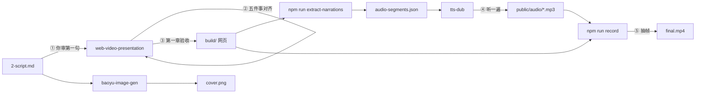

# 用开源 Skill 跑通第一条内容：从口播稿到成片与封面

上一课把一条内容从选题到发布的整条流程走了一遍，标出了 AI 自己往前推的步骤和停下来等人的步骤。这一课只做中间那一段：手里有一篇口播稿，把它变成一条可以拿去发的成片。

这一课的输入是一份口播稿 2-script.md。产出四样东西：一个可点击推进的网页工程 build/，一组分段配音 mp3，一条成片 final.mp4，一张竖版封面 cover.png。全程不写代码，四个开源 skill 接力，你只在五个点停下来确认。

## 1. 这一课要跑通什么

整条链由四个 skill 接力：web-video-presentation 把口播稿做成网页并抽出分段文案，tts-dub 把分段文案合成每段一个 mp3，录制脚本把网页和音频合成 mp4，baoyu-image-gen 出封面。每个 skill 只认自己的输入文件，也只产出下一个 skill 要读的文件。文件就是它们之间的合同，谁改了上游文件，下游就得重跑。

人在这条链上出现五次。第一次是口播稿写完，你看第一句。第二次是 skill 产出稿子和开发计划后停下来，你一次确认五件事。第三次是第一章网页做完，你在浏览器里验收。第四次是配音合成完，你听一遍。第五次是成片出来，你抽几帧看。其余步骤 AI 和脚本自己推进。

| 确认点 | 谁停下来 | 你看什么 |
|---|---|---|
| 口播稿 | 你自己 | 第一句删掉上文还成立吗 |
| Checkpoint Plan | web-video-presentation | 稿子、开发计划、主题、素材、开发模式 |
| 第一章验收 | web-video-presentation | 节奏、逐步揭示、双源、AI 味 |
| 配音 | tts-dub 合成完 | 段数齐不齐、听一遍 |
| 成片 | 录制脚本跑完 | 抽帧看字幕、首尾、时长 |

跑完之后，工程目录长这样。这是本仓库一条真实内容的 build/ 目录，只列了和这一课有关的部分。

```text
build/
├── script.md              # skill 产出的口播稿（2-script.md 的派生件）
├── outline.md             # 开发计划：章节切分、每步屏幕内容
├── src/chapters/
│   ├── 01-coldopen/
│   │   ├── Coldopen.tsx   # 画面
│   │   └── narrations.ts  # 本章每一步的口播文本
│   ├── 02-mechanism/
│   └── ...
├── audio-segments.json    # extract-narrations 抽出来的分段文案
├── tts.config.json        # 配音配置：音色、语速、多音字
├── public/audio/<章>/<步>.mp3
└── final.mp4
```



左边是口播稿进去，右边是成片和封面出来，圈出来的五个点是你要停下来看的地方。

## 2. 口播稿：第一句删掉上文还成立吗

口播稿是这条链上唯一的真相源。字幕、配音、画面三方都以它为准，后面任何一处要改文案，都得先改它。这一步 AI 写，你只审一件事：第一句。

短视频第一次刷到的人没有上下文。第一句如果是“上一集我们讲了”“前面说过”，这个人会直接划走。所以第一句必须自成立：删掉前面所有内容，它单独放在那里还能让人听懂、想往下看。本仓库一条真实成片的第一句是“都说 JavaScript 是写网页的玩具语言，干不了底层”，没有任何承接词，一句话就把争议点抛出来了。

让 AI 出稿子时，把这条约束和句长约束一起给它：

```
读取 article.md，把它改写成一篇口播稿，写到 2-script.md。
要求：
1. 第一句必须不依赖上文自成立，禁止“上一集”“前面说过”“今天我们来”这类开头；
2. 每句不超过 20 个字，说出来不别扭；
3. 保留原文 60% 以上的信息量，删的是修饰，不删事实和数字；
4. 按章节分段，每段一个完整想法，段与段之间空一行。
只输出稿子，不解释。
```

拿到稿子后核两处。第一处是第一句：把它单独复制出来读一遍，问自己一个没看过上文的人听到这句会不会想往下听。第二处是句长：找最长的三句，超过 20 字的拆开。其余内容先不动，节奏问题下一步 skill 会再过一遍。

如果第一句读起来还是带着承接的味道，多半是句首藏了一个时间状语或者一个“其实”。把句首的修饰部分整个删掉，只留后面的断言，通常就成立了。

## 3. 让 skill 做网页：一次对齐五件事，第一章必须你验收

稿子定了，交给 web-video-presentation。这个 skill 的流程分四个阶段：先一次产出 script.md 和 outline.md，然后停下来等你确认五件事，接着搭脚手架做第一章，第一章做完再停下来等你验收，之后的章节按你选的模式往下做。人工确认被压缩到了这两处停顿，其余时间它自己推进。

在 Claude Code 里这样启动它：

```
用 web-video-presentation skill，把 2-script.md 做成 16:9 的网页演示。
工程放在 build/ 目录。
2-script.md 是口播稿的唯一真相源，你产出的 script.md 以它为准，不要改写内容。
按 skill 的流程走，在 Checkpoint Plan 停下来等我。
```

### 3.1 五件事一次对齐

skill 写完 script.md 和 outline.md 后会停下来，把五件事一起摆给你。你不用逐项深究，每件事只看一个点。

| 五件事 | 你看什么 | 常见处理 |
|---|---|---|
| 稿子 script.md | 和 2-script.md 内容一致，没有被改写 | 不一致就让它以 2-script.md 为准重出 |
| 开发计划 outline.md | 每章估时在 30 到 60 秒之间，每步只写屏幕内容不写动画 | 章太长就拆，写了动画就删 |
| 主题 | 它推荐的两三套里选一套，或者让它替你选 | 选完告诉它，不选它不往下走 |
| 素材 | 需要真图的地方你给不给 | 给不了就全部占位图，后面再补 |
| 开发模式 | A 逐章确认、B 顺序做完统一验收、C 并行 | 第一次跑选 A |

outline 里为什么不能写动画，这一点确实容易绕。skill 的设计是 outline 只规划节奏和每一步屏幕上放什么信息，动画由写章节的那一步按内容临场决定。如果 outline 把动画写死，写章节的 AI 就退化成翻译机，出来的东西像 PPT 翻页。所以看到 outline 里出现“淡入”“弹簧”“从左滑入”这类词，让它删掉，只留“这一步屏幕上是三个数字”这种描述。

估时的算法是中文 4 字每秒。一步口播 24 个字大约 6 秒，一章 8 步大约 45 秒。这个数是 skill 的 OUTLINE-FORMAT.md 里定的，不用自己算，看它填的估时对不上字数就让它重算。

### 3.2 第一章验收看什么

五件事确认完，skill 搭脚手架，删掉自带的示例章节，然后做第一章。第一章它必须在主线程做完整版，做完停下来等你在 localhost:5173 验收。这一步不能跳，原因是第一章是这套主题和这个题材第一次碰面，颜色不够用、字体太小、节奏太快，都会在第一章暴露，这时候改成本最低，后面的章节都会照着第一章的代码模式写。

在浏览器里点击或者按右方向键推进，看四件事：

1. 节奏。每一步停留的时间和口播长度对得上吗，有没有一步塞了三句话的信息量。
2. 逐步揭示。列表是一项一项亮出来的，还是一次全堆在屏幕上。
3. 双源。屏幕上有没有口播没念、但原文里有的细节，比如一个具体数字或者一段代码。全是口播原文的画面是字幕，不是演示。
4. AI 味。紫粉渐变、圆角彩色药丸、emoji 图标、编出来的假数据，有一样就让它改。

验收意见直接说给它，说完让它改，改完再看一遍。四件事都过了再说“继续”。

如果点击页面上的按钮时整个页面跟着翻页了，多半是那个按钮没加 data-no-advance 属性。这是脚手架识别“这一下点击不算推进”的标记，让它给按钮补上就行。

### 3.3 后面的章节选哪种模式

第一章过了之后，剩下的章节有三种做法。A 是每章做完停下来验收一次，最稳，第一次跑选它。B 是顺序做完最后统一验收，快一些，风险是最后一次要看很多。C 是开多个子代理并行做，最快，但各章风格会有差异。skill 的说明里把这种差异当成预期，理由是每个子代理看不到别的章节，章节之间靪物理隔离，主题的颜色和字体统一兜底。

三种模式中途可以换。第二章验收完觉得稳了，说一句“剩下的并行”就行。

全部章节做完，在 build/ 里跑一次类型检查，零报错再往下走：

```bash
cd build && npx tsc --noEmit
```

## 4. 抽分段：段数等于动画步数，改文案必重抽

网页有了，声音还是文字。下一步把文字从组件里抽出来，变成配音引擎能读的格式。

每个章节目录下有一个 narrations.ts，它是一个字符串数组，第 N 项就是第 N 步的口播文本。这个文件是 step 数和音频的唯一真相源：章节组件里出现的最大 step 编号加一，必须等于这个数组的长度。skill 靠这条约束保证口播稿、开发计划、章节代码、章节注册表、音频文件五处不漂。

在 build/ 里跑抽取命令：

```bash
npm run extract-narrations
```

它扫描所有 narrations.ts，合并成 audio-segments.json。本仓库一条真实内容抽出来的前两段长这样：

```json
[
  {
    "chapter": "coldopen",
    "step": 1,
    "text": "你让 Claude 帮你写的文字里，可能已经被埋进了一个你看不见的暗号。",
    "audio": "coldopen/1.mp3"
  },
  {
    "chapter": "coldopen",
    "step": 2,
    "text": "这不是阴谋论，是 Anthropic 八月十四号自己官宣的。",
    "audio": "coldopen/2.mp3"
  }
]
```

抽完核两处。第一处是段数：每章的段数和你在浏览器里点过的步数一致。第二处是空串：任何一段 text 为空都不行，录制脚本按每段音频时长推进，空段没有音频，时间线会从那一步开始错位。有纯画面的转场步，给它补一句口播。

从这里开始有一条铁律：改过任何一处 narration 文案，必须重跑 extract-narrations，再删掉改动段的旧 mp3，再合成。配音引擎读的是 audio-segments.json，不读 narrations.ts；合成脚本看到目标 mp3 已存在会跳过。两条规则叠在一起，漏掉重抽或者漏掉删旧文件，结果都是画面是新文案、声音是旧文案。本仓库 EP02 就这样出过一次，改了钩子没重抽，连过两轮组件截图检查都没抓到，成片出来才发现声画对不上。

如果你发现成片里画面文字和配音念的对不上，多半是这一步漏了重抽，或者重抽了但旧 mp3 没删。

## 5. 配音：复制模板只改配置，先探余额再批量

分段文案就位，交给 tts-dub。它读两个文件：audio-segments.json 和 tts.config.json，输出每段一个 mp3。音色、语速、多音字规则全在 config 里，换一个工程只改 config，不动任何脚本。

config 不从零写，从账号级模板复制：

```bash
cp ../../brain/tts.config.json build/tts.config.json
```

模板里四个字段和你有关：

| 字段 | 管什么 | 模板里的值 |
|---|---|---|
| voice_id | 用哪个音色，账户级克隆音色 | 已填，跨内容复用 |
| speed | 全局语速 | 1.1 |
| normalize | 念法规整，只改配音不碰字幕，比如 RAG 念成 R A G | 四条常见缩写 |
| overrides | 逐段覆盖语速或多音字，键是“章/步” | 空，出问题再填 |

批量合成之前先单段试跑一次。原因是 MiniMax 余额耗尽会返回 1008 错误码，如果直接批量跑，跑到一半才发现，前面的段落已经浪费了额度，后面的段落残留旧文件。本仓库 EP13 就被这个卡死过一次配音到出审的整条流程。

```bash
cd build
node <tts-dub 目录>/scripts/synthesize.mjs --config tts.config.json --segments audio-segments.json --only coldopen/1
```

单段成功，再跑全量：

```bash
node <tts-dub 目录>/scripts/synthesize.mjs --config tts.config.json --segments audio-segments.json
```

合成完核两处。第一处是数量：public/audio 下的 mp3 数等于 audio-segments.json 的段数。第二处是大小：每个文件大于 1KB，0 字节的文件是限流失败留下的。数量和大小都对了，挑两三段听一下，重点听英文缩写和多音字。

如果单段试跑返回 1008，停下来充值，不要带着缺失的段落往下走。如果全量跑完有几段是 0 字节，用 --only 加段号只重跑那几段，串行合成偶发限流，脚本内部已经重试三次，还失败就是网络或额度问题。

听的时候你大概会碰到三类问题：某个字读错了，某段中间有一秒莫名的停顿，某段明显比别的段快。这三类都有对应的修法，多音字用 overrides 逐段注音，死气用 depause 脚本去停顿，语速用 overrides 单段调 speed。这一课先不展开修法，只记住它们存在。现在是你的耳朵在判断这三件事，第 4 到第 6 课会把判断交给脚本和一个只判不改的子代理。

## 6. 录屏：一条命令出片，出完抽三帧

网页和音频都齐了，出片是一条命令：

```bash
cd build
npm run build && npm run record -- --serve --out final.mp4
```

它能无人出片而且音画同步，靠的是四步。第一步读 audio-segments.json，用 ffprobe 拿到每段音频的时长。第二步起一个无头浏览器，打开网页的手动模式，逐步按方向键推进，每步停留时长等于该段音频时长加 0.2 秒缓冲，同时录 1920 乘 1080 的画面。第三步用 ffmpeg 把各段 mp3 和缓冲静音拼成一条总音轨。第四步把画面和音轨合成 mp4。画面和音频共用同一条按步计算的时间线，所以不需要后期对轨。

这也解释了第 4 节为什么不能有空串段：时间线是按音频时长算的，没有音频的步就没有时长。

出片后不要直接拿去用，先抽三帧看一眼：

```bash
for t in 1 30 60; do ffmpeg -y -ss $t -i final.mp4 -frames:v 1 frame_$t.png; done
ffprobe -v error -show_entries format=duration -of csv=p=0 final.mp4
```

看三件事。第一，三帧底部都有字幕。第二，第一帧和最后一帧干净，没有录进浏览器的启动画面或者停在终态的长尾。第三，成片时长和音轨总时长接近。本仓库 EP12 的成片是 137.300 秒，音轨是 137.304 秒，差 4 毫秒，这是正常水平；差出百分之几，说明无头浏览器渲染变慢把画面拉长了。

如果三帧底部都没有字幕，多半是录制脚本打开的地址没带 subs=1 参数。skill 原版的 auto-record.mjs 默认地址不带字幕参数，而且 --serve 模式会覆盖 --url，本仓库在 build 内的 auto-record.mjs 里给地址补了 /?subs=1。你的工程第一次跑大概率会碰到同样的事，补上参数重录一次，几分钟的事。

## 7. 封面：用参考图锁住角色

成片是横屏 16:9，封面必须另外做一张竖版 9:16。抖音主页是竖屏网格，横屏截图放进去上下留黑边、字号缩到看不清，起不到让人点进来的作用。本仓库早期试过拿横屏视频帧充数，被打回了。

封面用 baoyu-image-gen 生成。系列内容要保证角色一致，办法是把上一集的封面当参考图传进去。EP02 的时候让模型自由发挥，它编出了一只仓鼠吉祥物，和前一集完全不是一个角色，也被打回了。之后每一集都用 EP01 的封面锁住吉祥物本体，只让模型改姿态和标题。

先让 AI 写封面的图像 Prompt，存成文件：

```
读取 2-script.md，为这条视频写一份封面图像 Prompt，存到 assets/cover-prompt.md。
要求：
1. 竖版 9:16，暗底，单一热橙色作强调色；
2. 沿用参考图里的吉祥物本体，不要新编角色，只改姿态和手里的东西；
3. 顶部一个胶囊徽章写系列名和集数，底部两行大字标题，标题用口播稿的第一句改写；
4. 背景虚化，放两三个和本集内容相关的关键词。
只输出 Prompt 文件内容。
```

然后生成：

```bash
set -a; source ~/.baoyu-skills/.env; set +a
npx -y bun <baoyu-image-gen 目录>/scripts/main.ts \
  --promptfiles assets/cover-prompt.md \
  --image assets/cover.png --ar 9:16 \
  --ref <上一集的 cover.png 路径>
```

出图后核两处：比例是 9:16，角色和参考图是同一个。标题字在手机上能不能看清，把图缩到手机屏幕宽度看一眼就知道。封面是独立的发布物料，不进录屏，改封面不用重录。

## 8. 收尾

四样产出齐了：build/ 网页工程、public/audio 下的分段 mp3、final.mp4、assets/cover.png。对照一下每样东西是谁产的、你验了什么：

| 产出 | 谁产 | 你验什么 |
|---|---|---|
| 2-script.md | AI 写 | 第一句自成立，句长 |
| build/ | web-video-presentation | 五件事、第一章四项 |
| audio-segments.json | extract-narrations | 段数、无空串 |
| public/audio/*.mp3 | tts-dub | 数量、大小、听两三段 |
| final.mp4 | npm run record | 三帧、时长 |
| cover.png | baoyu-image-gen | 比例、角色 |

这条链已经能从口播稿跑到成片，但右边那一列全是你在做。第一句是你在读，第一章是你在看，配音是你在听，成片是你在抽帧。AI 做完一步就停下来等你，你确认了它才走下一步。本仓库 EP02 出过一段 18 个字撑了 6.78 秒、中间含 1 秒停顿的配音，当时是人听出来的；如果那天没人听，它就直接进成片了。

下一课给这个状态起一个名字，然后说清楚为什么它跑得起来但撑不久，以及从哪一步开始把“听”和“看”交给机器。
