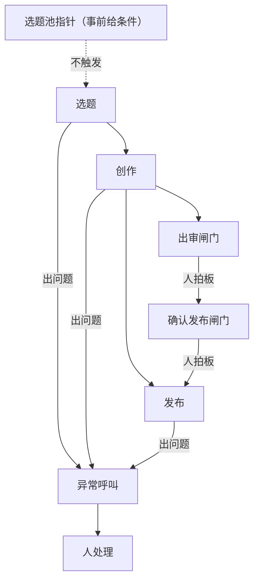

# 一条内容的端到端走查：五个动作和人出现的位置

一条内容从选题到发布，要经过五个动作：选题、取题、创作、出审、发布。这五个动作不是人一步步盯着走完的，其中三个不需要人出现，人只在另外几个位置真正决定过不过、发不发。

你手上现在还没有一件工具，能做的是先把这条线从头到尾摆清楚。这一课结束，你手上会多一份 `docs/00-walkthrough.md`，里面装着一张流程图和一份人出现点清单。

## 1. 一条内容要走的五个动作

五个动作各自吃什么、吐什么，写死在一份契约文件里。契约就是一份文件，写清楚这个动作认哪些输入、必须交出哪些输出，不管这个动作内部具体怎么做。上下游只认对方的输入输出，不去猜对方内部怎么做的。

| 动作 | 契约在哪定 | 输入 | 输出 |
|---|---|---|---|
| 选题 | `pipeline/1-ideate.md` | 账号定位、信息源、对标打法三份材料，加现存的选题池 | 候选全部入池（状态 `idea`），一份调研报告 |
| 取题 | `pipeline/1-ideate.md` 的状态翻转小节，取题顺序另在 `pipeline/daily-run.md` 定义 | 选题池 | 一条被选中的候选，加它专属的一份简报 |
| 创作 | `pipeline/2-create.md` | 那份简报，加账号的人设与写作规范两份材料 | 口播稿、成片、封面、一份发布物料 |
| 出审 | `pipeline/3-review.md` | 创作阶段的全部产物 | 一条结论：过、小改打回、拒绝 |
| 发布 | `pipeline/4-publish.md` | 发布物料里的标题、简介、话题标签、封面、媒体文件 | 一条真实发出去的作品 |

取题这一格看着像个动作，其实是一次记账：把选题池里排在最前面的那条候选，翻成一条独立内容，建出它自己的目录，写好那份简报。记账用什么工具做，是后面第 12 到 16 课要自己造的东西，这一课先记住这个动作存在，输入是选题池，输出是一条候选专属的简报。

给这条内容起名字这件事也发生在这一步。这个名字叫 slug，一个小写字母加短横线连成的短串。它既是这条内容的目录名，也是后面每一次记账、每一条命令提到这条内容时用的那个词。slug 没有固定取法，起完就不要再改，后面所有记账都认它。

创作那一格看起来一进一出，里面其实还要走好几步：写口播稿、把稿子做成画面、给每段配音、检查这批配音、录成片再出一张封面。这几步具体怎么走，是往后单条内容真正跑起来那一课的事，这一课只要知道它们全部收在同一份契约里，对外只暴露一个入口和几件产物。

如果这张表里某一格你现在填不出来，比如出审这一步具体谁来看、看什么，先别急着编，往下两节会把它拆开讲。


左边是选题池，右边是一条真实发出去的作品。图上五个动作全靠箭头两端的文件接力，只有最后两根箭头要人点一下才通。

这条线之外还有另一条，专门养选题池、做发布后复盘、核对对标账号，它不产内容，只产报告和修改提议。这一课先不管它，见第 21 课。

一条内容跑坏了，多半是某个动作的输入文件没找到或者没写全，回头查上一格该产出的东西是不是真的产出来了，而不是去查这个动作本身的代码写得对不对。

五个动作里，只有两处要人点头才能往下走。

## 2. 人出现在哪几个位置

工作日的定时任务读着编排文件自己往前跑，没有人在旁边一步步推。人只在三类信号响的时候出现。

第一类是事前给条件。取题默认按打分挑池子里最高的那条。想让某条插队，提前在选题池顶部写一行指针，取题时先认它。这个位置不出现，流水线照样往前走，人给的只是一个提前留好的条件。

第二类是闸门上拍板，一共两处。第一处是出审：创作产物齐了，人来判断过还是不过，或者要不要改。第二处是确认发布：出审过了之后，系统先拼出一条完整的发布命令，把这次要用的标题、话题标签、封面路径、媒体文件全部原样打印出来，但不执行，这叫 dry-run。人看着这份打印结果点头确认，命令才真的跑。过审说的是这条内容合格，真发是另一件事，两次授权分开要，理由写在发布契约里：发布这个动作做完了收不回来。

第三类是异常时被叫醒：选题池空了、配音要花钱的那个服务余额不够、录制失败重试还是不行、审批通道故障，都会被推送提醒。配音质检那里还有一条硬上限，最多三轮，第三轮还不过就停下来交给人，不会一直重试下去。

| 位置 | 什么触发 | 人做什么决定 | 人不管会怎样 |
|---|---|---|---|
| 选题池 | 不触发，条件提前给好 | 钦点哪条先做，或者不钦点 | 按打分取最高，流水线照跑 |
| 出审 | 创作产物全部就绪 | 过、小改打回、拒绝 | 停在这里，不进发布 |
| 确认发布 | 出审过了之后的 dry-run 结果 | 认这条发布命令和这份物料 | 命令已经拼好，但不会执行 |
| 异常呼叫 | 池子空、服务余额不够、重试超次、质检满三轮 | 决定怎么处理 | 当天没有产出，而且如果没人上报，也没人知道 |

异常呼叫这一类写在编排文件里的规矩很直：只写本地日志不算上报。仓库真发生过这样的事，连续六天流水线空跑，日志里每天都记了一行，六天没人看见。日志是给事后查的，当天没产出这件事，得当天有人知道。

如果流水线跑完既没有产出也没有报错，多半是取题那一步池子空了，按规矩这种情况要主动推提醒，不是等你自己发现。

真正会让流水线停下来等答案的，只有出审和确认发布这两处闸门。异常呼叫不挂在固定的哪一步上，选题、创作、发布任何一个动作出问题都可能触发它，算不上第几类位置，只算一类会响的信号。闸门上人要拍板，拿到手的东西越齐全，越省时间。出审这道闸门前面，机器已经先查过一轮。

三类信号各自挂在哪里、异常呼叫为什么不挂在固定一步上，看这张图。



## 3. 出审之前，机器已经查完的七项

出审那一处，人拿到手的是什么，决定拍板要花多久。创作契约里写死了一道终检闸，七项，全过才允许交去出审。人审是另一张单子，六项：事实、时效、定位、语气、合规、观感。这六项写在出审契约里，没有对应的检测脚本，全靠人凭经验现场判断。

七项判据要不要归脚本管，看一条准则：这一项的结论能不能被一条命令判成真假。逐字比对文本能，量一段静音多长能，抽帧比对画面能，按格式取一个字段能。技术结论对不对、封面好不好看，写不出这样一条命令，就归人。

| 判据 | 查什么 | 谁来判 | 第几课定、第几课造 |
|---|---|---|---|
| 声画一致 | 分段文案、画面上的文案、成片字幕三处逐字一致 | 脚本 | 07 定检查点，08 造脚本 |
| 音频自然度 | 一段音频里连续静音不超过 0.45 秒 | 脚本 | 07 定阈值，08 造检测和去停顿脚本 |
| 钩子冷启动 | 第一句不靠上一集也站得住 | 人 | 05 写口播稿时立规矩，17 进人审卡 |
| 事实与合规 | 技术结论有出处，没有违禁词和夸大承诺 | 人，AI 先自查 | 03、04 写进账号规则，17 进人审卡 |
| 封面 | 竖版比例，不拿横屏视频帧充数 | 人 | 05 出第一张封面 |
| 音画一致 | 网页组件里的大字文案和口播稿逐字对照 | 人（脚本只列出差异） | 08 造对照脚本 |
| 发布物料 | 标题、简介、话题标签这些字段能被发布那步按格式取到 | 脚本 | 20 造发布 skill 时定字段并验证真被取到；18 的确认发布卡显示的是同一批字段 |

七项里有四项归脚本，三项归人。这个比例不是一开始就这样定的，是先有了一次真实的自查记录，才回头把七项摆出来。仓库里有一条内容出审前留下的注释就是照着这七项逐条写的（`content/2026-07-08/spec-driven-development/meta.yaml`）。声画一致那项，十五段分段文案和画面文案逐字比对全部一致。音频自然度那项，第一轮质检十五段里有十四段带死气，去停顿之后重新合成，第二轮全过。音画同步那项，抽帧复核了十五步，没有滞后。发布物料那项，五个字段的键名都能被发布那步按格式取到。这份记录里也留了一句诚实的话：几个词的实际读法有没有错，机器没有听觉核实不了。这一条本来就不在七项判据要管的范围里，留给出审时的人重点听，算在人审那张单子的语气一项里。

如果七项一项没查完就把成片推给人，人只能自己重新听一遍、重新逐帧看一遍，事实、语气、定位这三项真正要人判断的，反而被占去了时间。两张单子都在管质量，分工按谁的时间划：脚本能给出结论的那几项，不该占用人在闸门上的那几分钟。

## 4. 让 AI 把这两样先画出来

前三节看的是一套已经跑了一段时间的流水线，怎么切、怎么分工，是它自己走出来的样子。你的那套怎么切，取决于你自己的账号和习惯，动作数目、契约怎么命名，都可以不一样。

你手上还没有契约文件可以参考，能给 AI 的输入只有你自己口述的流程。把这套口述整理成一张流程图和一份人出现点清单，是下面这条 Prompt 要做的事。

```
我要建一条内容生产流水线，从选题到发布。我打算这样切：
<逐段口述:每段叫什么,吃哪些东西,吐哪些东西>
人会在这几个位置出现：
<逐条口述:位置、由什么触发、人做什么决定、人不管会怎样>
另外，凡是要花钱、调用外部服务、有重试上限的步骤，
它出问题时提醒我谁会知道。
把结果整理成 docs/00-walkthrough.md，分三部分。
第一部分一张表：动作、契约文件、输入、输出，我没说到的格子写待定，不要替我猜。
第二部分照这张表画一张 mermaid flowchart，节点是动作，箭头标交接的文件；
写不出具体文件名的箭头，标"文件待定"，不要替我编一个看着像真的名字。
第三部分一份人出现点清单，每条四件事：在哪一步、由什么触发、人做什么决定、人不管会怎样。
最后单独列一节：我口述里前后矛盾或者说不清的地方。
```

拿到结果审三点。

第一点，人出现点清单如果只有出审和确认发布两处，把异常呼叫那一类补上，这也是流程的一部分，不该被漏掉。

第二点，凡是它填得比你口述还完整的格子，问一句这是从哪来的。补出来的格子对应的往往是你自己也没想清楚的地方，先想清楚那里，再改表。

第三点，人不管会怎样这一列有没有填满。哪一条填不出来，说明这个位置要么不该停，要么停了也没人知道。

如果 AI 只列出两个停下来的位置，回头看看你口述里是怎么说异常情况的。异常一旦被你自己说成了出错处理的细节，它就会当成实现细节收走，不会单独摆成一个人出现的位置。

## 5. 三个固定的位置

数一遍会发现，人固定出现的位置只有三个：出审、确认发布，加一个提前留条件的选题池指针。其余的动作靠文件接力，人只在没写清楚的地方点头。

这个结论只在一个前提下成立：出审前面那七项检查已经写成了能跑出真假的东西。这套只在一个账号上跑了几个月，换个题材、换个人还撑不撑得住，没有数据。这一课也只是走了个过场，怎么定这七项的阈值、写成什么样的脚本，都在后面几课。

流程图和人出现点清单有了，可你手上一个工具都没有。这些环节要跑起来，机器上得先装齐哪些东西？
