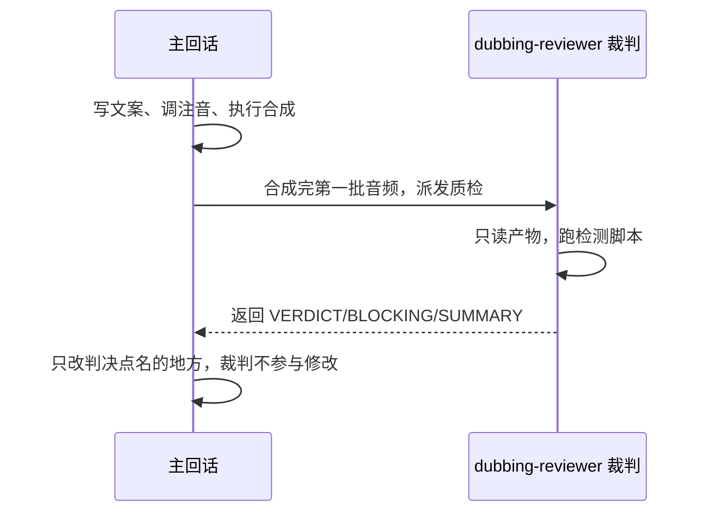
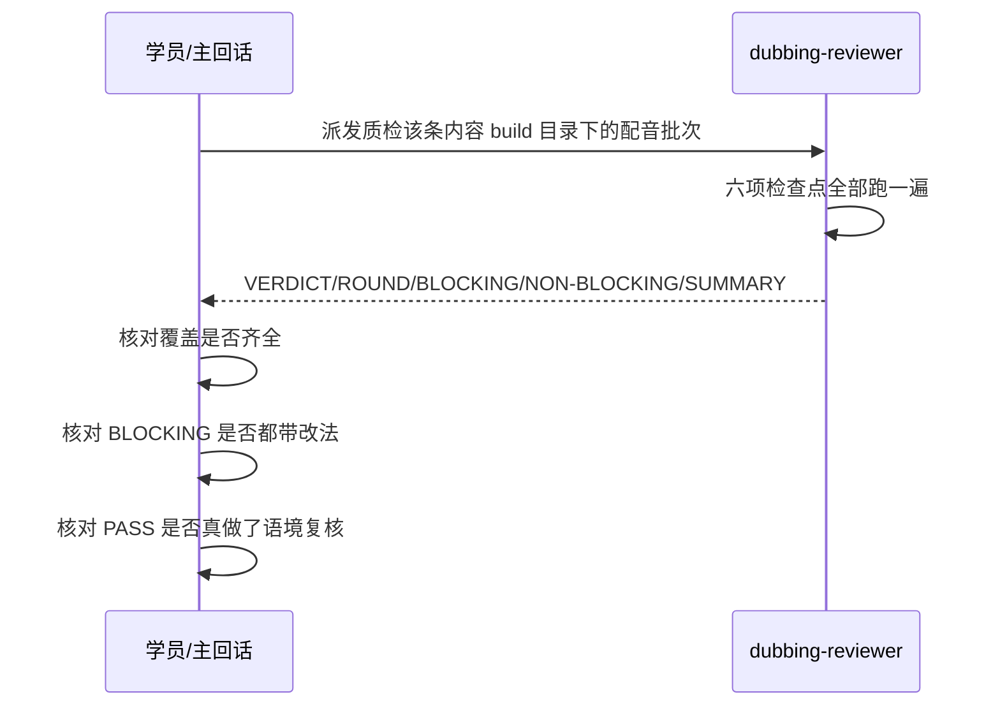

# 裁判与选手分离：判的角色和改的角色分开

判断权和执行权如果集中在同一个上下文里，裁决往往容易不自觉地偏向宽松放行。把审核者与修改者在权限上物理隔离，核心在于工具白名单中不配置 Edit 和 Write，而非依赖模型的自觉约束。这一课的任务，就是把这一原则落实为一份规范可用的子代理配置。

上一课交付了完整的 `dubbing-check` skill：包括六个检测脚本（`check-completeness.mjs`、`check-pace.mjs`、`check-silence.mjs`、`check-source-sync.mjs`、`check-pronunciation.mjs`、`check-av-consistency.mjs`）、一个修复用的 `depause.mjs`，以及一份把它们串成检查清单的 `SKILL.md`。客观数字已经具备，但评判依旧由人工进行。让负责生成文案与音频的 AI 自行审查产出，是否可靠？这一课把判断职责交接出去，同时确立审核角色不得修改文件的硬性约束。输入包括上一课完成的六个检测脚本及其退出码规范，以及第 05、06 课实际生成的配音文件。本课产出两项具体成果：一份规范的 `dubbing-reviewer.md` 子代理定义，以及一份基于真实音频的质检判决输出。

## 一、谁来判：执行和判断不能是同一个角色

第 07 课对六项检查点做过明确分类。真相源不同步、合成不全、段内死气这三项，脚本能够直接输出是非结论，判决方归属于机器。语速离群、多音字读错、组件大字不一致这三项，脚本仅提供候选清单，判决方归属于人工。这里的人工不一定需要账号主每次戴上耳机逐段复听，可以由独立的智能体角色承担。只要该角色不与创作阶段共享上下文，其判断视角就保持了客观独立。

如果让同一个上下文既负责执行又负责审核，问题便随之而来。写文案、调注音、执行合成这些动作，通常由同一个 AI 在连续对话中推进。如果在同一会话中要求它检查刚刚生成的产出，它接收到的证据往往夹杂着此前决策的推理过程。此时模型倾向于验证既有选择的合理性，缺乏重新审视的批判视角。这种现象与模型是否认真无关，根源在于生成与审核共用了同一段推理历史，审查者的视角从一开始就受到了先前决策的锚定。

通过一组对比可以更直观地理解：

```
反例对照：同一个 AI 既负责写稿又负责审核自己的产出，容易受到上下文暗示，不知不觉放宽核验标准。
正解：拆成两个角色，一个负责修改与合成（主回话），一个负责质检与裁决（子代理），两边看到的都是同一批客观数字，但负责判断的角色不参与修改。
```

参考流水线的创作契约对此做了清晰界定：合成第一批音频后，调用 `dubbing-reviewer` 子代理审查质量。两者的职责分离体现为裁判只判不改，修复与重新合成全部交回主回话处理。在第 03 课起草、第 07 课完善的 `pipeline/2-create.md` 中，配音审批闸口记录了改动落点，但尚未明确裁判角色的名称与只判不改的边界规则。本课完成后，需要将这两项规则同步补充到契约中。

裁判和主回话怎么交棒，画成时序是这样。



## 二、工具白名单：用配置限制裁判的修改权限

只判不改的约束必须写入代理配置文件本身，不能仅作为提示词中的建议。如果仅仅在提示词中叮嘱裁判不要修改文件，而在工具列表中依然保留 Edit 和 Write，这种约束就仅仅是一句软性建议。当上下文变长时，模型很容易忽略这条约定。而直接在工具配置中剔除这两个工具，裁判即使产生了修改意图也没有调用入口，约束便落成了硬性屏障。

参考流水线中提供了 `.claude/agents/dubbing-reviewer.md` 作为形态参考，当前工程需要让 AI 起草一份专用的子代理定义。可以先观察参考文件的结构设计。frontmatter 中的 name 设为 `dubbing-reviewer`，description 明确标明该角色专注于配音批次审查，遵循只判不改原则。tools 列表仅保留 `Bash`、`Read`、`Grep`、`Glob`，剔除 `Edit` 与 `Write`。

```
Prompt：起草一份子代理定义 dubbing-reviewer.md 的 frontmatter：name 叫 dubbing-reviewer，
description 写清它只审配音批次、只判不改，FAIL 由主回话修复重合成，tools 只给 Bash、Read、
Grep、Glob，不给 Edit、Write。
```

生成配置后需要重点确认两点。
第一，核验 tools 列表中是否存在 Edit 或 Write。如果出现则需要立即剔除。
第二，检查 description 是否准确传达了只判不改的职责范围。审核角色必须明确自身的权责边界，后续的评判逻辑才能稳定执行。

需要客观认识这种约束的边界。从工具列表中移除 Edit 和 Write，只是去除了直接编辑文件的工具，并没有建立严格的沙盒环境。Bash 工具依然保留在白名单中，理论上通过 shell 重定向依然可能写入数据。保留 Bash 是因为执行检测脚本需要命令行环境。这一配置主要防范的是模型使用常规编辑工具主动修改代码的行为。

为了确保环境整洁，可以在判决后核对 `git status`。正常的质检过程工作区不应产生新的文件变动。如果发现工作区出现了非预期的修改，常见原因是裁判在给出改法时顺带通过 Bash 执行了写入命令。此时只需调整审查流程，禁止在终端中直接写入文件即可。

明确了权限边界后，还需要进一步规范裁判解读检测指标的具体口径。

## 三、裁决口径与输出格式

每一次判决返回 FAIL，主回话都需要重新走完修改文案、重新合成与再次送审的完整循环。这一流程存在一定的执行成本，因此裁判需要准确识别真实缺陷，避免将统计偏差误判为阻断性问题。判定标准与输出格式都需要保持严谨统一，避免因提示词模糊导致同一批音频在不同轮次中得出摇摆不定的结论。

### 3.1 六项检查点各自的裁决口径

六个检测脚本在设计上分为两类。`check-completeness.mjs`、`check-silence.mjs`、`check-source-sync.mjs` 运行后直接输出明确的 exit 1 或 exit 0，退出码即代表裁决结果，无需二次推理。`check-pace.mjs`、`check-pronunciation.mjs`、`check-av-consistency.mjs` 仅输出可疑候选清单，退出码固定为 0，具体是否构成问题需要由裁判代入语境逐项甄别。

| 检查点 | 脚本 | 口径类型 | 怎么判 |
|---|---|---|---|
| 合成完整性 | `check-completeness.mjs` | 硬门槛 | 段缺失、字节异常或时长异常，脚本 exit 1，直接 FAIL；批量合成偶发接口限流失败，失败段若旧 mp3 还在会被静默保留，这条判据防的是这种情况 |
| 段内死气 | `check-silence.mjs` | 硬门槛 | 段内非句读位置静音超过 0.45 秒，脚本 exit 1，直接 FAIL；0.45 秒是第 07 课定下的起步值，来自参考流水线一次真实返工 |
| 真相源同步 | `check-source-sync.mjs` | 硬门槛 | `audio-segments.json` 每段文本跟对应的 `narrations.ts` 不相等，脚本 exit 1，直接 FAIL；逻辑上要先于完整性检查跑，文案本身不对，数完整没有意义；参考流水线上也有过真实事故：改了口播文案没重新抽取分段文本，连过两轮组件截图检查都没抓出来 |
| 语速离群 | `check-pace.mjs` | 候选 | 脚本按均值和标准差标出偏离段，裁判要看这段文案里有没有较多英文词，比如出现 `query.ts`、`Anthropic`、`QueryEngine` 这类词，念出来实际用的时间会比字数暗示的长，数值偏低是折算方式带来的假象，不算真离群；排除这类假象之后仍然偏离才判 FAIL |
| 多音字读错 | `check-pronunciation.mjs` | 候选 | 脚本按多音字表列出候选，裁判要逐条判断这段语境里该读哪个音；读音覆盖是按整段生效的，一段话里同一个字要读两种音，现有的注音配置无法局部拆分，需要通过修改文案调整，这种情况不能仅由裁判简单标记 FAIL 了事 |
| 组件大字不一致 | `check-av-consistency.mjs` | 候选 | 脚本把组件里的中文长句和对应段口播原文并排列出来，裁判要判断这句是逐字呈现的整句还是概念标签，只有整句标题或行动号召对不上才判 FAIL，标签不算 |

段内死气与真相源同步这两项硬门槛，其判据均能对应到参考流水线上的历史排障记录。合成完整性检查主要针对网络波动导致的偶发限流，防止未更新的旧文件被误判为当次生成结果。语速、多音字以及音画一致这三项指标，由于天然依赖语义语境，无法由脚本单纯通过退出码裁决，因此由裁判结合具体上下文进行逐条复核。

```
Prompt：给 dubbing-reviewer.md 补裁决口径表：完整性、死气、真相源同步三项，脚本判 FAIL
就直接 FAIL；语速离群、多音字、音画一致三项，脚本只给候选，裁判要逐条判断是不是真问题
（比如含英文词的段字面语速偏慢是统计假象，不算真离群）。再固定输出格式：VERDICT/ROUND/
BLOCKING/NON-BLOCKING/SUMMARY 五段固定结构，BLOCKING 每条必须带可直接执行的改法。
```

### 3.2 输出结构固定

裁判完成质检后的输出同样需要规范化，避免自由发挥导致信息缺失。输出格式固定为五个段落。VERDICT 仅能为 PASS 或 FAIL。ROUND 记录当前执行轮次，配合熔断机制使用。BLOCKING 逐条罗列阻断性缺陷，格式统一为检查项、段落号、具体异常以及直接可操作的修复建议。NON-BLOCKING 用于记录无需拦截但建议关注的提示。SUMMARY 提供一句话概括。

给出修复建议时，落点必须与第 07 课确定的规范保持一致。参考流水线文档曾存在将单段调速记入 `rec/segment-overrides.json` 的历史遗留描述，与当前架构不符。本体系统一规范将参数调整写入 `build/` 目录下的 `tts.config.json` 中的 `overrides` 字段。操作细节必须服从整体契约，裁判给出的修改建议应严格遵循这一路径。标准输出示例如下：

```
VERDICT: FAIL
ROUND: 1/3
BLOCKING:
- [语速离群] coldopen/2 剔停顿后语速明显偏慢，段内英文词不足一个，非折算假象
  → 改法：build 内 tts.config.json 的 overrides 给该段加 {"coldopen/2":{"speed":1.15}}
NON-BLOCKING:
- 无
SUMMARY: 一处真离群，其余五项过，改完重合成该段再复审
```

定义制定完成后，需要在真实音频工程中实测运行，验证其有效性。

## 四、用真实配音跑一轮质检

配置不能只停留在文档层面，必须在真实环境下运行并拿到明确的判决结果。测试基于第 05、06 课生成的音频工程展开，目录位于 `content/<发布日>/<slug>/build/`。其中包含 `audio-segments.json`、按章节存储的音频文件，以及网页展示源码目录 `src/chapters/`。这是真实存在的工程目录与资产，并非临时拼接的样本数据。

将编写好的 `dubbing-reviewer.md` 放入 `.claude/agents/` 目录，同时在 `pipeline/2-create.md` 的配音审批环节补充对应的裁判角色名称与只判不改原则。随后在主会话中指派该代理进行质检：

```
用 dubbing-reviewer 子代理，审一遍 content/<发布日>/<slug>/build/ 这条内容的
配音批次，轮次填 1/3，六个检查点全部跑一遍，给出完整的 VERDICT/ROUND/BLOCKING/
NON-BLOCKING/SUMMARY 判决，把结果存进这条内容目录留档。
```

契约规则完善后，后续翻阅流水线文档即可清晰获知审批节点的分工与权限。获得审核结果后，需要关注三个重点：
首先，检查六项检查点是否全部被覆盖，特别是逻辑上具有前置依赖的真相源同步检查。
其次，确认 BLOCKING 中列出的每一项问题都附带了明确可操作的修改建议。如果只列出问题而缺少具体改法，则视为未完成交付。
最后，若判决结论为 PASS，需要抽查候选类指标是否真正经过了语境复核，而非机械照抄脚本摘要。人工抽听成片时，若发现听感异常却获得了 PASS 判定，常见原因是裁判仅审阅了语速脚本的均值统计而忽略了逐段核实。此时应在 Prompt 中强化逐项甄别的要求。

把这一节的真实质检走一遍完整时序，含拿到判决后要核的三件事。



通过独立裁判角色，质检流程能够自动化产出 PASS 或 FAIL。当判决为 FAIL 时，如何由主回话进行修复、重审并在合理边界内终止循环，将在下一课深入讨论。
