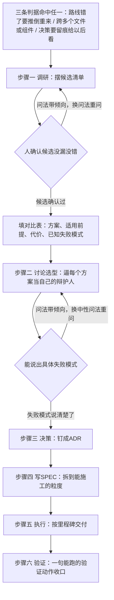

# SPEC 方法：从调研到验证的六步

上一课（第 10 课，自愈回路与三轮熔断）结尾留了一个没答完的问题：自愈回路合上了，可你一路走来手改了一堆 meta.yaml，后面还有几件大得多的东西要造，状态中枢、飞书闸口、控制台，一条 prompt 已经不够用了，怎么让 AI 造这种量级的东西。这一课要回答这个问题，答案的分量几乎全压在一步上：讨论选型。前面调研摆出候选、后面决策写 ADR，这些步骤都好懂，真正难的是逼着 AI 承认它自己推荐的方案也会输。不逼这一步，前面摆再多候选也只是陪衬。

第 10 课交付的是一次真实发生过的自愈过程：dubbing-reviewer 判第一轮 FAIL，按判决类别逐条改 tts.config.json 的 overrides、改文案、去停顿，重新合成，判第二轮 PASS，整个过程记进了那条内容目录里的一份记录。三轮仍不过怎么办也定了，meta.yaml 里没有专门的挂起状态，让 status 留在 drafting，另加一行说明卡在哪一轮，按阻塞即上报的铁律通知人。这条回路能转起来，前提是这件事的规模刚好能装进一条 prompt：改 overrides、改脚本、去停顿，都是单文件单步骤的事，错了重跑一次就行。

这一课要处理的是另一类事：规模大到一条 prompt 装不下的事，比如后面要造的 media CLI、飞书审核闸口、本地控制台。这一课不造它们中的任何一个，只把方法定下来。输入是十课攒下来的全部经验，尤其第 10 课那次真实自愈过程留下的教训。产出两件东西：一份 docs/spec/ 目录约定，管六步方法的产物落在哪；六步方法的四件套模板，调研、ADR、执行方案、施工记录，管每一步的产物长什么样。这两件东西定完，后面 12 到 16、18 到 19、26 到 28 课要处理 media CLI、飞书闸口、控制台这三件大事时，直接引用这一课定的写法，不用每次重新商量格式。

## 1. 从一条 prompt 到大件：什么时候要换挡

要不要走六步，看的不是这件事要花多少字或者多少行代码说清楚，看的是这件事有没有一条走错了要推倒重来的路。第 8 课那六个检测脚本合起来两百来行；后面要造的控制台里，光是负责解析进程输出的那一个模块就有两百来行，而它只是五个包里的一小块。真正拉开差距的不是行数：后一件事光是这个模块该怎么组织就有几条路可选，选错了会影响后面好几个包的接口形状；前一件事当时几乎没有别的活法，六个检查点对应六个文件是唯一顺理成章的组织方式。

判据具体拆成三条，任何一条命中就该走六步，不必三条全占。这三条判的是要不要走六步，跟第 6 课那张验证信号表里判一条内容检查点能不能写成断言的那三条判据，是两码事，别混在一起：

- 有没有一条路线一旦选错就要推倒重来：选错了是不是只能改一版重来一次，还是会牵连已经写好的其他文件。
- 这件事跨不跨多个文件或多个组件：改一个文件能搞定的事，通常也没有真正意义上的互斥路线。
- 决策要不要留痕给以后的人看：半年后有人问当初为什么这么选，答不上来，说明这件事原本就该走六步。

三条判据都是在回答同一件事：这个决定会不会在未来某个时刻反过来找你麻烦。命中了，接下来的六步能做的事，是提前把以后会不会后悔这个问题在纸面上过一遍，而不是等代码写完了才发现选错了。

下面六步都拿第 8 课那六个检测脚本当例子，它体量小、选错代价小，几百字能走完一轮。第 8 课当初的判断没错，这里借它把六步的动作过一遍。真正需要靠六步硬啃的三件大事，media CLI、飞书闸口、控制台，规模大得多，选错的代价也大得多，没法在一课的篇幅里演练完。

六步的每一步都要落一份文件，这份文件落在哪，得先定下来，不然写到第三步才发现文件到处乱放，后面几门课还要重新商量目录。约定很简单：在 docs/ 下建一个 spec/ 目录，子目录按事项代号命名，一个代号放一件大事的四个文件，按编号排：

```
docs/spec/media/
├── 00-调研.md
├── 01-ADR.md
├── 02-执行方案.md
└── 03-施工记录.md
```

参考流水线用的是日期加事项，每轮迭代另起一个日期文件夹；这门课的三件大事各占一个代号目录，media、feishu-gate、console，够用，不用跟着日期滚动。你手上现在还没有 docs/spec/ 这个目录，这是新定的，跟着这一课的产出建起来就是了。往后 12 到 16 课处理 media CLI 落在 docs/spec/media/、18 到 19 课处理飞书闸口落在 docs/spec/feishu-gate/、26 到 28 课处理控制台落在 docs/spec/console/，产出的文件都落在这个约定里，不用每门课重新商量放哪。

判据摆出来了，六步从哪一步开始，先把选型空间摊开。下面这张图看六步怎么串起来，以及哪两处会打回去重来一轮。



## 2. 调研：把选型空间摊开

调研这一步容易被走成漫谈，让 AI 自由发挥聊一圈可能性，聊完什么也没落下。调研要做的是两件很具体的事：先让 AI 把互斥的候选摆成一张清单，人确认候选没漏没错之后，再逐个填进同一张表。表的列必须固定，不然十二课以后每门课的调研节格式都不一样，没法互相比。

### 2.1 让 AI 先出候选清单，人确认再往下走

先出候选清单这一步不能省。直接让 AI 边想边填表，它会把自己更倾向的方案写得细，不那么倾向的方案一笔带过，填出来的表看着完整，其实只有一个方案是认真填的。先把候选清单单独要一次，人看过、确认候选没漏项，再进下一步。

第 8 课那六个检测脚本是分开写的，契约、样板、批量复制、打包成 skill，一路走下来没有一处停下来问过要不要合并成一个大脚本，当时选六个独立脚本，直觉选对了。现在借它练一遍调研，走法是先不管当初有没有认真比过，把两条路都摆出来：

```
我要给"六个配音检测点该怎么组织"这件事定一个方案。先不填表，只列出所有互斥的候选，
每个候选一句话说清楚它的核心思路，列完等我确认。
```

AI 交回来的候选清单大致是两项：方案一，六个独立脚本，一个检查点一个文件；方案二，一个大脚本，内部按检查点分函数，一次调用跑完六项。候选清单确认没漏之后，才进入填表。

如果 AI 只交回一个候选，多半是问法里已经带了倾向，比如把问题问成怎么把六个脚本合成一个，AI 会顺着合并这个方向去想，想不到另一条路。换成不预设方向的问法重问。

### 2.2 对比表怎么填：方案、适用前提、代价、已知失败模式

调研节的对比表固定四列：方案、适用前提、代价、已知失败模式。适用前提回答这个方案在什么场景下成立，代价回答选它要多付出什么，已知失败模式回答它会在什么情况下出问题，这三列合起来，后面讨论选型那一步要问的问题，调研阶段先粗填一版，讨论选型再逼细。

套进六脚本这个例子，表大致是这样：

| 方案 | 适用前提 | 代价 | 已知失败模式 |
|---|---|---|---|
| 六个独立脚本 | 检查点之间输出格式和退出码策略不同，硬门槛判 PASS 或 FAIL，候选类只列风险点 | 六份文件要维护同一套输入解析逻辑，容易在细节上跑偏 | 六个脚本各自实现输入解析，漏改一处会导致某个脚本单独读错路径 |
| 一个大脚本，按检查点分函数 | 六项检查逻辑高度相似，想复用一份入口代码 | 改一处检查点的判断逻辑，理论上不该影响别处，但都在同一个文件里，回归测试的范围不好收窄 | 硬门槛和候选类的退出码语义混在一次进程返回值里，裁判读结果时分不清是硬失败还是候选提示 |

表填完，这两行看起来都算合理，方案一的代价和方案二的失败模式都只是看起来可能有问题，还没被真正逼出来。这是调研节该停下的地方：表里每个方案的优点都是 AI 自己写的，偏向性还没被逼出来。

## 3. 讨论选型：逼每个方案当自己的辩护人

调研节填出来的表，看着两个方案势均力敌，这是假象。AI 列方案的时候，会不自觉把自己更倾向的那个写得饱满，把另一个写得单薄，不是存心藏着掖着，是同一次生成里，第一个想到的方案自然会被想得更周全。讨论选型这一步单独存在，就是为了把这层偏向逼出来：不问哪个更好，问每一个方案自己你在什么情况下会输。

问法要具体，松散地问这个方案有什么缺点效果不好，AI 顺嘴接一句无关痛痒的缺点就算交差了。辩护式提问对每个候选依次要求四件事：成立的前提是什么、代价是什么、主动交代它会在什么情况下输、不许下综合来看更好这类结论。第四条最容易被漏掉，一旦 AI 在两个方案都过了一遍之后忍不住给个总评，说明它又开始替你拍板了，拍板的事留给下一步。

```
针对"六个独立脚本"和"一个大脚本按检查点分函数"这两个候选，分别扮演它们的辩护人，
依次回答四件事：
1. 这个方案成立的前提是什么，什么场景下选它是对的
2. 选它的代价是什么，谁来承担这份代价
3. 主动交代它已知的失败模式：什么情况下它会输，输给哪个候选
4. 不要下"综合来看方案更好"这类结论，只交代前三条
两个方案都要独立走完这四步，不要在中途比较。
```

这条 prompt 套进六脚本这个例子，AI 交回来的辩护大致是这样。六个独立脚本这一边：前提是六项检查的判断逻辑和退出码策略本来就不同，分开写让每个脚本的职责边界一眼看清；代价是六份文件都要重复一遍读 audio-segments.json 的逻辑，契约有一处没对齐，六个脚本里可能只有一半跟着改；失败模式是脚本数量往上涨到十几个的时候，裁判要挨个跑六到十几条命令，调用成本线性增长。一个大脚本这一边：前提是判断逻辑高度相似，统一入口能省掉重复代码；代价是改一处检查点的逻辑，理论上不该影响别处，但六项判断挤在同一份文件里，想确认真的没影响到别处，得把六项都跑一遍回归；失败模式是硬门槛和候选类的退出码混在同一次进程返回值里，裁判读到退出码是 1 分不清是哪一类出了问题，还得解析输出内容才能确定。

这两组失败模式，比调研节表里那两句代价要具体得多。这才是讨论选型这一步真正要的东西：把看起来可能有问题逼成具体会在哪种情况下输。

如果套用这条 prompt，AI 对某个候选说不出具体的失败模式，只重复它在调研节已经写过的代价，多半是问法带了倾向，比如问成六个独立脚本是不是比大脚本更清晰，AI 会顺着更清晰这个方向往下答，变成在附和，不是在辩护。换一个不带倾向的问法重问，四条依次单独问，不放在一句话里一起问。

每个方案的弱点都被自己说出来了，可以拍板了。

## 4. 决策：把选择钉成 ADR

讨论选型逼出来的是两组具体的失败模式，决策这一步要做的是拍板，把选择和理由钉成一份看得懂的记录。这份记录只有四项：决策、理由、被否方案、反悔成本。多写别的，比如把执行细节也塞进 ADR，就是在替下一步的执行方案抢戏，ADR 回答选了什么、为什么，不回答具体怎么做。

六个独立脚本的失败模式是调用成本线性增长，大脚本的失败模式是退出码语义会被混在一起，裁判分不清硬门槛失败和候选提示，两条失败模式哪个更要命，看下一课谁来读这份输出。第 9 课要造的裁判角色靠退出码分辨要不要拦截，退出码语义混在一起，裁判就得多解析一层输出文本才能判断，这条代价直接影响下一课的设计。调用成本增长的影响面窄得多：配音批次一天顶多合成几次，六到十几条命令跑一遍是分钟级的事，多花的是机器时间，不牵扯别的组件要跟着改设计。

```
决策：六项配音检查点各自写成独立脚本，不合并成一个大脚本。
理由：硬门槛（判 PASS 或 FAIL）和候选类（只列风险点）两类脚本的退出码语义不同，
  合并成一个进程会让裁判角色没法直接靠退出码分辨是硬失败还是候选提示，这条代价比
  调用成本线性增长更要命，因为裁判角色本来就是靠退出码做判断的。
被否方案：一个大脚本，按检查点分函数，统一入口。
反悔成本：中。往后检查点数量涨到十几个，调用成本会变成真实负担，到时候要把六个
  脚本收拢成一个带多个子命令的工具，但退出码语义仍然按硬门槛和候选类分开，不会
  退回到一个进程混着返回。
```

这条 ADR 跟第 8 课实际交出来的六个独立脚本是同一个结论，走六步方法要的是把为什么这么选这句话钉在纸面上，答案本身未必会变。如果第 8 课当初真走过这六步，这条 ADR 现在就能直接拿出来给后面接手的人看，不用每次有人问起为什么不合并成一个大脚本都重新讲一遍。

## 5. 写 SPEC：把决策展开成可施工的规格

ADR 落了纸，但落纸的决策还变不成代码。中间差一份能让 AI 照着施工的规格，这份规格就是执行方案，固定四节，节名不许各课改写：实施步骤、命令或接口或页面乘功能乘详细设计、对外契约、风险与待定项。这份模板不是这一课现造的，是参考流水线写状态中枢和控制台那套材料时已经在用的形状，这一课把它定成往后处理大件事的课统一照抄的模板：

```
# 0X-<部分>执行方案
## 1. 实施步骤    第 1 步…第 N 步；每步 = 做什么 / 产出物 / 验收标准 / 依赖
## 2. <命令|接口|页面> × 功能 × 详细设计    逐条穷举
## 3. 对外契约    本部分提供给 / 依赖其他部分的接口
## 4. 风险与待定项    拍板未覆盖的点全部落这里，标注需要用户裁决的项
```

第 2 节的具体单位按主题换，处理命令行工具就写命令乘功能乘详细设计，处理接口就写接口乘功能乘详细设计，处理页面就写页面乘功能乘详细设计。这一节要求逐条穷举，不许写其余命令依此类推这类省略，第 8 课那六个脚本的详细设计部分，实际上就是逐条写清楚每个脚本的输入、判断逻辑、输出格式、退出码，这正是第 2 节该有的密度。

第 4 节风险与待定项最容易被漏掉，但它恰恰是六步方法能提前拦住麻烦的地方。第 10 课有一个真实例子：参考流水线里 pipeline/2-create.md 写的是改动记进 build 内 tts.config.json 的 overrides，但参考流水线那份 .claude/agents/dubbing-reviewer.md 定义给的示例改法写的是 segment-overrides.json，两处不是同一个文件；第 10 课把这条口径统一成了 tts.config.json 的 overrides，你自己那份 dubbing-reviewer 定义现在用的也是这一个口径，没有遗留冲突。这类口径打架，如果第 8 课当初写过一份执行方案，第 4 节风险与待定项本该提前写一条：候选类检查点的建议落在哪个文件，需要提前钉死，不能各写各的。提前写下来，不用等到第 10 课真撞见两处口径不一致才回头统一。

六脚本这个例子的第 4 节风险与待定项，可以这样填：候选类检查点（语速离群、多音字读错、音画一致）的判断结果该记进哪个文件，当时没有明确钉死，建议按 build 内 tts.config.json 的 overrides 统一，需要在造裁判角色时跟示例文档对齐一次。

规格能施工了，但纸面上的规格和真跑起来的东西之间还差一步。

## 6. 执行：照 SPEC 交付里程碑

执行不是把 SPEC 一次性全部实现完，是切里程碑，每个里程碑给一个能跑的出口条件。出口条件必须是一句能验证真假的话，基本完成、差不多了这类话判不了真假，不算数。

参考流水线自己造控制台那套 CLI 时，第一个里程碑的出口条件原文是真实仓 media check 通过，YAML 注释零丢失；第二个里程碑的出口条件原文是全仓状态写路径唯一，连续 7 天内 meta、backlog、dashboard 机器区的每次变更均能在 audit.jsonl 找到对应行。这两句话有一个共同点，读的人不用再问一句怎么算通过，条件本身已经把验证动作说清楚了。

- 反例：六个检测脚本基本写完了。
- 正例：对 build/ 目录跑六个脚本，故意删掉一段 mp3 制造缺失，check-completeness.mjs 的退出码要从 0 变成 1；语速离群、多音字读错、音画一致这三个候选类脚本，不管输入是什么，退出码恒为 0。

出口条件写成基本完成这类话，多半是心里其实没想清楚通过具体指什么，写的时候先把这句话空着往下走，回头再补一句能跑的验证动作，而不是让它一直空着。

里程碑出口条件写清楚了，但过了出口条件不等于东西是对的，出口条件测的是跑没跑过，不等于状态只有一个地方能写这类更深一层的东西是不是真成立。

## 7. 验证：一句能跑的验证动作收口

验证要验的东西，往往是写代码的人自己以为已经对了的地方。比如状态只有一个地方能写这句话，光靠肉眼扫一遍代码容易觉得没问题，毕竟自己写的时候确实只在一个地方调用了写入函数，但别的文件有没有偷偷绕过去写，肉眼扫一遍容易漏掉一条隐蔽的调用路径。验证要留下能回查的证据，不能只凭看过了、应该没问题。

验证节的产出是一份施工记录，按里程碑逐行记：里程碑、出口条件、实际结果、卡在哪、怎么绕过去。这份记录不是走个形式，是留给以后回来接手的人看的。参考流水线自己造控制台那套材料里，施工记录按每个包记结论和关键发现，一条条写清楚验收时真的发现了什么问题、怎么处置的，不是一句验收通过带过。

```
配音检测脚本施工记录（假设走过六步）
里程碑：六个独立脚本全部写出并可独立跑通
出口条件：对 build/ 目录跑六个脚本，故意制造一段缺失 mp3，硬门槛三项退出码变 1，
  候选三项退出码恒为 0
实际结果：<填真实跑出来的退出码>
卡在哪：<没卡住写"无"，卡住了写清楚具体报错>
怎么绕过去：<真解决了写解法，没解决写留给谁接手>
```

拿这份记录给一个没参与这次验证的人看，他能不能照着这几行判断这个里程碑是不是真的过了。能，验证就算立住了；卡在哪、怎么绕过去两栏空着或者写得含糊，说明验证本身没做完，还得回去补。施工记录里卡在哪一栏写得含糊，多半是验证动作本身还没想清楚要验什么，回去把出口条件那句话再读一遍。

六步走完一轮了，回头拿这一课自己举的例子对一遍。

## 8. 回看六步：如果第 08 课走过这条路

六步方法定完了，但这一课从头到尾走的都是回看，第 8 课六个检测脚本已经写完好几课了，现在才补一份调研、一份 ADR。第 1 节说过，借这个例子练手，是因为它体量小、选错的代价也小，能在几百字里把六步走完。真正需要走六步的三件大事，media CLI、飞书闸口、控制台，规模大得多，选错的代价也大得多，没法在一课的篇幅里演练完。

如果真去问当初走六步会多出什么，答案是一份能拿出来给人看的决策记录：为什么六项检查点没有合并成一个大脚本，理由是退出码语义不能混，这条理由现在写在这一课里，而不是散落在某次口头讨论里。少踩的坑，第 5 节已经具体说过：overrides 文件口径打架那处，如果当初写过一份风险与待定项，本该提前钉死，不用等到第 10 课真撞见了才回头统一。

六步方法有了。拿第一件重活来练：状态写入口这件事，先走前三步，调研、讨论选型、拍板，一行代码都不写。
