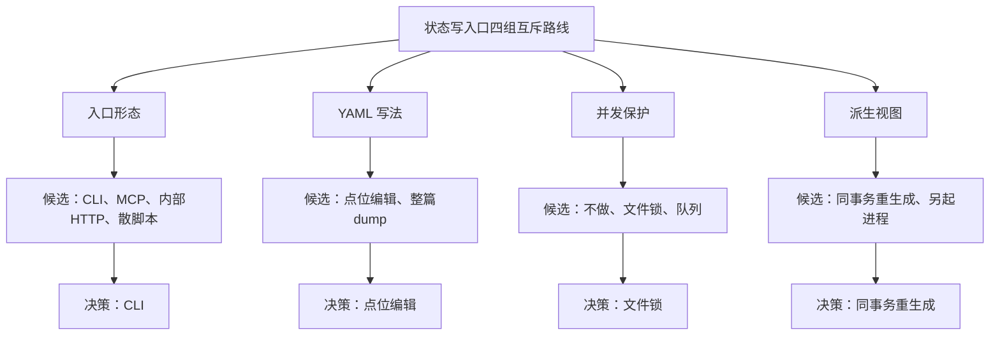

# media 调研与选型讨论：入口形态、YAML 写法、并发保护、派生视图四组路线怎么选

上一课（第 11 课）交付了 docs/spec/ 目录约定和六步模板四件套：调研模板、ADR 模板、执行方案模板、施工记录模板。方法有了就得用，这一课拿状态写入口练手，走六步里的前三步：调研、讨论选型、决策。状态写入口指的是改 meta.yaml、backlog.yaml 这类文件里状态字段的那个统一入口，现在它还不存在，改状态全靠手动编辑文件。

第 10 课结束时留下一句话：自愈回路，也就是判、修、复判轮流交棒的那套流程，合上了，可你一路手改 meta.yaml，往下还有更大的东西要造。手改的麻烦跟手动两个字听着落后没关系，麻烦在于它没有任何东西替你拦：status 字段该填哪几个值全凭你自己记住，第 10 课熔断那次就是例子，没有专门的挂起状态可用，只能在 status 后面另外加一行说明，写错格式没人会告诉你。

具体产出是两份文档：00-调研.md 和 01-ADR.md，都落进 docs/spec/media/ 目录。media 是这套东西在文档里的项目代号，跟状态写入口最后长成什么形态是两回事，代号先定下来只是方便存放文档，不代表命令行这条路已经提前赢了。

## 1. 四组互斥路线：状态写入口该怎么选

这一课不产一行代码。调研、讨论选型、决策这三步，你和 AI 一起做的事只有摆事实、逼它交代弱点、拍板，产出的东西全是文档。判断的是选哪条路，不是路怎么修。

四组问题互斥在哪，先说清楚，免得调研的时候摸不着方向。

第一组是入口形态：命令行工具、给对话客户端用的协议服务、内部 HTTP 接口，还是维持现在这样各写各的脚本。入口形态一旦定了，后面所有调用它的地方都要照这个形态来接，选了命令行就不能同时指望某个脚本自己再实现一套判断逻辑。

第二组是 YAML 写法：改一个字段，是只改被点中的那一小段字节，还是把整个文件解析成对象、改完再整篇重新写回去。这是一次性的选择，选了哪条，以后每次改写都要接受对应的代价，中途换路径要把之前依赖旧写法写的代码全部推翻。

第三组是并发保护：多个写者同时想改状态时，系统完全不管、拿一把锁互斥、还是排队处理。三条路对同一个问题给出的答案互相矛盾，只能选一条：不管意味着谁后写谁赢，锁意味着谁先拿到谁写、另一个直接失败，排队意味着谁都能写但要等。

第四组是派生视图。有些文件的内容是从状态里现算出来的，比如一份汇总全部在制内容的清单，这类文件该在写操作的时候顺带同步更新，还是交给一个独立的进程按需生成。绑在同一个操作里就不会有视图和真相对不上的时间窗口，拆开就一定有。

四组路线里，分量并不一样。入口形态一旦定了，后面几课要写的每一条命令、每一份阶段契约的措辞都得跟着它走，改主意的代价最高；派生视图反悔的代价小得多，视图算错了大不了重新生成一次。调研阶段先不比谁的分量重，重要的是先看清楚每一组内部到底在选什么。

四组互斥路线清单：

| 组别 | 候选方案 | 互斥点 |
|---|---|---|
| 入口形态 | CLI / MCP / 内部 HTTP / 散脚本 | 只能有一个写入口形态，别的调用者都要迁就它 |
| YAML 写法 | 点位编辑 / 整篇 dump | 注释保不保得住是一次性决定 |
| 并发保护 | 文件锁 / 不做 / 队列 | 系统在多写者压力下的行为互相矛盾 |
| 派生视图 | 同事务重生成 / 另起进程 | 要不要接受一段视图落后于真相的时间窗口 |

四组路线定了范围，调研要做的是把每组内部的候选方案和各自的代价放到同一张表里，先看事实，不先下结论。

## 2. 调研：四组路线逐组摊开

四组路线各自独立，但调研阶段用的是同一张表：方案、适用前提、代价、已知失败模式。这一步不下结论，先把每个候选逼到摊开事实的地步，谁强谁弱留到讨论选型那一节。

先让 AI 出候选清单，你确认过再往下展开对比表，这个形状复用你在上一课定下的调研 Prompt：

```
现在要给流水线的状态写入口做一次调研。这一步只列候选方案、摆事实，不下结论。

针对下面四组问题，各给出 2 到 4 个候选方案，先列出候选清单，等我确认过
再展开成表格。展开时每个方案填一行：方案 / 适用前提（什么场景下选它
是对的）/ 代价（选它要多付出什么）/ 已知失败模式（什么情况下它会输，
能不能举出具体例子）。

四组问题：
1. 状态写入口应该长成什么形态：命令行工具、给对话客户端用的协议服务、
   内部 HTTP 接口，还是维持现在各写各的散脚本？
2. 改一个 YAML 字段，是只改被点中的那一小段字节，还是解析成对象、
   改完整篇重新写回去？
3. 多个写者同时想改状态时，系统怎么办：不做任何保护、加一把文件锁，
   还是排队处理？
4. 从状态里算出来的派生视图，是写操作顺带同步生成，还是交给另一个
   独立进程按需生成？
```

下面四张表是这类调研可能得到的样子，用来给你一个参照。你自己跑出来的候选和措辞多半对不上这几张表，字段名、代价的写法都可能不一样，这是正常的，重要的是格式对得上：方案、适用前提、代价、已知失败模式四列，不缺项。

### 2.1 入口形态：CLI / MCP / 内部 HTTP / 散脚本

| 方案 | 适用前提 | 代价 | 已知失败模式 |
|---|---|---|---|
| CLI | 人在终端敲、脚本用子进程调、AI 按需查用法，三种调用者要共用同一个入口 | 每加一种能力要多写一条子命令和帮助文本，参数一旦定型，改字段名要牵动全部调用方 | 命令行参数被脚本和文档写死之后，字段改名的代价很高 |
| MCP | 只有一个常驻的对话客户端在用，不会再冒出别的调用者 | 客户端要在每次对话开局把全部工具描述塞进提示词，不管这次任务用不用得上 | 一旦出现第二个调用者，比如一个定时跑的任务，协议层的开销要在两边各实现一遍 |
| 内部 HTTP | 系统里已经有一个常驻服务在跑，想顺手让它也接受写请求 | 状态机的合法性校验要在服务进程里再实现一遍，或者转头去调本该属于写入层的代码，多一层间接 | 写请求经过网络这一层之后，出错信息容易被协议包装层盖住，调用方拿到的往往是个笼统的报错，看不出是哪条业务规则拦的 |
| 散脚本 | 每个环节各写各的，谁改状态谁负责，改起来最快 | 前期零协调成本 | 状态翻转的规则散在多份脚本里各自演化，容易长出第二套不一致的实现，谁改漏了没人拦 |

为什么倾向长成命令行，两条理由值得单独说清楚。第一条跟人怎么用命令行、AI 怎么用命令行是同一个道理：你在终端敲一条命令不需要提前背下它的全部参数，敲错了它会告诉你缺什么；AI 也是同样的用法，不需要在对话一开始就把这条命令的全部细节塞进上下文，任务用得上的时候再查一次用法，查一次的开销很小，用不上的时候完全不占地方，这叫按需加载。第二条是退出码：命令跑完是零还是非零，是一个操作系统级别的确定性信号，不需要解析一段自然语言描述或者一个嵌套的错误对象才知道成没成功，AI 判断这次调用有没有成功，靠退出码比靠协议层层包装的报错对象要直接。

散脚本这一行有真实出处：参考流水线上曾经有六个写状态的入口，大半是各写各的代码，还有一处用的是正则直接改文本，跟其他入口是两套独立演化的实现。散脚本真正的代价在这里：没有一个统一的地方能一次性看清楚规则，规则改了要挨个入口去找有没有漏改的，跟谁手写谁不手写没关系。

### 2.2 YAML 写法：点位编辑 vs 整篇 dump

| 方案 | 适用前提 | 代价 | 已知失败模式 |
|---|---|---|---|
| 点位编辑（只改被点中的字节区间，其余字节原样保留） | 文件里带着人写的注释，这些注释是有效信息，不能因为工具改了一个字段就被抹掉 | 每加一种可写字段，都要多写一段在原始字符串里定位这个字段的代码，比直接调用整体序列化麻烦 | 定位逻辑写错了会算错字节区间，把相邻内容一起覆盖掉 |
| 整篇 dump（解析成对象，改字段，整体重新序列化写回） | 文件里没什么人写的东西，纯配置，改起来越省事越好 | 只要文件里出现过一次人写的注释，这条路就保不住它 | 参考流水线做过一次真实测试：拿仓库里 25 个 meta.yaml 和 backlog.yaml，什么都不改，只是解析一遍再原样写回去。25 个全部对不上原文。问题出在解析这一步：注释前面对齐用的空格在这时候就已经丢了，写回去统一压成一个空格，序列化参数怎么调都救不回来 |

这一组的判断相对好下：状态文件里到底有没有人写的注释，是一个能马上查清楚的事实，不用猜。你自己第 03 课写的 meta.yaml 模板，字段大多还是空的，但要是留了给人看的说明，哪怕只有几行，这一组的答案基本就定了，注释的多少不改变结论，改变的只是代价大不大。

### 2.3 并发保护：文件锁 / 不做 / 队列

| 方案 | 适用前提 | 代价 | 已知失败模式 |
|---|---|---|---|
| 不做（假设永远只有一个写者在跑） | 现在确实只有一个入口在写，比如手改 meta.yaml 全靠一个人手动操作 | 前期零成本 | 一旦第二个写者出现，比如同时有一次人工操作和一个后台任务都要改状态，先写的会被后写的悄悄覆盖，不会有任何报错 |
| 文件锁 | 写操作本身很快，多个写者是互斥关系，不需要排队处理同一批数据 | 拿不到锁的一方直接失败退出，还要处理进程被杀死后锁没释放的陈旧锁问题 | 陈旧锁不清理，会让后续所有写命令永远拿不到锁 |
| 队列 | 写操作之间有先后依赖，或者写操作本身比较耗时，排队等待的成本能接受 | 要单独维护一套排队和调度的服务，一次写请求从提交到真正落盘之间有一段不确定的等待时间 | 排队服务本身出故障，所有写操作一起堵死，多引入了一个新的单点故障 |

队列这条路本身没什么不好，只是这次落盘的动作太轻，用不上它。这一组要注意区分两个不同层面的问题：锁解决的是谁能写，同一时刻只放一个写者进去；参考流水线在锁之外还做了原子落盘，写文件时先写到一个临时文件，成功了再一次性替换掉原文件，解决的是读者会不会读到写一半的文件。两者不能互相替代，锁挡不住半写文件被读到，原子落盘也挡不住两个写者同时改一个字段。

### 2.4 派生视图：同事务重生成 vs 另起进程

| 方案 | 适用前提 | 代价 | 已知失败模式 |
|---|---|---|---|
| 同事务重生成（写操作最后一步顺带把视图重新算一遍，一起落盘） | 视图的数据量不大，重新算一遍的开销可以忽略，且视图必须时刻和真相源保持一致 | 每次写操作都要多算一遍视图，视图的渲染逻辑和写路径耦合在一起，改视图格式要跟着改写路径 | 视图渲染逻辑本身要是抛错，会拖累整次写操作一起失败，得想清楚视图算错了要不要拦住写入 |
| 另起进程（视图交给一个独立命令或后台任务，按需或定时生成） | 视图生成开销比较大，或者晚一点更新也没关系 | 无 | 视图和真相源之间总会留出一段不一致的窗口，后台任务忘了跑或者跑失败没人发现，视图就停在某个旧时间点上不动 |

参考流水线管这类视图叫 dashboard.md，一份汇总全部在制内容状态的文件，读者点开就能看到谁卡在哪一步。它两条路都留了：默认走同事务重生成，但也保留了一条独立的重新生成命令当兜底，日常不靠它，出问题的时候能手动补一次。这提醒一件事：选定的那一条不代表要把另一条彻底堵死，留一条兜底路径的成本有时候很低，值得留。

四张表摆齐了，接下来要做的是让每个候选自己开口，说清楚它什么时候会输。

## 3. 讨论选型：四组各自的辩护人

调研节摆的是事实，这一节要做的是让每个候选说清楚它在什么场景下是对的、要多花什么代价、什么情况下会输给候选清单里的哪一个对手。不许下"综合来看方案 X 更好"这类结论，结论留给你自己来下。

同一条辩护式 Prompt，四组路线各跑一遍，只需要把组名和候选清单换成对应那一组的：

```
针对<入口形态>这一组的候选方案<把你自己那一组四列表里的方案列复制
过来>，分别以对应方案支持者的身份，逐个回答：
1. 这个方案在什么场景下是对的选择？
2. 选它要多付出什么代价，时间、心智负担、谁来买单？
3. 主动交代它已知的失败模式：什么情况下它会输，会输给候选清单里的
   哪一个对手？
不要下"综合来看方案 X 更好"这类结论，结论留给我来定。
```

候选清单要从你自己第 2 节跑出来的那四张表里复制，不是从这篇课文里的示例表格复制。课文里的表格是参考流水线的答案，用来对照格式，不是替你把调研做完。

四组各自跑完，摘几句最关键的自白，感受一下什么叫说清楚失败模式：

入口形态这一组，MCP 自己交代得很直接：如果这条流水线以后只有一个对话客户端在用，不会再冒出别的调用者，选它没问题，但只要出现第二个调用者，比如一个定时跑的任务，协议层的开销就要在两边各实现一遍，这是设计前提决定的，靠优化解决不了。CLI 也交代了自己的弱点：命令行参数一旦被脚本和文档写死，改一个字段名的代价就摊到了全仓，它天生对改名不友好。

YAML 写法这一组，整篇 dump 交代得更干脆：只要文件里出现过一次人写的注释，它就保不住，工作方式决定了这一点，不算运气不好碰上的特例。

并发保护这一组，队列自己交代：排队服务本身要是挂了，所有写操作会一起堵死，它给系统多引入了一个新的单点故障；文件锁交代：陈旧锁不清理会让后面所有写命令永远失败，得配一套超时抢占逻辑才安全，这套逻辑本身也是要维护的代码。

派生视图这一组，另起进程交代得最坦率：它和真相源之间总有一段不一致的窗口，用的人可能看到旧数据，除非能确认这段窗口对使用场景来说无所谓，否则这个代价躲不掉。

如果哪一组的某个候选只夸自己的优点，一句失败模式都说不出来，多半是候选清单里给的场景描述本身带了倾向，比如把某个方案的适用场景写得特别理想化，AI 顺着这个倾向往下答，自然找不出它会输的地方。换一个更中性的场景描述重新问一遍，比接受一份只有优点的自白靠谱。

四组的弱点都被自己交代清楚了，接下来是拍板。

## 4. 决策：四份 ADR 拍板

四组路线各自独立拍板，互不牵连。选了 CLI 不代表并发保护也要选最重的方案，每一组都按自己的代价和场景单独定。ADR 只填四项：决策、理由、被否方案、反悔成本，别的字段不加。

同一份 ADR 模板，四组各自套一遍。下面是参考流水线在入口形态这一组拍的板，当一份格式对照：

```
ADR-1 入口形态
决策：CLI，统一命令名。
理由：人在终端敲、脚本用子进程调、AI 按需查用法后调用，三种调用者
共用同一个入口，不用为每种调用者各接一套；退出码是三种调用者都认
的确定性信号。
被否方案：MCP，只有唯一的对话客户端在用时协议开销才划算，出现非
对话类调用者就要两边各实现一遍；内部 HTTP，写请求经过网络层之后
出错信息容易被包装层盖住；散脚本，现状六个写入口各自演化，容易
长出第二套不一致的实现。
反悔成本：给 CLI 包一层 HTTP 或协议转发壳，代价不大，因为业务规则
都在 CLI 背后，壳只是转发；反过来，先选了散脚本或协议层再往 CLI
收口，要把散在各处的状态机规则一条条挖出来重写，代价高得多。
```

用下面这条 Prompt，把你自己第 3 节四组的讨论结果各自套进同一个模板，生成属于你自己的四份 ADR：

```
基于上面<组名>这一组的讨论选型结果，写一份 ADR。固定四项：
决策（选了哪个方案）、理由（为什么，引用讨论里的具体理由）、
被否方案（其余候选各自因为什么被否，不许只写"其余方案更差"这类
空话）、反悔成本（以后想换掉这个决策，要付出什么代价）。
不要新加字段。
```

四组各自跑一遍，落进 01-ADR.md。写完回头检查一件事：有没有哪份 ADR 的理由是"因为前一组这么选了，所以这组也这么选"。如果有，多半是决策节没有把四组当独立决策来做，混在一起想了，四组之间没有谁决定谁的关系，各自的理由要能单独站住。

### 4.1 入口形态定了什么

见上面 ADR-1 的例子。

### 4.2 YAML 写法定了什么

参考流水线的决策是点位编辑。理由是现有文件里的注释是终检记录、取题说明这类有效信息，不能被工具改一个字段就抹掉。被否方案是整篇 dump，实测对 25 个真实文件做零改动往返测试，25 个全部对不上原文，注释前的对齐空格在解析这一步就丢了。反悔成本不算高：点位编辑的定位逻辑写起来比直接调库麻烦，但写对一次之后，加新字段只是多写一段定位代码，不需要推倒重来；反过来如果先选了整篇 dump，等哪天真出了注释被吃掉的事故才想换路径，之前依赖整篇覆盖这个假设写的代码要全部推翻。

### 4.3 并发保护定了什么

参考流水线的决策是文件锁，拿不到锁直接报错退出，不排队。理由是落盘这个动作本身只有几毫秒，队列带来的额外复杂度不值当，直接报错也比排队更容易被人第一时间看见。被否方案是不做任何保护，出现第二个写者时会悄悄覆盖没有报错；队列，排队服务本身出故障会堵死所有写操作。反悔成本主要看以后落盘会不会变重，现在这个决策的前提是它还很轻，前提没变就不用换。

### 4.4 派生视图定了什么

参考流水线的决策是同事务重生成。理由是视图必须时刻和真相源保持一致，数据量不大，重新算一遍的开销可以忽略。被否方案是另起进程，会留下一段视图落后于真相的窗口，后台任务忘了跑没人发现；这条路没有被彻底堵死，留了一条手动重新生成的命令当兜底，但不作为日常依赖。反悔成本是如果视图哪天变得很重，同事务重生成会拖慢每一次写操作，到时候要拆成独立进程重做。

下面这张图看四组路线各自的候选和最终拍板，四组互相独立，谁也不决定谁。



## 5. 决策定了，规格还没写

四组互斥路线全部拍板，00-调研.md 和 01-ADR.md 落进了 docs/spec/media/ 目录，这一课结束你手上还是没多出一行代码。四张对比表、四组辩护、四份 ADR，做的是同一件事：把选哪条路这个问题从一个模糊的直觉，变成一份写清楚了代价和被否理由的文档。

还看不到的东西也要说清楚。ADR 里"文件锁，拿不到锁直接报错退出"这句话，还差很多东西才能变成一条能跑的命令：锁文件放在哪、陈旧多久算过期、报错信息该长什么样，这些都还没定。决策落了纸，AI 还照着施工不了，中间差一份能让 AI 照着施工的执行方案。下一课要把这四份决策展开成执行方案，按第 11 课定下的四节模板逐条穷举命令和详细设计，才轮到能让 AI 真正动手写代码的那一步。

四组路线拍完板，ADR 写好了。决策变不成代码，中间还差一份能让 AI 照着施工的执行方案。
