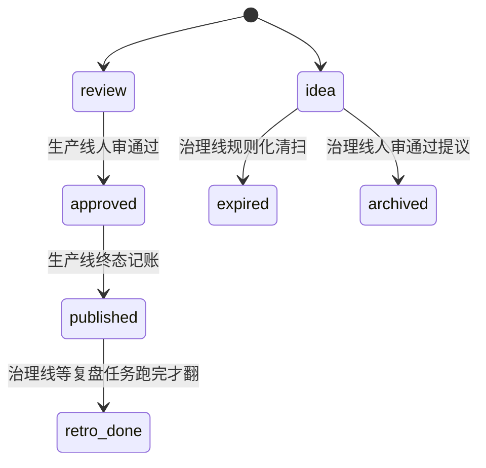
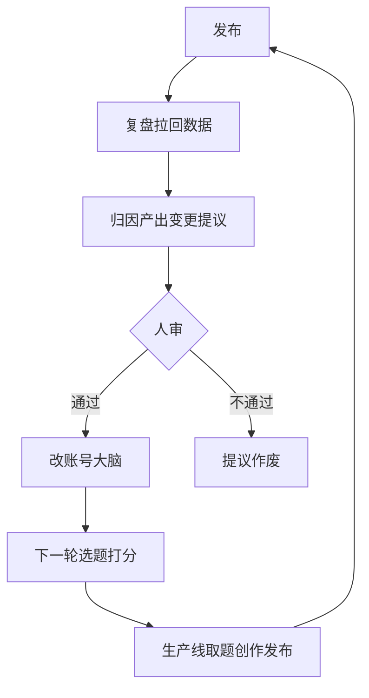

# 双线分工：生产线消费资产，治理线保养资产

第 20 课交付了 `douyin-publish` skill 和一次 dry-run 到底，从取题到发布四个环节全走完，最后一步的真发或 dry-run 也留了执行记录，生产线整条通了。第 20 课收尾时留了一句话：生产线从取题到发布整条通了，可它只会消费资产：选题池会空，大脑不会自己长。谁来保养这些资产，按什么纪律改？这一课回答这句话。

这一课的记忆锚点是：生产线消费资产，治理线保养资产，治理线只出提议、不自己动手改。这里说的治理线，指的是流水线之外另起的一条线，住在 `harness/` 目录下，专门给选题池和账号大脑做保养。输入是你自己的 `CLAUDE.md`、`pipeline/` 五份阶段契约、你第 14 到 16 课造的 core 包里的 state 模块（含全量 `media` 命令，路径按你自己 SPEC 里定的来）。产出两件东西：`harness/` 骨架三份文件（`README.md`、`tasks.md`、`report-template.md`），一张资产读写表。

## 一、双线边界：谁消费、谁保养

生产线只会把选题池和账号大脑当存量消耗，从不往里补。这条线上也没有哪个环节按自己的节奏专门保养这两类存量资产，用得越久，池子越薄，大脑里的判断依据也越旧。

你第 20 课走完的四个环节，取题、创作、出审、发布，每一步都在读 `backlog.yaml` 或 `brain/` 里已经写好的东西，没有一步往回补。取题从 `backlog.yaml` 挑一条 `idea` 状态的选题翻成 `picked`，创作阶段只读加载 `brain/positioning.md` 这几份文件定的规则，发布收尾把状态翻到 `published`。这几步既不会往 `backlog.yaml` 里加新选题，也不会去改 `brain/benchmarks.md` 记的打法，整条生产线站的是消费者的位置，不承担供货。

选题池和账号大脑不会自己长：池里的候选会被取走用完，就算不取走，AI 圈的技术热点通常几天到一周就过时，放着不管也会自然老化。账号大脑里的打法同理，判断的是几个月前测出来的规律，行业玩法一变，规律可能就不再成立。这两类资产都需要一条独立的线，专门负责补新、复核旧、清理过期的。

参考流水线已经把这条边界写成了一句话：`pipeline/` 负责从取题到发布，止步于人审这一关；`harness/` 目录负责把选题池和账号大脑当存量资产保养，只出报告和变更提议，人审通过后才应用。这句话现在还只在参考流水线的 `CLAUDE.md` 里，你自己的 `CLAUDE.md` 目前只写了 `pipeline/` 那一半，`harness/` 这半边是这一课要补的。

让 AI 把生产线现在的运作方式和治理线要立的定义放到一张表里对照：

```
读我自己的 CLAUDE.md 和 pipeline/ 五份阶段契约（含 daily-run.md），
把生产线目前的运作方式提炼成一行：驱动方式（谁在什么时候触发它）、
消费的资产（它从哪些文件读，会不会往里写）、动作是否可逆
（参考我们第 17 课定的判据）。
再按下面这句定义补一行治理线：治理线保养选题池和账号大脑这两类存量
资产，按自己的节奏跑，只产出报告和变更提议，多数动作可逆，只有
个别记账动作除外。
输出一张两行的对比表，列是：驱动方式 / 消费还是保养 / 动作是否可逆。
我文件里没写到的地方标未定，不要替我编。
```

跑完这条 Prompt，表大致是这样：

| 维度 | 生产线 `pipeline/` | 治理线 `harness/` |
|---|---|---|
| 驱动方式 | 工作日定时触发（`daily-run.md`），发布前经人审闸口 | 独立定时触发，不跟生产线共用一个节奏 |
| 消费还是保养 | 消费：从 `backlog.yaml` 取走 `idea` 状态的选题，只读加载 `brain/` 规则 | 保养：往 `backlog.yaml` 补新候选，给 `brain/` 出变更提议 |
| 动作是否可逆 | 出审前多数可逆，第 17 课定的四类不可逆动作要走人审闸口 | 多数动作是可逆的记账，只有个别规则化动作视同记账 |

边界画完了，还剩一个问题：治理线保养大脑这件事，为什么不能自己直接动手改，只能出提议。

## 二、治理线的第一条硬约束：只出提议，不直接改大脑

治理线要碰的是账号大脑这类判断依据，自动改错了往往没人发现，所以这条边界得写进契约，靠自觉守不住。

设想一种最省事的做法：治理线的复盘任务跑完，直接把结论写进 `brain/benchmarks.md`，不用人过一遍。这样做最快，报告当天就能生效。这条捷径的代价在哪，顺着一条真实的传导链往下看就清楚了。`brain/benchmarks.md` 记的是实测有效的打法，下一轮 `douyin-ideate` 给候选题打分要用到这份打法库做参考。参考流水线的 `backlog.yaml` 头部注释定了六个打分维度：`practical`、`social`、`emotion`、`hook`、`timeliness`、`trigger`。你自己那份头部到第 03 课为止只定了文件管什么、两层状态、取题指针这三件事，还没有打分维度这一项。`douyin-ideate` 真正要靠维度给候选题排序，是第 23 课才会补的事，到时候维度名字未必和参考流水线一样，道理是相通的：某个维度的判断依据一旦被错误的打法带偏，排序就会跟着偏。

设想复盘任务看到某条按强行动号召结尾这种打法做的视频播放量偏低，自动把这条打法在 `benchmarks.md` 里标成失效。问题是，这条视频播放量低的原因，完全可能是发布时间不巧撞上平台大版本更新导致推荐池抖动，跟打法本身没关系。这个误判一旦直接写进 `benchmarks.md`，下一轮 `douyin-ideate` 打分时会把所有沿用这条打法思路的候选题在某几个维度上打低分。这些题可能因此排不到人工挑题的前面，甚至根本不会被人看到，一个错误的判断依据，就这样悄悄筛掉了本该被选中的题。而这个最初的误判，从头到尾没有一个人看过、点头过。

单条数据的噪音本身就很大，人凭经验能判断出这条数据可能有别的原因，机器按规则跑，看到数字下降就是下降，不会主动怀疑数据本身。让系统自己改自己判断对错的标准，等于把这层怀疑也一起免掉了。这条边界因此不能只当成一句共识，要写进契约，再由机器帮着守。

参考流水线的 `harness/README.md` 把这条边界写得很直接：治理线所有任务只产出执行记录报告和变更提议。改账号大脑、改已发布线上资产（也就是抖音平台上那条已经发出去的视频本体，不是本课资产读写表要管的仓库文件），一律人审通过后才应用。它留了两条例外：选题入池和按已经人审钉死的规则做的过期清扫，这两类视同状态记账，可以自动，因为规则本身已经被人看过一遍，机器只是照章执行，不涉及新的判断。

参考流水线 2026 年 7 月 8 日一份真实的 `backlog-gardener` 报告，正好是这条约束落地之后的样子。那次任务扫了 14 条候选选题，两两核对撞题，标签有重叠的候选一共查出两组。逐组往下查，一组是标题和链接都指向同一个事件，但两条候选各自写明了错开发布节奏的理由，属于有意差异化；另一组标签只有一个重合，展开看内容角度并不重叠，是标签体系本身不够细导致的假重叠。两组都不需要合并或剔除。报告给的结论是全池 14 条 `idea` 干净，唯一留下的动作是建议人审顺带确认一下那条错峰安排的理由后续是否还成立。这个结论不是治理线自己拍板的，报告只是把两组重叠查清楚，判不判定为撞题这件事本身，仍然留给人确认。

这条约束要落到你自己的契约里，让 AI 补进 `CLAUDE.md`：

```
在我的 CLAUDE.md 里加一节"治理线硬约束"，写清楚三件事：
一、治理线所有任务只产报告和变更提议，不直接修改 brain/ 任何文件，
   也不改已发布内容的线上资产；
二、例外只有两类记账动作：选题池新候选入池、按已经人审钉死的规则做的
   过期清扫，这两类视同状态记账，可以自动；
三、除这两类之外的所有改动，包括把某条打法标成失效、合并或删除选题池
   里的候选，一律只出变更提议，人审通过后才应用。
按我现有 CLAUDE.md 的章节结构插进去，不要改动我已经写好的内容，
改完把整份文件贴给我看一遍。
```

拿到 AI 补写的段落，先看两件事：第二条列的例外是不是写清楚了具体是哪两类，不能写成一句笼统的规则化动作可以自动；第三条有没有把人审通过后才应用这句话原样带上。如果补写的约束段落里出现了视具体情况自动应用这类留了后门的措辞，常见原因是 AI 把这一课的两类例外理解成了任意场景。这种情况下让它把例外收窄回入池和规则化清扫这两条，其余动作一律按需要人审处理。

这条硬约束定下来了，接下来要解决的是怎么让机器分清一笔状态改动该记在哪条线上，而不是全靠人记着。

## 三、harness 骨架与 line 字段记账

治理线要有自己的目录，一笔账归生产线还是治理线，也得有一处机器能查的记录来判定。

你第 13 课写执行方案的时候，画过一张状态迁移表，五列：from、to、触发命令、前置条件、需要理由。表里 `published` 到 `retro_done` 那一行，前置条件那一列写的是只能由治理线那条线触发，生产线不能碰。这句话当时是当普通文字写进前置条件那一格的，没有专门的字段来标它，跟别的前置条件混在同一列里，不太容易一眼看出哪些边是治理线专属的。

参考流水线把这句话做成了状态迁移表里一个专门的字段，叫 `line`，取值只有两种，`production` 或 `harness`。它还把这个字段接进了 `media flip --help`：一条迁移是不是治理线专属，跑一下 `--help` 就能看见，不用再去翻源码里那句前置条件的文字。这两处都是参考流水线自己的实现方式，你自己第 13 课的表目前还没有这个字段，只在前置条件那一栏里用文字写着。

让 AI 检查你自己的 state 模块有没有等价的东西，没有就照这个思路补一个：

```
检查我 core 包里的 state 模块，有没有一个专门字段能标出一条状态迁移
只能治理线触发、还是生产线也能碰，而不是只写在前置条件的文字描述里。
如果没有，参照这个思路给每条迁移加一个归属字段，字段名和实现方式
你自己定，不用照抄任何具体命名。
补完之后让 media flip --help 把这个字段的值也打印出来，我要能一眼
看出一条迁移归哪条线，不用去翻源码里的文字描述。
同时核对我第 13 课迁移表里 idea 到 expired、idea 到 archived 这两条
选题池迁移，前置条件那一栏有没有把哪条线能碰写清楚，没写清楚的一并
补上。
```

这条 Prompt 跑出来的具体字段名因人而异。参考流水线自己是这么做的，标 `harness` 的边一共三条，记账方式还各不一样。第一条，内容发布完、7 天窗口做完复盘，状态从 `published` 翻到 `retro_done`，注释写的是治理线唯一迁移，要等复盘任务真的跑完才能翻。第二条，选题池里的候选超过规则定的天数没人挑，会被清扫成 `expired`，注释写的是规则化清扫、记账例外，不用等复盘，满足天数条件机械跑一次就会翻。第三条，撞题查证后要合并或剔除的候选，状态翻成 `archived`，这条边既不靠机械跑，也不等固定窗口，要等一份人审通过的提议报告，第四节还会再细讲它具体怎么落。

参考流水线这张表大致是这样：

| 迁移 | 触发命令 | line | 记账方式 |
|---|---|---|---|
| `review` 到 `approved` | flip | production | 状态记账，人审通过 |
| `approved` 之后真发 | publish-done | production | 终态记账（第 17 课讲过的不可逆动作） |
| `published` 到 `retro_done` | flip | harness | 治理线唯一迁移，等复盘任务跑完才翻 |
| `idea` 到 `expired` | backlog sweep | harness | 规则化清扫，视同记账，机械跑 |
| `idea` 到 `archived` | backlog apply | harness | 判断性变更，等一份人审通过的提议报告 |

看一眼这张图，能看出哪几条边归生产线、哪几条边归治理线，比逐行读表更直观。



你自己的字段叫什么名字不重要，能查出这四类结果就够用。归属字段的用法说清楚了，接下来把治理线自己的目录立起来。让 AI 起草三份文件：

```
起草三份文件：

harness/README.md：写清楚治理线的定位（保养选题池和账号大脑这两类
存量资产，不造终端内容，那是 pipeline/ 的事）；引用我 CLAUDE.md
里刚补的"治理线硬约束"一节，不要重复写一遍规则，只指向它；写一句
边界：生产线消费资产，治理线保养资产。

harness/tasks.md：只搭一个空注册表，不要填任何具体任务。开头写清楚
将来每个任务卡要包含五件事：为什么存在、目标怎么选、干什么、产物
与记账、人审关注点；下面留一个空的 yaml 骨架（tasks: []），并注明
这张表第 24 课才填满。

harness/report-template.md：治理线所有任务共用的报告模板，固定六段：
任务与触发与目标、现状、发现（表格：条目、判定、证据）、变更提议
（勾选框，不自动改；每条按改什么、依据哪条数据、可逆性三项写）、
盲区、落地记录（人审后回填）。

三份文件都只描述结构和规则，不要编造具体的治理任务名称或数据，
我的仓库现在还没有任何治理任务。
```

三份文件里最容易出错的地方是 `tasks.md`，它应该是个空壳，只有结构没有内容。如果 AI 起草的 `tasks.md` 里直接出现了具体任务名并配好了触发周期，通常是它照着训练数据里见过的类似项目，编了一份看起来很真实的任务清单，而不是老实交一张空表。这些具体任务是第 24 课的活，这一课只搭骨架，拿到结果先看 `tasks.md` 是不是空的，看到不该有的具体任务名，删掉重跑一次就行。

三份文件搭好之后，读写边界还只是写在那节硬约束里的一句话，接下来要把它拆成一张能查的表。

## 四、资产读写表

把谁能读、谁能写、谁只能提议逐格写进一张表，比一句话规则更不容易走样：文字规则容易被绕过，而表格里没写到的权限，谁都不能动。

第二节写进 `CLAUDE.md` 的那节硬约束是一句话规则，一句话规则最大的问题是它只覆盖你当时想到的场景。真出现一个没被这句话直接提到的边角情况，比如某个新任务想往 `backlog.yaml` 里直接改一条已发布内容的标签，文字规则无法一眼查出这算不算越界，得现场重新解释一遍。表格不一样，表格穷举资产，每一行都写明了谁能读、谁能写、要不要经人审，没写到的地方谁都不能碰，不用现场解释。

让 AI 把前面立好的信息合成一张表：

```
把下面四类资产的读写权限整理成一张表，列是：资产 / 生产线权限 /
治理线权限 / 改动是否需要人审：

- content/_backlog/backlog.yaml
- brain/ 目录下的全部文件
- 各条目的 meta.yaml
- harness/logs/ 目录

生产线的权限按我 pipeline/ 契约和 media 命令的真实行为填；
治理线的权限按我 CLAUDE.md 里"治理线硬约束"那节和 harness/tasks.md
将来会有的任务卡结构填。规则化清扫和入池两类记账例外要单独标出来，
其余治理线动作一律标需要人审。我文件里没定的地方留空，不要替我猜。
```

跑完这条 Prompt，表大致是这样：

| 资产 | 生产线权限 | 治理线权限 | 改动是否需要人审 |
|---|---|---|---|
| `backlog.yaml` | 取走一条 `idea` 状态选题，翻成 `picked`（经 `media promote`） | 补入新候选（`idea` 入池）；按规则清扫过期候选（经 `media backlog sweep`）；提出撞题合并或剔除建议 | 入池和规则化清扫不需要，规则已由人审钉死；合并或剔除需要，人审通过后经 `media backlog apply` 落地 |
| `brain/` 全部文件 | 只读加载，创作时引用 | 复盘、对标复核任务读取并分析，产出变更提议 | 需要，所有改动都要人审通过后才回写 |
| 各条目 `meta.yaml` | 按状态机翻转（经 `media flip` / `media publish-done`） | `published` 到 `retro_done` 这一条迁移（经 `media flip`） | 生产线的翻转不经这一课说的人审，走的是第 17 课定的审核闸口，那是另一层门槛；治理线这条迁移同样不需要人审，是记账动作 |
| `harness/logs/` | 不碰 | 每次任务执行都写一份报告，摘要追加进 `index.jsonl` | 不需要，报告本身就是等着被审的材料，写报告这个动作不用先审 |

如果 AI 写的表把 `harness/logs/` 也标成需要人审才能写，一般是把两件事混为一谈了：报告是给人审看的材料，写报告这个动作本身要不要先经人审，是另一回事。报告可以放开写，报告里提的变更能不能应用才要审。

`media backlog apply` 这条命令还有一个细节：它落地的是撞题合并或剔除的建议，命令本身要求带一个指向报告文件路径的参数，不是可选项，没有报告路径这条命令直接拒绝执行。这样一来，落笔（把改动真的写进文件）这个动作就绑在了一份写好的提议报告上，机器不能凭空发起一次改动。

这张表画完，谁能碰什么就有据可查了。这套分工最终要通到哪一步，还得往后看两课。

## 五、反哺大环：分在三课讲的一件事

反哺大环指的是发布之后的真实数据绕回来、改掉选题和创作依据的那一圈循环，一课讲不完，横跨三课。这一课回答治理线为什么只提议，第 22 课回答一条内容怎么单次归因，第 24 课回答连治理线自己怎么调参也要进这个循环。

这一课立好了治理线的边界和约束，但治理线存在的最终目的，是把发布之后的真实反馈接回选题和创作这一头，这件事这一课只做了第一段。参考流水线的 `harness/logs/index.jsonl` 里有一条 2026 年 9 月 2 日的 `account-audit` 记账，报的是复盘逾期积压达到 17 条。这个数字是反哺缺一段会堆积成什么样的真实例子：复盘任务如果没跟上节奏，欠账不会自己消失，会一直攒着，攒到 `account-audit` 巡检时才被发现并报警。积压到 17 条的意思是，有 17 条已经发出去的内容，一直没能把结论拿回来。

参考流水线的 `CLAUDE.md` 把这套反哺过程定义成一句话：发布之后，复盘拉回数据，产出变更提议，人审通过才改账号大脑，下一轮选题打分才会用上这次的教训。受众平台的真实信号只有复盘这一条来路，选题端不直接爬抖音。

这句话说的是一个会转回起点的闭环，看一眼这张图，比读一遍文字更容易记住这个环是怎么转的。



这句话里的每一步，分别落在哪一课，摆成一张表。

| 课号 | 回答什么问题 | 交付什么 |
|---|---|---|
| 21（本课） | 治理线为什么只能提议，不能自己落笔 | `harness/` 骨架三份文件 + 一张资产读写表 |
| 22 | 一条内容怎么单次归因 | `douyin-retro` skill + 一份真实的复盘报告 |
| 24 | 连治理线自己怎么调参也要进这个循环 | 任务注册表填满 + 四个治理 skill + 一轮巡检记账 |

这一课只解决了治理线为什么不能自己动手这一个问题，`harness/` 现在连一个真正跑起来的任务都没有，反哺这件事只走完了三段里的第一段。第 22 课要做的是让第一个任务真的跑一遍，把一条已发布内容的数据接回来，归因出到底是哪个环节出了问题。第 24 课要做的是把这套约束也套在治理线自己头上，账本里存着的复盘积压这类真实巡检发现，要靠第 24 课的自审任务定期扫出来。三课接完，反哺才算真正走完一整轮。

治理线的骨架立住了，第一个真正要跑的治理任务是复盘。

## 六、治理线立起来之后

这一课做到的：`harness/` 骨架三份文件落地了，`README.md`、`tasks.md`、`report-template.md` 各自写清楚了自己的结构；资产读写表也画清楚了，`backlog.yaml`、`brain/`、`meta.yaml`、`harness/logs/` 这四类资产，谁能读、谁能写、要不要经人审，逐格写明了。

还看不到什么：治理线现在是空的。`tasks.md` 是一张空注册表，`report-template.md` 还没被任何一次真实执行用过，`harness/logs/` 目录底下什么都没有。约束立住了，骨架搭好了，但还没有一个真正跑起来的治理任务，来验证这套规则接不接得住真实数据。

治理线的骨架和读写边界画好了，第一个治理任务是复盘。数据怎么拉、怎么归因、提议怎么写？
