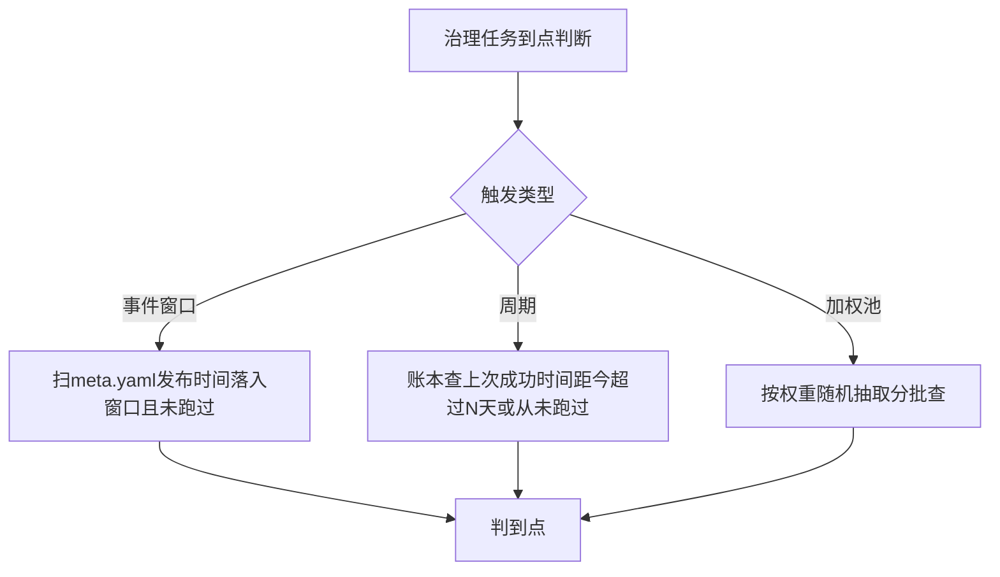
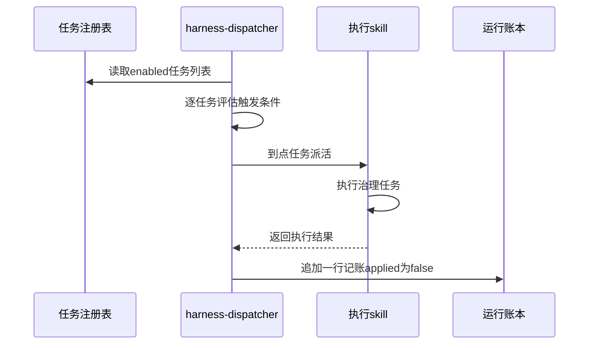

# 治理总调度：到点才跑，连治理线自己也要被复核

第 23 课交付了 `douyin-ideate` skill 和一批入池候选，选题池能自己养起来了。四个治理任务各跑各的，谁来决定今天该跑哪几个？这一课回答这句话。

这一课的记忆锚点是：自审就是让治理线读自己的运行记录、审自己跑得好不好，把反哺这套约束用回它自己身上。大环合上之后，连怎么治理这件事本身，也要拿这套约束去校准。输入是你自己的 `harness/tasks.md`（第 21 课交的空壳，`tasks: []`）、`brain/benchmarks.md`、`content/_backlog/backlog.yaml`。产出一份任务注册表。产出四个治理 skill：retro、ideate、backlog-gardener、benchmark-refresher。外加 account-audit 这个元层任务，它不管内容，只审治理线自己跑得好不好，以及一轮巡检记账。

## 一、harness-dispatcher：读注册表，到点才跑

四个治理任务各自能跑不等于治理线在跑。你手上现在有两个已经造出来的 skill：`douyin-retro`（复盘）和 `douyin-ideate`（选题）。还有两个这一课才第一次动手的：backlog-gardener、benchmark-refresher。这四个任务谁该在什么时候跑，眼下没有任何东西替你判断，只能靠你自己想起来去敲命令。

想起来去敲命令这件事最大的问题是它会被日常工作挤掉。复盘有窗口期，发布满 24 小时该拉一次数据，满 72 小时再拉一次，满 7 天做终局归因，错过窗口这条内容的复盘就成了永久缺口，没人会替你补。选题池同理，隔几天不去外网抓新线索，池子会一天天变薄。这些任务本身都做得出来，缺的是有人到点把它们叫起来。

调度和执行要解耦，是这一课要立的第一条规则。加一个治理任务，只应该改 `harness/tasks.md` 这份注册表，也就是登记每个任务归谁执行、多久跑一次的那张清单，不应该去动调度器本身的逻辑。把这两件事耦合在一起，后果是每加一个新任务，都要回头改一遍派活的代码，改错一处就可能牵连到别的任务派不出去。参考流水线的 `harness-dispatcher` 就是照这条规则搭的：它只做三件事，读注册表、判断谁到点、把到点的任务派给对应的执行 skill，剩下的活它一概不管。它自己不碰 `brain/` 的任何文件，也不去改线上已发布的内容，这些红线在第 21 课就画过一次，这里原样适用。

### 1.1 三种触发类型怎么判到点

到点这两个字，落到不同任务身上，说的完全是两回事。复盘的到点是等一条内容发布满某个时长；选题调研的到点是等一段时间没抓新料；死链排查这类任务的到点是概率性的，池子太大排不完，只能每次抽一部分。三种节奏各有各的判据，用同一套逻辑去套，套不上。

参考流水线的 `harness-dispatcher` 把这三种节奏分成了三种触发类型，`.claude/skills/harness-dispatcher/SKILL.md` 里写得很直接。第一种叫 `post-publish-window`，事件窗口触发。扫 `content/*/meta.yaml` 里 `status: published` 的内容，拿它的发布时间跟当前时间比，落进某个窗口（比如 24 小时、72 小时、7 天，各带一点容差）。这个窗口还没跑过，就算到点。第二种叫 `periodic:<N>d`，周期触发。从运行账本，也就是治理线每跑一次就追加一行的那份记录里，找这个任务上一次成功跑完的时间，距今超过 N 天就算到点；账本里从没出现过这个任务，也算到点。第三种叫 `weighted-pool`，加权池触发。它面对的是一批性质相同、数量又大的资产，比如所有已发布内容里的外链，一次扫不完，就按权重随机挑几个，摊开来分批查。

三种类型分别对应三种资产的性质：单条内容的时间线、全仓资产的整体新鲜度、海量同质资产的排查进度。选哪种触发类型，看的是这个任务盯的是什么。

三条判到点的逻辑摆一起看：



让 AI 生成 `harness-dispatcher` skill：

```
我要给我的仓库加一个 harness-dispatcher skill,是治理线的调度器(框架层)。
它读 harness/tasks.md 这份任务注册表,对每个 enabled 的任务评估它的触发
条件,把到点的任务派给对应的执行 skill,再把执行结果记进
harness/logs/index.jsonl。

它自己不干具体的治理活,不碰 brain/ 任何文件,不改线上已发布内容——这些
红线我在第21课的 CLAUDE.md 治理线硬约束里已经写过,你直接引用,不要重复
定义一遍。

三种触发类型,判据分别是:
post-publish-window(事件窗口): 扫 content/*/meta.yaml 里 status:published
  的内容,发布时间落进给定窗口(带一点容差)且这个窗口还没跑过,判到点。
periodic:<N>d(周期): 从 harness/logs/index.jsonl 找这个任务上次成功运行
  的时间,距今超过N天,或者账本里从没出现过这个任务,判到点。
weighted-pool(加权池): 面对同质、数量大的资产,按权重加权随机挑几个,
  摊开分批查,不要求一次查完。

产出 harness-dispatcher 的 SKILL.md,流程按:读注册表→逐任务评估触发条件
→派活给执行skill→收报告→记账 这五步写清楚,附一节红线(只调度不治理、
到点才跑、解耦)。
```

拿到 skill 之后先核对一件事：三种触发类型的判据是不是各自写清楚了条件，别只笼统写一句到点就跑。如果 AI 把三种类型的判断逻辑写成了一句话，常见原因是它没有把每种资产的时间性质想清楚，事件窗口、周期、加权池混着写成一套逻辑，遇到真实的账本数据判不出该不该跑。

### 1.2 派活与记账

调度器判断出哪些任务到点，接下来要把活派出去，再把这一轮跑了什么记下来。这一步最容易漏的是记账这件事本身：报告写完就当结束了，回头想知道这个月治理线到底跑了多少次、哪些还等着人审，没地方可查。

参考流水线的记账方式是往 `harness/logs/index.jsonl` 追加一行 JSON，每次派活、不管跑没跑成，都留一行。这一行至少要包含任务名、目标、触发窗口、执行结果、报告路径、发现项数量，还有一个关键字段 `applied`，固定填 `false`，表示这份报告还没经人审通过应用。这个字段翻成 `true` 的动作永远由人做，不由机器自己翻。

让 AI 把这份 yaml 骨架和记账约定补进 `harness/tasks.md`：

```
在我的 harness/tasks.md 里补两件事:

一、顶部加一段 trigger 类型说明,列出 post-publish-window / periodic:<N>d
  / weighted-pool 三种类型各自的判据(参考我们刚才生成的 harness-dispatcher
  skill 里的定义,原样引用不要改措辞)。

二、把我第21课留的空 yaml 骨架(tasks: [])填成一个真实的注册表,先注册
  两个我已经有 skill 的任务:
  - retro,skill 是 douyin-retro,trigger 用 post-publish-window,
    windows 按我第22课 douyin-retro skill 里已经定的窗口填,不要重新
    问我要不要改
  - ideate,skill 是 douyin-ideate,trigger 用 periodic:<N>d,天数你按我
    第23课douyin-ideate skill里定的抓料节奏来定,没有明确节奏就留空
    标"待我确认",不要替我编一个数字

每个任务下面留一张任务卡骨架(五项:为什么/目标怎么选/干什么/产物与
记账/人审关注点),retro和ideate这两个先按各自已有的SKILL.md内容填,
其余字段留空等第二节的三个新技能补。
```

拿回结果先看 yaml 里到底填了几个任务。如果 AI 一口气把 backlog-gardener、benchmark-refresher、account-audit 也全部写进了 yaml 并配好了具体的 trigger 天数，多数情况下是它照着自己训练数据里见过的类似项目编了一份完整配置，没老实交一份只有两个任务的注册表。这三个任务这一课才第一次造，天数由你自己定。第 2、3 节才轮到它们上场，不该在这一步替你提前钦定。

调度器、任务注册表、执行 skill、运行账本这四方一轮下来怎么交接，看这张图：



调度器会派活了，但真正执行的还差两个任务：backlog-gardener 和 benchmark-refresher。外加一个不管内容、只管治理线自己的自审 account-audit，也要在这一课一并造起来。

## 二、三个治理 skill 起步：backlog-gardener、benchmark-refresher、account-audit

这三个技能各管一类没人催但放着会烂的资产。撞题不会自己冒出来提醒你，账号大脑里记的打法过没过时同样没人提醒，治理线自己的调度参数该收紧还是该放宽也一样。三个技能量都不大，彼此也不冲突，用一条 L1 Prompt 各自定清判据加验收就够，不需要像第 12 到 16 课那样走 SPEC 六步。

backlog-gardener 管的是选题池里的撞题。第 21 课定过一条边界：入池和按规则做的过期清扫算记账，可以自动；但撞题该合并还是该剔除，是要人拿主意的判断，只能出提议，人审通过才能落地。让 AI 生成这个 skill：

```
我要给我的仓库加一个 backlog-gardener skill,负责理选题池的撞题维度。

目标怎么选: content/_backlog/backlog.yaml 里 status:idea 的条目做池内
互撞比对,同时跟 status:published 的条目比对(避免复活重复题)。判同题
按 tags 归一化比对,交集达到我自己定的一个阈值就算疑似撞题;没有tags
的条目退化成标题+链接比对。

干什么: 逐组疑似撞题产提议——池内互撞建议留分高者、被并条目建议标记
待处置;跟已发布撞车建议标记不宜再做,注明撞了哪一条。拿不准的标"存疑",
写清两种理解让人裁,不要替我拍板。

产物与记账: 提议清单写成一份报告,不管有没有查到撞题都要写(没查到就
记"全池干净",这也是一个有效结论)。到此为止,不许直接改 backlog.yaml
里任何一条的状态,合并或剔除必须等我人审通过后再落地。

按这三段整理成 SKILL.md,开头写清楚职责边界:只管撞题,不做过期清扫(那
是 douyin-ideate 的事),不打分、不补新题。
```

benchmark-refresher 管的是账号大脑里那些打法和对标账号还成不成立。AI 圈的东西几周就可能过时，`brain/benchmarks.md` 不复核，用的就是几个月前的判断依据。这个技能最容易出的问题，是把验不了的也当成验过了：它只能靠外网检索取证，抖音账号本身活不活跃，它看不到。让 AI 生成这个 skill 时把这层边界写清楚：

```
我要给我的仓库加一个 benchmark-refresher skill,定期复核
brain/benchmarks.md 里的对标账号和有效打法是不是还成立。

先写清楚能力边界: 用 agent-reach 能验证的是打法背后的技术/模型是否还
current、能不能在外网找到当前证据;验不了的是纯抖音账号本身的活跃度
(没有抖音读取通道),这类只能标"需人工核",不能装作验过了。

干什么: 对 benchmarks.md 每一条,抓当前证据,逐条判定 成立/存疑/失效/
建议新增 四态之一,每条判定必须带证据(链接+日期),没有证据不下结论。

产物与记账: 报告列出全部判定,变更提议列成待人审的清单。硬约束:绝不
自动改 brain/benchmarks.md,报告写完就停,人勾选哪条才落地哪条。

按这三段整理成 SKILL.md,开头写清楚这是治理线第二个"养大脑"的任务,
复盘负责沉淀新打法,这个负责复核旧打法有没有过时。
```

account-audit 管的是治理线自己。它不读内容，也不读账号大脑，只读治理线自己跑出来的执行记录。这条边界得在 skill 里写死，交给 AI 生成之前，先把它审什么、不审什么说清楚：

```
我要给我的仓库加一个 account-audit skill,是治理线的自审元层。它读
harness/logs/index.jsonl 这份运行账本,统计每个任务的执行数、成功率、
人采纳率、逾期积压这几项,按 harness/tasks.md 里我自己定的调参限幅表
回调治理线自身的配置。

它不碰 brain/,不碰内容,不碰生产线,只审治理线自己跑得好不好。

熄火线: 单个任务的有效记录条数少于5条,只在报告里标"样本不足",不做
任何调参,这条线不能绕过。

红线: 它只能改 harness/tasks.md 这一份文件里的 yaml 数值字段,而且改
的范围必须在任务卡的调参限幅表以内;任务卡的文字说明、其它任何文件,
一概不碰。

按这几段整理成 SKILL.md,流程写清楚:解析账本→熄火检查→按限幅表产
调整(自动档直接改yaml留git diff、提议档只写进报告等人审)→写报告→
停。调参限幅表的具体数值第三节才定,这一步先把这个字段结构和红线立住,
不要在这里编具体数字。
```

backlog-gardener 和 benchmark-refresher 生成之后，检查它们有没有把只提议不落笔这条硬约束各自写进红线里。如果哪个 skill 的红线一节写成了“经确认后可直接应用”这类留了活口的措辞，通常是 AI 把这条硬约束理解成了可以视情况变通。第 21 课定的例外只有入池和规则化清扫两类，这两个 skill 都不落在这两类例外里，红线一律要收回来，不留活口。

account-audit 不套这条检查。它的红线不落在只提议不落笔上，落在只能碰 `harness/tasks.md` 这一份文件里的 yaml 数值字段上，具体哪些数值它能自己改、一次能改多少，第三节那张调参限幅表会逐行写明可调范围和步长。检查它的红线时，看的是范围对不对，改的是不是只有这一份文件的这一类字段；至于自动改的权限，它本来就该有一部分，边界下一节画。

三个技能都能跑了。谁能碰治理线自己的配置，这一步还没答案，得先划清楚。

## 三、调参限幅表：自审能自动调什么

account-audit 上一节已经拿到了红线，它只能动 `harness/tasks.md` 的 yaml 数值字段。但哪些数值它能自己改，哪些必须提议人审，这一层还没定。定不清楚，account-audit 自己就有可能把自己的配置改跑偏，改错了却没人拦住。

这条边界怎么划，有一条很清楚的线：可逆的数值放进自动档，不可逆或者会牵动别的环节的参数一律锁定，只能提议。任务的执行间隔、加权池的权重，这两类数值改坏了大不了下一轮再改回来，代价可控，可以放进自动档。但任务的启停，或者像选题调研间隔这种会直接影响生产线取题节奏的参数，改错的代价不是治理线自己能兜住的，一律要停下来等人拍板。

参考流水线的 account-audit 任务卡里定了一张这样的表：

| 参数 | 当前值 | 可自调范围 | 单次步长 |
|---|---|---|---|
| benchmark-refresher 间隔 | 30d | 14~60d | ×1.5 或 ÷1.5 |
| backlog-gardener 间隔 | 7d | 7~30d | ×1.5 或 ÷1.5 |
| ideate 间隔 | 2d | 锁定，生产线消费节奏依赖，动它等于动生产 | 不可调，走人审 |
| retro 窗口 24h/72h/7d | 固定 | 锁定，复盘方法论不是调度参数 | 不可调，走人审 |
| weighted-pool weight | 预留 | 1~12 | ≤±3 |

这张表里锁定的两行值得多说一句为什么。ideate 间隔看起来只是一个数字，改成每天跑一次或者十天跑一次，代价不只是治理线自己的事：它决定了生产线每次取题时池子里有多新鲜的候选。retro 的窗口是复盘方法论本身。24 小时、72 小时、7 天三个时间点是根据平台数据同步的规律定下来的，不是调度节奏快慢的问题。改了这三个数字，复盘归因用的基线就变了。这两类参数要是让自审自己悄悄调走了，出问题的地方在生产线和账号大脑，已经超出自审自己看得见的范围。

这张表上的数值是参考流水线的起步值，不是普适规律，你自己仓库的这张表数值要你自己定。让 AI 照着这个结构生成一份属于你的表：

```
参照下面这个结构,给我的 account-audit skill 补一张调参限幅表,放进
harness/tasks.md 里 account-audit 那张任务卡下面:

列: 参数 / 当前值 / 可自调范围 / 单次步长 / 调整规则

要覆盖的参数: benchmark-refresher 间隔、backlog-gardener 间隔、ideate
间隔、retro 窗口、weighted-pool weight(如果我暂时没有加权池任务,这一行
标"预留,暂无任务启用")。

哪些参数该锁定、哪些该放进自动档,你先按这条原则判断: 数值改坏了能不能
自己改回来、会不会牵动生产线取题节奏或者复盘方法论本身——凡是波及
生产线或者复盘窗口定义本身的参数一律锁定,只能提议人审;纯粹影响治理线
自己巡检频率的数值可以放进自动档。

具体的可自调范围、步长数值,你先按这个任务当前的执行频率给一版建议,
标"起步值,可调整",不要照抄任何具体项目的数字,我会自己核对改定。

调整规则那一列,参照第二节account-audit skill里"熄火线<5条不调参"这条
逻辑,补上"连续几轮零发现就放宽""出现重要采纳提议就收紧""采纳率过低
不自动调,提议降频或修任务卡"这几类判断,具体的轮数和百分比你先给建议
值,我来定。

另外单独加一条跟数值表分开的报警规则:retro 逾期积压(已发布超过7天
还没做完终局复盘的条目数)超过一个阈值就报警,建议人工处理或者接入
补做任务,阈值你先给一个建议值,标"起步值,可调整",我来定。
```

拿到这张表，先看两件事。第一，ideate 间隔和 retro 窗口这两行是不是标了锁定。如果 AI 给这两行也配了可自调范围和步长，说明它把所有参数都当成了同一类风险，没有分清哪些参数的代价治理线自己扛得住、哪些扛不住。第二，表里的具体数值是不是标了起步值或者待你确认。出现一份看起来很确定的数字表反而要多留一个心眼，这一般是 AI 直接把某个真实项目的经验值套了过来，没照着你自己的执行频率算。

边界画完了，这一层在整套反哺里站什么位置，还得说清楚。

## 四、反哺大环第三段：自审作用在治理线自己身上

大环不是只喂给生产内容用的。第 21 课回答的是治理线为什么只提议，不能自己落笔。第 22 课回答的是一条内容怎么单次归因，漏在哪一环就改哪一环。这一课回答的是连治理线自己怎么调参，也要拿运行数据反过来校准。account-audit 不审内容，不审 `brain/`，它审的是治理线自己跑得好不好。反哺大环合上之后，连怎么治理这件事本身也进了这个循环，治理线不站在循环外面。

三课接在一起是这样一张表：

| 课号 | 回答什么问题 | 交付什么 |
|---|---|---|
| 21 | 治理线为什么只能提议，不能自己落笔 | `harness/` 骨架三份文件 + 一张资产读写表 |
| 22 | 一条内容怎么单次归因 | `douyin-retro` skill + 一份真实的复盘报告 |
| 24 | 连治理线自己怎么调参也要进这个循环 | 任务注册表填满 + 四个治理 skill + 一轮巡检记账 |

这张表跟第 21 课第五节的那张一字不差，三课回答的问题合在一起才是反哺大环的全貌：治理线立边界、单条内容学归因、治理线自己也被校准。少了任何一段，这个循环都算不上真的合上了。

反哺缺一段会堆积成什么样，参考流水线自己的账本上有一个真实的例子。`harness/logs/index.jsonl` 里 2026 年 9 月 2 日那条 account-audit 记账写的是，把 41 条历史账本从头算到尾，复盘逾期积压达到 17 条。参考流水线自己那条报警规则定的阈值是 3 条，17 条早就超过了这个起步值，你自己第三节那条报警规则的阈值是多少，对着自己表里的数字来。17 条的意思是，有 17 条已经发布满 7 天的内容至今没有做完终局复盘，它们本该反哺回账号大脑的那部分信号，一直悬在那里没人接。逾期不会自己消失，会一直攒着，攒到 account-audit 巡检那一刻才露出来。account-audit 干的就是这件事：把这类没人催就会一直烂下去的欠账，从没人知道变成账本上查得到。

这一层的活交给自审来做，道理跟第 21 课立治理线只提议不落笔那条基本约束一样：让系统按同一份判断依据看自己，比人凭印象隔三差五扫一眼可靠。人容易忘记，也容易把偶尔的波动当成常态。account-audit 每次都从同一份账本里算，熄火线保证它在数据不够时不会盲目调参，这两条约束加在一起，治理线自己的健康状况才有人一直看着，不至于等出了大问题才想起来翻账本。

account-audit 的读写边界，第三节已经定过一次，这里再收紧一遍：它只能动 `harness/tasks.md` 的 yaml 数值字段，任务卡里的文字说明、其它任何文件，一概不碰。让 AI 把这条边界原样核对进 skill 的红线一节：

```
核对一下我的 account-audit skill 的红线一节,确认它写清楚了这两句话:
一、只能改 harness/tasks.md 这一份文件里的 yaml 数值字段;
二、任务卡的文字说明(为什么/目标怎么选/干什么/产物与记账/人审关注点
这五项)以及其它任何文件,一律不碰,哪怕它觉得某句话表述得不准确也
只能在报告里提一句建议,不能自己动手改。
如果这两句话缺了哪一句,补进去;都在的话,回复我确认无误即可。
```

AI 回复确认无误，别只看它说了什么，回头翻一遍第二节生成的那份 skill 原文核对一下。如果两处红线文字都不在文件里，只在这次对话的回复里现编了一遍念给你听，常见原因是它没有真的去改文件，只是顺着你的问题复述了一遍你想听的答案。

一轮真的巡检该跑起来了。在 Claude Code 里手动跑一次 `/harness-dispatcher`，让它按注册表评估一遍，到点的派出去，没到点的说明差几天。跑完看两处。一处是 `harness/logs/index.jsonl`，这一课之前它还不存在，第一次跑完应该每个派出去的任务各有一行，`applied` 全是 `false`。另一处是 dispatcher 最后的汇报，没派出去的任务要写清楚差几天到点，写不出来的说明它没有真的去算。

第一次跑有一个可以预期的现象：账本是空的，所有周期任务都会按从没跑过判成到点，一轮就把它们全派一遍。这是正常的，dispatcher 没坏。account-audit 这一轮读到的账本只有前面几个任务刚写进去的几行，每个任务都在熄火线以下。它交回来的应该是一份标着样本不足的心跳报告，`harness/tasks.md` 一个数字都不会动。如果它这一轮就改了某个间隔，多数情况下是熄火线没写进 skill，或者写了但没有真的在调参之前先数记录条数，回第二节那条 Prompt 补。

## 五、治理线能自己巡检了

这一课做到的：一份 dispatcher 读得懂的任务注册表，四个治理 skill（retro、ideate、backlog-gardener、benchmark-refresher），加上自审元层 account-audit，一轮巡检记账。到这里，治理线不再是第 21 课立的那个空骨架，它有了会自己判断谁到点的调度器，也有了审自己跑得好不好的自审任务。

还看不到什么：backlog-gardener 和 benchmark-refresher 这一课才第一次跑通，跑出来的判断准不准，还没有经过时间检验。account-audit 是五个任务里唯一拿到直接改配置权限的，这一课它只交了一份心跳报告，自动档那部分逻辑要等账本攒过熄火线才会第一次真的动，动得对不对，现在无法验。而且不管哪条线，现在都得你自己敲一次命令它才会动，dispatcher 会判断谁到点，但这个判断不会自己启动，得有人先叫它一声。

治理线能自己巡检记账了。可这些都要你敲一次命令才动。怎么让它在你睡觉的时候自己跑？
