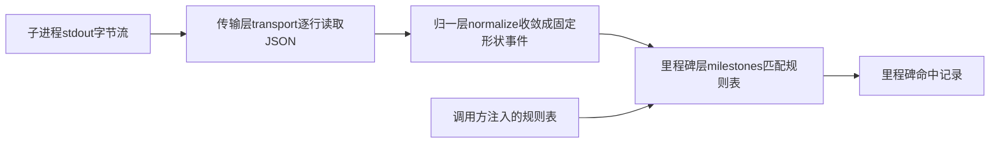
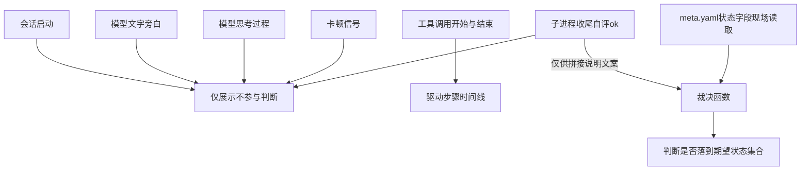
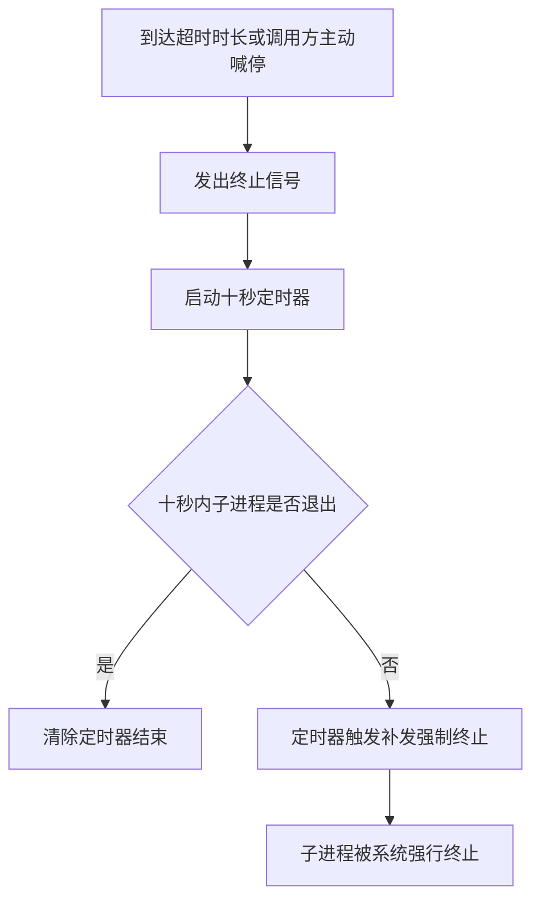

# 无头作业：进程流归一与终局裁决

治理线已经能自己巡检、自己记账了，可这一整套东西还是要你敲一次命令才动得起来。怎么让它在你不在电脑前的时候，自己把一轮任务跑完？

第 24 课交付了一份任务注册表、四个治理 skill（`douyin-retro`、`douyin-ideate`、`backlog-gardener`、`benchmark-refresher`）加自审元层 `account-audit`，外加一轮真实的巡检记账。到这一步，生产线和治理线都能跑通了，但两条线的起点都是你在终端里敲一条命令，或者把一份 Prompt 粘进对话框。这一课要把人从触发这一步摘出去：让一个进程去拉起 Claude Code 的无头模式（headless，不开交互界面，喂一段 Prompt 进去就自己跑到底的命令行用法），自己跑完一个任务，跑完之后还能自己说清楚这次跑得对不对。

这一课的记忆锚点是两条。要造的这个包只认识一件事：子进程 `stdout` 是一串 JSON 行，它不认识任何调用方的业务概念。裁决同样只认一件事：落盘的文件状态，不信进程自己的自述。这两条合在一起，才是无人值守的完整定义，既要能自己跑，也要能自己说清楚跑得对不对、什么时候该停。

本课的输入是你已经跑通的几样东西。一是 `douyin-publish`、`douyin-retro`、`douyin-ideate` 这几个 skill，可以拿来当这一课要观察的对象。二是 `media` CLI 的 core 包，第 12 到 16 课已经造好了锁和原子写这两块逻辑，这一课直接复用。产出是三件东西：一个 `cc-stream` 包（六个文件：`types.ts`、`transport.ts`、`normalize.ts`、`milestones.ts`、`spawn.ts`、`index.ts`），一个只读文件状态的裁决函数，一套分两段走的收尾策略。这一课只造这些标准件本身，凡是提到谁来调用它、把它装进哪个常驻进程的地方，指的都是你要到模块 7 才会造的那个控制台。这一课结束时，你手上还没有一个能看的地方，只有能跑、能自证的几个文件。

## 一、三层解析：从 JSON 行到里程碑

一条无头模式吐出来的 JSON 行，要经过三层加工，才能变成一句人能看懂的进度。第一层只管把子进程的输出流安全地读成一个个 JSON 对象；第二层把这些半成品对象收敛成几种固定形状的事件；第三层拿这些事件去对一张规则表，看看命中了哪一条。三层各管一件事，业务知识只留在第三层的规则表里，前两层的代码里不应该出现任何一个具体任务的名字。

参考流水线就是这么分的。传输层住在 `transport.ts`：逐行读子进程的 `stdout`，把能解析成 JSON 的行往下传，解析不了的行直接跳过，不会因为一行坏数据把整条流读挂。归一层住在 `normalize.ts`：把传输层给的半文档化对象，按几条固定规则收敛成几种统一形状的事件，归一说的就是这道把杂形状化成固定形状的手续。这一层需要记一点状态，因为同一条消息里的工具调用会在流里重复出现好几次，得去重。里程碑层住在 `milestones.ts`：只认一种事件，拿它去匹配调用方注入的规则表，命中了就吐出一个里程碑。这个包自己的头注写得很直接：这是一个通用的无头 CC 观察器，只认识子进程的输出是一串事件，不认识任何调用方的业务概念。

这一课要观察的对象，就是你自己已经跑通的那几个 skill。cc-stream 不需要知道 `douyin-publish` 是发布还是别的什么，它只需要知道这段 Prompt 最终会被 `claude -p` 从命令行拉起来执行、往 `stdout` 吐一串 JSON。反过来想最糟的做法：如果归一层或者里程碑引擎的代码里直接判断某个工具调用是不是在发布，这个包就跟某一次具体任务绑在一起了，明天换一个任务类型，得回头改引擎本身。三层分工的意义就在这里，规则表可以随时换，中间两层的代码不用动。

| 层 | 文件 | 输入 | 输出 | 是否认识业务 |
|---|---|---|---|---|
| 传输层 | `transport.ts` | 子进程 `stdout` 的字节流 | 半文档化的原始事件对象 | 不认识 |
| 归一层 | `normalize.ts` | 上一层给的原始事件对象 | 固定形状的归一事件 | 不认识 |
| 里程碑层 | `milestones.ts` | 归一事件 + 调用方注入的规则表 | 里程碑命中记录 | 规则表本身是业务知识，但住在调用方，引擎不认识 |

数据从子进程流出来，一路怎么被三层收窄成里程碑，看这张图：



三层的骨架定完了，接下来先把最底下这层的形状定下来：归一事件到底有几种，各自管什么。

## 二、七种归一事件与三档信任分级

一条 `assistant` 消息进来，里面可能同时混着一句话、一次工具调用、一段思考过程；一条 `user` 消息进来，可能带着一次工具调用的结果。归一层要把这些拆开，收敛成固定的几种事件，供后面两层统一处理。参考流水线的 `types.ts` 里定义了七种：会话启动 `started`、工具调用开始 `tool`、工具调用结束 `toolDone`、模型的文字旁白 `say`、模型的思考过程 `thinking`、卡顿信号 `stalling`、子进程收尾时给出的终局自述 `done`。

这七种事件不是平起平坐的，参考流水线的设计纪律里把它们分成了三档。模型的文字旁白只用来展示，从不参与任何判断。工具调用相关的两种事件驱动步骤时间线，告诉人现在走到哪一步了。真正的裁决只认一样东西：落盘的文件状态。这一层里的任何一种事件都够不上裁决的资格，包括那个看起来像是终局结论的 `done`。`done` 事件里带着子进程自己给出的 `ok` 这个布尔值，第五节会用两份真实日志说明，它只是第一道信号，够不上最终结论。

| 事件 | 携带什么 | 驱动什么 | 是否只展示 |
|---|---|---|---|
| `started` | 会话 id | 标记一次运行的起点 | 是 |
| `tool` | 工具名、入参 | 驱动步骤时间线（喂给里程碑引擎） | 否，但也不裁决 |
| `toolDone` | 是否报错、结果摘要 | 驱动步骤时间线的收尾 | 否，但也不裁决 |
| `say` | 一段文字 | 什么都不驱动 | 是 |
| `thinking` | 模型的思考文本 | 什么都不驱动 | 是 |
| `stalling` | 卡顿原因 | 提示人这里在等待，不驱动状态 | 是 |
| `done` | 子进程自评的 `ok`、花费、轮数 | 只是第一道信号，够不上终局裁决 | 是（就判断而言） |

`thinking` 这一档有个反直觉的地方：无头模式下，这类事件的正文实测恒为空。参考流水线在真实日志里统计过，十二份任务日志里出现过一百一十一个 `thinking` 内容块，正文字段全部是空字符串，只有一段加密签名有内容。另外单独做过两次真实实验，打开增量输出选项之后，思考过程的增量字段同样是空的。归一层因此只在真的拿到文本时才吐这类事件，今天你几乎看不到它。等哪天命令行工具放开明文输出，这里不用改代码就能自动生效。

```
Prompt：新建 cc-stream 包的 types.ts，定义七种归一事件的类型：started（带会话 id）、
tool（带这次工具调用的 id、工具名、入参）、toolDone（带 id、是否报错，外加一份用于
展示的结果摘要）、say（带 messageId 和文本，同一个 messageId 后来的内容按最新一条
覆盖）、thinking（带思考文本，仅在真有文本时才用这个类型）、stalling（带卡顿原因，
取值只有两种）、done（带子进程自评的是否成功、花费、轮数、耗时）。再新建
normalize.ts，实现一个有状态的归一函数：接收子进程 stdout 解析出来的半文档化对象，
按对象里的类型字段分流处理，收敛成上面七种事件之一；同一条 assistant 消息里的工具
调用会随着内容增长在流里重复出现，要按调用的 id 去重，只在第一次出现时吐出对应的
事件。
```

事件归一好了，下一个问题是怎么从这串事件里认出走到哪一步了。

## 三、里程碑引擎与规则表的分工

里程碑引擎只对一种事件求值，工具调用开始这一种。这个取舍背后是参考流水线的一条核心判断：进度要看子进程实际动了什么手，不看它嘴上怎么说，`say` 和 `thinking` 从设计上就没有资格驱动里程碑。

引擎本身很薄：接收一张规则表，每条规则说清楚要匹配哪个工具名，可选地再匹配这次调用的入参里某个字段要满足什么样的正则。命中一条默认只吐一次，后面同一条规则不会重复命中。规则表长什么样，引擎不管，也不认识。参考流水线的 `milestones.ts` 头注写得很直白：规则表内容属于领域知识，住在调用方，引擎本身不认识任何一条规则说的是什么业务。换一种任务类型，只需要换一张表，不用碰引擎代码。

拿治理线的巡检举个例子，一次 `harness-dispatcher` 调度出去的巡检任务，大致要走四步：先读任务卡，再执行对应的技能，技能跑完要产出一份报告，最后记一笔账。这四步落成一张规则表，大概是这样：

| 里程碑 | 匹配条件 | 命中一次后 |
|---|---|---|
| 读任务卡 | 工具是 Read，入参的文件路径匹配 `harness/tasks.md` | 失效，不重复吐 |
| 执行技能 | 工具是 Skill | 失效，不重复吐 |
| 产报告 | 工具是 Write 或 Edit，入参的文件路径匹配 `harness/logs/` 或 `content/_research/` | 失效，不重复吐 |
| 记账 | 工具是 Bash，入参的命令里出现 `index.jsonl` | 失效，不重复吐 |

这张表跟三层引擎并不冲突。读任务卡这个动作发生了，引擎不需要知道它读的是治理线的任务卡还是别的什么文件，只管拿这次工具调用去跟规则表里的正则比对，比对上了就吐一个命中记录。

```
Prompt：新建 cc-stream 包的 milestones.ts，实现一个里程碑引擎 createMilestoneEngine(table)，
接收调用方注入的规则表（数组，每条含 id、label、match.tool 精确名或正则、可选的
match.input 逐字段正则、once 默认 true），返回一个 feed(event) 函数：只对事件种类是
工具调用开始的事件求值，其余一律返回空数组；命中一条 once 规则后记住它的 id，同一次
运行内不再重复吐出；这个文件不能出现任何具体任务的字眼，比如"配音""发布"，只做通用
匹配。再单独给我一张治理线巡检的示例规则表：读任务卡（Read 读 harness/tasks.md）→
执行技能（调用 Skill 工具）→产报告（Write 或 Edit 写 harness/logs/ 或 content/_research/
下的文件）→记账（Bash 命令里出现 index.jsonl），四条都设成只命中一次。
```

引擎齐了，剩下的问题是怎么真的拉起一个无头进程，把它的输出喂给这套三层解析。

## 四、拉起无头 claude -p：三个坑与一次验证

拉起一个子进程看着简单，实际有三处容易出问题：继承来的环境变量能不能照抄，子进程卡住不动了怎么办，`stdout` 该一次性读完还是一行行读。参考流水线的实现里，这三处各有一套对应的处理。

### 4.1 三个坑：认证、超时、输出流

第一个坑是认证，参考流水线撞过的情况是：那台机器登录 Claude Code 之后，环境变量 `ANTHROPIC_API_KEY` 里存的其实是一段 OAuth token，不是官方发的那种 API key。如果你的环境变量里也有这个变量，子进程原样继承，就会把它当成 API key 传给接口，换来一句认证失败。对策是 spawn 子进程之前，从继承的环境变量表里把这个变量剔除掉，剔除之后子进程会退回读本机 `~/.claude` 下的登录凭证，跟你自己在终端里敲 `claude` 命令时用的是同一份身份。

第二个坑是超时，子进程有可能卡在某个工具调用里不动了，比如等一个迟迟不返回的请求。不设超时，这个子进程就会一直占着，没人知道它是还在执行还是已经死掉了。留一个可选的超时参数，到时候触发终止。具体怎么终止，收尾这一步足够关键，不适合一笔带过，放在第六节单独讲。

第三个坑是输出流怎么接。`stdout` 是一行一个 JSON 对象的格式，一行就是一条完整消息，不能把整个流当成一个大 JSON 去解析，那样得等到流结束才能拿到任何一点内容，长任务就要一直空等到最后。正确做法是用逐行读取，每一整行单独尝试解析，解析失败的行直接跳过，不让一行坏数据拖垮整条流。这一步还要一并做一件事：每一整行不管解析成不成功，都先原样往一个日志文件里追加一份，这份原始记录是后面排障唯一能信的东西。

```
Prompt：新建 cc-stream 包的 transport.ts，实现 parseStream(stdout, { onRaw })，用逐行
读取的方式接子进程 stdout，每一整行（不管后面 JSON 解析成不成功）先过一遍 onRaw 钩子，
用于原始行落盘排障；JSON 解析失败的行直接跳过，不抛异常；如果这一行本身是系统噪音
（比如钩子事件），在这里丢弃，不传给下一层。再新建 spawn.ts，实现 runHeadlessCC(opts)：
拉起 claude -p <prompt> --output-format stream-json --verbose --allowedTools <白名单>，
子进程环境变量默认剔除 ANTHROPIC_API_KEY（留一个参数可以扩展要剔除的其它变量名）；
opts 留一个可选的超时时长，到时候触发终止（怎么终止下一步会补）；把 spawn、传输层、
归一层组合好，返回一个归一事件的异步流、进程 pid、一个终止方法和一个收尾结果的
Promise。最后建 index.ts，把这几个函数和用到的全部类型统一导出。
```

### 4.2 用最小任务真跑一次

六个文件拼不拼得起来，光看代码看不出来，得拿一个最小任务真跑一次。参考流水线自己的测试策略里，用来验证协议没漂移的探测任务足够简单：读一个文件、跑一条 `echo` 命令、正常收尾。照这个思路，挑一个你已经有的文件当靶子就够，比如读一遍 `pipeline/daily-run.md`、再跑一条 `echo` 打印一句确认，工具白名单只给 `Read` 和 `Bash` 两个，不多给。

跑完之后，对着归一事件流核三件事。第一，会话启动事件的会话 id 是不是一个非空字符串。第二，每一次工具调用事件是不是都能找到对应的一次工具调用结束事件，两边的 id 对得上。第三，流的最后一个事件是不是收尾事件，里面的 `ok` 是不是符合预期。

结果里看不到任何一次工具调用结束事件，常见原因是工具白名单卡得太死，或者这份 Prompt 本身没有要求它真的去读文件、跑命令，只是让它嘴上应付几句。另外留意一下结果的展示字段：工具调用结束事件里的结果摘要只取前二十行，超出部分会标出被截断，还会记一个截断前的原始字节数。想看完整输出，得回头翻那份原始 JSONL 落盘，展示字段从设计上就不是给你看全文用的。

cc-stream 六个文件齐了，能吐出正确的事件流，可跑完这一次算不算成功，还得有人拍板。

## 五、裁决依据与并发控制

一次真实的创作任务，中途撞上了会话限额，模型的旁白里直接出现了一句英文提示：会话已经到限额了，几点几分重置。子进程收尾时给出的自评是报错，但这不是这次任务的最终结论。真正定案的是裁决函数现场去读这条内容自己的 `meta.yaml`，看到状态还停在创作中，没有翻到出审那一步，判定这次没跑完。这是一份真实的日志，参考流水线的实现留了痕：子进程自己怎么说，跟状态真的落到了哪一步，是两件不搭界的事，裁决只认后者。

### 5.1 裁决函数：读条目 meta.yaml 的 status，判它是否落到预期值

还有一份日志更能说明问题：一次发布任务，模型的旁白里已经明说了这次发布没有真的执行，卡在了物料校验那一步。裁决函数打出来的结论文案，却是一句固定模板：子进程声称成功，但状态还停在审核通过。这句话跟模型实际说了什么对不上，原因很简单，裁决函数的实现里压根没有一行代码去读这个旁白字段。这不算选择性地不信任，裁决函数根本没有读这段自然语言的能力。

这条约束你不是第一次遇到。第 9 课要求 `dubbing-reviewer` 这个裁判子代理的工具白名单里物理拿掉 `Edit` 和 `Write`，让判的人改不了任何文件。这一课是同一类约束的第二次出现，只是约束的落点换了地方。那一次约束的是权限，判的人没有能力去改；这一次约束的是依据，裁决函数的实现里没有读取自然语言输出这一步，它没有能力去信。

裁决函数要做的事很单薄：现场读这条内容目录下 `meta.yaml` 的状态字段，判断它落没落在这次任务期望的状态集合里。现场读，是因为常驻进程里如果维护着一份缓存快照，这份快照可能比磁盘上的真实文件落后几百毫秒，裁决这种事没资格用一份可能过时的东西。子进程报没报错这个信号，参考流水线的实现里也没有丢掉，但它只用来拼一句解释文案，不能单独决定裁决结果。

| 裁决类型 | 输入 | 读哪个文件的哪个字段 | 期望状态集合 | 输出 |
|---|---|---|---|---|
| 创作裁决 | 内容的 slug | 该条目 `meta.yaml` 的状态字段 | `review` | 是否落到期望值、读到的真实状态、期望集合、一句说明 |
| 重做裁决 | 内容的 slug | 同上 | `review` | 同上 |
| 发布裁决 | 内容的 slug、子进程是否报错 | 同上 | `published` 或 `scheduled` | 同上 |

```
Prompt：写一个裁决函数，输入是内容条目的 slug 和子进程有没有报错这个布尔值，不读任何
模型生成的自然语言输出。函数体只做一件事：现场读这条内容目录下 meta.yaml 的状态字段
（不要用任何缓存的快照，直接读磁盘），判断它是不是落在这次任务期望的状态集合里（比如
创作任务期望 review，发布任务期望 published 或 scheduled）。返回一个对象：是否落到
期望值、读到的真实状态、期望集合、一句给人看的说明。子进程报没报错这个信号只用来拼
说明文案里的措辞，不能单独决定裁决结果。
```

裁决说没通过，可你翻记录觉得子进程其实把活干完了，常见原因是期望状态集合写窄了，漏掉了某个同样合法的终态；这种时候该改的是期望集合，不是绕开裁决函数自己拍板。

七种归一事件各自能不能参与裁决，跟真正喂给裁决函数的是哪条数据，摆成一张图：



### 5.2 并发控制：锁文件与陈旧判据

裁决管的是一次任务跑完之后该怎么判，锁管的是跑之前先别撞车。同一条内容不能被两个进程同时改，这条约束不是新东西。第 12 到 16 课造 `media` CLI 的时候，core 包里已经有一把咨询锁在管这件事，这一课不重新造一遍，直接复用。

锁的做法是抢一次排它创建：谁先用排它方式把一个锁文件写出来，谁就拿到锁，文件里记着自己的进程号、时间戳和正在跑的命令。抢不到的时候，锁文件已经在了，读出里面记的进程号和时间戳，判断这把锁是不是已经没人管了。这种没人管的状态叫陈旧，判断它要两个条件同时成立，缺一个都不算：一是这把锁记录的时间距现在已经超过一个陈旧阈值，二是记录的那个进程号已经不在了。参考流水线这个阈值给的默认值是三十秒。具体放多少，第 13 课写 `media` SPEC 时，风险与待定项那一节已经留过一句：锁文件放多久算陈旧没有立刻定下来，先按一个默认值实现。你自己 core 包里现在跑的是当时定下的那个数，跟三十秒不一定是同一个值，但两个条件同时成立这条判据不变。两个条件都满足，才允许把旧锁文件删掉、自己重新拿到锁，这一下叫抢占，抢占要往标准错误流打一行痕迹，写清楚被抢占的是哪个进程、哪条命令、什么时候留下的锁。两个条件缺一个，直接报错退出，不排队等。

| 锁规格 | 内容 |
|---|---|
| 锁文件放哪 | 仓库根目录下一个约定文件名，跟具体某条内容的目录分开放，一次只需要一把全局锁 |
| 锁文件里写什么 | 当前进程号、抢锁时的时间戳、正在执行的命令 |
| 陈旧判据的两个条件 | 距记录时间超过陈旧阈值（参考流水线默认三十秒，按你自己第 13 课定的数来），且记录的进程号已经不在了；两个都满足才算陈旧 |
| 抢占后要留痕 | 往标准错误流打一行，写清楚被抢占的进程号、命令、留锁时间 |

两个条件缺一个就不敢抢，各有各的道理。只满足超时但进程还活着，可能只是这一步任务本来就要跑很久，误抢了会导致两个进程同时改同一份文件。只满足进程已经不在了但还没到陈旧阈值，进程刚异常退出的这几秒里可能还有别的清理动作没走完，立刻抢占也不安全。两个条件叠在一起，才能确认这把锁是真的没人管了。锁不是排队机制，宁可保守报错，也不做成谁都能等一等再抢的队列。

抢锁总是失败，常见原因是陈旧判据只满足了一个条件：进程其实还活着，或者时间还没到陈旧阈值。两个条件缺一个就只能等，手动删锁文件反而可能把一个正在正常跑的任务写乱。

```
Prompt：看一下 media CLI core 包里已有的锁实现，抢一把咨询锁、判断陈旧、原子创建锁
文件那部分逻辑，给无头作业复用同一套：抢锁时用排它方式创建一个锁文件，写进当前进程号、
时间戳、正在执行的命令；抢不到就读旧锁文件里记的进程号和时间戳，只有同时满足超过
它现有的那个陈旧阈值未释放、且那个进程号已经不存活这两个条件，才允许删掉旧锁文件
重新抢占，阈值本身不要改，直接用已有实现里的那个值；抢占这一下要往标准错误流打一行
痕迹；两个条件缺一个就直接报错退出，不排队等待。
```

裁决和并发都管住了，进程本身怎么正常收尾，收不住的时候怎么恢复，还没定。

## 六、进程收尾与重启恢复

超时之后不能一上来就强杀。子进程收到终止信号的那一刻，手上可能正压着一个还没写完的临时文件，直接杀掉，留下的是半截内容和收不回的孤儿进程。参考流水线的做法是分两段走：先发一个终止信号，给子进程一点时间自己收场，等过了宽限期它还没退出，再补一记强制终止。

### 6.1 收尾时序：终止信号、宽限期、强制终止

到达设定的超时时长，或者有调用方主动喊停，先发出的是终止信号，同时挂一个十秒的定时器。子进程如果在十秒之内自己触发了退出，定时器被清掉，事情到此结束。十秒之后子进程还没有退出，定时器一到，补发一记强制终止，这一次不再给任何机会。

| 信号 | 触发时机 | 等待时长 | 下一步 |
|---|---|---|---|
| 终止信号 | 到达超时时长，或调用方主动喊停 | 立即发出 | 挂一个十秒定时器，等子进程自己退出 |
| 强制终止 | 十秒宽限期内子进程仍未退出 | 立即发出 | 子进程被系统强行终止，收尾结果随之确定 |

这套逻辑最早只接在超时这一条路径上。参考流水线后来在看板上加了取消任务这个能力，才把人工喊停也接进同一套两段式处理。两条触发路径现在共用同一个十秒宽限期的定时器，重复调用不会出问题：定时器已经挂上了，再喊停一次也不会重复挂第二个。

进程杀了，但监控里看它还占着资源没退干净，常见原因是子进程自己又派生出了下一层子孙进程，强制终止只带走了直接子进程，没带走它的下一层。

```
Prompt：给子进程实现一个分两段走的终止方法：调用时先发一个终止信号，同时起一个十秒
的定时器；十秒内子进程自己触发了退出事件就清掉这个定时器，什么都不用再做；十秒后
子进程还没退出，定时器触发时补发一次强制终止。这个方法要同时接住两条触发路径：到
达超时时长时自动调用它，调用方主动喊停时也调用同一个方法，不要各写一套；两条路径
共用同一个定时器状态，重复调用要幂等，定时器已经挂上就不再挂第二次。
```

两条触发路径怎么汇成同一套两段式收尾，看这张图：



### 6.2 恢复规则：两种触发场景与重建结论的依据

一个进程记着任务跑到哪一步了，这份记忆只活在内存里，进程一死就没了。这一课能给的真相源，从头到尾只有一个：`meta.yaml`。判断一个任务的最终结果，永远走一遍第 5.1 节的裁决函数，现场读这个文件，内存里的任何记忆都只是加速手段，够不上真相来源。

两种场景都会让内存态变得不可信：人在界面上点了取消，或者进程连同它所在的服务意外重启，不管是断电、崩溃还是手动重启。两种场景要做的第一件事是同一件：不管内存里显示到哪一步了，都当它没发生过，重新走一遍裁决函数。区别在收尾要不要多做一步。意外重启之后，上一轮任务如果正好抢着那把咨询锁没释放，新一轮任务得先靠第 5.2 节的两个陈旧条件正常抢占，不能被一把没人管的死锁卡住。进程如果是被系统杀掉或者宿主服务重启带走的，锁文件里记的那个进程号立刻就查不到了。但陈旧判据里超过阈值这一条不会因为进程已经死了就跳过，还是得等满。

| 触发场景 | 内存态怎么处理 | 从哪个文件兜底重建结论 |
|---|---|---|
| 人工取消 | 丢弃，不当成真实结果 | 复跑一次裁决函数，现场读 `meta.yaml` |
| 进程或服务意外重启 | 整份内存记录当成不存在 | 同样复跑裁决函数读 `meta.yaml`；上一轮留下的咨询锁按第 5.2 节的两个条件正常抢占 |

参考流水线在这条原则上又往前走了一步：控制台后端给每次任务收尾都额外落一份终态快照。重启后先查这份快照，查不到再退回原始事件流当中途状态处理，两者都没有才算没跑过。这一层更细的兜底属于模块 7 要造的控制台，这一课不用去搭它。但它遵守的还是同一条原则：内存不可信，真相在文件里，落盘的东西会随着系统长起来变得更细，原则本身不变。重启后新一轮任务反而抢不到锁，常见原因是旧锁刚好卡在陈旧阈值的判定窗口里，等一下就好，不用手动删。

无人值守这条线该收口了。这一课造出了一个不认识任何业务概念的 `cc-stream` 包：三层解析、七种归一事件、一个通用的里程碑引擎、一次真跑通的无头 `claude -p`。加上一个只读文件状态的裁决函数，一套分两段走的收尾策略，还有一条内存不可信、真相在文件里的恢复原则。整条流水线能无人值守跑完了，可你只能靠翻文件和日志知道它跑到哪。第三件重活：给它做个能看的控制台。
