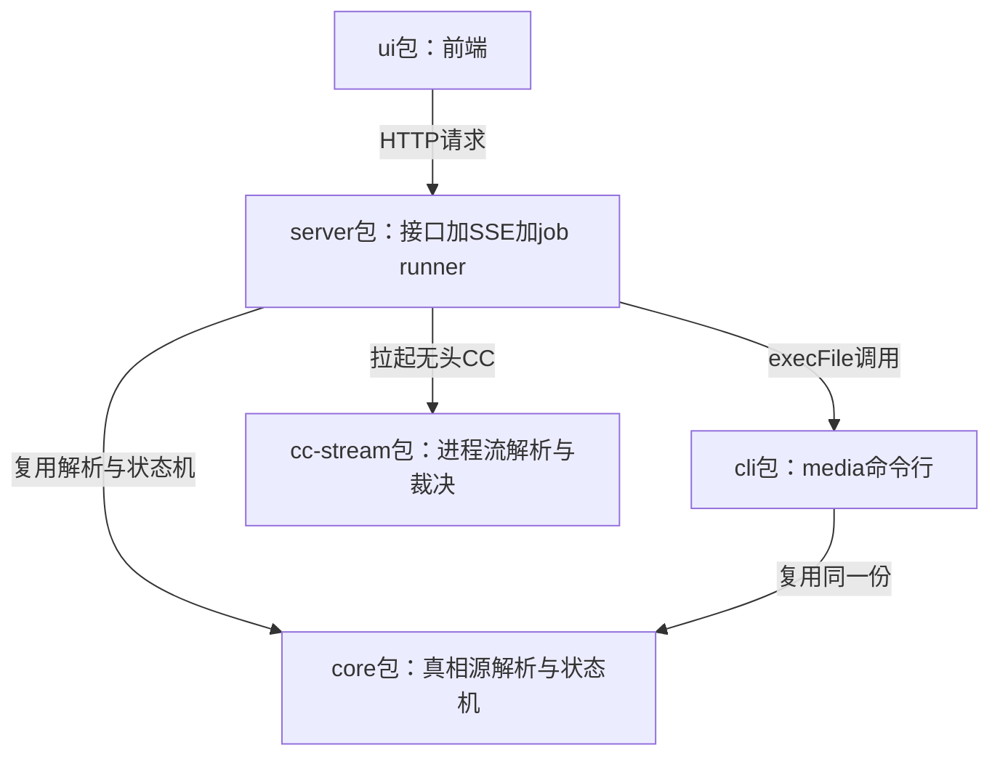
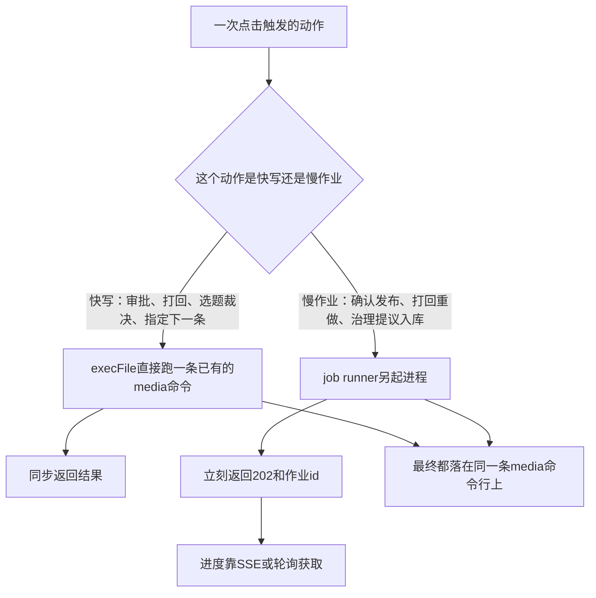

# 设计稿与契约：控制台六页的范围、选型和规格

整条流水线能无人值守跑完了，可你只能靠翻文件和日志知道它跑到哪，这是第 25 课收尾时留下的话。这一课要给它做一个能看的地方，动手之前先说清一件事：随课发放的那九页设计稿是能点开看的静态原型，给的是规格参照，不能当代码抄。原型定的是像素和布局，规格定的是边界和接口，管的不是同一件事。把原型的某个按钮位置、某段配色抄进代码没问题，但如果把原型里出现过的每一个字段、每一次点击都当成后端已经支持的能力去实现，很容易做出一堆界面好看却没有数据撑着的空壳页面。

这一课走第 11 课那套 SPEC 六步方法的前四步：调研、讨论选型、决策、写 SPEC，SPEC 就是一份能照着施工的规格文档。执行和验证留给第 27、28 课。

本课的输入有四样。一是随课发放的设计稿，放在 `docs/Iterative-spec/0904-AI自媒体课程体系-v3/appendix/design/` 目录下，九个 HTML 文件加一份 `css/theme.css`、一份 `README.md`。`index.html` 是导航入口，`overview.html`、`kanban.html`、`detail.html`、`backlog.html`、`harness.html`、`metrics.html` 六页是本轮要建的，`review.html`、`harness-task-detail.html` 两页是下一期页面，这一课不碰，理由第 1 节细说。二是一份界面用语对照表，路径是 `docs/Iterative-spec/0904-AI自媒体课程体系-v3/appendix/26-界面用语对照表.md`，写清楚状态词、表格列头、按钮文案的中文写法，抄字段名的时候顺带对一眼，别把表里已经标了要改掉的旧写法又抄进去。三是第 25 课交付的 `cc-stream` 包和裁决函数，用来判断控制台到底要暴露哪些数据。四是第 11 课的六步模板四件套，只引用，不重新定义。

产出是三份文档，落在 `docs/spec/console/`：`00-调研.md`、`01-ADR.md`、`02-执行方案.md`。

## 一、调研：九页原型的范围与数据源

九页原型里，`index.html` 只是个导航壳，点进去分别是六个真正的业务页面：总览、生产看板、内容详情、选题池、治理线、数据复盘。这六页是这一轮要建的东西；剩下的 `review.html` 和 `harness-task-detail.html`，附录 README 里写得很直接，它们对应审核台和治理任务详情两个能力，都是下一期页面。参考流水线里也还没做这两页背后的后端，这一课看到就跳过，本来就不在这一轮范围里。

在看任何一个像素之前，先把四道选择题摆出来对比，一共八条候选方案。这四道题在原型上看不出来，却决定了这六个页面能不能跑起来：控制台的前端和后端要不要合成一个进程对外服务；文件变了之后，后端要重新算全部数据还是只算改动的那一小块；浏览器和后端之间要挂一条 SSE 长连接推变更（SSE 就是服务器单向往浏览器推消息，省得浏览器反复发请求问有没有更新），这条连接断了、重连之后要怎么补上断线期间漏掉的东西；六个页面上那些表格、步骤条、确认弹窗，是找一套现成的组件库来搭，还是自己手写。

| 方案 | 适用前提 | 代价 | 已知失败模式 |
|---|---|---|---|
| 单端口合并部署 | 前端构建产物和后端服务同进程跑，不用处理跨域 | 后端要把前端构建出来的静态文件一起托管，多一个忘了重新构建前端、旧页面继续对外发的坑 | 除接口路径外的请求一律回退到前端首页，路由名字拼错时页面会安静地显示首页而不是报错，容易被当成页面还没写完 |
| 前后端分离部署 | 前端和后端各自独立跑、各自有端口，团队分工明确、要各自扩容 | 每加一个新接口都要过一遍跨域白名单，多一层长期要维护的配置 | 本地开发机大概率没有对外服务的打算，分离部署等于还要多解决两个进程怎么互相找到对方这个问题，这个问题跟控制台本身要解决的事没关系，是为了凑齐分离部署这个前提才专门背上的负担 |
| 数据全量重建 | 数据源规模小，几十上百份 YAML 全部重新扫一遍能压到毫秒级 | 文件只改了一处，也要把全部数据源重新读一遍 | 数据源规模涨到几千上万条时，重建耗时会跟着涨，界面响应会明显变慢，这一条现在的规模碰不到，记进待定项 |
| 数据增量重建 | 数据源规模已经大到全量扫描明显拖慢响应 | 要单独维护一份文件和缓存条目的映射表，这份表本身也可能跟磁盘上的真实文件不同步 | 映射表算错一次，某条内容的变化就漏推给前端，界面停留在旧数据上，这类漏推很难在测试里稳定复现 |
| SSE 断线丢了重拉配 revision | 前端只关心当前最新状态是什么，不关心断线期间具体发生过几次变化 | 每次重连都要重新拉一次全量快照，哪怕断线期间只改了一个字段 | 重连和文件变化前后脚发生时，短时间内可能重复拉两次，不影响正确性，只是多打一次请求 |
| SSE 事件补发队列 | 前端要精确回放断线期间的每一次变化，比如要做变更时间线 | 服务端要维护一份按时间顺序保留的事件队列，队列多长够用、多长该丢要单独拍板 | 断线时间一旦超过队列保留窗口，照样要退回全量重拉，等于多维护了一套很少真正生效的机制 |
| 组件库加 token 映射 | 界面里有大量成熟组件能直接覆盖的交互，比如表格排序筛选、步骤条、二次确认弹窗 | 组件库自带一套默认视觉，要花一层映射工作把设计稿的颜色、圆角、字号接进组件库的主题配置，不能拿来就用默认样式 | 映射这层做得不到位，界面会一半是设计稿的颜色、一半是组件库默认蓝，两套视觉搭在一起违和感很重 |
| 手写全部交互组件 | 界面交互足够简单，用不上排序筛选这类重逻辑 | 原型里最重的几块交互，数据表格的排序筛选行展开、任务进度的步骤条、危险操作的二次确认，全部要自己实现一遍 | 手写的排序筛选往往在极端情况下，比如同时排序又筛选，出现边界条件没覆盖到的问题，这类问题在只读原型阶段不会暴露，接了真实数据之后才冒出来 |

这张表定了这四道题的取舍范围，还没定该选谁。选型要等下一节吵完才拍板，这一节只负责把六页范围划清楚，把每一页对应的数据源找出来。

```
Prompt：读 docs/Iterative-spec/0904-AI自媒体课程体系-v3/appendix/design/ 目录下
九个 HTML 文件和 css/theme.css，逐页标出这页最终要展示的内容，现实里应该来自
仓库的哪个真实数据源（比如某条内容的 meta.yaml 字段、backlog.yaml、
harness/tasks.md、cc-stream 吐出的运行事件）。九页里如果有页面找不到对应的
真实数据源，单独列出来并说明理由：可能是这个页面本身不在这一轮范围内，
也可能是数据源现在还不存在。不要读任何代码，只读这九个 HTML 和 theme.css。
```

拿到结果先看三点。第一，`review.html` 和 `harness-task-detail.html` 是不是被单独列出来了，写没写清楚是下一期页面这条理由，而不是被当成普通页面强行配了一个数据源。第二，其余六页有没有各自对应到一个具体文件或者具体字段，不能是笼统一句这页展示看板信息。第三，`index.html` 大概率也会被标成找不到独立数据源，这属于正常结果，它本来就只是导航壳，不需要专门给它配一个接口。如果 AI 交回来的清单里某个页面的数据源写得很笼统，没有具体到哪个文件的哪个字段，常见原因是它没有真的去读这一页的 HTML 结构，只是凭页面名字猜的，回去让它把具体字段名列出来再核一遍。

六页范围划清楚了，但每条路线该怎么选还没吵过。

## 二、讨论选型：八条候选各自的适用场景与失败模式

上一节的对比表里，单端口合并部署和组件库加 token 映射这两条看起来更顺理成章，AI 写方案的时候很容易不自觉把它们写得比另外两条饱满，因为这两条路线的代价好描述，也好想出解决办法，分离部署和手写前端反而因为不常用，代价和失败模式都写得潦草。所以得让它单独给每条路线找一次活路，说清楚在什么条件下它会赢，而不是顺嘴把已经内定的方向再论证一遍。

```
针对调研节对比表里的四组八条方案（单端口合并部署 vs 前后端分离部署、数据全量
重建 vs 数据增量重建、SSE 断线丢了重拉配 revision vs 事件补发队列、组件库加
token 映射 vs 手写全部交互组件），分别扮演每条方案的支持者，依次回答：
1. 这个方案在什么场景下是对的选择？
2. 选它要多付出什么代价？
3. 主动交代它已知的失败模式：什么情况下它会输，输给对方？
4. 不要下综合来看方案更好这类结论，只交代前三条。
八条方案都要独立走完这四步，不要在中途互相比较。
背景：这是一个跑在本地开发机上、给一个人自己用的控制台，数据源规模是几十到
上百份文件，不是面向多团队的生产系统。
```

拿到结果核一点：分离部署和手写前端这两个天然处于劣势的候选，有没有说出一条具体、站得住的失败模式，而不是一句泛泛的看场景而定。如果某个候选只报优点，说不出一条具体的失败模式，通常是候选描述本身带了倾向，比如把背景条件写得模棱两可，让 AI 顺着已经内定的方向去答。把背景那句话写死成一个确定的事实再重问一遍，AI 就没有含糊其辞的余地，谁对谁错得它自己接住。

每条路线都认真质疑过一轮了，可以拍板。

## 三、决策：五包一仓和两条写路径落成 ADR

控制台是给一套已经能自己跑完全程的流水线加一层可以看、可以点的界面，不是另起一套系统。这句话定了这一节每一条决策共同要回答的问题：会不会破坏第 15 课立起来的那条唯一写入口，也就是全仓状态只能经 `media` 命令行改写，不能有第二条路径绕过去。四条决策，逐条都要能回答这个问题。

`01-ADR.md` 按第 11 课定下的四项写，决策、理由、被否方案、反悔成本，四项之外不加别的字段：

```
ADR-1 五包一仓边界
决策：单仓多包，`tools/console/` 下五个包：core（第 14 课已交付，真相源的
  解析与状态机）、cli（第 14、15 课已交付，media 命令行）、cc-stream（第 25
  课已交付，无头进程流的三层解析和裁决函数）、server（这一课新增，HTTP 接口
  加 SSE 加 job runner）、ui（这一课新增，前端）。
理由：前三个包早就按这条边界在跑了，只是没有正式收口；新增的两个包分别管
  对外提供接口和渲染界面两件不同的事，各自的依赖树不一样，server 不需要打包
  前端框架，ui 不需要常驻监听文件系统，合并成一个包只会让两边的依赖互相拖累。
  server 不允许直接改任何文件，一律经 media，不破坏唯一写入口。
被否方案：把 server 和 ui 塞进同一个进程、同一个包里对外提供服务。
反悔成本：低。五个包各自有独立的 package.json，以后要拆得更细或者合并回去，
  改的是 workspace 配置，不动业务代码。

ADR-2 读路径
决策：六个页面各配一个快照接口，另外加 file（读白名单内的受控文件）、asset
  （读封面等静态物料）、health（带一个自增的 revision 号）三个横切接口；数据
  变了不用轮询，靠 SSE 推一条通知。
理由：每个页面只要自己那份数据，接口按页面切而不是按数据表切，前端拿到手就是
  自己要的东西，不用再拼一次；file、asset、health 三件事不属于任何单一页面，
  单独做成横切接口，不塞进六个快照接口里面。全部是读操作，不涉及任何写入口。
被否方案：一个大而全的接口把六个页面的数据一次性吐出来。
反悔成本：中。往后加页面只用加一个新接口，不碰旧接口；但如果一开始真走了大
  对象这条路，后来想拆开，前端六个页面的取数逻辑要跟着全部改一遍。

ADR-3 写路径两条
决策：四类动作走快写，`execFile("media", [...])` 直接跑一条已有的子命令，
  毫秒级同步返回；三类动作走慢作业，job runner 另起进程去跑，立刻返回一个
  202 状态码加一个作业 id，进度靠 SSE 或者轮询去取。
理由：第 25 课的裁决函数只认落盘的文件状态，不认进程自己怎么说。审批、打回、
  选题裁决、指定下一条要做的选题这四类动作，背后本来就是一条已有的、跑得完的
  命令，没必要绕道开一个子进程；确认发布、打回重做、治理提议入库这三类背后是
  一次要跑几分钟的判断性任务，浏览器等不起，也不该让它挂起。两条路径最终落的
  都是同一条 media 命令行，没有第二个进程能绕开它直接改文件，唯一写入口没有
  被打破。
被否方案：所有写动作统一走 job runner，哪怕是毫秒级的也排队等一次子进程调度；
  或者反过来，所有写动作都同步跑完再返回，长任务会把浏览器的这次请求直接拖到
  超时。
反悔成本：高。如果日后某个快写动作因为要接一层完整校验而变慢，得把它挪到慢
  作业那条路径，前端的调用方式要跟着从等待返回结果换成轮询或者监听 SSE，
  改动量不小。

ADR-4 前端 token 映射
决策：`css/theme.css` 里的颜色、圆角、字号、间距这些视觉 token，原样映射进
  前端选用的组件库的主题配置，不重新配一遍色。
理由：原型手写最重的地方，比如数据表格的排序筛选行展开、任务进度的步骤条、
  危险操作的二次确认弹窗，正是成熟组件库现成能解决的问题；视觉上的冲突用
  token 映射来解决，不是让组件库用自己的默认蓝，也不是原型自己重新画一套
  组件。这一条只涉及界面显示，不涉及任何写路径。
被否方案：手写全部交互组件，或者放弃原型视觉，直接用组件库的默认样式。
反悔成本：低。以后真要换一套组件库，只用改这一层映射表，原型本身的 token
  不用动。
```

五个包谁调用谁、谁复用谁的边界，摆成图更容易一眼看清。



四条定完之后，再把包的边界看一遍，分清哪些包是前面课已经交付的、哪些是这一课新加的。`core`、`cli`、`cc-stream` 三个包前面的课已经做出来了，这一课只是把它们正式收进单仓多包这道边界里；真正新加的是 `server` 和 `ui`，这两个包现在还没有一行代码。

决策拍完板，落地成能施工的规格还差一步。

## 四、写 SPEC：把决策展开成 API 清单和执行方案骨架

ADR 只回答了选哪条路，没回答这条路上具体有几个接口、每个接口读什么写什么。执行方案要把这四条决策拆到能施工的粒度，第 27、28 课直接拿它去实现，不用回头再问一遍这里到底怎么设计。`02-执行方案.md` 按第 11 课定下的四节模板写：

```
# 02-执行方案
## 1. 实施步骤    第 1 步…第 N 步；每步 = 做什么 / 产出物 / 验收标准 / 依赖
## 2. 接口 × 功能 × 详细设计    逐条穷举
## 3. 对外契约    本部分提供给 / 依赖其他部分的接口
## 4. 风险与待定项    拍板未覆盖的点全部落这里，标注需要用户裁决的项
```

第 1 节实施步骤分三步，切法不看代码模块，看每一步能不能拿真实数据跑出一句可验证的话。

第 1 步起 server 的只读骨架，六个快照接口加 file、asset、health，接口内部一律复用 core 包已有的解析逻辑去读文件，不自己重新解析 YAML。六个页面各自要的汇总数据得新写一层拼装逻辑，这层逻辑收进 core 包一起维护，别散落进 server 包，以后 CLI 和 server 就能共用同一份解析结果。产出物是一个能常驻运行的 HTTP 服务；验收标准是对九个读接口挨个发一次请求，全部返回而且数据形态跟第 2 节的接口清单对得上；这一步不依赖任何还没交付的东西。

第 2 步接上 SSE，让文件变化能推到前端。产出物是一条长连接的事件流；验收标准是手改任意一条内容的 `meta.yaml` 字段，能在短时间内收到一次通知，revision 号跟着自增；依赖第 1 步的六个快照接口已经能跑通。

第 3 步补写路径，四条快写和三类慢作业都接上。产出物是写 API 全通；验收标准是在飞书的审核卡上点一次通过，看状态变化是不是走了控制台的写接口，而不是飞书服务自己落的盘；依赖第 2 步的 SSE 已经能把变化推给前端做验证。

### 4.1 API 清单：六个读接口逐条穷举

六个快照接口按页面切，不按数据表切，一页一个：

| 接口 | 对应页面 | 数据来源 |
|---|---|---|
| `GET /api/overview` | 总览页 | 晨检、警报、分级待办，来自全仓 `meta.yaml` 与 `backlog.yaml` 汇总算出 |
| `GET /api/contents` | 生产看板页 | 全部内容条目的当前状态，来自全仓 `meta.yaml` 汇总 |
| `GET /api/content/:slug` | 内容详情页 | 单条内容的完整 meta 与审核记录，加这条内容按 state 模块迁移表当前允许翻到哪些状态 |
| `GET /api/backlog` | 选题池页 | `backlog.yaml` 投影 |
| `GET /api/harness` | 治理线页 | `harness/tasks.md` 注册表加运行账本 |
| `GET /api/metrics` | 数据复盘页 | `harness/logs/metrics.jsonl` 投影 |

`review.html` 和 `harness-task-detail.html` 没有对应接口，这两页不在这一轮范围里，不用为它们预留位置。除六个快照接口外，还有三个横切接口，横切的意思是它们不专属于哪一页，六个页面都可能用到：`GET /api/file` 只读白名单目录内的受控文件；`GET /api/asset` 读封面等静态物料；`GET /api/health` 返回服务是否正常和当前的 revision 号，这个号每变一次加一，前端断线重连后靠它判断要不要重拉。变更不靠前端轮询，靠 `GET /api/events` 这条 SSE 长连接推一个刷新信号，前端收到信号自己去重新拉对应的快照接口，服务端不会把改动的具体内容直接塞进推送里。

### 4.2 写路径两条：4 个快写端点与 3 类慢作业各自的输入输出

四条快写端点，每一条背后都是已经存在的一条 media 命令，写接口不重新发明状态变更逻辑，只是把点击原样转成一条命令：

| 端点 | 背后命令 | 触发场景 |
|---|---|---|
| `POST /api/actions/review` | `media flip` | 审核通过或打回 |
| `POST /api/actions/backlog-apply` | `media backlog apply` | 落地治理线提议的选题池变更 |
| `POST /api/actions/promote` | `media promote` | 手动取一条选题开始创作 |
| `POST /api/actions/next-up` | `media next-up set` | 人钦点下一条要做的选题 |

三类慢作业，每一类的成败判定都要读内容的 `meta.yaml` 状态字段，不能只看子进程报没报错：`publish` 对应确认发布，跑完之后期望状态落在 `published` 或 `scheduled`；`rework` 对应打回重做，跑完之后期望状态落在 `review`；`apply-proposal` 对应治理提议入库。除这三类之外，参考流水线里还实现了治理线巡检和新条目创建两类作业，这两类不在这一轮范围里，这份执行方案不展开它们的设计，留给以后有需要再补。

一个动作落到快写还是慢作业，分支画出来后收口在哪条命令上看得更清楚。



```
Prompt：按第 11 课的四节执行方案模板，结合刚定完的 01-ADR.md 四条决策，
生成 docs/spec/console/02-执行方案.md 草稿：第 1 节按能不能拿真实数据跑出
一句能验的话切三步；第 2 节逐条列出六个快照接口、file/asset/health、SSE、
4 条快写端点、3 类慢作业的入参出参；第 3 节写清楚这份规格谁会用、依赖谁；
第 4 节把这一课没顾上的角落列出来，不许自己悄悄拍板。写完我要核对第 2 节
的接口清单是不是跟 ADR 四条决策对得上。
```

第 3 节对外契约一句话说清楚：这份规格交给第 27 课的接口实现和第 28 课的页面对接用，依赖第 25 课交付的 `cc-stream` 包和裁决函数，依赖第 15、16 课收敛出来的 media 全量命令，依赖第 19 课飞书服务，第 27 课要把飞书服务自己起子进程做重做的那段，改成调这里定的慢作业接口，确认发布也接到这里；纯状态翻转的两个按钮不动。第 4 节风险与待定项留三条：SSE 的 debounce 窗口具体设多少毫秒没有定死，留给第 27 课实测出一个不会连环触发也不会漏推的值；三类慢作业各自的超时时长没有统一定，留给第 27 课结合真实跑一次的耗时来定；`review.html` 和 `harness-task-detail.html` 什么时候开工没有时间表，这三份文档不覆盖它们。

拿到 AI 生成的草稿，核一遍第 2 节的接口清单是不是跟 ADR 四条决策对得上。如果某条快照接口读的字段和 ADR 写的边界对不上，多数情况下是它在写接口清单的时候顺带把六个页面的数据又重新设计了一遍，没有回头核对 ADR 已经拍定的边界，把 ADR 原文重新贴给它对一遍就好。

三份 SPEC 文档齐了，该动手做读路径了。

## 五、收尾：契约定完，读路径还没打通

这一课结束时，`docs/spec/console/` 三份文档落了盘。五包一仓的边界定了，哪些包是已有的、哪些是新增的也写清楚了；读路径列出了六个快照接口加三个横切接口；写路径两条，四个快写端点和三类慢作业各自对应哪条命令都有了映射；`theme.css` 的 token 怎么接进前端组件库这一条也拍了板。

但纸面上的规格还没变成能跑的东西。`server` 和 `ui` 两个包一行代码都还没有，六个页面现在还是空的，点开哪个都是一张白板。`review.html` 和 `harness-task-detail.html` 依旧是下一期的东西，这一课没有提前动手做它们。

契约定完，五包一仓边界和 API 清单有了。先把读路径打通，页面才有东西可显示。
