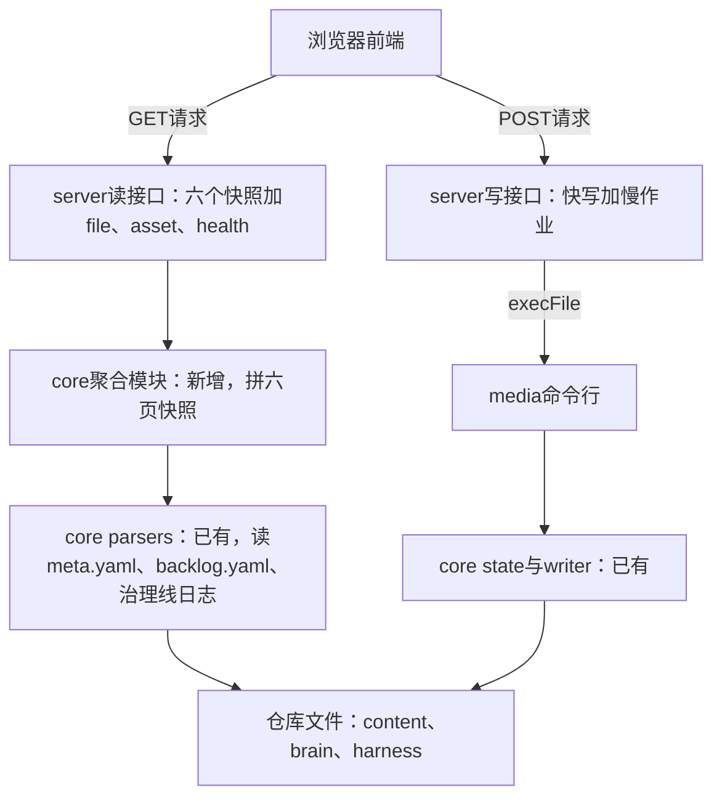
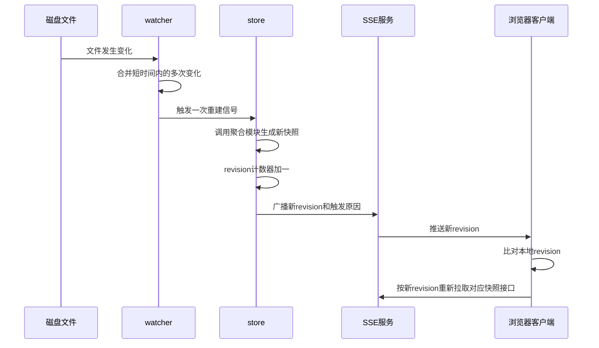
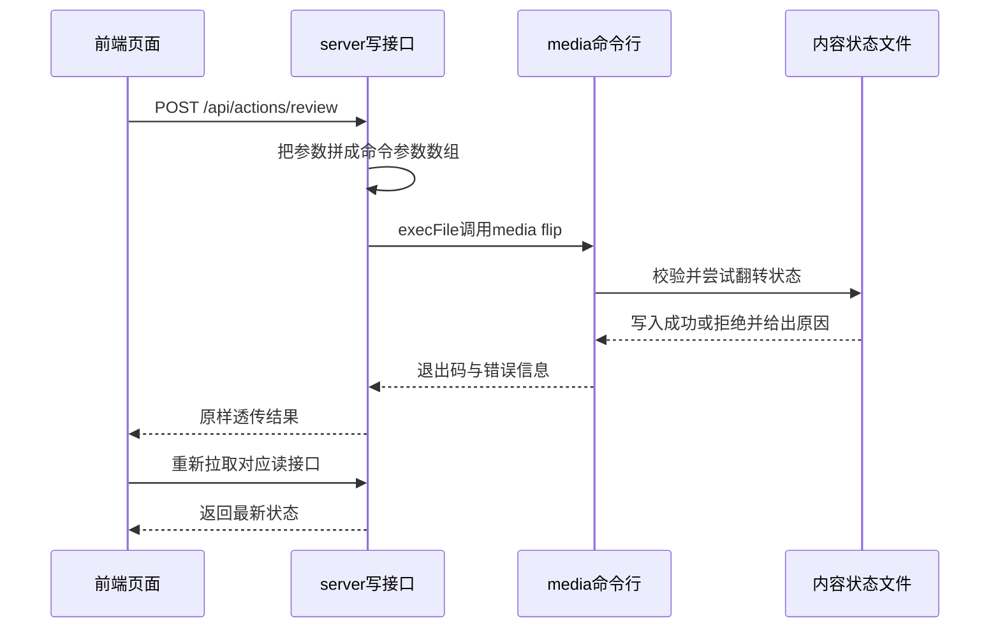

# 后端：读写两条路径

第 26 课把控制台的契约定完了：`docs/spec/console/` 目录下的调研、ADR、执行方案三份文档，五包一仓怎么分、六个页面各自要哪些接口，都已经写清楚。那一课收尾时留的话是这样的：契约定完，五包一仓边界和 API 清单有了，先把读路径打通，页面才有东西可显示。这一课接的就是这句话：先做读，再做写。

记忆锚点是一句话：读 API 复用 core 包（第 14 课交付的那个共享库）里已有的 parsers（专管读文件的那几个模块），外面只加一层收 HTTP 请求、回 JSON 的薄壳；写 API 把 HTTP 请求转成一条 `media` 命令，不另写一套改状态的代码。两条路径各自只做一件事；多出第二份真相源、多出第二个写入口，是这一课要防的同一类错。

本课的输入是第 26 课 `docs/spec/console/02-执行方案.md` 里的 API 清单，加上你自己仓库里已经攒出来的东西。具体是这几样：`content/`、`brain/`、`harness/` 这些真实文件，第 14 课交的 core 包三件（`parsers`、`state`、`writer`），第 15 课立起来的 `media` 全量命令，第 19 课那个能推卡、收按钮的飞书服务，第 25 课造的 `cc-stream` 包和裁决函数。有一处要提前说清楚：参考流水线的 core 包里有一个单独聚合快照的模块，你的 core 包现在没有这一层，这一课要用 Prompt 让 AI 把它加出来。产出是读 API 全通（六个快照接口加 `file`、`asset`、`health`、SSE，SSE 就是服务器主动往浏览器推消息的那条长连接）和写 API 全通（快写四条加慢作业三条），飞书回调也改走这条写路径。

读写两条路径各自经过哪几层、最终收口在哪，摆成图看得比文字更直接。



## 一、六个快照接口：按页面划分

这一节说的快照接口，指的是把仓库当前状态整个读出来、只回不写的那一类只读接口。六个页面各自只要自己的那份数据，所以接口按页面划分，不按数据表划分。总览页要在制条数和告警，看板页要一张按状态分组的列表，选题池页要按分数排序的候选，这几份数据形状差得很远。如果做成一个接口把全部数据一次返回，前端拿到手还得自己再拆一遍，多做一遍原本该在后端做的事，接口数量省了，代码量没省，还多了一层容易出错的搬运。

| 接口 | 对应页面 | 数据来源 |
|---|---|---|
| `GET /api/overview` | 总览页 | 全仓在制条数、告警列表 |
| `GET /api/contents` | 看板页 | 按状态分组的内容列表 |
| `GET /api/content/:slug` | 详情页 | 单条内容的完整信息，含当前允许的迁移 |
| `GET /api/backlog` | 选题池页 | 选题池候选，支持筛选排序 |
| `GET /api/harness` | 治理线页 | 治理任务运行记录 |
| `GET /api/metrics` | 数据复盘页 | 复盘数据 |

六个接口共用同一份数据源，不是各自单独去读文件。`meta.yaml`、`backlog.yaml`、治理线日志，你的 core 包在第 14 课已经有对应的 parsers 分别读它们。这一课要补的是中间那一层：一个模块把这几个 parsers 读出来的结果拼成一份完整的仓库快照，六个接口都从这份快照里取数据，不各自重新读一遍文件。参考流水线里这一层单独做成了一个模块，负责一次性走完全部读盘动作，往上层只交出一份内存里的对象；这一课让 AI 照这个思路给你的 core 包补上同样的一层，具体叫什么名字不重要，重要的是它只在这里出现一次，不在六个接口里各写一份。

详情接口还多一件事：按 core 包 state 模块的迁移表算出这条内容当前允许翻到哪些状态，跟响应体一起返回，每条迁移标明要不要填理由。下一课立前端骨架时，详情页的决策区按这份返回值渲染按钮，不在前端把状态机再抄一遍；状态机改了，接口返回值跟着变，前端不用改一行代码。

```
读我 docs/spec/console/02-执行方案.md 里六个快照接口的定义（对应总览、看板、
详情、选题池、治理线、数据复盘六个页面），用我 core 包里已有的 parsers
（读 meta.yaml、backlog.yaml、治理线日志的那三个模块）实现这六个只读接口：
1. 六个接口各自只回自己页面要的那份数据，不要合并成一个大对象再让前端拆；
2. 新增一个聚合模块，把 parsers 读出来的几份数据拼成一份完整的仓库快照，
   六个接口都从这份快照里取数据，不要各自重新读一遍文件；
3. 单个文件解析失败时降级返回一个错误标记，不能让整个接口跟着报 500
   （这条规则第 14 课定过一次，接口层要原样遵守）；
4. 响应体统一带一个 revision 字段，取值来自这份快照当前是第几次构建的；
5. 详情接口 /api/content/:slug 额外带一个字段，列出这条内容按 core 包
   state 模块的迁移表，当前允许翻到哪些状态，每条标清楚要不要理由，
   前端只按这份返回值渲染按钮，不在前端把状态机逻辑再抄一遍。
实现完之后，对六个接口各跑一次真实请求，把返回的 JSON 结构贴给我看一眼。
```

拿到结果先看两处：六个接口的响应体有没有把不属于自己那份数据也带出来，如果 `/api/overview` 里混进了整份选题池列表，常见原因是聚合模块没拆干净，六个接口该各取各的那一小块，不该把整份快照原样转发；六个响应体里的 revision 数值是不是完全一致，不一致说明有的接口没接到这份聚合模块，还在自己另开一条读盘的路。再核一遍详情接口那个新字段：换几条处于不同状态的内容各查一次，返回的允许迁移列表要跟你自己 core 包 state 模块里那张迁移表对得上，不能多出一条或者漏一条。

六个页面各有了自己的数据源，`file`、`asset`、`health` 这几个不属于任何单一页面的能力还没接上。

## 二、file、asset、health：三个基础设施接口

读某个受控文件的原文、看一眼封面图或者成片、查一下服务本身健不健康，这三件事每个页面都会用到，不属于哪一个页面专属，单独做成横切接口比塞进六个快照接口里更合适。

`file` 接口最容易出的问题是越权：如果路径参数不经处理直接拼进文件系统调用，请求里带一段 `../../../etc/passwd` 就能读到仓库外面的任意文件。挡这件事不能靠猜路径里有没有可疑字符，得靠一张白名单：只允许读 `content`、`harness`、`pipeline`、`brain` 这几个目录下的文件，加一个固定文件名 `dashboard.md`，扩展名也卡在文本类型上，路径解析完之后如果跳出了仓库根目录或者不落在白名单目录里，一律拒绝。`asset` 接口管的是图片和视频这类二进制文件，只开放 `content` 目录下带图片视频扩展名的文件，同样过一遍白名单。

`health` 接口报的是服务本身的运行状态：快照最近一次构建是什么时候、文件监听有没有正常运行、有没有正在跑的写作业（作业具体是什么，第五节细讲）。它的响应体要带上当前的 revision 号，前端断线重连之后靠这个号判断本地数据是不是已经落后，不用等下一次 SSE 推送才发现自己该重拉了。

```
实现 GET /api/file 和 GET /api/asset 两个接口：
1. /api/file 只能读白名单目录内的文本文件（content、harness、pipeline、
   brain 这几个目录，加 dashboard.md），路径参数里出现 .. 或者解析后跳出
   仓库根目录，一律拒绝，不许当成路径不存在悄悄放过；
2. /api/asset 只能读 content 目录下的图片和视频，按扩展名再收一道白名单；
3. GET /api/health 除了报自身状态，响应体还要带上这次对应的 revision 号。
实现完，我会拿几个越权路径试探，你的实现要能把它们全部拒绝。
```

验收要拿两类路径去试：一类是正常在白名单内的文件，应该正常返回；一类是故意越权的路径，比如指向仓库外层目录、或者伪装成白名单目录名但实际跳出去的路径，应该全部收到拒绝而不是 200。再看一眼 `health` 的返回体里，revision 有没有真的带出来。

接口能应答一次请求了，但文件在磁盘上真的变了之后，前端怎么知道该重拉，是下一步要解决的事。

## 三、SSE 推变更：store、watcher、revision 三件怎么配合

前端不做轮询，而是挂一条常驻的 SSE 连接，收到有变化的信号之后自己去重拉对应的接口。这条连接推的不是数据本身，只推一个 revision 号：文件变了，服务器把内部那份 revision 计数器加一，把新的数字广播给全部连着的客户端，客户端拿这个数字跟自己本地存的比一比，不一样就照第一节的六个接口重新拉一次。

数据本身不走 SSE，理由在数据形状上：六个页面要的数据形状都不一样，如果每次变化都把全部页面各自需要的东西都推一遍，一次小改动就要拼六份响应体，SSE 这条连接反而成了第二套数据接口，跟第一节那六个接口重复了一遍逻辑。只推一个数字，判断权留在客户端手上，谁需要什么数据，谁自己去拉，服务器这边只用维护一份真相。

这条推送要走完，中间是三件东西各管一段。文件在磁盘上发生变化，watcher 感知到这次变化，等一小段时间把短时间内的多次变化合并成一次。store 收到信号后重新调用第一节那个聚合模块，生成一份新的快照，同时把 revision 计数器加一。SSE 服务把新的 revision 号连同一句触发原因，广播给全部连着的客户端。三件各管一段，谁都不替谁做事：watcher 不管数据怎么聚合，store 不管数据怎么发出去，SSE 也不关心这次变化具体是什么。

文件变化怎么经watcher、store、SSE三件东西传到前端重拉，按时间顺序摆一遍。



```
实现 SSE 推送这套配合，三件东西各管一段：
1. watcher：监听 content/、harness/logs/、harness/tasks.md、dashboard.md
   这几个位置（都是你自己第 03、21 课已经交付过的真实目录和文件，
   仓库里没有的目录不要写进去），只认 yaml、md、jsonl 这几类扩展名的
   变化，短时间内的多次变化要合并成一次处理，不要一个文件改一下就
   触发一次；
2. store：收到 watcher 的信号后，重新调用第一节的聚合模块生成新快照，
   同时把 revision 计数器加一；
3. SSE：store 每次生成新快照后，把当前 revision 号和一句触发原因广播给
   全部连着的客户端，事件体只带 revision 号，不带任何页面数据。
新连上的客户端要立刻收到一次当前 revision，不用等下一次文件变化才有数据。
```

如果同一次改动收到了两次甚至更多次 SSE 推送，常见原因是合并窗口设得太短，一次保存动作触发的多个文件系统事件被当成了好几次独立变化，各自都跑了一遍重建。如果某个目录下的文件确实改了，前端却完全没收到推送，通常是 watcher 的监听列表漏掉了这个目录，比如新建了一条内容之后它落在一个没被监听到的子路径下，watcher 从一开始就没往那里看过。

读路径全通了，下一步做写路径。

## 四、快写四条：把一次点击转成一条 media 命令

审批、打回、选题裁决这几个动作背后都是一条已经存在的 `media` 命令。写路径不重新发明状态变更逻辑，只是把 HTTP 请求原样转成一条 `execFile media <子命令>`，第 12 到 16 课定下的状态机、事务写入、审计记录，全部原样复用，server 这一层只做参数翻译。

| 端点 | 背后命令 | 触发场景 |
|---|---|---|
| `POST /api/actions/review` | `media flip` | 审核卡通过或打回 |
| `POST /api/actions/backlog-apply` | `media backlog apply --action <merge\|archive> --proposal <报告路径>` | 治理提议入库落地 |
| `POST /api/actions/promote` | `media promote` | 选题池取题 |
| `POST /api/actions/next-up` | `media next-up set` | 指定下一次取题 |

`backlog-apply` 这一条不能只带一个 id，请求体要对应带上 `action`（合并还是剔除）和 `proposal`（这次落地依据的那份提议报告路径）两个字段，接口层原样拼成 `--action` 和 `--proposal` 两个参数。第 21 课资产读写表那一节写明：`media backlog apply` 命令本身就要求带一个指向报告文件路径的参数，不是可选项，没有报告路径直接拒绝执行，落笔这个动作绑在一份写好的提议报告上。接口层不能把这个参数省掉，省掉等于绕开了这条硬约束，让机器凭空发起一次落笔。

拼参数这一步要走 `execFile` 加参数数组，不能把参数拼成一整条字符串再交给 shell 去解析，命令注入这类问题从设计上就不给它留口子。`media` 拒绝这次操作时，会带着一句具体的错误说明，比如状态迁移不合法、原因参数缺失，这句话要原样转发给前端，不能自己重新编一句更笼统的话。这里有个容易走偏的地方：如果嫌 `media` 报的错误文案不够友好，转手重新写一句，等到某天 `media` 那边改了错误措辞，两边就会各说各话，前端看到的解释和 `media` 实际的判断脱节，排障的时候两头对不上。

```
实现四个快写端点，每个端点做的事只有一件：把请求体里的参数拼成一条
media 命令的参数数组，用 execFile 调用，不经过 shell：
1. POST /api/actions/review：决策是通过、打回重做还是打回挂待办，
   分别拼成 flip <slug> approved、flip <slug> drafting、
   flip <slug> rejected 三条，后两条要求 reason 参数必填；
2. POST /api/actions/backlog-apply：请求体带 id、action、proposal 三个
   字段，拼成 backlog apply <id> --action <merge|archive>
   --proposal <报告路径>，proposal 缺失直接 400，不许拼一条不带
   --proposal 的命令出去（这条和第 21 课定的「落笔必须绑一份提议
   报告」是同一件事，接口层不能把这个参数省掉）；
3. POST /api/actions/promote：拼成 promote；
4. POST /api/actions/next-up：拼成 next-up set <id> 或 next-up clear。
media 命令拒绝这次操作时，把它退出时报的错误原样透传给前端，不要自己
重新编一句话；media 命令本身跑挂了（进程起不来、超时）单独算一类错误，
跟业务拒绝分开处理，别混在一起。
```

验收拿一次真实的非法迁移去试，比如对一条已经发布的内容发起审核通过。前端收到的错误文案，要跟你在命令行里直接跑同一条 `media` 命令时看到的报错一字不差，不能换成被改写过的另一种说法。再拿一次合法操作走一遍，改完之后回到第一节的读接口刷新一下，应该能立刻看到状态变了。

前端点一下，请求怎么变成一条media命令、又怎么把状态带回页面，按顺序画一遍。



点一下就能记账的动作，四条全通了。剩下几个动作一条命令跑不完，得跑上几分钟。

## 五、慢作业 3 条：job runner 怎么管一次无头 CC

确认发布、打回重做、治理提议入库，这三件事背后是一次要跑几分钟的判断性任务，不能让浏览器挂起等结果。这类请求先返回一个任务 id，进度靠 SSE 或者轮询去拿。真正管这件事的是一个作业管理模块：收到请求登记一条作业、派活给子进程、子进程跑完之后算成败，参考流水线里这一层叫 job runner。参考流水线的作业路由一共注册了五类作业端点，这一课只按 `publish`、`rework`、`apply-proposal` 这三类来实现，你自己的 server 包这一步也只用做出这三类。另外两类，一类管治理线巡检，一类管新条目创建，都不在这一轮范围内，先不碰。

| 作业类型 | 超时 | 成败怎么判 |
|---|---|---|
| `publish` | 20 分钟 | 读这条内容 `meta.yaml` 的状态字段，落到 `published` 或 `scheduled` 才算成功 |
| `rework` | 45 分钟 | 读同一个状态字段，落回 `review` 才算成功 |
| `apply-proposal` | 10 分钟 | 检查 `brain/` 目录下有没有真的产生文件改动 |

这三档超时是参考流水线的起步值，你自己按任务实际耗时定，不用照抄这三个数字。

这三类作业不用重新写一套子进程管理，第 25 课已经造好了整套东西：`cc-stream` 包负责拉起无头 CC、把它的输出归一成一串事件，裁决函数负责在子进程收尾之后现场读状态文件，判断这次到底有没有做成。子进程自己报的成功还是失败只是第一道信号，真正定案的是裁决函数读到的文件状态，这条规则第 25 课已经用真实日志验证过一次：一次发布任务子进程声称成功，`meta.yaml` 的状态却还停在审核通过那一步，裁决函数只认状态没变这件事，不采信那句声称成功。这一课的三类作业全部照这条规则走，不额外发明一套新的判断逻辑。

打回这类作业还多一步：进真正的重做子进程之前，得先用第四节的写接口把状态从审核或者已打回翻成创作中，再拉子进程去改内容。如果跳过这一步直接派活，子进程写到一半又被要求重做，状态和实际内容就会对不上。另外，job runner 自己要记着当前哪条内容正挂着哪个作业，同一条内容重复提交要被直接拒绝，不能悄悄排进队列里再跑第二遍。

```
实现一个作业管理模块（job runner），用第 25 课已经造好的 cc-stream 包和
裁决函数管这三类慢作业，不要重新写一套子进程管理：
1. 每类作业收到请求后，job runner 先登记一条记录、立刻返回 202 和一个
   任务 id，真正的执行放进后台；
2. 拉子进程用 cc-stream 的 runHeadlessCC，进度事件用它的里程碑引擎归一，
   每条里程碑通过 SSE 按这个任务 id 广播出去；
3. 子进程跑完之后不要直接采信它自己报的成功还是失败，调用第 25 课的
   裁决函数，现场读这条内容的 meta.yaml，状态落到这次任务期望的值上
   才算成功；
4. rework 这类要求内容当前处于审核或打回状态的作业，进队列之前先做一次
   前置检查，状态不对直接拒绝，不进队列空跑一次；
5. job runner 记着当前哪条内容正挂着作业，同一条内容重复提交直接拒绝，
   不排进队列跑第二遍。
harness-run 和 create 这两类作业不在这一课范围内，先不要实现。
```

如果一个作业子进程报了成功，`meta.yaml` 里的状态却没变，常见原因是把子进程自评的成功标记当成了唯一的成功依据，没有回头读状态文件做二次确认。验收要故意造一次真实的重做，看它是不是真的先翻了状态再派活，跑完之后再确认状态有没有落到期望值上，不能只看任务列表里显示成功就算过。

写路径的两条都跑起来了，而这两类重活原来是飞书那个服务自己在跑，这一课要把它挪过来。

## 六、飞书回调改道：第 19 课的服务改成调控制台

第 19 课把飞书服务的实现锁在了一条具体的路上：状态改动只经过 `media flip`，但重做这件重活，由服务自己起线程、自己起子进程去跑，不依赖任何还没造出来的东西；确认发布当时只发了一张占位卡，按钮背后没有真正的处理代码。那一课原文写得很直接：参考流水线现在默认把重做和发布这两类重活委托给一个独立的控制台后端去代跑，代码里靠一个配置开关切换两条路径，默认值就是委托给控制台。你自己第 19 课的服务里没有这个开关，是直接把重做写死在自己起线程这条路上，因为那时候控制台还没造出来，照默认配置实现，等于给一个当时还不存在的东西发请求，永远接不上。

控制台现在造出来了，不用给自己也加一个开关，直接把这两处写死改成调用控制台就行。重做这条路径有真代码要换：原来自己 spawn 一次无头 CC、自己判断结果的那段，改成给控制台发一次 POST，再轮询任务状态，拿裁决结果去更新卡片。确认发布这条路径不用换代码，因为原来就没有真代码，直接把按钮接到控制台的发布接口上就行，同样是发一次 POST、轮询、拿裁决结果更新卡片。审核卡的通过按钮、打回原因卡的挂待办按钮不动，这两个是纯粹的状态翻转，从第 19 课服务第一次写出来那天起，就是 subprocess 直接调 `media flip`，不是这一课要迁移的对象，继续走这条近路，不用再绕控制台多走一圈。

| 飞书动作 | 原来怎么做 | 现在怎么做 |
|---|---|---|
| 打回并自动重做 | 自己 spawn 一次无头 CC，自己判断结果 | POST 控制台的 rework 接口，轮询任务状态 |
| 确认发布 | 只发占位卡，没有处理代码 | POST 控制台的 publish 接口，轮询任务状态 |
| 审核通过 | subprocess 直接调 media flip | 不变 |
| 打回并挂待办 | subprocess 直接调 media flip | 不变 |

```
把第 19 课飞书服务里打回重做那处直接 spawn 无头 CC 改状态的代码，
改成：
1. 给控制台的写路径发一次 POST（发布或重做接口），带上这次要处理的
   内容 slug；
2. 拿到 202 和任务 id 之后，每隔一段时间轮询一次任务状态；
3. 任务落到终态后，用第五节裁决函数给出的结果更新飞书卡片，裁决说
   没成功就如实告诉人没成功，不要把没做成的事说成做成了。
确认发布这条路径原来没有真正的处理代码，只发了占位卡，按同样的三步
新接一条，不用先找旧代码再改。
审核卡的通过按钮、打回原因卡的挂待办按钮不用动，这两处从第 19 课
写出来那天起就是 subprocess 直接调 media flip。
```

验收动作是在飞书上对一条已经出审的内容点打回，填一句原因，点打回并自动重做。核对两件事：控制台这边任务记录里有没有新增一条这次重做作业，能看到任务 id、状态、裁决结果；飞书服务自己的进程日志里，这次改状态的动作是不是只剩下一次 POST 请求，没有再出现它自己 spawn 无头 CC 的记录。两件都对得上，说明这次重做真的是控制台在跑，飞书服务自己没有再直接改文件。

读写两条 API 现在都接好了，下一步该做界面，让人不用翻文件也能点。

## 七、收尾：读写两条 API 交付了什么

这一课结束，读 API 全通了：六个快照接口，加 `file`、`asset`、`health`，加 SSE 推送 revision。写 API 也全通了：四条快写直接转成 `media` 命令，三类慢作业靠 `cc-stream` 拉起无头 CC，再用裁决函数收口。`server` 这一层没有一行代码直接改 `meta.yaml` 或者 `backlog.yaml`，全部落盘动作最终都经过 `media` 这一个入口，这是第 15 课那条唯一写入口在控制台这个新组件上的延续。飞书服务里原来自己 spawn 子进程做重做的那条路，还有原来只发占位卡、没接处理代码的确认发布，都改成打这条写 API 了。

还看不到的是界面。这一课交出去的九个读接口和七条写路径，现在只能靠命令行的 `curl`，或者浏览器地址栏直接输入接口地址去戳，飞书卡片是唯一能点的地方。读写两条 API 都通了。开始做界面，骨架和头两页怎么落设计稿？
