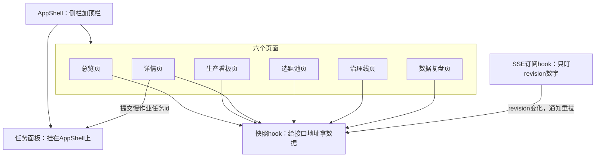
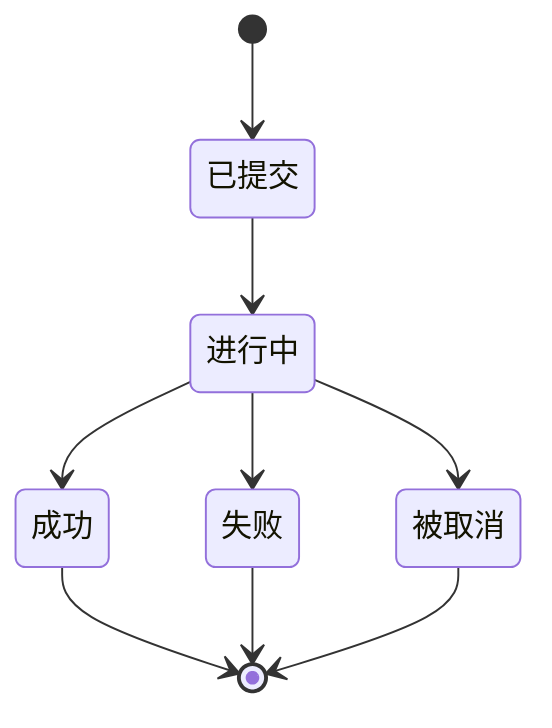

# 前端：六页整站与联调

读写两条 API 都通了。开始做界面，骨架和头两页怎么落设计稿？

第 27 课把六个页面各自的快照读接口、`file`/`asset`/`health`、SSE 推送全部打通，写路径也补齐了：快写 4 条（`POST /api/actions/review`、`backlog-apply`、`promote`、`next-up`）走一次命令就返回，慢作业 3 条（`publish`、`rework`、`apply-proposal`）返回 202 和一个任务 id，飞书审核卡点下去也改成打这条写路径，不再自己落盘。这一课接着往下走：先立一套骨架，六个页面照着骨架长出来，最后拼成一个整站，也就是一个地址打开就能进六个页面的完整站点，并且在真实界面上把两条写路径各走一遍，标题里说的联调就是这一步。

这一课的记忆锚点是一句话：六页能不能立住，看的不是页面好不好看，是数据层的两个 hook 能不能让六个页面照搬着用。hook 是 React 里一段能被多个页面共用的逻辑，这里的两个分别管取数据和收变更通知。骨架搭一次，页面照着长；六页能看只是及格线，模块 7 的出口条件看的是快写和慢作业这两条写路径能不能在整站上真的各走一遍。

本课输入是课程附录发放的六页原型（`overview.html`、`detail.html`、`backlog.html`、`harness.html`、`kanban.html`、`metrics.html`，都在 `appendix/design/` 下）、同目录 `css/theme.css`、`appendix/26-界面用语对照表.md`（界面文案唯一出处），以及第 27 课交付的读写 API。产出是六页整站，加一份验收输出。

## 一、AppShell 与两个数据 hook：六页共用的三块部件

六个页面要的数据来源不一样，但拿数据的方式是一样的：打一个接口地址，等它返回，之后这条数据变了就重新拿一次。这件事没必要在六个页面里各写一遍，先把它抽成两个 hook，页面写出来的时候只管拿到数据之后怎么摆，不用再操心怎么拿。

拆成两个而不是一个，原因是拿数据和知道数据变了是两件不同的事。快照 hook 负责第一件：给它一个接口地址，它发请求、等结果、把数据交出来。SSE 订阅 hook 负责第二件：它跟服务端维持一条长连接，只盯一个数字，也就是 revision。这个数字变了，就说明后端有什么地方改了，该通知页面重新拿数据了。SSE 本身不背着业务数据走，它只报一声“变了”，具体变成什么样，还是靠快照 hook 重新问一遍接口。

参考流水线里，这两件事分别落在一个叫 `usePageData` 的 hook 和一套建 SSE 连接、对外只暴露一个 revision 数字的机制上。这是参考流水线的实现，不是学员已经写好的文件，命名和拆分方式可以不一样，判据认的是行为，不是文件名和目录结构。

慢作业（第 4、6 节要用到的 `apply-proposal` 这类）不返回最终结果，只返回一个任务 id，进度得有地方看。这件事也适合放进骨架，不必等到真用上了才想起来：做一个常驻的任务面板，不属于任何一个页面，挂在 AppShell 上（AppShell 就是整站的外壳，侧栏加顶栏，六个页面都嵌在它里面），谁触发了慢作业都能在这里看到它推进到哪一步；跑挂了和被人手动取消，要显示成两种不同的结局，不能都含糊地归成一句“结束了”。

| 部件 | 负责什么 |
|---|---|
| AppShell | 侧栏导航（六个页面的入口，其中详情页从看板或总览点进去，不设单独导航项）、顶栏（健康灯位、当前 SSE 连接状态、刷新按钮） |
| 快照 hook | 给一个接口地址，发请求拿数据，返回数据、错误、这份数据是不是已经过期正在后台重拉三样；重新拉取时不清空旧数据，避免页面一闪一闪 |
| SSE 订阅 hook | 建一条到 SSE 端点的连接，只关心 revision 变没变，变了就通知所有页面各自重新拉一次 |
| 任务面板 | 常驻显示正在跑的慢作业，跟着任务实际的进度推进，停在成功、失败、被取消三种终态之一 |

六个页面、两个hook、任务面板怎么接在AppShell下面，摆成图看得比文字列表更直接。



```
帮我实现三块东西：
1. AppShell：左侧导航栏放五个页面的入口（总览、生产看板、选题池、
   治理线、数据复盘），详情页不放进导航，由看板或总览点某一条内容
   跳过去；顶栏放几个健康灯位（先占位，不接真实数据）、当前 SSE
   连接状态（连接中/已连接/已断开）、一个刷新按钮。
2. 两个数据 hook：
   - 快照 hook：接收一个接口地址（比如 /api/overview），发请求拿
     数据，返回 { data, error, stale }，stale 表示这份数据可能已经
     不是最新的、正在后台重新拉取；六个页面各自调用一次，互不
     影响，重新拉取时旧数据先留着，不要让页面突然变空白。
   - SSE 订阅 hook：建立一条到 SSE 端点的连接，只关心收到的
     revision 号有没有变化，变化了就触发一次页面重新拉取；连接断
     开要能自动重连。
3. 一个常驻任务面板，挂在 AppShell 上，不属于任何一个页面：接收一个
   任务 id 就能显示这个任务当前的进度，跑完停在成功、失败、被取消
   三种终态之一，后两种要能看出区别。
三块先各自能独立跑通，再接进 AppShell。
```

跑完这一步，拿一个还没实现的接口地址（比如接口名故意打错字）试一下快照 hook，看它能不能把错误正常返回出来，而不会卡在那里不动；再看 SSE 断开重连之后，revision 会不会自己对齐到当前值，不会漏掉断线期间发生的变化。

如果 SSE 订阅 hook 迟迟收不到第一条消息，常见原因是接口地址和实际起的 server 端口对不上，本地开发时前端和 server 经常不在同一个端口，这个问题等第 6 节把整站合成一个端口之后就不会再出现。

骨架立起来了，可以往里面摆颜色和第一批页面了。

## 二、theme token 映射：把设计稿的颜色接进组件库

`css/theme.css` 里已经把整套配色、字号、圆角定成了 CSS 变量，这份文件 606 行，是设计稿唯一的真相源。前端不用自己再挑一遍颜色，把这些变量的值原样接进你用的组件库配置就够了，接错了照着 diff 一遍数值就能查出来，比凭感觉调色安全得多。组件库就是现成的按钮、表格、弹窗这些控件的集合，它一般都留好了一套主题变量，也就是这一节说的 token，把 theme.css 里的值填进去就行。

至少要覆盖这几组：强调色 `--accent`（`#2f6feb`）、成功色 `--success`（`#17a34a`）、警告色 `--warn`（`#eab308`）、危险色 `--danger`（`#dc2626`）、圆角 `--radius-sm`（8px）和 `--radius-md`（12px）、字号 `--text-xs`（12px）到 `--text-base`（16px）。参考流水线用的组件库是 antd，映射目标是它的主题 token 配置；换一个组件库，映射到的具体字段名会不一样，但抄数值、不挑新颜色这件事不变。

| theme.css token | 组件库配置项（举例） |
|---|---|
| `--accent` | 主色 |
| `--success` / `--warn` / `--danger` | 成功色 / 警告色 / 危险色 |
| `--radius-sm` / `--radius-md` | 基础圆角 / 大圆角 |
| `--text-xs` / `--text-sm` / `--text-base` | 辅助字号 / 正文字号 / 大字号 |

```
读 css/theme.css 里的 CSS 变量，生成一份映射代码，把这些 token 接进
我们用的组件库主题配置：强调色 --accent；成功色 --success、警告色
--warn、危险色 --danger；圆角 --radius-sm、--radius-md；字号
--text-xs、--text-sm、--text-base。不挑新的颜色或数值，全部照抄
theme.css 里写的值；每一行配置旁边注释对应哪个 token，方便以后
theme.css 改了知道要跟着改哪一行。
```

映射代码写完，拿 `--accent` 这类关键变量的十六进制值和你写进配置的值直接比对一遍，一个字符都不该差；再看有没有漏掉某一档圆角或字号，漏了页面上会出现两种粗细不一致的圆角，肉眼就能看出来。

视觉基调定了，可以落第一批页面了。

## 三、P1 总览、P3 详情：最先落地的两页

### 3.1 P1 总览：晨检、警报、分级待办

总览页只做一件事：十秒内告诉人今天正常吗、有几条在制、有什么要我处理，不做操作入口。总览页上任何一条要处理的事，都是点进去之后到详情页再做决定，总览页自己不接写操作，页面才能一直保持轻，不用担心点错一个按钮影响到别的内容。

在制这个数字要有一条明确的口径：`ideated`、`drafting`、`review`、`approved`、`scheduled` 五个状态的数量加起来，`published` 和 `rejected` 已经离开在制阶段，不计入。这条口径不是写在总览页自己头上就完了，第 5 节的看板页也要用同一份，两边算出来的数字对不上，说明有一边漏了状态或者多算了。

```
照附录 overview.html 的布局，用第 1 节的快照 hook 接 GET /api/overview，
落成总览页：
- 顶部一句话结论：今天正常吗
- 一组分级警报，区分错误级和提醒级，不要混在一起平铺成一样的颜色
- 在制统计：把 ideated / drafting / review / approved / scheduled
  五个状态的数量加起来，published 和 rejected 不计入在制
- 分级待办：按紧急程度排序，比如超过 48 小时没处理的排最前
本页不接任何写操作，所有条目只能点进详情页处理。
```

验收看三点：警报是不是真的分了级，一眼能看出哪些是错误级、哪些只是提醒；用第 27 课的写 API 触发一次状态变更（比如在命令行直接跑一次 `media flip` 也行），SSE 收到变化后总览页会不会自动刷新，不用手动点刷新按钮；页面上没有任何警报时，空态里有没有写清楚下一步该干什么，而不是只给一句干巴巴的“暂无数据”。

### 3.2 P3 详情：读为主、决策为辅

详情页是六页里唯一一个既要展示又要触发写操作的页面。决策区要展示哪几个按钮，不是前端自己判断的，接口会把这条内容当前允许迁移到哪些状态一起返回，前端只按这份返回值渲染，不把状态机逻辑在前端再抄一遍。这条判据的好处是状态机改了（比如哪天允许的迁移路径变了），前端不用跟着改一行代码，接口返回值变了，按钮自然跟着变。

发布这类不可逆动作，点一下就真的发出去风险太大。稳妥的做法是点击之后先弹一个摘要弹窗，把标题、发布时间、封面和成片是不是已经就绪摆出来，末尾写清楚这个动作发布后不可撤销，用户在弹窗里再确认一次，才真的调写接口。这跟第 20 课发布 skill 那条 dry-run 硬约束是同一条判据，只是这次落在界面上，先看一遍计划再决定要不要真跑，不能点一下就没有回头路。

```
照附录 detail.html 的布局，用快照 hook 接 GET /api/content/:slug，
落成详情页：
- 内容信息区（标题、状态、时间线）只读
- 决策区：不在前端写一遍状态机，接口返回值里带着这条内容当前允许
  迁移到哪些状态，只渲染这些状态对应的按钮；比如状态是 review，
  返回值里没有 approved，就不显示“审核通过”这个按钮
- 点击发布这类不可逆动作，先弹一个摘要弹窗（标题、发布时间、封面
  和成片是否就绪），弹窗里写清楚发布后不可撤销，用户确认了才真的
  调写接口
按钮点击后调第 27 课的写 API，靠 SSE 收到的 revision 变化触发页面
重新拉取，不要在前端手动改一份本地状态假装操作已经成功。
```

验收看三点：状态已经不允许某个动作时，对应按钮是不是根本就不显示，而不是显示出来点了没反应；点击之后 SSE 有没有把最新状态推回页面；不可逆动作是不是先弹了摘要、等人在弹窗里确认之后才真的提交，不能点一下就直接发出去。

如果决策区一个按钮都不出现，通常是接口返回的允许迁移状态这个字段没接对，前端把它当成了一份写死的固定列表，而不是每次跟着接口返回值重新算一遍该显示哪几个。

两页可用了，数据层的路子跑通，剩下四页照着补。

## 四、P4 选题池、P5 治理线：照骨架补两页与界面用语

这两页涉及的字段最多来自内部技术命名，比如触发方式写成 `periodic:2d`，某条提议是不是已经采纳写成 `applied=false`。这些字段名是给写代码的人看的，不是给用户看的，界面文案要按 `26-界面用语对照表.md` 换成工作流语言，不能把契约文档的措辞原样搬上屏幕。这份对照表在第 26 课就已经发放，逐条规定了每个技术字段在界面上该说成哪句中文，是全站界面文案唯一的出处，两页要用到的触发方式、状态词、页面副标题，表里都已经列好了对应关系。

两个写端点性质不一样：`backlog-apply` 是快写，点一下立刻拿到结果；`apply-proposal` 是慢作业，点一下拿到的是一个任务 id，接下来的进度交给第 1 节做的那个任务面板去接，这两页本身不用另外画一份进度条。

```
照附录 backlog.html、harness.html 的布局，用快照 hook 分别接
GET /api/backlog、GET /api/harness，落成两页；写操作分别接第 27 课
的 backlog-apply、apply-proposal 端点。文案照《界面用语对照表》换：
- 触发方式（比如 periodic:2d）换成“每 2 天”这类工作流语言
- applied=false 换成“待应用”，enabled/disabled 换成“已启用/已停用”
- 页面副标题按对照表逐页改写，不要把接口地址或文件路径原样搬到
  副标题上
技术标识（命令、文件路径、slug）只允许出现在可复制命令条、证据文件
路径或悬停提示里，正文和按钮上不出现。
```

拿一张文案核对清单过一遍：触发方式是不是全部换成了中文说法，不再出现 `periodic:2d` 这类原始字符串；同一个状态在不同页面上是不是用了同一个中文词，没有一处叫“已选题”另一处叫“已立项”；页面副标题是不是换成了一句人话，不是接口地址或实现细节的直译。

文案换完了页面读起来还是像系统日志，多数情况下是漏了对照表开头三条总原则的第三条：实现细节不是文案。类似“解析失败降级为空表不崩页”这种句子，是写给写代码的人看的自我说明。用户不关心系统怎么保证自己不崩，这类句子直接删掉就行，不用再费力气把它翻译成好懂的话。

选题池和治理线能看能点了，还剩两页。

## 五、P2 看板、P6 数据复盘：只读页面的最后两块

看板把所有内容按当前状态横向铺开，数据复盘看的是发布之后的实际效果，两页都只读，不接写操作。看板要把每条内容按当前状态分组摆开，这份分组的合计数字要和总览页的在制口径对得上：都是 `ideated` 到 `scheduled` 五个状态相加，`published` 不计入。两边算出来的数字不一致，说明有一头统计口径漏改了。

数据复盘页还没有复盘数据时，最容易犯的错是画一个假装有数据的空图表，一条全是零的曲线，看着比干脆没有曲线还让人心里没底。按对照表的空态写法：标题写“还没有复盘数据”，正文写清楚这份数据由复盘任务定期抓取，还没抓到就是空的，配一条可以直接复制去跑的命令，让用户知道下一步该干什么。

```
照附录 kanban.html、metrics.html 的布局，用快照 hook 分别接
GET /api/contents、GET /api/metrics，落成两页，两页都不接任何写
操作。metrics 页没有复盘数据时，按对照表的空态写法：标题写“还没有
复盘数据”，正文写“已发布内容的播放数据由复盘任务抓取后才会出现在
这里”，配一条可复制的命令 media metrics record，不要假装有数据画
一条全是零的曲线。
```

验收看两点：metrics 页在没有复盘数据时是不是显示了“还没有复盘数据”，而不是假装有数据；看板按状态分组的合计数字，是不是和总览页的在制统计口径一致。

六页全部落地，剩最后一步：拼成一个能直接打开、并且验证过读写两条路径的站点。

## 六、单端口出整站，并验证读写两条路径都通

### 6.1 单端口出整站：前端构建产物由 server 托管

开发和生产用的是同一套部署形态：前端跑一遍构建命令，产出一份静态文件，server 启动时把这份产物当成静态目录挂上，同时保留原有的接口路由。一个端口就能把整站起来，不需要额外的反向代理，也不用记两个端口分别是干什么的。前端路由自己接管页面之间的跳转，server 遇到既没命中接口路由、也找不到对应静态文件的请求，就一律兜底交给前端的入口页面。

```
把前端构建产物交给 server 托管：前端跑一遍构建命令，产出一个静态
目录；server 启动时把这个目录当成静态文件根目录挂上，同时保留
/api/* 这些接口路由；没有匹配到任何接口路由、也不是一个真实文件
的请求，一律回落到前端的入口页面，交给前端路由接管后续跳转。构建
产物还没生成的时候，server 启动要给出一句明确的提示，不要直接报
404 让人自己猜。
```

### 6.2 验证：六页可看，两条写路径都通

模块 7 的出口条件不是页面做完了，是六页能看、快写和慢作业两条写路径都能从界面上真的走一遍。验收清单四点：

第一，六个页面逐一打开，没有报错。第二，在 P3 详情页点一次审批，这是快写路径，看状态是不是经 SSE 回流到页面上，不用手动刷新就能看到最新结果。第三，在 P4 或 P5 触发一次慢作业，比如 `apply-proposal`，看第 1 节做的那个任务面板会不会接住它，一步步推进到成功、失败或者被取消这三种终态之一，跑挂了和人手动取消不能都含糊地显示成同一句“结束了”。这一点跟第 25 课讲的道理是一回事：进度看的是任务实际往前走到哪一步，不是听它嘴上怎么说。第四，把 server 关掉再重启，六页是不是还能正常拿到数据，不依赖内存里残留的那份状态。这条也是第 25 课那条原则的延伸，内存不可信，真相在文件里：重启之后前端应该照样能从接口拿到跟重启前一致的数据，不用等哪个内存里的状态重新攒起来。

慢作业跑完落在哪个终态，三条路分开画，比一句结束了看得更清楚。



出错一般是构建产物的路径和 server 托管的静态目录对不上，或者接口请求还走着相对路径，打到了前端自己的开发端口，没打到整合后的那一个。

整站在一个端口上起来了，读写两条路径也都当场验过，剩下的是把这一轮做了什么落成记录。

## 七、收尾：整站建完，退一步看它是什么

这一课把六页整站做到可用，单端口起站，读写两条路径都在真实界面上验证过。把这一轮的施工记录落成表，照第 16 课的写法，一行一个里程碑：出口条件、实际结果、卡在哪、怎么绕过去。

```
帮我写这一课的施工记录，用五个字段一行一个里程碑：
里程碑 / 出口条件 / 实际结果 / 卡在哪 / 怎么绕过去。
实际结果只能填我们在这一课里真跑出来的东西：六页逐一打开的结果；
一次快写审批之后 SSE 回流的实际观察；一次慢作业从提交到终态的
实际过程；重启 server 后六页拿数据的实际结果。
卡在哪和怎么绕过去如实填：卡住了写清楚卡在哪一步、报的什么错；
真解决了写解法，没解决写清楚留给谁接手。
```

| 里程碑 | 出口条件 | 实际结果 | 卡在哪 | 怎么绕过去 |
|---|---|---|---|---|
| 六页可看 | 六个页面逐一打开都能看到数据，没有报错 | ［填每页打开的实际结果，报错就贴报错原文］ | ［没卡住写无；卡住了写清楚具体报错原文］ | ［真解决了写解法；没解决写清楚留给谁接手］ |
| 快写路径 | 在 P3 点一次审批，状态经 SSE 回流到页面 | ［填实际观察到的状态变化和延迟］ | ［同上］ | ［同上］ |
| 慢作业路径 | 触发一次 apply-proposal，任务面板推进到终态 | ［填任务面板实际显示的里程碑和最终状态］ | ［同上］ | ［同上］ |
| 重启不失明 | 关掉 server 重启，六页仍能正常拿到数据 | ［填重启后的实际观察］ | ［同上］ | ［同上］ |

这套东西现在能看、能点、读写两条路径都真的走过一遍，但它到底算什么还没定过。它跟一个只会按固定步骤跑的脚本不一样，因为它会读实时状态、按状态动态渲染决策；它跟一个能自己拍板的系统也不一样，因为所有写操作背后都是一条人点下去的 `media` 命令，机器没有替人做过一次决定。这中间那条线画在哪，现在还说不清楚，形态不同，第 29 课要用到的验收方法也不一样。

六页整站跑起来了，这套东西建完了。它到底是个什么形态，哪些出口不能关？
