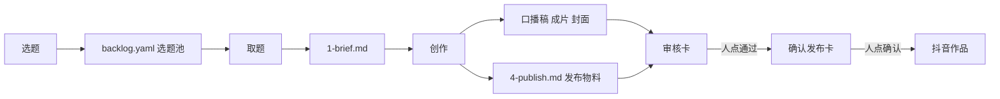

第 01 课已交稿。六步流水线全走完，中间产物落在 `docs/Iterative-spec/0901-AI自媒体课程体系/writing/v3-01-01/`（analyzed / outline / draft / diagnosis / final / polish-report 六份），成稿落盘 `docs/Iterative-spec/0901-AI自媒体课程体系/courses-v3/01-一条内容的端到端走查.md`。

三关都跑完了：

1. 硬禁令 `check_style.py` 清零，警告 0 处。
2. 验收脚本 `RESULT: PASS`。汉字 3453 / 参考值 4000；代码行 24 / 上限 30；围栏块 2；排障句 2。装腔词、过度自信词、标题模板前缀三项全通过；状态值只用到 `review`，在 `state.ts` 内；命令核对 `media next`、`media promote` 均 ok，**无 WARN 需要人工确认**。
3. 材料可溯：文中每个路径实测存在，每个关键串都能在 `pipeline/` 下 grep 到。

issue 点名的三处改动都做了：全篇口径改成「你将要建的这套」（开篇不再是打开别人仓库的一条已发内容，案例改成「跑通之后这份记录长成什么样」）；`slug` 与 `dry-run` 都在第一次出现的位置就地解释；A 到 G 补了一张索引表，七项分别标了谁来判、在第几课造出来。

读者诊断另外揪出两个硬错，一并改掉了：一是「从下一段的输入文件重新接上」说反了（应是这一段自己的输入）；二是原稿第 4 节的 Prompt 只产表和清单不产流程图，交付物承诺落空，现在 Prompt 改成三部分，明写画 mermaid。案例也从 ep03 换成了 ep14 —— ep03 的 `meta.yaml` 注释写的是终检闸 A–F 六项，拿它讲七项读者去查会对不上。

承接核对：成稿结尾与 `handoff-ledger.md` 第 01 课那一行逐字一致，没有漂移，台账已标「未改」。

---

# 成稿全文

# 一条内容的端到端走查：四段交接与人出现的位置

这条流水线跑完一轮，会在磁盘上留下一个目录：五份编号文件加一份 `meta.yaml`。选题简报、口播稿、审核记录、发布物料、复盘各一份，`meta.yaml` 记着这条内容现在是什么状态、每一步哪天做完。跑久了那份 `meta.yaml` 的注释里还会攒下返工痕迹，比如某一条的开头钩子重做过一次、封面重画过一次。

你要建的就是产出这个目录的那套东西。这一课不装工具、不写代码，先把这条线从头到尾走一遍。

## 1. 一条内容要经过的四段交接

流水线切成四段，每段一份契约文件，写死这一段吃什么、吐什么。上下游照着契约办事，谁也不去猜对方内部是怎么做的。

| 阶段 | 契约文件 | 输入 | 输出 |
|---|---|---|---|
| 选题 | `pipeline/1-ideate.md` | `brain/` 里的账号定位、信息源、对标打法三份，加 `content/_backlog/backlog.yaml` | 候选全部入池，一份调研报告 `content/_research/research-<日期>.md` |
| 取题 | `pipeline/daily-run.md` | 选题池 | 目录 `content/<日期>/<slug>/`，里面一份 `1-brief.md` |
| 创作 | `pipeline/2-create.md` | `1-brief.md`，加 `brain/` 里的人设与风格两份 | 口播稿 `2-script.md`、成片 mp4、封面 `cover.png`、发布物料 `4-publish.md` |
| 出审 | `pipeline/3-review.md` | 创作阶段的全部产物 | 一张推到飞书的审核卡，人的结论写回 `3-review.md` |
| 发布 | `pipeline/4-publish.md` | `4-publish.md` 里的标题、简介、话题标签、封面、媒体文件 | 抖音上的一条作品，链接回填进 `meta.yaml` |

创作那一格看着只有一进一出，里面装着五步：写口播稿、把稿子做成画面、给每段配音、质检这一批配音、录成 mp4 再出一张封面。这五步各自怎么做是第 05 课的事。走查阶段只要知道它们全在同一段契约里面，对外只暴露一个入口和几件产物。

取题那一行不算一个阶段，它是选题和创作之间的一次记账动作，由 `media` 承担。`media` 是你后面要自己造的一个命令行工具，管取题和状态记账，怎么造在第 12 到 16 课。`media next` 从池子里挑一条，只报一个 id；`media promote` 拿这个 id 建出目录，同时把 `1-brief.md` 写好。创作阶段读的就是这份 `1-brief.md`，它不需要知道这条题当初是怎么挑出来的。

slug 是这条内容的代号：小写字母加短横线连成的一个短串，比如 `ep03-token-economics`。它同时是目录名、`meta.yaml` 里的 slug 字段、以及后面每条命令引用这条内容时写的那个词。起名没有固定规则，交给 AI 起、你确认一下；起完别再改，后面所有命令和记账都认它。



左边是选题，右边是抖音上的一条作品。跨段的每一根箭头交接的都是文件，只有右边那两根要人点一下才通。

用文件交接的好处，是任何一段断了都能从它自己的输入文件重新接上。创作跑挂了，`1-brief.md` 还在原地，重跑创作就行，不用回选题重来。

等你把取题这一步跑起来，目录 `content/<日期>/<slug>/` 如果没有出现，多半是记账那一步没跑完。这个目录由 `media promote` 建，创作阶段不建目录。

表里这些路径是一种切法，你的目录名和文件名可以另起。要照抄的是每一段只认自己的输入文件这条规矩。

这条线之外还有另一条，负责养选题池、做发布后复盘、定期核对对标账号。它不产内容，只产报告和修改提议，这一课先不用管它，见第 21 课。

## 2. 人出现在三种位置

四段交接说完，剩下的问题是谁在推着它往前走。没有人推。工作日的定时任务读 `pipeline/daily-run.md` 自己跑，人只在三种位置出现。

第一种是事前给条件。取题默认按打分取池子里最高的那条。你想让某条插队，就在 `content/_backlog/backlog.yaml` 顶部写一行 `next_up` 指针，取题时先认它。这个位置人不出现流水线也照跑，条件是提前给好的，跑到这里读一下接着走。

第二种是闸门上拍板。闸门的意思是流水线跑到这里停住，等人点一下才继续，一共两处。

第一处是出审。创作完成后推一张审核卡到飞书，人点通过或者打回。`pipeline/daily-run.md` 的第 5 步把这条写死了：不发布，到此停，等人在飞书点。

第二处是确认发布。人点了通过之后，系统先做一次 dry-run。dry-run 就是把要执行的东西原样打印出来但不执行，这里打印的是一条完整的发布命令，加上这次要发的标题、话题标签、封面路径和视频文件。这份打印结果推成第二张卡，人点确认才真发。发布契约给的理由是，过审说的是内容合格，发出去是另一件事，两件事分开授权。

第三种是异常时被叫醒。取题时池子空了、配音服务余额不足返回错误码 1008、录制失败重试超了次数、审批通道故障，这几种一律推飞书通知人。配音质检那里还有一条硬上限，最多 3 轮，第 3 轮还不过就停下来交给人，不硬往下录。

上报这条在编排文件里被写成铁律，还带着出处：只写本地日志不算上报。2026-06-30 到 07-05 那六天流水线连续空跑，日志里每天都记了一行，六天没人看见。日志是给事后查的，当天没有产出这件事，得当天有人知道。

| 位置 | 什么触发 | 你做什么决定 | 不管会怎样 |
|---|---|---|---|
| 选题池 | 不触发，条件提前给好 | 钦点哪条先做，或者不钦点 | 按打分取最高，流水线照跑 |
| 出审 | 创作产物全部就绪 | 通过、小改打回、拒绝 | 稿子停在这里，不进发布 |
| 确认发布 | 出审通过 | 认这条发布命令和这份物料 | 命令已经拼好，但不会执行 |
| 异常呼叫 | 池子空、余额不足、录制超次、质检满 3 轮、通道故障 | 补池子、充值、决定重跑还是放弃 | 当天没产出，而且没人知道 |

前三行是设计出来的位置，最后一行是流水线撞了墙自己喊人。

定时任务跑完没有产出、日志里也没有报错，多半是取题那一步池子空了。按契约这种情况要推飞书，只写日志不算数。

## 3. 交到人手里之前，机器已经查完了七项

出审那一处，人拿到手的是什么东西，决定了拍板要花多久。

出审之前有一道终检闸，创作契约里编了七项，A 到 G，七项全过才允许交审。人审是另一张清单，六项：事实、时效、定位、语气、合规、观感。

A 到 G 眼下只有七个名字，它们各自要变成能跑的东西，落点如下。

| 判据 | 查什么 | 谁来判 | 在第几课造出来 |
|---|---|---|---|
| A 声画一致 | 分段文案、页面文案、成片字幕三处逐字一致 | 脚本 | 07 定检查点，08 造脚本 |
| B 音频自然度 | 一段音频中间的连续静音不超过 0.45 秒 | 脚本 | 07 定阈值，08 造检测脚本与去停顿脚本 |
| C 钩子冷启动 | 第一句不靠前一集也成立 | 人 | 05 写口播稿时提出，17 进人审卡 |
| D 事实与合规 | 技术结论有出处，无违禁词与夸大承诺 | 人，AI 先自查出处 | 04 写进账号大脑的红线，17 进人审卡 |
| E 封面 | 竖版 9:16，不拿横屏视频帧充数 | 人 | 05 出第一张封面 |
| F 音画同步 | 按调度时刻抽帧，画面和口播对得上 | 脚本 | 08 造抽帧脚本 |
| G 发布物料 | 标题、话题、封面这些字段能被发布那一步按固定格式取到 | 脚本 | 20 出发布 skill 与物料模板 |

谁来判这一列有个准则：这一项的结论能不能被一条命令判成真假。逐字比对文本能，量静音时长能，抽帧比画面能，按格式取字段也能。技术结论对不对、封面好不好看、第一句站不站得住，写不出这样一条命令，就归人。第 06 课会拿一张表把你自己那套判据逐格过一遍。

分界还看花多少时间。十来段音频逐段听、好几帧逐帧比，来回要过几轮，这类活留在闸门前面用脚本做完。判技术结论和语气，一条内容看几分钟就有答案，留给闸门上的人。事实这一项两边都查，创作时自己核一遍出处，闸门上再核一遍。

跑通之后，交审时的自查记录会长成什么样，可以照着仓库里 `content/2026-06-28/ep14-cache-break-detection/meta.yaml` 那条看。它的注释按 A 到 G 逐项留了痕。A 项记着 15 段分段文案与页面文案文本层全等，成片抽了 5 帧，每帧标明在第几秒、看的是哪一句。B 项记着去停顿之后又扫了一遍，15 段里超过 0.45 秒的内部静音为 0。D 项把每个硬数字核到源码文件和行号，还记下哪个说法因为不够准被改掉。F 项记着去拉伸系数 0.9867，成片 199.730 秒与音轨 199.729 秒对齐。末尾还有一段诚实标注：这台机器没有听觉通道，几个英文词的实读没经过人耳，留给人审重点听。人打开这条内容，先看到的是这份自查记录，然后才去做那六项判断。

A 到 G 一项没跑就把卡推过去，闸门上的人只好替机器做机器的活，一段一段听、一帧一帧看，真正要人判断的那六项反而没时间做。两张清单都在讲质量，分工按人的时间划：脚本能跑出结论的那几项，不该占用人在闸门上的那几分钟。

审核卡推过去、人看不懂要审什么，先查 `4-publish.md` 产了没有。它是出审前必产的东西，不到发布阶段才写。

## 4. 让 AI 把这两样落成文件

上面几张表照的是一套跑了几个月的流水线。你的那套怎么切取决于你自己。这一课的产出是两样东西，一张端到端流程图和一份人出现点清单，都落到 `docs/00-walkthrough.md` 里，后面几课会不断回来改它。

现在你手上还没有契约文件，喂给 AI 的输入是你自己口述的流程。

```
我要建一条内容生产流水线，从选题到发布。我打算这样切：
<逐段口述：每一段叫什么，吃哪些文件，吐哪些文件>
人会在这几个位置出现：
<逐条口述：位置、什么触发、人做什么决定>
另外提醒我：凡是要花钱、要调外部服务、有重试上限的步骤，
它撞墙的时候谁会知道。
把结果整理成 docs/00-walkthrough.md，三部分。
第一部分一张表，一行一段，四列：阶段名、契约文件、输入文件、输出文件。
我没说到的格子写：待定。不要替我猜。
第二部分照这张表画一张 mermaid flowchart，节点是阶段，箭头上标交接的文件。
第三部分一份人出现点清单，一条一行，每条四件事：
在哪一步、由什么触发、人做什么决定、人不管会怎样。
最后单独列一节：我口述里自相矛盾或者说不清的地方。
```

拿到结果核三点。

第一点，人出现点清单里如果只有等人点头的那两处，把撞墙喊人的那一类补上。它是流程的一部分，不该被收进实现细节里。

第二点，凡是它写得比你口述还完整的格子，逐个问一句这是哪来的。补出来的格子对应的往往是你自己还没想清楚的地方，先改那里，再改表。

第三点，人不管会怎样这一列有没有填满。哪一条填不出来，说明这个位置要么不该停，要么停了也没人知道。

AI 只列出两个停顿位置的时候，回头看你口述里是怎么说异常的。异常被说成出错处理，它就会当成实现细节收走。

## 5. 人固定出现的三个位置

数一遍：选题、取题、创作、出审、发布五段走下来，人固定出现的位置是三个。两个在末尾，出审和确认发布；一个在开头，往选题池上挂指针。异常呼叫不算固定位置，它在哪一段都可能响。

敢退到这三个点，前提是中间那些检查已经写成了别人能读的东西。A、B、F、G 这四项换个人来查结果一样，判据是命令跑出来的。配音质检的上限写死在 3 轮，第 3 轮不过就停下来叫人，不会一直重试下去。发布之前先 dry-run，把命令和物料原样打印出来给人看一眼。

这套做法只在一个账号上跑过几个月，换题材、换人还撑不撑得住，没有数据。这一课也只是走了个过场，A 到 G 这些检查谁在跑、跑不过怎么办、上限为什么定在 3 轮，都在后面几课。

流程图和人出现点清单有了，可你手上一个工具都没有。这些环节要跑起来，机器上得先装齐哪些东西？

---

# polish-report.md

# Step 6 五遍终检记录 · 第 01 课

对象：`draft.md` → `final.md`。五遍按 `references/revision.md` 的顺序走，每遍只管一件事。

## 第一遍 结构

| 改动 | 原样 | 改后 | 依据 |
|---|---|---|---|
| 文章标题 | 一条内容的端到端走查：四次交接、三处人点、七项自检 | 一条内容的端到端走查：四段交接与人出现的位置 | 数字三连对称属表演式标题；「人点」是正文没有的自造简写 |
| 第 2 节标题 | 它自己往前走，只在三处停下来 | 人出现在三种位置 | 原标题与节内「这个位置不挡住流水线」自相矛盾，第一类不是停顿 |
| 第 5 节标题 | 小结：人固定出现的三个位置 | 人固定出现的三个位置 | 「小结：」是交代章节功能的导游腔 |
| 第 1 节表格 | 四行，无取题 | 五行，补取题 | 表与流程图口径必须一致，否则读者拿表画不出图 |
| 流程图 | 起点是选题池 | 起点补上选题这一段 | 同上 |
| 开篇末句 | 走完手上有两样东西：一张端到端流程图，一份人出现点清单 | 删 | 交付前预告，硬禁令 |
| 第 3 节开头 | 出审和确认发布这两处 | 出审那一处 | 开了两处的头但全节只讲出审 |

## 第二遍 论证

| 改动 | 处置 | 依据 |
|---|---|---|
| 「契约里写着人挑题是当前默认模式」 | 改成默认按打分取最高，`next_up` 是可选覆盖 | 与 `pipeline/daily-run.md` 取题优先级不符，也与本文表格「按打分取最高，流水线照跑」自相矛盾 |
| 案例 ep03 | 换成 `content/2026-06-28/ep14-cache-break-detection/meta.yaml` | ep03 的注释写的是终检闸 A–F 六项，本节讲七项，读者去查会对不上。ep14 注释是 A–G 逐项留痕 |
| 案例引用方式 | 从「去看这个文件」改成「跑通之后这份记录长成什么样」，并把 A / B / D / F 四项的实际数字摘进正文 | 全篇口径是你将要建的这套，不是参观现成仓库 |
| 「谁来判这一列不是拍脑袋填的」 | 补上本课能自证的准则：这一项的结论能不能被一条命令判成真假 | 原文把依据推给第 06 课，本课不给依据等于空口 |
| 「从下一段的输入文件重新接上」 | 改成「从它自己的输入文件重新接上」 | 说反了，紧接的例句（创作跑挂重跑创作）证明是这一段自己的输入 |
| 「谁来查结果都一样」 | 限定成 A、B、F、G 这四项 | 与表格里 C、D、E 三项由人判冲突，且属过度自信 |
| 「都在两头和边上」 | 改成两个在末尾、一个在开头，异常呼叫不算固定位置 | 异常在哪一段都可能响，原空间说法站不住 |
| 「四个阶段十几个步骤」 | 改成五段逐段点名 | 全文没列过步骤，「十几个」没有来路 |
| 第 4 节 Prompt | 从两部分改成三部分，第二部分明写画 mermaid flowchart | 原 Prompt 不产流程图，交付物承诺落空 |
| Prompt 补一句异常提示 | 凡是要花钱、调外部服务、有重试上限的步骤，撞墙时谁会知道 | 读者没有工具经验，枚举不出异常那一类 |

## 第三遍 句子

| 改动 | 依据 |
|---|---|
| 补一句创作内部五步（写稿、做画面、配音、质检、录制加封面） | 第 2 节突然出现配音、录屏、质检、1008，第 1 节把创作写成黑盒造成跳步 |
| 「内部死气」改「一段音频中间的连续静音」 | 黑话 |
| 「第一句删掉上文还站得住」改「第一句不靠前一集也成立」 | 原句读起来像动作，要回读一遍 |
| 「能被解析器读出来」改「能被发布那一步按固定格式取到」 | 解析器是谁全文没提 |
| 表格里的 `depause.mjs` 改「去停顿脚本」 | 第一课读者无从对应这个文件名 |
| 1008 补「配音服务余额不足返回的错误码」 | 裸错误码 |
| `next_up` 补写在 `content/_backlog/backlog.yaml` 顶部 | 指针写在哪没说 |
| 「链接回填」补「回填进 `meta.yaml`」 | 回填到哪没说 |
| dry-run 的定义挪到第一次使用处，并写明会看到什么形态 | 原文先用后解释，且「东西」太虚 |
| 「编排文件」第一次出现补 `pipeline/daily-run.md` | 其它文件都给了路径 |
| 「九段音频、六帧」改「十来段音频、好几帧」 | 两个数字没有来路 |
| 删「拉伸系数 0.99」的孤立说法，改到 ep14 案例里连数字一起给 | 原处没解释，对第一课零信息量 |
| 「每一根箭头都是一个文件在交接」改「跨段的每一根箭头交接的都是文件，只有右边那两根要人点一下才通」 | 人点击那两根不是文件交接 |
| 「照着这张表去找 `content/<日期>/<slug>/`」改「等你把取题这一步跑起来，目录如果没有出现」 | 这张表里本来就没有这个路径；且原句是参观视角 |
| 长句拆分：ep14 案例段的 A / B / D / F 四项由分号串联改成四个句号句 | 逗号分号硬拉长句，`check_style.py` 报警告 |
| 出审与确认发布两格「不管会怎样」改成不同措辞 | 原文完全同文，读者看不出差别 |
| 删「谁也不去猜对方内部是怎么做的」与「不管上一段是怎么做出来的」中的重复一句 | 同义重复 |
| 删第 3 节裸列七项名字那一句 | 表格判据列已经列了一遍 |
| 删第 5 节对 A 到 G、3 轮上限、dry-run 的原句复读，压成一句 | 整段无新增信息 |
| 删「最糟的做法是把异常写进日志」 | 与「六天没人看见」意思重合，且是训诫腔 |
| 删「上面几张表是照着一套跑了几个月的流水线抄下来的」中重复的免责，只在第 5 节留一次 | 说了两遍 |

## 第四遍 温度

查缺：

- 卡点拦截四处，分别落在第 1、2、3、4 节，形态改成不同的四种，不再是清一色的「如果……多半是……」。第 3 节改成先查动作，第 4 节改成从口述回溯。全文「多半是」保留 2 处。
- 留破绽保留两句：「起完别再改，后面所有命令和记账都认它」「这一课也只是走了个过场」。句子遍与温度遍都没有磨光它们。
- 收尾节没有卡点拦截，属于 `revision.md` 说的缺了不硬补。

查溢：

- 「我」在正文 0 次（Prompt 块内的「我」是给 AI 的口述模板，属机器字段）。「咱们」0 次。
- 设问全文 1 次，落在结尾抛给第 02 课的那一问。
- 比喻两处：闸门、撞墙。约 3450 字，在每千字 1 个的配额内。

查姿势，逐条改掉：

| 原样 | 改后 |
|---|---|
| 它们各自要变成能跑的东西，散在后面几课里 | 删「散在后面几课里」，表格最后一列已承担此信息 |
| 第 06 课会拿一张表……那时候你手上已经有自己的判据了 | 删掉后半句预设读者状态 |
| 这里容易绕的地方在于 | 删，直接讲分工准则 |
| 常见结果是只列出等人点头的那两处 | 改条件句：清单里如果只有等人点头的那两处，把撞墙喊人的补上 |
| 它补出来的通常正是你自己没想清楚的部分，这些地方比那张表本身更值得先改 | 改成：补出来的格子对应的往往是你自己还没想清楚的地方，先改那里，再改表 |
| 最糟的做法是 A 到 G 一项没跑就把卡推过去 | 去掉训诫起句，改成中性陈述 |
| 契约里那句话说得很直 | 改成「发布契约给的理由是」，明标转述 |
| 你还没有亲手跑过任何一步 | 改成「这一课也只是走了个过场」 |
| 你看一眼就行 | 改成「你确认一下」 |
| 走查用不上它 | 改成「这一课先不用管它」 |
| 仓库里没有能佐证的记录 | 改成「换题材、换人还撑不撑得住，没有数据」 |
| 三处对仗收尾（撞墙喊人那句、脚本与人分工那句、要么不该停那句） | 前两处改平白陈述，第三处保留（是并列条件，不是对仗造势） |

## 第五遍 符号

`python3 ~/.claude/skills/ai-arch-tutorial-style/scripts/check_style.py final.md`

```
硬禁令清零。警告 0 处
```

## 三关验收

1. 硬禁令：清零，警告 0 处。
2. 验收脚本 `LC_ALL=en_US.UTF-8 bash tools/check-lesson.sh <final> 方法论`：`RESULT: PASS`。汉字 3453 / 参考值 4000；代码行 24 / 上限 30；围栏块 2；排障句 2。装腔词、过度自信词、标题模板前缀三项全通过。状态值核对只用到 `review`，在 `state.ts` 内。命令核对 `media next`、`media promote` 两条均 ok，无 WARN。
3. 材料可溯：文中出现的 `pipeline/` 五份、`content/_backlog/backlog.yaml`、`content/_research/research-<日期>.md`、`content/2026-06-28/ep14-cache-break-detection/meta.yaml` 全部实测存在；`next_up`、`1-brief.md`、`2-script.md`、`3-review.md`、`4-publish.md`、`cover.png`、`1008`、`0.45` 均可在 `pipeline/` 下 grep 到；六天空跑（2026-06-30 到 07-05）与第 5 步「不发布，到此停」出自 `pipeline/daily-run.md`；「过审不等于发布授权」出自 `pipeline/4-publish.md`；A 到 G 七项出自 `pipeline/2-create.md`；人审六项出自 `pipeline/3-review.md`。

## 承接核对

成稿结尾：流程图和人出现点清单有了，可你手上一个工具都没有。这些环节要跑起来，机器上得先装齐哪些东西？

`writing/handoff-ledger.md` 第 01 课行的计划结尾问题与此逐字一致，未发生漂移，台账「改过没」一列标未改。
